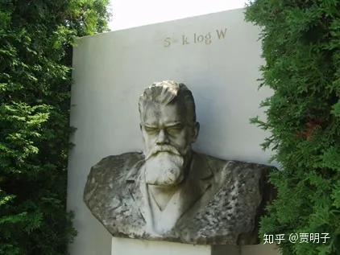
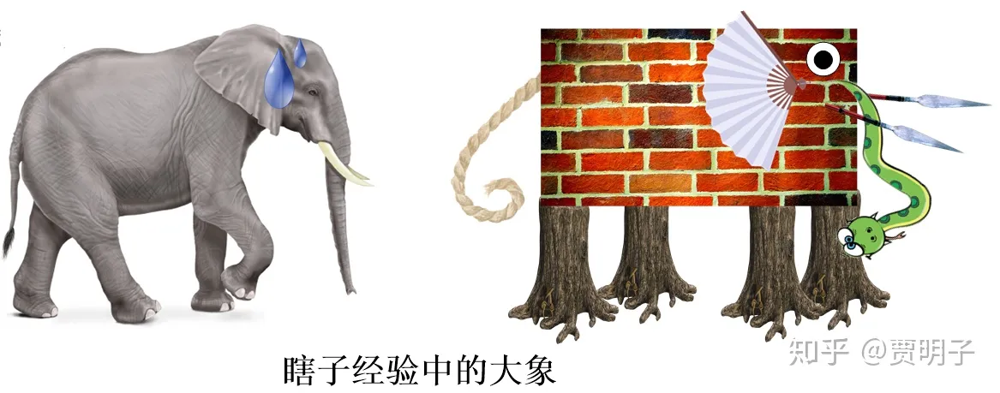

# 6、自然科学的实在和实证

> **“A theory can be proved by experiment; but no path leads from experiment to the birth of theory”**
> **“实验可以证实一个理论，但是从实验向着新生理论却无路可走”**
> **- 爱因斯坦**

1906年，风景如画的意大利Duino城堡，正在度假的路德维希•玻尔兹曼独自坐在桌前，妻子和女儿在海滩游泳，而他陷入了人生中最后的苦闷。

玻尔兹曼终其一生，是叛逆的一生，战斗的一生，然而他本人并不具备一般叛逆者那样战斗的特质。他为人谦和，和几乎周围所有的人，包括那些激烈反对他的人相处友好，他的妻子不无宠溺地称之为“甜蜜的小胖子”。然而在这样老好人般的性格背后，他的信念却比一般的叛逆者更加执拗：

> **“Speak the truth, write with clarity, and defend it to your very end.”**
> **“言物之道，述之若冰玉，捍之以生死”**

玻尔兹曼就是以这种姿态完成了他的一生。

原子，这个我们看起来无比熟悉的概念，在玻尔兹曼的时代，却只是一个“形而上学”的虚无缥缈的思辨。在物理学中并不被主流所接受。而玻尔兹曼却是悲剧式地信奉它的存在。在当时，自然科学中，牛顿建立的经典力学已经可以描述几乎所有的机械运动：天体、日常所见的物体、各种机械装置、小球、建筑结构等等，然而人们对“热”却并不甚了解。“热”被认为是与上述机械运动完全不同的另外一种物理现象，在迈尔、焦耳等人确立能量守恒定律以后，热它只是被认为是一类特殊的能量。热现象是“纯粹”的热现象。但是玻尔兹曼并不满足于此，他试图发掘这种“纯粹”现象背后的秘密：分子热运动。他试图把热现象归结为大量的像日常所见的乒乓球一样的、不停运动的分子的综合体现，并以此推出全部的热力学理论，并且试图完成一个更加不可能的任务：从完全可逆的动力学理论中找到不可逆的根源。

这个想法面临着一个巨大的困难，至少在当时主流的“纯粹”热力学的几个大佬看来是如此：从来没有人真的观察到过原子的存在，也暂时看不到任何能够观察到它们存在的可能。原子是一个没有直接**实证证据**的概念，一直以来只被认为是古希腊哲学家们思辨的产物，虚无缥缈。而科学难道不是以实证为基础的吗？对于一个看不见摸不着的原子，空谈它们的存在，甚至试图用它们来作为纯粹的物理理论的基础，不但毫无意义，而且危及到自然科学的基本信念，纯属叛经离道。

持这类观点的大佬，以马赫和奥斯特瓦尔德为代表，他们无法接受“原子”这个尚未被实证的概念。玻尔兹曼虽然也有一些支持者，但是却影响力甚微，他一直处在一种孤军奋战的境况。他的统计力学理论自建立伊始，就面临着激烈的反对和挑战。他一直都在与这些挑战做斗争。他完全乐于就那些具体的挑战展开讨论 – 并且其中有很多直至今天看来都非常具有意义的讨论，包括了他和他的好友兼反对者奥斯特瓦尔德的辩论 – 但是他无法容忍别人对他的漠视。这种漠视就包括了著名的马赫[[1\]](https://zhuanlan.zhihu.com/p/43371148#ref_1)，作为坚定的实证主义者，他认为原子论虚无缥缈，对之无视就是最好的态度。

于是，虽然他的理论可以很好地把热现象和动力学现象统一起来，但是作为挑战了传统经验的新生分支，玻尔兹曼的路依然越走越窄，他患上了抑郁症。在1904年的一次物理学学术会议上，似乎反对原子论的声音大获全胜，他已经像“民科”一样被完全忽视，弃如敝履。作为一个伟大的物理学家，甚至都没有被邀请参加物理学论坛，而只能在一个边缘的分会场“应用数学”上讨论自然哲学，期间他像一只爆发的公牛，激烈地抨击了拉马克的用进废退学说 – 它表面上是进化论的一类，但是和达尔文的自然选择学说完全相悖。

当你挖空心思想进入一个朋友圈，但是大家却一致地把你当空气，不带你玩儿，你就大概知道这种心情。这让他倍感沮丧，他累积的抑郁症更加恶化。

玻尔兹曼没有生在中世纪，当时并没有宗教裁判所，他也不会因为他的学说像伽利略那样被囚禁，像布鲁诺那样被烧死。但是，他仍然因为他的学说感受到了主流的压力。他无法回答这样一个问题：“你把原子放到了自然科学的基础位置，那么原子在哪里？我们有什么证据认为它存在？如果没有证据，你怎么证明自己不在胡说八道？”在当时，人们的知识水平限制了他们的想象力，对原子这样的微粒，没有人想象过有朝一日会能够得到直接的观察，因而它就是一个不可实证的概念。而自然科学的基本特征就是实证。马赫等人的质疑并非完全胡搅蛮缠。这种“拒绝谈论未经实证的概念”的态度，被称作**实证主义**。面对这种实证主义式的挑战，玻尔兹曼决定进入哲学界寻求答案，但是作为一个以数学立基、追求理论预言与实证的定量相符的科学家，他发现自己完全无法接受哲学家们那种流于思辨的思维方式。他这么说：

> ***“To go straight to the deepest depth, I went for Hegel; what unclear thoughtless flow of words I was to find there! ... Even in Kant there were many things that I could grasp so little that given his general acuity of mind I almost suspected that he was pulling the reader's leg or was even an imposter.”（“为了直达最深层的本质，我研究了黑格尔；我看的了什么？毫无思想的含糊不清的文字游戏！……甚至是康德，在他那里几乎我毫无所获，以至于我几乎怀疑他是在搞恶作剧或者干脆是个冒名顶替的骗子，虽然泛泛而言他的思想还算敏锐”）\***

他从哲学中寻求帮助的尝试又一次遭到重挫。这加重了他的抑郁。他开始恐惧，恐惧有那一天会突然“失去记忆，忘记了自己的思想”因而不再有生活的意义。随着他的精神状态越来越不稳定，不得不退休，离开他的学术研究。这让他感到绝望，除去研究他又有何意义呢？

于是，最终的时刻不可避免地到来了。

就在前面说的那个风景如画的古堡，绝望的他选择了自杀（这和海明威晚年因为无法写作而自杀如出一辙）。身体力行了“捍之以生死”的宣言。

玻尔兹曼的墓碑上，只有一行公式，就是联系分子运动和热力学现象的著名的**S=k log W**。这样的墓志铭，是一个科学家所能想象的最浪漫的诗篇。

然而，他所不知道的的是，就在他自杀离世的前一年，在他最彷徨的时期， 1905年，瑞士的一个名不见经传的专利局小职员，以一种石破天惊的霸气方式闯入了物理学：当时默默无闻的伟大的爱因斯坦接连发表了三篇论文，一篇开启了量子时代，一篇建立了相对论，而最后一篇，以布朗运动的研究实锤了原子的存在。对玻尔兹曼而言，1906年是黎明前最黑暗的时候，然而他并没有坚持到黎明的到来：就在玻尔兹曼亲手剥夺了自己的生命的同时，他所钟爱的原子成为物理界广泛接受的概念。

玻尔兹曼曾经说过，他最害怕的是死亡使他无法看到物理学后续的发展，但是最终他却以这样的结局谢幕人生，这不得不说是物理学史上最大的悲剧之一。

> ***“Ludwig Boltzmann, who spent much of his life studying statistical mechanics, died in 1906 by his own hand. Paul Ehrenfest, carrying on the work, died similarly in 1933. Now it is our turn to study statistical mechanics. Perhaps it will be wise to approach the subject cautiously. ”\***
> ***“穷其一生钻研统计力学的玻尔兹曼，于1906年亲手结束了自己的生命。艾伦费斯特继承了他的工作，于1933年同样步其后尘。现在，统计力学这块阵地轮到我们顶上去了。在进入这个领域之前，我们可能需要三思而后行。”\***
> ***- David Goodstein\***

应该说，玻尔兹曼的悲剧未必是全是因为他的学术观点不为大家所接受 – 并没有直接的历史文献表明玻尔兹曼的抑郁直接源自学术纷争，在他自杀之际也没有留下只言片语表明他选择这条不归路的原因。但是，我们有理由相信，他的抑郁以及最终的悲剧，至少部分地受到了学术纷争的影响。毕竟，在探寻这个宇宙的终极真理的旅途上，人类智慧会经历各种艰辛，我们甚至不止一次地把我们历经千难万险建立的辉煌的精神家园完全毁掉，然后在废墟上重建。在这个过程中，最终选择结束自己生命的也绝不仅玻尔兹曼一人[[2\]](https://zhuanlan.zhihu.com/p/43371148#ref_2)。在探索中，从人类智慧的最边沿进入到我们从未涉及的完全黑暗的领域时，一切都未知，面对马赫式的诘难，确实让人陷入一种无力感。这种无力感并不仅仅来自质疑方的压力，也会来自本人的困惑：一方面，面对未知，我们必须要猜想各种从未经验过的概念，很多概念至少暂时还没有任何可以被我们观察证实的可能，有些看似永远都没有被实证的可能；另一方面，缺乏来自实证的证据却让人寝食不安 - **一个我们完全无法实证的东西，是有意义的吗？我们所笃信的、但是尚未明证的东西，如何才算作可靠？理论之美和经验实证，哪一个才重要？**面对这样的终极困惑，玻尔兹曼选择了玉碎。每一个老好人背后都有着超出常人的固执和坚持，可能罗素的态度才算作最有平常心的吧：

> ***“我绝不会为了我的信仰而献身，因为我可能是错的。”\***

在这段历史中，在某种意义上马赫和玻尔兹曼其实各自代表了自然科学中的一种理念：**实证（Positivistism）**和**实在（Realism）**。它们的汉语翻译只有一字之差，但是含义却差之毫厘，谬以千里。在自然科学领域，两种理念在实际操作中看似非常相似，有很多的共通之处，但是从根源上两者不但不同，在很多时候甚至还可以说是背道而驰。

自然科学中的实在论秉承了形而上学的传统，寻求的是“什么是实在”这种终极问题的答案。在一个实在论者看来，在作为观察者的我们之外，独立地存在着一个客观实在。所谓客观，指的就是不依赖于观察主体。因而自然而然地，实在论者认为自然科学所探索的，是那种**不依赖于我们人类的客观实在自身的运动规律**。我们自然科学中的每一个概念，应该对应着某一种独立存在的客观实在或它们之间的关系；每一个描述，应该直接或间接地描述外部客观世界的某一部分；每一个定律，应该体现自然界本身的一个普遍运动规律。

这里的“实在论”，有别于简单的所谓的“朴素实在论（naïve realism）”。在朴素的实在论看来，外界一切都是独立存在的，并且它们的存在就是我们所看到的。比如说一个苹果，它是红色的，圆的，香甜的。这些现象就是客观存在的苹果的一切：“红”、“圆”、“香甜”等等。但是，物理学揭示给我们的却远非如此：例如红色其实对应的是某种特定频率的光波作用于我们眼底感光细胞所产生的电信号。并且，只有在包含了红光的光线照射在苹果上反射入眼，才有可能使我们产生红色的感觉。因而红色并非是苹果的存在形式，而是苹果、照射苹果的可见光、以及我们眼睛、神经系统的共同结果。说到底，我们观察到的关于苹果的一切现象，并非是苹果，而是苹果**对我们的影响** – 苹果与我们的相互作用。因而我们对苹果的经验仅仅是我们对苹果的主观接收。对此罗素说：

> *“Naive realism leads to physics, and physics, if true, shows naive realism to be false. Therefore naive realism, if true, is false; therefore it is false.”（朴素实在论导致了物理学，而物理学 - 如果是正确的话 – 则揭示了朴素实在论是错误的。所以说，朴素实在论如果正确的话，那么它是错误的。所以它只能是错误的）*

现代自然科学的实在论认为，任何观察行为都是主观个体与被观察的客观实在的相互作用。我们所观察到的现象，都是这种相互作用对我们的影响。我们的感官系统本身也是一些客观的存在，我们可以把它们看作是某种特殊的仪表，它们根据与被观察的实在之间不同形式的相互作用而传递给我们不同的主观感受：

- 眼睛有一套光学系统可以捕捉光波，有一套感光系统与被捕捉到的光波发生相互作用，被光波激发产生神经信号，最终被主观诠释为明暗、颜色；
- 耳朵有一套振动的传递系统，通过这个传递系统与外界振动的相互作用可以把机械振动传递、放大，又一套传感系统通过与机械振动的相互作用，被振动激发产生神经信号，最终被主观诠释为声音的大小和声调的高低；
- 鼻子和舌头有一套化学系统，可以与某些特定的化学结构发生化学反应，根据化学结构的不同引发的不同的化学反应，激发不同的神经信号，最终被主观诠释为酸甜苦辣咸；
- 皮肤有一套压力传感系统，与外界直接接触的物体发生相互作用，被压力的变化激发产生不同的神经信号，被主观诠释为触觉，它还有一套热量传递的传感系统，被吸收热量或散失热量所激发产生神经信号，最终被主观诠释为冷热。

我们在前面曾经提到过，在形而上学中，我们周围的现实世界**（reality）**可以从“**实在（being）**”和“**现象（phenomenon）**”两个角度来划分。“实在”指的是完全在我们观察者之外的，与“观察者是谁”、“以何种方式观察”无关，它是一种完全独立的存在。即使是这个世界上不存在任何有意识的、乃至于有观察能力的生物，它仍然以它不变的形式存在着。例如，太阳并不会因为没有人观察它就不再是太阳了，假使地球上没有任何生物，太阳仍然是那个太阳，不会因此而改变。而现象则是我们观察者对这种独立的存在的感官和主观接收，它是客观实在通过我们的感官表现给我们的感受。现象必须是能够被我们的感官所接收、被主观所诠释的信息：眼镜可以看到的颜色、耳朵可以听到的声音，舌头可以尝到的味道，鼻子可以闻到的气味、皮肤可以感到的触觉和冷热。比如说，太阳这个存在表现在我们人类的感官中是圆的、光亮的、热的等等。

然而，在我们五感之外，我们就没有任何办法感知外界的客观实在了 – 即使外界仍然有各种丰富多彩的其他形式的信息，我们受限于我们的硬件系统，也都不可能做出直接认知；同时即使是我们的五感可以感知的信息，又要经由我们的软件系统（大脑）的诠释，成为我们可理解的概念，这些概念和那些“裸的”五感信息有有所不同。因而我们的感官和主观就是一层滤网：它所能够感受的信息可以通过这个滤网而到达我们的大脑，而其余的关于这个客观现实的一切信息都不能被我们接收 – 就好像一个先天的瞎子无法理解颜色、一个先天无味觉的人无法享用美食一样。我们所观察到的现象，其实是外界同与我们相互作用而对我们的影响，我们通过这种影响管窥到的现实的一斑，它体现了客观现实的存在和变化，但是同时又是一种被过滤的、不完全的信息。

既然我们的经验来自外界对我们的影响，那么这个影响必然就会有一个主体：是什么东西对我们产生了影响？这个主体就是客观实在。我们的观察，最终都是客观现实表现在我们眼前的现象的一部分，观察到的现象就折射出客观现实的状态和变化。根据我们对现象的观察结果，我们就可以对客观现实做出描述，并且这种描述就间接地体现了客观实在的变化规律。

这个在“现象”背后的“实在”，唯其独立于观察者，因而它“本质上是什么存在”就和观察者无关，也就是说它不能用观察者的感官经验来表述，所以它是抽象的、不可名状的 – 所谓“名可名非常名”；而“现象”则是我们可以直接感受的经验，和我们的感官以及主观诠释是一体的，从某种意义上说它是属于实在和观察者两者共有的性质，因而它是依赖于观察者的、具体的。并且根据不同的观察者可能会有所不同。

我们也可以通过制造更加精密复杂的观察仪器，来捕捉现实的更多信息，把那些我们感官所不能接受的东西，转化成能够接受的东西，来使我们获得对客观现实更全面的了解。比如说我们的五感并不能直接感受到红外线，但是我们通过特殊的感光系统，通过红外摄影把红外照片变成我们可以看到的可见光图像，因而我们就能间接体验红外线的变化。从本质上讲，这是一种拓扑映射的过程：把客观实在的变化与我们的五感建立起一一对应的关系，因而我们就可以通过五感来理解五感之外的信息。从这种角度看，我们的观察仪器都是我们人类五感的延伸系统。

那么，持有实在论的自然科学家的态度就很明显了：首先，存在着某种独立于观察者的客观实在；其次，我们的经验所能把握的，是这种客观实在通过主客体之间的相互作用表现给我们的现象；第三，现象对应着实在，对现象的把握间接地实现了对实在的认识。最重要的，也可以说是实在论的自然科学家的最终极信念，就是自然界中的一切实在都遵循着**不依赖于我们人类的自身的运动规律，这个规律是客观的、至高无上的、至简的**。绝大多数科学家（包括了很多反实在论者）对这一点都有着一种类似宗教般的信仰。

这是一个非常符合我们直觉的认识体系。但是现在问题来了：既然我们只能感知客观实在对我们的影响，而无法直接感知它本身，那么，那个能够被我们经验所认知的“现象”背后的不依赖于我们的客观现实 – “存在 （being）”到底是个神马东东？说到底，当我们说“现实世界如何如何”的时候，我们其实在说“我观察一个现象如何如何”。比如说，我们说“后院的玉兰花开了”，我们所能肯定的只是**我看到**这样一个现象，我作为一个观察者，接收到了这样一幅画面：一颗被称作玉兰树的植物开了若干白色的花朵。但是我们并非下一个断言，说存在一个不依赖于我们的后院，以及一棵不依赖我们的玉兰树。事实上，我们戴上VR眼镜，同样可以观察到一模一样的现象，我们能说存在一课玉兰树吗？我们的感官难道不是一副这样的VR眼镜吗？

在电影《黑客帝国》中，描述了这样一个场景，当Neo第一次知道自己一直存活在电脑所模拟的一个虚拟世界中时，震惊万分，他和Morpheus有这么一段对话：

> *- **NEO:** 这（这个虚拟世界）不是真实的？*
> *- **MORPHEUS:** 什么是真实？你如何定义真实？如果你指的是你能感受到什么，闻到什么，尝到什么以及看到什么，那么真实只不过是一些被你的大脑诠释的一些电信号而已。*

的确，这种电信号可能来自一棵后院的树，也可能来自VR眼镜的屏幕，还有可能来自某高级生物设计的一套虚拟世界的电脑软件，对我们而言没有区别。我们所能确知的只是现象 – 我们感知到什么，而无法确定现象背后的“实在” – 感知之外存在着什么，因为它超出了我们的感知范围。何为“存在”？

柏拉图说，“理念世界高于感官”；

康德说，“物自体无法被认知”；

老子说，“道可道非常道”；

公孙龙说“白马非马”；

……

一个原则上不能被彻底认知的“客观实在”，有意义吗？**对一个现象的描述，我们可以判断“真（True）”或“假（false）”**：我们把我们所观察到的现象与这个描述像对比，相符即为真，不符即为假。但是我们却无法判断这个现象是“真实的（real）”还是“虚幻的（illusion）”，因而**对一个“客观实在”的描述，我们就无法判断其为真还是为假**。在我们的第一章和第二章中对此已经有了很多的探讨，这里就不再展开了。因此，试图表达对客观实在的形而上学式的判断，是毫无意义的。

这，就是实证主义的核心理念。

如果说自然科学中的实在论有着传统形而上学的传承，那么实证主义则有着鲜明的传统经验主义风格。它认为，人类的一切知识来源于经验，那是一种人们对自然现象的直接感官体验。对于经验的描述我们是可以把握的，我们可以通过实证来判定它的真假，因而是有意义的描述。然而对于形而上学的“存在”的描述，则没有任何手段来判定真假，因而说了也是白说，纯属浪费精力，没有任何意义。基于这种理念，实证主义要求科学只陈述对现象的判断，并且认为科学的规律仅仅是我们对我们所经验的现象的总结和归纳，而不应该涉及到任何不可观察的“客观存在”。自然科学的一切研究对象都是现象，而至于现象背后有没有一个“客观实在”在驱使，是的，可能是有的，但是那又如何？反正你也不会知道，**试图对客观实在做出描述的行为本身不是一个错误，但是比错误更加荒谬。**一个错误的描述我们至少还可以对它做出判定的，而这个，连错误都不算。“This is not even wrong！”

实证主义发端于经验主义，并且在大约100年前开始进一步形成了所谓的**逻辑实证主义**。逻辑实证主义的发起者，“维也纳学派”，基本上都是一些科学家出身的人，在对传统哲学产生反思后，试图从自然科学成功的灵感出发寻求哲学的新意义，并且将一切学科“溶解”于自然科学之中。他们把自然科学的实证原则推广到极致，摈弃一切不能通过直接观察来实证的概念，把严格的逻辑作为形式（康德的“分析判断”），直观的经验（康德的“综合判断”）作为内容重铸人们的知识体系。在他们看来，传统的哲学走入了一个死胡同：它所追求的对“存在”的理解注定没有答案，因而我们应该把我们的好奇心从“**存在着什么**”转移到“**我们认识到什么**”上来，从**“事物如何运动”**转移到**“我们观察到何种运动”**上来。这就推动了后来的分析哲学和语义哲学 - 甚至走得更远，认为所有的价值理论（美学、伦理学、政治学等等）都是在谈论不可实证的东西，都应该推倒重新用自然科学的方法来改写。关于价值理论的部分我们在这里就略过不谈了。

逻辑实证主义的两个核心原理就是这种理念的直接结果，一个是**可验证原理**：一个论断当且仅当可以被经验直接验证时才有意义；另一个是**对应规则**：科学理论必须包含一个形式的公理体系（类似于欧几里得几何）和一个把直接经验与理论的抽象概念一一对应的规则。

这样一来，逻辑实证主义把科学理论中的概念分为**可观测量**和**理论量**。前者是可以直接被观测和测量，而后者，虽然不能直接被观测，但是必须可以被还原为可观测概念。这就是在前面马赫和玻尔兹曼的故事中，马赫为何那么反对原子论的原因：在当时，原子无法通过任何手段与某个可观测量相印证。

我们可以用一个喜闻乐见的寓言来类比它和实在论之间的不同：瞎子摸象的故事。我们人类就像是那些可怜的摸象的瞎子，限于自己的感官，永远不可能了解“真正的”大象到底是什么样子，只能凭借着自己能理解的经验来拼凑我们对大象的理解：象牙像长矛，象腿像树干，身子像堵墙，耳朵像扇子，尾巴像绳子，如此等等。这样一来，瞎子们建立的“大象”的理解模型在一个明眼人看来就非常可笑。

在实证论看来，瞎子是不可能知道大象看起来是什么样子的，对他们而言，触觉是他们唯一可靠的知识来源，其余一切都是妄谈。因而他们只能谈论摸到了什么，但是不能谈论大象是什么。因为他们不可能知道大象看起来是什么样子的 – 他们没有眼睛[[3\]](https://zhuanlan.zhihu.com/p/43371148#ref_3)。如果这时候对这头大象强行脑补，自然就会十分可笑。更有甚者，我们作为这个故事的读者，作为明眼人，其实是开了“上帝视角”的，我们知道大象的存在、以及大象的样子。但是故事中的瞎子们并没有什么开了上帝视角的人去告诉他们大象是否存在、以及他们的认识是否正确。他们不知道大象“看上去”是什么样子，他们甚至不知道有“看”这种感官。对他们而言，大象的“真实”存在是一个完全抽象的东西，是否有这样一个存在，他们都没有办法确定。因而谈论这个作为“客观实在”的大象也就毫无意义。如果这时候有人说，我摸到了一些东西，是因为有一个大象在那儿让我去摸。那么，实证论就会这样怼回去：“是啊，是有可能有一个大象在那儿，可是关于这头大象的一切判断我们都不知真假，谈论它和不谈论它又有何区别呢？那么它存在和不存在又有何区别呢？”

那么，我们总结一下，在自然科学中，实在论和实证论之间在理念上的根本区别：

**实在论：科学通过对现象的描述来完成对客观现实的描述；**

**实证论（逻辑实证主义）：科学就是对现象本身的描述，客观现实毫无意义。**

这两种思想虽然不同，但是在自然科学中的践行之中，所表现出来的行为却是一致的，当然，如果它们在实践中表现出不同的行动纲领，那么它们也就不可能同属于自然科学这个学科了。

**首先，两者都认为实证是检验自然科学的最根本的准绳**：一个科学理论正确与否，完全取决于它与我们对现象的观察是否一致；科学理论最终必须要考实验或观测来检验。但是对于实证纲领的态度，两者却不同。实在论者认为，我们观察到的现象是客观实在在我们感官上的一种映射。观察者本身，也是客观实在的一种存在形式，也满足同样的客观规律。那些看似依赖于观察者感官的现象，如果我们能够对观察者本身的客观规律做出分析，原则上是可以被还原（或逼近于还原）成为一种不依赖于观察者的客观现象的。对现象的观察是我们把握外在世界的唯一途径，因而实证有着最高的判定权。但是，实证是判定标准并不意味着我们所追求的对象就仅限于实证，反之，我们追求的是实证所揭示的客观世界的性质以及客观的运动规律 – 实证只是一种检验手段。而实证论认为，自然科学描述的是、也只能是现象本身，现象背后的实在对我们而言并无意义。自然科学已经发现在微观世界里，我们观察到的现象完全依赖于观察行为，（量子力学中的“坍缩”，这个我们后面会详细讲到。）而我们惯常所理解的客观的实在是不存在的。那么一切就顺理成章了：我们所追求的对象就是现象本身，因而对现象的实证当然就有着至高无上的地位。“客观规律”？它是否存在也并无意义，我们所看到的规律性，并不意味着自然界遵循着这样一种规律，而是我们创造出来的一种理论框架来对现象进行描述的手段，定律不是被发现的，而是被发明的。也就是说，实在论者认为自然科学的**对象是定律，而实证是手段**；反之实证论者认为，**对象是实证，而定律是手段**。[[4\]](https://zhuanlan.zhihu.com/p/43371148#ref_4)

**其次，两者都对理论预言极其重视。**在实在论者看来，对未知现象的预言比对已知现象的解释有着更高的实证力。这一点我们在上一章节中有所涉及：一个理论对未知现象的成功预言，和对已知现象的成功解释，前者显然比后者更加能说明问题，因而它就提供了一种更强的理论证据。还有，理论预言是自然科学发展和向外扩展的有效手段。最后，理论预言是我们的理论所能产生的实际效果。但是，在实在论者看来自然科学是一种**解释性的科学**：它的本质是为我们提供一种对外在世界的解释，实际效果只是一个附加效果。预言十分重要，它使得理论的基础更加牢固、更加容易发展、并且理论更加有用。但是预言并非根本目的，自然科学是我们对自然界的理解。就像是费曼所说：

> *“科学就像是啪啪啪，没错，它可以结出硕果，但那不是我们做它的原因。”*

而在实证论者看来，自然科学是一种**预言性的科学**：它的本质就是为了提供一种对将来的洞见性，至于它是否“解释”了客观实在，我们不知道，我们所知的全部，就是它的预言与我们的观察现象相符或不相符。极致的经验主义者连因果论都不承认，何谈“解释”二字？而一种极致的实证论者则干脆认为，自然科学就是我们提出预言的一种工具而已，这个被很多实在论科学家们轻蔑地称之为**“工具主义”**。

**最后，两者都认为在同等预言或解释效力下，一个简洁的理论要优于复杂的理论。**说到这里，我就不得不提到著名的“奥卡姆剃刀原理”。这个原理认为，一个理论中，如非必要（产生可验证的差别），不应该增加理论的复杂性。比如说，我们可以认为，自然规律是神的意志，自然界的一切都按照神的意志、因而就按照自然规律运行。但是在这里，“自然规律是神的意志，自然按照神的意志而动”和“自然按照自然规律而动”两者相比，在实际结果上没有任何区别，但是前者却多了一个“神”的参与，因而它是多余的，按照奥卡姆剃刀规则，就应该被剃掉。这作为一个科学家普遍认同的观点，在自然科学的发展过程中曾经起到过巨大的作用（例如相对论对“以太”的态度、量子力学对“隐变量”的态度等等）。

在实在论者看来，这是一种形而上式的终极法则：存在着这样一种客观的自然规律，它是简单的，一切复杂运动皆可还原到它上面。诚然，实在论者认为自然界的一切都是由微观粒子组成，这些微观粒子有其自身的性质，因而由它们所搭建起来的整个宇宙的性质必然可以归结到这些终极的组成模块的性质上去。这样一来，一个复杂的自然界必然是可以由一个至简的理论体系来描述的。无数的科学家都怀有这样的一种美学信仰：大道至简，定律是美的。例如狄拉克曾经说：

> *“God used beautiful mathematics in creating the world”（上帝以至美的数学创世。）*

而实证论者则认为，按照实在论的逻辑，所谓的终极自然法则是否存在本身就是无法实证的，假设存在一个客观法则，和不做这个假设，从理论上预言上讲没有区别，因而“至简的法则”这个概念本身也需要被奥卡姆剃刀剔除。既然不承认存在着这样一种至简的法则，那么为何还要追求理论的简洁性？主要原因有两个。一个是 – 正如我们上一章所讲的 – 简洁的理论有更高的实证力。对一个现象，相比一个极其复杂的解释理论，一个简单的理论显然更加有说服力。理论的简洁性不过是实证的要求罢了。另外一个是，既然理论是预言的工具，那么简洁的理论显然要比复杂的理论更加好用。从工具主义出发，一个好用的工具当然要比一个不好用的工具更加优越。

不论是实在论，还是实证论，都是对自然科学的哲学观点，而非自然科学本身。自然科学作为人们对世界的一种认识，它本身其实包含了底层的哲学观点，这些哲学观点是科学家们从事科学研究的信念支柱，但是却并非科学研究本身。对待这种哲学信念，爱因斯坦曾经说过，

> *“‘The physical world is real.’ That is supposed to be the fundamental hypothesis. What does "hypothesis" mean here? For me, a hypothesis is a statement, whose truth must be assumed for the moment, but whose meaning must be raised above all ambiguity.” （“‘物理世界是真实的’，这是一个根本性的假说，但是‘假说’是何意义？在我看来，一个假说就是这样一种论断：它必须暂时被假定为真，但是它的含义却不容含糊。”）*

那么，“物理世界是真实的”这个假说，到底有没有必要？它的存在与否，对科学本身能不能产生有区别的影响？如果不能，我们就可以本着奥卡姆剃刀的原则，把它剔除。也就是说，对一个科学家而言，如果剥离了他的这种哲学理念，单纯看他在研究过程中所遵循的实际行为准则，不论他这些准则的动机从何而来，这些准则是否都是一致的？我们看到，科学家们 – 不论是实在论者还是反实在论者 - 都以实证为最终检验标准，都以理论预言为更高的实证证据，都追求简洁的理论体系。总而言之，都在践行我们前一章节所说的“科学方法”。那么，从实际的角度上看，这种不同的哲学理念对科学研究的影响何在？是否说，它们只是影响了人们对科学理论的**诠释**，而对科学理论本身的影响，却是没有区别的？

其实是有区别的，区别就在于“理论之美”。

前面我们看到，实在论有一种近乎信仰的形而上学传承：规律是客观的，大道至简。因而科学家们在不断追求优美的科学理论，并且不断地试图把这些理论统一在一起，把不同领域的理论不断还原至最底层那个终极理论。早在经典物理学时代这个过程就不断发生：从最早的天文学与力学之间的融合，到电磁学与化学之间的融合、热力学与动力学之间的融合、电动力学与时空观以及引力理论的融合、生物学与化学之间的融合、分子理论与固体理论的融合，一直到现代科学人们仍然在努力的微观与宏观的融合、大一统理论的探究等等。都在寻求那个位于最底层的终极法则。这一行为本身，都在基于一个假设，这个自然界**至少**有一个东西是真实存在的，就是这个终极法则。如果说科学界中的“左倾”（倾向于实在论）和“右倾”（倾向于实证主义）有一个最大交集的话，可能就是这个了。

然而我们并不能确知，自然界就是可还原的，终极法则是存在的。经验主义以及作为经验主义的传承者实证主义是**非形而上学**的 – 如果我们不把它们叫做**反形而上学**的话。它反对这种陷入对这种抽象的“存在”的纠缠当中。因而，对人们孜孜以求至简的大道这种行为，它会认为这是一种执念。没错，简洁的理论是好的，但是我们不应该把它至于至高无上的位置 – 至少它应该服从实证原则。也就是说，如果实证过程中发现有更简洁的理论，我们很高兴采纳它，但是在没有实际证据证明这样的理论存在时，我们不应该预设这样一种前提。

回到我们开头讲到的玻尔兹曼和马赫的故事。玻尔兹曼心心念念，要架起一座从微观到宏观的桥梁，并且真正地做到了用生命来践行他的理念。作为一位伟大的物理学家，他自然知道并且认可实证对整个自然科学的重要性。可是即使如此，他仍然笃信那个在当时完全没有实证证据的、看似虚无缥缈的“原子”，是因为在实证之外，他的心中还有着另外一个信念：**还原。**

我们在前面的章节中提到过还原论。还原论中，任何复杂的表象都可以被看做是由简单的底层运动规律所决定的；而底层的运动规律，则是它更底层、更简单的运动规律的表象。以此类推，我们宇宙间的万物，最终都遵循着相同的底层运动规律，而最基本的规律，是普适的、简单的。

基于这个信念，玻尔兹曼不满足于把热现象看做是与机械运动完全不同的两类物理现象，在他看来，宇宙间不应该有两种截然不同、井水不犯河水的运动形式，它们一定可以被归结为某种更加普适的规律。这是一种带有鲜明的形而上学和理性主义风格的信念：**物理表象之下，是普适的、不变的、至简的规则**。

作为实证主义信徒的马赫，是绝不能容忍理论中出现不可实证的概念的 – 原子就是这样的概念。一切理论实体，要么是可直接验证的，要么是可与直接验证相挂钩的。哪怕原子作为一个假说提出来以后，能够极大地简化物理学体系 – 它把热力学和动力学融合为一个统一的学科，因而有着动人心弦的美感 – 也是不能容忍的。在马赫看来，为了实现一个虚无缥缈的理论之美而引入了不可实证的概念，是本末倒置之举。“理论之美” – 正如我们上一章所言 – 是一个价值观领域的概念，是不可实证的，它本身不是科学应该关心的事情。而显然，玻尔兹曼持有相反的看法，引入一个不可实证的假设而极大简化理论体系，显然是一种有益的尝试 – 当然，在原子能够被实证之前，我们也可以姑且把这种尝试当做“假说”而不是一个真正的“理论”。这就典型地反映出两种思潮的激烈碰撞：

- 科学应该只谈论可实证的概念，一切不可实证的东西都无意义。
- 科学应该谈论真实的物理世界，实证是手段而不是目标。在保持理论预言不与实证相悖的前提下，以少量的不可实证换来极大的理论简化是值得的。

这，就是两种不同思潮对科学行为产生的不同影响。

历史上，逻辑实证主义从100多年前从旧经验主义中发端，迅速成长，成为雄霸20世纪上半叶自然科学的主流哲学思潮，但是很快人们发现它也有很多自己的问题（例如可观测量-理论量的区分问题）。而实在论在一开始被实证论一通猛攻之后，后来渐渐坚持下来，开始重新夺回阵地。这种冲突在量子力学中表现得尤为尖锐。其中最鲜明的一个实在论者就是爱因斯坦，他像是一个令人肃然起敬的、有着一切传统美德的守旧的老绅士，恪守着对“实在”的敬畏。而他的反面，以玻尔为首的一大票哥本哈根学派的科学家，则更像是一群精力充沛、标新立异的大男孩，力图打碎传统的一切，叛逆是他们的标签。100年以来两者的冲突仍然没有平息。尽管现代的人们倾向于把“守旧”看作是一种政治不正确，而把“叛逆”当做是一种美德，但是这种价值领域的倾向性不应该被代入自然科学。到底是爱因斯坦又一次捍卫了传统的崇高理想，还是玻尔他们成功地宣告新时代的诞生？孰是孰非，人们仍然等待。而他们之间的爱恨情仇，将是本部分后面大篇幅涉及到的

在我个人看来，我会更喜欢实在论。这并非是因为我像极致的实在论者那样，有一种对形而上学的“存在”的信仰，而是因为，我喜欢实在论所提供的**更加开放的可能性**：理论不仅仅是我们的经验，还有更多的可能。

要知道，历史上重大的科学变革往往是由实证引发的 – 发现了现有理论无法解释的现象、或者与现有理论相矛盾的现象，因而导致现有理论的崩溃。但是从旧理论到新理论的进化，却绝非实证完成的。如果我们从已有的观察数据出发，并且把自己的想象力局限于这些数据当中而绝不越雷池半步，跨入那个我们未能实证的领域，甚至跨入那个看不到能够实证的任何可能的领域，那么我们的理论将被自己束缚死。要知道，看不到实证的可能性，并不代表这永远看不到实证的可能性。随着理论的进步，一开始原则上不可实证的概念完全有可能变成原则上可实证、再变成现实中可实证。

真正能够完成一个新理论的，不是实验数据，而是在实验数据基础上的**想象力**。费曼说：

> *“科学是在一件束缚衣里面的想象力。”*

此话怎讲？科学的想象力是受到严格限制的想象力：它必须与现有的一切已知现象相容。人们已有的发现已经把你的想象空间压缩到一件束缚衣里了，是你想象力的边界。但是，在我们完全未知的领域，想象力却是驱动我们进步的源泉。而在这个未知领域中，为想象力掌舵的，就是人们对物理定律的信念。而实在论正提供了这样一种信念：大道至简。

Anyway，这只不过是我个人喜好。对于实在论和反实在论这两者，应该说暂时我看不到一方能压倒性地驳斥另一方。

下一章：[贾明子：7. 数学是真理吗？古典柏拉图主义的困境](https://zhuanlan.zhihu.com/p/45665906)

上一章：[贾明子：5、科学无权威](https://zhuanlan.zhihu.com/p/42256676)

专栏传送门：[何为现实？拉普拉斯之妖与薛定谔猫之决战](https://zhuanlan.zhihu.com/c_186387023)

------

## 参考

1. [^](https://zhuanlan.zhihu.com/p/43371148#ref_1_0)一个比较奇怪的事情是，玻尔兹曼为人随和，和周围的人关系融洽，哪怕是对他的理论激烈反对的，都有很多好友，但是唯独极其厌恶马赫。
2. [^](https://zhuanlan.zhihu.com/p/43371148#ref_2_0)事实上统计力学和热力学可能是人类思维中最具挑战的领域，其中著名人物自杀率极高，除去玻尔兹曼和他的学生艾伦费斯特，还有热力学第一定律的先驱Mayar，化学热力学创建者Lewis，还有就是著名的图灵，除去其数学成就，他还是morphological thermodynamics的创始人。 此外，还有一些不那么出名的人，例如Haber一家三口（物理化学领域），James（精神生物热力学），Weinninger（人类化学热力学），Adams（分子热力学）等等。
3. [^](https://zhuanlan.zhihu.com/p/43371148#ref_3_0) 世间万物各种各样的相互作用，我们人类感官所能利用的仅仅是区区几种，从这个意义上说，对这个自然界我们就是瞎子。
4. [^](https://zhuanlan.zhihu.com/p/43371148#ref_4_0)我们必须注意到，这是一种比较极致的实证论看法。而在现实中，科学家们并非持有非此即彼的哲学观，更加普遍的情况是，大家都是这两种思想的混合体，不同的只是倾向性而已。虽然很多科学家认为独立于观察者的客观实在本身虚无缥缈，但是他们绝大多数却认定自然规律是存在在那儿然后被科学所发现的，理论的具体形式虽然包含了人们的创造性（发明行为），但是理论揭示的是规律，而不仅仅是一种现象的表达手法。从某种意义上说，任何一个科学家都或多或少地是一个实在论者，也同时或多或少是一个实证论者。

发布于 2018-08-30 18:42・IP 属地未知

