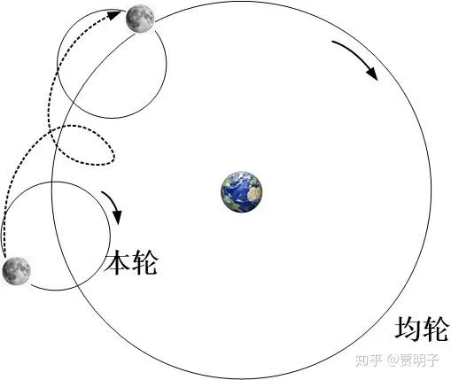
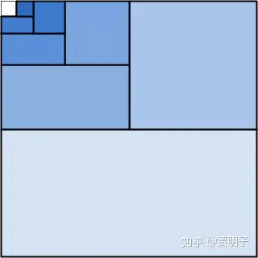

# 7. 数学是真理吗？古典柏拉图主义的困境

> **“God made the natural numbers, all else is the work of man”**
> **“自然数是上帝的造物，其余一切皆出于人手”**
> **- Leopold Kronecker**

下面我们来看看一个与科学密不可分的学科，数学。

什么？“与科学密不可分”？难道数学本来不就是科学的一部分吗？你可能会这样问。

的确，数学在我国初等教育中，作为“理科”之首，一向有“数理化”的合称，似乎理所当然地属于科学，并且是科学中最重要的学科。在国外，也会把数学和其它的实证科学相提并论，例如所谓的STEM的说法（Science，Technology，Engineering，Mathematics，科学、技术、工程、数学）。在某些情况下，人们的确倾向于把数学和逻辑学看作是科学的一个组成部分，但是，从“实证”这个科学的基本准则来说，数学的确不能算作是科学。因为数学从来就不是以实证为标准的学科。数学所研究的对象，从来就不是一个实在的、具体的事物。比如说自然数、函数、矢量、没有宽度的直线、不占空间的点等等，虽然我们可以用它们来对物理实体进行描述，但是这些数学实体我们在现实世界中是观察不到的：你能想象你看到、触摸到一个实际的函数吗？它们不存在于我们的时空中，而是存在于我们的概念当中；它们没有形体、不能与物理实体发生实际的因果关系，是属于纯粹的“抽象世界”中的实体。数学原理也不可能通过我们的观察得以验证：2+3=5，我们知道它是正确的，但是，我们对它的认识却不是通过穷举所有的2个事物和3个事物然后通过数一数总数来来获得的 – 任何两个事物和三个事物放在一起，我们不必真的去数一数就确定知道它一定是五个。

人们倾向于认为数学是科学的一部分，是因为数学和科学之间的关系如此密切，密切到难分彼此。它们很相似，因为它们似乎都是“客观的”：有一个不依赖于个体的普遍的标准。一个数学或科学论断，它要么是真的，要么是假的，不会随着张三或李四对它们进行判断而有所不同。并且，自然科学中的几乎每一个定律都是用数学表述的；而反之，数学的每一个领域，几乎都在自然科学中有所应用。历史上因为数学促进自然科学的发展和因为自然科学而促进数学的发展的例子比比皆是。但是它们又有着显著的不同。这些不同可以表现为这几个方面：

1、 我们知道，自然科学的研究对象是在我们这个时空中存在的具体事物：宇宙、天体、生物、化学物质、微观粒子等等。尽管大家仍然有着实在论和反实在论的争论，但是无疑科学的基本研究对象都是那些通过我们感官获得的现象的性质、变化以及规律。但是数学**本体论**对象是什么？它们不在我们时空中、不能和具体事物发生相互作用、纯抽象。这些数学对象又是些什么东东？它们是独立于我们而真实存在的吗？如果是，那么这些纯抽象的事物不通过与我们的因果关联又是如何被我们认识的？如果不是，我们为何会认为它们是真的或者假的？

2、 因而，这就产生了**认识论**上数学和自然科学的的截然不同。我们知道，在自然科学中，一切论断都可以通过实证方法来判定真假：我们可以做实验、做观测，结果是什么就决定了我们论断的真假与否。然而在数学中，我们无法对这些纯抽象的实体做出实证，那么又是什么使人们判定它们的真假呢？并且，与自然科学的真理不同，数学原理不但可以判定为真，而且它可以判定为“**必然真（necessarily true）**”。我们说，自然科学的真理是有不确定性的，它们只能是“**偶然真（contingently true）**”：我们说一个科学原理为真，归根结底是因为它符合我们的经验，而我们总是可以通过进一步的观察来检验它。比如说我们总是认为能量守恒是一个真理，是因为我们从未发现能量不守恒的现象，但是我们完全可以想象，在下一次的实验中，能量不守恒的结果真的会发生 – 这是一个逻辑上完全可能的事件。但是，对于2+3=5，我们完全不能想象下一次我们看到2个人和3个人在一起后总数不是5个人，它似乎不可能是错误的！这又是为何？

3、 进而，在研究的**方法论**上，自然科学因其终极来源是实证，因而严重依赖于**归纳法**：对已有经验的总结和推广。自然科学的每一个定律都是对人们的过往经验 – 人们的观察结果 – 总结、提炼、推广而来的。而数学则不然，这种归纳和推广（不完全归纳）在数学中是没有地位的：它是不可靠的。因而数学是在几个“必然为真”的公理基础上，用**演绎**的方法推演出来的。公理在直觉上绝对可靠，演绎在方法上绝对可靠，因而就保证了数学的确定性和必然性。

4、 那么数学直觉又是什么？公理的可靠性，数学真理的“必然性”，是因为逻辑的必然要求的吗？违背它是我们的基本逻辑所不允许的？数学是我们自己人为规定为正确的，因而它必然是正确的？还是因为数学本身就是我们的大脑先天的思维框架，因而违背它就必然违反我们的先天直觉？数学和逻辑是什么关系？数学和我们的主观思维又是何种关系？

5、 不论如何，数学为何能够在自然科学中做到如此丝丝入扣？数学概念和我们的经验有何关系？数学和实证科学又有何种关系？

凡此种种，都是关于数学的基本哲学问题，是人们历几千年来一直在探寻而终难解惑的迷思。关于数学的哲学，又被称为**数学哲学（philosophy of mathematics）**。我将在下面几章来试着把人类的探索历程捋一遍。

我记得你在小学四年级的一节数学课上，你们的数学老师为了鼓励你们对数学的兴趣，曾经跟你们说，数学是一种先天就存在在你们“知识库”中的知识，你们对数学的学习过程，就是你们“回忆起”或者“重新发现”这些知识的过程，而不是你们获得新知的过程。可能是你当时正在看《苏菲的世界》中关于休谟的故事吧，你立即站起来表示你的经验主义立场，结结实实地怼了老师一把，把一堂数学课变成了尴尬的哲学课。在那时，你就已经开始了对数学哲学的思考，这些年过去了，你的思考有没有什么进展？我保证，你看了这几章后会大呼过瘾。

应该说，你的数学老师还是很有一些哲学思想的，这在我国实用主义倾向明显的初等教育中难能可贵。数学老师的这种看法，叫做**“柏拉图主义”**。

众所周知，柏拉图的一个基本哲学思想就是，这个世界的本体论存在分为两个部分，**“现象世界”**和**“理念世界”**。我们在第二章“存在”中曾经提到过他的这种观念。在柏拉图的二重世界中，现象世界是表现在我们面前的、可以被我们的感官直接感知和认知的现象的总和：外部世界的声音、颜色、形状、味道、冷热等等。而理念世界则是现象背后的、剥离了这些表面现象但是又是产生这些现象的抽象存在，我们知道它存在，但是无法通过感官来体验它。理念和现象的关系就像是前面我们曾经提到过的“洞中囚徒”的例子中所展现的：我们所感知的现象是理念世界折射在我们感官中的投影。在理念世界中，是那些道德、秩序等永恒不变的美德，反映到现象世界，则是随着我们的感官而变化的那些具体的物理过程。理念世界是普遍的、永恒不变的、完美的，因而是抽象的，而现象世界则是偶然的、不断变化的、有缺陷的，也是具体的。人们的心灵对应着理念世界中的那个抽象的“我”，通过类似于“前世记忆”的模式，人们可以回忆起理念世界的美好秩序：这就是人们能够理解这种秩序的认识途径。任何人，包括地位最卑贱的奴隶，在一定的引导下，都有能力“回忆起”这种秩序。而这种秩序，就是数学：数学是这个宇宙的终极真理，它存在于理念世界中，通过人们对理念世界的“记忆”而被认知，确定无疑且永恒不变。在柏拉图的著作《理想国》中，描述了一个理想的美好国度，这个国度的最高领袖就是有着理念世界中美德和智慧的“**哲人王（Philosopher King）**”。从他的智慧一面讲，哲人王必然是伟大的数学家。

这，就是古典柏拉图主义对数学哲学问题的答案。

应该说，柏拉图主义对数学史的影响极其深远，其影响力甚至远远超出了在哲学本领域。这种影响统治了西方数学史上千年之久，直至今日，仍然有着深刻的传承。这和古希腊数学的自身特征是息息相关的。

数学的起源远远早于自然科学，已经有几千年之久了。在上古的印度、埃及、两河流域以及中国都曾经有着很发达的数学，从实用的角度上很多地方超过了古希腊数学。但是古希腊数学有着一个与众不同的性格：它并不太关注、或者说不满足于仅仅关注数学的实用功能，它更关心的，是数学基础问题：诸如数学的哲学含义是什么？数学的逻辑结构如何更加严谨？等等。这种纯粹为了满足对自然奥秘的好奇心而不是基于任何实际应用需求的行为在远古时代是非常奢侈的。它可能与古希腊的城邦制和古典民主和公民制度有关，这里我们无意探讨其原因。但是它的结果是很明显的：古希腊的数学体系化、严谨化、以及对哲学基础的探讨深度是独一无二的，古希腊人并没有把数学当做一门有用的**技术**，而是当做一门**真理**来研究的，在他们看来，数学给历法、测绘、航海、建筑、农业带来的便利远远不足以与它自身之美相提并论：

> ***“上帝终究是把自然归结为几何了”\***

古希腊的这种传承源自何处，我不是史学家不得而知，大名鼎鼎的毕达哥拉斯学派，是我所知的最早的把这种理念体现的淋漓尽致的一群人。他们脱胎于早期神秘主义，并从中建立了理性的传统。在他们看来，数字和算术这种直接源于直觉，完全确定且毫无谬误可能的东西，无疑是极其是美妙的，着致命的吸引力，它正代表着永恒不变的真理。天文观测中日月星辰的规律的周期运动、音乐中各种和弦之间的共鸣，都是数字之美的体现。自他们起始，直至中世纪，**算术、几何、天文、音乐**一直被并成为“四大学科[[1\]](https://zhuanlan.zhihu.com/p/45665906#ref_1)”而在各种学院中教授。事实上，他们对数字的迷恋已经上升为一种信仰。比如说作为几何单位计量的自然数、以及由此引申的有理数被认为是包含了自然的一切奥秘，他们对此如此痴迷，以至于他们中间的学员**希帕索斯**首先发现边长为1的正方形的对角线（√2）不可能是自然数或有理数时，引起了口诛笔伐，传说中此人因为对外透漏了无理数的存在而被残忍地抛入海中淹死[[2\]](https://zhuanlan.zhihu.com/p/45665906#ref_2) – 当然，人被淹死了，问题却留下来了。后面我们可以看到，无理数的问题直至千年以后仍不得解决，对后世的数学观念起到了变革性的影响。

如果说毕达哥拉主义通过探索数学来探索自然界的奥秘，那么柏拉图则是直接用数学来取代自然界本身。他认为，对物质世界仅用严谨的逻辑推理即可获得、也只能通过严谨的逻辑推理获得确定无疑的真理：符合这个特征的，只有数学。

柏拉图的学生亚里士多德继承了柏拉图的大部分思想，但是 - 正如在认识论上的分歧一样 – 他与他的老师有着一些不同的看法。亚里士多德认为，绝对的数学真理不是通过“回忆”的方式从理念世界中获得的，而必须要通过严谨的逻辑演绎。因此他提出了著名的古典逻辑演绎的三段论的论证过程，诸如：

（大前提）所有的狗狗都会汪汪叫；

（小前提）旺财是一只狗狗；

（所以）旺财会汪汪叫。

再例如：

（大前提）所有的三角形内角和为180°；

（小前提）△ABC是三角形；

（所以）△ABC的内角和为180°。

在严谨的逻辑演绎过程中，如果我们用到了某些未经证明的原理，那么我们必须要对这些原理加以证明。然而这种寻根探源的过程是可以一直循环下去的，这样就会进入无限递归而永远没有起点。亚里士多德认为，其中一个起点就是绝对可靠的直觉认识到的**公理**（如欧氏几何中的五个一般信念）。公理绝对可靠而且是普适于任何领域。而区别于公理在一切领域中的可靠性，在某一特定领域内普遍可靠的真理就是**公设**（如欧氏几何的五大公设），公设无需一望即知，但是我们必须认为它不证自明：它是理论体系的起点。

这种理念在古希腊数学的顶峰欧几里得几何中得到淋漓尽致的体系。你知道，欧氏几何以一望即知不证自明的区区数条公理出发，通过层层严密推理，构建了宏大的几何体系。这些作为基础的公理包括五个所谓的**一般信念（common notion）**：

1. 与同一事物相等的事物相等。

2. 相等的事物加上相等的事物仍然相等。

3. 相等的事物减去相等的事物仍然相等。

4. 一个事物与另一事物重合，则它们相等。

5. 整体大于局部。

以及五大**公设（axiom）**：

1. 从一点向另一点可以引一条直线。

2. 任意线段能任意延伸成一条直线。

3. 给定任意线段，可以以其一个端点作为圆心，该线段作为半径作一个圆。

4. 所有直角都相等。

5. 若两条直线都与第三条直线相交，并且在同一边的内角之和小于两个直角，则这两条直线在这一边充分延伸后必定相交。

我们可以看到，这些公理体系如此符合直觉，以至于人们无法想象它们如果是错误的将会怎样[[3\]](https://zhuanlan.zhihu.com/p/45665906#ref_3)。所有的欧氏几何全部建立在这样的公理体系之上，其余一切皆可归结于此：人们以前从未有过如此严谨的真理体系，也从未对自己知识基础的可靠性有过如此自信。直至今日，欧氏几何仍然是数学之美的典范。

严谨，简洁，确定，无可怀疑，在这一切赞美声中，几何实体却与自然界的一切具体事物不同：一言蔽之，它们是**抽象的**。我们无法通过感官体验任何一个几何意义上的实体，诸如点线面等等，也不能通过任何五感来感知数字和运算，而只能通过我们的直觉来想象它们。几何和算术的实体，它们无疑是独立于我们而存在的，但是它们不存在于我们的周围：

> ***“他们所看到的不是所画的图形，而是绝对的正方形、以及绝对的直径等等，他们力求看到事物的本质，而这只有用心灵之眼才能看到” – 《理想国》\***

这无疑进一步加固了人们关于柏拉图主义的信念。其核心包括

- **数学是永恒不变的、确定的抽象存在**
- **数学是独立于我们人类的真实存在**
- **数学是自然界的最高秩序**
- **人类对数学可以认知（至于是通过“回忆”或“直觉”有分歧）**

应该指出，亚里士多德的看法与柏拉图是有所不同的，他并不追求完美的理念世界，而是希望从人们可感知的现象入手来探索自然。他认为数学的那些理想化概念是人们通过对可感知的事物的性质进行理想化抽象得来的。而抽象本身却离不开人们的主观行为。在他看来，物理学科[[4\]](https://zhuanlan.zhihu.com/p/45665906#ref_4)才是研究自然界奥秘的基本学科，而数学，作为人们对自然的抽象，只是提供了一种自然事物运动的形式化描述。从这个分歧来看，柏拉图更像是数学家，而亚里士多德则更像是科学家。他们之间的不同，也反映了一般数学家和科学家思路的不同，

现在看亚里士多德的思想，仍然是令人震撼的 – 他的某些关于公理、公设、逻辑演绎等看法，可以说超前了2000多年。例如他对抽象概念和数学直觉的看法、他认为公设作为理论起点其实不必一望即知、等等，可谓草蛇灰线，伏延千里。在20世纪的数学危机中都有爆发式的体现。

古希腊文明后来被几股力量破坏殆尽，除了来自罗马，还有埃及和穆斯林。相应地其数学成就也遭受了毁灭性打击。古希腊人的很多数学理论散布到东罗马、埃及、印度以及阿拉伯地区。古希腊人对于自然奥秘的好奇心却不那么容易继承，专注于应用的数学理论虽然得到以继续发展，但对数学真理的追求却渐趋式微，古希腊人关注的数学基础问题并不为人所关注。来自宗教的影响更加加剧了这种趋势。阿拉伯人征服埃及的时候，把当时埃及残存的古希腊文献付之一炬：

> *“这些书的内容或许可兰经里也有，那么我们不必读它；这些书里或许有反对可兰经的内容，那么我们不准读它。”*

基督教在欧洲的兴起，使得人们对自然的好奇心转向了对神学的研究，虽然人们仍然前赴后继地探索真理，但是却局限于对上帝的忠贞不二，得到的是诸如《圣经》、《启示录》之类的宗教著作，对数学真理却几乎毫无成果。但是，尽管宗教氛围对古希腊的思想并不友好，但是在东罗马帝国的拜占庭王朝仍有一些宽容性，文化典籍相对安全，得以避过战乱、政治动荡、集权、宗教的蹂躏，蛰伏了下来，为后世的传承保留了火种。

中世纪后期，土耳其人征服东罗马帝国，使得大批学者携文化传承西逃进入欧洲内部，远古的智慧被人们重新发现，直接引发了文艺复兴。终究，薪尽火传，古希腊人最宝贵的东西 – 对自然的好奇心 - 重新焕发生机，只不过这次它改头换面，以另一种形式呈现出来了，这就是宗教。古希腊人关于“**自然依数学设计**”的信念，结合了宗教的需要，自然而然地变成了“**上帝就是这个设计的作者**”这种教条。那么，数学就是上帝创世的语言，这甚至成为像《圣经》一样神圣不可侵犯的教义。对数学的研究，从最初的对自然法则的探索，变成了对上帝的秩序的崇拜。而数学本身，在这种虔诚的、对上帝终极语言的追求中，得以继续发展。随之而来的笛卡尔、莱布尼兹、牛顿等人对数学的研究，终极动力皆源于此。应该说，这其实也是柏拉图主义思想的一种延展：从“数学是抽象世界中的独立存在”，变成了“数学是高于人类的上帝手中的秩序”。这种思想，甚至直至现代仍有影响。

有讽刺意味的是，对教会教义的最大反叛 – 哥白尼的日心说，却是这种柏拉图信念的直接结果。托勒密的地心说，其实也是源自古希腊的传承，地心说的核心观点，在古希腊时代天文学中就已经非常齐备了 – 前面我们提到，天文学是古希腊数学的一个重要学科，在希腊-罗马时代的托勒密手中大成。在托勒密体系中，地球为宇宙中心，所有的星球都围绕地球旋转，而这种旋转包括了本轮绕均轮旋转、以及星球绕本轮旋转。如此多圆嵌套。

而日心说提出的最初动机，就是因为它的数学形式得到了极大的简化[[5\]](https://zhuanlan.zhihu.com/p/45665906#ref_5)，因而更加美妙、更加接近上帝的语言、那个数学真理。

请回忆我们前面章节

[贾明子：5、自然科学的“权威”150 赞同 · 14 评论文章](http://zhuanlan.zhihu.com/p/42256676)

其中提及，日心说直接引发了第一次科学革命。随之而来的开普勒和牛顿的工作，更是把天文学简化成为一个简简单单的方程，万有引力定律：

$F=G\frac{Mm}{R^2}$

数学之美又一次地得到了淋漓尽致的体现。

在这个过程中，数学经历了它的又一次重大事件：**科学的数学化**。伽利略是最早推进这个进程的科学家之一。与柏拉图主义不同，伽利略坚定地认为自然奥秘是我们从自然这本书中读出来的，而不是来源于人的思想或“理念世界”。而把数学用来描述自然运动，却另一方面坚定了人们对数学真理的信念。

在轰轰烈烈地把数学应用于自然科学的过程中，数学的可能是最重要的分支之一的**微积分**诞生了。微积分获得了巨大的成功，一方面它极大地简化和统一了物理理论的数学形式，使人们进一步发现数学之美，另一方面却带来了诸多逻辑漏洞，甚至一度使人怀疑数学基础是否牢靠。

微积分最初提出的一个动机就是求解“瞬时速度”。我们知道，速度指的是物体运动的快慢，也就是说，在单位时间内移动的距离多少。这个在你们小学数学中就已经非常熟悉了。对于一个匀速运动的物体，我们只需要知道它在一定的时间内移动了多远，把距离除以时间就可以知道它的速度。但是在一个速度不断变化的情况下，我们如何确定在某一时刻它的速度？首先，它在运动，运动当然就有快慢，就有速度，但是它在某一瞬间（时间为零）移动的距离显然为零，那么0除以0又是什么意思？早期的微积分中是这样处理的，比如说对一个自由落体的物体，它从零时刻开始下落，那么它下落的距离随着时间的变化有这样的关系：

$L=5t^2$

其中L是下落距离，t是下落时间。从这个关系我们可以看到， 1秒钟时间内，它下落的距离是5米，2秒钟则是20米，以此类推。那么我们现在看在某个t时刻开始，到t+ △t时刻这个总长△t的时间内下落了多少，显然，

$\Delta L=5\left( t+\Delta t \right)^2-t^2=10t\Delta t + 5\Delta t^2$

那么，在这段时间内的平均速度就是：

$\bar{v}=\frac{\Delta L}{\Delta t}=\frac{10t\Delta t+5\Delta t^2}{\Delta t}=10t+5\Delta t$

请注意上式的最后一步是在分式的上下约掉了Δt。

直观上说，Δt越小，也就是说，我们取的时间间隔越短，它的平均速度就越接近于t时刻的瞬时速度。如果这个时间间隔是“无穷小”，那么这个平均速度就是t时刻的瞬时速度。此时，上式中的第二项，5Δt就是无穷小，我们可以认为5Δt=0。也就是说：

$v=10t$

如此一来，我们就得到了时刻t的瞬时速度。

这个过程就是“**微分**”过程。它看上去很自然，也很符合直觉，但是，从逻辑上讲是很不严谨的。这里集中的矛盾在于，作为“无穷小”的时间间隔Δt是什么？它是一个数字吗？如果是，那么它要么为零要么不为零。如果它是0，我们就不能在计算过程中分式上下约掉Δt，并且0做分母是没有意义的；如果它不是零，我们为何可以把它当做零舍去呢？舍去它必然会造成误差，也就是说瞬时速度就不可能是我们计算的结果10t。那么，我们可以说它不是一个数字吗？莱布尼兹曾经说过，无穷小不是一个真实的数，而是一个假想数。既然它不是真实的数字，我们又有何依据用数字的运算法则对它加以运算呢？对此伯努利说，

> “与其说是一个解释，不如说是一个谜”

更加不严谨的事情发生在微分的逆运算，“**积分**”过程中。所谓积分，就是我们知道每一个时刻的瞬时速度，如何去求一段时间内它的行走距离。这个过程与上面的思路类似，只不过是反过来了。我们现在知道我们把这段时间分割成若干段，例如（t0,t1,t2,……t）。总的行程就是每个时间段内行程的加和，而每个时间段的行程就是这段时间的平均速度与这段时间的乘积。显然，随着我们把这段时间分得越来越细，每个时间段的间隔也就越来越小，这个时间段内的平均速度就越来越接近于瞬时速度。当我们把这个分割变成“无限细”，那么我们就得到了“无穷多”个“无穷小”的时间段，每个时间段的平均速度就是瞬时速度。最后，我们把这无穷多个时间段内物体的行程加起来，得到的就是总行程。这就是积分过程。

这里同样有着困惑，积分过程要求我们计算无穷多个元素的加和。这中间同样陷阱重重，我在此无意展开细说，随着你后续的学习会逐渐接触到。在当时人们并没有意识到“收敛性”的重要，因而出现了很多非常荒谬的结果和错误的证明。此外，在函数的**可微性、连续性、光滑性**等方面更加错误重重。从现代的眼光看，当时的数学大师犯这样的错误简直不可思议。

微积分显然是成功的，它在自然科学中的应用极其广泛，因而它在一两百年间快速地成长着，并且成为自然科学的支柱，仿佛它的逻辑性和可靠性毫无问题一样。这段时间，在克莱因的《数学：确定性的丧失》中，被称为“**一门逻辑学科不合逻辑地发展**”。科学家们并不关注这些数学工具的严密性，在他们看来，有用而且好用，这就足够了。然而数学家们却一直没有放弃对数学严密性的追求。伴随着科学家们兴高采烈地在各个领域自由地使用微积分及其衍生的数学工具，甚至于不加限制地随意使用“无穷大”和“无穷小”这样的模糊概念 – 从而导致了很多他们完全意识不到的错误，数学家们的忧虑却在与日俱增：数学仅仅满足于有用就可以了吗？数学的牢固基础在哪里？我们确定无疑的数学真理在哪里？在困扰了数学家们200多年后，人们终于发现了一种方法，让微积分的逻辑基础变得可以接受了。

这种方法说，“无穷”其实不是真的无穷，因为我们有限的世界不可能包括“无穷”这样的东西。所谓的“**无穷小**”其实是“**任意小**”。也就是说，我们随便找出任何一个确定的数字 – 这个数字是有限的，但是不论这个数字如何小，“无穷小量”总可以比它还小。

就拿我们前面所说的那个微分的例子来说吧。我们随便找出一个不为零时间段(t,△t)，在这个时间段中，平均速度与“瞬时速度”10t之间的误差就是5△t。比如说，现在我们要求我们的计算结果误差必须小于0.1，那么很简单，我们只要选取时间段△t就小于0.02就好了。如果我们要求误差小于0.01，那我们选取时间段△t小于0.002就好了。如果我们要求误差小于0.00000……1，不论这个数字有多小，我们总可以找到一个对应的△t，来使得误差达到这个要求。也就是说，现在存在着这样一个极限 – 10t，不论我们要求某时间段内的平均速度与它之间的误差有多小，我们总是可以找到△t 来满足这个要求：存在着一个极限使得我们可以“任意地”靠近它。

我们再来举一个例子，比如说现在有这样一个无限多个数字的加和：

$S=\frac{1}{2}+\frac{1}{4}+\frac{1}{8}+\frac{1}{16}+...=\sum_{n=1}^{\infty}{\frac{1}{2^n}}$

这个加和是多少呢？我们可以用一个几何的方式来形象地说明它。我们把每一个数字看作是一个边长为1的正方形面积的一部分，那么这个加和就等于是先用半个正方形填充它，然后再用剩下的部分的一半继续来填充，如此类推，我们会发现随着我们不断地向上累加，这个正方形就会不断地被填充，而剩下没被填充的部分就越来越少 – 我们一直填充下去，被填充的部分就会一直逼近整个正方形。也就是说，这个加和随着我们的不断进行，就越来越接近于1。虽然我们无法谈论“无限加和”，但是我们可以谈论“任意加和” – 随便N个数字的加和，不论N有多大。

那么，我们说，任意多个数字的加和与1之间的偏差有多少？任意小。因为不论我们说出一个多小的数字δ，我们总是可以找到一个N，使得N个数字相加的和与1的偏差小于它 - 这个加和与1之间的偏差可以任意小，0.000……1，你可以在这个小数中随便添加0，都没有问题。也就是说这个加和可以“任意地”接近1。这个1就叫做**极限**。这样一来，我们就避免了模糊地使用“无限大”或“无限小”所带来的的逻辑上的尴尬。

这里我们发现，其实这个问题的解决是在人们绕开了“无穷”这个令人困惑的问题之后达成的。人们谈论“无论多小的数字”或者“无论多大的数字”，直觉上和谈论无限并没有什么区别，但是逻辑上却是完全不同：因为无论多小的数字总是一个有限的数字，我可以用数字的运算法则来进行操作而不会引起疑虑。对于关于“瞬时速度”的疑虑，这种方法就理直气壮，“说吧，你既然觉得瞬时速度不等于10t，那么它与10t的偏差有多少？你随便说一个数字，不管这个数字有多么的小，这个偏差总是小于你说的这个数字！”

这种“绕弯子表示”的无穷，叫做“**潜无穷**”，潜无穷所暗示的，是一种**不可能完成**的无穷：不管你想象出任何一个数，我总可以比你的这个数还要小（或大）。这个说法其实最早起源于亚里士多德，它把我们的有限智慧与外部无穷之间架起了一座桥梁，因而受到大家的无限青睐。比如说一个自然数，无论它有多大，我总是可以把它再加上1，得到一个更大的自然数。而“总可以再大”就意味着它不可能终结，也就是不可能存在一个已经完成的“无穷大”。再比如一个很小的数字，0.00……1，我总可以在这些个0当中再添加一个0，从而做到更小。但是你不能说“无穷多个0之后跟着一个1”这样的“真的”无穷小，因为这就是在说这个“无穷多个0”后面有一个作为终结的1，而有终结就不可能是无穷多。而相对的，如果人们真的直接讨论无穷（比如说，把所有的自然数当做一个**已经完成**的集合，或一条直线上所有的点当做一个**已经完成**的集合），人们把它叫做“**实无穷**”。在当时看来，我们可以以潜无穷的方式来研究任意外延的事物：它是实在的、有限的、可以言说的，但是又可以囊括我们所能想到的任意事物。但是实无穷存在吗？它难以理喻，不可言说。难道我们人类有限的智慧真的可以把握无限吗？陷入到实无穷的泥潭中去，我们真的就能把握它？对此神学家们宣称一个已完成的无限只能是上帝的特性，而对人类来说只能是个秘密。**莱布尼兹**是一个少见的赞成实无穷的人，他说：

> *“I am so in favor of the actual infinite that instead of admitting that nature abhors it, as commonly said, I hold that nature makes frequent use of it everywhere, in order to show more effectively the perfections of its author”（我是如此赞成实无穷，乃至于我不像一般人那样认为自然厌恶无穷，而是认为自然无所不在地使用它，更加有效地展示着造物主的完美。）*

而相反地，绝大多数数学家反对实无穷，例如**高斯**说：

> *“Infinity is only a figure of speech, meaning a limit to which certain ratios may approach as closely as desired, when others are permitted to increase indefinitely.”（无限只是一种言说方式罢了，它实际指的是我们可以随心所欲地靠近一个极限，而同时其他人亦可以更加靠近它。）*

微积分找到了一个合理的基础，但是却带来了新的困扰，就是无穷的问题。这里我们先按下不表，再来说一说另外几件事。首先，就是“数”本身的问题。

应该说，在古希腊数学中，几何占据着基础的位置，而算术，则是几何衍生出来的概念。在古希腊人看来，自然数是作为几何中的长度单位存在的：它们是度量事物的一把“尺子”。而整个算术理论也就是建立在欧氏几何的公理系统之上的。这就是自然数存在的逻辑基础和现实基础。在欧几里得的《几何原本》中，提到，我们可以把诸多存在的事物中的每一个称作一个一，而作为整体的一个数也可以是由多个单元构成。这样就自然而然地衍生出有理数的概念：有理数就是那些可以看做两个整数之比的数字。在这个体系中并没有无理数的存在余地。但是，我们前面提到毕达哥拉斯学派发现√2的存在并且证明它无法被表达成两个自然数之比 – 也就是无理数。这个证明有很多种方法，其中之一是用反证法。假设 $\sqrt{2}=\frac{a}{b}$ ，其中a和b是两个自然数且a和b没有公约数（否则这个分数就可以继续简化直至最简）。那么$a^2=2b^2$ ，所以 $a^2$是个偶数，因此a也必定为偶数（因为奇数的平方不可能是偶数）。我们把a记做 $a=2c$ ，所以 $a^2=4c^2$ ,进而 $b^2=2c^2$ ，也就是b也是个偶数。这与a和b之间不存在公约数相矛盾。因而不存在a和b两个自然数。所以√2必为无理数。

无理数的存在成为古希腊数学中的一根喉中之刺。它不但在几何中无法避免，在算术中更加随处可见 – 如二次方程等等。既然无理数在几何中难免存在，人们试图以此找出无理数的存在依据，并且用几何的方法来对付算术方程，这就是时至今日，我们仍然把二次方称作“平方”（意即面积）、把三次方称作“立方”（意即体积）的原因。但是这种试图以几何涵盖所有算术的方法不但不切现实，而且并不能让人们明白那些无理数本身究竟意味着什么。欧几里得几何以后，代数渐渐开始于几何分道扬镳。随后古希腊数学家**丢番图**对代数做出了大量的研究，遗憾的是在后世的战乱中，他的著作绝大多数丢失了。随后，正如前面所说，古希腊文明灭亡，古希腊数学散入印度、巴比伦，而这些文明对数学基础并没有太多的兴趣，而是更多集中在应用方面，因此他们的数学中就掺杂了大量的经验、不完全归纳、以及很随意的推广，显得十分不严谨。有史学家曾经称印度的数学是“**粪土和珍珠的混合物**”。

这段时间印度人和阿拉伯人大量使用无理数而对它的逻辑基础毫不在意。它们用各种近似的手段来处理无理数，而丝毫不担心这会影响确定的数学真理。有趣的是，在这种不严谨氛围中，代数学却像是抛下了“基础问题”这个令人无奈的包袱，得以轻装前进，野蛮生长。人们对根式、无理数等发展了正确的运算法则，诸如√a√b=√ab等等，这些成果斐然，但是得到它们的过程却是毫无意义的随意推广而已。在一些高次方程上，他们给出了很准确的图形解法，但是却既没有几何证明，也没有代数推导。印度人不但毫无负担地使用无理数，而且还发展了现代通用的阿拉伯数字十进制计法，并且提出了作为数字的零和负数的概念及运算法则[[6\]](https://zhuanlan.zhihu.com/p/45665906#ref_6)。最重要的是，在这个阶段，代数学彻底地成为独立学科，与几何并列发展。

欧洲数学家在文艺复兴之后继承了这些数学的发展，他们惊奇地发现，在繁荣的代数背后，是贫瘠的逻辑基础。有别于几何的坚实的公理基础，算术的诸多定义、法则却似乎找不到一个类似的公理体系来成为可靠的支撑。欧几里得几何里面“单位长度可以累次加和”、“一个整体可以分割成多个部分”这种符合直觉的自然数和有理数定义在无理数中崩塌了。如果说仅仅是像√2这种无理数我们还可以找到几何依据，高次方根、指数、对数等等无理数则完全在迷雾当中。以至于一直到17世纪，在数学界仍然存在着大量的反对无理数的声音。

这在一个初中低年级学生就熟知的实数系统的现代，看起来十分难以理解。但是，当你们在学习实数系统的时候，被老师灌输“无理数其实并非无理”的观念时，你们是否真的想过无理数到底有何含义？**无限不循环**吗？前面我们已经提到过，无限的含义十分微妙。如果按照数学家们一致认可的潜无穷，那么，所谓的“无限”不循环小数，指的是一串任意长的小数数字序列。对这个序列我们总是可以再向后数一位，使得它与那个无理数更加接近 – **一个任意长的不循环小数可以任意地接近一个无理数**，但它不是那个无理数。在潜无穷的观念中，以所谓的“无限不循环”的方式构造无理数是永远不可能完成的。再比如说一根直尺，我们可以不断地把它细细分割，持续下去，直尺上任意一点，从直觉上看，难道不是总有一天会切割到吗？因为两个分割点之间的点，我们也任意细分的啊。那么，无理数又从何而来？事实上，直至近100多年前，人们才真正发现，直尺上的大多数点，并非可以用这种任意细分的方法切割到，而这，绝非一目了然。

代数的野蛮生长期“觉得好用就用了”、“觉得合理就认为正确”、或者“经验告诉我们”、“类比告诉我们”这种思想，更加让数学家们无法接受。他们一直在力图寻找类似几何的代数基础，以至于一直到这个阶段，代数仍然被看作是几何的一种附属物 – 哪怕在应用中它早已经独立成人了。

这一点是一个很有趣的现象，有点类似与早期的微积分，在创造了这些数学工具的数学家们忧心忡忡的时候，这些工具的使用者科学家和工程师们却兴高采烈地大步前进，用它们取得了一个接一个的累累硕果，而丝毫不担心所谓的“严谨性”。这种没有基础的冒进进一步加剧了数学家们的忧虑，然而在科学家们看来这纯属杞人忧天，拖了科学发展的后腿。很多科学家和数学家都对隔壁的傻X持有鄙视态度，直至今天，我们仍然可以看到很多关于“数学家vs科学家”的段子。例如温伯格曾经说过：

> ***“历史上，数学家从来没有帮助、而是在一直掣肘科学的发展。”\***

费曼也说：

> ***“数学之于物理学，就好像啪啪啪之于撸管。”\***

Anyway，我们回到话题。在笛卡尔创立了解析几何，用代数的方法对几何进行研究之后相当长的一段时间里，人们仍然认为解析几何知识一种艺术而不是一种数学：它只是一种方便的处理手法而已。但是人们终于开始渐渐地建立了实数与直线上的点一一对应这样的概念，虽然无理数仍然看似基础不牢，但还是渐渐被人接受 – 在数学家们进行具体工作的时候，可以没有太多负担地使用无理数了，但是一旦他们想起无理数的基础问题仍然会头疼。

在无理数尚存争议的时候，又一个麻烦制造者出现了，这就是**虚数**。虚数的出现近乎儿戏，人们只是因为√-1没有实数意义，而人为规定了一个“虚幻的数字”，硬加在它上面，成为一种纯粹的数学游戏。

人为规定？难道说一个作为绝对真理的数学可以开这种玩笑吗？这就是这个数字被冠以“虚数”这个名字的原因：人们不相信这是一个“真实的”数字。几百年以来大批的数学家对此吐槽不能。然而虚数这个概念像一颗顽强的种子，还是在数学鄙视链的最底端生根发芽，沿着夹缝生长起来。人们很快发现它的方便之处：高次方程的解法、微分方程理论等等。更何况，虚数在数学的应用领域中更加深受喜爱，如拉普拉斯变换、傅里叶变换，还有，在电路理论中也是无处不在 – 当然，这些应用可以被认为只是在形式上的简化，而并没有必然存在的要求，但是，既然**虚数的存在极大地简化了这些理论形式** - 那么虚数还是“虚幻”的人为事物吗？如果它真的有存在的必要性，那它为何以这种儿戏的方式出场？

而后来，在量子力学中，虚数成立一种完全必要的存在 —— 它不再是一种理论形式上的要求了，而是实实在在的理论砖石。哪怕是从物理应用的要求，虚数也必然是一种数学实体，而不单单是一种“人造”的游戏。而虚数真的是太违反人们的数学原则了：它的出现就像是从石头里蹦出来一样，如此随意、主观。难道数学中可以允许这种人为的游戏吗？或者，整个数学理论就是一个人造的游戏？**如果说人们对无理数、无穷等概念的疑虑仅仅是因为暂时无法找到一个坚实的基础，而人们仍然坚信这个基础是存在的，那么对虚数的这种看法就像是一个打开的潘多拉盒子，从根本上动摇了柏拉图主义的核心理念。**

然而这还不是唯一的麻烦。欧洲的数学家在继承了古希腊几何之后，发现了其实人们一直坚信的几何学的牢固基础，也并非那么牢固。其中有些证明用到的是一些图形上直接看到关系，而不是来自任何公理或公设。比如说，欧几里得的第一条公理说完全重合的两个事物相等，并依次来证明三角形的全等。但是这中间有一个隐含的前提：三角形在平移的过程性质是不变的。这或许是一个**合理**的假设，但是它却是一个**额外**的假设，而且涉及到了一个额外的概念：“平移”。此外还有一些不严谨、甚至是错误的证明。

这些麻烦相对而言并不算大，人们可以对它打补丁、改进。最大的麻烦发生在人们对**欧几里得第五公设**的究根问底上。这个公设这样说，**“若两条直线都与第三条直线相交，并且在同一边的内角之和小于两个直角，则这两条直线在这一边充分延伸后必定相交。”** 这种陈述过于复杂，很难从直觉中直接想象。早在古希腊时代人们就在试图简化它，比如说，“过直线外一点有且仅有一条直线与之永不相交”。但是这种说法仍然令人不满，因为它暗示了“无限长”的直线。正如我们前面提到的“潜无穷”，我们可以谈论两条直线的“任意延伸”，但是“无限延伸”就令人不满了，谈论“无限长”的直线真的有意义吗？欧几里得那个叙述虽然过于复杂，但是却非常小心地避免了谈及“无限长”。于是，人们试图用归谬法论证：假设**过直线外一点的所有直线都必然与之相交**，然后再由此推出矛盾，那么就可以合理证明这个假设错误，因而平行线公设就必然成立 – 那么这个公设就被从公理系统中移除，变成一个定理，进而欧氏几何更加简洁可靠。

最早的工作在18世纪由**萨谢利**开始，他确实推出了很多看似荒谬的结论，因而他感到十分满意，认为第五公设的问题终于圆满了。然而后来人们发现，这些结论虽然违反人们的常识，但是却没有矛盾。后来，**高斯、罗巴切夫斯基、鲍耶**三人分别独立作出了研究工作，事实令人大跌眼镜：在“不存在任何两条平行线”这样的前提下，虽然结论和欧氏几何不同，但是人们找不到任何矛盾！相反地，这种看似荒谬的前提却能够得到完全自洽的结论。于是，高斯渐渐地开始觉得，几何未必如大家一直以来所认为的，是必然存在的和必然正确的，而**实际的物理空间可能是反欧几里得几何的**。他说：

> *“I am coming more and more the conviction that the necessity of our geometry cannot be demonstrated, at least nether by, nor for, the human intellect.”（我越来越坚信，我们的几何的必要是无法证实的，至少被我们人类智慧、或在我们人类智慧中所证实。）*

传说中高斯曾经亲自测量了欧洲的三座山峰构成的三角形，来求证内角和是否真的是180°。因为在他的非欧几何推论中，三角形的内角和是大于180°的。实际的测量结果是180°15’。但是这说明不了问题，因为在当时的测量手段中这种偏差远远低于测量误差。

随后高斯的学生**黎曼**开始认真考虑空间结构的问题：关于物理空间，我们究竟可以确信什么样的几何性质？哪一些是先验的、确定无疑的几何基础呢？他坚信欧几里得几何，但是后来他的研究结果众所周知，打破了这种信念。他在研究中创立了与欧氏几何完全相反的**黎曼几何**。不仅如此，他还证明了，**存在着无穷多种非欧几何**。

和欧氏几何一样，黎曼几何结构严谨，逻辑自洽，毫无纰漏。不同的是黎曼几何中平行线不存在。空间中任意两条直线都必然是相交的。这个令人震惊的结果却在当时没有让人们震惊。尽管后来又出现了若干其它不同版本的非欧几何，但是当时的人们的普遍观点是，**是的，我们承认存在着逻辑自洽的非欧几何，但是，真正的物理空间必然还是欧式空间，一切非欧几何不过就是一些数学游戏而已。**这和人们一开始对虚数的态度何其相似。

但是，既然欧氏几何和非欧几何都是逻辑上无懈可击的体系，**我们有何理由偏爱欧氏几何呢？凭什么我们认为欧氏几何是绝对真理，而其它的体系都只是游戏呢**[[7\]](https://zhuanlan.zhihu.com/p/45665906#ref_7)**？有没有可能是相反的，非欧几何才是真理，而欧氏几何仅仅是个游戏？**到底是什么让人们觉得欧氏几何才是“真的”空间几何？如果说，我们有一种方法可以很精确地重复高斯的实验，能否判断我们所处的空间到底是欧氏的还是非欧的呢？如果真的可以，那么几何学从根本上说是可以被我们的经验来判断的[[8\]](https://zhuanlan.zhihu.com/p/45665906#ref_8) – 那么数学就不是一种确定的、“必然正确”的体系，它和自然科学一样是可证伪的。如果说没有这种测试手段，那么欧氏几何和非欧几何从根本上说就是平权的，没有哪一种会更加优越，那么这是否说明根本不存在一个数学真理？上帝把数学抛弃了？

总而言之，在19世纪初，诸如实数理论、虚数理论、非欧几何、实无穷等等一系列的问题接踵而至，大大地动摇了人们最初对数学这种明确无误的真理所持有的柏拉图式信念。一场巨大的风暴隐隐露出端倪。

欲听后事如何，且听下回分解。

**下一章：[贾明子：8、数学的三个纲领：逻辑、形式语言、以及直觉](https://zhuanlan.zhihu.com/p/46168413)**

**上一章：[贾明子：6、自然科学的实在和实证](https://zhuanlan.zhihu.com/p/43371148)**

**专栏传送门：[何为现实？拉普拉斯之妖与薛定谔猫之决战](https://zhuanlan.zhihu.com/c_186387023)**

------

## 参考

1. [^](https://zhuanlan.zhihu.com/p/45665906#ref_1_0)毕达哥拉斯学派的人对数字4有着一种蜜汁崇拜。比如他们认为自然由点、线、面、体四元性组成，后来则进一步有了土、气、水、火四元素说。据称毕达哥拉学派的誓词即包括“谨以赋予我们灵魂的四象之名宣誓，……”
2. [^](https://zhuanlan.zhihu.com/p/45665906#ref_2_0)这是一个传说，实际是否如此我们不得而知。普罗科拉斯在给《几何原本》作注时写道：“听说，首先泄漏无理数的秘密者们终于悉数覆舟丧命。因为对不可说的和无定型的必须保密。凡揭露了或过问了这种生命的象征的人必定立遭毁灭 ，并万世都被永恒的波涛吞噬。”
3. [^](https://zhuanlan.zhihu.com/p/45665906#ref_3_0)值得一提的是，你们的几何课本中把这些公设叫做“基本事实”。这一种叫法我持保留态度。“基本事实”隐含着这样一种含义：它是可以通过经验感知的、通过具体事物表现出来的现象，属于可以通过经验和观察验证的东西。而数学中的公设则是不证自明，在任何时候下都（假定为）绝对正确的。我不知道你们几何课本为何要把公设改名叫基本事实，可能是想要传达一种经验主义（或实践论）的观念？
4. [^](https://zhuanlan.zhihu.com/p/45665906#ref_4_0)这个有别于现代意义上的物理学。
5. [^](https://zhuanlan.zhihu.com/p/45665906#ref_5_0)当时，地心说为了符合天文观测，被迫一个个地增加所谓的“本轮”、“均轮”等“辅助圆”来描述天体运动。至日心说诞生时，它已经需要77个圆来了，这套理论正如哥白尼所言，已经到了令人难堪的地步。
6. [^](https://zhuanlan.zhihu.com/p/45665906#ref_6_0)事实上，中国才是最早提出零和负数的文明，负数在中国文献记载中的出现比印度早了上千年。只不过中国同样对负数的逻辑基础和哲学含义并不在意，而且中国古代的数学成就并没有流传至西方，并对现代数学产生较大影响，因而容易被科学史研究者忽略。
7. [^](https://zhuanlan.zhihu.com/p/45665906#ref_7_0)事实上，后来爱因斯坦的引力理论广义相对论就是建立在非欧几何基础上的：我们的物理空间似乎真的不是欧式空间。
8. [^](https://zhuanlan.zhihu.com/p/45665906#ref_8_0)这个看似原则上可行的测量，其实并不见得可行。因为这需要一个严格的“直线”，而这种直线在实际测量中必须是由物理实体达成的，比如说，激光。我们用激光来测量三个山峰的距离和角度，的确可以判断内角和到底是不是180°，但是这涉及到了一个非数学前提：我们假设光线走的是直线。因而测量结果就不是纯数学的。那么原则上它也就不能证伪欧氏（或非欧）几何。比如说，根据相对论我们可以说，光线在引力场中弯曲，这是以欧氏几何来看的，我们也可以说空间是弯曲的，而光线走的是绝对直线，这是以非欧几何来看的。

编辑于 2020-07-23 09:57

