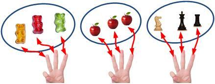
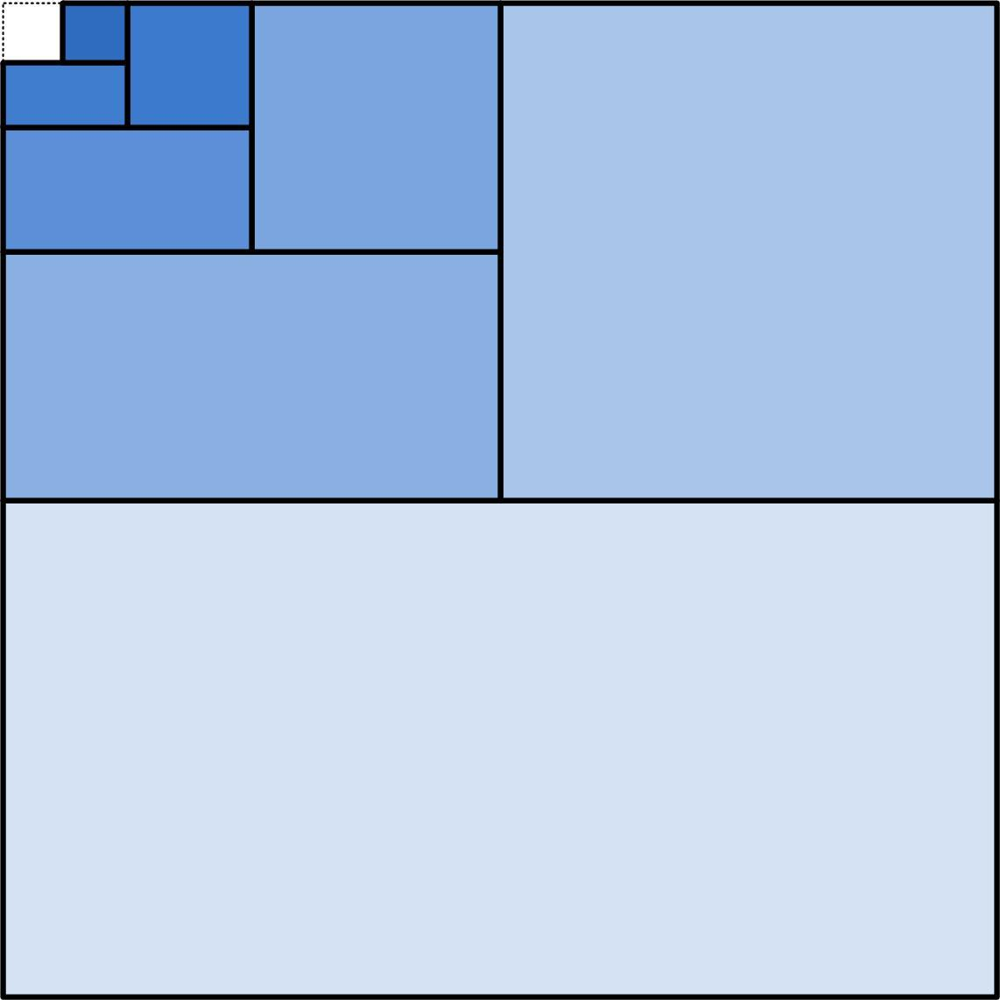
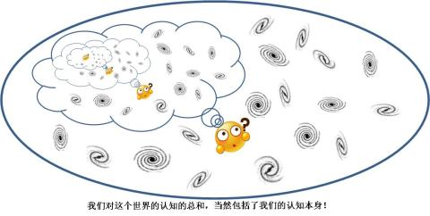
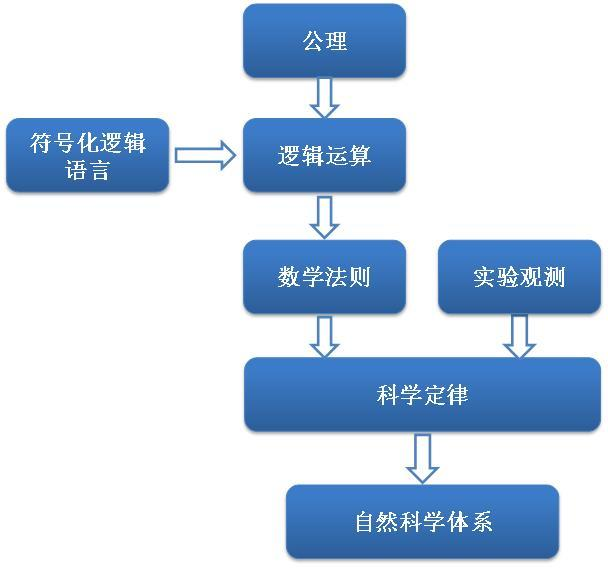

# 8、数学的三个纲领：逻辑、形式语言、以及直觉

> **“In formal logic, a contradiction is the signal of defeat, but in the evolution of real knowledge it marks the first step in progress toward a victory.”**
> **“形式逻辑中，矛盾意味着失败，但是在求知过程中，它意味着迈向胜利的第一步。”**
> **- 怀特海**

西方数学从古希腊时期开始直至中世纪结束、文艺复兴、以及科学的崛起这段长达2000年的时间的绝大多数时间里，柏拉图主义占据着主流的地位。早期，数学被认为是理念世界中的自然法则，后来，则成为上帝手中的完美秩序。不论如何，有两点是不变的：

1、数学是抽象的、永恒不变且确定无疑的绝对真理。

2、数学是先验的、独立于任何人的知识。

但是，观念在悄然地发生着变化 – 而这个变化并非像历史上著名的几次思想革命那样爆发和颠覆，而是润物细无声，当时身在其中的数学家几乎没有意识到。这种观念的变化来源于两个因素，一个来自当时数学内部自身面临的困难，另一个来自数学外部，也就是当时科学以及哲学上认识论的发展。

前面一章我们讲到，数学家们开始意识到很多困难，包括数字理论、几何、分析等多个理论。数学家们越是深究，越是发现，几乎在数学中的每一个领域，都缺乏、甚至是根本没有严谨的直觉和逻辑基础。过分一点说，数学中几乎没有一样东西是建立在牢固的基础之上。而且，诸多证据显示，一个绝对的、完全确定的数学体系很可能只是镜花水月而已。例如，逻辑上严谨的几何体系可能有无数个，而我们熟知的欧氏几何只是诸多可能性之一。从逻辑上并没有理由认为1000多年来被认为数学真理典范的欧氏几何在这些体系中鹤立鸡群。那么我们就只能求助于“相信” – 虽然没有一望即知的公理作为直觉基础，但是我们还是可以选择相信。在确定的逻辑体系受阻的情况下，一些数学家求助于类似这样的形而上学答案。

比如说，莱布尼兹他曾经说，形而上学的用处远比我们意识到的要大得多。再比如说，在人们对级数的收敛性还没有清楚的认识时，一些滥用导致了奇怪的结果。欧拉在对如下函数做二项式展开时发现：

$\frac{1}{1-x}=1+x+x^{2}+x^3+...$

当x=2时，我们就得到：

−1=1+2+4+8+...

这个等式当然是错误的，但是当时的科学家们并没有意识到。对很多数学家而言，这是负数不存在的明证。但是欧拉却不这么认为，他觉得这揭示了一个形而上学真理：负数比正无穷还要大！虽然从逻辑形式上，这显然导致了矛盾。

是如此一来，一些看似无法解决的矛盾就被归于纯哲学领域。这就暗示着，在数学以外，还存在着另外的、高于数学的真理体系。而神学和宗教人士对此进一步引申，宣称完美的解决方案在上帝手中，而我们人类只能试图接近它，但是却无法真正入侵上帝的领域。虽则我们无法做到自圆其说，但是我们还是坚信，我们探索的是上帝的设计。而这一段时间，被称为数学史上的**英雄时代 –** 在没有严谨的逻辑基础的情况下，人们拼尽全力披荆斩棘，在黑暗中四处摸索。我们的悲剧英雄们就这样无助地向着心目中的神圣目标前进。

然而，黑暗中的探索必然伴随着迷茫。人们开始怀疑这种探索的意义何在。就像当初的无理数一样，没有一个合理的逻辑和直觉基础，大家不一样在用它吗？没有了无理数，整个数学就会塌掉半边天，这难道还不足以成为无理数的合理性吗？于是人们问：为何一定要对纠结于数学的严谨逻辑化？

类似这样的质疑，反映出数学家们逐渐地背离柏拉图主义。而此时，科学和哲学的发展起到了推波助澜的作用。

17世纪经验主义和理想主义之间的论战，使人们的认识论大大进步了。而在同时，宗教的权威性江河日下。上帝所设计的完美数学已经不像以前作为一种不可亵渎的信仰而存在了。同时人们对纯粹理性的批判，更使得数学家们开始思考所谓的可靠直觉到底意味着什么。首先从一些数学物理兼修的大家开始，人们对纯理性的抽象数学实体的看法发生了无意识的转变，开始认为它们是对经验的理想化和抽象化：它们不是来源于理念世界或上帝秩序，而是人们心智的创作。

康德的认识论在此基础上进一步推波助澜，如果你还记得我们第二章谈论的康德认识论的话，你应该可以意识到，康德对这个问题的看法是这样的：**我们相信数学的确定性和必然性，这不是数学告诉我们的，而是我们告诉数学的**。此话何解？简而言之，**数学就是先验综合知识。**

先验综合知识，是康德认识论的一个核心。在康德看来，人类的理性中，存在着“空间”和“时间”两种最基本的直观形式。这是我们的大脑的“算法”基础，就好像一台电脑只能把一切以二进制的形式进行理解一样。这两种形式不但是完全先于任何经验的，而且是任何经验形成的前提。我们所经历的一切，都是在空间这个舞台中的，在时间的长河里的。我们完全无法想象我们会经历一件不发生在空间和时间中的事情，甚至无法想象没有了时间和空间是什么意思。所以，时间和空间就构建了我们整个理性思维的基本框架。它个我们的思想空间提供了一个房间，任何其它的概念，无论如何千变万化，都必须摆在这个房间当中，遵从这个房间的格局。

**几何，就是空间的描述，代数，就是时间的描述。**

几何中的位置、形状、方向、维度，等等一切，都是我们直觉中“空间”概念的具体体现。相对而言，数字的连续性、无限的可分割、正反两个方向的任意延展，这都是我们脑海中关于时间的印象。作为人理性思维的基本支柱，**数学就是我们智慧先天的基本笔画和字母，这就是我们那种强烈的“数学直觉”的来源** – 它不是来自于理念世界，也不是来自于上帝之手，而是来自于我们智慧本身。无论我们对这个自然界的认识如何，它必须是用数学语言写就的。至于自然界本身是否存在一个柏拉图式的数学法则，那些都是属于物自体的世界，对我们的认识而言是毫无意义的。

与此同时，对数学思想的另一个冲击来自于隔壁的物理学。相比于数学家的窘境，物理学在这一段时间内却是一日千里，各类数学随意地、自由地应用，帮助物理取得了一次次突破。并且，反过来，物理学不但在应用数学，而且在很多领域还侵入了数学的神圣空间。一些数学分支本来不存在，是纯粹因为物理学的推动才出现的。例如微积分，它的初衷来自于类似速度这样的具体物理概念，而非纯粹理性产物。再比如傅里叶分析，也是来自波的频谱分析。在反映这些具体的、非抽象的自然规律方面，数学无疑是最有效的语言。在这里，数学可以被看作是无数的具体事物、具体现象中被抽象出来的表现形式，数学的真理性是经验科学的真理性的体现，或者至少是经验科学作为一种知识的有效描述。数学的抽象性和必然性完全是依存于我们日常经验的一种**理想化**归纳，而脱离了具体事物的纯抽象的数学只是一种幻觉。例如爱因斯坦说过：

> ***“当数学谈及现实时，它不确定，当数学确定时，它无关现实。”\***

既然如此，我们为何不把数学的牢靠基础放一边，而仅仅考虑它在自然科学中的有效和好用呢？

一些数学家渐渐开始放弃了这个领域的严密性。有的人甚至开始走向另一个极端，对古希腊人对严密性的追求开启了群嘲模式。诸如如下：

> *“所有那些涉及常识且早已熟知的事情，对其推理只能掩盖真理。在今天已经不值得去关心了。”*

> *“（数学的严密化是一种）迂腐，一种对达到目的的方法偏爱的迂腐。”*

> *“困扰希腊人的那些琐碎的东西，我们已经不需要了。”*

其中包括了著名数学家雅克比，他说：

> *“要达到高斯那样的严密，我们没有时间。*”

**于是，在内外交困的情形下，数学思想走到了一个历史性的分岔路口。**

然而，尽管对数学传统的质疑接踵而来，人们对数学的严谨和严密的追求从未放弃。在这个迷茫的时期，人们迎来了几位分析数学的划时代大师：**皮亚诺、康托尔、弗雷格**。突破终于不期而至了。而这次突破，表面上看突如其来，其实是经过了长时间的痛苦摸索和铺垫的，这里说的铺垫，一个是**形式逻辑（Formal Logic）**，一个是**集合论（Set Theory）**。

应该说，我们对形式逻辑这个术语的翻译并不准确。“Formal”这个词除了一部分有“**形式、仪式**”的意思，其实更多的，是“**严格的、正规的**”。因而，形式逻辑的含义是一套正规的逻辑法则，按照某种严格的语法，从某个前提推论到某种结论的整个系统。在很多情况下，它是靠符号系统和相应的逻辑运算法则来完成的。我们在第一部分的第九章曾经提到过莱布尼兹的梦想，就是要用一套逻辑符号和逻辑演算法则囊括所有的推理过程，然后像做算术运算一样，通过逻辑运算完成一切逻辑推理。我们可以用算术来类比这个过程。比如说，我们的基本运算法则结合律：

两个数字加和后与第三个数字相乘所得的数字等于这两个数字分别与第三个数字相乘，相乘后的数字再相加之后的到的数字。

这个运算法则，用我们的算数符号表示就是

$\left( A+B \right)\times C=A\times C+B\times C$

这种算术符号你们在小学中就早已熟知了，就像是汉语和英语的区别一样，算术符号就是一种数学语言，它可以由文字语言严格地**翻译**而成。你应该已经能够充分体验到这种符号系统的好处了：它虽然没有赋予这个运算法则以更新的或更深刻的含义，但是它把一个用文字表示的复杂关系简洁明确地表达出来，并且极易操作。前面这个简单的结合律可能看上去不那么明显，但是对于一个复杂的四则运算而言，运用符合运算显然有着难以比拟的好处：

$\left( A+B \right)\left( C+D \right)^2=\left( A+B \right)\left( C^2+D^2+2CD \right)\\ =AC^2+AD^2+BC^2+BD^2+2ACD+2BCD$

这是一个连续应用结合律的运算过程，这么短短的一个运算公式，如果用文字表示，恐怕用两页纸也写不完。即使是写完了，也很难读懂 – 而且中间出错的概率极大。

其实究根问底，人们的语言本身就是一种符号系统，人们借助于对日常事物用语言符号的编码 – 例如人们对那种汪汪叫的动物起一个编码名称叫做狗 - 按照一般语法表达（主谓宾等），就使语言这种字符串能够表达复杂的含义。在是远古人类在没有语言的时候，对事物的思索总是难以深入。而语言的出现，使人们可以借助于语言这种表达符号来辅助人们的思维，人们的思想立即一日千里。也好像在早期数学发展阶段，人们对复杂的四则运算都难以完成，而运算符号的出现，立即使得这些运算成为小儿科。这就是符号系统的威力。对于一个理论而言，发明一套合理的**符号语言**来使得某种逻辑关系清晰简明且易操作地表示出来，这是一件极其关键的工作，往往能够极大地简化理论体系并且推进理论体系的深入发展。比较典型的诸如微积分的莱布尼兹符号、以及量子力学中的狄拉克符号等等。而逻辑运算符号系统，则是这些符号系统中最为成功的一例。

我这里无意深入探讨逻辑运算的符号和法则，只是举这么一个算术上的类比，让你体会我们传统的逻辑推理在形式化和符号化以后会有多么巨大的跨越。莱布尼兹之梦经过后续几代数学家的不懈努力，首先在布尔手中形成雏形，最终在弗雷格手中算是完成了。就像是算术运算一样，符号运算的介入，使得逻辑演绎变得严格 – 一切皆遵从基本的逻辑原理、准确 – 一切都严格确定而毫无歧义、并且正确 – 在正确的前提条件下必定得到正确的结论。更重要的是，人们可以非常省心地通过逻辑演算来完成极端复杂的逻辑推理，这些推理在以前都是难以想象的。

如此一来，人们在寻求数学的严密性这条荆棘之路上，就有了最锐利的披荆斩棘之剑。人们对数学的逻辑基础得以迅速深化。意大利数学家皮亚诺就是借助于这样一种利器，对算术系统打破砂锅问到底，在种种复杂的运算表象下，寻求它们底层的逻辑基础，就像是欧几里得的几何公理一样，最终总结了五条算术公理，把所有的自然数极其运算全部建筑在这些公理之上。在皮亚诺算术中，“0”和“后继数”作为原生概念出现，是自然数得以衍生的基础，生生不息产生了一切自然数。而随后戴德金进一步在这些公理基础上严格地定义了全部实数。这一套体系，后世就被称为“**戴德金-皮亚诺算术**”。至此，算术才算是彻底摆脱了作为几何尺度度量的附属概念，成为一套独立的公理体系。而人类第一次有了一套代数的基础理论。

数学基础的第二件利器，集合论，是同时代的康托尔发展的。如果说符号化的形式逻辑是经历了数代数学家不懈努力的结果，那么集合论则相反，它是康托尔在没有明显前人基础上的情况下独自建立的。集合，用很不严谨的通俗语言来说，就是一些具有某种特定性质的抽象的数学实体的总和。基于这种抽象事物上我们就可以脱离具体的经验而谈论集合的“基数”- 也就是元素的个数。自然数的定义基于“基数”相等的概念 – 一个集合中的每一个元素都对应着另一个集合中的一个元素，反之另一个集合的每一个元素也对应着这个集合中的一个元素，这就形成了**一一对应**。有这种一一对应关系的集合它们的基数就是**相等**的。由于这种“相等”的概念，我们在集合论基础上建立自然数就方便了。这种思想，后来分别被策梅洛和冯诺依曼发展和改进，形成了两种不同的集合论的自然数定义系统。

关于皮亚诺算术和康托尔的自然数系统，可以参加我们第一部分的章节

[贾明子：题外话、自然数的正确打开方式48 赞同 · 3 评论文章](http://zhuanlan.zhihu.com/p/28595534)

这里就不再细说了。

康托尔的一个显著不同的贡献在于，他在史上第一次，开始认真地讨论实无穷的概念。例如说，他直接使用“全体自然数”、“全体实数”类似的概念，而这在绝大多数前人数学家看来是不被允许的：实无穷不可能被当作一种已经完成的数来看。参见上一章：

[贾明子：7. 数学真理的疑惑198 赞同 · 17 评论文章](http://zhuanlan.zhihu.com/p/45665906)

在康托尔用集合论证明了，无穷不但是一个真实的数，而且还存在着不同的“大小”：有些无穷比另一些无穷更大。根据康托尔的定义，如果两个集合的元素之间可以形成一一对应关系，那么它们的数目是一样多的。那么可以证明所有的自然数和所有的有理数一样多，而实数比自然数多，当然还有比实数更多的数。

这看起来很反常识，并且产生了一些非常有意思的悖论，例如“**希尔伯特旅馆悖论**”。一个无穷多房间的旅馆，里面住满了客人。这是来了一个新的客人，他还有房间可住吗？答案是有的！因为旅馆的管理员只需要让每个房间的客人向着“上一个房间号码”搬一下家，自然就把1号客房腾出来给新客人住了！此外更加违反直觉的是另一个悖论，“**巴那赫-塔斯基悖论**”。这个悖论中，一个圆球可以用某种特殊的分割方式分成四份，然后我们再把它重新组合“拼”回去，然而拼回去的，却变成了两个与原来一模一样的圆球！实无穷就是这么奇妙。

关于康托尔的无穷大，引起了轩然大波，有人盛赞其为杰出的发现，而有人斥之为毫无意义的文字游戏。但是细节我这里不多说了，有兴趣的话推荐你去看看**Courant写的《数学是什么》。**

与皮亚诺和康托尔同时代的弗雷格，完成了这场关于数学严密化行动的最后一击，也是引起数学和哲学大地震的一击。鉴于弗雷格理论中抽象复杂的逻辑运算和各种专业的数学术语，我这里不打算历数他的具体理论，而是从哲学层面上介绍他的思想以及他的思想所产生的后果。

弗雷格明确反对数学的物理主义观点，因为数字并非具体事物的性质，而是概念的性质。如果我们坚持认为数字只能表达具体事物，那么零是何意义？负数又是何意义？我们说数字3，完全不必指定3个具体何物，它完全可以是3个抽象的集合元素。而且我们完全可以讨论3本身的、不依赖任何外物的性质，例如它的奇偶性、素数性等等。同时他也反对数学的心理学主张：如果数学只是心理学概念，那么数学命题的真假就毫无客观性，而是因人而异的，这无疑完全破坏了数学的根基。

而他对康德主义的批判，则是他影响最大的工作。在这方面，他开辟了现代数学的第一个主要流派，**逻辑主义**。

在弗雷格看来，先验综合判断是一个很奇怪的东西。从这里出发，而把数学最终归结为先验直觉，更加难以立住脚。直觉是一个说不清道不明的东西，把整个数学建立在这种迷迷糊糊的基础上未免太不可靠。而且我们经历过太多的貌似违反直觉而实际上是正确的判断，因而我们根本就不能真正地把直觉当做一种严肃的东西来对待。他于是回到了前康德时代的观念：**所有先验的，必定是分析的；而所有综合的，必定不是先验的**。因此他完全同意数学是一种先验知识，但是他反对数学是综合知识这种说法。他说，**数学它是一种被巧妙包装的分析判断，从表面上看貌似综合判断，**如此而已。例如，我们打一个不严谨的比方，说如下命题：

“旺财是一只狗。”

这个命题，看似是综合的，因为它描述了“旺财”和“狗”两个不相互蕴含的事物之间的关系。但是，弗雷格说，这种说法是不对的。问题出在“旺财”这个主语上。在数学中我们所说的每一个概念都是由明确定义的，这个定义就包含了它的全部逻辑蕴含。在这里我们说“旺财”，并非指一个独立的事物，而旺财本身是一个定义，是对这样一只40斤的、馋嘴的、喜欢摇着尾巴随时向我们卖萌撒娇的、黑白色的、汪汪叫的动物的命名 – 这种动物叫做狗。那么上述命题说的其实是：

“这只被命名为旺财的狗是狗。”

这当然是一个分析命题。因为作为定义的“旺财”本身就蕴含了“是一只狗”的性质。类似地，康德说，2+3从这两个数字本身并不蕴含任何关于5的性质，因而2+3=5是一个综合判断。但是实际上，从2、3、以及“+”的定义中，我们应该可以找到一种必然的蕴含关系：2+3本身就蕴含了所有的5的性质，因而它应该是一个分析判断。我们所要做的，就是要对2、3、“+”做出合理的定义来使得这种判断是分析的 – 因而也就是必然的和先验的。而这种定义，也必然仅仅用到逻辑定律，而不包含其余，它是纯逻辑的，因而必然是分析的。只有纯逻辑的基础，才是我们所能做到的最牢固的基础。推而广之，**整个数学就是一种精巧包装的复杂的逻辑关系，而不应包含任何额外的非逻辑的“原生”数学成分。**

事实上，任何一个定义，必须是基于其它已经定义好的概念之上的，而不能用自身定义自身。那么我们如果究根问底，就会陷入无限递归而无从自拔。所以，我们总会有一个起点，在这个起点上，一切概念都非定义的，我们只能通过一些判断来叙述和限制这些未严格定义的概念，使其成为其他一切概念的基础。这种叙述和限制就是公理。逻辑主义很自然地认为，**公理，其实就是一种伪装成判断的原生定义。**它是理论起点，但是并非我们以前认为的、是理论本身的起点，而是理论的逻辑起点。在弗雷格这里，这个起点就是集合论。

总而言之，物理主义把数学归结为对具体事物的归纳，康德主义把数学归结为直觉，经验主义把数学归结为心理。而逻辑主义站起来说，No no，你们全错了！**数学应该归结为纯逻辑！数学就是逻辑学的一个分支。**为了达成这一目标，弗雷格必须要证明数学是纯分析的，也就是说，他需要建立一套逻辑体系，仅在这套逻辑体系中，通过基本的逻辑原理，即可定义和演绎出全部的数学。

弗雷格对数字的看法，用最简的语言说来就是：**数字是一种特殊的集合，是集合的集合。而集合则是纯逻辑的产物。**如何理解集合是纯逻辑产物呢？从逻辑上讲，任何一个概念都有着它的外延。也就是说，**对任何一个概念而言，满足这个概念属性的所有事物就是它的外延。弗雷格说，这些所有事物就构成一个集合。**弗雷格接着引入了一个原理，被称作**“第五定律（Basic Law V）”**，这个原理是这么说的（大致意思）：两个概念F和G，F和G的外延相等的充要条件是满足它们的每一个对象都相等。再通俗一点说，就是性质F定义的集合和性质G定义的集合，这两个集合相等的充要条件是F集合的每一个元素都与G集合的每一个元素相等（这是一个看似一目了然的、几乎像是个废话的原理。可谁能想到就是它出了大问题。）。接下来，他用这个原理证明了所谓的“**休谟原理**”：两个概念的外延之间如果有一一对应的关系，那么这两个概念就是“等基数”的。因而，所有等基数的概念，由它们的外延构成的集合之间就是一一对应的。弗雷格接着说，所有的这些等数的概念的外延（所有这些所含元素一一对应的集合）的集合（这些集合的集合），就是我们对自然数的定义。

前面这段话有点绕，我们可以用人类的语言重新表达一下。比如说，对于“粲粲一家”这个概念，它的外延就是“爸爸、妈妈、粲粲”，它们构成一个集合{爸爸、妈妈、粲粲}，这个集合就确定了“粲粲一家”的**基数**。而对于“粲粲家的宠物”这个概念，它的外延就是“旺财、来福、小乌龟”，它们同样也构成一个集合{旺财、来福、小乌龟}，这个集合也就确定了“粲粲家的宠物”的**基数**。我们可以看到，前面这两个集合元素之间是一一对应的：如果我们各自选择喂一只宠物，如爸爸喂旺财，妈妈喂来福，粲粲喂小乌龟，结果就是每个人都喂一只宠物，而每个宠物都有一个人来喂。这两个集合一一对应，所以“粲粲一家”和“粲粲家的宠物”两个概念是**等基数**的。等基数的概念可以有无穷多个，我们可以轻易列举，例如， “TFBOYS”和前面的概念也是等基数的。这里所说的基数是**属于某一个特定的概念的**，它不可能是数字本身，因为数字本身是一个独立的、不从属于任何一个单一概念的东西，那么如何从这些特定概念的基数推出独立的数字的定义呢？很简单，所有与“粲粲一家”等基数的概念（“粲粲家的宠物”、“TFBoys”、“哈利罗恩赫敏三人组”、……），它们各自的外延所构成的集合的元素之间都是一一对应的，它们每一个集合都有一个性质“三性（threeness）”，而所有这些有“三性”的集合的集合，就是数字3的定义。同理，所有“五个元素”构成的集合的元素之间也是一一对应的，它们都有“五性（fiveness）”，这些集合的集合就是数字5的定义。如此等等。

根据这种思想，弗雷格给出了自然数的具体定义[[1\]](https://zhuanlan.zhihu.com/p/46168413#ref_1)。首先，0属于那些没有任何外延的概念。具体讲，就是所有“自身与自身不等价”的集合的集合 – 当然这个“自身与自身不等价”的集合是不存在的，因而0就是空集。

而剩下的自然数就可以以皮亚诺的方式向下递归定义出来。这个递归的“后继数”是这样定义的：

对一个基数为n的概念F，我们已知F的外延中的一个对象x。如果G是这样的一个概念：“G的外延等于F的外延中除去x的所有对象”，G的基数是m，那么n是m的后继数。

我们可以看出，上面这段话，其实是在用一种很繁琐的、但是逻辑上很严格的方式在定义n=m+1。N就是m的后继数。这样从零开始，每个数都有这样的后继数定义，因而整个自然数就被定义了。进而可以通过戴德金的手法定义整个实数域。

现在，我们再回头看看逻辑主义对康德的“先验综合判断”的批判。比如说，3+2=5，康德说这是个综合判断，但是逻辑主义认为，它可以被还原为纯逻辑，它是一个**被精巧包装的分析判断**。例如以弗雷格的数字递归定义系统，每个数字都被定义为前一个数字的后继数，而起始的数字“0”被定义为空集。那么，我们有这样一个**定义**：

5≡4+1

这个公式里面的等于号“ ≡ ”的意思是“定义为”。这个公式无非就是说5被定义为4的后继数。而同理，我们对“4”有这样一个定义：

4≡3+1

因而：

5≡3+1+1

也就是说，5被定为为3的后继数的后继数。而对“后继的后继”我们有这样的定义：

2≡1+1

所以，

5≡3+2

所以说，3+2=5这是个**伪装成运算的定义，**它真正应该写作3+2≡5。也就是说，不是“三加二等于五”，而是“五被定义为三加二”。它根本就是一个分析判断：康德所谓的“先验综合判断”是不存在的。当然，这个论证过程只是向你说明逻辑主义的核心思想，而不是真正的一个证明，真正严谨的证明需要用形式逻辑语言来完成。

弗雷格的整个推论过程，可以说是很严密很牢靠了。至少看起来如此。1893年，他完成了著作《算术的基本定律》，把这种对数学基础的重新构建系统化地发表了。对这本书他显然很得意，他说：

> ***“我希望现在我可以宣布，本书使得这样的努力成为可能：把算术的基本原理归结为分析判断、进而证明它们是先验的。这样一来算术只不过是逻辑的一种延伸。数学的每一个判断都是一种逻辑定律，或是其推演物。在科学中应用数学就是在观察到的事实中应用逻辑关系；计算就是推理。”\***

1902年，在他的著作第二卷即将发表之时，53岁的弗雷格收到了一个30岁年轻人的来信。这个年轻人，就是**罗素**；在这封信中，罗素表达了它对弗雷格犹如滔滔江水连绵不绝般的崇敬，然而，在信中的末尾，看似不起眼的一个小小的“但是”，却摧毁了弗雷格的一切。弗雷格突然发现，他建立的牢固逻辑基础本身，坐落在一个松软的沙滩上摇摇欲坠。这里主要有两个原因，**一个是他大量使用“概念的外延”来定义集合，也就是说用一个性质来定义一个集合（非限制概括公理）；另一个，是他大量地使用“集合的集合”、“集合的集合的集合”这类嵌套集合。**而罗素指出，这是不能随意使用的。这会必然导致逻辑矛盾，而这个矛盾是后来大名鼎鼎的“**罗素悖论**”。

罗素悖论是如何引发矛盾的呢？如果你可以回忆起我们第一部分的内容，在第13章中有详细说明，这里我就不再赘述了。

[贾明子：13、只缘身在此山中108 赞同 · 71 评论文章](http://zhuanlan.zhihu.com/p/28537185)

**罗素悖论在数学史上是一个极其鲜明的转折点，应该说它的提出其重要性丝毫不亚于无理数、虚数、以及非欧几何的发现。**它所产生的影响，是当人们终于看到了数学基础问题的曙光时，又一次让确定的数学真理之梦变得虚无缥缈。事实上，在同时代还有若干个其它版本的悖论，它们都与罗素悖论相类似，而罗素悖论一起简洁和确定性成为这些悖论的代表。弗雷格看到罗素的信件之后，立即认识到自己理论的缺陷，然而当时他的第二卷著作已经付印，不可能再进行修改，他只得在书中加了这样一段补遗：

> ***“在工作完美收官之际，却突然发现整个基础都必须要放弃，对一个科学家来说没有什么能比这个更加不幸的了。是罗素的一封信件让我认识到这一点，我不得不在本书即将出版之际加以说明。”\***

我们可以想见，弗雷格当时的心情是何等沮丧。弗雷格在余生再也没能够从这个打击中恢复过来。

弗雷格消沉了，但是始作俑者罗素却接过了接力棒，继续他的探索。罗素虽然发现了弗雷格的缺陷，但是他却坚信弗雷格的思想是一条康庄大道：数学，归根结底就是逻辑。悖论不可怕，只要能想办法解决之，悖论会推动而不是打击数学的发展，人们终将意识到数学的本质。

其实罗素早在弗雷格还没有完成他的工作之时就已经深受悖论的困扰。为了解决这些悖论，他仔仔细细地研究了当时的几个著名的代表，最后他认定，这些悖论有一个基本的根源：它们都是**自指**的。也就是说，它们自己引用了自己。弗雷格的集合论中允许用一个性质来定义一个集合，因而它是躲不过这种自指怪圈的，比如说，“有无穷多个元素的集合”这个性质本身也包含了无穷多个元素，因而它自己必然要包含它自己。我们形象地把集合当做一个可以“装”某种性质的事物的口袋，那么我们可以说“可以装下所有苹果的口袋”，这在逻辑上毫无问题。但是，在很多情况下我们需要把一些口袋打包装起来，这时我们就需要一种能装口袋的口袋。那么，如果我们要求有一种“可以装下所有口袋的口袋”，就需要它自己装下它自己了！

罗素把这种“自指”成为**“恶性循环”（vicious circle）。**要想消除悖论，就必须躲过恶性循环。他的方案就是“分层”。简言之，苹果是一个层次，口袋是比苹果高一层的对象，而装口袋的口袋是比单纯的口袋更高一个层面的对象。单纯的口袋只能装具体的事物，而装口袋的口袋可以装单纯的口袋 – 但是不能装“装口袋的口袋”。只有高一层的才可以装本层的对象。

就像它绕口令般的描述一样，这个方案极其复杂，我也不能深刻理解，它的大意是，集合是“分层”的：基本的具体对象是最底层，这些对象的集合和对象的性质是第二层，这些对象的集合的集合、性质的性质是第三层，以此类推。这样一来，诸如“所有集合的集合”之类就不再包含它自己了：因为它是比“所有集合”更上一层的概念。这样一来我们就可以继续使用集合论中那些有效的部分，又避免了悖论的产生。但是代价就是理论极尽繁复之能事：我们没涉及一个集合就必须要搞清楚它是“哪一层”的，进而要一层层向下穷究，原本一两行就可以说明的事情，需要几十页才行 – 而且还不总是可行。据称这套三卷2000页的巨著，知道300多页之后才开始定义自然数“1”，而直到600多页才开始定义加法！此外，为了解决层层嵌套带来的麻烦，罗素还引入了一个公理，叫做**“还原公理（axiom of reducibility）”，**这个公理的大意是说，一个高层集合的逻辑描述总是可以表示为等效的底层对象的逻辑描述[[2\]](https://zhuanlan.zhihu.com/p/46168413#ref_2) – 这样一来我们就可以把所有的高层对象全部**“拉低”**到最底层，从而省去了大量的层层嵌套带来的逻辑困难。

这是什么鬼？且不说这个公理的有效性如何，从根本上说，它就不是一个逻辑定律 – 它不是纯逻辑的。那么罗素的整个工作的初衷 – 把数学还原成为纯逻辑 – 就被彻底破坏掉了。罗素本人也为这个公理反复纠结，最终只能承认它并非逻辑必需。更何况，罗素在他的理论中用到了**无穷公理**和**选择公理**，这两个货虽然不那么不招人待见，但是一般也不被认可为纯逻辑公理，因而数学的逻辑化就难以为继。最后，他只能无奈地宣称，或许集合论也不是数学中最基础的理论，我们在数学基础探索道路上可能还有很长的路要走。

**此时的逻辑主义面临的情况，可以用一句诗来描述，“云横秦岭家何在，雪拥蓝关马不前。”**

逻辑主义之路虽然暂时进入进退维谷的境况，但是弗雷格和罗素的工作却无疑极具启发性和开创性：他们表明把数学完全形式化是可能的。在罗素陷入苦战的同时，另外一个思路在试图是公理化集合论。这个思路的要义是， “满足一个性质的所有对象构成一个集合”这样的前提导致了悖论，那么说明这种对集合的约定方式有不妥之处。我们只要试着对集合的概念提出一些规则，增加一些限制，结果让悖论消失就行了。同时，朴素的集合论虽然陷入悖论，但是它取得的成功却是极有价值的。我们对它的限制又不能过于严格，把它给限死了。这个补丁怎么个打法？与逻辑主义的出发点不同，它不追求把数学还原为逻辑，而是要找到一种平衡，**适当地制定出规则，在规则下既能实现逻辑自洽，又能最大可能地保留原有成果。**于是就有了ZFC公理体系，这个公理体系在朴素集合论的基础上修正、增加了若干公理，对集合的用法加以限制，这样做的结果在操作层面上是相当成功的。这种思路，其实就是把数学公理看作是一系列规则的组合，而整个数学，就像是一个棋类游戏一样，在规则内衍生变化，得到一个完整的棋局。这样一来，数学本身并没有什么现实的含义 – 它只是一种游戏规则，是一种形式语言。只有当我们把它应用到现实事物中，它才有了现实含义。这种观点的代表人物就是**希尔伯特**，而这种观点则被称为数学的**“形式主义”**纲领。

举个例子说，我们前面提到的三段论推理：

*（大前提）所有的狗狗都会汪汪叫；*

*（小前提）旺财是一只狗狗；*

*（所以）旺财会汪汪叫。*

这里面“旺财”、“狗狗”、“汪汪叫”是现实问题赋予这个推演规则的含义。而这个推理本身是纯形式的，我们完全可以把它写成：

*所有的A都有B的性质；*

*C属于A；*

*所以C有B的性质。*

希尔伯特说，数学体系中所包含的一切数学概念，我们可以把它随便替换，例如把数字全部换成“啤酒”、“桌子”，这不会影响数学体系的有效性 – 因为它只不过是一个形式体系而已。我们完全可以说：

*所有的啤酒都会汪汪叫；*

*桌子属于啤酒；*

*所以桌子会汪汪叫。*

这个看起来很滑稽无厘头的推理，从形式上是毫无问题的。它的真假知识在我们把它赋予一定含义时才会发生。**从纯数学角度，一个命题为“真”就是指它在现有的规则框架下可以被证明，而“假”则是它可以被证明为矛盾。**而数学命题本身完全没有物理意义上的现实含义，也不会有理念世界中的“存在”或“不存在”之分。

这种看法绕开了许多麻烦的问题，但是会让很多人，尤其是持有实在论观点的人很不舒服。例如说，如果数学只是一套高级的游戏，那么为何自古代以来，各个文明会各自独立地分别建立起相同的算术和几何体系？他们难道不会建立起不同的游戏规则吗？例如几何的毕达哥拉斯定理和勾股定理说的是同一回事，是中国和古希腊各自独立建立的。如果说它们只是一个特定公理体系指定的游戏规则，为何古希腊人和先秦中国人会心有灵犀？类似的例子不要太多。另外，如果数学只是一个游戏，为何数学会如此和谐地用于实证科学？

如果说这种诘难尚可自圆其说，另一个困难它就很难回答了。形式主义对数学体系的最低要求就是自洽性。也就是说，这种规则体系中必须要保证没有任何矛盾之处。我们不能在我们的规则下同时得到一个命题A为真且不为真。这不仅仅是矛盾律的要求，而且是这个套规则是否有效的判据。**因为，如果我们哪怕是只有一个矛盾，我们就可以利用这个矛盾证明所有的命题全部为真。那么这套规则就毫无意义。**比如说，我们有一套公理体系，对某一个极特殊的命题A得到了同时为真又为假的结论，那么，我可以用它来证明这样一个命题：**“爸爸是一盘意大利面”。**

1. 首先，既然A为真，那么“爸爸是意大利面”和“A”两者至少有一个为真。
2. 既然“爸爸是意大利面”和“A”两者至少有一个为真，而A为假，那么，“爸爸是一盘意大利面”就必然为真。
3. 所以，爸爸是一盘意大利面。

所以，对形式主义者而言，能够证明一套规则自身的自洽性就是一个必需的要求。这在1900年提出的著名的“希尔伯特纲领”中，是位列第二的问题。希尔伯特本人对此坚称：

> ***“我们必须做到，我们终将做到。”\***

这句话也是他的墓志铭。

然而，我们可以回想一下第一部分地14章“逻辑不确定性”谈到的哥德尔不完备定理。这个定理之间证明了，**算术系统不可能证明自身的自洽性。另外，在一个足够表达算术系统的形式体系内，总是存在着无法证明的真命题。**这是什么意思？形式主义者对“真”的定义就是可以在体系内被证明，无法证明就意味着它不能为真！无法证明的真命题本身就是就意味着存在着某些命题的真假性是独立于形式理论的–形式理论可能确实无法证明它，但它就是真的。**“真假”本身是在形式理论之外、高于形式理论的客观问题。**这给了希尔伯特墓碑上凭空增加了古希腊神话式的悲剧性 。

[贾明子：14、逻辑不确定性124 赞同 · 8 评论文章](http://zhuanlan.zhihu.com/p/28544499)

而此时，以数学家布劳威尔为首的另一批人，则有着明显的康德主义传承。他认为，逻辑主义和形式主义都是错误的。数学就存在于数学家的意识中，是建立在康德式的“数学直觉”之上的体系。它的最终起源是时间这个“数学的原生直观”，它是人类智慧的先天框架，也是人类智慧建筑在直观之上的构建物。而数学的客观性体现在数学直觉这种人类知性的先天形式中。这种观点被称作**“直觉主义”。**布劳威尔说：

> ***“在数学中，存在就意味着由直观构建出来。它的形式语言是否自洽这一点都不重要，不但不重要，而且连对数学存在的检验都算不上。”\***

直觉主义有两个鲜明的特征，第一个，它激烈**反对实无穷**的概念。在它看来，数学是人类智慧构建的，而人类的智慧总是有限的，因而不可能对一个已完成的无穷大进行任何直观上的构建。康托尔的超限数和实无穷，实在是一种妄自尊大的胡言乱语。

第二个，就是**它对构建的热衷**。它认为数学存在的一切，都应该能够被数学家以有限的步骤构建出来，而那种**无法被构建、又能通过反证法证明（如果不存在则证明产生矛盾）的所谓的“存在”毫无意义**。一个无法被真正构建出来的东西，谈何存在？其实我们可以看到这种观点受到了经验主义影响的痕迹，经验主义说，一个不能被观察的东西，谈何存在？因而，直觉主义旗帜鲜明地反对把逻辑的排中律 - 一个命题要么是真的，要么是假的 - 应用于无限集，这是一种不可靠的推广。在一个有限集中，我们可以通过历数的方式证明排中律，但是在一个包含了无限多的事物中，一定存在既非真又非假的命题 – 因为我们没有任何的现有办法对它进行判定。**那么，反证法（归谬法）的运用必将受到极大的限制，甚至沦为无用之举：有限集中我们可以通过遍历的方法取代它，而无限集中它被禁止使用。**

直觉主义与形式主义形成了激烈冲突，表现为希尔伯特与布劳威尔之间的持续嘴炮。希尔伯特说：

> ***“没有人能够把我们从康托尔为我们建立的乐园（指实无穷，括弧中为我添加，非原文。）中驱赶出去！”***

在布劳威尔刚刚出道时，展现出了优秀的数学天赋，曾经得到希尔伯特的赏识，并力邀他加入自己主编的《数学年鉴》的编委会。但是随着两人观点越来越分歧，两人的关系急剧恶化，争论也越来越有火药味。后来希尔伯特更加用了一点不太光彩的手段，把布劳威尔从编委会中踢出去。这个被爱因斯坦不无蔑视地称之为“蛙鼠之争”[[3\]](https://zhuanlan.zhihu.com/p/46168413#ref_3)。

直觉主义的真正困难在于，他们试图在剔除实无穷和归谬法的情况下重建整个数学体系，但是这个过程并不成功，很多原有的有意义（哪怕是直觉主义的视角中）的定理无法被建立，他们的重建过程只能完成一小部分。另外一个直觉主义者外尔坦言“这是一个令人汗颜的尴尬”。主流的数学家们没有几个真正相信直觉主义。它作为一个思想纲领得以存活，主要是他的领袖的数学才能，以及它产生了很多后来应用于计算机算法的理论。

总而言之，在现代数学的发端，随着形式逻辑和集合论的发展，人们终于对数学基础问题作出了重大突破，从原来的毫无逻辑基础，终于开始看上去比较牢靠了，尽管这些牢靠的基础仍然是建立在沙滩之上。旧的问题得以解决，而新的、更加深刻的问题产生了。针对这些问题，**逻辑主义试图把数学归结为纯逻辑，形式主义试图把数学归结为无意义的形式语言；而直觉主义则把它归结为心灵的直觉。三个思想纲领各自面临着自己的困难而举步维艰。但是三个思想纲领同时各有传承在坚持不懈地奋力前行。**例如罗素之后多年，在上世纪80年代，新逻辑主义又有了发现，把数学归结为逻辑这条道路似乎有了新的曙光。

在这种情形下，古老的柏拉图主义开始焕发第二春，一个全新的“数学柏拉图主义”正在酝酿形成。

欲知后事如果，且听下回分解。

**下一章：[贾明子：9、数学是实在还是工具？工作日的柏拉图主义和周末的形式主义](https://zhuanlan.zhihu.com/p/47212248)**

**上一章：[贾明子：7. 数学是真理吗？古典柏拉图主义的困境](https://zhuanlan.zhihu.com/p/45665906)**

**专栏传送门：[何为现实？拉普拉斯之妖与薛定谔猫之决战](https://zhuanlan.zhihu.com/c_186387023)**

------

## 参考

1. [^](https://zhuanlan.zhihu.com/p/46168413#ref_1_0)下面这些定义并非弗雷格本人的最初定义，它包含了后来罗素等人的发展，更加明晰，在此不作区分。
2. [^](https://zhuanlan.zhihu.com/p/46168413#ref_2_0)请原谅我语言的贫乏，就像是用文字而不是算式来描述一个复杂的四则运算 – 这几乎不可能 – 用文字而不是逻辑符号来描述一个形式逻辑公理也是极其困难的。我只能用很不严谨的方式让你明白个大概。
3. [^](https://zhuanlan.zhihu.com/p/46168413#ref_3_0)当时爱因斯坦也是编委之一。希尔伯特没有通过编委就运用主编的影响力解除伯劳维尔的编委职务。时候希尔伯特试图让爱因斯坦签字，但是爱因斯坦拒绝了，并且表示他们两个人之间保持中立，希尔伯特可以去干他想干的，爱因斯坦不会支持也不会反对。伯劳维尔被踢出去后曾多方申诉无果，并最终患上了抑郁症，郁郁而终。

编辑于 2020-07-23 10:02

