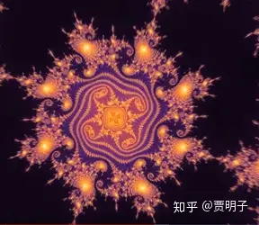

# 9、数学是实在还是工具？工作日的柏拉图主义和周末的形式主义

> ***“Either mathematics is too big for us or the human mind is more than a machine.”\***
> ***“要么，数学对我们来说太难了，要么，我们的意识不仅仅是一台机器”\***
> ***- 哥德尔\***

总而言之，在19世纪后期到20世纪初这段时间里，数学发生了翻天地覆的变化，数学基础的严密化行动取得了突破，我们的祖先用了几千年、却从来不知道它是什么的数字系统，终于建立在了一套严谨的公理之上。人们终于可以不用一边使用数学，一边在为数学的合理性担心。欧氏几何和非欧几何也可以统一在射影几何的整体框架之下。一切看似比起古希腊时代来说要美好多了，但是，人们对于“什么是数学”，却更加糊涂了。例如说，**自然数到底是一种什么样的存在？**它是真实地、独立于人们的智慧而存在的吗？假使说这个宇宙中根本就没有人类存在，2+3=5是否仍然正确？一些复杂的数学定理，如费马大定理**，它们是客观地、不依赖于任何生物或非生物的理性活动而存在的吗？**如果说一个和人类完全不同的外星文明存在，在它们的数学中，是否一样有素数这样的概念、有费马大定理这样的数学定理？如果说数学是真实存在的，**那么它又存身何处？我们又是通过什么手段获取它的知识的？**如果说数学不是真实存在的，而是人类智慧创造的，那么为何不同的人 – 无论种族、性别、老少、地域 – 都会各自独立地坚信类似2+3=5这样的数学规则？**这种客观性和必然性何来？**如果数学像自然科学一样，是依附于我们观察到的具体事物而存在的 – 诸如自然数本身指的是具体事物的个数，而不能脱离具体事物而存在 – 那么**为何我们的数学看起来是必然真**，而不像自然科学那样可以被经验证伪？并且像数论这种仍然在自然科学中没有什么对应物的理论有有何意义？

在我们继续深入谈论下去之前，我想问你一个问题：**数学是被发现的还是被发明的？**

在数学中，不论是发明还是发现，都是人们在新理论建立过程中经常提到的词语。例如说，我们说毕达哥拉斯发现了直角边的平方和等于斜边的平方，而显然不会说他发明了这样一种长度的度量规则；希帕索斯发现了无理数的存在，而不会是他发明了无理数；伽罗华发现了五次方程的解，而不会说他发明了这个方程的解；哥德尔发现了不完备定理，肯定不能说他发明了这个定理。然而，我们还会说，牛顿和莱布尼兹发明了微积分；布尔发明了第一套完整的形式逻辑符号系统；人们发明了偏微分方程的有限元数值解法。如此等等。

发明和发现有着截然不同的含义，我们说“发现”，明显地隐含了**“它已经存在在那儿，人们的工作是把它的面目揭示出来”**这样的意思；而“发明”则意味着**“它本来不存在，人们的工作把它创造出来”**。人们在使用不同的词语时，其实已经包含了一种无意识的对数学实体和数学定理的看法。

人们习惯于把陈述数学事实的判断（定理）称作发现 - 我们倾向于认为它作为一个不依赖于人类而存在的事实而被揭示出来；而把一种方法或一个体系称为发明 – 因为达到同样的目标可能存在不同的方法，描述同样的事实可以有不同的体系。这多多少少说明了人们下意识间对数学的看法：数学实体和数学定理是一种真实的存在，而人们通过创造性的工作来发现它。我们可以看到这种下意识的看法有着明显的柏拉图主义影响痕迹。

而在很多严谨的描述下，人们的措辞既不是发明，也不是发现这样的词语，而是“建立”、“证明”等等。这在**本体论**上就有着更含糊的含义，“证明”指的是**在一定的前提下通过逻辑推理得到某种结论**，它是“真实”的吗？who cares；而“建立”则是**人们构建一种结构** – 它是人类智慧的主观创造，还是人类对真实对象的描述工具？who cares。

Phillip Davis有一句很有意思的话，是这样说的：

> ***“典型的数学家在工作日是柏拉图主义者，而在周末是形式主义者。”\***

在工作日，数学家们都在忙于具体的数学问题，他们的工作范围在纯数学领域，而没有时间去深究数学哲学的问题。这时候他们对数学对象的看法是下意识的、直觉的。在数学家的下意识中，他们打交道的种种对象诸如数字、集合、向量、函数等等，它们都是实实在在的存在。数学家们所做的工作，就是对各种数学对象进行各种操作，这和我们对一些具体事物的操作（诸如下棋）并无两样。所不同的，是数学家们操作的对象不是具体的，它们位于一种我们的时空之外的、一个完全不同的“抽象世界”之中。这种抽象世界是实实在在地存在着的，但是它却不在哪儿 – 它不存在于空间中。数学定理就是对这种抽象世界的描述，正是有了这种抽象世界的存在，数学定理才有了客观的真和假：它要么是真的，要么是假的，这取决于定理是否与数学抽象世界相符，而不会因人而异。这就是柏拉图主义的主张

但是在周末，数学家们放松下来，用葛优瘫的姿势在家里悠闲地喝茶的时候，他们的思绪就会飘得很远，不再考虑纯数学问题，而是开始考虑哲学问题，这时候他对数学对象的看法就是思辨式的。他开始剖析在工作状态时的那种下意识的想法的深层意义。“数学存在”以及“真假”到底是什么含义？然后就会很无害地想，“‘抽象实在’是什么？虚无缥缈，“真”或“假”的含义是什么？是它与真实相符？还仅仅是它可以在框架内证明？抛开这些问题数学就是一种形式语言而已。”这就是形式主义的主张。然而当他们一回到工作状态，就会把这种哲学思辨抛在一边，开始以柏拉图主义的态度认真钻研他的数学实在了。

这种状态，我们可以皮一下，做一个自然科学的类比：**物理学家在工作日是实在论者，而在周末则是实证主义者。**

这就包含了人们对数学的一种很矛盾的看法。简而言之：

1. 数学实体是真实存在的吗？数学中“真”和“假”的含义是什么？
2. 如果它们存在，它们存身何处？如果它们不存在，为何我们可以断言它们的数学性质？它的客观性又体现在何处？
3. 我们是如何认识到数学知识的？科学知识来源于对具体现象的观察（实证），那么数学知识呢？

这几个问题，古典柏拉图主义的回答是很明确的：数学实体存在，存在于理念世界，它刻印在我们的灵魂中，可以被灵魂“回忆”起来。现代哲学已经几乎没有人支持纯粹的柏拉图观点，康德的回答也很明确，数学是先验综合判断，它是我们智慧的先天基本形式，因而是存在于人们的意识中的。

应该说，康德和柏拉图对数学的看法虽然不同，但是是有共同之处的，例如它们都认为数学是先验的。康德的物自体世界和柏拉图的理念世界也颇有类似。所不同的是，柏拉图认为人生而被赋予了理念世界的知识，并且可以“回忆”起这些知识，这是人类认识数学知识的手段。而康德则认为，人类的思维受到自身框架的限制，并不能认识物自体，但是人类的思维框架本身就产生了数学直觉，而这种数学直觉就是数学知识的来源。至于这种框架是如何产生的、又是如何保持了不同个体之间的客观性，我们在现代可以用大脑结构以及神经元的网络运算来解释。人类正是在用自身的思维框架去“框”物自体世界而产生对物自体的认识 – 所以自然规律是数学的。

而前面讲到20世纪初的三个纲领，逻辑主义，形式主义，以及直觉主义。三者对数学的理解各有不同：逻辑主义说，数学就是逻辑，“真”即逻辑自洽；形式主义说，数学是在一定规则下的形式语言，是一种符号游戏，“真”即体系内可证明；直觉主义说，数学是数学家在直觉的基础上构建起来的，“真”即可归于直觉。这三个纲领各有缺陷，我们前面一章

[贾明子：8、数学困境：从逻辑到心灵157 赞同 · 13 评论文章](http://zhuanlan.zhihu.com/p/46168413)

已经详细讨论了，这里可以简单总结一下。

逻辑主义最终无法把数学归结为纯粹的逻辑，它总有一些逻辑定律之外的“纯数学”的公理基础。在逻辑主义看来，逻辑是整个大地，是土壤，而数学则是土壤上面的富丽堂皇的建筑。然而只要我们足够仔细地层层追寻，看透建筑的表象，最后一切都是土壤 – 所有的砖石怎么搭建，也不过是一种结构精巧的土壤而已，只不过是这些土壤有些被做成了砖，有些被做成了柱，有些被砌成了墙。然而逻辑主义找来找去，最后却发现，数学不是这样的建筑，而更像是一棵根植于土壤的大树。虽然大树的一切营养来源于土壤，但是这棵大树还是要需要一棵种子 – 即使是仅仅是一棵种子，但是它终究也是种子而不是土壤。

形式主义则认为，数学是一堆运算符号，我们用公理和定义的形式规定了一套规则，在这个规则之内我们可以对这些符号进行操作。这些符号本身毫无意义，因而它就不存在自然科学意义上的“真”或“假”的区别 – “真”是符合实证，假是违背实证 – 而相反，“真”就是在我们的规则范围内可以被证明。“真”的客观性就体现在基本规则的自洽性。具体讲，在规则范围内对符号进行操作，可以操作得到的即为真。然而，哥德尔不完备定理却悲剧地证明了，不但一个可以包含算术系统的规则体系无法保证自洽，并且体系内总有不可证的命题 – 按照形式主义，也就是非真非假。

直觉主义有着鲜明的康德认识论的痕迹。直觉主义把一切归结为“直觉”：数学归根结底必须满足直觉。如此一来，数学的客观性就必然要归结于人类“直觉” – 大脑结构的BIOS系统好底层运算法则 – 的客观性。直觉主义要求数学必须是在直觉基础上被人类智慧构建的。那些无法被构建的数学实体既非真又非假，也就是说排中律必须被抛弃。应该说，就像休谟的经验主义一样，直觉主义是一个难以反驳的纲领，但是它和休谟有着同样的致命缺陷：它是那种极端保守的观点，难以反驳但是也同时毫无进取之力。直觉主义试图重构数学的实践已经表明，恪守直觉主义就意味着放弃大半已取得的数学成就，这是绝大多数人无法接受的。

这三种纲领或多或少都是对古典的柏拉图主义的背离。但是它们自身面临的难以克服的困难却迫使数学家们重新审视数学中的柏拉图主义。我们前面说过，在现代已经没有人真正持哲学上的柏拉图主义观点了。但是，在数学阵地上，它的一些核心思想却被传承和发展下来：

1. 数学对象是真实存在的；
2. 数学对象的存在不依赖于人类，独立客观；
3. 数学对象是一种抽象存在。

这个，源自柏拉图主义却有别于柏拉图主义，我们往往把它称作**“数学柏拉图主义”**。在英语里，古典的哲学意义上的柏拉图主义叫做**“Platonism”**，而数学柏拉图主义叫做**“platonism”**。两者的唯一区别就是，前者用的是大写的P，而后者是小写的p。

还记得我们在第一部分的章节

[贾明子：11、分形：小小体积可以充满大大空间吗？302 赞同 · 21 评论文章](http://zhuanlan.zhihu.com/p/28574121)

讨论过的分形吗？分形有着极其简单的迭代规则，但是产生的复杂结构却让人目瞪口呆。它们是一些典型的数学柏拉图主义者用来表达其主张的范例。例如**彭罗斯**就喜欢拿**Mandelbrot集合**来说事儿。这个集合可以表达在复平面上，它的整个图形看起来是这样的：

这个像个葫芦似的普通图形看似其貌不扬，但是却隐藏着极其繁复绚丽的内涵。我们可以随便取图形上的一个焦点不断地放大直至无穷倍，于是那些一开始肉眼无法识别的东西就渐渐展现出来：

我们前面提到过分形的自相似性：无论我们如何放大，它的局部精细结构总是可以体现为总体结构的相似形。我们从一开始的葫芦形图形开始向深处挖掘，总是会发现这种葫芦图形一次次出现，周而复始。在这个过程中，就会有无数的精细结构出现，绚烂多彩，令人目眩神迷。而且，我们可以一直这样放大下去，不断地看到各种图形。例如在放大到10^227倍（这是一个我们无法想象的巨大的数字！）的时候，我们可以看到这样：

这样：

还有这样：

和这样：

（图片取自youtube视频，[https://www.youtube.com/watch?v=PD2XgQOyCCk&t=7s](https://link.zhihu.com/?target=https%3A//www.youtube.com/watch%3Fv%3DPD2XgQOyCCk%26t%3D7s) ，你可以去看这个视频发现更多惊喜）

那么我们来问，这个集合以及它所承载的数学结构**真实存在**吗？看起来否认它的存在是一个很傻的观点。我们坚信，这样的精细结构一直就存在于整个集合内部某处，虽然我们永远无法全部观察到，但是它就在那儿等着我们某一天放大到可以看见它。我们在这个图形随便某一区域开始向深处寻找，总能找到无数个惊喜。如果你认为它只是人脑的造物，这个未免太高估了人脑的能力：人脑如何能创造出这种有着无限种可能的结构呢？

这种结构是**客观**的吗？这个答案也似乎是不言而喻的。我们选取一个焦点开始放大，那么我们在不同层面所看到的结构绝对是不以人的意志为转移的。那个结构就藏在那儿，无论谁来看，只要观察得足够精细，它都不可能遁形。

这种结构**存在在何处**？它是在这幅画中吗？当然不是，图形只不过是我们试图把这种数学结构表达出来的一种手段，但是任何一幅画都不可能把这种无穷精细的东西画出来。迄今为止我们也从未发现物理世界中有何具体的事物有这样的结构，它绝不是从我们过往经验而来。它存在于人的意识中吗？一个有限的意识如何可能容纳下这种无限的结构？**它不在空间中，也不在意识中。**

这种结构是**变化**的吗？当然不是，在这个集合的迭代规则确定的时候，它就完全确定了，不论时间如何流逝，直至宇宙的灭亡，它都是这样的：永恒不变。

因而**它是真实的，但不是具体的、不是主观的、不存在于时空中，却又不依赖于人的意识而存在：它真实地存在于一个不依赖人类的抽象世界中。**

这个例子给了你一个大致印象，一个数学柏拉图主义者为何会对抽象的终极数学存在如此痴迷。但是这只是一个例证，例证本身也可以从各种角度来解读，并不是数学柏拉图主义成立的证据。有很多数学家和科学家都从逻辑上严肃地论证过它，这其中最著名的，包括弗雷格和哥德尔。

这两位，都是形式逻辑领域中的大神级别的人物。他们的论证当然都是极尽严谨繁复之能事。这里我当然难以、也没有能力详尽讨论，但是我还是可以大略说一下他们的基本意思。

弗雷格的论述中牵涉了很多**语义学（Semantics）、语言哲学**等内容，我这里果断略过不谈 – 虽然这会让我们对他的引述大打折扣，但是我们可以领略大意，等到你的知识更加完整或者后面想更深了解的时候再加深。剥离了形式上的严谨，弗雷格的观点其实很简单：

1. 数学定理为真；
2. 大量数学定理中涉及指代自然数的**单称词**（**singular term**，意即作为个体）；
3. 语义学要求只有当一个句子所**指代（reference）**的事物存在时，它才可能为真；
4. 所以，自然数存在。

如果你没有被其中的术语干扰的话，这个论述非常直观：我们说数学定理为真，那么如果它论述的对象不存在，又如何可以断定其为真呢？它其实是在论述我们说一个句子为“真”到底是何含义。在数学定理中，绝大多数的语言是以这种形式出现的，“存在一个数学对象P，使得……”（例如，存在一条直线，使得两点间距离最短），或者是“所有数学对象P，……”（例如，所有的三角形内角和为180°）。无论是哪一种说法，都是在肯定这个数学对象P的存在。

也就是说，如果数学对象不存在，那么数学定理就失去了真假。所以它们当然存在。并且显而易见数学定理的真假是不依赖于个人的，所以数学对象的存在也就是独立于个人的。既然数学对象真实、客观地存在，那么我们就可以接下来论述它的存在是抽象的：一个集合存在于空间某处吗？它随时间变化吗？它可以与我们发生因果关系吗？当然不是。“天上有个自然数集”、“实数集出现在12点整”、“我被Mandelbrot集砸了一下脑袋”，这些话可以当段子听以博一笑，但是你不可能严肃地说出它们。

按照自然主义或物理主义的观点，数学抽象必须依赖于自然界中具体存在的事物而存在，例如我们说数字3只有在指具体事物诸如3本书、3个人、3只狗、……才有意义。那么，“有无穷多个自然数”如何可能指代这个有限宇宙中的任何具体事物？集合论中第一个公理 - 存在一个空集 - 又有何具体意义？如果说把空集具体化，它甚至直接就是一个逻辑矛盾。所以数学实在必须是抽象的。

当然，形式主义并不同意上述“真假”的判定依据。形式主义认为“真”不过就是“规则框架内可证明”。但是它却受到了来自哥德尔的100点暴击。哥德尔首先击碎了形式主义的“自证自洽”的迷梦，并且，它断言在一个能够包含基本算术的有限形式体系中，必然存在不可证命题。这是何意？按照形式主义自己的逻辑，要么存在着某些命题既非真又非假（因为真=可证），因而违背了排中律；要么存在着不可证的真命题，因而“真”必然不等于可证。

哥德尔对数学柏拉图主义的论述最重要的，就是在**说明“数学直觉”的不可消去性**：也就是说，无论我们如何努力，在数学中总有一些东西，既不是来自严格的证明，也不是来自于观察经验，而是来自于我们的直觉。逻辑主义把一切数学归结为**逻辑自明**，也就是说，它不承认康德式的“先验综合判断”，而认为先验的只能是分析的。而哥德尔则明确指出，必然有些东西是我们直觉认为正确的，这是一种**直觉自明**，它无法被证明，无法被继续穷根究底，也就是说“先验综合判断”是存在的。这个看起来有些戏剧性，一个如此伟大的逻辑学家却在根子上相信直觉。数学家André Weil曾经这么评论哥德尔不完备定理：

> ***“God exists since mathematics is consistent, and the Devil exists since we cannot prove it.”（上帝是存在的，因为数学显然是自洽的，但是魔鬼也是存在的，因为我们无法证明这种自洽。）\***

Weil本人并无宗教信仰，因而这句话显然不是在证明上帝的存在，上帝的说法只是一种表达方式（就好像爱因斯坦说“上帝不掷骰子”）。数学必然是真实客观存在的，所以我们才会有把握在无法证明的时候相信它的自洽性；但是数学必然要有一部分依赖我们的直觉，因为我们不能证明一切。这句话其实可以表达成这样：

***“数学真理是存在的，因为数学显然是自洽的，但是数学直觉也是存在的，因为我们无法证明这种自洽。”\***

那么这种数学直觉来自何处？要么，它是一种主观的，是人们创造数学的基础，这就是直觉主义的看法；要么，数学是独立于任何智慧的客观存，数学直觉是人们接触、认识这些存在于抽象领域的数学实体的手段。人们通过直觉了解数学柏拉图世界，类似于人们通过感官了解物理世界。哥德尔断然采取后者的态度，这是是一种哥与直觉主义的观点截然不同的看法。哥德尔不接受直觉主义意义上的直觉，因为这将意味着我们要抛弃一大半的数学。

数学柏拉图主义以其简单、符合直觉的优势，哪怕是在今天仍有很大的市场。很多数学家乃至科学家仍然是他的信徒。事实上，人们总是不自觉地用数学柏拉图主义的思维模式去思考问题：当我们在想3+2=5的时候，难道我们不是直接认为它是一个不依赖于人们而存在的事实吗？难道我们不会再下意识地把数字3和3个人看做两种不同的事物吗？

哥德尔不完备定理让希尔伯特愤怒但又无奈：数学不再是一种可以完全确定的、可被完美证明的学科。在它出现以前，人们希望建立完美的数学，这个目标一旦达成，就意味着数学的终结，它必将是封闭的、有穷的。然而，不完备定理却给了数学柏拉图主义一个曙光：**数学像自然科学一样，是一种对客观现实的探索过程。**数学世界很宏大，我们很渺小，我们必将不断扩展我们的视野，做出更多的发现。**自然科学以实证探索物理世界，数学以直觉探索柏拉图世界。**

然而，必须要说的是，成也直觉败也直觉。数学直觉作为数学柏拉图主义的一个利器，同时也是一把双刃剑。数学柏拉图主义的最大困难也在此：这个神秘的数学直觉到底是个神马东东？它又能如何可靠地感知柏拉图世界？数学柏拉图主义有很多来自各个角度的诘难，这是最难以回答的一个，被称作**“认识论问题”（Epistemological Problem）**。

说到底，这个问题问的是：如果这种柏拉图世界真实存在，我们如何获取对它的认识？我们知道，对物理世界的认识来自感官，这要求物理世界的事物能与我们发生某种因果关系：我们的认识作为一个“果”，必然需要来自物理世界的“因”。比如说我们观察到一个事物，是因为来自这个事物的光子被我们的眼睛接受，并与我们的眼睛、进而神经系统和意识发生了相互作用。否则我们是不可能看到这个事物的。这就要求这种事物必须是在我们时空之内、能与我们相互作用，否则我们无法认知。但是抽象的数学实体显然不具备这个能力，**那关于这种独立于我们之外的抽象世界的知识又是通过何种方式到达我们的认知的呢？**

对其他的各种观点来说，它不是问题，例如古典柏拉图主义中，这些知识是从我们的灵魂中带入的。而持有“数学是人类创造”这样的观点的当然就不存在这种问题；逻辑主义和形式主义也不存在这个问题；持有数学实在论的自然主义认为数学和自然科学一样，是通过感官认知的。但是对数学柏拉图主义来说，这是一个需要认真对待的问题。首先，它假定存在外部数学实在，那么我们的数学知识必须要有一个渠道从数学实在到达我们的认知；其次，它假定数学实在是抽象的，因而就不存在从它到我们的因果链。没有因果链，哪来的渠道？

有一个对此问题的回答，是奎因的**“不可分割性”（indispensability）**。不知道你是否还记得我们在前面章节

[贾明子：5、自然科学的“权威”150 赞同 · 14 评论文章](http://zhuanlan.zhihu.com/p/42256676)

中提到的，奎因-杜恒对波普尔的“可证伪性”的批判，用到的正是这个观点。这个观点说，一个知识体系是相互渗透，不可分割的。一个论断必须要与其它各种相互支撑、相互渗透的学科在一起才有意义。这些学科互相之间密不可分，因而一荣俱荣一损俱损。

奎因说，我们对问题的答案，必须求诸现有的最好学科，而这个学科无疑就是自然科学。现在大家一致同意，自然科学是建立在数学的基础之上的，离开了数学，自然科学就完全不是现在这个样子。所以，数学是与自然科学无可分割的部分。既然如此，如果我们承认自然科学对象的实在性，那么我们必然要同样承认数学对象的实在性。

我们拿一个自然科学中的实体来做类比：电磁场。电磁场是物理学中的一个基础概念，每一个认真学过物理的人都会毫不犹豫地认定电磁场是一个真实存在的物理实体。但是对一个具体问题而言，我们真的需要认定电磁场存在吗？两个电荷之间的相互作用，完全可以用它们之间直接的相互作用力来解释，不见得非得借用电磁场这个概念。如果我们不嫌麻烦，甚至对于电磁波的传播我们也不见得用电磁场的概念：一束光从光源传播到我们的眼睛被我们看到，我们可以认为是一种复杂的光源电荷、晶状体内部的电荷、我们眼底感光细胞中的电荷之间复杂的库仑力相互作用。但是我们仍然必须认为电磁场是一个必要的实在，因为它已经渗入物理学的各个角落了，几乎每个理论都需要电磁场理论的支持，而每个理论又同时在支持电磁场理论。如果我们突然把它从理论框架中抽出去，就好像是一堆复杂的互相支撑的火柴棍抽掉其中一根，几乎难以避免导致一切的坍塌。因此我们必须认为电磁场是存在的。然而电磁场本身其实也是一个很抽象的概念，它弥散在空间中，看不见摸不着，不能被我们直接观察，只能通过间接效应来体现它的存在。从纯实证主义的角度来看，它完全可以看作是人们用来描述现象而创造出来的方便工具而已 – 正如直觉主义者认为数学是人为创造的一样。

如果我们认为电磁场是真实存在的，同样道理，我们也应该认为数学对象是真实存在的。这就是奎因对这个问题的看法。

事实上，奎因本人是一个自然主义者，他的这个观点也有着浓厚的自然主义风格。着这里，数学实在说到底是作为自然科学的一个附属出现的。它自然而然就带来这样一个问题：**数学是可以被实证证实或证伪的吗？**从数学实践中看，这个答案似乎是否定的：一般认为数学是一种先验知识。我们不需要数遍天下事物，就一定知道2+3=5；我们在自然界中从来就不可能经历无穷多的事物，但是我们仍然有自然数集这个无穷集合。但是按照奎因的解释，数学必然是应该能够被实证的。这是一个矛盾。

我们不妨对奎因的看法来一个小小的引申。假如这个宇宙中存在着物理现实和数学现实，它们都是我们现实实在的一部分，因而它们必然就是互相统一的。不论是数学家还是物理学家都承认，物理规律是用数学写就的。那么，我们所观察到的无论何种物理现实，都是打上了数学的烙印的。因而，我们的感官所观察到的物理现象，其中必然承载了数学现实的编码。进而我们通过感官观察物理现象，而数学直觉就体现在把编码在物理现象中的数学现实还原出来的过程中：数学直觉就是对现象中的数学现实的解码。物理现象虽然是可实证的，但是其中的数学编码是超越了时空的永恒不变的那一部分，因而无论我们如何对物理现象加以实证，其中的数学抽象却是不变的。

请注意，这种引申是我个人的脑洞，而不是奎因本人的观点。这当然不是一个严谨的引申，权做讨论而已。

关于数学柏拉图主义的另外一个诘难是所谓的**“同一性问题”**。从数学基础来看，有时候一个数学概念会有不同的定义。比如说，自然数3，按照我们前面章节所提到的冯诺依曼定义法，它其实被定义为这样一个集合：

{∅，{∅}，{∅，{∅}}，{∅，{∅}，{∅，{∅}}}}

但是类似地，存在着另外一种定义法，所谓的策梅洛定义：

{{{{∅}}}}

这两种定义，在算术上是完全等效的。我们完全可以在这两种定义的基础上建立起完全等效的算术系统。但是从集合的性质上来说，它们却是不等效的。也就是说，这两种方法定义出来的自然数其实不是同一种东西。如果说存在着一种独立于人类理性活动的数学现实，那么，这两者必定有一个是符合这种现实的，而另一个则是违反的 - 它们不可能都为真。然而在我们的数学实践中，这两者却不分彼此，因为它们都可以发展出完全相同的算术系统。着作何解？

现在，我们可以请出一种终极的解释了，这种解释，走到了数学柏拉图主义极致。这种观点，被称为**“plenitudinous platonism”（完全柏拉图主义）或“full blooded platonism”（纯血柏拉图主义），简称FBP。**

在这种解释中，并非只有一种单一的数学实在，而是所有可能并存。按照我们一般的想法，冯诺依曼定义和策梅洛定义两者是相互冲突的，而现实只有一种，它们不可能全部为真。然而按照FBP，它们同时为真。这难道不违背基本逻辑法则吗？其实不是的，在FBP中，现实是多重的，**一切可能存在的，在现实中必然全都存在**。无论是冯诺依曼还是策梅洛的定义，这两者都是逻辑可能的，因而它们都是数学现实，它们各自对应着柏拉图世界中不同的领域，因而它们并不冲突。FBP在解决同一性问题的同时，还附带解决了认识论问题。我们到底是如何获得关于抽象数学现实的知识的？这其实一点都不重要，因为一切可能的都是现实。我们不必有从柏拉图世界到我们认知之间的渠道，反正我们能想到的所有逻辑自洽的数学理论，都是真的。

一劳永逸。

与FBP相比，还有几个逻辑上十分相似、但是又在不同领域中的不同理论，包括模态逻辑中的**模态现实**、量子力学中的**多世界**、以及宇宙学中的**多重宇宙**。它们都断言了多种可能的现实的平行存在，而且它们同样都有着逻辑上做出这样的断言的理由。同样的，它们都面临着非常相似的诘难，这些诘难不是来自逻辑或者实证的困难，而是人们对它们接受上的困难：

**古怪。**

在后面的章节中，我们会陆续体验这些古怪，以及在充分理解之后，对这些古怪的由衷赞叹。赞叹不见得是因为它们是正确的，也不见得是以外它们最合理，而是因为是它们的**逻辑简洁和想象力的天马行空。**

**下一章：[贾明子：10、客观宇宙的唯一可能是数学？](https://zhuanlan.zhihu.com/p/47464032)**

**上一章：[贾明子：8、数学的三个纲领：逻辑、形式语言、以及直觉](https://zhuanlan.zhihu.com/p/46168413)**

**专栏传送门：[何为现实？拉普拉斯之妖与薛定谔猫之决战](https://zhuanlan.zhihu.com/c_186387023)**

发布于 2018-10-20 00:26

