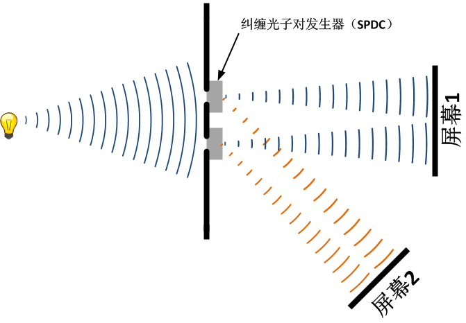
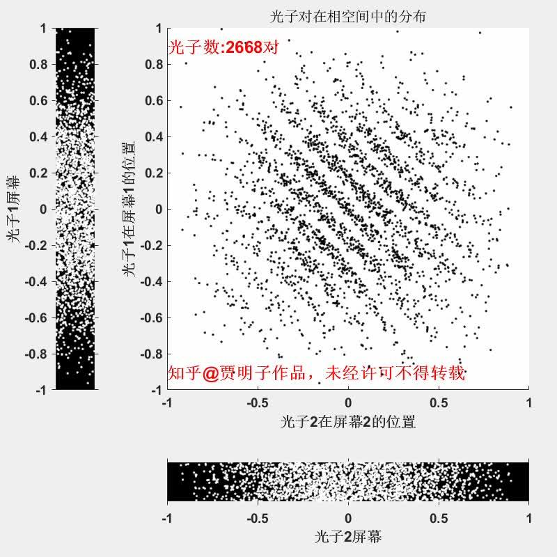

# 可视化双缝干涉之三：干涉条纹去哪儿啦？

我们在延时擦除实验上做一个简单的改动。我们仍然在每一条缝的背后都放置一个BBO晶体，来产生一对纠缠光子 – 姑且叫做“纠缠光子对发生器”。当光子撞击到它时，会被它吸收掉，同时又产生两个互相纠缠的光子，每个光子的能量都是被毁掉的光子的一半。现在，我们把这一对光子的其中一个（图中用蓝色表示）让它仍然射向原来的屏幕（屏幕1），然后我们布置另外一个屏幕（屏幕2），让另一个光子（图中用橙色表示）射向这个屏幕。这样一来，我们有两个屏幕，每个屏幕都从双缝的光源中接受到照射。

如果我们可以把两个缝中的橙色光子分别引入不同的探测器，来观察它的来源。比如说，如果我们发现一个橙色光子来源于上缝，那我们必然知道，相对应的那个蓝色光子也是来源于上缝。用这种方式，我们就可以知道射向屏幕1的每个光子都来自哪一条缝隙。这样一来，我们知道了“which path information”，必然会毁掉屏幕1上的干涉条纹。但是，现在我们并不打算这么做。我们来干这样一件事：我们把橙色光子打到屏幕2上，因而我们根本无法判断一个过来的一个光子到底是来自上缝还是下缝。因而，理论上，我们并没有获得任何的关于路径的信息，因而也就不会破坏干涉。

那么，这个实验会发生什么呢？两个屏幕上都有干涉条纹吗？事实上，每个屏幕上都不会有条纹。

我们把两个屏幕放在一起。当一对光子分别到达两个屏幕时，我们记下它们到达的位置（光子1，光子2），然后，我们在一个二维坐标系中把这一对位置标记下来。

模拟视频如下：

0

我们可以看到，每个屏幕上都不会有干涉条纹。但是，当我们考虑到达两个屏幕的光子对之间的关系时，在（光子位置1，光子位置2）这个configuration space中，就找到隐藏的干涉条纹了。

退相干理论最活跃的学者Zurek说：

> 干涉仍在，只不过它不在任何地方了。

编辑于 2022-12-29 10:21・IP 属地未知

