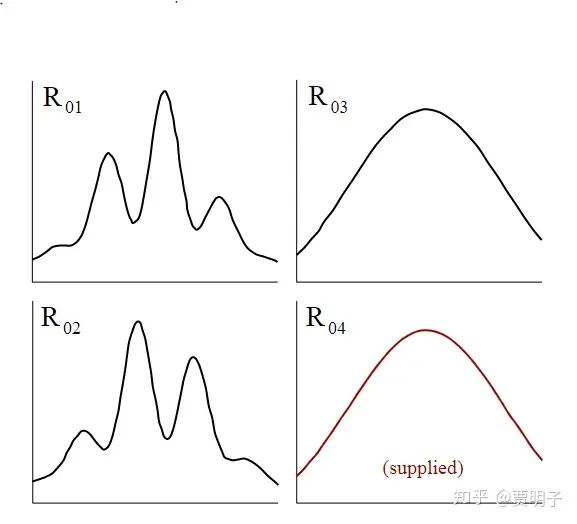

# 可视化双缝干涉之二：延时擦除

更新：双缝干涉的延时擦除是有实际实验结果的，结果在wiki的“Delayed choice of quantum eraser”可以看到。原论文：[arXiv](https://link.zhihu.com/?target=https%3A//en.wikipedia.org/wiki/ArXiv):[quant-ph/9903047](https://link.zhihu.com/?target=https%3A//arxiv.org/abs/quant-ph/9903047)

======

原文如下：

延时擦除实验室双缝干涉实验的一个变种，被认为是更加怪异的实验。本文通过几个模拟视频来试图把它讲清楚。

那么什么是延时擦除实验呢？

1999年[[4\]](https://zhuanlan.zhihu.com/write#_ftn4)，Kim等人完成了一个非常精巧的实验，被称作**“延时量子擦除实验”（delayed choice quantum eraser）**。这个实验可以通过改变一些实验步骤，人为选择“泄露”系统的路径信息，还是把泄露出来的路径信息重新“擦除”掉。然后人们发现，一旦路径信息泄露了，干涉就消失了，当人们把泄露的信息重新擦除掉，干涉就又神奇地回来了。似乎光子的行为会受到我们主观决定的控制一般。

它的示意图如下（图片来自维基百科）

右上角的光源经过双缝，照射到一个叫做BBO的非线性晶体上。这个晶体有一种特性，就是它可以吸收一个入射的光子，然后发射出两个纠缠的光子，每个光子的能量都是被毁掉的光子的一半。这两个光子经过一个光学棱镜，可以分别射向两个不同的方向。其中一个光子，射向我们的屏幕D0，用于进行干涉实验，我们把这个光子就叫做**信号光子**（signal photon）。而另一个光子，则射向另外一个方向，这个光子因为和信号光子来源相同，只要我们知道这个光子来自哪一条缝，我们就知道它的同伴“信号光子”走的是哪一条路径了，因此它可以看做是入射光子的路径信息标记，我们把它叫做标记光子（idler photon），或者我更喜欢把它叫做“**影光子**”（名字借用Deutsch的“the Fabric of Reality”中的形象化描述），表示它是信号光子的一个影子，我们可以通过观察这个影光子来了解信号光子。

现在一个光子的路径透过两条缝隙，它可能是左边的缝隙，也可能是右边的缝隙。我们把这两条路径分别用红色和蓝色表示。不论它透过哪一条缝隙，都会产生一对光子：信号光子和影光子。我们通过观察影光子的路径信息，就可以知道信号光子的路径信息了。这个影光子呢，我们把它射向一套虚线框出来的观察仪器，在这套仪器中，我们可以自由地决定是观察它的路径信息，还是把它的路径信息“擦除”掉。我姑且把这套仪器叫做“路径观测仪”。这套仪器我们在后面再详述。

那么现在，信号光子被引向屏幕，来做我们的干涉实验，而影光子被引向路径观测仪。我们可以通过观察影光子，来确定信号光子的路径，从而获得信号光子的路径信息。

在路径观测仪中，影光子首先经过一个棱镜。棱镜的作用是是光线发生偏折。这样一来，我们就把“红色的”影光子和“蓝色的”影光子的路径完全分开了。然后它们分别到达两个半透镜，BSa和BSb。半透镜是这样一种光学仪器，它表面镀了一层半透的反射层，可以使入射的光子一半被反射掉，另一半不被反射而直接透过它继续向前进。反射的光线分别到达两个探测仪，D3和D4。而透射的光线继续前行，到达两个反射镜，Ma和Mb，经反射后，在另一个半透镜BSc汇合。汇合后它们分别的反射和透射光线到达另外两个光子探测仪，D1和D2。那么，这个路径探测仪就可以做到探测影光子的路径，也可以擦除影光子的路径信息。这是怎么做到的呢？

为了描述简单，我们在不影响实验结果的前提下，把这个实验稍微改变一下。我们把BSa和BSb换成两个反射镜，当我们把反射镜插入光路时，它100%反射光线，而把它拿出来时，它完全不影响光线。这样一来它和半透镜就有相同的功能。现在，我们把这两个反射镜插入光路，会发生什么呢？

没错，所有的影光子全部被反射掉，所有的红色影光子会到达D4，而所有的蓝色影光子会到达D3。如下图所示：

这样一来，当我们在D4探测到一个光子的时候，我们立刻知道，它必然来自红色路径，也就是从左侧缝隙过来的。我们就知道，它相应的同伴，那个信号光子也是通过了左侧路径。同理，当我们在D3探测到光子的时候，我们就知道那个信号光子通过了右侧缝隙。这样一来，我们就可以观测到路径信息了。因而干涉就被破坏了。

而当我们把这两面反射镜拿走，又会发生什么？我们这时候不会再在D3和D4观测到任何光子，它们全部向前，最终到达了D1和D2。如下图所示：

而此时，我们清楚地看到，不论是D1，还是D2，都有一半的光子来自红色路径，而另一半来自蓝色路径。所以，当我们在这两个探测器上看到光子的时候，我们根本无法分辨它们从哪里来。因而，路径信息就被“擦除”掉了。在擦除模式下，我们并没有获得路径信息，因而就不会破坏干涉。

理论上，我们可以让影光子的路径很长，至少会远远长过信号光子的路径。那么，信号光子打在屏幕上，被拍照的时候，影光子还远远没有到达路径观测仪。当信号光子已经打在屏幕上之后，我们再来做一个决定，我们究竟是想要：

\1. 观察影光子来自哪一条缝隙、从而确定信号光子的路径的时候呢？

\2. 还是想擦除影光子所携带的路径信息？

根据互补原理，第一个决定我们获知了路径信息，将会破坏掉干涉，而第二个决定，我们擦除了路径信息，干涉将会得以保留。但是既然此时光子已经打在屏幕上，并且拍了照片，而我们在这之后才决定是否观察路径，进而决定是否存在干涉。

我们似乎就不得不认为，光子具有某种神奇的预知未来的本领，它可以预先知道我们在它到达屏幕之后会做出什么决定，然后按照我们将来的决定，配合我们演了一场戏，以确保我们不能同时知道它的路径信息和干涉条纹；又或者说，我们在未来的一个决定，穿越时空，回来影响了过去拍下的照片？！

下面我们用一个视频模拟来看看这个过程。首先是路径擦除模式。

对视频做一个说明，视频中下半部分是我们实际上看到的屏幕D0上光子的分布。而上半部分，则是我们队到达D0的光子进行标记，凡是那些“影光子”到达D1的，所对应的D0上的光子用红色表示，而影光子到达D2的，对应的D1上的光子用蓝色表示：

0

我们可以看到，干涉的确是存在的，但是并不是在屏幕上显示出干涉条纹，而是当我们把屏幕上的光子进行标记之后，对应于D1和D2影光子的两类光子形成的干涉条纹。

干涉藏在D0、D1、D2三个探测器之间的关系中，但是不在屏幕上。

然后我们来看看路径观测模式，这一次，红、蓝分别对应于D3、D4两个探测器的影光子：

0

我们发现，无论在哪儿，干涉都不存在了。

这就是所谓的“未来决定现在”的真相。也就是Greene所说的：

> ***未来只是在帮助我们讲过去的故事**。*

发布于 2019-05-09 15:47

[双缝干涉实验](https://www.zhihu.com/topic/19584260)

[量子物理](https://www.zhihu.com/topic/19577481)

[科普](https://www.zhihu.com/topic/19551585)

