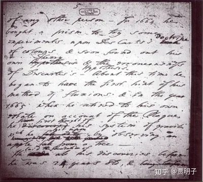
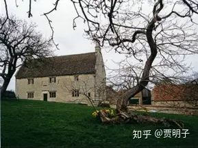
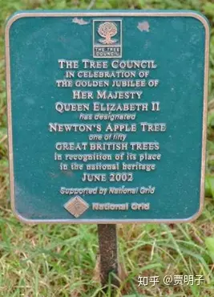
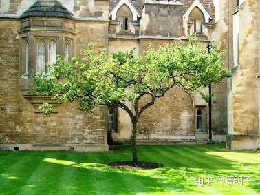

# （题外）那些年，教科书中的忽悠和反忽悠

在当年我学过的中小学语文课文中，有一些脍炙人口的名人故事，诸如爱因斯坦和小女孩、爱迪生救母亲、华盛顿和樱桃树等等。现在我女儿正值初中，所以我对现在小学生和初中生的课文也相当熟悉，一些故事历经这30年仍然在课本里，还有一些新的故事加入进来。现在看来，这些故事，颇有一些“心灵鸡汤”的味道。

然而，在自媒体发达的今天，人们思想越来越独立，近几年爆出各种质疑，各种刷爆朋友圈。本文不想引战，所以这些原文就不一一引用了，各位可以在网上搜一下，一搜一大把。比较流形的质疑包括：

- 爱因斯坦从来没有遇到请他教数学的小女孩；
- 牛顿的苹果树是子虚乌有；
- 伽利略从来就没有做过比萨斜塔实验；
- 华盛顿和樱桃树是编造的；
- “天才是99%的汗水和1%的灵感”这句话的后半句“那1%的灵感才是最重要的”被刻意隐瞒了；
- 牛顿的名言“站在巨人肩头”是在讥讽胡克是个侏儒；
- 爱迪生救母是假的；

……

**在这个毒鸡汤泛滥的时代，这么多的质疑，不禁让人替孩子们捏一把汗。**

说实在，在我看到这些质疑时，心里是有些快意的。

我自7岁入学，直至年近而立才从象牙塔中走出来，彻底结束求学生涯。我读书年头足够长，中小学生成长于中国高考竞争最为惨烈的地区、以及最为惨烈的时代 - “千军万马过独木桥”；大学成长于中国高等教育自惭形秽的时代；可以说我比大多数人更能体现传统的中国式教育之苦。直到现在早已过了愤青的年代了，仍然对早年的教育体验忿忿不平，颇有怨言。这些质疑 – 原来我们喝的都是毒鸡汤 – **让我有一些报复式的快感**。

但是，冷静下来一想，这些质疑都是真的吗？

捏造、骗人、忽悠、为了给孩子灌鸡汤不惜拙劣造假……，**教育专家们就算是有这么坏，但是难道会这么蠢吗？**毒害了孩子们，对国对己有何益处？

作为一个初中生的爸爸，本着为自己孩子负责的心态，对于网上几个主要的被揭穿的“骗局”，我真的做了一番考证。

结果并不出人意料：教科书中的这些故事，绝大多数有据可查，绝非简单的胡编乱造。**如果我们以纪实或史实的标准要求，这些故事有的不够严谨、有的尚有争议、有的已不可考，但是真正实锤它们是“谎言”的却不多。**对课文的严谨性我们尽可批评，这都是有益的。但是语文不是历史，允许艺术加工，也允许假借名人的寓言、传说和故事。只要是度掌握好就可以了。本文在此并无意讨论这个度该如何掌握，而是想说另一个问题。

在这个自媒体时代，**人人都可以义愤填膺地呐喊一嗓子，人人都可以轻易被震惊、被吓尿。似乎我们周围处处都是恶意满满的谎言和毒鸡汤。**但是，稍有常识的人都会知道，越是“令人震惊”，其可信度就越低。那么，在我们真的被震惊、跟随大家一起呐喊之前，我们应该先想一下，独立思考是个好东西，我们有吗？

**1、爱因斯坦和小女孩的故事是编造的吗？**

在**Walter Isaacson的传记《 Einstein: His Life and Universe》**（爱因斯坦：他的生活和他的大学） 19章中，有这么一段记载：

> The most famous of these involved an 8-year-old neighbor on Mercer Street, Adelaide Delong, who rang his bell and asked for help with a math problem. She carried a plate of homemade fudge as a bribe. “Come in,” he said. “I’m sure we can solve it.” He helped explain the math to her, but made her do her own homework. In return for the fudge, he gave her a cookie.
> A friend of Adelaide’s recalled going with her and another girl on one of these visits to Mercer Street. When they got up to his study, Einstein offered them lunch, and they accepted. “So he moved a whole bunch of papers from the table, opened four cans of beans with a can opener, and heated them on a Sterno stove one by one, stuck a spoon in each and that was our lunch,” she recalled. “He didn’t give us anything to drink.”
> Later, Einstein famously told another girl who complained about her problems with math, “Do not worry about your difficulties in mathematics; I can assure you that mine are even greater.” But lest it be thought he helped only girls, he hosted a group of senior boys from the Princeton Country Day School who were baffled by a problem on their math final exam.

大致翻译如下：

> 最著名的（故事）就是关于他在Mercer街道的邻居8岁女孩的，她叫做Adelaide DeLong。一天她去敲开爱因斯坦的大门请教一个数学问题。她带了一盘自制的软糖作为“贿赂”。“进来吧，”爱因斯坦说，“我肯定可以帮你解题。”他帮她解题，但是让她独立完成作业。并且回赠了她小点心。
> Adelaide的一个朋友仍然可以回忆起当时和她一起造访爱因斯坦家的经历。爱因斯坦请她们请吃午餐。“他把桌子上的一堆纸推在一边，开了几罐青豆罐头，用一个烤箱热了一下，每个罐头里放一个勺子，那就是我们的午餐”她回忆说。“他没给我们准备任何饮料。”
> 后来，就是其中被广为流传的一段对话。爱因斯坦对其中一个抱怨数学的女孩说，“不要担心你的数学问题，其实我自己的数学问题更麻烦。”他不光帮助了这一些女孩，他还召集了一批普林斯顿周边中学的男孩一起帮他们搞数学期末考试。

还有，在**国家地理杂志拍的系列纪录片“天才”的第十章中**，有这样一段：

> ……a little girl named Alice Edwards knocks on Einstein's door and asks the professor to tutor her in long division. Einstein sees a younger version of himself in the precocious kid who is constantly asking questions.
> "I wish my teachers were more like you," Alice says after one tutoring session. "You make this stuff sound fun."
> "It is fun," Einstein replies. "Thank you for reminding me of that."

大致翻译如下：

> 一个叫做Alice Edwards的小姑娘敲开了爱因斯坦的大门并且请求他辅导数学。爱因斯坦在这个小孩身上看到了自己童年时的那颗好奇心。
> “我真希望我的老师能像你一样，”Alice在某一次辅导结束后说，“你让数学变有趣了。”
> “是的，它很有趣，”爱因斯坦说，“谢谢你让我回想到了这一点。”

类似的片段在维基百科和一些其他纪实作品中也有提及，这些传记和纪录片显示，爱因斯坦和小女孩的故事绝非空穴来风。只不过前面所说的两个小姑娘Adelaide和Alice是否本是同一人，只不过被讹传为两个不同的人，就不可知了。

这些轶事，和课文的故事中并非完全相同。但是其核心是相同的：小姑娘送爱因斯坦点心，爱因斯坦辅导她数学。至于课文中的细节从何而来，还是艺术加工，我无法考证。毕竟传记本身源自爱因斯坦周围的种种传说，虽然作者找到小女孩本人加以证实，但是细节肯定不会完全复原。**但是至少说明课文并非凭空编造。这个故事真实性相当高，至少是“基于事实的改编”。**

**2、伽利略做没做过比萨斜塔实验？**

关于伽利略的比萨斜塔实验，其实情况相当清楚。下面是摘自维基百科的一段话：

> While this story has been retold in popular accounts, there is no account by Galileo himself of such an experiment, and it is accepted by most historians that it was a [thought experiment](https://link.zhihu.com/?target=https%3A//en.wikipedia.org/wiki/Thought_experiment) which did not actually take place.[[7\]](https://link.zhihu.com/?target=https%3A//en.wikipedia.org/wiki/Galileo%27s_Leaning_Tower_of_Pisa_experiment%23cite_note-7)[[8\]](https://link.zhihu.com/?target=https%3A//en.wikipedia.org/wiki/Galileo%27s_Leaning_Tower_of_Pisa_experiment%23cite_note-8) An exception is [Stillman Drake](https://link.zhihu.com/?target=https%3A//en.wikipedia.org/wiki/Stillman_Drake), who argues that it took place, more or less as Viviani described it, as a demonstration for students.
> 虽然这个故事在很多流行故事中讲过多次，但是伽利略本人从未述及这个实验。多数历史学家相信这只是个思想实验，实际上并没有证据显示它确实发生过。但是Stillman Drake认为它确实发生过，就像是Viviani所描述的那样，伽利略对他的学生们演示过。

在这里，**Viviani**，全名 [Vincenzo Viviani](https://link.zhihu.com/?target=https%3A//en.wikipedia.org/wiki/Vincenzo_Viviani) (1717)，是伽利略的一个学生，在他所写的伽利略传记中，记载了这个实验。原文和英译文如下：

> ...dimostrando ciò con replicate esperienze, fatte dall'altezza del Campanile di Pisa con l'intervento delli altri lettori e filosofi e di tutta la scolaresca...
> ...Galileo showed this [all bodies, whatever their weights, fall with equal speeds] by repeated experiments made from the height of the Leaning Tower of Pisa in the presence of other professors and all the students...

大致翻译如下：

> 伽利略在一些其他教授以及他的所有学生见证下，通过从比萨斜塔的顶部多次试验证明了它（自由落体定律）。

也就是说，**在伽利略学生的记载中，比萨斜塔实验这是一个确实发生的实验，**只不过因为这个孤证无法考证，而未被历史学家普遍采信。但是，**这虽然是孤证，但是有文献，有记载，并且文献来自可靠的作者，过程明确无误。在课文中出现这个故事却绝不是凭空捏造的一个“谎言”。**

**3、启发了牛顿发现万有引力定律的苹果树是否存在？**

与前面的故事相比，那些对牛顿苹果树的质疑就显得十分无聊。我甚至从来就没看到过这些质疑的依据何来，只看到网上到处流传的愤怒的、毫无理性的指责。甚至有人把它称作“物理学四大谎言之一”。但是这些指责毫无根据，纯属虚构。

下面是维基百科的描述：

> Newton himself often told the story that he was inspired to formulate his theory of gravitation by watching the fall of an apple from a tree.[[150\]](https://link.zhihu.com/?target=https%3A//en.wikipedia.org/wiki/Isaac_Newton%23cite_note-FOOTNOTEWhite199786-150)[[151\]](https://link.zhihu.com/?target=https%3A//en.wikipedia.org/wiki/Isaac_Newton%23cite_note-151) Although it has been said that the apple story is a myth and that he did not arrive at his theory of gravity in any single moment,[[152\]](https://link.zhihu.com/?target=https%3A//en.wikipedia.org/wiki/Isaac_Newton%23cite_note-Berkun2010-152) acquaintances of Newton (such as [William Stukeley](https://link.zhihu.com/?target=https%3A//en.wikipedia.org/wiki/William_Stukeley), whose manuscript account of 1752 has been made available by the Royal Society) do in fact confirm the incident, though not the cartoonish version that the apple actually hit Newton's head. Stukeley recorded in his *Memoirs of Sir Isaac Newton's Life* a conversation with Newton in Kensington on 15 April 1726……
> John Conduitt, Newton's assistant at the Royal Mint and husband of Newton's niece, also described the event when he wrote about Newton's life...

翻译如下：

> 牛顿本人经常述及，它通过观察苹果落地获得灵感因而得到了万有引力理论。虽然有人说这个故事只是个传说，牛顿本人不可能仅仅是通过这样一个单一事件就获得灵感，牛顿身边的熟人却证实了这件事的真实性（例如 William Stukeley，他关于这件事的手稿在皇家科学院可查）。当然，并非像传说中“苹果砸在脑袋上”那样戏剧性。他在《牛顿爵士的一生》中记载了发生于1726年与牛顿的相关谈话。……（谈话就不引用了）
> John Conduitt，牛顿的助手兼侄女婿，也曾有此描述。……

在约克大学的网页上，有着关于牛顿苹果树历史的详细考证。

[Physics, The University of Yorkwww.york.ac.uk/physics/about/newtonsappletree/](https://link.zhihu.com/?target=https%3A//www.york.ac.uk/physics/about/newtonsappletree/)

其中说到：

> The account of Isaac Newton's discovering the principle of universal gravitation by observing the fall of an apple is very well known and usually dismissed as apocryphal. However little can be further from the truth for Newton gave this account of his discovery to several acquaintances which include Voltaire (French philosopher and essayist), John Conduitt (his assistant at the Royal Mint) Catherine Barton (his niece) William Stewkeley (friend and antiquarian), Christopher Dawson (a student at Cambridge) amongst others. The first written account appears in notes on Newton's life collected by John Conduitt in 1726 the year of Newton's death. It states that;
> 牛顿通过观察苹果落地获得万有引力原理的故事广为人知，但时不时也被认为是一件可疑的传说。但是这些质疑在这样一个事实面前毫无力度：牛顿本人曾经把这个过程描述给他的多个熟人听，包括Voltaire、John Conduitt、Christopher Dawson等等。

第一个文字论述苹果树的历史文献，上写“他最初想到引力系统是因为他观察到一个苹果从树上落下”

与“牛顿的苹果树存在”这个共识不同，具体这棵树具体存在于何处仍有争议。Grantham 国王学院宣称自己在牛顿去世后几年购买了原树，并把它挪到了校长办公室的花园中，因此它的那棵才是“正统”的苹果树。但是现在大家一致接受的是牛顿家乡花园中，最初文献中记载的花园中的唯一那棵。这棵树现在每年仍在收获苹果，并且检测年龄与牛顿的年代相符。

“正统”牛顿苹果树

这棵树被“树木委员会”评委英国五十大名树之一

牛顿工作的剑桥的三一学院有一棵小苹果树，是学院特地从“正统”苹果树上取枝条繁殖而来，号称是这棵树的“后裔”。我虽没有见到过原树，却曾经有幸目睹那棵小树。

由此可见，**牛顿苹果树的故事，其真实性极高，可靠性达到了史学标准。**唯一有一点可以被质疑的地方，就是牛顿本人为了说明他对万有第一定律的原创，自己撒谎编造了这个故事。但是这个质疑捕风捉影，毫无实据，而且不合逻辑：如果真的如此，牛顿在生前就应该在公开场合发表这个说法，而不是在死后由身边人说出来。

**4、华盛顿的樱桃树纯属子虚乌有？**

相比之下，华盛顿樱桃树的故事似乎可信度就相对低一点。但是这也**绝非教科书或儿童读物编织出来的东西**。这个故事最早出现在Weems所著的1806年第五版《华盛顿传》之中：

> “…an aged lady, who was a distant relative, and, when a girl, spent much of her time in the family ..”
> “The following anecdote is a case in point. It is too valuable to be lost, and too true to be doubted; for it was communicated to me by the same excellent lady to whom I am indebted for the last.”
> "When George," said she, "…"

大致翻译如下：

> “... 一位老太太，华盛顿的远房亲戚，在童年曾经在华盛顿家中住了很长时间.……”
> “下面这个轶事是绝佳的例子。这件事令人珍惜，且绝无可疑，因为这是前面同一位老太太亲口告诉我的。她说……（樱桃树的故事）”

Weems本人名声并不太好，他是个作家兼书商，因而有**足够的动机**制造一些有趣的轶事来增加销量。在他的书中，那位叙事来源的“远房亲戚”并未指明来源，**不具备史学意义上的可考证性**。另外人们发现他书中喜欢用夸大的手法。因而这些故事并不具有很高的史学价值。

在维基百科中说道：

> It went on to be reprinted in the popular [McGuffey Reader](https://link.zhihu.com/?target=https%3A//en.wikipedia.org/wiki/McGuffey_Reader) used by schoolchildren, making it part of the culture, causing Washington's February 22 birthday to be celebrated with cherry dishes, with the cherry often claimed to be a favorite of his.
> In 1896 [Woodrow Wilson](https://link.zhihu.com/?target=https%3A//en.wikipedia.org/wiki/Woodrow_Wilson)'s biography George Washington was published, calling it a fabrication, after which almost all historians of the period followed suit, even though the story was never denied by Washington's relatives, notably [Eleanor Parke Custis Lewis](https://link.zhihu.com/?target=https%3A//en.wikipedia.org/wiki/Eleanor_Parke_Custis_Lewis) (1779-1852).
> In spite of the speculation offered by some historians, Phillip Levy argues that the story remains plausible and has not been proven or disproven.

> 这个故事随后出现在美国的教科书中，并成为美国文化的组成部分。华盛顿的生日2月22日就是用樱桃来庆祝的。
> 1896年Woodrow Wilson的华盛顿传记出版，其中认为这个故事是编造的。随后当时几乎所有的史学家跟风而进，虽然樱桃树的故事从来就没有被华盛顿的亲属们否认过，特别是他的继承人，继孙女Eleanor Parke Custis Lewis。
> 尽管一些史学家们的推测不利于这个故事，但是史学家Phillip Levy认为它仍然是可信的，只是未被证实也未被证伪。

也就是说，史学家倾向于认为这是个编造的故事，但是并没有任何实锤证据，也有些史学家认为它是真实的。我们可以认为，**它有可信度，但是来源的可靠性不高，真实性未能达到史学标准，但是它并不能被认定为“谎言”**。

事实上，最近，华盛顿的侄孙Austin Washington宣称，樱桃树的故事是真实的，只不过他并没有砍倒樱桃树，而只是把它剥了皮。因此**严格讲，学术圈中并不承认樱桃树故事的真实性（但是也并不否认），而在吃瓜群众看来，这仍然是一桩公案。**

**5、爱迪生的名言“天才是99%的汗水和1%的灵感。”是断章取义吗？**

这个其实已经有知友给出过考据了，事实证明，所谓的被故意隐去不给我们看的“其实那1%的灵感才是最重要的”这**后半句话才是子虚乌有。教科书上的名言，是货真价实的。**

[“天才就是1%的灵感加上99%的汗水”真的有下半句吗？60 关注 · 17 回答问题](https://www.zhihu.com/question/20959742)

事实上，爱迪生的这句名言，在不同的场合中，出现过各种不同版本。（爱迪生得是有多么热爱刻骨工作啊），包括：

> “talent is perspiration，才能即汗水”（1892年，《Men Women and Affairs》）；

> “genius is inspiration, talent and perspiration.天才是灵感、才能、以及汗水”（1893年，Riverside日报）

> “genius may be divided into two parts, of which inspiration is 2 per cent and perspiration 98.天才可分为两部分，2%灵感和98%汗水”（1896年，萨凡纳论坛报）

> “Genius is 1 per cent inspiration and 99 per cent perspiration.天才是1%的灵感和99%的汗水”（1901，Idaho日报）

把这句名言真正推向大众的，是**1910 年Frank Lewis Dyer所著的传记《爱迪生：他的生活和发明》**

> The idea of attributing great successes to “genius” has always been repudiated by Edison as evidenced by his historic remark that “Genius is 1 per cent. inspiration and 99 per cent. perspiration.” Again, in a conversation many years ago at the laboratory between Edison, Batchelor, and E.H. Johnson, the latter made allusion to Edison’s genius as evidenced by some of his achievements, when Edison replied: “Stuff! I tell you genius is hard work, stick-to-it-iveness, and common sense.”

> 把成功归因于“天才”的说法一直被爱迪生所排斥，例如他的名言说“天才是1%的灵感和99%的汗水”。多年以后爱迪生、Batchelor和Johnson的一次谈话中，后者说爱迪生是如何天才，爱迪生说，“胡说！我来告诉你，天才就是刻苦工作，坚持到底，以及常识。”

我不知道网络中关于这句名言的谣言起自何处，但是**我们有100%的证据说明，这句话来源可靠，没有半点曲解原意或断章取义的地方。**

**6、小心眼的牛顿在讥讽胡克？**

牛顿有一句名言，“如果我看得远一些，是因为我站在巨人的肩膀上”。教科书把它当做牛顿自谦的例证，但是，一些网友们却说，这是牛顿在讥讽他的老对手胡克，因为胡克是个驼背的小矮个。

我查到这句话的出处确实与胡克有关，因为它出自1676年写给胡克的一封信中。事实上，确实有史学家认为牛顿是在讥讽胡克是侏儒（John Gribbin）。但是“站在巨人的肩膀上”出自17世纪诗人Herbert的诗篇*Jacula Prudentum* ，大意是“侏儒站在巨人肩膀，可以看到两个人的视野”，**如果牛顿是在讽刺某人是侏儒，那么他只能是讽刺自己。**因而这个质疑其实站不住脚。

**7、爱迪生救母是真的吗？**

爱迪生用反光镜照亮房间，因而使得母亲阑尾炎手术得以顺利进行，救了母亲一命。这个故事出处不像前面那些那么容易考证，但是稍微仔细一点也能找到，它出自1940年的传记片《年轻爱迪生》。在这部影片中，爱迪生把多个灯光集中反射到一面大镜子，使得母亲手术得以成功进行。

IMDB中可以找到这部影片。影片的类别是**传记**。传记片虽然不像纪录片那样追求严谨真实，但是仍然和故事片很不同，有着很大的事实基础的。因而这部影片中的情节**虽然不能认定为真实的，但是应该说作为故事和传说有一定的可能性。**

我们发现，课文中的故事和这个主要区别在于，课文中画蛇添足地把手术具体成了阑尾炎手术，因而被实锤虚假，这一点是没得洗的。但是，新版的课本已经把这个故事给抽掉了。可见我们的教育专家们也是知错能改的。

我们可以看到，上面这些故事，有的可能史料严谨性不足有之，或者史料争议性有之，甚或不可考有之。但是我们冒然斥之为“凭空捏造的谎言”，却是一个比原文更加不负责任的胡说八道。以**如此草率的态度地批评课文的严谨性，以煽动性的非理性语言指责课文的可靠性，难道不是一个讽刺吗？**

另外，语文课文并非严谨史料。它所承担的主要任务并非教育大家历史，而是传递文字的应用和手法、以及美好的情操。涉及名人当然以严谨为好，但是那些关于名人的传说本身就难以考据，如果苛求忠于严谨的史实，我们可能不得不放弃所有的名人轶事。关于他们的传说之所以流传，不正是因为它们传达了人们向往的美好品质诸如好奇、诚实、童真等等吗？**如何在可信度、可靠性、思想性、故事性和文字的优美之间平衡，是一个可以理性讨论并且需要理性讨论的话题，本文无意涉及。但是动辄高喊“谎言”、“编造”，甚至上升至“中国教育如何如何”，这种被愤怒的网络情绪裹挟态度显然不在理性讨论之列。**

发布于 2018-09-19 00:40

