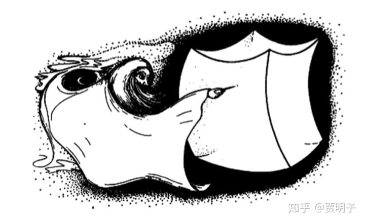
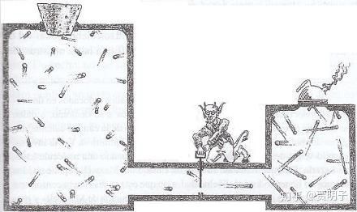
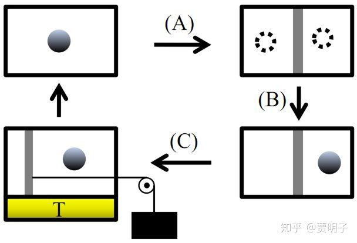
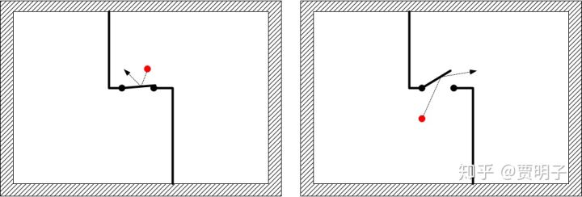
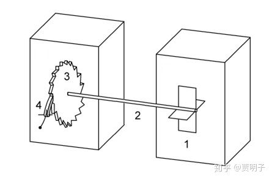

[开胃菜：从麦克斯韦之妖到兰道尔原理](https://zhuanlan.zhihu.com/p/81273559)

> ***“You should call it entropy, for two reasons. In the  first place you uncertainty function has been used in statistical  mechanics under that name. In the second place, and more importantly, no one knows what entropy really is, so in a debate you will always have  the advantage.”\***
> ***“你把它（信息）叫做熵吧，有两个理由，第一，你所说的这个不确定函数在统计力学中早已经用这个名字了；第二，并且是最重要的，没有人知道熵到底是个神马东东，所以你将永远立于不败之地。”\***

\- ***冯诺依曼，与香农的对话\***

**一、写在最前面的废话**

好吧，这个专栏是我和粲粲瞎扯淡之第三弹：**时间**。

关于时间的讨论，内容还没有想好。我想我大概会覆盖一点点**时间哲学**，诸如A理论、B理论、现在主义、永恒主义、奥古斯丁、康德、牛顿与莱布尼兹之争等等，然后再延伸到相对论时空观，再有一点点关于心理时间的讨论。但是绝大部分内容，其实不是时间的**本体论**，而是**时间之箭**。也就是热力学。

前面已经完成的两个专栏各自牵出两只神兽镇宅，一个是**拉普拉斯之妖**，另一个是**薛定谔猫**。涉及两个话题：未来、现实，第一部分主要是非线性动力学以及混沌理论的浅显解读；第二部分则应我女儿要求，刻意侧重了一点非我所长的哲学讨论，包括了一些形而上学的内容以及现代量子力学背景下对实在论和反实在论的讨论。它们在这两个专栏：

[魔鬼眼中的自然界](https://zhuanlan.zhihu.com/c_116602381)[zhuanlan.zhihu.com](https://zhuanlan.zhihu.com/c_116602381)[zhuanlan.zhihu.com](https://zhuanlan.zhihu.com/c_186387023)

因为对“熵”背后的含义，我一直没搞懂过 - 虽然我可以轻易地用各种术语把非专业人士侃到怀疑人生，但是这丝毫不能掩盖我对熵完全不能理解的事实。当然也不是一点都不知道，但是**知道一点却又似是而非，真的比一点都不知道痛苦。如果真的一点都不知道，我就可以衷心地对“熵是混乱度”这个说法无比景仰而毫不疑惑。**

玻尔兹曼自杀了，艾伦费斯特自杀了[[1\]](https://zhuanlan.zhihu.com/write#_ftn1)，我这个谋生的手段 - 热力学，真的让人害怕。

然鹅我还是决定去碰碰这个话题，用一种**非专业**的心态：不怕有错，只怕没趣。有趣才是科普的第一步门槛。

虽然对这一部分内容还没规划清楚，但是我还是强行启动，因为这一周是粲粲进入高中的日子。这里我先牵出另外一只著名的神兽，**麦克斯韦之妖**，用它来为我开路。这是以前为某个知乎问题写的回答，后来感觉不满意没往外发。现在牵出来溜溜吧。本文主要用来梳理一些概念，它是个开胃菜，而不是主菜，这里涉及的一些概念，将会是本专栏陆续讨论的主题。

**二、麦克斯韦之妖及其变种**

> ***“ One of the best established facts in thermodynamics is that it is  impossible …… (for isolated system in equilibrium) to produce any  inequality of temperature or of pressure without the expenditure of  work. This is the second law of thermodynamics, and it is undoubtedly  true as long as we can deal with bodies only in mass, and have no power  of perceiving or handling the separate molecules of which they are made  up. But if we conceive a being whose faculties are so sharpened that he  can follow every molecule in its course, such a being, …… would be able  to do what is at present impossible to us. …… Now let us suppose that  such a vessel is divided into two portions, A and B, by a division in  which there is a small hole, and that a being, who can see the  individual molecules, opens and closes this hole, so as to allow only  the swifter molecules to pass from A to B, and only the slower ones to  pass from B to A. He will thus, without expenditure of work, raise the  temperature of B and lower that of A, in contradiction to the second law of thermodynamics.”\***
> ***“热力学中最牢固的一个事实是，（一个平衡的孤立系统）不可能在没有外部做功的情况下产生温度或压力的不平衡。这就是热力学第二定律，它毫无疑问是正确的\*** ***–  前提是我们只能处理整体，但是没有能力处理构成这个整体的每一个分子。但是如果我们想象这样一个生灵，它能力强大能够操作每一个分子，那么它……将可以做出很多对我们现在而言绝无可能的事情。假设我们有一箱气体被分成两个区域，A和B，分割板上面有一个小洞。这个能够观察每一个分子的生灵，可以打开或关闭这个小洞，只允许速度快的分子从A飞向B，而速度慢的分子从B飞向A。如此一来，不需要任何外界做功，我们就可以升高B区的温度而降低A区的温度，从而打破热力学第二定律。”\***

 下图是历史上人们对这个过程的诸多可视化描述之一：

和著名的“**拉普拉斯之妖**”类似，这段话也可能是科学史上被引用次数最多的叙述之一。它来自伟大的麦克斯韦1871年的专著，“Theory of Heat”。这里面的这个“生灵”，后来被著名的开尔文勋爵称为“**麦克斯韦之妖**”，现在成为网络上的著名四大神兽之一。为何这段话会如此有名呢？

因为热力学第二定律。

热力学第二定律可算是整个自然科学中最基础的定律之一，在很多人看来 – 包括普朗克和爱因斯坦，甚至都没有这个“之一”。比如说，爱丁顿爵士说过：

> ***“The law that entropy always increases—the second law of  thermodynamics—holds, I think, the supreme position among the laws of  Nature. If someone points out to you that your pet theory of the  universe is in disagreement with Maxwell’s equations—then so much the  worse for Maxwell’s equations. If it is found to be contradicted by  observation, well, these experimentalists do bungle things sometimes.  But if your theory is found to be against the second law of  thermodynamics I can give you no hope; there is nothing for it but to  collapse in deepest humiliation”\***
> ***“热力学第二定律，我认为，在自然定律中有着至高无上的地位。如果有人指出你的理论与麦克斯韦方程不符，那么麦克斯韦方程该遭殃了。如果你的理论与实验结果不符，好吧，这些实验物理学家总是犯错误。但是，如果你的理论被发现与热力学第二定律不符，我保证你将毫无希望，你将无处可逃，只能在汹涌的羞辱声中宣告失败。”[[2\]](https://zhuanlan.zhihu.com/write#_ftn2)\***

然而在同时，相比于其它诸如三大守恒定律、最小作用量原理等等，热力学第二定律也是一个非常令人迷惑的定律。首先，它不同于其它几个定律，在本体论上非常符合直觉。而热力学第二定律在这一点上就显得不那么显然；其次，熵这个概念，看起来有些抽象性，不像是能量、动量、或者作用量之类的那样符合直观；第三，也是最难解的，它似乎与物理学的其它领域相冲突 – 这里我指的是**时间对称性**。

进而，对熵的理解，也有着不完全一致的好几类。除了最“现象”上的克劳修斯熵之外，单只统计力学上，就有着好几种，诸如玻尔兹曼熵[[3\]](https://zhuanlan.zhihu.com/write#_ftn3)、吉布斯熵、冯诺依曼熵、香农熵[[4\]](https://zhuanlan.zhihu.com/write#_ftn4)等等，数学上则更多。进一步的，在诠释上，诸如遍历派、系综派、Jaynes派、马尔可夫派等等不一而足。**这种不一致性恰恰成就了麦克斯韦之妖的魅力。** 

在十九世纪末，统计力学刚刚起步，人们并不明白热力学第二定律在本质上意味着什么。人们也不知道，这种麦克斯韦之妖是不是违反物理定律 – 至少人们看不出原则上它有何不妥之处。从而热力学第二定律就面临着挑战。

麦克斯韦所言的是一种神通广大的“being”，就物理学而言这显然太模糊了。既然是讨论物理，我们必须假设这个妖怪本身是自然的而非超自然的：它满足物理定律。那么，为了进行物理上的讨论，我们就需要一些更加详细的设计。

**Szilard[[5\]](https://zhuanlan.zhihu.com/write#_ftn5)引擎**就是最著名的一种设计，它是麦妖的变种：这种引擎的最简形式是一个“单分子气体”[[6\]](https://zhuanlan.zhihu.com/write#_ftn6)，它与外界保持恒温。此时分子可能在箱子的左侧，也可能在箱子的右侧。这时候，我们向着箱子的中间插入一个活塞。这个活塞的一侧是空的，而另一侧则有一个气体分子。气体分子运动时，会撞击活塞，把它向着相反的方向推动。如果此时我们把活塞连接一个重物，则重物就会在活塞的带动下被提升，从而实现对外做功。

当然，这里的一个关键就是，我们能够对分子做出观察。当我们塞入活塞的时候，我们能够知道分子到底在活塞的哪一侧。只有这样我们才能实现对重物的提升。而分子，在在与外界的热平衡中吸取热量，保持运动。这样一来，这个引擎就能够通过对分子的观察而从环境吸热并完全转化为对外做功。

Szilard引擎是一个简单到不可思议的设计，然而却让人看到了实现麦妖的一种可能性。事实上，通过相衬显微镜配合高速摄像机作为观察手段，人们已经在布朗运动的过程中实现了这一过程[[7\]](https://zhuanlan.zhihu.com/write#_ftn7)。

 那么，热力学第二定律被打破了吗？

**三、麦克斯韦之妖并不违反热力学第二定律**

然而我们必须要说明的是，麦克斯韦本人并不反对热力学第二定律。他的原意在上述的论述中非常清楚：热力学是一个宏观定律，**如果**我们能够做到对宏观物体的每一个分子进行精细操作，那么我们将打破热力学第二定律。这与现代统计力学上对熵的诠释其实并不矛盾。承认了麦克斯韦妖，等于承认了我们的微观操作能力（或者我们区分微观态的能力）。

 这里我用玻尔兹曼熵（我把各种熵的区别放在本专栏中讨论）做出更进一步说明：

![[公式]](https://www.zhihu.com/equation?tex=S%3DklnW) 

我们知道，当我们谈论一个系统的“状态”时，我们必须要区分“**宏观态**”和“**微观态**”。

何为微观态？**微观态就是指我们对一个系统中的所有组成粒子的动力学状态进行描述**。在经典力学中，就是描述每一个粒子的位置和动量。当我们说，我们知道了一个系统的微观态时，我们的意思是说，我们把系统中的每一个粒子的状态都知道的清清楚楚 –  很遗憾，这是不可能的，原因至少是因为这样一个事实：任何一个宏观系统，都是由大量的微观粒子组成的，约有10^23个之多。并且因为混沌的原因，我们对每个粒子的状态必须要知道得足够精细，否则分形的性质将使得我们对其完全不可分辨。

[贾明子：11、分形：小小体积可以充满大大空间吗？](https://zhuanlan.zhihu.com/p/28574121)

[zhuanlan.zhihu.com](https://zhuanlan.zhihu.com/p/28574121)

我们根本就不可能有足够的存储器（哪怕把整个宇宙的物质都用作存储设备）来存储这些信息。

那么，我们对一个系统的描述，就必须是模糊化的，整体化的。我们放弃那种区分那些**宏观上无法区分**的微观态的试图，转而把它们划为一组，当做是同一种状态，并且用（少量）我们宏观上可区分的变量来描述。这一组不可区分的微观态，在我们宏观的眼睛中看到的就是一个状态，就是宏观态。

做一个类比。比如说你们的一次考试。考试一共100分，由50道题目组成，每题2分。考试结果下来后，老师宣布，小明82分，小红96分等等。那么，对于“小明82分”来说，你知道了一个整体情况：小明的学习成绩还不错，但是也算不上优秀。这就是对小明这次考试成绩的一个宏观态的描述。通过成绩你知道小明一共错了9道题，但是你并不知道他到底错了哪九道题。从这50道题中任意选取9道题，一共有这样多种不同情况：

![[公式]](https://www.zhihu.com/equation?tex=C%5E9_%7B50%7D%3D%5Cfrac%7B50%21%7D%7B9%2141%21%7D%3D2505433700) 

也就是说，一共有上面那么多种可能性，最终都会导致小明得分82分。以上的每一种情况，就是一个微观态。当我们知道小明的成绩时，我们只是在“宏观”上大概知道了小明的学习情况，但是我们并不能从“微观”上知道小明具体的情况。我们对他试卷是充满了不确定的。

**简言之，宏观态就是一组我们无法分辨的微观态的集合。**

那么，玻尔兹曼熵说的就是，一个宏观态的熵，就是它所包含的所有可能微观态的数目，取对数后再乘以一个常数（玻尔兹曼常数）。（此处将在后续展开）

 例如说，在上述例子里面，小明82分这个宏观态下，熵就是（我们忽略掉玻尔兹曼常数）

![[公式]](https://www.zhihu.com/equation?tex=S%3Dln2505433700%5Csimeq9.4) 

对于某个特定的宏观态，我们一般会用少数几个状态量来描述它。最简单的系统，包含了同一种组分，同一个相态，**对这种系统我们用两个状态量来描述（相比之下一个微观态我们用6N个变量描述，N是粒子数目）**，比如说温度和压力。已知温度和压力，我们就确定了一个宏观态。然而这种宏观态中的每一个粒子的状态，我们一无所知。我们只知道，这种宏观态由无数种我们不可辨的可能微观态组成：每个粒子的每一种可能的排列组合。

当粒子数非常巨大的时候，这种排列组合的数目将会更加庞大。其中一部分排列组合对应着一种宏观态，另一部分则对应着另一种。一个数学上的事实是，在当这个数字很大的时候，在所有的可能排列组合中，绝大绝大绝大多数对应着同一个宏观态：平衡态。这就是一种对第二定律的统计解释：**平衡态就是熵最大的状态，也就是是所有可能状态中最最可能出现的状态。**因为所有可能的粒子状态组合中，极大多数的组合是我们无法分辨的、对应着同一个宏观态，平衡态。在彭罗斯的《皇帝新脑》中用一个形象的漫画来描述这种极大可能：在所有可能状态组成的空间中，只有上帝的极细的针头才可能“戳中”那一点点对应着非平衡态的空间。

我们因而可以看出，麦克斯韦妖对微观状态的分辨能力，显然打破了这种机制：如果我们能够分辨出一个平衡态中所包含的不同的微观态，我们就没有理由把它们看成同一个宏观状态，进而“熵”和“熵增”就不再有意义。这恰恰是玻尔兹曼对熵的解释。

**从这个意义上，麦克斯韦妖并不违背热力学第二定律的统计解释。**

我们于是得到了一个很Jaynes的看法：熵其实是一种统计的、表征我们对系统**无知程度的度量**。当我们谈论一个系统的熵的时候，我们有一个前提，就是必须要事先要定义好系统的宏观态 –  因为熵是状态量，没有定义好的宏观态也就没有熵。而宏观态就是对所有可能的微观态进行分组的规则，宏观变量就是一种限制规则，这种规则就限定了一组可能微观态的集合。规则越少，则集合的限定越少，进而集合就越大，因而熵就越大。因而当我们仅仅用T、P两个状态变量定义整个宏观态的时候，我们得到了很大的集合；而当我们对系统不同区域用不同的T、P进行限制的时候，我们事实上采用了更多的限定规则，因而我们得到的集合就更小。这就是熵增。

无所不能的麦妖能够观察每个粒子的状态，在它眼中，每个微观态都是单独的、可区分的，完全没有必要搞这种“宏观态”的分组。一切过程，都是严格的0熵过程（即只有一个确定的微观态）。把气体分离成两个温度不同的区域，也是一个0熵过程。

现在，对麦克斯韦之妖我们的结论看似与主流很不同。这个可怜的小家伙其实并没有什么妖异的地方，**它只是向我们说明了，熵是个统计概念这个简单的道理**（当然，后续我们会讨论，热力学第二定律并非用统计原理就可以简单解释的，这里的水深得很呐）。

> *“The entropy of a thermodynamic system is a measure of the degree of  ignorance of a person whose sole knowledge about its microstate consists of the values of the macroscopic quantities Xi which define its  thermodynamic state. This is a completely ‘objective’ quantity, in the  sense that it is a function only of the Xi; and does not depend on  anybody’s personality. There is then no reason why it cannot be measured in a laboratory”*
> *“热力学系统的熵就是一个人无知程度的度量，此人对微观态的全部知识仅限于几个宏观变量Xi所定义的热力学状态。它仅仅是Xi的函数而不依赖于个人，从这个意义上说它可以说是一个完全‘客观’的物理量。”**[[8\]](https://zhuanlan.zhihu.com/write#_ftn8)***

**四、信息、Szilard原理和Landauer原理**

Szilard在提出他的引擎思想实验的时候，其实很明白，一个纯物理的麦妖是无法打破热力学第二定律的。他的目的，是要找出这样一个边界：**包含了某种智慧生物的系统中，热力学定律是否仍然成立？它在何种情况下可能不成立？**

> *“The objective of the investigation is to find the conditions which  apparently allow the construction of a perpetual-motion machine of the  second kind, if one permits an intelligent being to intervene in a  thermodynamic system.”*
> *“我的目的是要找到这样一种情况，如果我们允许一个智慧生物对热力学系统进行干预的话，在何种情况下能够成立一种第二类永动机。”**[[9\]](https://zhuanlan.zhihu.com/write#_ftn9)***

**这里，所谓的“智慧生物”就是指具有信息处理能力的东东。**

我们可以看到，之所以麦妖视角与我们不同 – 它可以看到一切都是0熵过程 - 最关键的一点就是，我们的信息是不对称的：麦妖知道粒子的全部信息，而我们则只能观察寥寥数个宏观变量。麦妖所知的信息量是我们无可比拟的。

我们可以再回到Szilard引擎来看这个问题。这个引擎可以连续运转 – 或者说，可以形成一个循环 –  的前提就是，我们要对分子做出观察。我们必须要知道分子的位置在活塞的哪一侧，这样我们才可以选择把重物“挂”在他的同侧，因而分子与活塞的碰撞才能提升重物。这个“分子在左侧还是右侧？”的信息必须被提取出来。我们把“分子在左侧”用数字0表示，而把“分子在右侧”用数字1表示，那么上述问题恰恰就可以用一个比特（bit）的信息量来回答。通过对Szilard引擎的热力学分析（这里我暂时不做详细展开），我们可以得到这样一个结果：对于一个循环下来，由于引擎对外做功所导致的熵减，就等于：

![[公式]](https://www.zhihu.com/equation?tex=%5CDelta+S%3Dkln2) 

而这里好巧不巧，ln2就是我们获得信息的信息熵。

因而，我们可以说，信息的获取，就必须为这个系统所“丢失”的熵负责。为了使热力学第二定律得以在整体上获得成立，Szilard就此断言：

**信息可以转化为“负熵”，\*获取一个比特的信息量，将会以kTln2的能耗为代价。\***

这个，叫做**Szilard's Principle（西拉德原理）。**

上世纪中页，一个全新思路诞生了：**信息，就是熵。**如果非要在这句话上加一个限制的话，那就是，信息，就是熵的**一种形式**。

什么是信息呢？从最直观的角度讲，**信息就是使我们知道，也就是消除我们的“不知道”** – 消除我们对某事件的**不确定度**。那么相应地，信息量的多少，就是我们知道这个信息后，所消除的不确定度的多少。

比如说，你面对着两道不会的题目，一道判断题，一道选择题。如果这两道题目分值相同，你希望我告诉你哪一道题的答案？我想，你会毫不犹豫地选那道选择题 –  因为选择题只有25%的概率蒙对，而判断题则有50%的概率。你对选择题更加不确定，因而一道选择题的答案所包含的信息，就比一道判断题答案的信息多。

这个例子很形象地向我们说明，对一个一开始我们更加不确定的 – 也就是更加混乱的 - 系统的完全描述，就提供给我们更多的信息。

这个说法，是不是看起来很眼熟？

是的，前面我们提到的，那个对熵的很Jaynes的解读，与之有着惊人的相似。在那里我们说过，熵就是我们对系统无知的度量。这样一来，信息和熵，这两个完全不同领域中的不同概念，就联系在一起了。

信息量，又叫**信息熵**，是香农最先发现并提出的，因而又叫做**香农熵**。这里我暂时对它不做延伸，这将是专栏当中要讨论的话题之一。Meanwhile，知乎中也有很多对此浅显的讲解。

请注意，Szilard原理的提出，是在香农信息熵这个概念之前的。但是这个原理的提出，看起来基础很不牢靠。Szilard本人是为了驱散麦克斯韦之妖而提出这个原理的，但是，这个原理本身，却是以热力学第二定律必须成立为前提的。也就是说，事实上Szilard以“麦克斯韦之妖不存在”为前提，来试图驱散麦克斯韦之妖的。这种打哪指哪的行为，的确让人有些尴尬。但是这个原理的确为我们开启了一片新视野：信息，这个抽象的东西，对它的处理可能是有物理代价的，它必须伴随着实际的熵增。

而信息熵的提出，很快让人们意识到它和麦妖之间的联系。人们在信息处理这个领域的研究，发现了曙光。于是**兰道尔原理（Landauer’s Principle）**出现了。这个原理看似与Szilard原理很相似，它是这样说的：

***擦除一个比特的信息量，将会以kTln2的能耗为代价。\***

我们可以用一个非常简单的思路来解读一下兰道尔原理的基本道理。这里其实包括两个思路：

1. 任何抽象的信息必须是有物理载体的，对信息的操作就意味着对物理载体的操作；
2. 对信息的处理有些是不可逆的。由于第一条的原因，这种**逻辑不可逆（logical irreversible）**就伴随着**热力学不可逆（thermodynamics irreversible）**

那么，什么是逻辑不可逆和可逆呢？比如说我们对某个比特的操作，例如NOT操作（用一个NOT  gate实现），如果输入为1，则输出为0；反之如果输入为0，则输出为1。很显然，我们把这个操作反过来，就形成了它的逆操作：我们已知输出为零，就必然可推知输入为1，反之亦然。那么这就是一个逻辑可逆的操作。

如果我们有一个AND操作呢？如果两个输入分别是0和1、0和0、1和0，则输出0；如果两个输入都是1，则输出为1。那么我们就没办法对它进行逆操作：当我们知道输出为0的时候，我们没有办法推知输入是什么。这就是一个不可逆操作。

不可逆操作有这样一个特点：多种不同的输入会对应着同一个输出。也就是说，**这个操作压缩了系统的相空间。**很显然，信息的擦除就是不可逆的，因为它会把所有的信息全部输出为同一个状态：擦除状态。

例如说，我们有一个二进制的存储器，它用二进制编码存储了某些信息：

1001101100100……

我们对它的擦除操作（格式化），可以是把所有的比特全部变为0：

1001101100100…… → 0000000000000……

那么我们可以看到，无论原来是0还是1，最终都会变为0，我们不可能从一个格式化的存储器中进行逆操作得到之前的输入信息。这就伴随着相空间的压缩了，它是不可逆的。

我们可以简单地这样来理解，**从微观动力学来看，一切物理操作都是可逆的**，不存在不可逆过程：从微观上讲不可逆的擦除是无法实现的。那么我们如何擦除信息呢？

**我们把不确定性扔给环境。**

也就是说，如果我们考虑存储器+环境这个大系统，那么整体上擦除过程仍然是可逆的。比如说，对于一个输入0，我们输出为：

![[公式]](https://www.zhihu.com/equation?tex=0%5Crightarrow0_s0_e) 

其中，下标s表示系统，下标e表示环境。这个操作的意思就是，输入一个0，我们输出00，其中第一个0在我们的存储中，而第二个0我们则扔给环境不管了。同理对于一个输入1：

![[公式]](https://www.zhihu.com/equation?tex=1%5Crightarrow0_s1_e) 

这样一来，无论是什么输入，在我们的存储器中，都会留下一个擦除状态“0”。而另一半则扔给了环境，成为无知的部分。那么在这个擦除过程中，就必然伴随着环境不确定度的升高，从而导致了环境的熵增。如果我们用统计力学来计算一下（我这里暂时不打算计算），这个熵增就是*kTln2*。

现代社会是个信息社会，我们有大量的服务器、存储器、终端都无时无刻不在进行着信息处理，这个处理的能耗是很大的。有数据称，现在全球用在信息计算上面的能耗占总能耗的2%以上。随着信息技术的发展，这个能耗会越来越高，并且不可避免地成为技术发展的瓶颈。同样有（来源不明的）数据称，以现有的速度，到2050年信息技术将不可能继续发展了。我们必须在硬件上尽量做到节能。然而这个原理告诉我们，对于信息的处理，我们在原则上有一个能耗的下限。节能，就要尽量地做到**可逆计算[[10\]](https://zhuanlan.zhihu.com/write#_ftn10)**。

当然这是题外话。我们回到麦克斯韦之妖的讨论。我们说，这个妖怪必定有一个存储器作为信息的收容地，它可能是妖怪的大脑、妖怪外挂的磁盘、或者是妖怪手里的一个笔记本。在这个思想实验的一开始，妖怪处于完全无知状态 – 也就是信息擦除的状态。随着它观察每一个分子，它都会要在它的“存储器”中记录下分子的状态信息 –  比如说，它用0来记录“分子不可以通过”，用1来记录“分子可以通过”。那么随着热分子在一侧的聚集，它的存储器中就不断地累积着这样的比特串：

0011011100100100101001110111……

在实验的结束时刻，它的存储器中以及存满了这样的信息。此时，气体一侧变热，另一侧变冷，显然形成了熵减。那么妖怪的信息呢？我们说，**妖怪显然熵增了**。

等等！你可能会问，妖怪怎么可能熵增了呢？妖怪记录了大量信息，而信息意味着不确定性的消除，妖怪应该是熵减了啊！

我们必须要知道，妖怪的信息，无论对妖怪而言多么明确，我们都是不知道的。如果我们能够读取妖怪的记忆，那么我们就有能力通过妖怪获得系统的具体微观态，那么我们就有了妖怪视角：一切过程都是0熵过程。热力学对我们将毫无意义。现在我们所能知道的，只有妖怪的两个宏观态：“擦除”态和“记录”态。我们知道，擦除态是一个确定的，由无数个0构成的状态，它只有一个微观态，因而擦除态的熵就是0。而对于记录态，则有无数种可能 – 事实上我们对一开始气体微观态有多不确定，现在就对妖怪的微观态有多不确定。因而此时气体的热力学熵就全部转移到妖怪的存储器中了。

为了实现一个循环，我们在实验结束之后，必须要对妖怪进行“格式化”，使他恢复到实验前的状态 - 擦除态。而通过兰道尔原理我们知道，擦除过程是要耗能的！当我们完成了格式化之后，我们发现，我们对系统做了功，导致了系统熵减，这一点都不违反热力学第二定律！

欧耶，妖怪被成功驱散了！

熟悉我语言恶趣味的你，看到我这么宣布，心里肯定在嘀咕，有这么简单吗？呵呵，确实没这么简单。对兰道尔原理的批判，一直都存在，并且也在仍然在争论。

**五、Landauer原理能完成驱魔的任务吗？**

**这里的核心问题在于，我们讨论的前提是什么？**

1. **前提S（Sound）：妖怪和系统两者组合的复合系统本身就是一个热力学系统；**
2. **前提P（Profound）：这个复合系统不是热力学系统。**

**对于前者，毫无疑问热力学第二定律是坚实的，我们完全没有必要引入信息这个概念；而对于后者，既然妖怪本身不是热力学系统，那么我们必然需要额外的假设来描述它（例如信息），那么驱魔还有必要吗？**

对兰道尔原理提出的驱魔方案，主要有几个不同的批评。

**1、麦克斯韦非妖（Non-demon）**

这种说法认为麦妖的操作不必然伴随着信息处理。我们可以对分子的“通道”做出巧妙的机械设计，使它能够在不涉及任何信息的读取与删除的情况下完成对分子进出的控制。我们可以把这种自动化的麦妖调皮地称作“麦克斯韦非妖”。

例如说，Smoluchowski曾经提出过的一种这样的麦妖方案。这种方案其实是利用了一种单向阀，例如重力阀：

我们用这种靠重力可单向开关的阀门来控制分子的进出[[11\]](https://zhuanlan.zhihu.com/write#_ftn11)。如左图，右侧的分子试图进入左侧时，击打在阀门上，并不能使阀门打开，因而右侧分子永远无法进入左侧。但是左侧分子击打在阀门上则会将阀门打开（阀门质量可以忽略），从而轻易进入右侧。在没有分子击打的时候，它则靠重力关闭。这样一来，左侧分子总是可以进入右侧，而右侧分子永远不能进入左侧。于是一箱均匀分布的气体就自然地渐渐向右侧聚集，从而由平衡态进入非平衡态。

在这个过程中，我们完全不必对分子的运动状态做出任何操作，既不需要观察、也不需要运算，更不需要擦除。但是我们还是能够完成对分子的单向操作。

此外，Bennett也曾经对Szilard引擎做出一个非常精巧的设计，使得整个过程不涉及分子位置的观察和外部的干预，从而实现完全自动化的操作。整个设计比较复杂，如下图所示：

这些设计可以说是很巧妙了，它们这种设计乍看上去都无懈可击，但是它们都犯了一个错误，把宏观上我们对这些自动操作设计的经验生搬硬套到微观了。一个宏观的操作部件可以做到精确控制，然而这也只是宏观层面的。而微观部件就很不同，**能够操作微观分子的“门”本身必须也是微观的。因而它也就面临着涨落的影响。**而涨落则是物理定律所得到的必然结果，进而就无法被精确控制。因而我们就无法控制分子的进出。

对前面那个单向阀的麦克斯韦非妖，我们可以来看看这个阀门是如何失败的：

首先，如果这个阀门是完全弹性的，那么当分子击打在上面时，它获得动能，并且这个动能不会耗散，那么它就会处于来回震荡的状态而无法保持关闭，从而大开门户，让分子们自由通行，分子自然就会恢复到平衡态。

其次，如果这个阀门是非弹性的，那么分子打在上面得以通过以后，它的动能被耗散掉，自然下落封住门口。但是这个耗散的结果就是使得它的动能变成了内能，温度升高。温度升高则必然伴随着自身的涨落，从而无规则跳动，仍然无法保持关闭。

如果我们把阀门加重，让它免于受到涨落的影响呢？这样分子就无法把它打开了！无论如何设置，只要是分子能够把它打开，则它必然会受到与分子同级别的涨落影响。

所以这个装置显然不具备麦妖的能力。

这里的核心问题就是，如果它能操作分子，那么它必须足够微观，进而自身难逃涨落的影响而做不到对分子的精确操作；如果它可以免于涨落的影响，那它必须足够宏观，同样也就没法对分子做出精确操作。

其实当我们充分分析之后，很多类似的“永动机”都会化为无形。比较著名的一个，就是费曼物理学讲义中分析的“棘爪与棘轮”永动机[[12\]](https://zhuanlan.zhihu.com/write#_ftn12)，这其实也是一种变形的麦妖结构。

这类批评，显然是认可前提S的，那么理所当然地，我们总是有办法通过对热力学系统做出细致分析来达成驱魔的目的。信息就是冗余的概念。

**2、麦妖可以避免不可逆擦除。**

比如说，我们这个神通广大的麦妖却有着一个小的可怜的大脑，它只有一个比特的存储空间。我们可以用这个比特来记录是否允许分子通过门口 –  比如说0是不能通过，1是可以通过。那么当妖怪完成一次操作后，它的大脑中就留下了上一次的存储记忆，0或1。此时我们就可以通过下面这样的步骤，来实现对下一个分子的记录和操作：

**第一步：**我们把妖怪的大脑设为0，

**第二步：**观察分子：

如果观察到的分子是0，那我们不做任何操作；

如果观察到分子是1，那么我们对存储的记忆做一个NOT操作，这是完全可逆的；

**第三步：**观察存储的记忆：

如果存储的是0，则不允许分子通过，同时对存储记忆不作任何操作；

如果存储的是1，则打开门让分子通过，同时对存储记忆做一个NOT操作，将其恢复为0，这个操作是可逆的；

**第四步：**完成一个循环回到第一步。

这样我们就完成了对分子的处理，同时不涉及任何不可逆的擦除。这样一来，兰道尔原理就不能构成对麦妖的驱除，它顶多只能驱除那种显式地包含了不可逆计算过程的麦妖。

**3、擦除 VS 测量**

关于信息的处理过程，包括了信息的测量、记录、运算、擦除等过程。如果说信息的处理过程必须面临着某种熵增，那么到底是在哪里这种熵增是原则上不可避免的呢？Bub详细地分析了信息的记录过程 – 原则上是一个复制的过程，并且宣称信息的获得可以做到可逆。因而必须是擦除过程产生了熵增。然而这个结论并非人人同意。Brillouin[[13\]](https://zhuanlan.zhihu.com/write#_ftn13)详细地分析了Szilard引擎中对分子的测量过程。他认为，测量的过程消耗能量。这种消耗的能量被计算出来，必须要大于Szilard引擎所能输出的功。因而他认为，是测量这一部分引入了“负熵”从而导致系统的熵减。

Brillouin说，在一个处于热力学平衡态的箱体内部，这是一个典型的平衡态黑体辐射，因而分子就完全浸泡在这个热平衡辐射的“汤”中，同样是泡在汤里的妖怪就没有任何办法看到这个分子 – 因为它看到的光线是从四面八方均匀地传递过来的。因而要想获得对分子位置的准确测量，我们必须要用不同频率的光源去“照射”分子 –  一种非平衡态的辐射，所以它必须要引入**“负熵”（negentropy）**才有可能看到分子在哪儿。当它看到分子的时候，负熵就变成了它自己的信息，然后它就可以利用这些信息来完成对分子的操作，从而使得气体的熵减少（产生负熵）。这个过程就是：

**负熵→信息→负熵**

这样一种循环。

因而在他看来，信息的获取是负熵的产生原因，然而信息获取的过程必须涉及到负熵的输入，而不是像Landauer原理所说的，必须以信息擦除的熵增为代价。

然而这里有个问题，他的论述一开始就把妖怪看做是一个热力学系统来对待的，那么得到满足热力学定律的结果就是不言而喻的，这里扯出“信息”又有何必要？完全是多此一举嘛。在这个论述中，只有我们这样看问题它才有可能是有意义的：

在系统内部的妖怪可以把负熵变为信息，然后再把信息变为系统的负熵。那么作为在系统外部的我们，有没有能力直接跳过第二步，把我们已经掌握的信息直接转化为系统的负熵呢？在他看来，妖怪的信息属于系统内部的、**“束缚态信息”（bounded information）**，而我们的信息，属于某种**“自由态信息”（free information）**。如果上述答案为肯定的话，我们可以改写一下第二定律，把这种“自由信息”囊括在热力学之中。

当然，他的分析也有人表示不赞同，例如Bennett设计的“无功耗测量”。而这种测量本身也面临着批评。Bub表示，测量无非就是系统状态与信息存储状态形成的一一关联（在我们立刻就会联想到量子纠缠）。然而关于测量本身在量子力学中就是一个争议缠身的问题，我这里就打住了，如果有量子信息或者量子计算的大神看到我这篇文章，可能会提供一些讨论吧。

**4、“有史以来最糟糕的思想实验”**

就像是我们在前面**麦克斯韦非妖**的讨论中提到的，对微观粒子的操作，总离不开微观的操作硬件，而这些硬件就不可避免地受到热涨落的影响。越是能够精确操作粒子的，受到的热涨落就越大，因而无论我们如何精巧设计，麦克斯韦妖总是无法成功。这里与“信息”这个怪物没有半毛钱的关系。

比前述观点更加激进的是，即使是我们认可前提P，我们仍然无法避免热涨落的影响。也就是说，无论我们是否把信息纳入热力学的考察范围，单只热涨落就足以完成全部分析了，那么信息的引入就是多此一举。

持这一观点最激烈的是Norton。他甚至称Szilard引擎为“有史以来最糟糕的思想实验”，因为这个实验根本无法成立。

为了使单分子足以推动这个活塞，这个活塞被照例地假设为“无摩擦轻质”。那么问题来了，对于一个轻质的活塞，热涨落就会被放大到极致 –  因为最微小的涨落也会导致它无穷大幅度地震动。那么我们根本就没有任何办法吧这个活塞插入到气体箱子的“正中央”！他发表了数个“no-go”定理，表明我们越是要达到逻辑上的可逆计算，热力学的涨落就越无法避免，而这种涨落所导致的耗散，要远远大于Landauer原理的“擦除”。即使是在接近绝对零度也是如此[[14\]](https://zhuanlan.zhihu.com/write#_ftn14)。因而他说：

> *“(T)his image of a well-developed science is an illusion. The thermodynamics of computation is an underdeveloped muddle of vague plausibility arguments and misapplications of statistical physics.”*
> *“这种（信息热力学）充分发展的科学形象是个幻象。计算热力学深陷不充分的、模糊的命题以及对统计力学误用的泥潭之中。”*

 关于这个批评，我暂时不做任何评价。

**五、驱魔任务完成了吗？**

这个问题，相对比较复杂，现在也有各自不统一的说法，主流的人们倾向于认为兰道尔原理已经完成了这个任务。但是我倒是觉得，前面的各种批评也都很有道理，很大可能的是，对于不同的具体妖怪，有可能我们的结论会不一样。而对于“信息”这个应运而生的东西，我个人倾向于认为：

1、  麦克斯韦之妖的思想实验其实并不违反热力学的至少一个统计诠释（比如说Jaynes的理论）。如果我们对微观态的全知全解，就会认识到，一切过程都是0熵过程。当然，我们此时仍然可以坚持用某些宏观态的定义来定义熵（就好像我们知道一副牌的全部信息，我们还是可以把它统称为“一副牌”），我们的确会违背第二定律，但是这与统计力学并无矛盾。

2、 因而，所谓的“全知全解”导致负熵，从逻辑上说是正确的，但是它其实并无意义。因为熵本身就是我们用来描述宏观态的物理量。当我们不需要宏观态这个概念时，我们也就不需要热力学第二定律了。

3、 **驱魔的过程，并非是对妖怪的驱除，而是对“妖怪”本身的定义。**如果我们把妖怪本身纳入热力学规律当中（即前述的前提S），我们得到了麦克斯韦非妖，我们应该可以运用物理定律毫无悬念地打倒它。然而这本身已经并不算是麦妖了。如果我们不考虑妖怪的物理机制（即前述的前提P），那么妖怪就不能被物理描述，它与热力学之间就形成了边界，链接这个边界的，就是信息。请注意这不意味着我们认为妖怪不满足物理定律 – 一个对物理问题的讨论中当然不应该包括非自然的东西，而是**我们把一类参数统一地抽象为一个叫做信息的概念，而不去考虑具体的物理过程**。所以热力学第二定律也就随之要做出重写。例如说，我们可以把Jarzynski 不等式重写为：

![[公式]](https://www.zhihu.com/equation?tex=W%5Cleq%5CDelta+F%2Bk_BTI) 

*或者，把卡诺定理重写为：*

![[公式]](https://www.zhihu.com/equation?tex=%5Ceta%3D1-%5Cfrac%7BT_1%7D%7BT_2%7D%2B%5Cfrac%7Bk_BTI%7D%7BQ_2%7D) 

4、兰道尔原理本身，其实也是把抽象的信息纳入到具体的物理过程中产生的结果。**如果我们把信息存储和处理的整个硬件系统全部用物理过程来描述，那么我们并不需要信息这个概念，一切皆物理。**而当我们忽略具体的信息处理过程时，信息这个概念就有用了。恰恰是因为我们忽略了具体的物理过程而代之以信息的概念，热力学就必然多出来一些相应的信息边界条件。因而热力学中就必然会多出一些信息参数，而非全部都是物理参数。这并不影响热力学定律的正确性，因为从整体上看，热力学定律仍然是成立的。而对硬件系统的具体物理的忽略，正是兰道尔原理的源头。很多人宣称，热力学熵只不过是信息熵的一种特例，根本上熵即信息。但是我愿意反过来看，**信息才是物理世界中的涌现概念**，它是对具体热力学过程的一种概括化或抽象化的描述。 

------

[[1\]](https://zhuanlan.zhihu.com/write#_ftnref1)  统计力学和热力学可能是人类思维中最具挑战的领域，其中著名人物自杀率极高，除去这两位，还有热力学第一定律的先驱Mayar，化学热力学创建者Lewis，还有就是著名的图灵，除去其数学成就，他还是morphological  thermodynamics的创始人。此外，还有一些不那么出名的人，例如Haber一家三口（物理化学领域），James（精神生物热力学），Weinninger（人类学热力学），Adams（分子热力学）等等。
 
  [[2\]](https://zhuanlan.zhihu.com/write#_ftnref2) Eddington, A. The Nature of the Physical World; J.M. Dent & Sons: London, UK, 1935; p. 81
 
  [[3\]](https://zhuanlan.zhihu.com/write#_ftnref3)单单只看玻尔兹曼，在历史上他对熵的诠释也是一直处在摇摆之中的。事实上，他才是第一个提出系综方法的科学家，早于吉布斯。他是现代统计力学中多个流派之父。现代统计力学中多个流派在互相攻击的同时，都承认玻尔兹曼的传承。Uffink说，玻尔兹曼经常会有一种善变的思想，他经常会提出一种很新颖的思路，然而在他下一篇论文中转向其他的方法，再然后可能又在下一篇中回来，这是他典型的研究行为。由此他开创了多种思路，各自成为统计力学的一个流派；而同时则体现了他对熵的理解上的矛盾。
 
  [[4\]](https://zhuanlan.zhihu.com/write#_ftnref4) Landauer原理出来之后，我们可以合理地把信息熵归结为热力学熵。
 
  [[5\]](https://zhuanlan.zhihu.com/write#_ftnref5) Szilard此人，最著名的还是劝说爱因斯坦向罗斯福总统建议启动原子弹计划。事实上爱因斯坦给罗斯福的信就是此人起草的。
 
  [[6\]](https://zhuanlan.zhihu.com/write#_ftnref6) 这里也不要纠结于“单分子”，这只是为了阐述方便而提出的。
 
  [[7\]](https://zhuanlan.zhihu.com/write#_ftnref7) arXiv:1009.5287
 
  [[8\]](https://zhuanlan.zhihu.com/write#_ftnref8) Jaynes, E. T. (1979), ‘Where Do We Stand on Maximum Entropy?’
 
  [[9\]](https://zhuanlan.zhihu.com/write#_ftnref9) Leff and Rex (1990), “Maxwell demon: Entropy, Information, Computing”
 
  [[10\]](https://zhuanlan.zhihu.com/write#_ftnref10) 这在工程领域早已是共识了。例如在化工领域，任何节能措施都对应着对某些过程的尽量可逆化。
 
  [[11\]](https://zhuanlan.zhihu.com/write#_ftnref11) 请不要纠结于“重力开关”这种具体设置。这里只是一种形象化的阐述，单向开关有很多种方案。
 
  [[12\]](https://zhuanlan.zhihu.com/write#_ftnref12) 第一卷46章。还记得当初看到那里时，心中涌出的对费曼如滔滔江水般的景仰。
 
  [[13\]](https://zhuanlan.zhihu.com/write#_ftnref13) Brillouin, L., 1951, “Maxwell's demon cannot operate: Information and entropy I”, Journal of Applied Physics, 22: 334–337.
 
  [[14\]](https://zhuanlan.zhihu.com/write#_ftnref14) Norton 2013 “The End of the Thermodynamics of Computation: A No-Go Result”
 
 

发布于 2019-09-05

