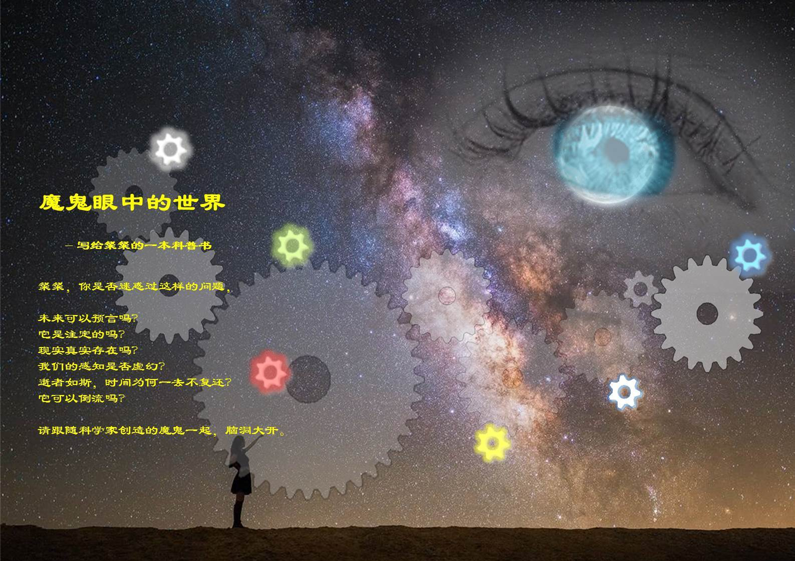
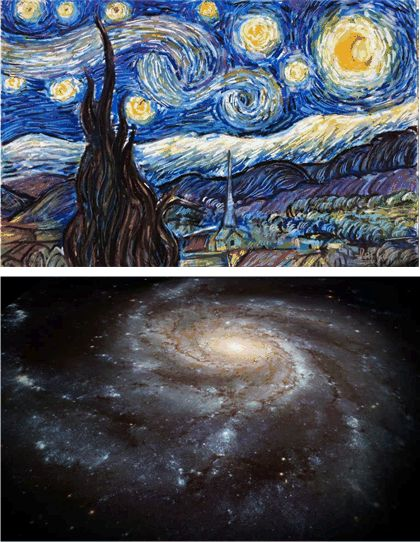
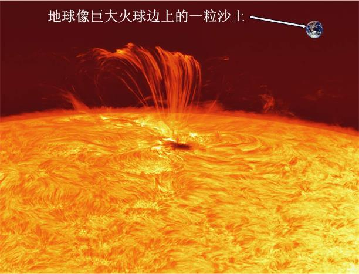
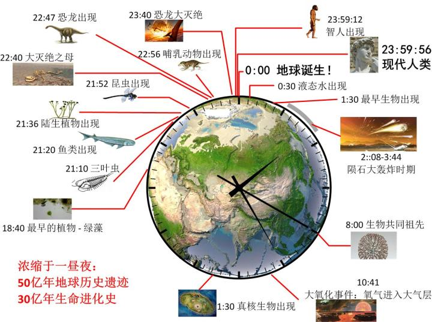

https://zhuanlan.zhihu.com/p/28266445

# 0、这是一本写给女儿的科普

## **前言：思想家创造的魔鬼**

**“Only two things are infinite, the universe and human stupidity, and I am not yet completely sure about the universe”**

**“只有两件事是无穷的，宇宙和人类的愚昧，但是关于宇宙（是否无穷），我现在还不完全肯定”**

**-- 爱因斯坦**

亲爱的粲粲，那天你跟我说，“《苏菲的世界》好有趣哦，我还想读一些烧脑的哲学书”。你无法想象当时我的心情是多么幸福：你有一颗好奇心，而这，将是你一生的财富。<u>我无法容忍在你烧脑的时候中我不能参与其中</u>，于是，就有了这本书。

还记得在你6岁还是7岁时，曾经跟我说：“我觉得球形真实奇怪啊，一个圆我可以想象出来，是一个点围着另一个点画圈子，可是一个球是怎么来的？简直是太奇怪啦！”这件事，让我一直骄傲至今。在身边平平常常的一个事物中发现其中的奇妙之处，这可不是一般的孩子能够做到的！要知道，多少伟大的发现都是从身边微不足道的事情启发的。

再过几个月你就13岁了。时光荏苒，你的课业越来越繁重，但是你保持了那颗难得的童心。这本书，就作为你13岁生日礼物吧。希望它能成为一个小小的火种，点燃你内心丰富多彩的想象力，成为你精神家园中最美丽的那朵向阳花。

亲爱的粲粲，你觉得科学很有趣吗？你觉得哲学很有趣吗？你喜欢烧脑？我们就来一起烧一下我们的大脑吧。

在无数不明真相的吃瓜群众看来，与艺术相比，哲学与科学无比乏味。一篇诗篇，它或婉约或豪迈，或清新或忧郁；一幅油画，它的色彩、光线、以及隐藏在这些色彩背后的情绪，无疑是令人着迷的。而科学呢？有什么值得你回味的吗？数学公式？被各种定律限制得死死的框架？

好吧，吃瓜群众大多数是无知的，我们原谅他们。我们自己能领略科学之美就好了。

比如说，你特别喜欢的梵高的《星空》。那令人炫目的色彩，宁静的夜空背后躁动的情绪，都让你产生一种强烈的震撼。我拿一张美国宇航局（NASA）的银河系照片来对比一下，同样炫目的色彩，同样是静谧的虚空中迷幻般的旋转，你会有什么不同的感受吗？

没错，《星空》给我们的是一种情绪上和感官上的强烈冲击，而银河呢？想象一下，寂静如死亡般的黑暗中，巨大到令人窒息的悬臂在缓慢转动。我们的太阳系，只是在其中连一个尘埃都算不上的渺小存在，而地球、乃至于我们人类，在这个庞然大物中又算是什么呢？细思极恐，不寒而栗。<u>这是一种由理性而到心灵的恐惧和震撼</u>。

比如说，空间。我们的古人对我们世界的认识是“天圆地方”，因为我们观看天空像一个锅盖盖在头顶，而周围的阡陌纵横，让人感觉地是方的。“天似穹庐，笼盖四野。天苍苍，野茫茫。风吹草低见牛羊。”多么富有诗意的景色！还记得我们一起驱车行驶在祁连山的草原上吗？虽然没见到“风吹草低见牛羊”，但是，置身广阔的草原之上，如同穹窿般的天空，我相信是震撼了你的。

那么再来看看我们现代科学的看法，你觉得比古人的想法乏味吗？地球是一个旋转的球，上面的人们在上下左右的各个方向被地球紧紧抓住，有些还大头朝下。我们跟随者地球不断地旋转，有如坐在旋转木马上。而在同时，我们的地球就像在一团巨大火球前面的一粒沙子，围绕这太阳转呀转。我觉得，这个看法比远古人更加浪漫，更加让人激动。什么把地球拴在太阳旁边？又是什么把我们拴在地球上？是重力，它不光是地球的力，也不光是太阳的力，而且是一开始让使球成为地球的力，让太阳成为太阳的力。它在地球永不停息地试图逃脱的努力中把地球和太阳拴在一起，把我们和地球拴在一起。重力还拴在所有的星星上，不，不光拴在星星上，而且还拴在星星之间；它在上下左右很远很远的距离中把星星们拥抱在伟大的银河里面。又把银河拥抱在更加伟大的宇宙之中。什么？你感觉不到旋转？可事实上，“<u>坐地日行八千里，巡天遥看一千河</u>”，多么浪漫！

> y: 八万里，出自《七律二首·送瘟神·其一》 - 毛泽东

比如说，时间。 “君不见高堂明镜悲白发，朝如青丝暮成雪。”文人笔下的时间飞逝，苍凉豪放。

那么，和宇宙进化的尺度相比呢？宇宙在诞生初期的“暴涨”过程中，体积在10^-36秒内，增长了10^26倍，然后再在10^-22秒内，从1厘米的大小变成了我们现在宇宙的体积。这是多么令人头晕目眩的数字[[1\]](https://zhuanlan.zhihu.com/#_ftn1)！简直超出了我们的想象能力。这是多么快的速度啊。

那么，如果说缓慢呢？你有没有在任何地方，读到过任何诗人的任何关于时光的诗篇，能够与漫长的，缓慢的自然进化相比？没有，我们太快了，如白驹过隙。地球孤独地存在的几十亿年中，没有生命来陪伴它。你能不能设想、体味、或让你自己接受这样一个想法：没有生命居于其间的世界是个什么样子？<u>我们太习惯于以一个生物的眼光来看这个世界了，以至于我们无法理解没有生命意味着什么</u>。几十亿年以来，每一个生物的诞生和逝去，都在极其缓慢地重复着“进化”这一伟大主题。我们以每个人的一生、每朝每代、人类的全部文明史的尺度来看，这个进化的过程都是停滞的，物种的形态是毫无变化的。然而纵观几十亿年，终于我们还是从简单的病毒进化成了有着如此好奇心的人类。

与最初的那些只能随机飘来飘去，对外界刺激做出简单反应的病毒或单细胞生物相比，我们的生理现在是多么精细啊。记得有一次你吃饭时不小心咬破嘴唇的事情吗？吃饭时的咀嚼是一件多么奇妙的事情。食物进口，锋利的牙齿上下翻飞，嘴唇一开一合，而舌头在这缝隙中间不容发地搅来搅去。这个控制精妙无比，以至于，当你不小心咬伤了嘴唇，嘴唇微微肿起来一点点，你就总控制不好自己的牙齿，老去咬到同一个地方：因为嘴唇的形状稍微变化了一丁点，就能把这整个控制给搅乱了！你原来的控制有多么精确啊。

你可以想象，在一个简单的咀嚼过程中，你的内部发生了什么？奔流的血液，四通八达的神经网络——这个过程有多快啊：牙齿咬合的半秒钟时间里，你的大脑就会根据牙齿的位置给你的舌头发命令：“现在有一点空隙，赶紧伸出去搅拌食物！”“牙齿再有0.1秒的时间就要咬下来了，感觉把你的舌头和嘴唇躲开！”还有，在你大快朵颐的同时，你不光用嘴和舌头吃饭，在这个同时，还在用它们滔滔不绝地跟我谈论你那个叛逆的数学老师！

这个过程中，你的大脑和神经在干什么？长满触须的神经细胞，它们的触须之间互相手拉着手。在它们相连的部位，不断地交换着一些蛋白质，这些蛋白质的交换会引起附近电位的变化，而这些电位的变化又是由于构成你细胞膜的一些电子重新排布有关。就这样，无数个电子，在你无数个神经细胞中跳来跳去，引起了一个个电信号沿着你的舌头、嘴唇等部位与大脑进行交流，你才能完成一个最简单的吃饭动作！

我们的身体这么一个匪夷所思的精密仪器，就是在那漫长的、似乎是永远停滞的进化过程中，悄悄地出现了。

比如说，万物。佛经里讲，“一花一世界，一木一浮生，一草一天堂，一叶一如来，一砂一极乐，一方一净土，一笑一尘缘，一念一清静。”玄妙隽永，禅意十足。所谓相由心生，世间万物变幻多端，然而以佛祖的洞察，所看到的，是透过一切外在皮相的“空”，一粒微沙，即为世界。如此玄妙，我等凡人实难勘破。如果按照佛家常例，当头喝棒，一木鱼锤下去，多半打得我七荤八素，抱头鼠窜，而不会打出一个“顿悟”出来。。

那么科学呢？科学能有如此玄妙吗？我说，妙则妙矣，却丝毫不玄，相反，它朴素无比，用朴实无华给人以强烈的震撼，达到了文学中“平中见奇”的至高境界。

我们所有的生命其实都是互相联系在一起的。细菌中的蛋白质和人类的别无二致。事实上，<u>我们竟然可以把人类的基因拼接到细菌中，让它们替我们来生产我们所需要的一些蛋白质</u>。生命之间的距离是多么的近在咫尺啊。这种生物化学的普适性毫无疑问是奇妙而美丽的。而一直以来我们人类太骄傲了，甚至无法承认我们与动物之间的血缘关系。无数揭示人类身体奥秘的发现，其实是从最渺小的病毒中开始的。

不光是我们与其他生物之间有这种血缘关系，构成我们的材料，与构成这个世界的每一个尘埃的材料都相同，都是用同样的一批原子搭建而成的，遥远的星星上的东西和我们这里一模一样。我们有可能是从过去宇宙中某个角落中爆炸的星球喷薄而出的，这些喷出的尘土等候了45亿年的演化，到了现在就有了一个奇怪的生物，在绞尽脑汁地替自己的女儿写一本哲学书籍。而这个奇怪生物的女儿，是从另外一个似乎毫不相干的遥远星球喷出的尘土演化而来的。

甚至，世间万物大至吞噬一切的黑洞，小至一个光子，简至一个桌球，繁至人们的爱恨欲望，无论多么变幻多端，它们所遵循的定律，都是完全相同的，只有区区几条，而科学家甚至坚信，它们所遵循的最基本的定律其实只有一条。如果我们研究的够仔细，从任何一个渺小的物体，都可以反映出整个宇宙的变化。我们科学史的种种戏剧性事件莫不如此。无论是从一颗落地的苹果揭示整个太阳系的运动奥秘、从一束简单的光洞晓整个宇宙的时空结构、还是从一个红热的铁块窥见我们肉眼完全无法感知的微小的基本粒子，无一不达到“一颗露珠映出太阳，一粒沙子包含世界”的极富诗意的境界。

再看描述我们这个世界的语言  –  数学。作为数学基础的自然数，是那样的无穷无尽。然而最终却不过是从一个“0”衍生而出。而“0”的产生，却是“本来无一物”的空集。你能想象得出吗？位于人类智慧最顶端的数学，各种复杂，各种抽象，汗牛充栋，浩如烟海，其根基却是来源于一个“空”。

这一切，在貌似玄之又玄的背后，是丝丝入扣的逻辑推理，是振聋发聩的归纳总结。它外表绚烂浮夸，在内里，却经历了无数次严苛的事实剃刀千刀万剐的痛楚，那是剔除了99.9999……%的糟粕而剩下的最最精华部分，老实本分，没有半分的含糊不清。但凡是有一点智商，在了解了它背后那条严谨到令人发指的荆棘之路之后，拿王小波的话说，“如果我还不相信，未免太笨”。这里没有丝毫“顿悟”的禅意，却有着令人战栗的理性魅力。

前面几个例子仅仅是宏大的科学殿堂中的一小块砖头而已。那么你现在感觉到，科学与艺术相比，是美妙的呢，是美妙的呢，还是美妙的呢？

是的，科学不但不乏味，相反，它需要比其他任何学科都要多的想象力。这是一种非常有意思的想象力，与艺术想象力不同。它最大的困难之处在于，它所试图想象的是你从所未见的东西，而这些想象必须在每个细节上都要与就所见到的一切观察相一致。

而哲学，则是科学天马行空的想象力背后的那个终极动力。它是理性的，但是却根植于我们一些看起来甚至是偏执的信念：世界是存在的吗？我们是自由的吗？宇宙运行有没有规律？空间有没有边界？时间有没有起始？等等。

科学家的想象力从何而来？其实它们的真正起源是**“未知”。**它从沧海一粟般渺小的已知空间推而广之进入到广袤无边的未知空间，因而它是自由的，在未知的领域天马行空；它又是理性的，它对未知的想象都要经过严苛的观测检验；同时它还是极具创造性的，它必须能够从“无”开始建立起最简洁最优美的精神空间。

正是这种想象力，才有了科学的定律。

定律是怎么来的呢？事实上，我们一切定律，归根结底，都是经过了无数次的<u>观察，然后通过想象力“猜”出来的</u>。人们观察到很多现象，渐渐发现它们似乎都有一个相似的规律，于是，人们就猜测，所有的类似现象遵循同样的规律，这就形成了定律。那么是不是所有的现象都遵循这个定律呢？人们不可能观察到“所有的”现象，因为你永远都可以再做一次实验来观察。观察结果是什么？你根据以前一万次实验的结果，通过外推猜测，它“一定”会如何如何，但是，这个即将发生的实验，它是在未知领域里的，在那里你不知道“真正”会发生什么，所以必须猜。

> y: 定律 Law （科学） vs 定理 Theorem （数学）

哈！原来所谓的“定律”只不过是一个猜测而已！科学家们为什么有这么不科学的行为呢？

其实<u>这种猜测和外推，才是真正的科学精神，这是一种以事实为准绳、以理性为舵、以想象力为动力的猜测</u>。如果我们不去猜测才叫不科学呢。<u>在科学领域里，我们所言的一切，所有的结论，都不是绝对确定的，因为它们只不过是对我们已经观察过的现象的总结。而我们只要对将要发生的事情进行猜测，就不可避免地进入到那些尚未发生的未知领域，就必然引入不确定性</u>  --  我们不可能“真的”知道将来会发生什么，因为我们还没有做过“将来”的实验。我们必须猜测是因为只有外推才是真正有意义的。这有这样的原理才是值得我们知道的：它在你还没做过的时候就能让你想到将要发生什么。如果你只能告诉我昨天发生了什么，那这是没有真正的价值的。你必须能告诉我如果我这么做，明天会发生什么——不但必须，而且很好玩。不确定不会带来什么伤害。说出一些不确定的东西总比啥都说不出来强。

<u>科学的猜测必须不断地经受观测事实的考验，我们随时准备抛弃那些与事实相悖的理论，这是一种以“**实证**”为基础的学科</u>。但是，在实证之外，我们还会相信一些“生而正确”的观念，这是一种**直觉**。比如说，我们坚信，A=A,A≠非A。<u>这种“先验”正确的观念，其起源在我看来，多多少少有些神秘，我自己也经常徘徊于经验主义和理性主义之间而深陷迷惑</u>。有时我会觉得，所谓的理性，不过就是从我们出生伊始到产生自我意识的成长过程中，那些刻在我们一开始有如白纸一张的大脑最深处的经验而已；但有时我还会在猜想，理性就是这个自然界构建我们大脑的方式：自然界以某种蓝图设计了我们的大脑，而我们大脑的思维就在最底层依从这种蓝图
– 因此理性是自然界最最底层运作规律在我们精神中的映射。我不知道应该相信那一种猜想，但是我知道，这是一种超出实证之上的，进入信仰范畴的东西。

> 先验（Prior）是指在获得新信息或进行推理之前，基于以往知识、经验或先前观察到的信息而形成的信念或假设。先验知识在推理、决策和学习过程中起着重要的作用。

科学家们非常希望能够对他们的每一个理论结论进行实验检验。但是，很多时候这是做不到的。有时候，是由于当时的实验条件所限：它所需要的实验条件已经超出了当时人们的实验能力。还有一种情况，就是，这个理论结论太过宏大，以至于几乎没有可能进行实验检验。比如说，人们经常会谈到一个有趣的科学理论：如果太阳突然间毁灭了，我们将在8分钟之后才能觉察。我们不可能去做一个实验把太阳毁灭掉来检验这个理论，但是这个理论原则上是可检验的。

对这种情况，科学家们往往会通过设想、思辨、理论推演的方式来进行检验：如果我们用的定律是正确的，我们的推理过程无懈可击，那么，结论也必然会是正确的。这种检验过程，叫做“**思想实验**”。于是，科学家们在他们的思维空间中通过假想，创造出一个个或神通广大、或古灵精怪的魔鬼和精灵，来“替”他们完成这个实验。往往每一个这样的魔鬼和精灵，背后都是一系列饱受争议的命题。毕竟，人们是因为没有办法亲自做实验验证，才“请出”这些妖怪精灵的，但是它们毕竟不能真正地完成实验，这就有了巨大的争论空间。

这些魔鬼精灵们，是科学家那丰富多彩，脑洞大开的想象力的集中体现。它们往往是反常识的，甚至是看似怪诞无比的。与艺术家的想象力相比，这些思想更加深邃、叛逆、不羁、而且充满理性的智慧。

在本书中，我们会陆陆续续看到很多个由科学家和哲学家们创造出来的这种“魔鬼”和“精灵”，它们都是这些思想家们用他们伟大的智慧探索一些关于我们自然界的终极问题，例如：

拉普拉斯之妖：我们的未来是注定的吗？

混沌蝴蝶：未来可预测吗？

笛卡尔恶魔：世界存在吗，“我”存在吗？

庄周蝴蝶：世界是大梦一场吗？

薛定谔猫：外在的客体是独立于主观而“客观”存在的吗？

麦克斯韦之妖：时间可以逆转吗？

罗素茶壶：不可证伪的问题有意义吗？

萨根的隐形龙：“感知”和“客观”是什么关系？

玻尔兹曼大脑：意识为何会存在？

等等……

我把这些让人困惑而又极其好奇的问题分为三类：1、关于未来和宿命；2、关于世界的实在性；3、关于时间和演化。我们将在本书中分三部分来分别讨论。

往往地，科学家们创造出来的这些稀奇古怪的妖怪和精灵们，它们的目的并不是要维护既有的理论，而是在质疑它：我们能够做到的实验不能够推翻它，那么我们就试着用我们不能做的实验去达到这个目的！

因为，我们根据根据定律得到一个结论，无论我们如何肯定，我们总还是抱有一点点怀疑的：它已经经历了无数次的检验，还能通过下一次的考验吗？关于这一点，我们必须要承认，我们是**无知**的。而且，无比重要的是，为了进步，我们要认识到这些无知。**正是因为我们无知，我们才会去寻求通往新观念的新方向。**

如果我们没有怀疑，没有认识到我们的无知，我们将不会有任何的新观念。怀疑在科学界中是很重要的一点，并且我相信，其他领域也是如此。我现在熟知“怀疑”的价值，以及这种态度所带来的自由思想。作为一个的父亲，我觉得我负有这样一个责任，来把这种智慧传递给你，让你明白，怀疑不但不可怕，反而应该欢迎。如果你知道你还不肯定，你就有机会改进。正是由于我们不断地怀疑，我们的科学才会不断进步。如果我们认为一个理论已经确定无疑了，那么我们就没有了进步的空间，那将是多么乏味啊！

最后，我想说，写这篇文字比我想象中的要困难无数倍。有很多问题，在饭桌上和你高谈阔论时可以滔滔不绝，但是一旦想整理清楚并且讲明白，却一个字都难写。原因是，在很多抽象的概念和理论面前，文字是苍白无力的。只有数学才是最简洁的语言，它可以把成千上万的文字压缩到一个公式里面。一个习惯数学思维的人，看到类似S=klnW这种简洁而又深刻的公式，会瞬间感到极大震撼。

然而，如果想在这里用数学语言对话，就需要太多超出你现在数学素养的知识。所以，我选择了避开过多的数学。我保证，在我的整篇论述中，数学公式的出现次数不会超过10次，但是严肃地说，科普很难离开数学，能把科学道理不用数学讲明白的，那一定是大师中的大师。我不是大师，但是，为了我宝贝闺女的好奇心，我还是想不自量力试一下。

我耐心地等，等待将来有一天，我们能在饭桌上用美妙的数学语言重新讨论这些问题。

**写于2017年春节**

***PS：本引言向费曼的经典演讲《科学的不确定性》致敬，中间少部分语言有所借鉴。***

**下一篇：**[1、拉普拉斯之妖](https://zhuanlan.zhihu.com/p/28522532)

**专栏：** [魔鬼眼中的自然界](https://zhuanlan.zhihu.com/c_116602381) 

[[1\]](https://zhuanlan.zhihu.com/#_ftnref1)如果我们用小数来表示，也就是，宇宙在0.0000000000000000000001秒的时间内，从1厘米的尺度暴涨成了150亿光年（10000000000000000000000000米）！

佛曰，一刹那者为一念，二十念为一瞬，二十瞬为一弹指，二十弹指为一罗预，二十罗预为一须臾，一日一夜有三十须臾。按照这个时间尺度，一刹那大约为0.018秒的时间。而我们现在谈到的时间尺度，与佛祖眼中最短的时间相比，简直是沧海一粟。宇宙从1厘米涨到150亿光年所用的时间与一刹那相比，就像是一刹那与整整100倍的宇宙寿命相比那样！以光速计，这个时间大约仅仅够一束光跑过一个原子那么长的距离而已。

