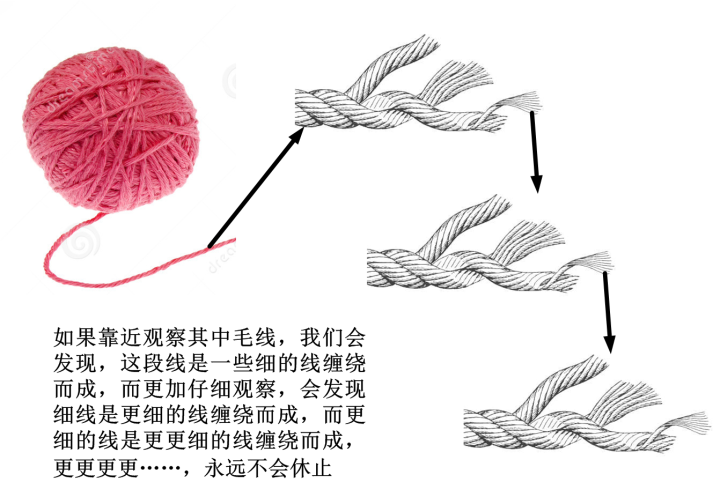
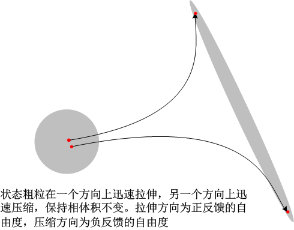
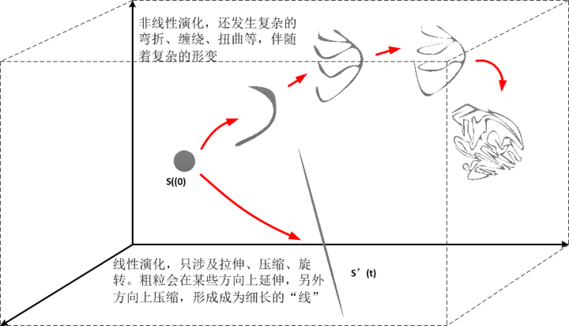
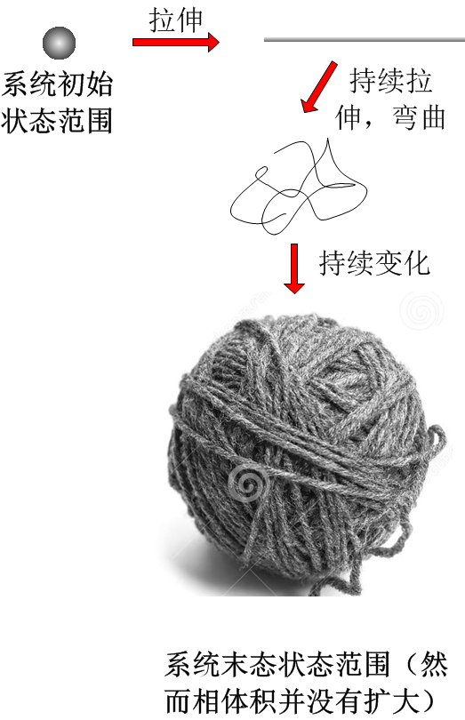

[10、运动是个毛线球](https://zhuanlan.zhihu.com/p/28573959)

***“The purely formal language of geometry describes adequately the reality of  space. We might say, in this sense, that geometry is successful magic. I should like to state a converse: is not all magic, to the extent that  it is successful, geometry?”\***

***“纯粹的几何语言完全地描述了空间中的实在。我们可以说，在这个角度上，几何是一个成功的魔法。我还要反过来问：所有这样成功的魔法，难道不都是几何吗？”\*** 

***– Rene Thom\***

在这里，我再一次向你推销前面所说的思维方式：用“几何观”看待问题。我想说的是，运动就是一个球，而且是一个毛线球。为何这么说呢？我们用几何观来看看混沌系统的演化。

首先，我们来比较一下前面关于刘维尔定理和蝴蝶效应的讨论：

刘维尔定理说：相体积守恒，也就是说系统的演化过程中不会产生额外的不确定性；

混沌理论说：系统的演化对初始条件的误差极端敏感，初始的一丝丝不确定性就会被瞬间放大到一个令人瞠目结舌的尺度。

这两种论述，都是由同样的动力学方程得出的，怎么会互相矛盾呢？

其实，这两者并不矛盾。其原因，就是我们前面所提到的，粗粒在演化过程中是会发生形变的，而这种形变，就使得这样一种情况成为可能：在一个很小的体积内，容纳下两个距离近乎无穷远的点。

现在，我们来考虑一个初始条件极端敏感的系统，如下图中的一个初始粗粒，随着时间的增加，粗粒中的两个相点之间的距离指数速度增加。此时，粗粒在演化过程中必然伴随着拉伸和压缩两个形变。也就是说，粗粒中的相点在某些方向上快速分离，导致距离增加，为了保持相体积守恒，必然会在另一些方向上快速收缩。效果上，就是这个粗粒在某些方向上拉伸，另一些方向上压缩。由于拉伸的速度是指数的，收缩的速度必然也是指数的。我们已经领略过，这个速度是极其惊人的，也就是说，粗粒会在一瞬间被“摊”成一张极薄的大饼，或者“抽”成一条极细的丝线。

记得我们上一章讲过的“反馈”吗？我们提到，在自然界的反馈行为中，要么是正反馈，要么是负反馈。正反馈的系统就有着指数速度发散或指数速度震荡发散的行为，而负反馈则是指数速度收缩或震荡。那么我们所关注的系统由大量的粒子组成，有着巨量的自由度。这里面必然就有一部分自由度是正反馈的，而有一部分是负反馈的。因而反映到粗粒的形变上，就会出现某些方向拉伸，某些方向压缩的情况。

因而，系统的演化就是这样在总体相体积不变的情况下，出现了某些相点的指数速度分离。简言之，以某些自由度的确定性高度增加换取了另外一些方向上的不确定性的放大。

其实，这并不算坏，因为“摊”成薄饼或者“抽”成细丝，都在一定程度上获得了很好的确定性，毕竟，无论是“饼”还是“丝”，在广袤无垠的巨大相空间中间，是一个小得不能再小的子空间。这意味着这个子空间的相应的自由度在丧失，使得复杂运动变得非常简单。在我们在某些维度上丧失确定性地同时，另一些维度上反倒获得了极大的确定性。

然而，动力学系统似乎不想让你知道它的演化方向，哪怕其中的某一些不完全的维度，最终留给你的是近乎100%的无知。动力学系统的复杂性并不仅仅体现在初始条件敏感这一点上，更加令人头痛的，是它**拓扑结构的高度混合**。

相空间中的一个粗粒，初始时有一定的相体积。我们把这个系综在相空间中画出来，它所构成的图形（即它包括的所有相点的集合）叫做S(0)。随着系综的演化，S(0)在相空间中会有一系列变化，在t时刻，它变成S(t)。我们已经知道，S(0)到S(t)的变化包括了平移、旋转、和一系列形变，到现在为止，前面已经提到两种形变，就是拉伸和压缩。这两种变化，都是线性变化[[1\]](https://zhuanlan.zhihu.com/write#_ftn1)。但是经典的动力学系统是高度非线性的，所以在些变化之外，还有很多非线性系统的变化，包括扭曲、弯折、卷曲、缠绕等等。粗粒在发生这一切形变的同时，保持相体积的不变。

请注意，这些所谓的复杂非线性形变，还只是三维空间中的，高维空间中的形变更加难以想象，有时候会匪夷所思。就像是二维空间中无法想象莫比乌斯带、三维空间中无法想象克莱因瓶一样（想象一下你不必穿过瓶子的壁就钻进瓶子里面）。

此外，粗粒的有些形变是不会发生的，这受限于一个规则，即这些形变必须是拓扑同胚的。何为拓扑同胚呢？你可以把S(0)想象成一个非常韧性并且富有延展性的橡皮泥，你对它所能做到的种种形变，可以拉扯、扭曲、卷曲等等，在过程中保持形状的连通性不变。也就是说，一个连续空间的粗粒，在演化过程中不可能变成两个分离的空间（不可撕裂）。相空间撕裂的后果就是导致存在两条无限近的轨迹在有限的时间内达到有限分离，而这是刘维尔定理所不允许的。

我们前面已经证明了一个系综的初始相体积S(0)，在演化过程中其在某些方向上拉伸伴随着另外一些方向上压缩，这种形变是普遍的，它反映了初始条件的敏感性；然后，我们还知道，这种拉伸，其作用不外乎使S(0)压成一张大饼，或抻成一根拉面；拉伸是线性变换；然而我们提到除了拉伸，还有弯曲、扭曲等非线性变换。

我们的动力学系统就是非线性的，因而相空间演化过程中，非线性的变化是不可避免的。事实上，如果一个初始S(0)只经历拉伸作用，它必然会在某个方向上尺度不断增大，这就意味着这个系统本身是发散的。而我们自然界中所面临的有界系统，是不会允许这种单纯的一个方向上拉伸持续下去的，因为相空间的体积有限，所以它在一定的时候势必会出现弯折或卷曲，团成一团，以容纳于相空间之中，虽然局部的拉伸还在继续，但是它的全局方向已经变了。

如下图所示，一个系综初始的相体积为S(0)，它的演化途径。在线性演化过程中，它在相体积守恒的情况下发生拉伸，变成一条细线；而在非线性演化中，它同时经历各种拉伸、弯曲等等，形变就非常复杂。

最后，我们来看看，运动为何是一个毛线球。对于某个系统，一开始我们观察它的状态。根据观察精度，我们可以确定系统在一个狭小的相体积S(0)内。然后系统开始演化，这个S(0)就不断被拉伸，由一块“立体”的体积变成了一条长长的“纤维丝”。这条纤维丝不断缠绕，变成更粗的丝线，丝线又继续缠绕，就变成一条毛线，这条毛线线继续缠绕，编织在一起，就成了一个毛线球。由于持续的拉伸作用，原始的S(0)可以被越拉越长，因而这个“毛线球”就会越缠越大，S(0)可以拉长成为任意长的一条丝线，因而它所能缠绕而成的体积也可以变得任意大。这样一来，一开始我们所能够确定的系统所在的狭小范围，现在变成了一个巨大的线球。所以，我们只能在这个巨大的线球所涵盖的范围内猜测系统到底在哪里。如果我们能够提高观察精度，我们会发现，这个球是有空隙的，每条毛线之间是有距离的，而编制成毛线的每条纤维之间也是有距离的。抛去内部空隙，这个毛球所“真实”覆盖的体积其实是非常有限的，与原始的S(0)相比并没有任何扩大。但是，随着演化时间的增加，在线球内部，丝线和空隙形成了一种极端精细的结构，彼此互相式交织在一起，每条丝线附近无限小的地方就有另一条丝线，而每个空隙附近无限小的地方就有另外一个空隙。这个精细结构的形成是极其迅速的，几乎一瞬间就突破了我们的观察精度。[[2\]](https://zhuanlan.zhihu.com/write#_ftn2)整个过程如下图示意：

这个毛线球在空间中的结构有一点点让人头晕：它远不像想象中那么简单。事实上，缠绕成这个毛线球的线是无限长的（当然，如果不是经历了无穷长的演化时间，它不会是真的“无限长”，但是它比宇宙的尺寸还要长百万千万倍）。当我们就进观察这个毛线球中的一小段线，我们会发现，这段线并不是简单的一条线，而是由众多细线缠绕而成的。而这些细线呢？当我们更加仔细观察，用放大镜看时，我们会发现，它们也是一样的结构：由众多更细的线缠绕而成。那这些更细的线呢，我们再仔细观察，用最好的电子显微镜，我们会发现它仍然是同样的结构。如果我们可以无限扩大我们的观察精度，我们无限地往下跟踪这些更细的线，我们会发现，永远没有尽头！所有的线都是由更细的线缠绕的，我们找不到那一条“最后”的、不是更细的线编成的、最细的线！

这种结构，有一种非常有意思的几何特征：它的每个局部，无论多么精细的局部，都与整体有着相似的结构，永无休止。它有一个数学上的名字，叫做“**分形**”。

上一篇：[9、我们这个反馈的世界](https://zhuanlan.zhihu.com/p/28573752)

下一篇：[11、分形：小小体积可以充满大大空间吗？](https://zhuanlan.zhihu.com/p/28574121)

专栏：[魔鬼眼中的自然界](https://zhuanlan.zhihu.com/c_116602381?group_id=884931161871237120)

*[[1\]](https://zhuanlan.zhihu.com/write#_ftnref1) “线性”这个概念，直观上理解可以认为是某种等比例、均匀的关系。但是它实际上有很严格的数学定义。线性的概念从初中就大致开始有一些模模糊糊的认识，但是一直到大学毕业，你可能还没有接触到真正严格的数学定义。这里你可以忽略。*

*[[2\]](https://zhuanlan.zhihu.com/write#_ftnref2)  请注意，这里的毛线球只是一个形象的类比。实际过程中相空间的变化要比这个远远复杂得多。它的拉伸并不是一直在一个方向上的，在高维空间里面，会有很多个方向上有这种拉伸的作用，并且这种作用也会随着时间不停变化。毛线球本身是一个复杂的东西，但是比起实际上相空间里面的结构，它是一个极其简单的东西。*

