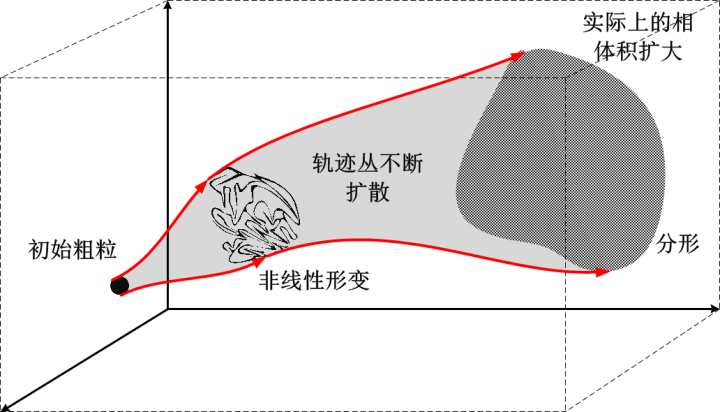
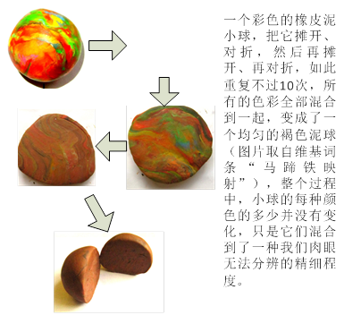
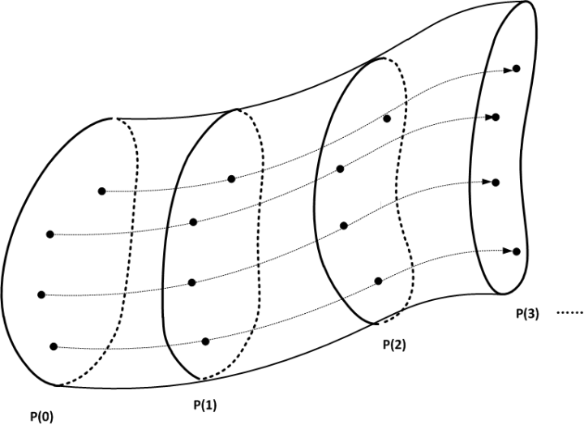
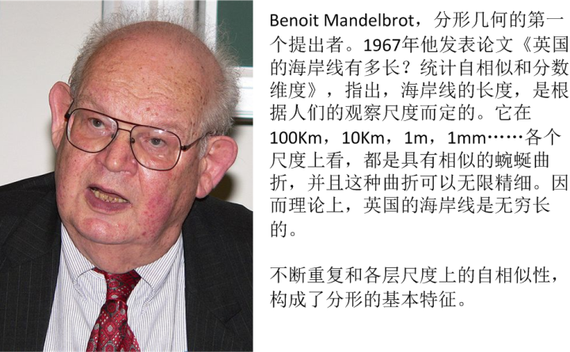
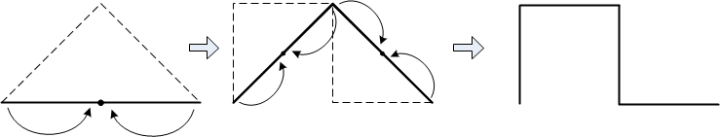
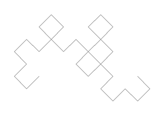
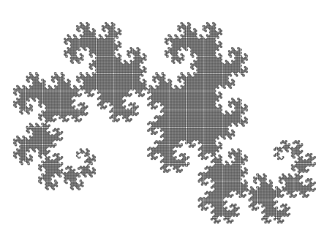
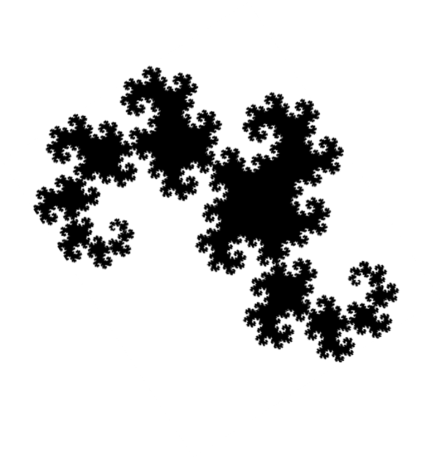
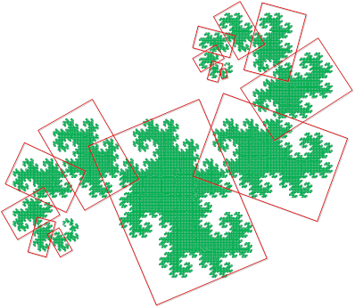
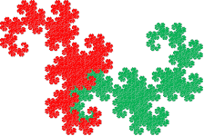

[11、分形：小小体积可以充满大大空间吗？](https://zhuanlan.zhihu.com/p/28574121)

***“……in the past if a person does not know entropy, he is not proficient in  science; in the future if a person does not know fractal well, he cannot be regarded as a cultured person in science”—John Wheeler\***

***“……在过去，如果一个人不知道熵，他就不算精通科学；在将来，如果一个人不知道分形，它在科学领域就不算是个文化人”\*** 

***– 约翰惠勒\***

前面我们谈到混沌的一大特征：系统的演化对初始条件极端敏感（蝴蝶效应）在关于运动是个毛线球的讨论中，我们已经触及到了它的另外一个基本特征：拓扑结构的混合性。这，由分形的数学特征体现的淋漓尽致。那么，现在我们来看一下，一个小体积的粗粒到底是如何在相体积不变的情况下扩散到整个相空间的。

首先，我们来看一个形象的例子。现在你的手里有一团彩色的橡皮泥，它色彩斑斓，十分鲜明。比如说，我们很容易分辨出其中绿色的斑块分布在哪里，形状如何。

这时候，你开始玩一个游戏：不断地把这块彩泥压平，对折：

首先，你把彩泥压平，摊成一张饼。这时候，你再来观察绿色的斑块，你会发现它依然鲜明。虽然形状发生了很大的扭曲，但是它的基本相对分布情况并没有发生什么变化。[[1\]](https://zhuanlan.zhihu.com/write#_ftn1)

然后，你把这张饼对折，然后继续压平，再摊成一张饼。这时候，你再来观察绿色的斑块，你会发现它已经不如以前鲜明了。不但形状发生了变化，而且分布也有了很大的变化，并且，还有可能变得模模糊糊的了。

然后你不断地重复上面两个动作：摊平、对折，再摊平、再对折，……，如此这般，并且关注绿色斑块的变化。

你会发现，绿色的斑块渐渐地地分散到了彩泥中，越来越均匀，越来越与周围其他颜色混合在一起。一般而言，不出十次，你就已经完全无法分清楚哪里是绿色，哪里是红色了。整个彩泥已经不再是彩泥了，而是各种颜色均匀混合后，变成了一块丑陋的褐色泥球了。

下面这张图是维基百科中摘出来的，它表示了前面这个游戏的整个过程。

那么我来问你，泥球的颜色为什么会变化呢？难道说中间我们给他染色了吗？显然没有，泥球中的绿色还是那些绿色，红色还是那些红色，。我们所看到的颜色变化，只不过是因为那些颜色之间互相如此均匀地混合在一起，精细程度超出了我们肉眼分辨的程度，因而，在我们看来，最后红色和绿色都已经没有什么区别了，它们都变成了褐色。

在整个过程中，绿色的体积是守恒的，它在各种变形过程中一点都没有增加，也一点都没有变少，但是，一小块绿色斑块，就这样，均匀地分散到了整个泥球当中，占据了全部空间。这个过程中，我们基本上可以说，绿色用一个小小的体积覆盖了大大的空间。

其实，这个泥球就是一个相空间的完美类比，而泥球中的绿色斑块，则很好地类比了一个粗粒的变化过程：它在整个拉伸、弯折的形变中，如何一点点分散得无处不在。

现在我们回到动力学的讨论。对于一个粗粒S(0)，它在相空间中的演化，我们可以不断跟踪它的形状，例如，我们每隔一个固定的时间，就对这个粗粒拍一张照片，这样我们就会得到一系列的离散的粗粒的照片序列P(1)、P(2)、……P(n)，然后研究这个序列的规律。这种方法，很不严格地讲，在数学上叫做“庞加莱映射”（注意，庞加莱映射的实际定义不是这么简单，但是我这里就不多说了）。

对于序列中的任意一张照片P(i)，它是在前一张照片的基础上经过一定的规则形变而来，而它的后一张照片又是它经过一定的规则形变而来的。这些形变的规则就包括前面所提到的拉伸、旋转、压缩、扭曲、弯折等等。
我来看两张照片之间的变化规则。要知道，每两张照片之间的变化规则都是由相同的物理定律得到的[[2\]](https://zhuanlan.zhihu.com/write#_ftn2)。由于它们所遵循的物理定律都是完全相同的，因而整个序列中随便前后连续的两种照片之间变化规则都是相同的（或者严格说，是相似的）。也就是说，相空间的初始几何形状S(0)，会按照相同的规则形变，并且不断重复这个变化，然后产生后续的全部照片序列：

经过无数次这种不断自我重复简单的规则之后，会产生出非常复杂有趣的图形，最终经过无穷多次迭代形成的几何形状数学上就是分形: 

分形是一个非常有趣的数学话题，我十分愿意花大量的时间来讲它，因为它总是伴随着美丽得令人炫目的几何图形。感性的你肯定会非常喜欢它。但是，这里包括了太多和本文话题无关的内容，我这里还是不去过度深入，只是捡一些相关的内容简单介绍一下。我们先举个例子：

首先，我们先选取一条线段作为最初的图形P(0)。然后我们把这个图形做两个形变：第一，沿着中线对折，成为直角折线，第二，将这个直角折线拉伸，使其两个端点距离与最初线段长度相等。经过这两个形变之后，它成为第二个图形P(1)。然后我们对P(2)中的每一条直线段也做同样的形变，并不断重复。

我们来看看这种对一个线段进行简单的拉伸和弯折两个动作的变换最终会形成什么样的图形，第五张照片是这样的：

第8张照片是这样的：

第11张照片是这样的：

第13张的精细结构我们已经看不清了：

经过多次迭代形变，最终的图形就变成这样的了： 

这个图形数学家把它叫做Dragon’s Curve （龙之曲线），据说是因为它外形像一只龙。不管你信不信，反正我信了。类似的分形非常之多，并且其中不乏绚丽多彩的。你要是有兴趣不妨网上搜搜看。

就如这个图形的名字告诉我们的，这个图形是一条曲线！这条曲线的变化规则非常简单，只有拉伸和弯折两种形变方式，但是，这条曲线通过无休止地重复转折和缠绕，以及无穷多层重复复制它的精细结构，一条没有面积的直线就填充进一个平面结构之中。在它所覆盖的平面之中，这条曲线虽然不能在有限步骤内将这个平面填满（因为曲线没有面积），但是它却可以使得曲线的“编织”趋向于无穷细密，细密到这样一种程度：这个平面图形的范围之中，我们在这个曲线上任意选取一小段线段，在这一小段线段周围距离无穷小的地方，我们总是能够发现这条曲线的折回来的另外一段。你可以把这个图形想象成一个十字绣，这绣品的每两相邻条经线和纬线之间距离都是趋向无穷近的。这种以一条线填充整个平面的现象叫做“space filling  curve”（空间填充曲线）。从数学上讲，它具有的维度是2，而不是1，也就是说，经过无穷多次这种形变，它最终会变成一个平面，而不再是一条线！

当然，分形有很多种，每种都有各种新鲜的性质，并且大多数分形曲线都是介于填充（平面或立体图形）与非填充（一条线）之间的。因此，我们无法把它们看做是一条一维的曲线了，但是呢，它们也不是二维的平面或三维的立体空间，此时，它们具有的是分数维度而不是整数维度。

总之，分形是一个值得谈论三天三夜的话题，然而，我这里就此打住了。

看完了这个例子，相信你已经大概有了些概念，就是一个简单的初始形状，不断地重复简单的形变，可以变成一个结构极其精细的复杂图形。由于这种形变在各个尺度下不断重复自己，因而，它的精细程度是趋向于无穷的：我们尽可以不断放大这个图形，不管我们放大多少倍，我们看到的局部结构和图形整体的结构别无二致。

这个图案，每个图形都是由两个一模一样的图形拼起来构成的，并且，这两个一模一样的小图形又是由两个更小的一模一样的图形拼起来的，如此无休无止，直至无限精细的结构。

一个相空间中的初始粗粒，在演化过程中变成复杂的分形结构，这在动力学系统中也是普遍存在的现象。现在我们回到我们的动力学话题。在前面我们说到，一个非线性动力学的演化过程，初始粗粒的形变包括了线性的拉伸和压缩，还有非线性的弯曲、扭曲、缠绕等。这些基本的形变形式，结合起来并不断重复，就可以形成复杂的分形。这种自相似追溯下去是无穷无尽的。基于分形的这种特征，动力学系综在演化过程中，一个初始粗粒就可以在保持自身体积不变的情况下，把一个很小的初始相体积，逐渐渗透、扩散、并填充到整个相空间中去，并且与整个相空间混合得趋向于无穷精细，让你再也无法从相空间中把它们区分出来。这就叫**拓扑混合性**。

具体而言，初始粗粒的点集S(0)在演化至时间t时，形成的粗粒点集S(t)。它在整个相空间中占据着一定的体积V(t)，根据刘维尔定理，V(t)=V(0)=V。在相空间中，点集S(t)以外的部分，我们记做 S'(t) 。当演化时间足够长，S(t)与 S'(t)  之间，就以极高的精细程度混合在一起，难分轩轾。在S(t)内部的任意一点，都与S(t)外部的某点无限靠近[[3\]](https://zhuanlan.zhihu.com/write#_ftn3)。

下图显示了这种演化的示意：

关于粗粒演化过程中与相空间的精细混合，我们可以类比与液体的混合过程：一滴液体滴入流水当中，这一滴液体具有初始的体积和形状（初始粗粒和初始相体积）。随着水流，这滴液体逐渐在流水中运动、形变。如果说，这滴液体是一滴油，那么，这个油滴尽管会发生各种形变，我们都可以把它和水区分开来 --  这就是拓扑非混合的演化。但是，如果这滴液体是糖浆，那么，糖浆的液滴在水中一开始它保持着相对独立的体积，但是随着溶解过程（演化过程）的展开，它就混合（分形）到整个水中，形成溶液，与水密不可分。虽然说，糖浆的量并没有增加，但是它却已经与水完全交融了，因而分布在整个空间中再也没有办法区分 – 这就是拓扑混合的演化。

好了，既然初始的粗粒在演化过程中与相空间高度混合而无法区分，那么，即使我们这是仍然确知它的相体积没变，但是我们仍然不能够在相空间中把它定位出来。我们只好说，它的相体积分散到各处了。这在现实中，与相体积的扩大是等效的。初始的很小的粗粒，由于内部混入了大量的非相关的相体积，而扩大到整个相空间，我们因此无法对它进行严格的监控 – 不但是一条确定的轨迹我们无法找到，最初始的轨迹丛也无法定位了。这就是说，我们的“绳子”散开了。

正如前面所述，相空间的扩大意味着确定性的丧失。所以，前面的过程描述的就是：粗粒在保持很小相体积不变的情况下，扩充到很大的空间；对应的，系统在决定论方程的描述下，产生了巨大的不确定性。

***相体积守恒，正是决定论的体现：演化中不产生额外的不确定性；\***

***相体积以分形的形式扩散，以恒定的相体积，填充到巨大的空间中，以无穷精细的方式与整个空间纠缠在一起，不可分辨，因而在任意有限精度的观察者看来，都产生了巨大的不确定性。\***

看起来很矛盾，却是非常自然的结果。

前面几章讲到的动力学系统的特征，总结起来，就构成了确定性混沌理论的基本框架。说起混沌，它的数学意义似乎远远不如哲学意义来的深远。对于人们几百年来所形成的决定论自然观，以及还原论的研究方法，从没有哪一个理论像它这样从根基上给予冲击。混沌理论给人一种新的方向：即使是决定论的规则，一样可以产生出不确定的演化。并且，对于不同层面上的现象，以纯粹还原论的方法来描述，不仅仅是计算量上的挑战，而且从原则上是不可能的，很多宏观上丰富多彩的高度有序结构，必须求之于数学上对整体的综合考虑，总体论必须成为一种与还原论相平行的方法。

因为混沌领域到现在为止还太年轻，所以对于混沌这个核心概念，现在还没有一个明确的定义为所有人接受，但是，至少有几点是大家公认的：

1、它产生于决定论的系统。

2、它只能在非线性系统中发生，并且只在维度大于3的系统中才可能发生。

3、它会演化出复杂的、似乎毫无规律的、类似随机行为的运动。

当然，混沌还可以用李雅普诺夫（Lyapunov）指数、豪斯道夫（Hausdorff）维度、或科莫哥诺夫（Kolmogorov）熵等来定量衡量。但是这些概念并不能仅凭其中一个就能够概括混沌的所有性质，必须结合使用。好吧，我说得太多了，就此打住。

总而言之，混沌是一个普遍存在的，为大众所一致承认的现象，但是，混沌的具体定义却还没有达到为学术界一致认可的程度。

如前所述，混沌系统就是在对初始条件极端敏感的情况下，以不断自我复制的分形演化形式，将一个比较小初始相空间，用一种趋向于无穷精细的程度，不断地与周围混合，最终不可避免地扩散到一个巨大的相空间之中，使得我们完全无法区分，因而最初较为确定的一个系统状态，随着演化就变得完全无法确定了。这中间，一个重要的因素就是分形所特有的“分数维度”的数学性质，使得它能够介于低维和高维之间，能够用低维度的几何填充到高维度的空间中去。直观来讲，就是说，它可以使得系统能够以“零体积”的一个曲面，或者以“零面积”的一条曲线，填充到有限的三维体积中去，使其所覆盖的空间被放大无限大倍。所以，初始任意小的相体积可以被扩充到一个任意大的相空间中去；也就是说，对初始条件任意小的误差，可以被放大到任意大的程度。

作为一个总结，我这里引用费曼物理学讲义里的一段话：

***“……给定任一精确度，无论它精确到怎样的程度，我们都能找到一个足够长的时间，以致无法对这么长的时间作出有效预言。其实要点在于这段时间并不长。如果精度为十亿分之一，这个时间并不是数百万年。事实上，这个时间随着误差呈对数式增长。结果发现只是在很短很短（tiny tiny）的时间里我们就失去所有信息。如果精确度提高到十亿乘以十亿再乘以十亿分之一 – 那么不管我们说多少个十亿，只要最后不再说下去 –  .我们总能找到一个时间，过此时间后再也不能预言会发生什么了！因此，诸如以下的说法……说什么量子力学将我们从绝对机械论的宇宙下拯救出来是不公正的，因为从实际的观点来说，在经典力学中早已存在着不确定性了”\***

***上一篇：\***[10、运动是个毛线球](https://zhuanlan.zhihu.com/p/28573959)

***下一篇：\***[12、FAPP和原则](https://zhuanlan.zhihu.com/p/28575104)

***专栏：\***[魔鬼眼中的自然界](https://zhuanlan.zhihu.com/c_116602381?group_id=884931161871237120)

*[[1\]](https://zhuanlan.zhihu.com/write#_ftnref1) 如前所述，对一个粗粒的拉伸形变，是一个线性变换。在一个线性变换中，信息依然保持分明，这就是为何线性系统中不会产生混沌现象。*

*[[2\]](https://zhuanlan.zhihu.com/write#_ftnref2) 具体讲，是通过对动力学方程离散化得来的（也就是庞加莱映射）。*

*[[3\]](https://zhuanlan.zhihu.com/write#_ftnref3)用数学语言讲：*                    

