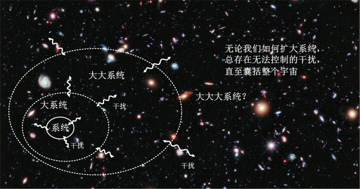
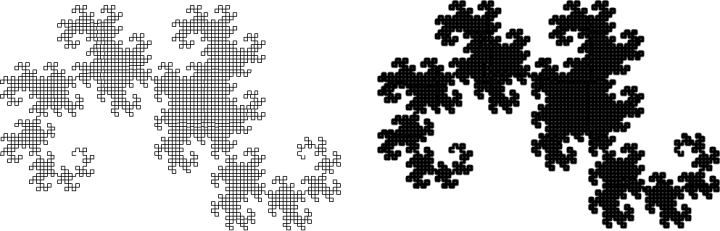
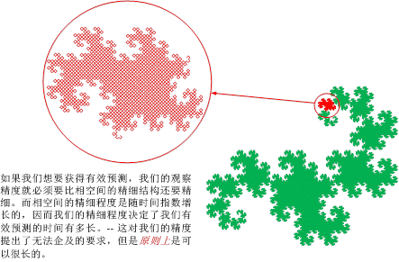

[12、FAPP和原则](https://zhuanlan.zhihu.com/p/28575104)

***“In theory, theory and practice are the same. In practice, they are not”\***

***“理论上，理论和现实是一回事。现实中，它们不是”\***

***-- 爱因斯坦\***

前面已经提到，相空间以指数速度发生扩散，它快得超出了我们的想象力，几乎是一瞬间，初始的“一小块”粗粒就分化成精细结构扩散到一个广袤的体积中去，超出了我们辨别的任何可能性。因而，我们可以非常放心地下结论说：**在任何可能的现实情况下（FAPP）[[1\]](https://zhuanlan.zhihu.com/write#_ftn1)**，我们无法对系统做出较长时间的预测。

但是，人们会问，我们现实中能不能做到，并不会影响“本质上”系统会发生什么。如果我们抛开FAPP，来看系统“究竟”会发生什么呢？

你可能已经敏锐地抓住了一个重点：根据分形的定义，初始粗粒的相体积难道不是经过了无穷多次自我迭代迭代才能形成无限精细的结构吗？有限次的迭代虽然可以让几何结构变得非常非常精细，但是并不能改变几何的维度。那么，这就意味着，系统确定性的丧失需要经过无限长的时间才能达到，而在有限的时间内，只要能不断提高精度，原则上我们是可以保持对它的预测的。

我们还以龙之曲线为例，来说明这个问题。我们可以很形象地用曲线的线宽来表示我们对系统的不确定性。一条比较细的线所覆盖的面积较小，因而具有更高的确定性，而一条比较粗的线相应地有更大的不确定性。下面两个图形分别是以1个像素线宽的线段和3个像素线宽的线段作为初始条件迭代15次产生的图形。我们可以看出，1个像素的图形在迭代15次后我们仍然可以看出其中的精细结构，而3个像素的图形已经完全模糊掉了。而在1个像素的情况下，迭代第17次才会完全失去精细结构。这确实说明了，更高的精度，是可以增加有效预测时间的。现在的情形是，如果我们期望获得任意长的有效预测时间，那么我们就需要有任意小的预测精度。

在现实中，由于蝴蝶效应的存在，系统相空间形成精细结构的速度是非常快的。在**很短很短**的时间内，初始粗粒的点集与全部相空间的混合程度，就突破了我们的观察精度。为了延长我们辨别精细结构的时间，我们就需要增加我们的观察精度。如果我们拥有了“无限高”的精度，我们辨别分形的精细结构的能力也就放大了“无限倍”。我们的预测时间就可以增加无限倍。即使是**很短很短**的时间，其**无限倍**也是无限长啊。

需要注意的是，在龙之曲线这个例子中，整个迭代的起点是一条线段。线段就意味着它有长度，但是可以没有宽度，也就是说，它在一个方向上有一定的不确定性（长度方向），不确定度就是它的长度；而在另一个方向上（垂直线段的方向），它是完全100%确定的（线段没有宽度）。这条线段的初始相体积为零，但是在于长时间的演化中，在初始相体积为零的情况下（部分自由度我们获得100%精度）分形的演化过程形成的分数维结构导致了最终V(t)可能会填充到整个相空间而变得无法分辨，造成事实上的相体积扩大。但是在全部自由度我们均可以精确掌控的情况下，初始状态的粗粒就会缩成一个点，那么对应我们的迭代规则，一个点无论如何拉伸和弯折，它都只能是一个点，因而这个点就不会不断扩散直至填充到空间去，它永远保持一个点的形态。也就是说，它保持100%的确定性。但是，只要是在任意一个方向上，它有一点点不确定性，最终总会被拉伸放大直至填充到一个有足够尺寸的空间中去。

从这个角度上讲，我们对部分维度的测量精确度趋近于零，我们仍然未必能够预测未来无限长时间的确定性演化。但是当我们可以精确测量所有维度的情况下，理论上我们就可以对系统的全部未来做出精确预测。

没错，如果真的可以实现无限精度，那么理论上我们就可以严格预测足够长。我们仍然用一根绳子来类比系统的轨迹线丛，混沌系统意味着构成这根绳子的纤维以及其快速的速度散乱开来，分布得到处都是而无法分辨，因此我们谈论这根绳子的走向就毫无意义了。但是无论它的纤维散乱到什么程度，**只要我们的观测精度能够比相空间的精细结构还要细**，我们就能够“精确”跟踪一根纤维，顺着它找到它的终点的。只要演化时间是有限的，相空间的结构精细程度总是有限的（我承认它精细到了一种匪夷所思的程度！但原则上，它是有限的）。我们只要做到比相空间的精细程度更加精细，就能够有效预测。

确定性混沌这个术语，其中“确定性”三个字其实是很关键的，这是在说，它仍然起源于一个决定论的方程，既然是决定论方程，那么，从任何一个确定的相点出发，它未来的演化轨迹那必然就是毫不含糊地确定的。前面几节反复提到了一个关键词，“精度”。这就意味着，混沌是一个初始误差的放大器，这个放大器的倍数十分巨大，巨大到了变态的地步，因而，对于预测而言，它只是对人们的观察精度提出了一种人们难以企及的要求而已。

换句话说，你不能预测，但是确定的未来就在那里，雷打不动。这句话前半段，是个**现实**问题，而后半段，是个**原则**问题。

混沌的两个基本特征，“误差以指数速度放大”、“相空间分形扩散”，提供了一个良好的土壤：它会让任何不确定的种子迅速生根发芽。但是，到现在为止，我们一直在谈论，“理论上如果”我们可以获得足够精度，那么，我们就可以获得足够长时间的有限预测，而理论上存在的一个可预测的未来
– 哪怕仅仅是理论上的 – 就意味着未来是注定的，从FAPP角度上虽然不可预测，但那只是技术层面的问题。不确定的种子就这样被扼杀了：我们知道有一个注定的未来，但是它在无法穿透的迷雾当中。

只有我们找到一种**原则上都不可能消除**的误差，才能够成为“合格”的不确定的种子，从而把我们从注定的命运下解脱出来。

不确定的种子存在吗？它在哪里？

下面我请你回想一下，在第3章的开始，我们讲过，任何一个理论研究，都是在抛去了大量细节之后的一种理想化系统。因而在科学界，“孤立系统”就被广泛应用了。孤立系统中，我们认为系统与外界之间有着良好的隔离，因而外界的一切扰动都被认为可以忽略了，这样我们就可以集中精力来研究我们想研究的重点。但是，孤立系统永远是近似的 – 即使是理论上也不可能做到完全孤立。

我们仍然用桌球做例子。为了尽可能地免除外界环境对我们的桌球产生干扰，我们可以做什么呢？

- 首先，为了避免桌球向外散热或者从外界吸收热量，我们可以把桌球用箱子装起来，箱子用尽量隔热的材料包裹起来；
- 为了避免空气流动增加桌球的阻力，我们用真空泵把箱子抽成真空；
- 为了避免外界对球桌边界产生影响，我们选用最硬的刚性材料，使它在各种情况下都保持不变形；
- 为了避免球桌的振动，我们把牢牢它固定在一个巨大的混凝土地基上，混凝土的体积做得非常大（比如说，重1亿吨），因而它牢固无比；
- 我们还需要考虑声音对桌球以及球桌的影响，我们把球桌连同它的整个地基外面再用一个真空罩子罩起来，使声音无法传进去；
- ……

现在，你觉得安全了吗？

两个字，“呵呵”……

真空，永远都不可能做到100%，这是理论所不允许的，因而总会存在空气的干扰和声波的干扰；

隔热材料也不能做到隔绝热量，只是减少热量传递而已；

我们最硬的刚性材料也不可能做到无形变。事实上，并且，越是刚性的材料，我们对振动的控制就越难，每次桌球碰到球桌的边缘时，就会产生无法消除的振动，永远停不下来；

再大的地基也是放到地上的，大地的振动是无法控制的；

……

所有的这些隔绝措施，最理想的情况下**理论上**都不可能做到完全隔绝外界的干扰。

好吧，我们退一步，假定我们上面的措施技术上都臻于完美，那么，宇宙天体的影响你可以隔绝吗？太阳和月亮从空中经过，它们对每个桌球的引力可以隔绝吗？

宇宙的背景辐射可以隔绝吗？

**总之，对于一个系统，外界的干扰是无法完全隔绝的 – 即使在理论上**。

这些干扰是无可避免的，在混沌理论面世之前，人们一直认为，即使是理论上总是存在一些或多或少的干扰，对此我们不应该感到困扰，因为我们总是可以采取种种手段来尽可能地降低它们的影响，使得它们如此之小，乃至于对系统的干扰可以忽略掉。这一直以来是一种很自然的理想化假设，对于我们身边常见的宏观物体，这些影响似乎是微不足道的。尤其是在很多情况下，我们所涉及的状态量不多（比如说，一个桌球，在只关心它的位置和速度时，环境的一小股微风，并不至于使它过多地偏离原来的轨道，当然，大量桌球的同时运动，就可能会发生颠覆性的影响），这种近似是合理的。

但是，对于包含大量粒子的系统，我说过，混沌现象无可避免，此时，任何一个微小的误差都会被以指数速度放大，那些我们原本以为微不足道的扰动，现在都变得不可忽略了，因为它们会在演化过程中，数量级快速地扩大，直至到我们无法接受的程度。

因而，只要是干扰无可避免，我们的预测就不可能成功，也就是说，对于一个系统，即使是在**原则上**也是不可预测的。

那么，你会问，既然干扰无法避免，我们为何不把这些干扰也都仔细研究一下呢？在原则上，我们如果把环境的一切都研究一遍，那么，它们对系统产生的干扰也就都可以一一确知，那么系统不就可预测了吗？

这话对，也不对。

如果我们考虑环境对一个系统的一切干扰，我们必须要考虑环境如何产生这些干扰因素，就必须把这些因素全部纳入到我们的研究范围。那么此时，我们的研究范围就不仅仅限于原来的系统，而是变成了包含了环境的一个大系统。

然而，大系统也会有与它外部环境的边界，也会受到它的环境的干扰，我们如果要把这些干扰考虑进去，就必须进一步扩大我们的研究范围，变成一个大大系统。

……

然后我们发现，不论我们如何扩大系统，总会存在着系统与环境的边界，总会有一些干扰因素我们无法控制，最终，我们只能把全部的宇宙作为我们的研究系统。

宇宙有没有外界的干扰呢？这个问题显而易见，宇宙有外界吗？

当我们研究整个宇宙的时候，我们就没有了外界干扰带来的不确定性，并且**仅当**我们研究整个宇宙的时候，我们才会没有外界干扰带来的不确定性。

最后，我还有一个问题：**我们自身，作为一个观察者，在这个宇宙系统中是个什么角色？**

要知道，一个系统必须是**可观察**的，否则它毫无意义。一个完全隔绝、独立于观察者之外的系统，我们对它毫无所知，并且它对我们也毫无影响，那么这个系统就是与我们不相干的另一个世界，简直是无法想象的：就算是你想象了，你又如何**验证**你的想象是否正确？就算是你的想象是正确的，你能100%对它做出预测，它对你的世界有何意义？所以，你必须要用某种方法观测一个系统，至少要包括两次观察：第一，你需要确知这个系统的初始状态，第二，在你做出预测后，你需要对这个系统做出一次验证性的观察。

如果说，我们作为一个外部观察者，并不把自己视作系统的一部分，这个系统的边界就划在“我们”和“其余的宇宙”之间。那么，这个边界上的相互作用，也就是我们自身对宇宙的干扰，是可以可控制的吗？从直觉上看来，我们只是宇宙间微不足道的一个存在，如果说我们一个人就可以对宇宙产生全局性的影响，似乎不那么靠谱。（俗话说，离开了谁地球都不会停止转动！）但是这个问题不像是想象中那么简单。因为**观察的过程，就是与系统发生某种程度的相互作用的过程**，通过这个相互作用的反馈，我们才能获得系统的信息。而与系统发生相互作用，就意味着对系统的干扰，使系统产生无法预料的误差。这个干扰，就是全局性的。

观察者在获得一个系统信息的同时，无可避免地对系统产生干扰，从而破坏掉正在观察的状态，使得所获得的信息与被观察后的状态产生偏差，这就叫做**观察者效应。**

在现代物理学中，尤其是量子力学中，观察者效应已经是核心的论题之一了，而在拉普拉斯那个年代，以及在他之前上千年的自然哲学历史里，观察者效应一直没有引起人们的重视，人们一直把一件事视作理所当然：观察过程，只是一个单向的影响过程：系统对我们产生影响（我们从系统获得信息），但是我们不会影响到系统一丝一毫。

但是，从本质上讲，即使是经典物理中，观察者效应也不可避免。牛顿第三定律说：

**“To every action there is always opposed an equal reaction: or the mutual  actions of two bodies upon each other are always equal, and directed to  contrary parts.” – 对任何一个作用，总有一个相反的等量反作用：两个物体之间的相互作用总是大小相等，并且指向对方。**

以还原论的看法，观察者和系统之间的“观察”关系，分解到底，就是它们之间各个组成部分之间的相互作用 – 比如说，照射到系统上面的一束光反射到观察者的眼睛里，光子与系统之间有相互作用，然后与眼睛有相互作用，最终观察者与系统之间以光子为媒介发生了相互作用
– 那么，影响必定是**双向**的。

观察本身，就是一个系统对观察者造成影响的过程：系统对观察者的影响就是观察者产生了对系统状态的认知。因而相对应地，观察者必然对系统发生一定的影响。**即使是在经典物理学的理论框架中，这种关系也是必然结论，**只是人们没有关注它而已。

根据这种观察者和系统之间的相互影响关系，我们就有这样一种结论：观察者对系统观察的越仔细，系统受到的干扰就越大。打一个比方，如果我们要用手指感知一个桌子，我们去触碰一下并不会对桌子的状态造成什么影响，如果我们要去感知非常精细的东西，比如说桌子上放着的一粒芝麻，我们就不可能在不触动它的情况下完成。

为了完成对宇宙的预测，我们需要知道宇宙中每一部分的初始状态，而当我们观察宇宙中的每一个粒子最详细的运动状态时，我们对宇宙的影响，就是全局的，和不可忽视的。

***这就是我们作为观察者对宇宙的干扰，它同样会从原则上阻止我们对宇宙做出有效预测。\***

那么，如果说我们把自己也放到系统当中，作为研究范围的一部分呢？是不是从原则上我们就可以消除一切不确定性了？

上一篇：[11、分形：小小体积可以充满大大空间吗？](https://zhuanlan.zhihu.com/p/28574121)

下一篇：[13、只缘身在此山中](https://zhuanlan.zhihu.com/p/28537185)

专栏：[魔鬼眼中的自然界](https://zhuanlan.zhihu.com/c_116602381?group_id=884931161871237120)

*[[1\]](https://zhuanlan.zhihu.com/write#_ftnref1) “在任何可能的现实情况下”对应的英文是For all practical purpose，在科学界，这是一种非常常用的短语，以至于人们直接用英文缩写**FAPP**来引用它。我们经常遇到那种理论上可以想象，但是实际上却完全无法做到的情况，比如说，我们试图用一杆高尔夫球去打中500公里以外随风快速飘荡的一粒尘埃，我们会说：“FAPP，这是不可能的。”*

