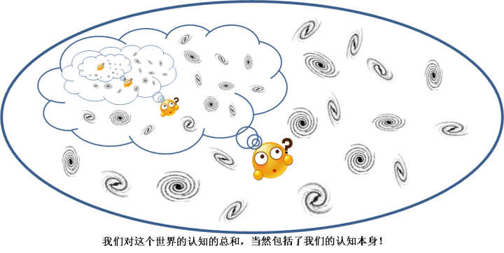
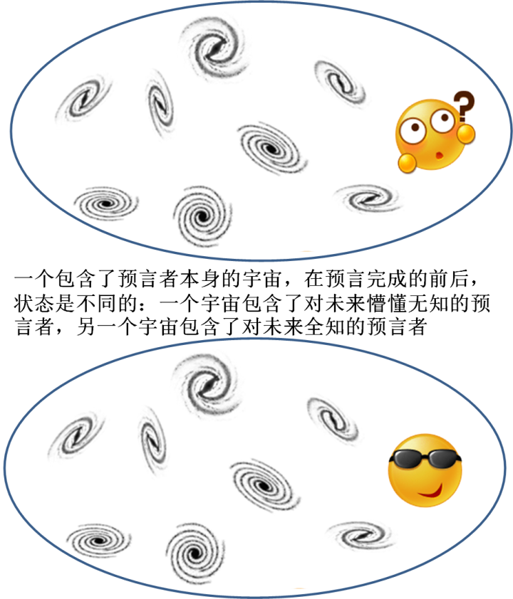

[13、只缘身在此山中](https://zhuanlan.zhihu.com/p/28537185)

***“Even if there is only one possible unified theory, it is just a set of rules and equations. What is it that breathes fire into the equations and  makes a universe for them to describe？”\***

***“即使是存在一个终极理论，它也不过是一些规则和方程的集合。究竟是什么赋予了这些方程以生命并且创造出一个宇宙让它们来描述？”\***

***-- 史蒂芬.霍金\***

那么，我们来讨论一下，如果我们的观察和预测也包括了自身，也就是说把自身也看做是系统的一部分，在对未来做出预测的时候，会发生什么。

首先，我要问这样一个问题，**一个人，有可能精确预测他自身的命运吗？**

假如说，一个预言家，有着超凡的能力，可以预测世间的一切。有一次，他对自己做出了一个预言，发现，他在今天12点钟将要经过一个红绿灯，被飞驰而来的汽车撞死。然后他就选择了今天不出门，因而成功地避免了这场车祸，改变了自己的悲惨命运。那么，他的这次预言究竟是成功的，还是不成功的？

人们会说，这个预言当然成功了，因为这个预言的关系，预言家成功地摆脱了被撞死的悲剧，这个不算成功，哪一个才算呢？可是，他的预言是自己死掉了啊，而事实证明，他没有死掉，因而，这个预言当然是不成功的。

我们想象我们的宇宙存在一个一模一样的复本，其中当然也有一个一模一样的预言家。我们把我们的宇宙叫做B世界，而我们的复本叫做A世界。如果在B世界，预言家做了预言，发现**如果他不做预言的**话他将死于车祸；而在A世界，预言家没有做预言，而他确如B世界的预言家所预言的，死于车祸；这个预言，只有在这样一种意义下才算是成功的。这里，我们的宇宙和我们宇宙的复本，它们之间的差别仅在于一点：预言家的一个复本知道了预言结果，而他的另一个复本不知道预言结果。而这个差别，导致了两个世界中发生了不同的事件。

事实上，预言家在对自己完成预言时，他在同时也改变了***世界\***的状态，这种改变是以这样一种方式完成的：做出预言之前，他**不知道**自己的“将来”。而当他做出预言之后，他**知道**自己的将来。“知道”和“不知道”之间，体现了他自身状态的某种差别。别忘了，预言家是世界的一部分！所以这个世界的状态是包括了他的状态的，他的状态的改变就意味着世界的整体状态改变。A世界和B世界在99.999……%（你可以想象的无数个9）的范围内都是相同的：天体还是在同样的转，周围的一切事情还是在按照原来的“命运”前进，甚至是那辆本来应该撞死预言家的汽车，也丝毫没有变化，它们之间的区别仅在于一点：预言家对预言结果的认知。在A世界，预言家不知道预言结果，在B世界，预言家知道预言结果。预言家的预言，是基于A世界初始状态做出的，而做出预言后世界的实际演化，却是基于B的。因而，预言家的预言失败了。

当然，“现实”世界是不存在一个复本的（只有B世界是真实存在的，而A是我们想象的），所以，***作为宇宙一部分\***的预言家总是会发现，他做出预言这个行为本身，毫无例外地会改变这个宇宙的初始状态，而他的预言是基于还没有改变的初始状态做出的。于是这个预言家发现，**他永远不可能做出一个关于自身的有效预言。**

预言家对自己未来的无能为力，不是由于现实中的技术原因（FAPP），而是被我们的基本逻辑所禁止的。

这里的最关键一点，就是“自己预测自己”是所谓的“自指系统”中的一种，这种系统，早就已经被发现是一个逻辑怪圈。一个最著名的例子就是“说谎者悖论”，这个悖论是这样的：

**“这句话是假话”**

这句话到底是真话的还是假话呢？如果说是真话，那么根据这就真话，它就是假话；如果它是假话呢？那么根据这句假话，它必然是真话。所以，无论怎么说，这个命题都是既真又假，非真非假。

说谎者悖论流传甚广，其实很多人指出，它严格讲并非一个悖论，而是一种逻辑上的语意不清。而真正以数理逻辑为基础的关于自指系统的悖论，是著名的罗素悖论。

罗素悖论，顾名思义，是数学家和哲学家罗素最先提出的，是集合论中的一个著名悖论，它的提出，直接引发了所谓的第三次数学危机。

集合论是整个数学学科的逻辑基础。现代数学，几乎全部都是建立在集合论基础上的。什么是集合呢？集合就是一组事物的组合，这一组事物中的每一个，都叫做这个集合的一个“元素”。一个集合可以包含有限个元素，也可以包括无限个元素。我们可以用枚举的方式定义一个集合，比如说：

集合1={1,2,3}

说的是由1、2、3三个自然数组成的集合

在绝大多数情况下，用枚举的方式来定义集合显然是不现实的，比如说，所有的自然数构成一个自然数集，我们显然不可能把自然数一一枚举出来。所以，朴素的集合论中有一个公理，叫做“**无限制概括公理**”，说的是：

**对于任何一个性质，满足该性质的所有元素，构成一个集合。**

比如说，我们随便列举一个性质，喜欢吹牛的人，那么，所有满足这个条件的人，就组成一个集合，用枚举法讲：

喜欢吹牛的人的集合={喜欢吹牛的人小明，喜欢吹牛的人小强，你的爸爸，……}

这样一来，我们就可以用一个**性质**来定义一个**集合**。

集合论的大师弗雷尔，最早试图用逻辑来定义自然数，在他看来，任何一个自然数都是逻辑的产物。任何一个集合的元素都是有数目的，如果两个集合之间，它们的元素可以一一对应（我们又见到“一一对应”了！），那么我们说它们的元素数目是相同的。所有这些相同元素数目（比如说3个元素）的集合构成的集合，就是这个自然数的定义。

这里我们就用到了集合的集合。也就是说，一个集合的元素本身也是一些集合。

一般而言，我们也可以很容易理解一个集合和它的元素是不同的，喜欢吹牛的人的集合，与它的某一个元素 – 比如说你爸爸我 –  当然不是一回事。那么，一个集合的元素可能包括它自己吗？以这个公理来看，这个问题的答案是肯定的。比如说，所有“不是爱吹牛的人”的事物构成的集合。这个集合本身，它不论是什么，反正不是一个爱吹牛人。所以它满足“不是爱吹牛的人”这个性质，它是它本身的元素。

所以，在这种以一个性质定义一个集合的方式中，我们是允许一个集合包含它自身的。

那么我们可以这样来定义一种集合：

***所有“元素不包括自己的集合”的集合。\***

我们把这个集合叫做A，那么，A的元素包括它自己吗？假设A不包括它自己，那么，A就满足“元素不包括自己的集合”这个性质，所以它就必然包括它自己，这是个矛盾；如果我们假设A包括它自己呢？那么根据A的性质，它必然不包括它自己，也是个矛盾。

这个悖论有一个更加通俗的版本，叫做“**理发师悖论**”，这个悖论是这样的：

小城里的理发师放出豪言：他只为，而且一定要为，城里所有不为自己刮胡子的人刮胡子。但问题是：理发师该为自己刮胡子吗？如果他为自己刮胡子，那么按照他的豪言“只为城里所有不为自己刮胡子的人刮胡子”他不应该为自己刮胡子；但如果他不为自己刮胡子，同样按照他的豪言“一定要为城里所有不为自己刮胡子的人刮胡子”他又应该为自己刮胡子。

罗素悖论的出现，引起了数学界的一次轩然大波。以至于后来，在ZFC集合论中，把无限制概括公理给限制了一下，我这里就不再试图用符号逻辑表示它了，而是直接把它翻译成人话：

***对任意给定集合 A 和一个性质P，我们可以找到A的子集 B，它的任何成员都是那些满足
P 的 A 的成员。\***

这个公理是什么意思呢？它把无限制的概括公理加了一条限制：单独由一条性质并不能定义一个集合，这个集合的元素必须来源于另外一个集合。样一来，集合论就不再接受那些**包括了自身的集合**了。

严格讲，**罗素悖论并没有因此被解决掉，而只是被绕道而行了。**这个悖论的存在，就说明了在数学中，我们不能处理某些**单独由一个群体性质定义的集合**。这看上去不容易理解，给定一个性质，难道我们找出所有满足这个性质的事物，不能组成一个集合吗？要知道，即使找不到任何事物满足这个性质，我们也可以组成一个不包含任何元素的集合，即空集。但是事实上，罗素悖论证明了这样做会引发矛盾。那么，我们即使可以找到满足这个性质的所有事物，这些事物的组合也并不总是可以被数学所接受，因而不能构成一个集合。罗素悖论要是那么好解决，它就不会引发第三次数学危机了。

接下来的这段论述请认真思考。因为这是我自己的一些思考，这些思考看起来似乎没有什么特别的地方，但是令人奇怪的是，我没有在任何文献中看到这样的直接表述，难道在其中我犯了一个低级错误？所以我也请你来一起考虑。记得我在前言中所说的，“怀疑”在科学中是一种极其珍贵的品质，所以这里暂时不要认定我说的就是正确的。

当我们研究这个宇宙的时候，我们研究的对象是什么？这个问题似乎是废话，研究对象当然是这个宇宙啦。可是，这个宇宙是什么？

是独立于我们意识以外的“客观”世界吗？那么再想一想，我们的思维能直接处理这个宇宙吗？事实上，我们所能认知的关于这个宇宙的一切一切，都只在我们的意识当中。我们意识之外有没有什么“客观”存在呢？这不好说。我们当然可以做出这样一个假设：

***在我们意识之外，存在着一个独立的世界，而我们的意识，只能认知到这个独立世界的一小部分。我们意识认知之外，仍然有客观的存在。\***

但是，那些“意识之外”的东西对我们有意义吗？我们既不能感知它，也不能影响它，更不可能被它影响（因为，一旦我们可以影响它，我们就必然可以感知它，记住，作用是相互的）。的确，**在我们的观察、认知、思考、研究过程中，我们只能去对付那些我们意识中存在的东西。**即使是存在一个“客观”世界，我们的研究对象，也只能是那个客观世界在我们意识中的映射而已。

从这个角度上说，不论是否存在一个外部的“客观世界”，我们研究的世界就是这样一种集合（我们称为集合X）：我们的意识中对这个世界的认知的总和。

而我们的意识对世界的认知，其本身当然是属于这个世界的一部分的，因而，我们对世界的认知总和，当然也包括了我们对世界的认知本身，也就是说，集合X也包含了X本身。

好吧，我们现在面临着罗素的窘境了！

========================================================

我认为，科学是用数学描述的，数学是用逻辑描述的。当我们的逻辑本身崩塌的时候，我们就没有办法来描述这个世界了，这，就是上帝给我们“确定地描述这个世界”所设置的逻辑限制。（这有一点类似于康德的“二律背反”，你要是有兴趣可以去看看。）

诗曰：

横看成岭侧成峰

远近高低各不同

不识庐山真面目

只缘身在此山中

上一篇：[12、FAPP和原则](https://zhuanlan.zhihu.com/p/28575104)

下一篇：[14、逻辑不确定性](https://zhuanlan.zhihu.com/p/28544499)

专栏：[魔鬼眼中的自然界](https://zhuanlan.zhihu.com/c_116602381?group_id=884931161871237120)

编辑于 2017-08-28

