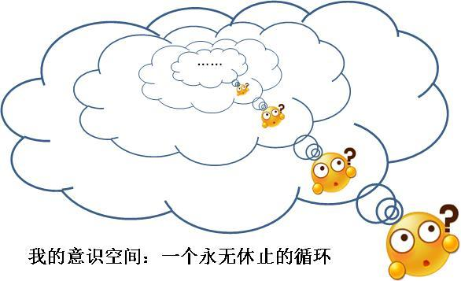
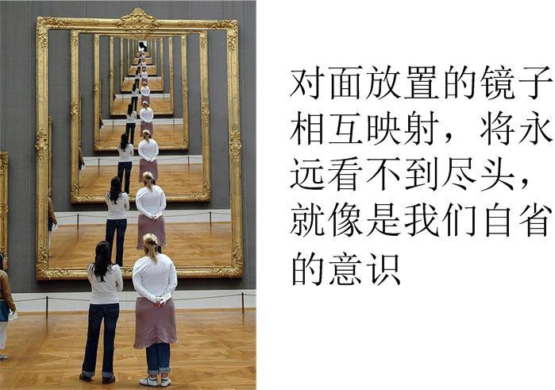

[16、决定论、自由意志、以及逻辑怪圈](https://zhuanlan.zhihu.com/p/28535294)

***“Science is a differential equation, religion is a boundary condition”\***

***“科学是微分方程，宗教是边界条件”\***

***-- 图灵\***

下面，我们来看一个很玄的话题，那就是 – “**自由意志**”（或者叫“自由意愿”）和“**宿命论**”。

谈到“自由意志”，就意味着我们开始作为一个**自我意识要审视自我意识本身**了，这是一件十分危险的事情，因为它非常容易陷入无尽的迷惑而无法自拔。我本人经常回避这个问题，偶尔想到“我是谁，我是什么”类似的问题，就会赶紧找别的事情岔开，因为这个问题令人细思极恐。但是，今天我要试着碰一碰它。

所谓自由意志，是一个有意识的主体，面对一个有各种开放式可能的选项，能够完全根据自己的意愿，自主地做出选择，这种自主选择的能力，就叫做自由意志。

我们日常的直观感觉告诉我们，至少在一定程度上，我们自己的精神是自由的：我们在**不被外力强迫的情况下**，具有按照自己的意愿自主做决定的自由。记得在你小时候，爸爸经常跟你说：关于你自己的一件事情，你可以自己做决定，也可以让爸爸妈妈替你做决定；如果是你自己做决定，那么你必须负责，一切后果你自己承担；如果爸爸妈妈替你做决定，那么爸爸妈妈替你扛起来所有的后果，但是你必须听爸爸妈妈的话。这个在“自己做决定”和“爸妈替你做决定”之间的选择，本身就是你的一个自主决定。之所以让你自己承担自己决定的后果，是因为这是你**自己**的选择。这个逻辑的背后就是：你是自由的，你在自主决定的时候，没有什么来干涉你。后续事件向哪个方向发展，全由你说了算。

我们立刻可以意识到，“自由意志”这个东东，对决定论来说是一个巨大的bug。严格的决定论是不允许自由意志出现的。你“自由”地做出选择的前提是，你有一个开放式的各种可能性，这些可能性提供了一个选项列表，你可以根据我们自己的意愿从中间任意选取。那么这个开放式的选择所引起的宇宙未来演化是不确定的，在你做出选择之前，没人（包括你自己）知道你会选什么[[1\]](https://zhuanlan.zhihu.com/write#_ftn1)，也就不可能预测宇宙的未来。这样一来，我们不需要什么混沌，不需要什么逻辑悖论，就知道未来是不确定的。

其实，我们前面几章所说的逻辑不确定性，归根结底是与自由意志相关的。比如说，前面第13章所说的“预言者预言宇宙命运”那个例子。正如前面的分析，我的预言导致了宇宙状态的不确定性：**我在完成一次预测的同时，不可避免地改变了“我”自己的状态 – “我”对宇宙的认知状态。**而作为预言者的“我”也是宇宙的一部分，那么“我”的自我状态就是宇宙状态的一部分。因而，**我的预言不可避免地改变了宇宙的状态，使得宇宙走向了一条与我做出预言前不同的岔路，进而改变了宇宙的命运。**但是，这个逻辑其实包含了一个隐藏的前提，这个前提就是我有自由意志，我有“做出一个预言”的自由。正是因为我有这个自由，我才可以说，在我做预言之前，宇宙“本应该”沿着一条轨迹演化（路径A），当我做出预言之后，宇宙的轨迹变了，变成了路径B。但是我的这个自由，本身就已经违背了决定论。所以，前面的整个逻辑分析，是建立在一个“决定论无效”的前提上的，得到的结论就必然是不支持决定论的。因而，一个**自由**的预言者无法对自身做出有效的预言，这是顺理成章的。

但是如果说，“我要做出一个预言”这件事的动机本身就是由我所处的环境、周围发生的事件、自身的基因、性格、激素水平、体内的各种物理和化学反应导致的神经元电网状态等等一系列客观因素决定的，归根结底是在自然规律支配下必然产生的，那么“我”做预言的动机也就只不过是自然世界假借于我的大脑的意志而已，而不是“**自己**”的意志。在一个局外人看来，完全可以根据我的性格、相关的各种事件发生的情况，而准确推算出我到底是不是想要做一个预言。我“做出预言”这个事件本身，就是事先被决定好必然要发生的，因而我在做出预言之后的种种行为，也就是决定论演化的一部分。既然“做出预言”这个行为本身，也是事先注定的事件，那么**宇宙根本就不存在一条“本应该”的路径（路径A），它只有一条路径，就是“我”做出预言导致的宇宙演化路径（路径B）。路径A只不过是一个幻象而已，**是“我”以为**如果**“我”不做预言的情况下发生的，但是，我的这种自以为是的情况根本就不存在！

**那么自由意志它到底是真实的，还是幻觉呢？**

比如说我们来想象一个场景，在一个周六的早上，你起床后开始想自己要干点什么。你想，你可以去打羽毛球，你已经有2周没有打球了；但是你还在惦记着看完手中的《哈利波特》，因为你特别想知道小哈利到底能不能打败伏地魔。于是你犹豫了半天，终于决定先把哈利波特放在一边，去打羽毛球。这件事，在我们直觉里，当然是你“自主”地做出了选择。打羽毛球，还看小说，这是两个**开放**的选项，你有选择的自由。到底要做哪一件，全凭你的意愿决定。你虽然选择了打羽毛球，但是同样的情况，你也**可以**选择看哈利波特，如果没有谁来强迫你的话，这个宇宙的未来中，关于你的这一部分到底会发生什么，是你在看小说还是你在打羽毛球，全**由你决定**，而不是由决定论的物理定律决定。

现在，我们来想一想你在打羽毛球和看《哈利波特》之间犹豫不决的时候，你是如何考虑两者的各种好处和后果，然后在心中做出各种权衡，最终又是如何根据这些权衡做出决定打球而不是看小说的。例如，你会想：

1、 我已经两周没有打球了，在这么下去，球技就要生疏了，我可不愿意球技生疏而让其他小朋友超过；

2、 看小说可以满足我对小哈利命运的好奇心，这是快乐的；但是打球一样可以让我感觉快乐，也还不错哦；

3、 小说可以放到晚些时候再看，但是羽毛球课的时间是固定的；

4、 我没有运动太久了，身体都有些要生锈啦；

5、 ……

当然，你想的肯定不止这么一点，各种你意识到的和没意识到的想法要多得多。但是最后你做出打球的决定，肯定是对这些情况做出了充分分析和考虑之后才发生的。而你这些想法又是哪里来的呢？它们肯定受到各种因素的影响：你的性格，你当时的心情，你昨晚睡眠如何，起床后的第一缕阳光，等等。

那么这时候，你爸爸我跳出来说：“哈！我早就知道你会这么决定了，因为我也考虑了你考虑的这些情况，我知道你的性格和你做决定时的状态，在你做决定之前，我们就已经知道了，你的决定是必然的！”你知道，爸爸这些话可不都是瞎吹牛，以爸爸对你的了解，在很多情况下事先预知你要做什么决定并不是太难的事情。既然你的决定是可预测的，它必然会发生，你在做出这个决定的时候还是自由的吗？你的决定只是你**被决定**做出的决定而已，是不是有些绕晕了？ 

如果说，我们的世界（称为世界A）有一个复本（称为世界B），直到你在做出决定之前，B中发生着和A完全一模一样的事情，那么，这两个世界中，你和你的复本会做出不一样的决定吗？如果你具有完全自由的意志，那么你**可以**自由决定干什么，在B世界里面，你完全可以选择了看小说而不是去打球。如果我们的世界有很多个复本，那么，这些世界的复本中，有一部分的你“自由地”选择了打球，另一部分的你“自由地”则选择了看小说，它是随机的。这样，你觉得你就自由了吗？似乎也不能这么说，因为你的“决定”是一个随机的事件而已！一个随机的决定，难道就是你的自主决定吗？你肯定会想，我根据自己的情况做出判断，然后再做出的决定才是自主的，如果是随机的，那么我还要犹豫什么？只有抛个硬币就解决了嘛！

如此一来，**我们就面临着两难：如果世界是决定论的，那么我们的决定是事先被决定的；如果世界是随机的，那么我们的决定只是随机事件而已。不论如何，我们都没有“自由”。**

所以，你看到，在这种说法里面，似乎无论如何，“自由意志”都是一个不存在的东东！这是不是让你很不爽？原来我们要么是一个被操纵的提线木偶，要么我们是一个只凭抛硬币的白痴。

关于自由意志，近几年来随着医学的发展，已经开始有人在做这方面的实验研究，科学家让一个志愿者来按一个按钮，他什么时候按，是由他自己决定的。在这个过程中，科学家全程监控志愿者相应的大脑区域的电信号反映，同时告诉志愿者，当他决定好要按按钮的时候，把时间记下来。实验的结果是令人惊异的：科学家们发现，大脑相应区域开始兴奋的时间，要早于志愿者自己认为做决定的时间。这中间的最长的时间差达到了1秒钟！也就是说，**远远早与志愿者自以为要做决定的时候，大脑中就已经开始要按这个按钮了。**这意味着什么？它是不是说明，你实际上已经开始要做这个动作了，你的“决定”才姗姗来迟？那么，是不是你的“决定”只不过是过来凑个热闹、打个酱油而已？你以为你做了决定，但实际上你被骗了，你的动作是被决定的，而你自以为的自主决定只不过是你被决定的动作的众多**结果**之一，而不是它的起因。

——这个结果还有另外的诠释，就是说，做一个决定本身是一个过程，早在你意识到自己已经做好决定之前，你的大脑已经开始了复杂的计算，这包括了你的潜意识，你的区域神经网络等等。直到你的后台计算已经完成、结论已经得出、决定已经做好、行动已经启动之后，这个决定才浮现到你的显意识，这时候你才知道你已经做好了决定。这个决定本身仍然是你的大脑“自主”运转的结果，只不过你的意识姗姗来迟而已。但是，这种说法中，你的整个决策过程是完全不受你的意识控制的，是你的后台程序完成了决策过程之后才例行了一个告知义务。既然关键的决策过程是在我们意识无法感知的后台完成的，我们又如何知道，整个后台的决策过程是自由的呢？还是不自由的呢？

到这里，我们的讨论已经完全超出了科学的范围，因为，**我们究竟是做了被决定的决定，还是做了随机的决定，还是我们真的能自主做决定，都已经无法实证了**。从实证的角度我们只能知道，最终的结果你去打球了，而没有看小说（或者相反），究竟这个决定是你自己做的，还是你自以为自己做其实是被做的，没有什么分别。自由意志是否存在？自由意志的源头在哪里？**这是一个哲学问题，而不是一个科学问题**。

关于这个问题，一个神经科学家Sam Harris提出了一个疯狂科学家的比喻。这个比喻是这样的：一个疯狂的科学家，他发明了一种机器，可以控制人的欲望。有一个人 – 比如说叫做小明 –  被这台邪恶的机器所控制。因而，小明的各种行为动机（也就是欲望）就被控制了，进而他的行为也就被控制了，那么小明的行为就不能说是自由的。那么，无论是这台机器被疯狂科学家操作，还是被随机地操作，这并没有任何差别 –  小明都不能被视为自由的。而我们的大脑结构中，每一个不同的部位会被其中的物理和化学过程控制，自发地产生不可预测的欲望，我们每个人都是被操纵的受害者 – 我们被“大脑”中毫无意识的物理和化学过程所控制 – 那么，我们能被认为是“自由”的吗？

事实上，在自然科学的范畴内，除了医学和生物学这种紧密相关的学科，大部分人不会去讨论关于自由意志的问题，但是在哲学里面，这是个很热门的话题。对决定论和自由意志这两个问题的看法，就分成了不同的哲学流派：

世界是决定论的，并且自由意志不可能存在，我们把它叫做“**强决定论**”（Hard Determinism）；

世界是决定论的，但是自由意志仍然可能存在的，我们把它叫做“**相容论**”（Compatibilism）；

世界是非决定论的，同时自由意志也可能存在的，我们把它叫做“**自由论**”（Libertarianism）；

世界是非决定论，而自由意志也不可能存在的，我们把它叫做“**强不相容论**” （Hard Incompatibilism）。

强决定论是比较容易理解的：既然世界是决定论的，那么我们大脑的一切活动都是整个自然界巨大的因果链条中渺小的几个环节而已。我们的思想，归结为一个庞大的神经网络之间的连接方式和电信号在其中的传递，而电信号的传递，是由一系列复杂的生物化学和生物物理过程引起的。这些归根结底都是受到自然规律的控制的。那么，大脑的活动是自然规律的必然结果，而不是“我”自由的灵魂所支配的。

我可以再解释一下相容论的观点，相容论认为，自由意志和决定论并不矛盾，我们的的确确是自主地根据我们的意愿来做出决定，但是我们的意愿却是被决定的。也就是说，自然让你产生了打羽毛球的想法，而你，根据你的想法选择了去打羽毛球。这一派的一句名言是**“We do what we will, but we don’t will what we will”**（*吾随心所欲，心不能欲所欲也*）。在你早上犹豫着是去打球还是看小说的时候，你以为你还没有做决定，其实，是因为你还没有足够的动机来让你下定决心。而这个动机是哪里来的？它是自然界强加给你的！

对相容论的很多批判集中在一点，就是它对“自由意志”的定义。在这些批判看来，相容论的自由意志不过是个幻象而已。既然你自己的行为动机是被决定的，那么你所谓的“根据被决定的动机做出自主决定”，不过是掩耳盗铃而已。

但是，否定自由意志这一点在社会学上有着非常可怕的后果。比如说，在法律界，人们在判定一个罪犯行为时的一个重要依据是，他的犯罪行为是自己的决定，还是被迫的？例如一个人杀了人，法律要看，是他故意杀人，还是被另外一个人控制下（比如被前面所说的疯狂科学家控制）或胁迫下杀的人，两者显然量刑不同。如果自由意志不存在的话，就不会存在故意杀人这一说了。想象一下，当警察去逮捕一个杀人犯时，他狡辩说：“不是我要杀人，是这个自然界的规律决定了我不得不杀人，所以你不能逮捕我！”当然，警察也可以说：“不是我要逮捕你，而是自然界的规律决定了我不得不逮捕你！”这个社会岂不是乱成了一锅粥？所以说，抛开了哲学探讨，我们的社会要求我们必须保留自由意志这个概念！

这几种关于决定论和自由意志的流派，你**相信**哪一种？

我不问你哪一种是**正确**的。因为这个问题已经超出了科学的范围，它没有办法**被判定**正确与否，不论是你选择相信哪一种，都有说得通的道理！这就是哲学与科学的一个重大不同。

如果我们这种思路继续探究下去，就会细思极恐：**自我意识**本身的一个重要因素，就是“自我”是独立的，是一定程度上自由的。如果我们的意识不过是宇宙间冷冰冰的因果链条中的一个零件，我们还能够有“自我意识”吗？

我曾经不止一次地，在闲极无聊或者夜深人静之时，想到过“我是谁”这个问题，闭上眼睛，让自己的意识在意识空间中搜索，各种感官纷至沓来，或清风拂面，或蛙鸣蝉噪，有的令人愉悦，有的令人不安。静静体会之余，却越来越迷惑：感觉为什么成为感觉？这些感官到底是什么？如果说感觉只是一些沿着神经网络传播的电脉冲，那么这些脉冲又如何才变成了“感觉”这种主观事物？进而，感官到底要送到那里去，被什么接受？而又是什么，对这些感官产生了七情六欲的反馈？剥去了各种感觉的外壳之后，那背后的内核是什么？每当我注视这个“内核”的时候，我总是有如面临一个巨大的黑洞，诱惑我奋不顾身地跳进去。如果说我们只是各种感官的组合，那么“自我”又在哪里？如果说各种感官背后有一个主体，那么，为何我感觉不到这个主体在哪里？**主体**与**客体**的边界在哪里？到底从哪里开始，我们有了“自我”的概念的？每一次想到此处，我就有一种要发狂般的恐惧。只能立刻从这个思索中抽身，赶紧让大脑去想一些别的事情，把这个巨大的迷惑忘掉。仿佛我多想一会儿，就会深陷其中而无法自拔。

我不知道你有没有过类似的这种主观体验，恐惧，就是每当我想到“我是谁”这个问题时的最真切感受。

经历过了无数次痛苦的思索，我有一次突然意识到，我以我自身的意识，来试图完全理解自己，这本身就是一个无法完成的任务。就像是逻辑中，我们对一个概念的定义，永远都要用这个概念以外的语言来实现，而不能循环定义自身。**对“我”的认知，是否必须要跳出我的“自我意识”之外才有可能？**但不幸的是，“我”永远都只能是“自我意识”牢笼中的囚徒，而不可能逃出去。于是我觉得，“自我”这个概念，本身就是一个自指系统，就像是我们前面谈到的，自指系统中的种种逻辑怪圈时难以避免的。因为“自我意识”就隐含了意识对自己本身的观察和自省
–  如果意识不能够有所自省，那么何谈“自我”？因而，“自省”过程就是自己对自己的定义，也就是自我引用。我的意识所做的自省的对象，就是我的意识本身，包括了意识空间中的一切。而意识的自我认知（自省本身），当然是意识空间中的一部分，因而，自省的对象就是自省本身。而自省就又包含了一层一层的自我认知过程。这样一来，就永远无限循环下去，无穷无尽，如果我们不断细究，就会陷入其中无法脱身，就像是一个陷入死循环的计算机程序一样，我们将无法做出任何思考。

这种情形，就好像是你站在一个面对面放置的镜子中间一样，镜子对自身的映射，就像是你的自省过程。你在镜子中会看到这个自省的终点吗？不会。

我们的自我意识必须在某一个环节就要停下来，以免我们的大脑陷入无限循环，乃至于烧脑直至把大脑烧坏。那么，我们的自省，将不可能完成。我们必须要接受这样一个现实：在原则上，**自省永远不可能理解自省本身**，中间必然会有一个空白，而这个空白，其实是忽略了“直到无限循环的终点”这样一个巨大的空间。那么，自我意识本身，对自我意识而言，就必然是神秘的，不可解的。我们要么进入死循环烧脑至白痴，要么接受现实，停止那种想清楚自己是谁的企图。因而，“我是谁”这个古老的问题，就会一直保持神秘，**不论我们的科学、哲学、乃至于其它一切基于理性和逻辑的思辨如何发展，它都是无解的。**人们既然无法认清楚自我意识，当然也就不可能对自由意志这个问题获得答案。我们在思考“我的这个决定到底是如何做出来的”这个问题时，本身就是一个自省的过程，而这中间的逻辑循环，就必然导致我们不可能搞清楚一个决策过程的“终极起点”。于是关于“自由意志”的概念就这么产生了：决定从何而来？它就是从哪个无穷无尽的循环的尽头而来，是不可理喻的。

想清楚这一点之后，我感觉如释重负，不再继续就“我是谁”这个问题纠缠下去。虽然它仍然会时不时蹦出来困扰我，但是我已经不试图获得答案，转而寻求一种犬儒主义式的解脱：**我是谁？我就是一个逻辑怪圈。**

但是，人们并不仅仅是一个逻辑动物，人还会有情感、需要心灵的宁静。对于不太仅仅满足于理性思维的人类来说，他们不会满足于认知中的这样一种神秘的空白。为了寻求慰藉，有些人们把这片思维的禁区归结为神秘主义，于是，这就被延伸到“**宗教**”问题了。

在很多宗教中，我们个人的自我意识，实际上是全能的“神”的自我意识的投影，我们的动机和行为，来源于神。而神是什么？对不起，神是神圣的存在，不是我们卑微的人类所能理解的，我们只需要保持谦卑和崇拜就可以了。其实在很多宗教里面，自由意志也是一个富有争议的话题。我对宗教并无太多的理解，并且对这些宗教保持着尊重但是敬而远之的态度，不想对它们妄加评论，所以并不能给你一个完整的叙述。这里摘抄维基百科中的一段关于基督教新教的叙述，它不是我的观点和理解，但是希望能让你对它有所了解：

***“在基督宗教的神学观点中，……\*** ***‘\*** ***自由意志’\*** ***可以理解为上帝将自己的特征给予祂所创造的人，即有自主的意志活动能力，可以进行选择、相信、怀疑、接受、拒绝的意志活动，这也是基督教圣经中提到能够使人犯罪或者得到救赎的自主部分。”\***

不论如何，我们可以看到，所谓的“自由意志”问题，跟“注定的未来”一样，是一种原则上不可知的东西：即使它**在原则**上是存在的，我们**在原则上**也无法对它进行判定。

“原则”是哲学家所钟爱的东西，对科学家而言，没有比**实证**更高的原则。既然我们从原则上都没有任何可能对自由意志做出判定，那么，“无法理解的自由意志”和“无法预测的注定的未来”一样，对科学家们而言，它存在与否，又有何区别呢？这“**连个错误都算不上！**[[2\]](https://zhuanlan.zhihu.com/write#_ftn2)”是的，在自然科学中，“一个确定的未来是否存在”不是一个有效的问题，“我们的未来是否可预测”才是。因为，我们永远无法实证一个确定的未来存在与否；但是，我们总是可以做一个预言，然后未来是否可预测。

**前面我们已经看到，在经典物理学的框架下，科学对“我们的未来是否可预测”后者的答案是：不能。而这里我说，科学对“一个确定的未来是否存在”的答案是：子不语怪力乱神，这个问题没有意义。**

当然，科学不是精神家园的全部，科学中没有意义的问题，并不意味着对我们来说没有意义。在科学所不能掌控的地方，你需要的是比科学精神更加广泛的东西，例如直觉、或是信仰。

既然“自我”和“自由意志”本身并不是一个可以在科学范围内解决的事情，那么，**自由意志与决定论的关系也就不再是一个科学问题。**我们可以**相信**我们具有有自由意志，可以在一定程度上左右这个世界未来的发展轨迹 – 因而决定论就被打破了；我们也可以**相信**，自由意志只不过是一个幻象，是自然规律对我们的愚弄，我们的一切决定仍然是被决定的，那么决定论就是一个冷冰冰的存在，无法撼动。自由意志究竟是存在的，还是一个我们无法突破的幻象？未来究竟是开放的，还是我们一个无法看穿的宿命？这类问题无法证实也无法证伪，因而在科学的领域中，它是没有意义的。

*[[1\]](https://zhuanlan.zhihu.com/write#_ftnref1) 因为如果你的选择可以事先预测的话，说明这个选择是事先注定好的，何来你的“自由”？*

*[[2\]](https://zhuanlan.zhihu.com/write#_ftnref2)  这是泡利的一句名言。科学命题讲究的是“可证伪性”，即对一个命题，我们在原则上有办法做实验，而实验结果存在把这个命题否定掉的可能。如果实验结论真的与命题不符，那么我们说，这个命题是个“错误”。但是对于那些无法证伪的命题，就是“连错误都不算”的命题。科学家们对它们是不屑一顾的。*

上一篇：[15、产生于不确定的确定性](https://zhuanlan.zhihu.com/p/28576046)

下一篇：[17、经典不确定和量子不确定](https://zhuanlan.zhihu.com/p/28582873)

专栏：[魔鬼眼中的自然界](https://zhuanlan.zhihu.com/c_116602381)

