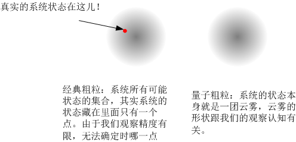
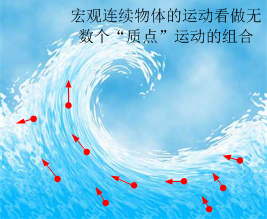
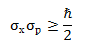
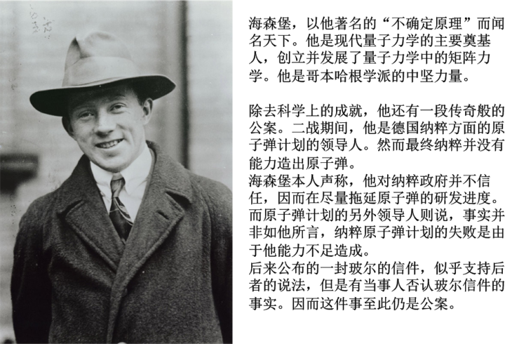
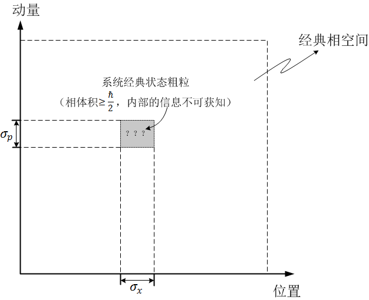

[17、经典不确定和量子不确定](https://zhuanlan.zhihu.com/p/28582873)

***“If quantum mechanics hasn’t profoundly shocked you, you haven’t understood it yet”\***

***“如果你没有被量子力学在最深处震撼到，那么你还没有理解它”\***

***– 玻尔\***

我需要说明一点，到此为止前面所讨论的一切，都是在所谓的“经典”力学框架下做出的。我们已经看到，经典力学的运动定律是完全决定论的，理论上，任何一个系统给定了初始状态后，都会按照既定路线发展。但是即使是这样，不论是从逻辑上还是物理上，我们都不可能获得完全确定的物理状态，因而到最后我们不得不放弃对系统做出长时间有效预测的可能性。既然我们根本不可能做出预测，那么，那个确定的未来只能是虚幻的，无法实证的，它的存在与否，都对我们毫无意义了。

但是，经典物理中的这种不确定性，只是否定了世界的**可预测性**，而对**确定性**其实还是留有余地的。假如我们跳出物理学，认为存在着一个不遵守物理定律的拉普拉斯之妖，它可以完全自由地获得系统的状态又不必对系统做出有干扰的观察，那么它还是可以预测未来的。当然，既然这个妖怪不必遵守物理定律，那么这个讨论就不再是科学讨论了[[1\]](https://zhuanlan.zhihu.com/write#_ftn1)：我们讨论物理定律的不确定性，它的前提就是物理定律失效！这本身就是一个逻辑循环。

然而量子力学却不一样，它似乎认为，物理定律本身就只能是概率性的，自然界绝大多数情况下根本就不存在所谓的“确定状态”！

那么，什么是量子力学呢？

量子力学研究的对象与经典物理学不同。经典物理研究的是我们身边可以看到、可以摸到的宏观物体的运动，而量子力学，研究的是那些我们看不到摸不着的微观粒子诸如光子、原子、电子等。

在经典时代，人们的研究深度并没有达到微观尺度，所以人们并没有意识到，微观规律与宏观规律之间会有着怎样的巨大鸿沟。一直到19世纪末，也就是短短的100多年以前，人们对“是否存在分子”这个问题还在争论。当时人们习惯于将物体看做是“**质点**”的集合，也就是把物体分解成无穷多个有质量的点来看待：每一个质点都有一定的质量，满足牛顿定律，有自己的运动状态。所有的宏观物体，那些不能当做质点看待的“连续体”比如说机械部件、流体、弹性和塑性材料等等，可以看做无穷多的质点组成的集合，叫做“**质点系**”。每一部分质点的运动组合起来就形成了各种复杂的移动、转动、振动、流动等运动形式。

质点是一种物理抽象，并不代表实际的物理实体。真正开始把微观粒子当做实际存在的物理实体看待的，是150多年前的玻尔兹曼，他坚信分子的存在，并发展了统计力学，试图在大量分子的个体运动中寻找整体运动规律。悲剧的是，他的思想受到了当时主流物理学界的反对，（最著名的是逻辑实证主义者马赫）最终他在抑郁中自杀。然而统计力学终于取得了辉煌的成就并成为主流物理学分支。在他死后数年之内，大多数物理学家已经开始接受分子的存在，并最终由爱因斯坦（又是他！）关于布朗运动的研究获得了实证。

但是不论是质点，还是玻尔兹曼的分子，它们所满足的仍然是经典的牛顿定律。在这里，分子的运动和一个桌球运动毫无分别。

在20世纪初，当时主流观点已经认为物理学的主要框架，包括牛顿力学（后面被进一步发展为理论力学）、电磁理论、统计力学等都已经完美建立起来了，物理学中只剩下应用和少数的锦上添花的理论。当时物理学的清空上只漂浮着**两朵小小的乌云：一个是以太，一个是黑体辐射。**但是人们万万没有想到，就是这两朵乌云，引发了两个极具颠覆性的革命：相对论和量子力学。

黑体辐射问题，就是经典的统计力学计算结果与实际不相符的一个矛盾。人们当时没有想到，这个看似微不足道的问题，导致了整个经典大厦的崩塌。从黑体辐射开始，经历了一系列发现和演变，终于量子力学粉墨登场了。

量子力学对经典物理的冲击是毁灭性的。在量子力学中人们发现，真实的分子、原子、电子等粒子的运动，与经典的质点和玻尔兹曼的分子大相径庭。它非但不遵守经典物理定律，而且以经典眼光来看，是匪夷所思的。

从这里开始，我们即将触摸量子力学的核心，我要警告你，你以前对这个世界的经验即将完全失效。准备好了吗？放弃**所有**的常识、放弃所有的形象思维，我们要进入一个前所未有的荒诞世界了。你会发现，量子其实一点都不难，相反，它极其简单 – 前提是你能够**接受**它而不引起严重的头晕。

量子力学里面有种种极其怪异之处，其中之一就是不确定原理，我们就先从它说起。

不确定原理说的是，一个粒子的状态是一个范围，而不是确定的。粒子的动量[[2\]](https://zhuanlan.zhihu.com/write#_ftn2)和位置所具有不确定性的乘积之积不得小于某一个量。具体而言，比如说，动量不确定的范围σp与位置不确定的范围σx之间，有如下关系： 

其中，h是约化普朗克常数，用国际单位制表示，它的数值大约是10^-34。

这个不等式告诉我们，对于一个粒子，它的位置和动量都不能完全确定，它的位置不确定范围和动量不确定范围是一种此消彼长的关系：位置越确定，那么动量就越不确定，而动量越确定，则位置就越不确定。因此我们对它的运动状态不可能确知到任意精度，我们对位置了解越多，对动量（速度）的了解就越模糊，反之亦然。总之，我们对微观粒子运动状态的认知精细程度，被限制在了一个范围之外。

你说不定已经开始犯迷糊了。这里我们说的“不确定”到底是什么意思？一个粒子难道没有一个确定的位置吗？它的运动难道没有一个确定的速度吗？这究竟是什么意思呢？它指的是：

我们对系统的**无知度**的范围？

我们对系统**观测精确度**的范围？

**统计层面**上的偏差范围？

系统根本就**没有**确定的动量和位置？

对此，历史上先后出现过多种诠释，最主要的不外乎两种观点：

第一种说法，“**不确定**”即“**测不准**”。也就是说，粒子本身是具有确定的位置和动量的，在某特定时刻，一个粒子总是会有一个确定的位置，有一个确定的速度的，但是我们不可能**获知**这个确定的位置和动量。事实上，海森堡在最初发表的论文中，主要就是从前面我们提到的**观察者效应**角度而言的，也就是，任何观测过程都不可能对系统不造成干扰，因而，当我们对系统进行观测的时候，总是掺杂了不可控的扰动，对于宏观系统，我们的观察可以做到对系统扰动极小，但是对于微观系统，这种扰动的影响相对而言就不可忽略了：比如说我们用手指触碰一粒尘埃。因而观察者完成一次观察后，得到的总是一个不准确的结果，因为“真实的”系统状态已经被观察行为破坏掉了。我们国内早期的物理课本和文献，往往把不确定原理称作“**测不准原理**”，就是因为这个原因。

第二种说法，“不确定”就是“不确定”，不是我们不知道，而是它本身就根本没有确定的位置和动量。确定的位置和动量对微观粒子而言毫无意义。这一点是早期量子力学中最令人迷惑的一点。当初海森堡本人发表了不确定关系的论文之后，玻尔本人明确当面指出，认为海森堡所说的“观察者效应”是错误的，不确定原理应该有更加深刻的含义，这让海森堡本人当时十分沮丧。确实，如何理解一个粒子不具备确定的位置和动量？难道它不应该**存在于某一个地方**，不应该**有一个速度吗**？这不但是一个令人困惑的事情，简直是不可理喻的。当我们谈论一个粒子的时候，我们会理所当然地问：“它在哪儿？”在经典物理学中，这不但是个有效的问题，而且是一个非常重要的问题，但是在量子力学里，除非你观察它，否则你根本不被允许问这个问题，如果非要回答，“它不在哪儿”也许是最好的答案。

第一种说法相对而言比较容易理解，它符合我们的常识；而第二种说法让人完全无法接受：你如何理解这样一个粒子，它存在，但是却不存在于某个特定位置？它在运动，但是它没有一定的快慢？但是事实上，无数的观测事实已经表明，第一种理解极可能是错误的，而第二种理解，已经被物理界绝大多数的科学家所认可。

我们再来说一个类比，经典的不确定性和量子的不确定性区别在哪里。比如说我们要去买一本书，那么一个粒子的状态好比是这本书的价格。

第一种情况，我们去书店买书，那里所有的书都有明确的价格，在我们还没有去书店之前，我们对它的价格是不确定的，我们只能根据经验大致猜测它到底多少钱。但是，这本书的价格是确定存在的。我们对价钱的不确定，仅仅是因为我们**还不知道**。

第二种情况，我们不去书店，而是去跳蚤市场。在市场上我们可以买到便宜的二手书。每一本书的价格都是我们与卖主讨价还价之后确定的。我们事先根据行情可以大致猜测这本书会值多少钱，但是在我们还没有买这本书之前，它的价格是不确定的，我们只是大概知道范围，如果这时候你问价格是多少，我们只能说，“15~25块钱之间”，但是在我们砍价结束准备付钱之前，这个价钱是不确切。我们对价格的不确定，并不仅仅是我们不知道，而是一个确切的价格它根本就**不存在**。只有当我们在付钱的时候，我们能确定它的价格是多少。

而量子力学，就像是跳蚤市场这种情况。一个粒子，我们在还没有观察它的时候，它没有确定的位置、也没有确定的动量，就好像跳蚤市场里我们没有付钱的时候，它没有一个确定的价格。只有当我们观察的时候，它才会“获得”一个状态，就好像只有当我们付钱时，这本书才有一个价格一样。但是，这里更加复杂一点的是，粒子的状态是包括很多个物理量的，即使是在观察的时候，我们也不能同时观察到几个不同的确定物理量。比如说，当我们观察一个粒子的位置时，我们可以获得粒子的确定位置，但是作为代价，粒子的动量将变得完全不确定。反过来，如果我们观察粒子的动量，我们获得一个确定的粒子动量，但是相应地，粒子的位置一下变得弥散于整个宇宙了。

如果把这种不确定效应放大到宏观世界，那么就好玩儿了。想象一下这样一段对话：

*甲：“小明在哪儿？”*

*乙：“他在北京。”*

*甲：“在北京哪个地方？天安门？故宫？机场？火车站？还是其他地方？”*

*乙：“他在北京到处都是！”*

*甲：“@#￥%！……”*

*甲：“小明今天怎么上学的？”*

*乙：“步行和乘汽车。”*

*甲：“到底是步行还是坐汽车？还是一段路步行，另一段路乘汽车？”*

*乙：“他全程既步行又乘汽车！”*

*甲：“@#￥%！……”*

幸运的是，不确定原理对宏观事物影响甚微，因为约化普朗克常数本身是一个很小的数值。比如说，对一个PM2.5级别的尘埃，在宏观上，他感觉已经是非常小了，我们甚至看不到它，但是我们可以估算一下它的动量的数量级，大约应该是在10^-15这个级别上，因而，他位置不确定度大约是10^-19，与它本身的尺寸相比，不确定程度大约为0.00000000001%，基本上对确定性没有什么影响。但是，对于微观粒子而言，情况就大不相同了。比如不确切地估算的话，如果这个尘埃的尺度缩减到最小的病毒的水准，（~10纳米），那么，同样估算，它位置的不确定度大约有0.01——0.001%左右了；当它进一步缩减，到了电子的尺度，那么它的不确定度就已经很大了，就像是一粒沙子，它的不确定程度却比一个足球场还要大。

根据不确定关系微观粒子的状态只能用一个范围表示，那么用经典的相空间来看，它看起来就跟我前面讲的经典粗粒非常相似。就像下图表示的，一个微观粒子的状态在动量-位置的空间中，是一个由动量不确定范围σp和位置不确定的范围σx之划定的一个粗粒，这个粗粒的相体积，按照不确定原理，必须大于h/2。

但是，量子力学中一个粒子的状态，和经典粗粒有着截然不同的含义。我们还记得，相空间中的一个粗粒，代表着一个系统状态的“**概率云**”。粗粒中的每一个点都是系统的一种可能状态。受我们的观察精度所限，我们并不知道真实的系统状态究竟是在哪一个点，但是我们知道，它粗粒中的某一个特定的点。由于我们的这种不确定性，我们在考虑系统的可能演化时，就必须考虑粗粒中的每一个点。而粗粒中的每一个点都对应一个状态略微不同的系统，因此，我们在考虑经典粗粒的时候，实际上是在考虑无数个相似的系统复本（系综）。但是，量子力学中的微观粒子（量子）则不同，一个量子，它所表现出来的状态，本身就是一团云雾，这团云雾本身就是系统的全部状态，我们不能像经典粗粒那样，去问“系统的状态究竟是云雾包裹中的哪一点”，因为不确定原理告诉我们，量子的状态不是一个确定的点。

相应地，在量子力学中，粒子的运动状态已经不能像经典粒子那样，用位置和速度（动量）来定义了。它的运动状态是一种所谓的**量子态。**这个量子态究竟是什么呢？就像是前面提到的，它非常像经典粗粒所代表的“概率云”，但是又有本质的不同。不像经典物理中，概率云只是观测上的不确定，而粒子的状态是确定的。而量子态其实就是一团模糊的云，而不是一个确定的点，这团云叫做**波函数。**我们在后面还会持续涉及到。

由此可见，微观不确定性与混沌理论中的不确定性是有着本质的不同的。混沌理论中的不确定性起源于确定性方程，它其实是一种**数学机制**，而不是**物理效应**，它与物理过程无关。一个混沌系统由它的动力学方程所决定的，它并不局限于物理。经济学、社会学、化学、生物、生态学、通信、电网、等等几乎每个领域都存在着这种不确定性。比如说一种非常典型的混沌系统就是股票市场。而量子力学中的不确定性却是一种物理机制，而与数学无关。说到底，混沌理论讲的是某一个完全确定的过程，由于数学上的特征，表现出一种完全无法预测的行为；而量子不确定性却是它“本身”的性质，“不确定”就是微观粒子本身的性质。当然，后面我们可以看到，这只是一种主流的诠释，其实并没有获得完全认同。

我在前面的章节中讲到，对于一个经典的混沌系统，它有良好的不确定的土壤，但是却没有不确定的种子。但是，现在我们知道了，微观粒子都是不确定的，那么这就是一个非常好的种子了！自然界对微观粒子的最高分辨率已经被不确定原理所限定死了，甚至进一步，一个系统根本就不存在确定的状态。那么，自然而然地，我们所能辨认的理论最高分辨率就是在普朗克尺度，虽然说这个分辨率已经是极高极高的了，但是在混沌系统的指数放大作用面前，也会在短时间内崩溃掉。所以，不确定原理和混沌理论在一起，完美地颠覆了我们这个宇宙的注定的未来：关于拉普拉斯之妖的争论已经可以落幕了！

这个观点看上去很有道理，非常圆满。但是，这个说法是**错误**的。这其实是一种对不确定原理的滥用。这涉及到**经典与量子之间的边界和过渡问题**。

我们说，确定性混沌所研究的是经典的确定性物理定律。我们就不得不考虑一个这样问题：在确定性混沌里，所有的粒子都满足经典的决定论规律，但是，既然量子力学已经发现，微观粒子是不满足决定论定律的，那么，这就意味着，确定性混沌理论的基础就是错误的！是不是我们就可以说，整个确定性混沌理论都是错的呢？我们所观察到的，宏观事物的确定性运动又是怎么回事？

答案是：如上一章所言，微观的随机性和不确定性在大尺度上会相互抵消而抹平，因而宏观物体的运动基本上还是符合经典物理学定律（牛顿三定律）的。事实上，宏观物体的运动是大量微观粒子运动的总和，这些微观粒子的数目大的惊人。就像是无数次抛硬币得到的结果，恰恰是有一半的情况出现正面，另一半出现反面一样，当我们把大量微观粒子的不确定运动组合起来，它们的整体运动的期望值（所有可能性的平均值）恰恰就是**确定的**牛顿定律。这在数学里面，叫做“大数定律”：当一个随机过程以极大的次数重复时，它实际发生的结果的平均值，就等于它的预期平均值（按照概率发生的平均值）。我们可以想象，在宏观上，10^23个粒子的随机行为综合起来，实际上发生的，就是最大概率的那个行为（也就是所有粒子随机运动的统计平均）。而这个行为，就是牛顿定律所描述的行为。理论上，存在着极小极小的概率，宏观行为会偏离牛顿定律，但是这个概率太小了，以至于在整个宇宙的全部寿命中都不会出现。因而，对宏观系统，我们可以放心地使用经典的牛顿定律，而完全忽略量子不确定性。甚至在稀薄气体的环境下，分子的运动都可以忽略量子效应，看做宏观质点来处理。

**这就是我们明知量子层面上随机性不可避免这个事实的同时，仍然会用宏观的决定论方程来进行理论计算的意义。**因此，对经典框架下的确定性混沌的讨论是有必要而且非常有意义的。但是这个前提就是，我们忽略掉微观不确定性，运用经典的决定论方程来描述物体的演化。当我们考虑微观不确定性时，意味着我们已经不能用经典的确定性混沌理论来描述系统演化了，而必须取而代之用量子力学来描述。如果在使用经典定律时中间夹着不清楚的量子不确定性，就会使得逻辑变得混乱。把不确定原理硬套进经典框架下的混沌理论，肯定会出现错误。

这里的关键问题在于，当我们引入量子力学来描述一个系统的时候，我们会发现，根本就不会发生对初始条件敏感的现象，也就是说，**根本就没有混沌现象**出现了！这是因为，和牛顿定律的非线性方程相比，量子力学的基本方程（薛定谔方程）是**线性的**。而数学上可以证明，线性系统不存在混沌！

为什么这样呢？我们回想一下，而混沌的核心是什么？是演化轨迹、是相空间结构的无限精细化。正是基于确定的位置和动量的定义，相空间的结构才能够不断地迭代，精细化，形成分形结构。某一个初始点出发的演化轨迹才能够不断地在相空间中穿梭，它最终能够以无穷小的距离经过相空间中的每一个相点（庞加莱初态复现），但是永远不会重复自己已经走过的路径。这是混沌的基本特征：无限精细化。而不确定原理却不允许一个无限精细的状态出现，系统的演化在经典相空间中，就是存在一定“宽度”的“轨迹带”。那么系统在演化的过程中，很快就会与自己前面所经历过的“轨迹带”重叠。重叠就意味着系统返回到初始状态，它就进入到一种有规律的周期运动或拟周期运动的状态。

好了，我们看到，不确定原理的引入，事实上，使得混沌系统的混沌特性受到严重抑制。这些早已经经过了大量实验验证了。在某些量子-经典边界的系统中，人们发现，系统一开始表现出明显的混沌特征，但是随着时间的推进，当经过一定时间以后，系统的演化会慢慢变为周期运动，而一开始展现出来的混沌特征消失了！这与我们前面所说的观点恰恰相反。

所以，我们看到，当我们选择用量子力学来描述系统，它充满不确定性，但是却失去了不确定性成长的土壤 –  混沌；反之，如果我们用混沌描述系统，就必然要放弃量子力学，忽略掉所有的不确定性种子。混沌系统有着不确定性生根发芽的良好土壤，但是缺乏一个不确定性的种子，而量子，到处都是不确定性的种子，它们却不能快速成长。

这再一次让人迷惑了：既然量子力学描述的系统在宏观上就表现为牛顿定律，那么，在微观向宏观过渡的过程中，整个行为模式的变化应该是自然而然、水到渠成的。为何微观中不存在的混沌，在大量微观粒子的总和中，就会突然出现了呢？

从根本上说，微观的量子力学是线性的，那么我们整个宏观动力学从根本上也应该是线性的。线性系统不会因为系统尺度扩张而自发出现非线性现象。而线性系统是不会发生混沌的，那么，我们在宏观系统中所观察到的混沌，“蝴蝶效应”难道都是一种幻觉吗？

这就是我前面说的，**量子力学最核心的难题之一：量子-经典过渡问题**。对量子-经典过渡的研究集中了几乎所有对量子力学的尖锐争议，远远不止于我们所说的决定论问题，后面你还会看到更加奇葩的悖论出现。

但是在现在，我们还是先把话题集中在量子混沌上面。现在关于量子混沌的研究，有一点是有共识的，就是量子混沌（quantum chaos）是个误解，它是不存在的。而量子混沌论（quantum  chaology）才是一个存在的问题。请原谅我语言的匮乏，我实在是难以用确切的语言把上述两个术语简单地说清楚。简单说，就是量子系统中不可能存在混沌，但是在经典系统中却到处都有混沌的特性，宏观的混沌与微观的线性演化（幺正演化）之间，存在着一条巨大的鸿沟。在微观向宏观过渡的过程中，这条鸿沟怎样才能填平？

总而言之，物理学似乎在跟我们躲避着什么，当我们认为世界的一切都各有宿命的时候，混沌就出现了，把未来的一切掩藏在雾里；而反过来，当我们认为世界本来就不可捉摸的时候，混沌的浓雾却突然明朗起来，让我们对未来的走向重获视野。

量子不确定性和确定性混沌像是两条绝不交叉的河流，然而它们并存在我们的世界中。量子混沌这个看起来很偏僻的学科正在努力寻找它们的交汇点。

上一篇：[16、决定论、自由意志、以及逻辑怪圈](https://zhuanlan.zhihu.com/p/28535294)

下一篇：[18、量子：确定性和不确定性](https://zhuanlan.zhihu.com/p/28589770)

专栏：[魔鬼眼中的自然界](https://zhuanlan.zhihu.com/c_116602381?group_id=884931161871237120)

*[[1\]](https://zhuanlan.zhihu.com/write#_ftnref1) 这个拉普拉斯之妖我们可以给它一个名字，叫做“上帝”。*

*[[2\]](https://zhuanlan.zhihu.com/write#_ftnref2) 前面提到，我们对“速度”和“动量”不加以区分，但是，在量子力学中，我想还是分开来说比较好。在经典力学里面，动量就是速度和质量的乘积，但是在量子力学中，已经没有“速度” 这个概念了。动量是一个描述粒子的基本概念。*

