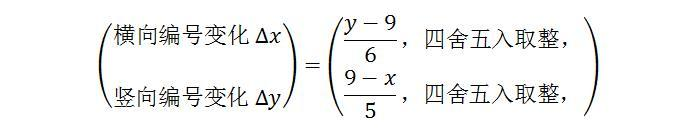

[3、决定论和非决定论](https://zhuanlan.zhihu.com/p/28532612)

*“The assumption of an absolute determinism is the essential foundation of every scientific enquiry. ”\***

***“所有科学问题的必需基础，是假定一个绝对的决定论”\***

***-- 普朗克\***

我们来简单聊一下决定论。

从现在开始，我会经常使用一个词，叫做“**系统**”。系统是什么呢？就是我们所想要研究的那个东西。比如说，我想研究一个原子的运动，那么我们就会把这个原子叫做一个系统。再比如说，我要研究一群在互相碰撞的桌球的运动，我就会把所有的这些桌球叫做一个系统。总之，系统就是我想要知道它运动状态的那个东西或那一组东西。

物理学家通常会吧整个宇宙划分为两个部分，系统和**环境**。所有那些我们并不关心它运动状态的，它在系统之外的，对系统造成影响，是系统运动的环境，统称环境。总之，环境就是宇宙中除去“系统”剩余的部分。

为何要划分系统和环境呢？因为我们所关注的任何一个问题，肯定不会把整个宇宙全部考虑进来，那样的话，我们会考虑得太多，以至于什么有意义的结果都不可能得到。我们只会考虑我们所关注的那一小部分物质。一个系统的划分，是根据物理学家做研究的方便而随意划分的，它没有客观的标准。对于系统而言，我们会分析它的具体运动状态，而环境，我们几乎全部忽略。这里的“几乎”两个字，指的是，我们不会去考虑环境的状态，而只考虑**环境对系统的影响。**

而把系统和环境分开的，叫做系统的**边界**。我们考虑边界，主要是考虑外界环境对系统的影响，也就是环境与系统的相互作用。这种相互作用，统称**边界条件**。

我们常说的**动力学系统**，指的是我们关注系统的动力学特征。也就是是，一个系统的状态，在一定规则的驱动下随着时间的变化。系统状态随时间的变化，又叫做“**演化**”（evolution）。

在科学研究学中，常用的一种系统叫做**孤立系统**。所谓孤立系统，指的是一个与外界完全隔离的系统，环境对它没有任何影响，即边界上与外界环境没有任何相互作用的系统。例如，由一个完全刚性的箱子包装的一箱气体。这个箱子完全密封、它完全隔热、同时，它屏蔽了外部所有的力的影响，那么，这箱气体就是一个孤立系统。

孤立系统是一种**理想系统**，它在现实中是不存在的。我们为何要关注一种不可能存在的系统呢？因为，就像前言中所述的，所有的物理定律，全部都是在忽略了次要细节的前提下被总结出来的。理论上讲，任何一个系统，都与环境有剪不断的联系，但是当我们研究这个系统时，如果我们考虑所有这些联系，就必然会把整个宇宙牵扯进来，那么我们就什么都干不了。比如说，当我们在关注桌球上一个小球的运动时，我们肯定不会考虑远处月亮对它的万有引力，因为它太小了，考虑多了没有意义。并且，如果我们考虑月亮的引力，要不要考虑其它所有星球的引力？要不要考虑所以旁边趴着的一只蟑螂对它的引力？这就没完没了，研究一个桌球就需要考虑整个宇宙了。我们会设计这样一种系统，把外界的影响力减至最弱。相对于我们所关注的东西，这些影响就可以忽略掉了。**孤立系统一直以来是物理研究中最有用的理想模型之一，**但是在后面我们会看到，这种思维造成了很大的误区。

现在我们来看，一个系统它的历史是怎么演化的，它的未来又会怎样？

我们常说，一个系统沿着“某一条历史轨迹”变化，我们可以用一条曲线来直观地表示它的整个演化过程（这条线叫做演化轨迹，我们后面将会不停地用这样的线来表示系统演化）。如下图所示。这条曲线上的任意一点，代表了系统在一个特定时刻的状态。这条曲线以t=0时刻为分界线，它之前的是历史，它之后的是将来，而t=0时刻就是现在。

从现在这一时刻向历史看去，系统的每一步都是确定的（也就是说**我们有一个确定的历史**，这似乎是一句废话，难道它会有几个不同的历史吗？我们可以后面再来看这个问题）。也就是说，系统沿着一条确定的历史轨迹演化而来。同理，我们也会不假思索地同意，**系统有一个唯一的现在**（我们常说“真相只有一个”！你能想象一个桌球有好几个不同的现在吗？）。那么，它的未来呢？它将走向何种路径？是与历史一样，也是一条确定的轨迹，系统将沿着这一条路走到黑？还是说，它的未来会有各种可能性，它的未来之路有各种分叉口，系统将来在每一个分叉口将会“自由地”或“随机地”选择一条轨迹？

决定论的争议，也就集中在这一点：**系统的未来是不是一条确定的轨迹**？

我们先来看看物理学中怎么考虑这个问题：

前面曾经提到，经典力学是以牛顿三定律为基础的。你将来在学习物理的时候，第一个学的，就会是牛顿第一定律。我这里先不细说。我们先忽略掉牛顿定律本身，只来说一下以它们为基础最终得到的描述系统的方法：它是通过一种叫做**微分方程**的数学工具来描述的。这里我不会向你讲具体的经典动力学方程是什么样子，但是我可以告诉你，它有这样的一种形式： 

上面这个微分方程中，S表示的是系统的状态，它可以是很多个变量组成的一个变量组[[1\]](https://zhuanlan.zhihu.com/p/28532612/edit#_ftn1)。什么是状态呢？我们直观来想，状态包括这个系统的位置、大小、形状、冷热、颜色、它的运动快慢，等等。但是，归结到底，这些形状，全部都可以由两个性质决定，即**位置和速度**。例如，大小和形状，说的是这个系统的每一个构成部分的位置，冷热，说的是组成它的分子原子的运动速度，颜色，说的是它发出的电磁波频率，也是由组成它的原子内电子的位置和速度决定的，等等。所以说，一个系统的状态，包括了这个系统每一个组成部分的位置和速度[[2\]](https://zhuanlan.zhihu.com/p/28532612/edit#_ftn2)。那么，我们可以把状态用这两个性质来定义：

S≡（位置，速度）；

方程左边，S上面加上一个点，表示的是S的变化速率，它指的在单位时间内S的变化量，它包括了状态变化的方向和快慢，它也叫作状态的变化率。比如说，当我们用系统的位置表示它的状态时，这个变化率表示的就是它位置变化的方向和快慢 – 那就是速度[[3\]](https://zhuanlan.zhihu.com/p/28532612/edit#_ftn3)。方程的右边，g(S)，指的是对S进行的一种运算，g是运算规则，S则是被运算的对象。g(S)可以是S所包含的不同变量之间的相互加减乘除，或者是更复杂的（例如偏微分方程等）。不论如何，当我们已知一个确定的状态S时，我们就可以根据g所定义的规则，对S进行运算，得到的数值，就是S的变化率，包括S变化的大小和方向。

这个微分方程所告诉我们的，基本上翻译成你能听懂的语言，是这样的：

**一个系统某一时刻状态的变化，（在边界条件确定的情况下）是由此时它的状态唯一确定的。[[4\]](https://zhuanlan.zhihu.com/p/28532612/edit#_ftn4)**

简言之，就是“状态”决定“状态如何变（状态变化率）”。

为了向你说明这个微分方程如何决定了一个系统的确定的未来，我们来玩这样一个游戏。我们拿一个围棋棋盘，然后在横竖两个方向上每个格子都编上号，如下图所示，那么，每一个格子都可以用一组唯一的编号来表示，用第一个数字表示横方向的编号，第二个数字表示竖方向的编号。例如，最左下角的格子，编号就是（1,1），而最右下角，就是（1,18）。我们把一个棋子放入格子中的话，这个棋子的位置就可以用这组编号表示。

这样一来，一个棋子的位置和一组两数的编号就是完全等价的。一个位置对应一组编号，而反过来一组编号就确定了一个位置。如果这个棋子在棋盘的格子中间可以移动，相对应的，棋子位置的变化就是它的编号的变化。例如下图中，棋子的位置是（9,12），它向（11,13）移动。这个移动导致了横向编号变化了2，竖向编号变化了1，也就是它的编号变化了（2,1），这既是它编号的变化，也是位置的变化。

反过来，如果我们想按照一个特定方式移动一个棋子，我们也可以通过规定它编号变化为（△x,  △y）来规定这个移动的大小和方向：这个编号的变化就决定了棋子的位置变化（移动方向和移动距离）。对棋子的操作完全等效于对棋子编号的操作，而棋子的移动规则就完全可以表示成棋子编号的一种运算。那么，现在我们这样来规定这个棋子的移动：我们把这个棋子的两个编号做两个运算，横向编号和竖向编号的变化分别由这两个运算决定。正如前所述，编号的变化就决定了棋子位置的变化，也就是它移动的方向和距离。比如说，我们设横向的编号用x来表示，竖向的编号用y来表示，我们规定棋子的运算规则是这样的：

根据这个运算规则，我们就可以得到棋子位置编号的变化。例如，如果棋子出现在（5，13）这一个格子中，我们就可以得到： 

也就是说，棋子运动的方向导致在横向编号加1，竖向编号加1，也就是说，它会向右运动1格，向上运动1格： 

再比如说，如果棋子出现在（13,14）我们计算出它的编号变化为（1，-1）我们计算横向的编号变化为1，即向右跳了1格，竖向的编号变化了-1，即向下跳1格： 

如此这般，对于每一个格子，我们都可以根据这个运算规则，知道它该如何向下一格移动。

很明显，不论这个棋子放到哪一个格子中去，我们的计算规则都可以给出一个明确的移动方向：向左还是向右？向上还是向下？移动几格？

既然每个格子都有明确的移动方向和距离，我们用箭头来把每一个格子中棋子应该移动的方向和距离画出来（棋盘中间有若干个圆圈，意思是，根据我们的运算规则，这几个格子中棋子移动为零，也就是不动）：

那么，当我们把棋子放入棋盘的某个格子时，我们就可以根据棋盘上的箭头，来移动这个棋子。那么很明显，不论我们把棋子放入哪一个格子，它该如何移动都是确定的（比如图中蓝色的路线，表示的从（7,12）出发的棋子未来移动的情况）。而这个确定的移动将会使棋子进入到下一个确定的格子，这个格子的移动规则仍然是确定的，以此类推，这个棋子未来的行走路径也就是确定的。只要我们知道了棋子放入哪一个格子，我们立刻可以知道棋子后面的每一步该怎么走。

在这个例子里，一个棋子放入棋盘，它的状态就可以用它所在的格子的编号来描述，而它状态的变化，就可以用这个格子出发的箭头来描述。我们看到，一个格子出发的箭头（状态的变化）是由这个格子的编号（状态）来确定的。由此，不论这个棋子最开始放入哪一个格子（初始状态），它后续每一步（未来的演化）都是确定的。

我们用这个棋盘游戏来类比一下一个粒子的运动，粒子的状态（位置，速度），可以类比成为棋子的状态（横编号，竖编号）；一个粒子状态的变化可以类比成相应格子里出发的箭头。那么，对于以微分方程所描述的粒子运动规则：

*粒子状态的变化，由粒子状态决定；*

和这个棋盘中的棋子运动规则：

*棋子所在格子的编号变化，由格子编号决定；*

这两者是一样的。我们已经看到，棋子在棋盘中的移动路线是完全确定的，因而，我们也可以推知，粒子的演化路线也就会是完全确定的。

当然，和棋盘不一样，一个粒子的状态变化是连续的，而棋子的变化则是离散的。但是它们的原则没有什么不同 –  我们可以把棋盘的格子不断加密，它每一格的尺寸不断变小，就可以逼近一个连续的状态。在这个由无限细密的（位置，速度）格子划分的连续的“棋盘”里，每一个点都由这个点的状态确定了一个出发的箭头。与棋盘一样，每一个点出发，都会有一个确定的变化轨迹。

上面这个图其实是一个非常典型的物理过程，叫做“Van der Pol震荡”。这张图，就叫做相图， 

**我们可以看到，在这种类型的微分方程所描述的变化过程中，未来状态没有任何不确定性，只要现在状态已经确定了，我们就可以确定以后每一个时刻的状态，全部都是确定的：我们向历史回溯，是一条确定的轨迹，我们向未来展望，它仍然是一条确定的轨迹（未来是唯一注定的）。这就是决定论的核心。**

现在我们来看看决定论式的演化和非决定论式的演化的区别。下图A是一种非决定论的演化方式。系统从一个初始点1演化的过程中，由于一种非决定论的机制，它可能”向2，2’，或2”不同的方向演化。完全“自由”地，它“选择”了2，而这种选择是完全不可预测的，随机的。然后系统依次向下演化，最终到达5。系统经过多次，甚至时时刻刻的随机性选择。那么，人们在确知初始状态1的时候，并不可能知道它最终走向哪里 ，**我们重复一次实验，它的结果就可能完全变了 – 它的未来是“不定”的。**而B是决定论的演化方式，任何一点1，必定沿着精确的轨道走向2。**不论我们重复多少次实验，它总是沿着完全相同的轨道一次次重复这个历程。**而系统其它所有的初始点也都有着同样的行为。在决定论的演化过程中，演化必定是沿着一条道走到黑的，不容许有一点选择余地。两条轨迹既不可能相交，一条轨道也不可能分叉。因为一旦系统演化至分叉点，它将面临着“自由”选择的未来，而不是由方程唯一决定的未来。

**我们看到，决定论的演化，它的轨迹就是一条孤独的线，既不分叉，也不交叉，我们只要找到了这条线的一头，就一定能捋着它找到另一头，中间毫无其它可能性。**

**这是经典力学定律的必然结果，毫无商量的余地。** 

**上一篇：**[2、精致冰冷的还原论](https://zhuanlan.zhihu.com/p/28526739)

**下一篇：**[4、抛硬币和概率性](https://zhuanlan.zhihu.com/p/28551569)

**专栏：**[魔鬼眼中的自然界](https://zhuanlan.zhihu.com/c_116602381?group_id=884931161871237120)

*[[1\]](https://zhuanlan.zhihu.com/p/28532612/edit#_ftnref1) 数学中称为“向量”*

*[[2\]](https://zhuanlan.zhihu.com/p/28532612/edit#_ftnref2) 在物理中，一般描述运动状态的是“位置”和“动量”两个变量，而不是位置和速度。你现在还不知道动量是个什么概念，在经典物理性质，动量就是一个物体质量和速度的乘积。在本书中，提到经典物理学，我们可以把动量和速度看做一回事，不加以区分。*

*[[3\]](https://zhuanlan.zhihu.com/p/28532612/edit#_ftnref3) 位置变化率，就是速度，而速度的变化率，是一个叫做“加速度”的物理量来描述的，它说的是一个物体的速度，在每秒钟增加或减少了多少。*

*[[4\]](https://zhuanlan.zhihu.com/p/28532612/edit#_ftnref4) 事实上，绝大多数物理定律最终的数学形式都是这样的。具体到牛顿定律，牛顿第二定律断言，系统的加速度与它的受力成正比。而受力则是由粒子在力场中的位置和速度决定的，因而，系统的加速度由位置和速度决定：* 

*写成向量函数的形式，就是*  

*其中S为状态变量  （r, v）。*

发布于 2017-08-15

编辑于 2017-08-28

