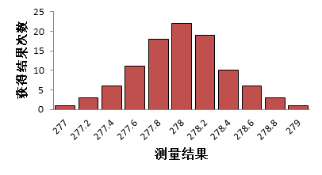
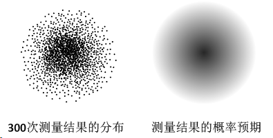
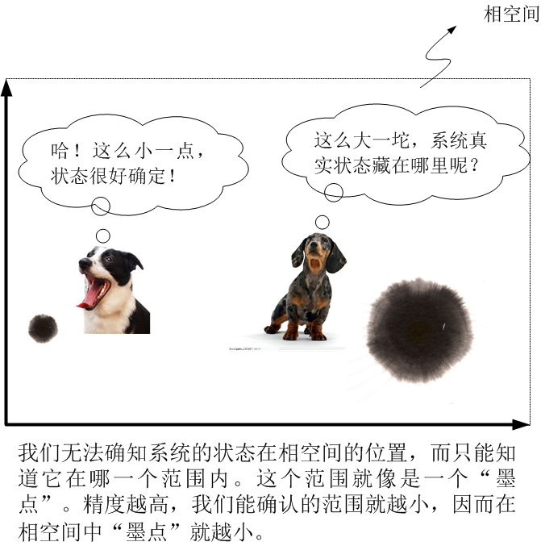
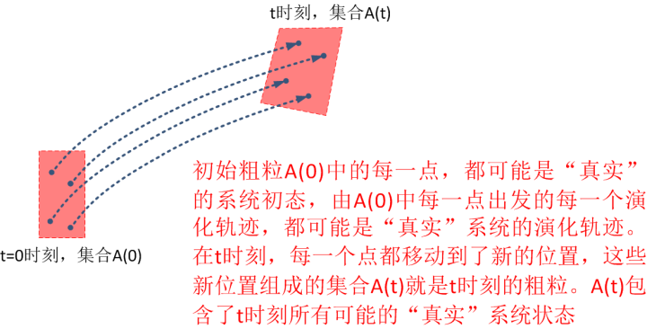
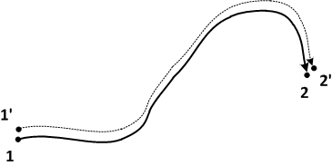
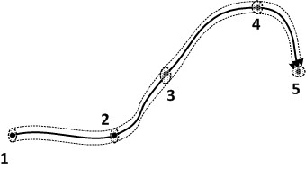
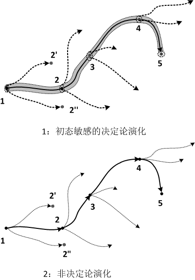

[6、用“几何观”看不确定性](https://zhuanlan.zhihu.com/p/28559144)

**“As far as the laws of mathematics refer to reality, they are not certain;  and as far as they are certain, they do not refer to reality.”**

**“当数学论及现实的时候，它们不确定；当数学确定时，它们不涉及现实”**

**-- 爱因斯坦**

现在，我来问一个问题，一个系统的状态是相空间中的一个点，那么，对于一个不确定的状态，或者说一个“大概”的状态，怎么表示？

这其实是一个很关键的问题：我们对任何一个系统的观察都是有**精度**的，而不可能做到100%准确。根据我们的观察精度不同，我们就只能在一定的范围内模糊地认知一个系统。因而，我们所认知的系统状态也不是一个精确的状态，而是一片模糊的范围。

比如说，我们用一个±1毫米精度的刻度尺测量一个粒子的位置，那么我们对这个位置的测量误差就会在±1mm之间。当我们得到一个粒子的位置为278.0mm的时候，我们并不确定这个粒子的真正确切的位置，而其实我们真正知道的是，我们有100%的信心确知这个粒子的位置位于277~279之间的某处，但是在这之间位置到底在哪里？我们并不能完全确定，因为我们最后一位小数是估读的。

例如，我们进行了100次独立的测量，每次测量的结果会有所不同，它的一个可能的分布大致如下：

我们可以根据这个测量，得知粒子所处的位置的**概率**。这个图示，粒子在278mm这个位置是具有最大概率的。但是，在[277, 279]这个区间中，每一点都是有可能的，区别只是可能性大小不同而已。

同理，对于一个系统，当我们对它进行测量，得到一个它状态的结果，也有同样的不确定性。当我们说，“系统的状态为A”的时候，其实有很多隐含的意思并没有说出来。假使我们测量的精度为a，那么，“系统的状态为A”的严格含义其实是：“系统的状态在A-a与A+a之间的某处”。

我们已经知道，系统的每一个确定状态，对应着一个确定的相点。那么，这样的一个模糊状态，对应着什么呢？是“一团”模糊的点。而一个系统模糊的变化历程，对应的就是一条模糊的曲线。什么是模糊的点，什么又是模糊的曲线呢？

直观来讲，你可以想象一幅画，里面的每一条线条，都是用非常细的铅笔画成的，那么这个图形，就看上去非常锐利和清晰。如果每条线都是用很粗的铅笔画成，那么它就会显得很模糊。在用几何观考虑动力学的时候，也是这样符合直觉的，一个细小的点，一条锐利的线，表示的就是很确定的状态和它的变化，而一个很粗的点，和一条很粗的线，表示的就是不确定的状态和它的变化。下面我来具体说明一下：

你可以想象一下，对某一个系统，我们对它的状态进行多次测量，每次测量都是一个确定的结果，我们把这个结果对应的状态点标记在相空间里面。由于测量的误差，每次测量的结果都会有一个小小的偏差，因而，每一次我们得到的状态点的位置都会有所偏移。如果我们忘掉以前测量的结果，继续不停地做出测量，然后把每次的状态点都标记在相空间里面。我们就可以得到一个很多个点在空间中分布的图，如下图左边，是一个300次测量点放在一起的图形。这些点究竟哪一个才是系统“真实”的状态呢？我们是不可能知道的，因为每个点都是一次测量的结果，而我们每一个测量结果都不可能做到完全“准确”。我们只能推测，这些点钟的哪一个点更**可能**是真实的状态。很容易理解，空间中出现的点越密的地方，就更加可能是这个系统的“真实”状态，而出现的点越稀，则可能性就越低。还记得我们前面讨论的抛硬币吗？当我们做出很多次测量时，测量结果的“稀疏”和“致密”程度，就体现出真实状态出现的概率大小。所以，我们根据这300次测量，我们可以预期，这个系统的真实状态出现在哪里，以及出现在这个地方的概率是多大（如下图）。

在上面的例子中，这个系统的真实状态在一个区域的中间某处，越靠近中心的位置，可能性越大，越靠近边缘，可能性越低。系统的状态已经不是一个点，而是一团“云”。“云团”所覆盖的体积，就是系统状态可能出现的范围。“云团”越稠密的地方，系统状态在此处的可能性越大，反之越小。我们可以把这团“云”叫做“概率云”。

形象一点，你可以把每一个确定的点想想成为一个削尖了的铅笔画成的点，而把这团模糊的云想象成为一个“粗铅笔”画出来的点，或者是宣纸上氤开来的一个墨点。这个“墨点”所覆盖的范围，就是系统状态可能的取值范围。这个系统所有可能出现的状态中，每一个状态对应一个相点，而这些相点的集合（点集），就是这个墨点。在物理中，我们把这个墨点形象地称之为**“粗粒”**。相对于“粗粒”，我们把一个确定的状态点叫做“**细粒**”。

所以我说，**理想的一个确定状态是一个点，但是，现实中我们所能辨识的状态，是一个粗粒。**

一个粗粒包括了所有可能的系统状态，我们只知道系统的状态在这个粗粒当中，却不知道在这个粗粒中的哪一个部位。因而它是不确定的，我们的精度越高，我们就可以把这个可能的范围缩得更小，因而就得到一个更小的粗粒。反之，精度越低，我们就得到一个更大的粗粒。粗粒的体积叫做**“相体积”**。相体积的大小，就说明了系统状态的确定性。体积越小，确定性越高。

用一个粗粒，来表示一个系统的可能状态分布，就会给我们带来一些新的问题。与细粒相比，粗粒有很多新的性质：

- 细粒是一个点，没有大小，而粗粒是一个区域，有大小和体积；
- 细粒没有形状，而粗粒有形状；
- 细粒是一个确定状态，而粗粒是无限多个相互靠近的状态的集合。

那么，这里我们来考虑一个问题，我们对一个粗粒，怎么来对它未来的演化做出预言？

既然粗粒是无数个状态点的集合，我们就需要考虑所有这些点未来的演化。每个点代表了这个系统的一种可能状态，我们必须要针对每一个初始状态来计算它的未来演化轨迹。这样这些轨迹中必然有一条是“真实”的演化轨迹。我们把粗粒用集合的形式表示：

粗粒={状态点1，状态点2，状态点3，……}（无穷多个状态点）[[1\]](https://zhuanlan.zhihu.com/write#_ftn1)

那么，粗粒的演化，就是每一个状态点演化的集合。也就是说，在相空间中，所有这些相点都在移动，那么这个粗粒表现出来的就是这些相点的“组团”移动。由于每个相点移动的方向和速度会有所不同，表现出来的，就是这个粗粒在平移的过程中，还会伴随着不断的形变（拉伸、压缩、扭曲、等等等等）。关于粗粒在相空间中的移动过程，你可以想想成为一滴油在水中的移动过程：油滴是由内部的无数个油分子组成，每一个分子自身都在发生移动，它们的“组团”移动，就构成了油滴的整体移动。

一个自然而然的想法就是：既然一个确定的系统状态演化轨迹是由状态点“点动成线”得到的，那么，一个以粗粒表示的系统状态的演化，就是“粗点动成粗线”。或者说，“粒动成绳”。

这里，我用了“绳”来比拟一个粗粒的演化轨迹。“线”和“绳”有何区别呢？与细粒和粗粒的区别相似，“线”“绳”的区别有：

- 线没有粗线，而绳有粗细和也有截面积；
- 线的没有形状，而绳有形状（圆绳、扁绳等等）；
- 绳是无数多条线相互编制在一起形成的“线簇”。

我们知道，一个粗粒中包含了无数个状态点，而从每个状态点出发，未来都会有一条唯一确定的演化轨迹线，这些线互相绝不相交，也不会分叉。这些轨迹线聚集在一起，就是我们所说的“绳”（线簇）。

假如说我们现在要预测一个系统的未来轨迹。对系统的现在状态，我们只能在粗粒的范围内辨识，而系统的真实状态隐藏在这些状态点当中，超出了我们的辨识范围。因而对系统的未来预测，我们也不知道这条“绳子”中的哪一条线会是系统真实的演化轨迹，我们就只能用这条绳子的走向来大致知道系统真正轨迹线的走向。

这里我们必须知道的是，我们用一个粗粒来描述系统的状态，它的含义是，这个粗粒包含了所有的系统可能状态，而我们不能确切知道这个状态在哪里；但这并不是说系统状态本身在相空间中就是弥漫开来的一团（这意味着一个系统同时具有多种状态或具有不确定的状态！这在经典物理图景中显然不可能）。因此，当考虑到我们**对系统认知**的不确定性时，它的演化不再用**相点**和**轨迹**来描述，而是用**粗粒**和**轨迹簇**来描述了。这不表示系统的状态本身不确定，也不表示系统的未来是不确定的。事实上，从每一个确定的状态出发，都有一个确定的未来。系统的状态是粗粒中的某一点，系统演化的轨迹是轨迹簇中的某一条。至于在哪一点？那一条？抱歉，我们老眼昏花，只知道它存在，但不知道它在哪儿。

比如说，相空间中的两个点，分别代表状态1，和状态1’。这两点非常靠近，但是在我们看来是不可辨的，它们之间的区别超出了我们的观察精度。由于观察精度所限，我们“误以为”，它们的状态是相同的，即使有所不同，也不是我们所能觉察到的。这两个状态演化历程，从1和1’出发，必定也会有所不同。由于两者十分接近，我们姑且认为，它们的轨迹应该会保持接近的状态（如下图，前者演化一段时间后变为2，后者变为2’）。而这两条相互靠近的轨迹线，也是我们无法区分的。

那么，在初始点1附近的一个粗粒中的所有点，都与1’一样，它们与1的区别都超出了我们的辨识能力。同理，这些点中每一点出发的演化轨迹，我们也就无法区分。这些点汇合成的线簇，就是我前面说的那条“绳子”，如下图1所示。我们只知道真实的轨迹（类比于编成绳子的一条纤维）在绳子当中，但是我们无从知道它在绳子中的那个地方。由于我们的分辨率太低，我们只能看到这一整条绳子，而编织成这条绳子的每一条纤维，我们看不到。在我们的肉眼凡胎下，我们分不清这条绳子的精细结构，我们觉得，这条绳子的走向，就是系统轨迹的走向。

这条绳子有多粗？这是由我们的观察精度所决定。我们的精度越高，我们能够分辨的绳子就越细。我们可以跟踪大概的轨迹，但是我们永远不能精确跟踪到那一条“真实的”精确轨迹，只能不断逼近它。

到此为止，我们的感觉仍然良好：一条绳子的演化，和一条线的演化，似乎也没啥特别不同，不过是一条粗一点的线而已嘛。其余都一样！

但是，这里有很多复杂性我们还没有看到。最重要的，与状态点相比，粗粒在动的同时，自己也会发生形变：他可能会膨胀、缩小、扭曲等。同时，与轨迹线相比，“绳子”也就会很不一样，它可能一会儿圆，一会儿扁，等等。

考虑这样一种情况，我们想象一下，假如一根绳子散掉了，然后它的每一根纤维杂乱地散开，那么，我们再来看这条绳子，它是分叉的。由于我们的分辨率所限，我们分不清绳子和线，所有我们就把“绳子”的分叉误以为是“线”分叉了。而轨迹线分叉意味着什么？就是系统的未来面临着不同的选择，它的未来不再是确定的了！

虽然理论上，我们沿着绳子中一根纤维都能确切找到它唯一的走向，但是从整根绳子的一头出发，我们就面临着后面不同的走向。相应地，虽然决定论的物理定律告诉我们，一个系统只有唯一的未来，但是在我们的“老眼昏花”看来，它的未来却面临着各种选择。

下图1表示了这样一种情况，它发生系统的走向相对于初始位置极端敏感的情况下（在这种情况下，两个相距很近的相点，也会演化出完全分离的轨迹）。系统从点1开始演化，由于我们的观察精度，我们只能分辨出包含了这个点的一个范围，它包括了无数种可能。当系统向2演化的时候，在我们分辨率所能锁定的初始范围之中，三个不同的起点，它们相邻非常近，只是略微偏离了一点点，以至于我们误以为它们是同一个点。但是它的轨迹可能就走向了2、2’或2”。它向2，2’，2”这三个方向的演化都是确定的轨迹，但是并且沿着1向5演化的整个过程中，中间任意一点都有这样的性质，即它旁边非常接近的一点会走向完全不同的道路。虽然在整个过程中，每一个轨道都是唯一的，没有任何分叉，但是由于我们精度的有限性，我们就觉得系统在不停地分叉分叉，系统的未来面临着无数种选择，因而绝难确定系统的走向。
这看起来非常像我们前面讲到的非决定论演化方式（图2）。除非我们有无限精度，否则，图1就与图2的表现非常类似：我们无法确定它的未来走向。区别就是前者是决定论规则下的演化，而后者是非决定论规则下的演化。这里就出现了一种决定论规则所确定的，但是表现出一种貌似随机的行为。

上一篇：[5、用“几何观”看世界](https://zhuanlan.zhihu.com/p/28557211)

下一篇：[7、茶杯与甜甜圈之辨](https://zhuanlan.zhihu.com/p/28566895)

专栏：[魔鬼眼中的自然界](https://zhuanlan.zhihu.com/c_116602381?group_id=884931161871237120)

*[[1\]](https://zhuanlan.zhihu.com/write#_ftnref1) 事实上，在考虑这个粗粒的演化时，我们是在同时考虑无数个独立的系统。粗粒中的每个相点定义了其中的一个确定的系统。而对这其中的每一个确定的系统，我们就可以根据动力学方程方便地做出计算和预言。*

*这些系统并不真实存在，而是我们为了理论出来的方便想象出来的。所有这些系统的集合，被称作“系综”。此时你并没有必要深究，所以我只做一下说明。*

*一个系统的状态对应于相空间中的一点，相应地，与粗粒相对应的，是系综。*

*系综是统计力学中的最核心概念之一。*

发布于 2017-08-16

编辑于 2017-08-28