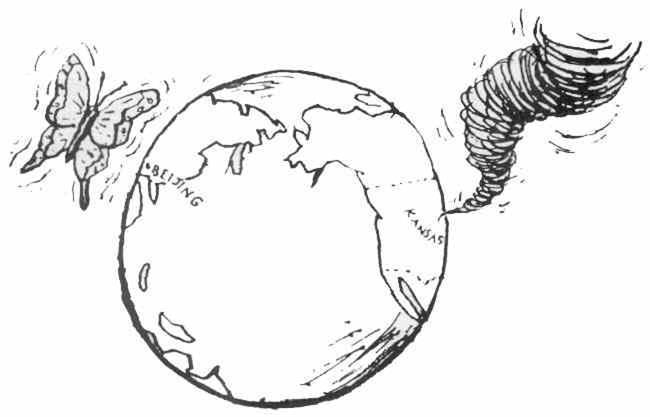
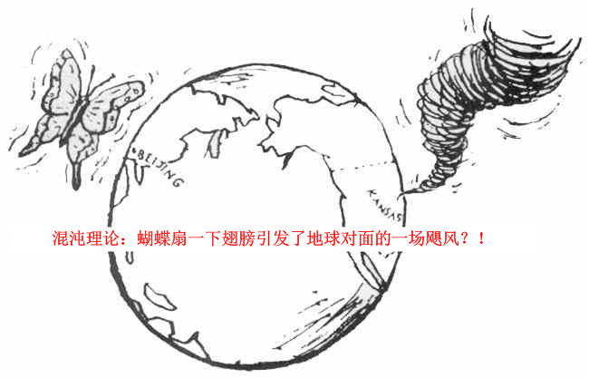
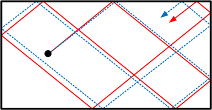
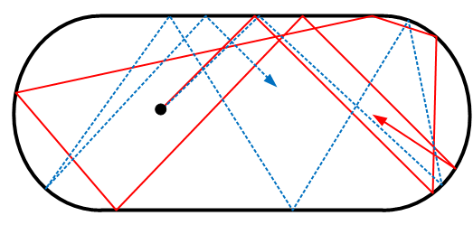
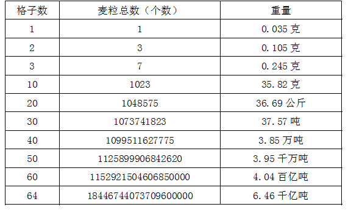

[8、指数发散和蝴蝶效应](https://zhuanlan.zhihu.com/p/28570511)

***“One meteorologist remarked that if the theory were correct, one flap of a  sea gull's wings would be enough to alter the course of the weather  forever. The controversy has not yet been settled, but the most recent  evidence seems to favor the sea gulls.”\***

***“一个气象学家这么评价：如果这个（混沌）理论是正确的，那么，一只海鸥忽闪一下翅膀，就足以永久地改变天气走向。这里的争议尚未完全平息，但是最新的证据显然更加支持这个海鸥”。\***

这句话，就是Lorentz在他混沌理论的开山之作中提到的，它形象地把系统对初始条件极端敏感的现象用大众熟知的方式类比出来了。后来，在其他的演讲当中，他吧海鸥换成了更加富有诗意的蝴蝶。再后来，Philip Merilees 发表了一篇论文，题目叫做“**巴西某个蝴蝶闪动一下翅膀会引发德克萨斯的一场飓风吗？**”。至此，人们所熟知的“蝴蝶效应”就正式登入了科学史册。

很多影响巨大，甚至足以开辟或颠覆一个领域的科学理论，作为一个科学议题，它的知名度却只是局限于一个非常小的科学家圈子里，这包括了很多对科学有重大意义的理论。这些理论都是极具颠覆性而且极富争议的，但是广大吃瓜群众对它们毫无所知也毫无兴趣。但是如果把它们以一种娱乐形式的类比表达出来，或者是冠以一种富有戏剧性的名号，它就很快吸引到大量的眼球，并迅速普及开来。比较典型的包括薛定谔猫、多世界理论，还有本文的论题拉普拉斯之妖。如果没有薛定谔猫的论述，人们绝不会对量子力学产生如此巨大的兴趣，没有平行宇宙的话题，多世界理论也不会获得大家的关注，同样，没有拉普拉斯之妖，人们就不会对决定论产生如此浓厚的兴趣。蝴蝶效应也是这样一个典型的例子。如果没有蝴蝶闪动翅膀引起飓风的论述，人们根本不会知道混沌原理。

但是我不得不说，给科学理论赋予戏剧化，这是一柄双刃剑，它的确能够迅速地把一个理论普及开来，同时，普及开来的理论因为被被赋予了太多的戏剧性，因而理论的普及往往伴随着误解的扩散，普及开来的理论已经与原本严肃的理论大相径庭了。比如说大家津津乐道的“超光速时可以返回历史”这类话题，是相对论普及的结果，但是它却是反相对论的。

这里，我想说的是，大家惯常所理解的蝴蝶效应：蝴蝶闪动一下翅膀导致了一场飓风，是错误的。

蝴蝶效应所表达的，并不是说蝴蝶的翅膀，在经过了种种戏剧性的路径后，最终不可避免地导致一场风暴。蝴蝶的翅膀其实与德克萨斯的风暴没有任何直接的因果关系。这个类比真正的含义是说，如果我们想精确地预测两周后的一场风暴，我们现在所需要获知的的信息，必须要细致到每一个微小的变化，哪怕是像一个蝴蝶的翅膀这么细致。或者说，如果我们有两个完全相同的世界，其唯一区别在于一个世界里某只蝴蝶没有闪动翅膀，而另一个世界里蝴蝶闪动了一下翅膀，那么两周后，这两个世界里气象的差距将是宏观的，颠覆性的。

这里说，是**系统演化对初始条件的极端敏感**。

我们知道，系统未来的演化路径是由它现在的状态（初始条件）决定的。那么，不同的初始状态，未来演化路径不同，我们一般认为，初始状态越一致的，未来演化路径就会越接近。两个非常接近的初始状态，它们未来的演化路径会非常接近。但是蝴蝶效应告诉我们，实际上并非总是如此。有时候，两个非常接近的初始状态，未来演化却在很短时间内变得分道扬镳，完全不同了。比如说我们仍然用桌球作为一个例子，比如说，一个长方形的球桌，一个小球以少许不同的角度开出，经过一段时间以后，它们的路径显示，基本上比较接近，这里，初始条件的小小差异，引起的路径差异也很小，这就是系统演化对初始条件不敏感。

但是，当我们换成一个两面弧形的，类似运动场形状的球桌，情况就会大相径庭。我们发现，桌球只在开始的一小段时间内路径大致相似，很快就完全不同了。这就是系统演化对初始条件敏感。

所谓系统演化对初始条件的极端敏感，意思是说，两个初始条件极为相似的系统，演化过程中也会在极短的时间内路径完全不同。这种初始条件的差异可能细小到我们完全无法分辨，但这样也毫无用处，**只要存在一点差异，就会导致演化路径的完全不同**。

正是由于系统对初始条件的极端敏感，我们要想准确预测一个系统的未来，我们需要极端精确地知道这个系统的初始状态，否则我们的预测将在极短的时间内就会完全失败。这个精度要求达到了变态的程度。并且，由于系统误差是以指数速度被放大的，这意味着，如果我们想要增加对系统有效预测的时间长度，那么每一秒钟的预测都需要我们增加一个数量级的精度。这个误差的放大系数被一个叫做Liapunov 指数的指标所表征的。这个指数越大，意味着误差放大的速度越快。

这里提到了指数放大，指数是一个你很快就会学到的数学运算。关于指数，很多人都知道有着恐怖的放大能力，但是，往往大家对它的感性认识并不强。这里有一个传说，就显示了指数放大的速度。

传说中，国际象棋是印度舍罕王的宰相西萨.班.达依尔发明的。他把这个有趣的娱乐品进贡给国王。舍罕王对于这一奇妙的发明异常喜爱，决定让宰相自己要求得到什么赏赐。

西萨并没有要求任何金银财宝，他只是指着面前的棋盘奏道：“陛下，就请您赏给我一些麦子吧，它们只要这样放在棋盘里就行了：第一个格里放一颗，第二个格里放两颗，第三个格里放四颗，以后每一个格里都比前一个格里的麦粒增加一倍。圣明的王啊，只要把这样摆满棋盘上全部六十四格的麦粒都赏给你的仆人，他就心满意足了”，舍罕王听了，心中暗暗欣喜：“这个傻瓜的胃口实在不算大啊”。他立即慷慨的应允道：”爱卿，你当然会如愿以偿的！”

那么，我们来算一算，舍罕王要给他的丞相多少麦子呢？大约30粒麦子重1克，我们按照平均每一粒麦子0.035克的重量的话：

我们看到，刚开始的10格中，放的麦子并不算多，加起来只有不到1kg，但是当放满20格时，就已经几十公斤了，当放满30个，就是几十吨，平均每增加10格，麦子总重量就增加1000多倍，当放满棋盘时，已经是6千亿吨的重量了。这在当时的印度国，相当于全国2000年的总产量！

所以，当记麦工作开始后不久，舍罕王便暗暗叫苦了，因为尽管开始的麦子很少，但是它增加的速度太快了！国王很快意识到，自己恐怕是兑现不了他许给宰相的诺言了！他的一句慷慨之言，成了他欠宰相的一笔永远也无法还清的债。 

正当国王一筹莫展之际，王子的数学教师知道了这件事，他笑着对国王说：“陛下，这个问题很简单啊，您怎么会被它难倒？”国王大怒：“难道你要我把全世界两千年产的小麦都给他？”这位教师说：“没有必要啊，陛下，其实，您只要让宰相大人到粮仓去，自己数出那些麦子就可以了。假如宰相大人一秒钟数一粒，数完这么多粒麦子所需要的时间，大约是5800亿年。就算宰相大人日夜不停地数，数到他自己魂归极乐，也只是数出了那些麦粒中极小的一部分。这样的话，就不是陛下不支付赏赐，而是宰相大人自己没有能力取走赏赐”。国王恍然大悟，当即下令召来宰相，将教师的方法告诉了他。西萨·班·达依尔沉思片刻后笑道：“陛下啊，您的智慧超过了我，那些赏赐……我也只好不要了！”

这个，就是**指数对一个微小数字的放大速度**。

粗略地说，一个自然指数大概每秒钟可以把误差放大2.7倍，而每10秒钟就可以放大1万多倍，而20秒钟放大倍数达到了接近5亿倍！如果我们认为我们的误差在100%以内都可以容忍的话，我们的观察精度在0.001%的情况下，我们可预测的未来时间约为11秒。如果我们提高观察精度，初始条件的误差精确到0.00001%，则可预测的未来为16秒。如果我们的精度达到0.0000000000000000000000001%呢？我们也仅能预测1分钟而已！也就是说，我们对未来的有效预测每增加1秒钟，所需要的观测精度就要增加一个数量级。以至于，如果我们希望对系统的未来在一个不算太短的时间内（几分钟）做出预测，我们连一丝一毫的误差都无法容忍。这个预测在现实中是不可能的。

为何会出现系统演化路径对初值极端敏感的情况呢？这是有数学上的原因的。简单来讲，就是我们所用到第3章那种形式的微分，它局部[[1\]](https://zhuanlan.zhihu.com/write#_ftn1)的解都是指数形式的。这就是误差为何会出现指数放大行为的数学原因[[2\]](https://zhuanlan.zhihu.com/write#_ftn2)。你现在肯定不具备这些数学知识，所以我们暂时就忽略不讲了。后面我会提供一个更浅显的解释。

暂时地，你只需要知道，这种误差的指数放大情形，除去几乎可以忽略的特例，是在每一个系统中**普遍存在**的。而我们说，指数速度是是极其**恐怖**的，因为它的扩大是数量级上的，而不是数值上的。它可以在短时间内把初始误差以数量级的倍数放大。例如，如果每一秒钟放大2倍的话，那么延续这种趋势，10秒钟就放大1000多倍，每一分钟就会放大1018倍，这是一个天文数字，甚至天文数字都不足以描述它，这种放大速度，意味着只有一个原子那么小的初始误差，在区区1分钟内就被放大到1000个太阳那么大！

所以说，误差差呈指数扩大的情况，就属于对偏差极端敏感。这种极端敏感的情形在在我们周围的几乎无处不在。这就使得我们不可能完成绝大多数的系统精确预测。

**系统演化对初始条件极端敏感，这就是确定性混沌理论的最基本特征。**

混沌在自然界中是如此的普遍，远远超出了人们平常所意识到的。我们所能用传统动力学“优雅”“简洁”地解决的问题，与混沌系统相比，直如凤毛麟角。可以说，混沌系统几乎统治了我们周围的一切现象。在一些很简单的问题中，例如三体问题（我知道你很喜欢看刘慈欣写的《三体》，那里面就提到了混沌的特征）、复摆、生态系统演化等低维度问题已经表现出强烈的混沌特性了，在高维度问题中，各个维度的Liapunov指数分布更广，混沌几乎是无法避免。

总而言之，混沌是一个普遍存在的，为大众所一致承认的现象，但是，混沌的具体定义却还没有达到为学术界一致认可的程度。

那么，为何会出现这种误差随时间以指数速度放大的情况呢？我们后面再讲。

上一篇：[7、茶杯与甜甜圈之辨](https://zhuanlan.zhihu.com/p/28566895)

下一篇：[9、我们这个反馈的世界](https://zhuanlan.zhihu.com/p/28573752)

专栏：[魔鬼眼中的自然界](https://zhuanlan.zhihu.com/c_116602381?group_id=884931161871237120)

*[[1\]](https://zhuanlan.zhihu.com/write#_ftnref1)  这里的“局部”含义指的是，在我们所关注的系统时空附近，具体讲，就是在极短时间范围内，它的运动状态变化非常小的情况。局部的指数偏离，并不意味着在广域上一直会指数偏离。虽然它在每一个状态的局部都保持指数偏离，但是偏离的方向会有所变化，这是非线性系统的性质决定的。当系统的状态偏离到很远时，它有可能会“折返”绕回到起点附近。*

*[[2\]](https://zhuanlan.zhihu.com/write#_ftnref2)事实上，对于非线性的动力学系统，根据Hartman &  Grobmann定理，在没有奇异点的时候，对非线性系统的局部线性化不会改变相空间的局部拓扑结构。因而在一个局部，用可以用线性微分方程来逼近非线性方程，而线性微分方程的解一律都是指数形式的。指数的大小取决于雅克比矩阵的特征值。*

*总的说来，特征值为正，则误差指数发散，特征值为负，则指数收敛，特征值为复数，则震荡发散或震荡收敛，特征值为虚数，则一直震荡。*

*对于高维度系统，具有天文数字个数的特征值，因此出现指数发散的情况几乎是不可避免的*。

