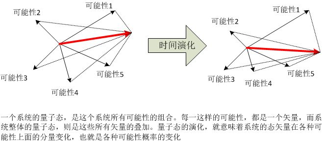
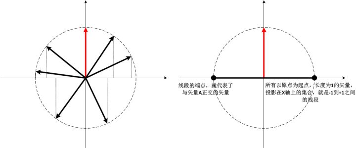
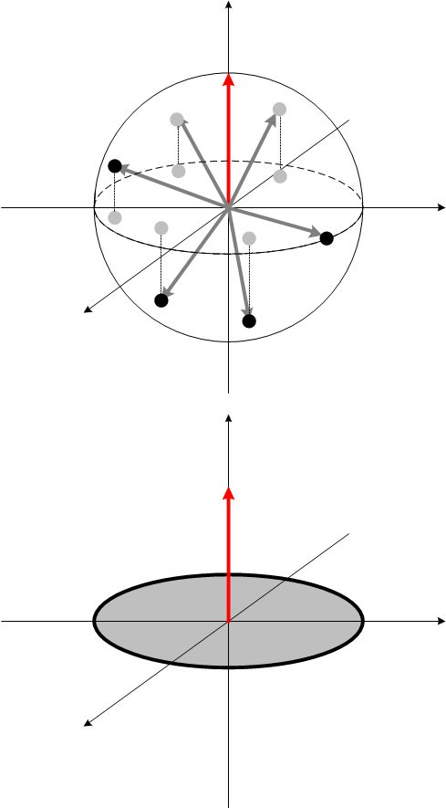
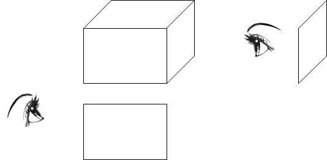
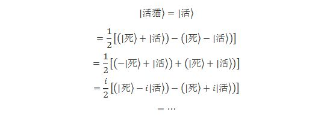

[多世界和“我们的世界”](https://zhuanlan.zhihu.com/p/33818762)

**“History has never been kind to people who put what they want over what the  equations want, and it won’t be kind to the MWI-deniers either.”**

**“历史从来就打脸那样一些人：那些把自己想要的置于公式想要的之前的人。这一次，它同样也会打脸那些反对多世界的人。”**

**–Scott Aaronson[[1\]](https://zhuanlan.zhihu.com/write#_ftn1)**

关于量子理论背后的“真实世界”，我在本章将谈论一个似乎是非常矛盾的理论。一方面，很多人（早期的玻尔、海森堡、以及后来的贝尔等其它大佬们）觉得这个理论极尽扯淡之能事，疯狂、荒谬、复杂无比、无法验证，完全不配成为一个科学理论，不值一哂；而另一方面，还有一批人（后哥本哈根时代很多已故的和现存的大佬们，John Wheeler、费曼、以及退相干理论的发起者Zeh、Zurek、量子计算的大神Deutsch等人，还有很多人认为霍金[[2\]](https://zhuanlan.zhihu.com/write#_ftn2)也支持它。），他们则认为这个理论极其简洁，是量子理论最自然最直接的结论，其揭示的深刻思想完全不亚于哥白尼当初在天文学中的革命。这个集诸多毁誉于一身的理论，就是多世界理论（Many Worlds Interpretation, MWI）。

事实上，多世界、或者由它衍生的平行宇宙，在科学界的话题热度还远远不及在科幻界。因为它真的非常符合科学幻想的特征：脑洞大开，极具颠覆性，比哈利波特更加奇幻，比古老的神话更加神秘。我想，这也是很多科学家们难以接受的原因之一，但是，如果你真的抛开那些不严肃的引申，只从量子力学的数学结构出发，你会神奇地发现，这个理论真的非常简洁，并且看上去从逻辑上、数学上，都是一个无法避免的必然结论。

我不知道你是否已经从科普书或者科幻小说中看到过一些关于多世界理论的描述。大众科普中关于多世界的说法，往往去掉了其中严谨的数学和逻辑，而更多地使用很多类比和戏剧化的语言，也更加注重与它的一些非同寻常的结论而不去谈论这些结论为何如此，这会让一般大众对多世界理论多多少少产生很多误解，而把关注点集中在它的那些看似神奇的部分，从而对它的印象也就停留在科幻的层面上。

前些日子，我买了一本书，多伊奇（Deutsch）写的《真实世界的脉络》（The fabric of  reality），你妈妈很不喜欢“正统”的量子力学诠释，而对这本书极其感兴趣。妈妈曾经跟我说，她和你提起过多伊奇的多世界观点 –  这是一个在多世界诠释道路上走得很远的一个人 – 你认为多伊奇的推理简直“帅呆了”。那么我就先从这些大众科普口中的多世界理论谈起吧。

我们仍然以那只倒霉的薛定谔猫为例。我们已经知道，按照“正统”的量子理论，这只猫在我们没有观察的时候，处于一种无法描述的“死”和“活”的叠加态。只有在我们对它进行观察的那一刻，它的状态才会突然“坍缩”，变成“死”或者“活”其中之一：我们的一个观察行为，造就了这只猫的“真实”状态。这让很多科学家感到发疯。而按照多世界理论的说法，根本就不存在“坍缩”一说，猫的“死”和“活”两种状态一直就和谐地并存着 –  并存于两个平行的世界中，与我们的观察无关：观察在其中并没有起到任何“造就现实”的作用。但是，在我们进行观察的那一刻，整个世界“分裂”了，它“分裂”成为两个分支：一个世界里面，猫死了，我们观察到猫死了，而倍感忧伤；而在另一个世界里，猫仍然活蹦乱跳，我们感到无比欣慰。死猫和活猫，忧伤的我们和欣慰的我们，都同时存在与两个分裂的世界中，并且这两个世界同等“真实”，并没有哪一个世界比另一个更加“实在”。更加神奇的是，这两个平行的世界互相之间毫无干涉，我们没有任何办法去获知那个与我们“平行”的那个世界的任何信息
–  对于我们而言，它就和根本不存在一样！虽然另一个世界中有一个和我一模一样、有着我的全部记忆和思想的我，但是我并没有任何办法感知那“另一个我”的存在。包括那个不可理喻的“分裂”，也是在我们毫不知觉的情况下悄悄发生的。因此我们根本就意识不到，当我们观察这只猫的时候，我们正在进行着一次“分裂”。

而这种分裂，发生在我们的每一次对外界的观察中：每一次观察，所有可能的观察结果都会发生—发生在互不相干的平行宇宙当中。考虑到我们无时无刻不在对外界进行观察，于是宇宙无时无刻不在分裂。所有**可能发生**的事件全部都发生了，只不过因为每个可能都发生在不同的世界中，我们只能看到诸多可能性的其中之一。

既然我们的世界无时无刻不在“分裂”，那么它所产生的世界的总数必然是一个天文数字。我们说，这个数字无比巨大，它到底有多大呢？我可以给你一个数字 – 当然这个数字其实没有什么意义，因为它实在是超出了我们的想象，对于它我们除了“巨大”很难领会它到底有多少个  –它大约多达10^10^77个。这个数字，我们可以说，几乎是无穷多 –  但它是有限的。它是1后面跟着10^80个零，如果我们用A4纸来把它写下来，每页A4纸可以写下1000个零，如果每10张纸厚度为1mm，那么写下这个数字所用的纸张数，填充到整个宇宙中，还不足以完成它的一个零头！ -- 这下你明白为何我说这个数字除了“巨大”我们无法想象了吧。

那么，又有多少个平行的“我”呢？当然“我”的个数不会是这么大，因为在很多这些世界中，“我”已经死了，而在更多的世界中，“我”压根儿就没有出生过，或者是人类就压根儿没有存在过。但是仍然，“我”的个数也是一个令人炫目的数字。想象一下，这么多个“我”平行存在，却又互相不认识，也不知道对方的存在。有些“我”现在是人生赢家，百万富翁，甚至是国王或皇帝，而另外一些“我”则贫困交加，是一个彻头彻尾的loser。

你觉得，这种说法，比起“意识使叠加态坍缩成确定的状态”如何？

更加荒谬？无稽之谈？我猜你可能会在脑袋中蹦出这几个词语。为何那么多的大科学家会整这么一出，仅仅是为了一个波函数坍缩的问题，就搞出来这么一大堆的“世界”？我们又如何解释这些世界、这些“我”、互不相干但是又同时并存？更大的问题是，我们如何实证这些世界？如果无法实证，那它仅仅是一个形而上学的思辨而已。难道这些问题，比起一个波函数坍缩来说，不是更麻烦吗？

是的，那么多天才的科学家并不是吃饱了撑的，无聊透顶后想改行当科幻小说家。实际上，如果我们真的去捋着逻辑线索走一遍，我们会发现，多世界理论，并非像看上去那么异想天开。很多大众对多世界的“过于荒诞不经”的观念，实际上是因为大家**把一些比喻的说法当真了**
– 这些比喻确实有助于帮助理解多世界理论的大致思想，但是千万不能太当真。

我们来看看“多世界”这个念头到底是如何产生的。前面我们知道，按照玻恩诠释，波函数 – 或者更普遍一点的，量子态 – 包含了一个量子系统所有的可能状态的概率信息（参见 [未竟稿：希尔伯特空间](https://zhuanlan.zhihu.com/p/29757742)）量子系统的全部状态，都完整地被量子态所描述，而量子态，则是这个系统的所有可能性按照概率幅的方式的一种叠加组合，而概率幅则对应着该种可能性所发生的概率 –  也就是说，波函数是系统所有的可能状态按照概率规则的某种组合。我们知道，系统的演化是由薛定谔方程所描述的，那么薛定谔方程描述的是什么？那就是这个系统所有的可能性它们每一种所发生的概率随着时间的变化。

按照“正统”的量子力学诠释，系统状态的演化，就是它所有可能性概率的演化。而波函数，不过是一堆概率的组合而已。当我们对这个系统做出观察的时候，这些概率就必须变成某种现实，这就是玻恩规则。也就是说，系统的所有可能性，现在必须要按照概率选择其一，而剩下的所有可能性，不论它的概率是多少，就同时消失不见了。但是当我们没有观察的时候，所有的这些可能性都同时并存。在这个时候，波函数所代表的，仅仅是一些概率组合而已。它不能按照传统的概率论诠释：它或者是可能性1，或者是可能性2，依此类推，反正它是其中之一。对量子力学而言，我们必须认为此时量子态仅仅是所有可能性的叠加。如果我们想要问：“此时，它的真实状态到底是哪一个？”这个问题时，但是玻尔说，对不起，你不能问它的“真实状态”，因为这毫无意义。一个没有被观察的系统何谈其状态？对玻尔和他的哥本哈根学派而言，叠加态揭示了一个形而上学的真理：“实在”只能在它被观察的时候才能成为“实在”。

这种强实证主义的看法，本身并没有那么令人难以接受，毕竟这种思想在哲学史上有着悠久的传承。但是问题发生在观察的那一瞬间：当我们没观察时，量子态是**一堆**概率，当我们观察的瞬间，它坍缩成**一个**现实。这就把“观察”置于一个极特殊的位置，如果按照冯诺依曼的引申，这就把“意识” – 进而把“我” – 置于一个极特殊的位置。这让绝大多数物理学家无法接受。这就是“测量问题”背后的最大问题。

这时候，有一个叫做Everret的家伙，站出来问，我们如何描述我们整个宇宙？前面关于波函数坍缩的一整套说辞，取决于系统外部的一个观察者。而宇宙，基于它自身的定义，是不存在一个外部观察者的。所以，Enough is  enough，我们必须假设整个宇宙的状态可以被一个超大的波函数描述，它按照薛定谔方程演化，并且这个宇宙的存在不依赖于任何外部观察者。波函数所代表的，并不仅仅是一堆说不清道不明的概率，它代表的就是宇宙的真实状态。按照薛定谔方程线性演化的，并不仅仅是概率云，而是宇宙的真实状态 –  没错，它是希尔伯特空间中的一个矢量，必然可以看做由很多个状态叠加而成的。既然薛定谔方程告诉我们，每个叠加态都是一个合理的解，那么每一个叠加态就都是一个合理的宇宙状态。进而，由波函数演化描述的宇宙状态的演化，就是所有这些叠加态的平行演化。这，就是多世界的思想根源。

等等！你说，宇宙的状态，是多个“真实”状态的叠加，这到底是什么意思？难道说，“既在这儿又在那儿”、“既死又活”，这都是真实的吗？

人们对于叠加态如此迷惑，我们从来不会经历这样的事件：我们同时从前门和后门进入一个房间，或者说我们同时既在北京又在上海，或如薛定谔猫所阐述的，我们看到一只既死又活的猫；更加夸张一点的，我们看到一只“**既是狗又是猫**”的奇怪动物。

而另一方面，我们又对状态的叠加习以为常。比如说水波，我们经常看到水面上一大片水波的叠加，我们从来就不会感到奇怪。如果我问，水波如何会叠加？这是不可能的！人们一定会觉得我的脑袋也进水了，被脑袋中的一堆水波冲晕了。再比如，方向，一个人向东北方向行进，那么人们习惯地把这个动作看做“向东”和“向北”的叠加，我们从来就不会觉得一个人既向东走又向北走这是一件不可思议的事情。还有，任何一个三维物体，我们对它的认识，其实就是把它从各个方向上观察到的形象叠加起来的。例如玻姆曾经举了一个很形象的例子，玻璃缸中的金鱼，我们从不同的侧面观察，看到的是不同的形象：有的只看到尾巴，有的只看到脑袋，如此等等。而我们对这只金鱼的整体状态认知，其实是所有这些侧面的叠加。对此我们从来就不会感到奇怪。那么我们为何会对量子态的叠加感到如此大惊小怪呢？

前面的例子告诉我们，状态的叠加其实一点都不奇怪。但是人们仍然无法理解量子叠加态，这是因为它和我们的日常经验的不符，而不是叠加态本身有什么原则上的难以理解。例如说，前面金鱼的例子中，我们可以从不同的角度观察它，获得关于它在不同方向上（空间维度）的二维投影，把这些投影组合起来（叠加起来），我们就知道一条金鱼在三维空间中的形态。这条金鱼各个维度上的投影，我们是可以同时观测到的。观察它的上部，不会使我们丧失观察到它下部的可能性。当然，我们无法直接同时从两个方向上获得它的投影（因为我们的视觉本身是二维的），但是，我们可以在各个方向上放置反光镜，我们就可以同时观察各个维度，或者，我们同时从各个方向上拍照。它们的这些投影同时并存，互不排斥。但是，量子观测中，往往我们不可能同时看到一个量子态在“各个方向上”（希尔伯特空间中的各个维度上）的投影，例如，我们不能同时看到猫态在“死态”和“活态”上的投影，从而把它们叠加起来得到猫的完整量子态。我们看到的，要么只有“死态”，要么只有“活态”。在我们的日常经验中，“死”和“活”是**互斥**的，绝不会和谐并存。既然多世界理论认为，所有的状态都是平行共存的，我们为何总是不能同时看到它们？在观察过程中究竟发生了什么，使得我们只能看到其中的一面？因此，多世界所面对的问题就是如何使理论预言和我们的经验相一致起来：为何我们观察不到叠加态？

“观察”在哥本哈根诠释中，是一个神秘的过程。他们拒绝对观察的具体过程进行描述，而是把它当做一种理论之外的独立概念，也就是说，观察虽然造成了某些物理后果，但是在某种程度上观察本身却是非物理的。而冯诺依曼则明确地把观察归结为一个“意识”获取外部信息的过程，而意识本身也是一个非物理概念。他们有一个共同点，就是观察本身是独立于量子理论的一个基本假设。（所谓的“本征值-本征态关联”）。而Everret的多世界理论中，则非常明确地赋予观察一个物理意义，那就是：观察只不过是**观察者和被观察系统之间的某种相互作用**，它可以、也必须**由量子理论本身来描述**，而不是独立于其外。并且同时，观察者本人也不过是某种物理实体，从物理上，观察者和一台观测仪器的观察行为并没有任何区别，他们的观察行为和信息的接收也是由量子理论来描述的。而我们前面已经提到了（参见“量子纠缠：超越EPR之后”），量子系统的一个非常独特而且普遍的现象就是，相互作用必然导致量子纠缠。而量子纠缠的直接后果就是，纠缠双方各自丧失独立性。为何我们不会同时看到猫的死和活？因为我们在观察猫的同时，自己就已经和猫的死态和活态纠缠在一起了。

换句话说，我们作为观察者，本身就是观察的一部分。我们不能把自己算作一个系统之外的主体独立完成一个观察。我们和被观察的系统同时都是观察行为的一部分。和经典观察（以观察金鱼为例）不同，经典观察中，我们可以作为一个独立的主体自由地观察金鱼的每一个维度。但是量子观察中，我们本身也处于各种状态的叠加，并且在观察量子系统时，我们的每个叠加态就会和量子系统的每一个叠加状态纠缠在一起，以至于我们无法“自由地”选取我们想要观察的维度。

我们仍以薛定谔猫为例。那么对于任意一种猫的初态（ ![[公式]](https://www.zhihu.com/equation?tex=a%5Cmathinner%7B%7C%E6%AD%BB%5Crangle%7D%2Bb%5Cmathinner%7B%7C%E6%B4%BB%5Crangle%7D)  ），根据量子力学的线性演化规则，就必然会有：

![[公式]](https://www.zhihu.com/equation?tex=%5Cmathinner%7B%7C%E8%A7%82%E5%AF%9F%E8%80%85%5Crangle%7D%5Cmathinner%7B%7C%E7%8C%AB%5Crangle%7D%3D%5Cmathinner%7B%7C%E8%A7%82%E5%AF%9F%E8%80%85%5Crangle%7D%5Cleft%28+a%5Cmathinner%7B%7C%E6%AD%BB%5Crangle%7D%2Bb%5Cmathinner%7B%7C%E6%B4%BB%5Crangle%7D+%5Cright%29%5C%5C+%5CRightarrow+a%5Cmathinner%7B%7C%E7%9C%8B%E5%88%B0%E6%AD%BB%5Crangle%7D%5Cmathinner%7B%7C%E6%AD%BB%5Crangle%7D%2Bb%5Cmathinner%7B%7C%E7%9C%8B%E5%88%B0%E6%B4%BB%5Crangle%7D%5Cmathinner%7B%7C%E6%B4%BB%5Crangle%7D) 

如前所述，当观察者完成了对猫的观察之后，观察者和猫之间就形成了量子纠缠。完成观察后，猫的每个状态（“死”和“活”）、观察者的每一个可能状态（“看到猫死”
和“  看到猫活”）都不再独立。两者的复合系统只有一个整体状态，这是一个（观察到死，死）和（观察到活，活）的叠加态。而此时我们没有任何办法把这个状态分解为单独的观察者的状态和单独的猫的状态。也就是说，我们如果笼统地问：猫是死的还是活的，还是90%死10%活或者30%死70%活？这个问题就变得毫无意义了。因为猫**已经不是一个独立存在**了，它和观察者纠缠在一起了。此时我们对猫的状态的描述必须建立在观察者某个状态的前提下，反之亦然。也就是说，猫的状态是相对于观察者状态存在的，而观察者的状态也是相对于猫的状态而存在的。Everret把这个叫做**“相对态”**：系统的每个叠加态仍然存在，但是它们是相对于观察者存在的，反之亦然。

因此，在观察的时候，观察者的一个状态（看到猫死）就会和猫的一个状态（死）关联起来，而他的另一个状态（看到猫活）和猫的另一个状态（活）关联起来。这是由薛定谔方程的线性演化导致的必然结果。观察者并不是以**一个**独立的个体分别观察猫的“死态”或“活态”，而是以一个多态叠加的形式，分别于猫的各个状态纠缠。完全不像在经典情形下，观察者以一个确定的单一状态，可以自由地选择观察金鱼的前方或后方。

当观察者问自己，“猫是死的还是活的？”，他实际上是在问自己大脑的记忆状态，“我的大脑中，是记录了看到猫死的记忆，还是记录了看到猫活的状态？”此时他的大脑记忆也是一种叠加的状态：与死猫相关联的，是看到了死猫的记忆；与活猫相关联的，是看到了活猫的记忆。那么对于这个问题，我们只能这么回答：

**相对于我们看到猫死的状态，猫是死的；相对于我们看到猫活的状态，猫是活的。而你非要想问，猫本身“到底”是死的还是活的？对不起，猫是什么？只有一个和整个宇宙纠缠在一起的波函数，没有独立的猫存在。**

前面已经提到，每当相互作用存在，量子纠缠几乎就是必然结果。不论是观察者还是猫，都不可能完全与外界环境隔绝，他们都浸泡在大气当中，在引力场中，并且在宇宙的背景辐射中游泳。并且，量子纠缠与经典的相互作用完全不同，它是长程的，相互作用的两个物体可以跨越时空相互关联，并且保持这种关联。那么很迅速地，系统就会和外界环境纠缠起来，而环境又会和环境之外的环境纠缠起来，把系统与外界的纠缠不断扩大。最终，系统与整个宇宙浑然一体而不可分割。

![[公式]](https://www.zhihu.com/equation?tex=%5Cmathinner%7B%7C%E5%AE%87%E5%AE%99%5Crangle%7D%5Cmathinner%7B%7C%E8%A7%82%E5%AF%9F%E8%80%85%5Crangle%7D%5Cmathinner%7B%7C%E7%8C%AB%5Crangle%7D%3D%5Cmathinner%7B%7C%E5%AE%87%E5%AE%99%5Crangle%7D%5Cmathinner%7B%7C%E8%A7%82%E5%AF%9F%E8%80%85%5Crangle%7D%5Cleft%28+a%5Cmathinner%7B%7C%E6%AD%BB%5Crangle%7D%2Bb%5Cmathinner%7B%7C%E6%B4%BB%5Crangle%7D+%5Cright%29%5C%5C+%5CRightarrow+%5Cmathinner%7B%7C%E5%AE%87%E5%AE%99%5Crangle%7D%5Cleft%28+a%5Cmathinner%7B%7C%E7%9C%8B%E5%88%B0%E6%AD%BB%5Crangle%7D%5Cmathinner%7B%7C%E6%AD%BB%5Crangle%7D%2Bb%5Cmathinner%7B%7C%E7%9C%8B%E5%88%B0%E6%B4%BB%5Crangle%7D%5Cmathinner%7B%7C%E6%B4%BB%5Crangle%7D+%5Cright%29%5C%5C+%5CRightarrow+a%5Cmathinner%7B%7C%E5%AE%87%E5%AE%99%E6%80%811%5Crangle%7D%5Cmathinner%7B%7C%E7%9C%8B%E5%88%B0%E6%AD%BB%5Crangle%7D%5Cmathinner%7B%7C%E6%AD%BB%5Crangle%7D%2Bb%5Cmathinner%7B%7C%E5%AE%87%E5%AE%99%E6%80%812%5Crangle%7D%5Cmathinner%7B%7C%E7%9C%8B%E5%88%B0%E6%B4%BB%5Crangle%7D%5Cmathinner%7B%7C%E6%B4%BB%5Crangle%7D+) 

这样一来，整个宇宙的叠加态们都会不可避免地与观察者的状态纠缠在一起。宇宙态1与死猫和看到死猫的记忆在一起，宇宙态2和活猫以及看到活猫的记忆在一起。那么，我们用一种形象的方式，分别定义这是“世界1”和“世界2”。那么，由于观察者与外界的相互作用，整个世界的叠加态就分成了两组：世界1和世界2。我们说，宇宙“分裂”成了2个世界。

我们前面提到过，复合系统的一个特点，就是随着它尺度的变大，它的希尔伯特空间维度以一种指数速度增加。也就是说，对于任何一个我们日常中能够看到的宏观（经典）系统，它的希尔伯特空间维度都是巨大的。

下面，我们来看看一个很反常识的几何性质：**巨大维度空间中的任意两个矢量，几乎都是两两互相垂直的。**

这一点在习惯了三维的欧几里得空间的我们来看，似乎是很不可思议，但是这的的确确是一个高维空间的几何性质。我们有很多的数学方法可以证明，但是我这里不打算完成一个这样的**证明**，相反地，我会用一种更加直观的方法，来形象地**说明**这件事。

我们想象，一个以原点为起点，长度为1的空间矢量A。那么在空间中那些和它正交的矢量的集合怎么表示呢？在不影响普遍性的情况下，我们只考虑那些同样是以原点为起点，长度为1的矢量。首先，我们考虑一个二维空间。那么这些单位矢量就在二维空间中构成一个圆。我们可以选取A方向为Y轴，那么，与A正交的方向就是X轴。我们把所有的这些矢量都投影到X轴上面，那么X轴上从-1到+1的一个线段上面的每一个点，就代表了一个矢量的投影。X轴的零点，就代表了矢量A。那么很直观地，我们就可以看出，与矢量A相垂直的矢量，在X轴上的投影就是这个线段的两个端点。也就是说，如果所有二维空间矢量的集合表示为一个线段，那么，与A矢量相正交的所有矢量，可以表示为这个线段的两个端点。

我们进一步把它推广到更高一个维度，也就是三维空间。很显然，在三维空间中，以原点为起点，长度为1的矢量，构成的集合就是一个球面。它们可以投影在一个与A垂直的平面中，形成一个圆饼。如下图所示。同样道理，这个圆饼的边缘 – 一个圆 –  就代表了所有与这个矢量A正交的矢量。也就是说，如果所有三维空间矢量的集合表示为一个圆饼，那么，与A矢量相正交的所有矢量，可以表示为这个圆饼的边缘。

那么，如果我们进一步把它推广到更高的维度，也就很容易以此类推了：四维空间中的矢量可以表示为一个三维的球，而与A矢量正交的所有矢量就是这个球的球面；**N维空间中的矢量可以表示为一个N-1维的球，而与A矢量正交的所有矢量就是这个N-1维球的球面。**

那么，我们现在就可以用到另外一个高维空间几何的性质；在很高纬度的空间中，一个球的体积几乎全部集中在它的球面上。这一点也很容易理解。比如说，对于一个一维空间，在一维线段的两端各切下一个很小（长度为总长度的1%）的长度，那么这个区间所占这个线段的总长度就是1%；在二维空间的圆饼中，在靠近边缘的部分切下直径为1%的外沿，那么切下来的面积占总面积的百分比就是（1-0.99^2）=1.99%；在三维空间中呢，最外沿1%的部分占总体积的2.97%；在一个10维空间中，最外沿1%的体积就占到总体积的95.6%。要知道，我们日常生活中的宏观物体，维度要比这个大得多的多。所以我们说，**在这种维度下，一个球体的表面就占据了几乎所有的球体积**。

由于N为空间中的所有矢量可以表示为N-1维的球体，而球面所表示的矢量全部与矢量A正交，所以，我们可以看到，高维空间中几乎所有的矢量都与A正交。又因为我们的A是任意选取的，所以，几乎任意两个矢量都相互正交。

这里“几乎”的含义是这样的：存在不存在两个不正交的矢量？当然是存在的，但是它们的数量与正交矢量的数量相比，趋向于无穷小。我们可以做一个类比，在一根数轴上，我们任意选取上面的一个点，它是有理数的概率是多少？我们很容易想象，这个概率趋向于零。因为与无理数的“数量”相比，有理数的数量就是无穷小，虽然数轴上有理数的绝对数量也是无穷多。

我们知道，前面所说的“世界1”和“世界2”都可以表示为希尔伯特空间中的一个矢量，它们都是整个宇宙的波函数在不同维度上面的投影。那么，根据我们上面的讨论我们知道，几乎100%可以肯定，这两个矢量它们是正交的。正交意味着什么？意味着它们相互之间没有任何重叠。从“世界1”不可能知道任何关于“世界2”的信息，反之亦然。就好像是一个方块，我们从正面看，我们可以看到一个长方形（或正方形），但是从另一个方向看呢？我们可以通过从正面看到的形状推测出从某些斜向看到的形状，但是我们永远不可能知道任何它从正侧面看会看到什么形状 – 因为正面和侧面是正交的两个方向。

也就是说，“世界1”和“世界2”基本上就是两个相互隔绝的“世界”，在世界1中，观察者认为猫死了，但是他无论如何都不会知道，在世界2中猫还活着！同理，“世界1”不可能知道任何关于“世界2”的信息，对“世界1”的状态而言，基本上等效于“世界2”压根儿就不存在。这也解释了，为何我们平常根本就看不到宏观物体各种状态之间的干涉现象，原因很简单：在我们这个宇宙所对应的巨大的希尔伯特空间中，宏观物体所有的状态都是正交的。而一个系统由于不可避免地与外界发生纠缠，它的维度就不可避免地与这个巨大的希尔伯特空间的维度混合起来，变成其中不可分割的一部分，因而，系统的各个状态之间就等效于完全分离，根本就没有任何重叠性，也就不能发生干涉了。这就是退相干理论中“干涉消失问题”的解释。

而对于微观系统，由于它的自由度很低（希尔伯特空间的维度很低），我们就比较容易使它与环境尽可能不发生纠缠，它们就基本上是一个独立的系统。我们可以讨论它的独立状态，因而我们也就比较容易描述和操作它的整体波函数，而不仅仅是波函数的一个分支。而这些各个分支也不像宏观系统那样，等效于完全分离。我们完全可以把两个分支重叠起来，观察它们的干涉 – 用多世界的语言，就是我们可以把不同世界中的关于这个微观系统的一小部分维度重叠起来，两个世界于是就发生了干涉。

这，就是科普语言中常说的，“平行”世界的含义。

现在，关于多世界理论的绝大多数框架已经建立起来了。我们完全不需要观察者的特殊地位，不需要观察过程中的“坍缩”假设。仅仅是从薛定谔方程的线性幺正演化出发，来建立我们的世界观。由于无处不在的量子纠缠，任何一个系统，包括观察者，都已经不能被看做是孤立系统了。与经典的准孤立系统不同的是，经典系统中环境对系统的扰动可以被看做可忽略的、即使不可忽略，也可以通过边界条件的变化来考虑。而量子系统中，那么是环境对系统极低能量的扰动，也会造成它们之间的纠缠，从而使得环境和系统再也无法分割。于是，系统的状态必须与整个宇宙一起才能进行描述：状态是相对的。观察者观察一个系统，也会导致与系统之间形成纠缠，也就变成了这些相对态的一部分。我们只有说明相对于观察者的某个状态，才能谈论宇宙的状态。**自始至终，整个宇宙 – 包括观察者 – 都是被一个宏观的宇宙波函数（universal wavefunction）描述。从这点而言，宇宙从未分裂。**但是，由于观察者与宇宙的纠缠，观察者只能对自己的每一个叠加状态才能确定宇宙的相对应的状态 – 这就是宇宙的“分裂”。所有这些状态都存在，叠加成为这个巨大的universal  wavefunciton。由于基本上，所有的这些相对态之间都是两两正交的，它们彼此毫无重叠，所以，一个“世界”完全无法与其他“世界”有任何相关性，那么，一个“世界”中的“我”就完全无法知道其他“世界”中的“我”到底在想什么。只有这个“世界”才对其中的“我”有意义。

表面上看，多世界理论水到渠成，顺理成章，在这里，理论的简洁性重新得到尊严 – 它不再需要坍缩和观察者的特殊地位等； “现实”重新得到了尊严 – “现实”就是那个universal  wavefunction；决定论重新得到了尊严 – 除了决定论的幺正演化，再无其它动力学规则  。并且它可以很合理地解释“坍缩”、以及一切“正统”量子力学的预言。但是，对哥本哈根学派深恶痛绝的贝尔，对它却同样嗤之以鼻。它有两个困难的问题需要回答：

1、既然宇宙是一个巨大的波函数，那么，根据波函数的性质，它的叠加是可以任意的。也就是说，它可以看做一组“基态”的叠加，也可以看做另一组“基态”的叠加。比如说，薛定谔猫的状态，有无数种组合，一个活着的猫，可以看做是一个确定的状态，也可以看做是其他多种叠加形式的组合：

这种状态组合方式可以无休无止地写下去。就好比我们观察一条金鱼，我们可以选择从头部、侧面、上面来观察，也可以选择从侧前方、侧上方、侧后方来观察。没有任何限制，使得我们只能从某一组坐标系来描述金鱼。那么，同理，宇宙可以“分裂为”死猫和活猫的两个世界，为何就不能换一个角度，分裂成  （死+i活）猫和   （死-i活）猫两个世界呢？在量子理论中，这两种“分裂”方式同样有效，也同样“真实”。为何我们总是只能看到死猫或者活猫，而看不到（死+i活）猫呢？如果多世界理论想要继续宣称其简洁性，它必须要从薛定谔方程出发对此作出解释。当然，它也可以在薛定谔方程之外，额外假定只存在死猫和活猫的“分裂”方式，那么，这个假设本身就是个大问题：多世界理论的最大优势 – 简洁性就丧失了。这个，就叫做“偏好基问题”（preferred basis problem）。

2、既然每一种可能发生的事情都发生了 – 发生在不同的“世界”，那么，“概率”又有何意义？我们有如何来谈论可能性的问题？这个，就叫做“输出值问题”（outcome problem）。

多世界理论在早期之所以本大众遗忘20多年，我想，这两个问题是最大的原因。这的确是两个非常尖锐痛的问题，但是，随着后来退相干理论的发展，它渐渐变得柔软下来了。下面的章节我们继续讨论。

------

[[1\]](https://zhuanlan.zhihu.com/write#_ftnref1) 这句话的主人，说实话，很惭愧我并不知道他（或她）是谁，也不知道他（她）是否一个科学界的名人。我只是在一个网络博客（[https://www.scottaaronson.com/blog/?p=1103](https://link.zhihu.com/?target=https%3A//www.scottaaronson.com/blog/%3Fp%3D1103)）中看到这句话，感觉到它不但和本章的话题很应景儿，并且，它真的很酷。于是我就把它放在这里作为本章的题跋。

[[2\]](https://zhuanlan.zhihu.com/write#_ftnref2) 关于霍金对多世界的态度，很多人认为他是多世界的粉丝，这一点我没有发现直接证据，但是至少，他认为多世界是一个非常可能的正确理论。（Byrne，2008）

