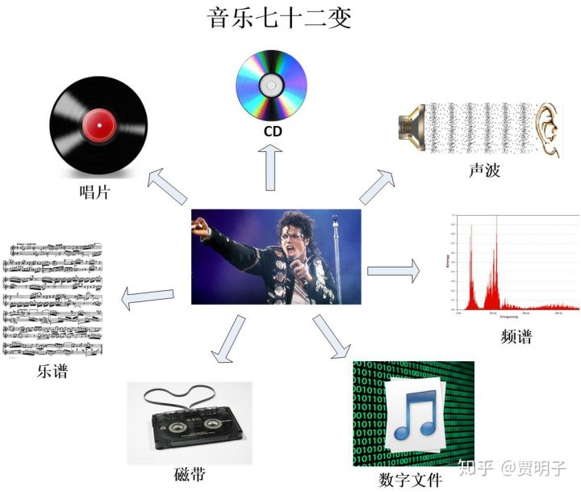
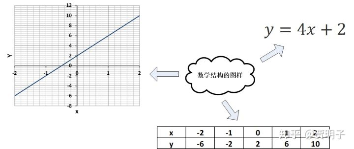
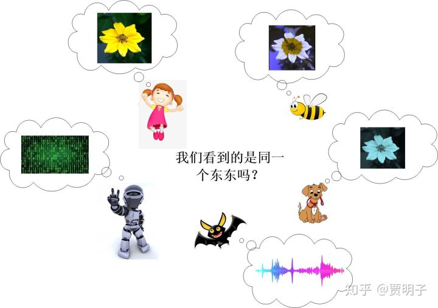

[现实的无心之心](https://zhuanlan.zhihu.com/p/37099562)

> **“Do not try and bend the spoon. That's impossible. Instead，only try to**
> **realize the truth…There is no spoon”**
> **“不要试图去扭曲勺子，那是不可能的。你应该去发现真相：根本就没有勺子”**
> **–电影《黑客帝国》**

这一章，我们将去试着发现洋葱世界的无心之心：那个**终极现实**。

在这之前，我们先来回忆一下第一部分第五章，

[贾明子：5、用“几何观”看世界](http://zhuanlan.zhihu.com/p/28557211)[zhuanlan.zhihu.com](http://zhuanlan.zhihu.com/p/28557211)

在这里，音乐就代表了一个无数个音符的集合，这些个音符按照某种特定的关系串联起来，最终通过某一种方式实现出来（例如钢琴、吉他、小提琴、歌声等等），形成声波，传到我们耳朵里，使我们的耳膜振动，刺激我们的听神经，最终到达我们的大脑，被诠释为音乐。事实上，声波的振动，就表现为空气分子就是一种空间和时间中的图样（pattern）：什么时刻、音乐厅的哪一个位置、空气分子按照何种频率的组合以多大的能量进行振动。这个声波的振动，可以用波动方程严格描述出来。而再往上一层，就是乐谱。乐谱本身就是无数个音符按照相互关系排列组合形成的图样。

而这种图样，我们可以通过很多种不同的方式记录下来：比如说，写在五线谱上，刻在CD或唱片里，录制在磁带里，以数字文件的形式写在硬盘里或MP3播放器里，用图形记录在频谱曲线里，等等等等，我们可以有无数多种记录方式。所有这些记录方式物理上都很不同，但是它们记录的却是同样的一首曲子。

  那么，我们来看，CD盘面上细密的小坑，声波中某个空气分子的振动，磁带中某处磁粉的密度，频谱的某一帧曲线形状，乐谱中某个蝌蚪一样的符号，以及数字文件中某一串10010110……，它们是如此的不同，从真实的物理结构上，我们根本就不可能找到相似之处，它们是如何记录了同样的一首乐曲的呢？

**一一映射**。

没错，从数学上，我们可以把上述的不同物理形式按照某种规则建立起相互联系。CD上的某个小坑就对应了频谱的某一段曲线，反之亦然。如此等等。既然它们互相之间都能建立起这种一一映射的关系，那么很显然，它们最终就可以被还原成同一样东西：某种
“纯粹”的、抽象的图样。这种图样不依赖与任何物理介质 – 早在人们发明五线谱、磁带、唱片、mp3、或者傅里叶变换之前，这种图样就可以让人们能够演奏乐曲。我们绝不会因为毁坏了一张CD，就丧失了对音乐的概念。

这种图样，就是音乐的抽象结构。这种结构，如果用我们的语言作为载体表述出来，就是“音符”之间的相互关系。

我们前面讲到过，“一一映射”，或者叫做“**互射**”，所代表的，就是两种结构之间的**拓扑同胚**，或者说，是数学结构上的同构。我们在第一部分的第7章中，讲到过这种数学结构上的等价性。 

[贾明子：7、茶杯与甜甜圈之辨](http://zhuanlan.zhihu.com/p/28566895)

[zhuanlan.zhihu.com](http://zhuanlan.zhihu.com/p/28566895)

  这种贯穿于各种物理载体之间的，数学图样的结构的等价性，所对应的，在某种意义上说，就是音乐的终极现实。

音乐这个东西相对比较复杂，我们其实可以用一个比较简单的例子，把它讲述得更清晰一点：比如说，你们刚刚学过的一次函数。

比如说，现在你拿到一个一次函数：

![[公式]](https://www.zhihu.com/equation?tex=y%3D4x%2B2) 

那么，你要如何具体地把这个函数表述出来呢？

当然，你可以说，这个函数式本身就是一种具体的表述形式。你们还学过列表和画图的方法。我们知道，函数式、列表、图形，它们都是这个同样的函数的不同表达方式：是这个函数所代表的数学结构的具体表现：

如果依赖于代数语言，它就表现为函数式，如果依赖于几何语言，它就表现为函数图形，如果依赖于表格，它就表现为列表。但是这三种具体的表现形式，都是某种数学结构的具体表达而已。

假如说，如果我们遇到了一群感官系统和我们完全不同的外星人，我们想向它们介绍一下我们的音乐，怎么办？鉴于它们没有听觉，我们没有办法向它们演奏。如果它们有视觉，我们可以给它们看频谱，就像我们前面画出来的沿着连续时间变化的频谱曲线就构成了一座起伏的山峦。山峰的结构就代表了音乐的结构。它们就可以通过视觉来了解我们的音乐。如果它们没有视觉，仅有味觉呢？我们也可以想办法。比如说我们用酸甜苦辣咸以及它们的连续组合来代表高低不同的音频，那么我们可以通过味觉的变化，把音乐编码到味道当中，让它们了解我们的音乐。即使是它们的感官系统和我们没有任何重叠，我们也总是有办法：因为我们面对着一个共同的外部物理世界。我们总可以利用拓扑同胚的原理，把我们的音乐编码到某种它们可以感受到的物理载体里面。例如如果它们可以直接感受磁场，那么一盘磁带就可以做到我们的工作。总而言之，音乐的“纯数学图样”，才是我们传递的信息。但是我们这个结论存在着一个假设的前提：

**存在一个不依赖于感官的客观现实。**

因为只有这样一个客观现实的存在，才能构成两个具有完全不重叠的感官系统的物种之间的桥梁。如果最终的所谓“现实”是依赖于感官，或者说，依赖于“观察”的，那么我们和外星人眼中就会有完全不同的现实。我们的数学图样依赖于我们的经验，而对方的，则依赖于对方的经验，两者是完全不同的：我们双方的现实，毫无共通之处。甚至说，我和你的现实都是完全不同的，因为它依赖于你我的主观世界。

那么，独立于一个主观意识的客观现实到底是否存在？这是个哲学问题，自古以来就一直有着不同的看法，我们在这里当然不可能做出一个判决。但是，现实主义者Temark曾经断言：

**如果存在着独立的客观现实，那么这个现实必然是数学的。**

这个，叫做“**数学宇宙假说**”（Mathematical Universe Hypothesis，**MUH**）。

事实上，数学，尤其是几何学，代表着终极的形而上学现实，这种哲学观点毫不新鲜，几乎是贯穿着古希腊哲学、古典理性主义一直至今。古希腊先贤们，诸如柏拉图、毕达哥拉斯、阿基米德等等，他们一直坚信，世间万物变幻无常，但是一直不变的，就是它们背后的几何和数字。比如说，欧几里得几何，从几个显而易见的公理，推出了宏伟的几何建筑。整个过程逻辑无懈可击。直至今日也当得起数学的严谨和简洁的典范。欧式几何的公理体系曾经被认为是几何就是终极现实的明证。例如说，欧几里得的直线公理：两点之间有且仅有一条直线。这个公理看上去完全不证自明。无论是我们的人经验如何千变万化，遇到这条公理，我们都从最直觉认定它是正确的[[1\]](https://zhuanlan.zhihu.com/write#_ftn1)。它不依赖与个人，不依赖于具象 – 它是**纯理性**的，是“上帝”刻印在我们意识中的东西，是我们意识建筑在上面的基础。

这种信念一直延续，后来著名的笛卡尔、莱布尼兹、直至希尔伯特，都是它的信徒。甚至伟大的爱因斯坦，在他的理论中，也有着明显的几何纲领：狭义相对论中的四维时空，广义相对论的时空流形等。的而同时，就像我们前面章节所讲的，随着虚数、非欧几何等一系列数学体系的进展，人们渐渐地倾向于把数学与现实剥离开来，而把它看做一种纯粹的形式理论，一种逻辑体系。它可以被自然科学拿来对现实进行表述，但是它本身却不包含现实。

我们应该注意到的是，数学工具本身所不包含的现实，指的是那些具体的物理实体。但是，作为有效的数学模型所必备的一个特征，就是与现实结构具有同胚性。也就是说，数学模型中的一部分概念与现实实体间有着一一对应的关系 –  只有这样，数学的结果才能够对现实有正确反映。但是，现在Tegmark站起来说，这种同胚性，本身就是把打上了我们主观烙印的物理现实及其之间的关系抽象出来成为一种“客观”的数学图样。这即是最终极的现实：物理实体之间的结构（structure）和图样（pattern）。而具体的物理实体，反倒不能算作“现实”。因为物理实体总是依赖于观察和主观概念，但是数学结构却不必。

比如说，我们非常习惯于我们人类的视觉，但是，我们所能感知的五颜六色，仅限于可见光，其实是一个很宽的光谱中极小的一小部分，红外和紫外都是我们看不到的。并不太令人惊奇的是，其它的很多动物它们感受光的范围和人类不尽相同。例如，蜜蜂的感知就偏向于紫外线一些。因而它们看到的，就和我们很不同。我们无法想象看到紫外线是个什么感觉，但是我们可以通过人类的体验来“模拟”这种感觉。比如说一朵花儿，我们看到的是一朵纯色的黄花，而蜜蜂，由于它们的视觉偏向紫外，那么它们可能分辨不清楚黄色是什么，但是它们会明显地看到花心附近的紫外线（这可以使得它们更方便地采蜜），因此它们看起来，就是一朵双色的花儿 – 不管怎样，反正不是黄花。

那么，如果蜜蜂能够和我们对话，谈论这朵花，那么我们和蜜蜂之间就很难达成共识。如果我们考虑更多的有着不同感官系统，那么大家的分歧就更大了：

人：一朵黄色的花。

蜜蜂：一朵双色花

狗狗：什么是颜色啊？

蝙蝠：什么是花？明明就是一堆超声波！

机器人：你们都错了，这是一堆二进制的数字串！

每个人眼中，都以一个只依赖于自己的现实，那么我们就不禁怀疑：离开了人们的感官，这朵花到底“客观上”是什么？存不存在一个不依赖与感官的“客观现实”？

所幸的是，我们现在的科学理论暂时能够给出一个大家都认可的现实：电磁波的光谱。我们虽然无法体验紫外视觉或者红外视觉，狗狗虽然不知道红绿是什么，但是当我们把这朵花反射的太阳光的光谱列出来，大家都会毫无疑义。这是靠“电磁波”这种比颜色更加抽象的实体、用数学结构（傅里叶变换）表达出来的一种对现实的描述。它离开了人们直接感官，反而更加“客观”。

那么，电磁波又是个神马东东？我们需不需要更加抽象的概念来描述它？这就是MUH的关键。

那么，Tegmark这样说，如果存在着一个**独立于任何意识**的客观世界，那么，这个客观现实必然是**不依赖于任何意识所产生的具体概念表象**的。例如，我们说，宇宙是由各种微观粒子组成的 – 光子、电子、夸克、中微子等等。但是我们必须知道，所谓的这些微观粒子都是我们人类的主观意识赋予这个现实的具体概念，因而它们都是依赖于人的意识而存在的，它们就不可能是**独立的**客观现实。描述它们运动的薛定谔方程，依赖的是我们的抽象数学体系，函数、矢量、微分方程等等，而这些数学概念的更底层，就是不依赖于数学概念的抽象数学个体之间的关系，也就是数学图样。只有这种数学图样，才是不依赖与我们人类的，因而只有它们才称得上客观现实。所以，所有对现实进行具体描述的，都不能称为客观，只有那些抽象数学结构，才是客观现实。这就是MUH的由来。

Tegmark接着对人类的各学科的知识结构做出了这样一种阐述：

按照洋葱世界的基本理念，人类的科学体系是一层层建筑起来的，每一层的科学都是建筑在它上一层的基础之上的。这个在我们“现实是一个臭洋葱”当中有类似的阐述。所有的这些科学理论，往往都包括了两个部分：

- 一个是数学；
- 另一个是这些数学的使用手册。

具体讲，每个理论的数学部分，对这个理论所涵盖的物理实体的运动行为作出了定量化的描述。但是，单单是面对着一个个裸奔的数学公式，我们并不能获得关于物理实体的任何知识。因此，在这些数学公式之外，我们必须要附加对这些数学公式必要的**诠释** –  这些数学概念对应的是什么样的物理实体。有了这种诠释，我们才能够根据数学计算的结果，对真实世界作出描述。例如说，我们前面很多章的罗里吧嗦，都是在纠结于量子力学的诠释。在已经确立起来的量子力学形式理论（“裸”量子力学）的公理中，包含了这种数学：薛定谔方程、希尔伯特空间、本征值问题等；也同时包含了若干条这样的诠释：波恩规则、量子态和可观测量的含义、波函数坍缩等。这样的数学和诠释都是这个理论所必要的：数学给出定量结果，诠释把这些抽象的数字和现实联系起来。

 

在这个洋葱世界中，每一层都涌现出相比于上一层更多的概念。于是，层层加码，表现出来的的就是，这个知识树中，越往下的部分（越具体的理论），其理论过程中包含的“诠释”部分就越多，而相应地，这些概念就越贴近我们的经验，越具象。反之，越往上的部分（越基础的理论），则这种诠释就越少，就越接近裸奔的抽象数学。例如说心理学、社会学这些学科中，就几乎没有什么数学在里面。再往上的一些工程学科中，数学甚多，但是基本上对应的都是非常直观的概念。到了经典力学和统计力学这一层，已经有很多抽象的数学概念了，比如说系统的运动对应于高维相空间中的一个点。再向上量子力学，诠释的部分已经很少了，哪怕我们不要什么诠释，只是 shut up and calculate  也丝毫不会阻碍人们应用量子力学。而人们甚至不知道波函数究竟是个什么东东了。我们的讨论范围并不包括更加基础的理论，量子场论中，粒子都已经不再是基础概念了；而广义相对论中，时空则是一种几何。现在我们的科学理论，还是分成了两个暂时无法相容的部分，一个就是量子理论，另一个就是相对论。量子理论对微观世界以及电磁、强、弱相互作用有着很好的解释，但是却对引力无能为力。而相对论则相反。人们正在试图建立一种终极理论，它包含一切事物的运动，这种理论一般被称作**大一统理论（Theory of Everything, TOE）**。而Tegmark这样说：

> *“……a TOE would probably have to contain no concepts at all. In other words,  it would have to be a purely mathematical theory, with no explanations   or “postulates” as in quantum textbooks”  (大一统理论可能必然不包含任何概念。也就是说，他应该是一种纯数学理论，没有“诠释”或者量子力学课本中的那些“公设”。)*

这样一种纯抽象的，没有任何源自经验概念的数学理论，就是Tegmark心目中的终极理论，它所描述的，就是MUH中的终极现实：**数学结构**。

这种不依赖与实体概念而自在的抽象现实，似乎有点像康德的“物自体”。康德对纯粹客体的看法，实际上是有点类似的。他认为，一个物体有着各种各样可以被我们感知的性质。例如说花的颜色、形状、气味等等。我们依赖这些性质来感知外物。但是，所有这些性质，都是被我们观念所加工过的，是依赖于我们主体的，因而不可能是纯粹的客观现实。真正的客观现实，必定是剥离了这种种外在性质的，纯粹的、抽象的客体，或曰**“物自体”**。由于物自体无关主观，因而它永远不可能被人们真正认识。

> *“And we indeed, rightly considering objects of sense as mere appearances,  confess thereby that they are based upon a thing in itself, though we  know not this thing as it is in itself, but only know its appearances,  viz., the way in which our senses are affected by this unknown  something.”（事实上，既然我们有理由把感官对象仅仅看做是现象，那么我们就也由之而承认了作为这些现象的基础的自在之物，虽然我们不知道自在之物是怎么一回事而只是知道它的现象，也就是只知道我们的感官被这个不知道的什么东西感染的方式。）*

但是，我的理解是，MUH和“物自体”事实上是不同的。Tegmark的数学宇宙，并不需要一个脱离于主观的纯粹客体。它其实是在说，根据我们的感官和观念不同，我们每个人所接收的“现实”可以是完全不同的，但是，所有这些不同的、在主观上的映射的现实，它们必定是存在一一对应关系的，这种一一对应关系是不随主观变化的（所谓客观），也就是同胚的。那么，我们把这种一一对应关系抽象出来，就是数学图样的结构。

数学图样可以看做是一组抽象个体以及这些个体之间的相互关系。例如说，自然数就是这样一种数学图样：它包括了一系列的抽象个体：每个自然数，以及自然数之间的相互关系：顺序、加减乘除等。其中的抽象数学个体，例如说自然数5，我们虽然在不同的语言和符号载体下，有着不同的具体表象，例如说阿拉伯数字5、汉字五、英文five、希腊数字V、或者二进制数字101等等，但是所有这些具体表象，最终所指的，是那个有着明确定义的抽象的自然数。这个抽象的自然数个体，是不依赖于物理实体或符号的。同样它们之间的关系也是如此。（请参照章节“[题外话、自然数的正确打开方式](http://zhuanlan.zhihu.com/p/28595534)”）。

这种数学结构，我觉得它更像老子所说的“道”。《易经》里说：

> *“形而上者谓之道，形而下者谓之器”。*

这里，所有一切的实体概念，都是“形而下者”，它们是具体的、具象的、我们直观可认知的东西，是“器”。而MUH的数学结构，这是那个“形而上者”，是“道”。那个终极的现实，就只包含抽象实体，而不包含任何的，我们直觉可理解的东西 -- 所谓“道可道非常道”。

当然，我们的数学结构最终仍然要以某种符号体系表述出来，并且它最终仍然是建立在我们人类的概念系统之上的：它至少是建立在**集合**、**映射**这两个概念、以及**逻辑定律**之上的。集合代表了存在，映射代表了相互关系，而逻辑则是这个数学结构的最终基础：这就是追根溯源我们所能达到的极致。但是不论集合还是映射，都是**可名之名**；不论数学还是逻辑，也都是**可道之道**。更往上一层，我们只能去想象、去意会那种不依赖于任何数学体系的“数学结构”、那种在我们主体所能想象之外的客体以及客体之间的相互关系，毕竟我们的思维是不可能脱离我们的逻辑系统的。因而我们就进入了玄妙的哲学世界。毕竟物理最终还是要建筑在实证之上的，而但凡涉及实证，就不可能是抛开实体概念的纯粹抽象理论。按照MUH的这种观念稍加引申，那么必将存在更加终极的现实，它甚至是不依赖于逻辑概念的。那个终极的、因而也就是脱离了逻辑的现实，可能将永远在彼岸 – 这和康德的观念不谋而合。

现在我们从哲学的迷思中抽身回来，看看量子世界的现实。当我们沿着洋葱世界一层层地剥下去，越到底层，我们就看到的就越多的数学结构，而越来越抛弃那些基于人们经验的物理实体的概念。最终在逼近中心的时候，已经没有任何这样的实体概念了，剩下的，就是纯粹的数学结构：用来表述物理实体的抽象个体以及它们之间的相互关系。这就是这个**洋葱世界的无心之心：没有任何实体，只有普适波函数。**

如果我们把这个波函数认真对待，看作是一种现实，那么我们必然会面临着多重现实，而且是任意的多重现实：这种多重性和任意性是波函数的数学性质。而多重现实则是对这个抽象的数学结构的一种诠释：一只猫可以是死和活的叠加，同时也可以说是（死+i活）和（死-i活）的叠加，如此等等。那么构成我们多重现实的每一个分支，就都不是确切定义的。但是无论如何，我们任意选取一种叠加方式，最终全部归结于同一个**明确定义**的东西：那个作为希尔伯特空间中抽象矢量的波函数。而这个波函数恰恰满足MUH中的数学结构的理念：它就是多重现实之间相互关系的图样。所以，我们不必纠结于我们面对的到底是一种什么样的多重现实，这种多重现实是我们主观赋予的概念，因而我们将永远纠缠在其中无法理清的。相反我们应该从“井蛙”视角跳出来，以“鸟瞰”视角来观察，那么我们立刻就会看到这些表象背后的真实：**根本就没有多重现实，有的只是希尔伯特空间的态矢量而已**。

你说波函数不是个“真实”的东西？你错了，只有波函数这种抽象的、不依赖与我们经验的实体才是真正的客观现实。而其余所谓的各种分支，都是从这个终极现实中“涌现”出来的（通过退相干）、我们主体对客体加工过的概念而已。

终于，量子力学获得了它的极简形式，而**多世界理论也就成了一种没有诠释的诠释**：波函数就是终极现实，除此之外我们别无话说。End of story。

------

[[1\]](https://zhuanlan.zhihu.com/write#_ftnref1) 当然，后来出现了非欧几何，那是后话。

发布于 2018-05-21

