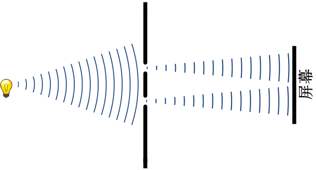
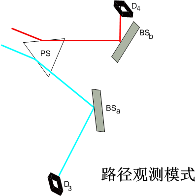
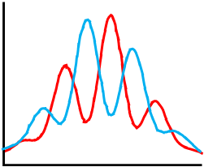
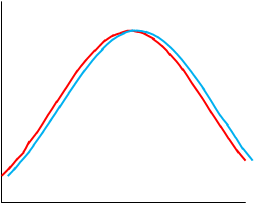
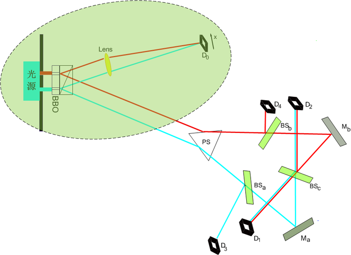

# 不神秘的量子擦除：未来可以改变历史吗？

> **“What you need is imagination, but imagination is a terrible straight jacket”**
> **“你需要的是想象力，但想象力本身是一件可怕的束缚衣。”**
> **–** **费曼**

我想，你已经为量子力学中种种的匪夷所思感到如痴如醉了。关于此，你绝不孤单：你不是第一个，也不是最后一个。我仍然记得当初我第一次听到“薛定谔猫”的时候，心中的那种不可思议。我想，玻尔的那句名言，引用多少次都不过分：

> ***“如果你不为量子力学所深深地震惊，那么你还没有理解它”\***

说到底，量子力学所涉及到的，是我们经验之外的领域。我们之前从来没有直接与微观世界直接打过交道。因而我们日常所熟知的、认为是理所当然的各色种种，都只是对这个领域的间接体验。所以，一切也就顺理成章了：无论它与我们的常识有多么巨大的冲突，都是一件再自然不过的事情。反过来，如果它真的和我们的常识完全一致，那才是一件不可思议的事情。

所以说，科学家们为何要建立量子力学这种玄之又玄的东西？真正的原因只有一个，那就是我们观察到的事实逼着我们这样做的。所以无论量子力学看上去有多么不可思议，多么违反常识，这都不重要，自然科学只关注一件事，那就是它能够用最简的语言、准确预测我们所观察到的现象。从这一点说，不论它表面上多么光怪陆离，它的内核总是最最质朴的。

然而，人们总是喜欢戏剧性的东西。既然量子力学已经被打上了“反常识”、“怪异”、“不可理喻”等标签，人们总是乐于进一步地用这种标签来看待它的一切。诸如态叠加、测量问题、波函数坍缩、量子纠缠等现象已经是非常能够满足人们的恶趣味了，但是人们意犹未尽，仿佛是如果不继续沿着这个“政治正确”的方向走下去，人们就不是在谈论“真正的”量子力学一样，人们仍然要在这个奇怪的清单上加码。很不幸的是，其中有一些，沿着这个方向被过分诠释了，因此在完全没有必要的情况下，增加了很多看上去很玄的东西。尤其是一些不那么严肃的科普，更加夸张。

在下面的几章，我将要试图返璞归真。澄清几个大众科普中为了抓眼球而过分夸大的、量子力学中的“奇怪”之处。然后，我将向你展示一个极其美妙的思想[[1\]](https://zhuanlan.zhihu.com/write#_ftn1)，在这里，大多数的量子力学的违反常识之处，其实都源自两个非常平凡的道理：

**1. 我们作为这个自然界的观察者，本身也是自然界的一部分，不可分割；**

**2. 我们对自然界的观察，总是只能看到它真实面目的沧海一粟。**

第一个这种被过分诠释的，是一个著名实验，叫做“延时量子擦除实验”。我将从这里展开我的话题。

我们再一次来回顾一下双缝干涉。费曼曾经说过，量子力学的一切特性都可以再双缝干涉中得到体现，而双缝干涉，几乎是一种最简单的量子现象，因此，用它来讨论一些量子力学中的规律是再合适不过的了。

前面我们已经提到过双缝干涉是一个什么样的实验，如下图所示：

一个光源照射到一个双缝装置上，当缝的宽度足够小的时候，透过双缝的两道光会在背后的屏幕上产生明暗相间的条纹。这就是光的双缝干涉现象。我们知道，在双缝干涉中，当我们不试图观测光子时，那么光子像一个波一样表现：它的波函数同时通过两条缝隙，然后自己与自己发生干涉，形成干涉条纹。在这个过程中，我们不能问这样的问题：这个光子究竟是穿过了哪一条缝隙？而当我们对这个光子进行观测时，我们迫使它表现得像一个粒子，因此，它就不能像波那样同时穿过两条缝隙，而相反，它只能从中选择其一。但是这样一来，它就不再能够自己与自己发生干涉，因此，干涉条纹也就消失了。这个，就是玻尔所说的“波动性”和“粒子性”之间的互补，叫做“**互补原理**”，大家一般把它叫做“**波粒二象性**”。

因此，这种互补性，也可以看做是“**路径信息**”和“**干涉条纹**”之间的互补性。如果我们有任何办法获得“光子走了哪一条路径”这个问题的答案，那么我们就必然会破坏干涉条纹。要知道，我们不必真的获知这个路径信息，只要是系统能通过某种微妙的方式把这个信息“**泄露”**出来，它就不再有干涉条纹了。而反之，如果系统能够把路径信息“保密”得天衣无缝，那么我们就总是可以看到干涉条纹。这个路径信息，江湖上人称**WWI**（“which way information”），可是一个大名鼎鼎的家伙。如果你翻开一篇关于量子干涉的论文，90%都会发现里面会讨论它。因为它真的是一个令人捉摸不透的东西。

从量子力学诞生早期，一直到今天，人们从没停止过对各种形式的双缝干涉的研究，这是因为双缝干涉可以说是粒子的微观性质在宏观舞台上的集中表演。最早期玻尔对此的一个解释就是，光子是一个如此微小的东西，我们任何一个试图观测它的行为，都会极大地影响到它的状态[[2\]](https://zhuanlan.zhihu.com/write#_ftn2)，因而不可避免地破坏掉它的干涉。但是这个说法非常令人不满。首先，它只是试图解释干涉条纹的消失，但是，对于消失了干涉条纹的经典光斑，它却不能解释。只有强制性地引入“**坍缩**”假设，这种兼容性才有可能。其次，我们看到对一个系统，我们不必**真的**观察它去破坏干涉，只要是它的路径信息**有可能**被观察，它就没有干涉了。并且，有很多非常精确的实验设计，使得我们可以不去直接观察光子来获得观察路径信息，那么光子本身并没有被干扰到，可是它的干涉仍然被破坏了[[3\]](https://zhuanlan.zhihu.com/write#_ftn3)。

于是人们一遍遍地改进实验，进行各种研究。在1999年[[4\]](https://zhuanlan.zhihu.com/write#_ftn4)，Kim等人完成了一个非常精巧的实验，被称作**“延时量子擦除实验”（delayed choice quantum eraser）**。这个实验可以通过改变一些实验步骤，人为选择“泄露”系统的路径信息，还是把泄露出来的路径信息重新“擦除”掉。然后人们发现，一旦路径信息泄露了，干涉就消失了，当人们把泄露的信息重新擦除掉，干涉就又神奇地回来了。似乎光子的行为会受到我们主观决定的控制一般。

这个实验和我们前面讨论的 [量子纠缠和超光速通讯？！](https://zhuanlan.zhihu.com/p/31172662) 的装置类似，它的示意图如下（图片来自维基百科）

右上角的光源经过双缝，照射到一个叫做BBO的非线性晶体上。这个晶体有一种特性，就是它可以吸收一个入射的光子，然后发射出两个纠缠的光子，每个光子的能量都是被毁掉的光子的一半。这两个光子经过一个光学棱镜，可以分别射向两个不同的方向。其中一个光子，射向我们的屏幕D0，用于进行干涉实验，我们把这个光子就叫做**信号光子**（signal photon）。而另一个光子，则射向另外一个方向，这个光子因为和信号光子来源相同，只要我们知道这个光子来自哪一条缝，我们就知道它的同伴“信号光子”走的是哪一条路径了，因此它可以看做是入射光子的路径信息标记，我们把它叫做标记光子（idler photon），或者我更喜欢把它叫做“**影光子**”[[5\]](https://zhuanlan.zhihu.com/write#_ftn5)，表示它是信号光子的一个影子，我们可以通过观察这个影光子来了解信号光子。那么现在一个光子的路径透过两条缝隙，它可能是左边的缝隙，也可能是右边的缝隙。我们把这两条路径分别用红色和蓝色表示。不论它透过哪一条缝隙，都会产生一对光子：信号光子和影光子。我们通过观察影光子的路径信息，就可以知道信号光子的路径信息了。这个影光子呢，我们把它射向一套虚线框出来的观察仪器，在这套仪器中，我们可以自由地决定是观察它的路径信息，还是把它的路径信息“擦除”掉。我姑且把这套仪器叫做“路径观测仪”。这套仪器我们在后面再详述。

那么现在，信号光子被引向屏幕，来做我们的干涉实验，而影光子被引向路径观测仪。我们可以通过观察影光子，而不是直接观察信号光子，来确定信号光子的路径，从而观察这对信号光子的干涉有何影响。

而影光子在路径观测仪中又会发生什么呢？首先，它们经过一个棱镜。棱镜的作用是是光线发生偏折。这样一来，我们就把“红色的”影光子和“蓝色的”影光子的路径完全分开了[[6\]](https://zhuanlan.zhihu.com/write#_ftn6)。然后它们分别到达两个半透镜，BSa和BSb。半透镜是这样一种光学仪器，它表面镀了一层半透的反射层，可以使入射的光子一半被反射掉，另一半不被反射而直接透过它继续向前进。反射的光线分别到达两个探测仪，D3和D4。而透射的光线继续前行，到达两个反射镜，Ma和Mb，经反射后，在另一个半透镜BSc汇合。汇合后它们分别的反射和透射光线到达另外两个光子探测仪，D1和D2。那么，这个路径探测仪就可以做到探测影光子的路径，也可以擦除影光子的路径信息。这是怎么做到的呢？

为了描述简单，我们在不影响实验结果的前提下，把这个实验稍微改变一下。我们把BSa和BSb换成两个反射镜，当我们把反射镜插入光路时，它100%反射光线，而把它拿出来时，它完全不影响光线。这样一来它和半透镜就有相同的功能。现在，我们把这两个反射镜插入光路，会发生什么呢？

没错，所有的影光子全部被反射掉，所有的红色影光子会到达D4，而所有的蓝色影光子会到达D3。如下图所示：

这样一来，当我们在D4探测到一个光子的时候，我们立刻知道，它必然来自红色路径，也就是从左侧缝隙过来的。我们就知道，它相应的同伴，那个信号光子也是通过了左侧路径。同理，当我们在D3探测到光子的时候，我们就知道那个信号光子通过了右侧缝隙。这样一来，我们就可以观测到路径信息了。

而当我们把这两面反射镜拿走，又会发生什么？我们这时候不会再在D3和D4观测到任何光子，它们全部向前，最终到达了D1和D2。如下图所示：

而此时，我们清楚地看到，不论是D1，还是D2，都有一半的光子来自红色路径，而另一半来自蓝色路径。所以，当我们在这两个探测器上看到光子的时候，我们根本无法分辨它们从哪里来。因而，路径信息就被“擦除”掉了。

我们可以选择观察路径信息还是擦除路径信息，这完全由我们自由决定。当我们观察路径信息的时候，系统的路径信息就被泄露了，根据互补原理，就不会有干涉。而当我们擦除路径信息的时候，它就没有被泄露，因而我们知道，干涉仍然存在。

理论上，我们可以让影光子的路径很长，至少会远远长过信号光子的路径。那么，信号光子打在屏幕上，被拍照的时候，影光子还远远没有到达路径观测仪。当信号光子已经打在屏幕上之后，我们再来做一个决定，我们究竟是想要：

1. 观察影光子来自哪一条缝隙、从而确定信号光子的路径的时候呢？

2. 还是想擦除影光子所携带的路径信息？

根据互补原理，第一个决定我们获知了路径信息，将会破坏掉干涉，而第二个决定，我们擦除了路径信息，干涉将会得以保留。但是从直觉上我们觉得，既然此时光子已经打在屏幕上，并且拍了照片，那么我们的决定将不会再对干涉产生影响了，因为它早已经发生了！这样一来，岂不是打破了“互补原理”了吗？还是说，事实正相反，互补原理仍然成立？这样的话，我们似乎就不得不认为，光子具有某种神奇的预知未来的本领，它可以预先知道我们在它到达屏幕之后会做出什么决定，然后按照我们将来的决定，配合我们演了一场戏，以确保我们不能同时知道它的路径信息和干涉条纹；又或者说，我们在未来的一个决定，穿越时空，回来影响了过去拍下的照片？！

看上去，互补原理似乎很不妙。

事实如何呢？互补原理仍然成立吗？还是说，我们未来的决定决定论现在要发生什么？

实验结果证明，**互补原理仍然成立**，即使是我们擦除路径信息的决定远远晚于信号光子被拍照之后，仍然如此。那么，到底是光子有神奇的预知能力，还是未来的决定影响了现在呢？

在一些科普书中，甚至在一些相对比较专业的文章中，这两种说法都被屡屡提到。我觉得，这么说的那些人不可能是认真的，因为他们应该知道这个实验背后的真实含义。这么说，可能仅仅是有意无意地迎合了“量子力学的一切都必须是奇怪的”这种流行的说法，或者被每天都听到的这种说法给带偏了（我不想用“洗脑”两个字）了，又或者是被早期哥本哈根学派带有工具主义色彩的思想带偏了，而没有去认真想这件事[[7\]](https://zhuanlan.zhihu.com/write#_ftn7)。

我想在本章节向你阐明，这个实验结果与所谓的“未来影响现在”毫无关系，但是它也无疑证实了互补原理的正确性，不但证实了它的正确性，而且把它的本质也表现出来了。

正确理解这个实验结果的关键，仍然在**量子纠缠**。现在听我细细道来。

首先，我们必须要明确一点，在这里，“干涉”的含义并不是像表面上看起来那样：屏幕上出现明暗相间的条纹。事实上，不论我们采用什么样的观察手段，屏幕上都不会有任何条纹
– 只有经典的光斑。这里的干涉，和我们上一章 [量子纠缠和超光速通讯？！](https://zhuanlan.zhihu.com/p/31172662) 的讨论相类似。它不是一种我们可以直接看到的干涉，而是在某个相空间的干涉。

具体一点看，当我们说，路径信息被擦除了的时候，干涉就出现了，这个干涉到底是怎么出现的。事实上，如上所说，这时候我们在屏幕上，根本看不到任何明暗相间的条纹，那么干涉在哪里呢？干涉就隐藏在屏幕和路径探测仪之间。

现在我们选择擦除路径信息，也就是说，所有的影光子都只出现在D1和D2两个探测器之中。我们把所有出现在D1处的影光子统计起来，和这一些影光子想对应的那些信号光子，在屏幕上的分布，正是一个典型的干涉条纹（我们把它称作条纹D1）。而同时，我们把D2处出现的影光子统计一下，和它们对应的那些信号光子，在屏幕上的分布，也是一个干涉条纹（我们把它称作条纹D2）。但是，在条纹D1的暗处，刚刚好是条纹D2的亮处。同理，在条纹D1的亮处，刚刚好是条纹D2的暗处。而条纹D1和条纹D2同时出现在屏幕上，就构成了一种条纹和“反条纹”的互补，互相填平了，就看不到任何条纹了！实验结果如下：

而相反，如果我们选择不擦除路径信息，那么所有的影光子都出现在D3和D4两个探测器中。这时，我们再用上面的方法统计，所有D3出现的影光子的对应信号光子，以及所有D4出现的影光子的对应信号光子，都没有条纹：

也就是说，不论我们如何选择，擦除还是不擦除路径信息，我们在屏幕D0看到的光斑不会有任何变化。有变化的，是它与影光子之间的**相关性！**

对于此，Brian Greene在《宇宙的结构》（The fabric of cosmos）一书中，做出了如下描述（引文中的黑体是我自己加黑的）：

> *"... **the future measurements do not in any way change the data you collected today. But the future measurements do influence the kinds of details you can invoke when you subsequently describe what happened today.** Before you have the results of the idler photon measurements, you really can't say anything at all about the which-path history of any given signal photon. However, once you have the results, you conclude that signal photons whose idler partners were successfully used to ascertain which-path information can be described as having ... traveled either left or right. You also conclude that signal photons whose idler partners had their which-path information erased cannot be described as having ... definitely gone one way or the other (a conclusion you can convincingly confirm by using the newly acquired idler photon data to expose the previously hidden interference pattern among this latter class of signal photons). We thus see that **the future helps shape the story you tell of the past.**"* *“**……未来的测量没有任何办法影响我们今天所能获得的数据。但是，未来的测量却能够影响我们对今天发生了什么所做的具体描述。**在你获得影光子的测量结果以前，对信号光子走了那一条路径这个历史事件，你真的无话可说。但是，一旦你知道了测量结果，根据影光子在哪一条路径上出现，你就知道信号光子到底是走了左侧还是右侧。你同样可以下结论，在路径信息被擦除以后，说那些影光子对应的信号光子无法用确定的路径来描述（对这个结论，你可以轻易得到肯定：你用新获得的影光子数据，可以把以前隐藏在不同条纹之中的干涉条纹揭示出来）。于是我们知道，**未来只是在帮助我们讲过去的故事**”。*

这具体如何理解呢？我可以更加深入地给出解释。首先，第一个问题，**在屏幕上，为何我们总是看不到条纹呢？**

我们可以从各种角度来看这个问题。但是既然我们在讨论互补原理，我还是从互补原理着手来解释这件事。当我们在观察屏幕（D0）的时候，我们事实上为自己选定的系统已经把路径探测仪那一边的一切都排除在外了！如图所示，这个系统就是绿色的阴影部分，它的边界就是虚线标出的地方。也就是说，我们只知道影光子离开了这个系统，它后续发生什么，就已经不在我们的讨论范围中了[[8\]](https://zhuanlan.zhihu.com/write#_ftn8)。但是，影光子的离开，必然就会随身携带着路径信息。不管我们将来擦除还是不擦除，那都是系统之外的事情了，和屏幕上的条纹没有关系了。所以说，这个边界划分中，路径信息早就已经被影光子带出了系统，泄漏到外面了，所以，我们必然看不到任何干涉条纹！

那么，第二个问题，**为何我们的干涉总是要牵扯到影光子呢？为何信号光子之间不会发生干涉呢？**

这就是涉及到了问题最关键的部分：**量子纠缠**。我们在前面简单地提到过，处于纠缠的一对粒子（或者是多个粒子），它们已经失去了独立的量子态了。我们也说过，相互纠缠的两个粒子，它们之间的所谓“瞬间相互影响”，这种说法严格讲其实是错误的。因为双方发生的变化是“绝对”同时的，你根本就不能说是哪一个影响了哪一个[[9\]](https://zhuanlan.zhihu.com/write#_ftn9)。在相对论看来，不同的人会对它们“先后”顺序有着不同的看法。因而我们根本就无法**定义**到底是谁对谁产生了影响。所以，量子纠缠在更严格的意义上说，是指两个粒子的**共有状态**在空间中的扩展，影光子和信号光子共享着同样的状态，但是你没有办法区分单独的影光子（或者信号光子）的状态。关于**量子纠缠剥夺了每个粒子的独立状态**这一点，我会在后续的章节中更加详细地讨论，这里你不妨先把你对此的好奇心压一压，暂时把它当做一个既定事实来看待。

这样一来，原本的信号光子所处的（红色路径，蓝色路径）的叠加态，和影光子的（红色路径，蓝色路径）的叠加态因为相互纠缠在一起，它们就成了一个共同的状态了。这个时候，我们无法再去讨论信号光子的两个路径之间的干涉。它们的干涉就成了**四个状态在一起的干涉**（信号光子红色路径，信号光子蓝色路径，影光子红色路径，影光子蓝色路径，），而不是**单独**（信号光子红色路径，信号光子蓝色路径）的干涉了。这就是为何，所有的干涉条纹都必然要牵扯到影光子的信息才能揭示出来。

那么，接下来的问题就顺理成章了。**为何在不擦除路径信息的时候，总是不存在任何干涉呢？**

原因很简单，我们必须知道，所谓的“不擦除路径信息”，指的是影光子是完全可以分辨的，也就是说，影光子的路径没有任何重叠的部分。（例如，红色路径总是走到D4，而蓝色路径总是走到D3）。没有任何重叠，就意味着，凡是影光子红色路径的波函数不为零的地方，蓝色路径的波函数总是为零的，反之亦然。也就是说，有影光子参与的干涉，都会因为这两个路径的不重叠，而全部消失！[[10\]](https://zhuanlan.zhihu.com/write#_ftn10)

那么，**为何擦除了路径信息的时候，干涉又出现了呢？**

原因很简单，擦除路径信息，就意味着影光子的路径重新重合了。而重合，就会使得干涉项不再为零，因而又出现了。

最后，**到底我们未来的决定有没有影响到发生在历史的干涉呢？**

**当然没有！**因为干涉发生在影光子的所有叠加态和信号光子的所有叠加态之间。我们所谈论的干涉，必须包含了影光子的实时状态。如果我们想讨论我们对影光子做出“擦除还是不擦除”决定之后的干涉，那么在我们还没有做出这个决定之前，我们所关心的干涉尚未完成！只有当我们的决定做完之后，我们所关心的干涉才算是完成了。在这之前，整个纠缠系统的干涉是存在的，但是这种干涉仅仅是与影光子尚未被观测之前的状态参与的干涉，而不是被观测之后的状态参与的干涉。如果讨论路径信息擦除对干涉的影响，我们关心的是路径信息擦除之后的干涉，而在路径信息擦除之前，这个干涉**根本就没有发生**。而所谓“未来改变过去”这种说法，它隐含的一个前提是，信号光子之间的干涉早在它们到达屏幕时就已经完成了，根本不涉及影光子。这当然是不对的。

说到底，干涉表现的，是不同叠加态之间的相关性。当我们明白并牢记这一点 – **干涉包含了参与纠缠的（包括信号光子和影光子）所有路径** – 之后，所谓的“未来影响过去”的说法就不攻自破了。我们原本关心的本来就是一个“未来”的干涉（擦除实验之后的干涉），与“过去”毫无关系。

我知道，讲了这么一大堆，对你的小脑瓜而言，冲击性可能有一点太大了。如果简化一点来说，那就是：

- 量子纠缠有这样一种特性，它剥夺了单个粒子的独立状态。
- 因而所有的干涉现象都会涉及到处于纠缠态的每一个粒子的每一个叠加态。
- 所以，**一切不谈影光子状态而单独谈论信号光子干涉的讨论都是在耍流氓！**所以说，“在影光子被观察之前信号光子有没有干涉”这个问题本身就是不成立的。
- 所以，这里没有光子的神奇预知能力，也没有历史决定过去的荒谬结论。

请注意，这里的关键点，在于我们选择观察什么样的系统。如果我们的界面定在只限于屏幕D0，那么我们事实上**抛弃了所有被影光子带走的关于系统的信息**，我们就只看到系统的一小部分，我们完全看不到干涉 – 因为我们观测的范围本来就没有包括干涉信息。干涉仍然存在，但是**它存在于我们看不见的地方**。

当我们扩大我们的系统范围，从而包括了影光子的后续信息，那么我们就会看到更加完整的信息，此时，我们才有可能看到干涉现象。

也就是说，**干涉现象的消失还是存在，取决于我们选取的观察界面， 也就是取决于我们选择抛弃这个纠缠整体的哪一部分的信息**。

而往往地，在我们观察一个宏观系统的时候，我们不可能把和这个系统发生纠缠关系的所有部分都观察一遍[[11\]](https://zhuanlan.zhihu.com/write#_ftn11)。因此，我们必然会丢掉一些信息。而丢掉的信息，就使得那些干涉现象，都从我们眼皮子低下溜掉了。这**根本就不需要波函数的随机坍缩**，完完全全是在薛定谔方程的控制之下就发生了，这就是“**退相干**”的基本思想，关于退相干，我们会在后面细讲。

当然，我们也可以从“坍缩假设”出发，来讨论这个问题。按照这种说法，我们可以认为信号光子和影光子之间存在着瞬时联系。由于信号光子到达屏幕被观察总是先于影光子被观测，所以我们可以认为，信号光子被观测的时候，它的状态因为观测而“坍缩”了，而这种坍缩，就会立即影响到影光子的路径，使影光子从“红蓝”两个路径的叠加态按照一定的概率坍缩到某一条路径上。因而后续影光子的演化，就是以“它的信号光子坍缩在屏幕上的某一点”这个事件为基础展开的。后续影光子被以何种形式来观测，就导致了影光子后续的不同命运，进而影响了后续的影光子和信号光子的关联性。自然而然地，影光子“被擦除路径信息”还是“没有擦除信息”，导致了影光子后续演化方向的不同，因而信号光子和影光子的关联性也朝着不同的方向演化。这就是为何“擦除”就有干涉（请注意，这里的干涉包含了信号光子和影光子的关联），而“不擦除”就没有干涉 – 因为它们的关联性不同了。所以说，不是“擦除”影响了信号光子的分布，而是反过来信号光子的分布影响了“擦除”。

说实在的，我不喜欢包含了坍缩假设的这种思路，因为相比之下它要别扭许多。另外，有一点它很难讲清楚，就是这个实验中表现出来的干涉的**可逆性**。

我们可以来看看，在影光子传播，一直到达路径探测仪被擦除路径信息的整个过程中，干涉现象的变化。当影光子还没有到达路径探测仪的时候，由于两条缝隙的传播路径是完全分开的，因而就不存在干涉项。也就是说，由于我们在双缝干涉中增加了这个纠缠的环节，干涉被破坏了。按照坍缩假设，这是因为发生纠缠的过程，就是一个对光子进行测量的过程，因而导致了波函数坍缩，而这个坍缩是**不可逆**的。

然而当我们把影光子的两条路径混合在一起，擦除了它所携带的路径信息之后，我们就又重新看到干涉现象了。也就是说，这个过程变得可逆了。而按照坍缩假设，它应该是不可逆的啊！

当然，坍缩假设还有方案来回答这个问题，它比较复杂，我这里不进一步分析了。我来说一下不包含坍缩假设的说法，它非常简单：因为没有坍缩，所以整个过程完全是受薛定谔方程控制的**幺正演化**，而幺正演化，本身就是可逆的。这是多么自然而然的一件事！

最后，我们回来再看看“互补原理”。我想，讨论到现在，我们已经可以对“互补原理”进行一个更加本质的探索了。互补原理告诉我们，当系统向外泄露路径信息的时候，干涉就消失了。但是，我们如何定义**“\*系统向外泄露路径信息\***”？

请注意，“向外泄露信息”指的是，我们可以通过观察系统的一些变量，来获得“光子走了哪一条路径”这个问题的答案。我们不妨回想一下前面讲的冯诺依曼的观察链条 [还是未竟稿：冯诺依曼的观察链条](https://zhuanlan.zhihu.com/p/30717501)。立刻我们就会明白，向外泄露路径信息，指的就是**光子的路径与系统外部的两个量子态发生了纠缠**：

$\mathinner{|光子\rangle}\mathinner{|环境\rangle}=\left( \mathinner{|左路\rangle}+\mathinner{|右路\rangle} \right)\mathinner{|环境\rangle}\Rightarrow\left(\mathinner{|左路\rangle}\mathinner{|S_1\rangle}+\mathinner{|右路\rangle}\mathinner{|S_2\rangle}\right)$

这里，S1和S2分别指的是环境中的两个基底与左侧路径和右侧路径的纠缠。并且，S1和S2必须是可以**完全分辨**的。因而我们就可以通过区分S1和S2来判断光子走的是左侧还是右侧路径。也就是说，S1和S2必须是**正交**的。因为如果他们不能互相区分，我们自然就无法判断光子的路径信息，也就是说系统并没有泄露路径信息。也就是说：

$\left \langle S_1 |S_2 \right \rangle = 0$

必须成立，只有这样，才是泄露了路径信息。而这种与环境的纠缠，就必然把本来属于系统内部自己的干涉拖入环境的泥潭。而S1和S2的正交，或者说可区分性，就意味着它们之间没有干涉。所有包含它们二位的干涉项都会消失不见。所以，我们就看不到系统的干涉了。

所以，我们看到，**“路径信息”和“干涉条”之间的互补性，其实就是系统路径与环境的一对正交基发生纠缠的自然结果。**

------

**回答 [@暗影牧师安度因](https://www.zhihu.com/people/e83599d221684ceb54bfd8d1cbda8339) 问题的更新：**

关于纠缠光子导致无法观察到干涉的问题，其实最简单的，是用约化密度矩阵（reduced density matrix）的方法。如果你对密度矩阵的方法比较熟悉，建议直接计算约化密度矩阵，立刻即可得到“无法观测到干涉”的结论。

可能更加符合初等量子力学和我们直觉的，还是用波函数来表示。比如说，光子分为左路和右路。每个光子经过SPDC之后，变成了两个光子，我们用 $\psi\left( x \right)$ 表示Signal光子，用 $\phi\left( y \right)$ 表示idler光子。那么，一束光穿过双缝以及背后的BBO之后，波函数就变成了：

$\psi\left( x,y \right)=\frac{1}{\sqrt {2}}\left( \psi_L\left( x \right)\phi_L\left( y \right)+ \psi_R\left( x \right)\phi_R\left( y \right)\right)$

那么，整个光子的波函数所代表的空间分布就是：

$\rho\left( x,y \right)=\frac{1}{2}\left| \psi_L\left( x \right)\phi_L\left( y \right)+ \psi_R\left( x \right)\phi_R\left( y \right) \right|^2$

其中，x表示的是signal 的空间坐标，y表示的是idler的空间坐标。那么很容易得到：

$\rho\left( x,y \right)=\frac{1}{2}\left| \psi_L\left( x \right)\phi_L\left( y \right)\right|^2+\left| \psi_R\left( x \right)\phi_R\left( y \right) \right|^2+Re\left( \psi_L^*\left( x \right)\phi_L^*\left( y \right)\psi_R\left( x \right)\phi_R\left( y \right) \right)$

如果按照图中，两个idler光路以相互分离的状态离开系统，那么我们立刻知道：

$\phi_L^*\left( y \right)\phi_R\left( y \right)=0$

也就是说，“WWI被idler带出了系统”，因为左路和右路的路径完全没有重叠，我们可以通过对idler的观察知道路径信息（请注意，我们不必**真的**去观察，仅仅是我们**可能**观察到就足矣）。

那么干涉项由于上述项等于零就直接消失了，因此我们得到的之能是没有干涉的经典光斑。

如果我们后续把两个idler光路重叠起来，那么很显然上述项就不再等于零，因此干涉就会重现。这就是量子擦除。

但即使如此，单独观看signal仍然不会看到干涉。因为，我们可以单独计算干涉项如下：

$\rho_{inter}\left( x \right)=\int\rho_{inter}\left( x,y \right)dy=Re\left( \psi_L^*\left( x \right)\psi_R\left( x \right)\right)\int Re\left( \phi_L^*\left( y \right)\phi_R\left( y \right) \right)dy=0$

这时，干涉存在于signal光子的空间坐标x和idler光子的空间坐标y之间，但是单独的x坐标和y坐标之内都不再有干涉。所以原文中说，此时的干涉是发生在**四个光子**之间，而不是两个signal光子之间。这也就是Zurek常说的“干涉仍然存在，只不过它不在那儿。”

希望可以回答你的问题。

------

[[1\]](https://zhuanlan.zhihu.com/write#_ftnref1) 关于量子力学的基础研究仍在继续。我不想束缚你的思维自由，因而我并不会向你宣称这是一个唯一正确的想法。量子力学的诠释流派甚多，以后如果还没有哪一个诠释能够以明确的证据打败其他而一统江湖，你对它们一一了解之后，应该有自己的判断。

[[2\]](https://zhuanlan.zhihu.com/write#_ftnref2) 一个比较流行的比喻就是，我们为了观察一个乒乓球，扔了一个保龄球去撞击它。

[[3\]](https://zhuanlan.zhihu.com/write#_ftnref3) 这个，以著名的“量子擦除”实验为代表。但是，我们这一章的主要精力将会放到一个更加有趣的实验，“延时量子擦除”实验上。

[[4\]](https://zhuanlan.zhihu.com/write#_ftnref4) 我想让你停下来，仔细想一下这个时间的含义。它距离你的出生仅有5年时间！也就是说，你现在看到的，绝不是一些几百年前老学究搞出来的东西，而是在**和你一起成长**的全球大脑的智慧。

[[5\]](https://zhuanlan.zhihu.com/write#_ftnref5) 请原谅我不是专业人士，所以对它的名字“idler”的标准翻译并不清楚。“影光子”这个词借自Deutsh的一本书《The fabric of reality》，其中一个科普式的说法。我喜欢这种叫法，因为它表明了这个光子是信号光子的一个“影子”，对它的观察就揭示了信号光子的信息。不过请注意，这不是专业的标准名称。

[[6\]](https://zhuanlan.zhihu.com/write#_ftnref6) 请注意，为了使我的语言不那么啰嗦，这里我用了一个比较懒的说法。这里的“红色”和“蓝色”分别指的是来自左侧缝隙和来自右侧缝隙，而不是说它们的光子本身是红色的或蓝色的。

[[7\]](https://zhuanlan.zhihu.com/write#_ftnref7) 当然，这件事，在早期的大师，诸如玻尔或薛定谔，他们看来，仍然是非常有迷惑性的。玻尔作为坚定的哥本哈根领袖，很有可能会宁可相信未来影响过去，也不会怀疑互补原理。因为在那个时候，局限于当时的物理学发展，关于量子纠缠、退相干等现象的讨论还没有完全展开，背后的一些含义也就不清楚。

[[8\]](https://zhuanlan.zhihu.com/write#_ftnref8) 如果我们想要扩大我们的系统边界，那么必然就要讨论影光子发生的事情。但是影光子与我们的屏幕D0没有任何关系！所以它无论如何也不会影响屏幕上的条纹形状。

[[9\]](https://zhuanlan.zhihu.com/write#_ftnref9) 如果我们说，一个粒子影响了另一个粒子，必然有着先后顺序。但是量子纠缠绝对的“同步变化”，就无法区分谁先谁后。

[[10\]](https://zhuanlan.zhihu.com/write#_ftnref10) 如果我们把影光子的红色路径记做 $\phi_1$ ，蓝色路径记做 $\phi_2$ ，它们的干涉项产生的光强，就是 $Re\left( \phi_1^*\phi_2 \right)$ 。由于两者不重合，必然会等于零，干涉项中无论再有其他什么状态，都会因此消失掉。

[[11\]](https://zhuanlan.zhihu.com/write#_ftnref11) 因为系统会和环境发生大量纠缠，这种纠缠牵扯范围之广，超出了你的想象。又因为，纠缠的非定域性，纠缠所涉及到的空间范围之大，几乎会涵盖整个宇宙。要想获得全部信息，几乎就要求我们**观察全部宇宙**。

编辑于 2019-01-17 09:36

