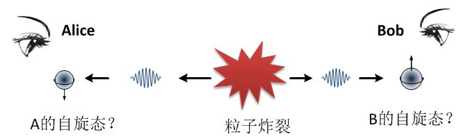
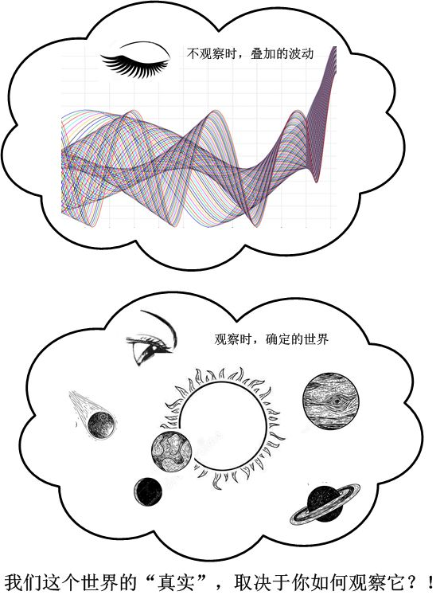
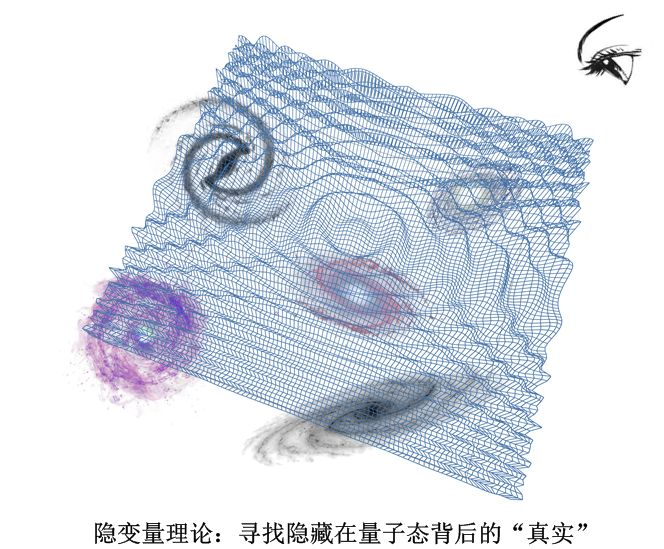
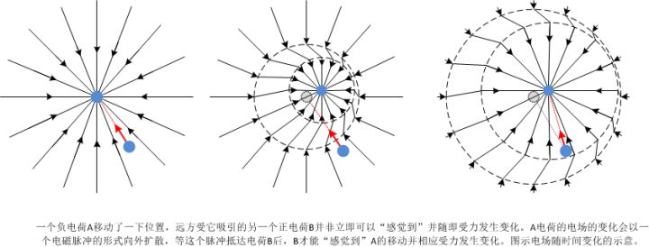
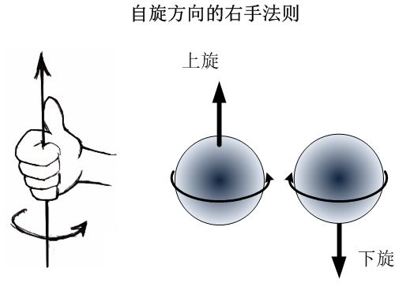

[未竟稿之二、量子纠缠](https://zhuanlan.zhihu.com/p/29819368)

**“I would not call that one but rather THE characteristic trait of quantum mechanics”**

**“我不想说量子纠缠是量子力学的\*一个\*独有特性，而是在说，它是量子力学的\*终极\*特性。”**

**– 薛定谔**

我们来看看，由于量子态的叠加性和概率本性，产生的量子力学中最令人迷惑的现象，**量子纠缠**。

前面章节里面，我们曾经把量子力学的大事记列举了一下，看到爱因斯坦和薛定谔都先后对哥本哈根学派发起过猛烈的攻击。就像是前面所提到的“蝴蝶效应”让每个人都知道了混沌一样，薛定谔的著名的喵星人，使得这场极端专业的，本应该是非常小众的辩论，成为了广大学渣们喜闻乐见的谈资。

而与薛定谔猫同样知名的，是爱因斯坦的名言“**上帝不掷骰子**”，大家把这句话当做爱因斯坦的决定论哲学的明证，其实，爱因斯坦真正最在意的远不是**决定论**，而是**实在论**。爱因斯坦还有另一句名言：

***“当你不看月亮的时候，它还在吗？”\***

可能是因为这句话不像“上帝不掷骰子”简短有力，因而它的流传度远远不及后者。但是，这却是爱因斯坦更加关注的 – 实在论，他对之的执着看法甚至远远超过了决定论。

在我们前面讨论的时候，可能这一点也深深地迷惑了你。这个世界怎么啦？当我们不观察它的时候，它就变成了一堆状态的叠加态。而仅仅是心血来潮地，不知何时我们好奇地睁开眼睛看了一眼，它突然之间在一瞬间就就变成了你眼中的现实？更加奇特的是，根据我们想观测的变量不同（位置、动量、能量……），这个世界竟然会变幻它的面目来响应？！为何这个世界会**根据我们一个主观的决定而变幻它的面目**？我们如此渺小的人类，在宇宙间有如沧海一粟，竟然因为我们的一个“我想要观察一下”这样的决定，而导致了整个宇宙的巨变！难道在我们主观的外部，不存在一个独立于我们的客观世界吗？

爱因斯坦坚信，这个世界的客观实在必须是**独立**于人们的观察之外的，即使我们不做观察，甚至是即使我们不存在，这个世界仍然是确确实实存在的，不会因为我们看了一眼就会突然变成我们眼前的世界。因而，他完全不能接受所谓“当我们不观察一个系统时，它不具备确定的状态”这种观点。最开始，他认为量子力学肯定是什么地方搞错了，但是随着量子力学精准地符合实验结果，他渐渐地相信量子力学是**正确**的，但他坚信它是**不完备**的：因为它无法揭示量子态背后的、独立于主观的客观现实。他认为，量子力学之所以只能用概率的方式描述世界，是因为我们还没有发现隐藏于概率背后的因果关系。在他看来，因而量子力学只是一个**唯象**的理论，远远算不上完备，只有我们找到隐藏在概率背后的真正的规律（“隐变量理论”），我们才能说我们已经建立了完备的理论。

爱因斯坦的信念具有广泛的代表性。在量子力学早期，人们也一直没有放弃建立一种隐变量理论的努力。隐变量理论认为，我们用波函数描述世界，只是一种表面上方便的工具，是一种权宜之计。在波函数的背后，仍然有更深层的现实和规律没有被发现 – 波函数只是一个展现（emerge）在我们面前的**表象**。这种深层的、我们尚未发现的现实，就被称作是隐变量。例如，隐变量可以认为，每个粒子在任何时候都存在一个确定的位置，我们现在只能用波函数和概率来描述粒子，是因为我们还暂时找不到一个可以描述精准位置的方程。

虽然很多这样的隐变量理论过分复杂，把量子力学的简洁完全破坏了，但是当时人们还是觉得，这类努力是有益的。

随后，爱因斯坦意识到，更加严重的问题出现了：量子力学是**非定域**的。

什么叫做非定域呢？就是说，某个物理事件的发生会在瞬间影响到空间中很广泛的范围，甚至是无穷远处。比如说，我们在自己房子里发生了一件事，会不需要任何时间，瞬间对宇宙边缘的星云产生了影响。

其实在我们前面谈到波函数和波函数坍缩的时候，这种非定域性的影响就已经随处可见了，只不过你可能还没有注意到。一个波函数，根据玻恩规则，它意味着一个粒子在空间各个地方可能出现的概率。而在坍缩时，会同时改变整个空间的概率分布，这本身就是一个非定域性的源泉。

比如说，我们有一个位置不确定度很高的电子，它的波函数在空间分布很宽，也就是说它在一个广袤空间中随处都有出现的可能。当我们对它进行观测的时候，它各个位置的叠加态迅速坍缩成一个确定的本征态，出现在空间中的某一个点（我们把它叫做A点）。那么这时我们立刻知道，这一瞬间，这个电子在空间其余的任何地方，无论距离有多远多近，都不可能出现。

此时，如果空间中有另外一个电子，那么两个电子之间就会互相影响。比如说，因为相互之间的斥力，一个电子出现概率高的地方，另外一个就不大会出现在附近。此时，如果我们观测了其中一个电子A，就会瞬时改变它的量子态，使其在空间的分布清零。那么，另一个电子B的分布也就会瞬时受到影响。因为B的概率是受到A的概率影响的，观察之后，A坍缩了，变成了确定值，那么此时B的概率就会受到这个确定值的影响，所以分布就不可避免地因此变化：也就是说，对A的观测瞬间就影响远方的B。

按照经典图景的看法，或者是“隐变量”理论的看法，这个过程是没有任何“瞬间影响”的。原因是，两个电子在空间概率性的分布，只是因为我们的**无知**造成的：两个电子都有确定的位置，只是我们不知道而已，并不是它们真的在空间中弥散开的。我们测量A，得到A的位置信息后，同时改变了B的空间概率，但是，这个瞬间发生变化的只是**我们对B的知识**，而不是**B的状态**。而按照量子力学的看法，两个电子的量子态就是它们运动状态的全部，当A坍缩时，B的改变，是其量子态实实在在的改变。因而，我们对A的改变，实实在在地瞬间改变了B的状态。

物理学家为何对“非定域性”如此敏感？因为物理学中，任何影响都是局部的，有传播速度的。A的变化不是不可以影响到远方的B，但是这个影响是以一定的速度传播过去的，而不是瞬间跨过千山万水。这个传播的速度有一个上限，就是**光速**。比如说，你在远方喊我，必须是你先喊，过一点时间后，我才能听到。再比如，我们看到的远方的星星，其实是它们以前的样子，因为光通过如此遥远的距离传播过来花了一段的时间。还有，如果现在我们的太阳突然发生了大爆炸毁灭掉了，我们是不会立即知道的，直到8分钟以后我们才知道，因为那是光从太阳跑到地球所用的时间。

相对论告诉我们，任何**信息传播**的速度都不可能超过光速。如果有超光速发生，会发生什么呢？那时会引起因果关系的错乱，一件事的起因还没发生，可是它的后果却可能已经出现了；或者说一个人穿越时空回到过去杀掉自己的外祖母阻止自己出生，如此等等，天下大乱。因此科学家们是不会容忍超光速现象的发生的。

前面这两个电子的例子只是大略说明了一下量子力学的非定域性。真正把它的效应明显地呈现在我们眼前的，是所谓的**EPR佯谬**，在石破天惊的1935年，爱因斯坦以他超凡的洞察力，对量子力学发起了最为致命的最后一击。这一击，把量子力学最为尖锐的矛盾，也是最为奇葩的一面暴露在了物理学家的面前。就是非定域性和实在性之间的矛盾。

下面我们一起看一看著名的EPR佯谬以及它所引出的量子力学最为独特的现象：量子纠缠。在这里，量子纠缠有史以来第一次明确地展现在世人面前。

EPR三个单词，是三个人名字的组合，爱因斯坦（Einstein）和他的两位博士后助理，Boris Podolsky 和 Nathan Rosen。在1935年，三人发表了一篇论文，题目叫 “量子力学对物理现实的描述是完备的吗？”（Can  Quantum-Mechanical Description of Physical Reality Be Considered  Complete?）  对于波函数（态矢量）对物理实在描述的完备性，提出了强有力的质疑。值得一提的是，EPR中的另外两位，虽然在这个话题中不幸掩盖于爱因斯坦的巨大阴影中，也都不是凡人。其中Rosen 很著名的贡献就是提出了“虫洞”理论（这无论放在物理学史的哪一个阶段，都是一个了不起的发现）；而Podolsky，据证实是前苏联的克格勃。

当然众所周知，这篇论文中的核心思想全部出自爱因斯坦。但是因为当时爱因斯坦的英文水平还很不行，文章是Podolsky执笔写的，并且在提交之前，爱因斯坦并没有阅读过。事后爱因斯坦对论文的表述表示了一些不满意，认为它画蛇添足地讨论了一些无关主题的东西，使得真正的主题反而有些模糊。后来，直至1951年，玻姆提出了他的版本的EPR佯谬，用“自旋1/2”系统，简单明了，成为我们现在最广为人知的一种版本。这里我们略过最初的EPR版本，直接谈论玻姆版的EPR佯谬。

“自旋”是微观粒子的一个独特现象，这在我们宏观世界中是不存在的，并且很难以用宏观现象来直观想象。最接近的类比，就是一个旋转的小球，虽然它和微观粒子的自旋有着种种显著的不同，但是现在我们暂时用它来类比还是可以的。一个旋转的小球，它可以有不同的旋转方向，比如从一个方向上看去，它可能是顺时针旋转，也可能是逆时针旋转。因为顺时针和逆时针从不同的方向看过去是不同的，因而物理学里面不用这种称谓来区别旋转方向，而是用一个叫做“右手规则”的方式来规定自旋的方向为“向上”或“向下”。

EPR佯谬是一个**思想实验**，着这里，我们设想一个静止的、没有自旋的粒子突然发生了一个爆裂，分成了两个相同的粒子A和B，然后这两个粒子向着两个相反的方向离去。整个过程我们对它不进行观测。直至A跑到宇宙的边缘，而B跑到宇宙的另一端。这时候有两个人，分别在两端等着，A这边是Alice，B这边是Bob[[1\]](https://zhuanlan.zhihu.com/p/29819368/edit#_ftn1)。然后他们都在同一个方向上对这两个粒子分别作出观测，结果会是怎样？

物理学中有一个普适的基本定律，叫做**角动量守恒**定律[[2\]](https://zhuanlan.zhihu.com/p/29819368/edit#_ftn2)，这个定律指出，孤立系统的总角动量保持不变。角动量是一个旋转的“强度”的度量。既然一开始的粒子没有自旋，那么它分裂成两个粒子之后，两个粒子就必然会把整体的自旋抵消掉，也就是说，A和B的自旋方向必然是相反的。**这件事可以说是非常古怪了。**

你可能会觉得，这简单得很啊，哪里来的古怪？且听我细细道来。

按照经典图景来理解，这件事当然没有什么可奇怪的：粒子分裂成为两个自旋相反的粒子，然后这两个粒子就保持着自旋的状态一直到了Alice和Bob那儿，这没毛病。你只需要把粒子当做经典的小球就可以了：两个人观察到的结果总是相反的，是因为这两个粒子本来就是**以相反的自旋状态产生**的啊，它们从在一个粒子分裂出来的时候起一直就是相反的啊。在我们观察它们之前，我们只是不知道它们各自是什么状态罢了，但是我知道，即使我不观察，它们的自旋也总是相反的啊。

但是按照量子力学的思维，古怪之处就来了：请牢记一点，在量子力学里，**当我们没有观察粒子的自旋态时，它们没有确定的自旋方向，**它们一直保持着一种上旋和下旋相互叠加的叠加态！直到它们分别到达Alice和Bob身边，两个人对它进行观察的时候，它们才被坍缩，因而获得了确定的自旋方向，是观察这个行为**造就**了它们的确定状态。当Alice观察A的时候，A从叠加态坍缩到了一个状态，比如说，上旋。那么在同时，宇宙另一端的B就会立刻从叠加态坍缩到下旋态。也就是说，在宇宙的一端对一个粒子的观察，瞬间导致了宇宙另一端的另一个粒子获得了一个状态！

有一个常用的例子来更加直观地说明这个问题：比如说有一副手套。我们现在随机地用两个盒子分别把两只手套放进去，这个过程谁也没有偷看，因此谁也不知道两副手套各自在哪一个盒子里。然后Alice和Bob分别保管一只盒子，乘坐飞机，Alice来到北京，而Bob到了地球另一端的纽约。两个人约好，明天中午同时打开盒子，看看各自盒子里面的到底是左手还是右手。在这之前，两人谁也不知道打开会是什么结果，于是就他们自然而然地认为结果将是随机的，得到左右手的概率各是50%。

到了约定的时间，Alice打开盒子，发现里面是左手，那么她即使是只用脚后跟考虑也会瞬间知道，在纽约的那一只是右手。Bob也是同理。这是我们日常生活中非常常见的画面，一点都不奇怪。反过来如果两边得到的结果不总是相反，那样才会奇怪呢！这里瞬间发生的，是Alice对纽约手套的认知，而不是纽约手套的状态，因为它从一开始就是右手，从来就没变过。

但是如果我们的手套是一副“量子手套”，在量子力学看来，一直到约定的那一刻之前，两个盒子里装的，不是确定的哪一只，而分别是两只手套的叠加态，左手+右手！这一双手套的量子态可以这样描述：

![[公式]](https://www.zhihu.com/equation?tex=%5Cpsi%3D%5Cfrac%7B1%7D%7B%5Csqrt%7B2%7D%7D%5Cleft%28+%5Cket%7B%E5%B7%A6%E6%89%8B%7D%5Cket%7B%E5%8F%B3%E6%89%8B%7D%2B%5Cket%7B%E5%8F%B3%E6%89%8B%7D%5Cket%7B%E5%B7%A6%E6%89%8B%7D+%5Cright%29) 

这个，叫做贝尔纠缠态。那么，当Alice看到北京的手套时，她的观察“赋予”了北京的手套一个坍缩的状态（比如说，左手），而在这一瞬间，她也同时决定了纽约的那只手套从叠加态向着另一个状态（右手）坍缩。

这，就是量子纠缠，是爱因斯坦打死都不相信的“幽灵般的远距离作用”（**“spooky action at a
distance”**）。

因此，爱因斯坦说，既然量子力学必然导致这种超光速的瞬时作用，那么说明它必然是有问题的，问题就在于，它忽略了“隐变量”，也就是说，叠加态的背后其实是“真实”确定的状态，我们用叠加态来描述粒子是不完备的，它不能够告诉我们，比量子态更加基本的、“真实”的状态。

EPR思想实验是爱因斯坦对量子力学的深刻洞察力的一次大表演，足以让世人震惊。很多人被大众科普所误导，认为爱因斯坦一直不能理解量子力学，其实不是的，爱因斯坦恐怕是当世对量子力学理解最为深刻的人了。这个思想实验一针见血，直接把量子力学的终极特征（薛定谔说的，“THE  characteristics”）暴露给世人。而在同时，玻尔在相当长的一段时间内却无法get到爱因斯坦的深刻之处。但是理解归理解，爱因斯坦却至死不能相信它。

平心而论，爱因斯坦用超光速作用来质疑量子力学，未免苛求。因为量子力学从一开始，就**不是一个相对论性的理论**，它不满足洛伦兹变换（直到后来，狄拉克发现了相对论量子力学的基本方程，狄拉克方程，再后来发展了量子场论，才是真正的相对论量子力学）。因而要求它和相对论兼容，就有些鸡蛋里挑骨头的意思。

但是，有趣的是，量子纠缠其实并没有与相对论冲突。没错，它确实意味着远距离的瞬间影响，但是这种影响是完全随机的。相对论所不允许的超光速，指的是**信息的传递速度**，或者说**因果关系的传递**不能超光速。但是，当Alice观察A的时候，她是完全不可能控制观测结果的。现在她想利用量子纠缠给宇宙另一头的Bob发一条短信，她用上旋代表1，下旋代表0的话，如果她可以控制每次的结果，那么当她观测得到0的时候，Bob必然就得到1，她就可以用这种方式发出一串数字串，把想发出的信息编码到其中，Bob就可以立刻得到短信了。但是，我们知道，她每次的观测结果都是完全随机的，她自己对此**毫无控制能力**，她想发0的时候，可能观测结果却是个1。因此，Bob那边得到的编码只能是毫无信息负载的噪音，除此之外什么都得不到！因而，**超光速的信息传递是无法实现的。**

还有，Alice和Bob同时做出观测，这个“同时性”在相对论中是相对的。这时在地球的人可能看到，Alice先做出观测，导致了A的坍缩，进而导致B的坍缩，因而容易得出结论：Alice观测是因，而B的坍缩是果。而在一个快速飞船的人可能看到的正相反，是Bob先看到了B的状态，而后Alice对A才进行观测，那么这是不是结果先于起因产生了呢？一件事还没发生，它的结果却先显现了？其实这仍然可以从随机性来解释。Alice观测导致了B的随机坍缩，还是Bob先观测导致了A的随机坍缩，这两者之间是完全**无法分辨**的，因为不论是谁先谁后，Alice和Bob的观测结果都是一串无意义的随机结果而已，他们都没有办法分辨，自己所观测的这个粒子，是已经被对方坍缩过的，还是没有被坍缩过的？而这时，地球上的人和飞船上的人只是互相对谁先谁后产生了分歧，但是却丝毫不影响因果关系。

所以，这一点是非常令人惊异的：一个非相对论的理论，产生的结果却严格符合相对论。

不管怎样，量子力学中确实展现出了超远距离的瞬时影响，虽然相对论没有被违背，但是也足以引起很多科学家的极度不舒服。让他们急于想得到一个答案：爱因斯坦说，**客观现实是独立的，物理是定域的**（没有“幽灵作用”）；而量子力学则说，**客观实在依赖于观察者，幽灵作用却无处不在**。这两者之间，怎么看都是前者容易让人接受，而后者更像是梦话。我们为何要抛弃一个顺理成章的思想，非要去认可一个如此怪异的想法呢？

爱因斯坦是正确的吗？量子力学真的不完备吗？

我们需要用事实说话。

要知道，你的理论再优美，推理再缜密，最终也需要用事实来判定。如果最终实验表明它们真的有这种瞬时的联系，那么爱因斯坦也必须接受失败。现在我们来最后来梳理一下两者的区别，看看能不能设计一个实验来判断谁对谁错：

- 爱因斯坦说，两个盒子里的手套分别有明确状态，不是左手就是右手，只不过我们不知道，直到观察才能知道。
- 量子力学说，两个盒子里的手套没有确定状态，都是左手和右手的叠加态，直到观察它才能获得一个状态，然后我们知道。

从实证的角度讲，这两种说法可以分辨吗？它们的说法虽然不同，但是最终表现给我们的，难道不是一模一样，无法区分的吗？实验对两种说法会有不同的结果吗？

我们确实有办法做实验对它们加以分辨。这就是**贝尔不等式**。

------

[[1\]](https://zhuanlan.zhihu.com/p/29819368/edit#_ftnref1) Alice 和 Bob  是两个在现代物理学中的传奇人物，几乎每一个思想实验中需要有人做出观测，都会把他俩请出来干这件事，因而他们在理论物理界大名鼎鼎，他们的地位，就相当于你们数学应用题中的“小红”和“小明”。离开了小红和小明，你们的数学课就没法上了。同样地，离开了Alice和Bob，科学家们就不会思考了……

[[2\]](https://zhuanlan.zhihu.com/p/29819368/edit#_ftnref2) 在观看花样滑冰的时候，角动量守恒体现的最完全了，我们一起曾经讨论过好几次了，这里我不再详细说明。

发布于 2017-09-30

