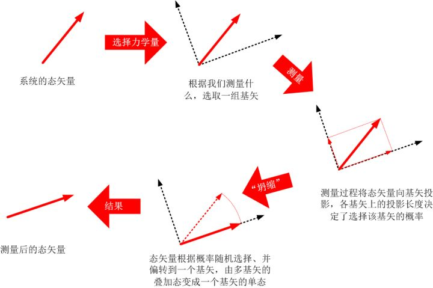

[未竟稿：希尔伯特空间](https://zhuanlan.zhihu.com/p/29757742)

*作者注：本文是最初作为这一系列文章中的一章，后来因为阅读的对象是一个初中小姑娘，考虑到可能超出她接受能力，所以匆匆结束了这一部分内容，没有拿给她看。因此本文不严谨之处可能甚多。欢迎大家斧正。*

------

​    前面我提到，量子力学中粒子的状态是由所谓的“量子态”-波函数来描述的，而它的**可观测量**，例如动量和位置，往往是不确定的。根据量子态的不同，人们可以预言，如果我们对它的一个可观测量进行观测，可能会得到什么样的结果，每个结果出现的概率是多少。而每一次观测，都会使得它的波函数突然地、随机地坍缩到某个状态。如下图所示：

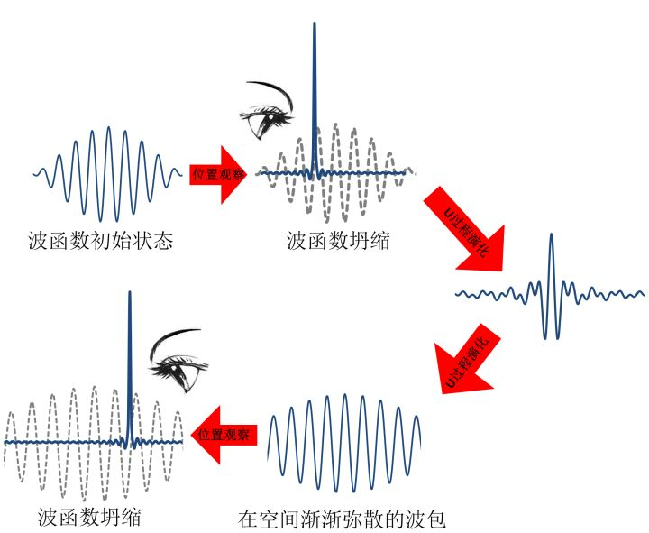

​    在冯诺依曼定义的量子演化第一类过程中，我们简单谈到了波函数坍缩的问题，并且谈到了测量在量子力学中的重要地位和奇特之处：测量不仅仅是**获得**了系统的状态，而且它**创造**了系统的一个状态。而这个状态的出现，是完全随机的。这就意味着，我们在对一个系统进行测量之前，我们没有办法事先预言结果是什么，我们所能预言的，是某个特定结果以多大的概率呈现在我们面前。

​    那么，现在我们来考虑一个问题，既然说对一个量子系统观测它的一个可观测量（比如说，位置或动量），得到的结果往往是用概率表示的不确定的数值。那么，是不是**所有的**观测，得到的结果都是不确定的呢？

​     这个答案当然是否定的。比如说，如上图所示，对粒子进行位置进行了一次测量后，波函数会坍缩成为一个尖峰的形状，这个尖峰只在一个地方有数值，其余的地方全部为零（这个尖峰叫做Dirac-Delta函数）。那么，对这个“尖峰”的量子态，我们再进行一次位置测量，会得到什么样的数值呢？很显然，根据玻恩规则，观测结果只可能出现一个数值，就是尖峰所在的位置，而不可能出现其他任何数值（因为其他位置波函数处处为零！）。也就是说，我们100%地得到一个完全确定的位置数值。那么，对于位置这个可观测量而言，Dirac-Delta波（或简称δ波）就是一种特定的波函数，它代表的量子态总是给出确定的粒子位置。

​    我们再举一个粒子，比如说这一次我们不观测粒子的位置，而只观测它的动量。有没有某一种量子态，能够使得我们得到确定的动量观测结果，而不是一个随机的概率分布呢？

​    在量子力学中，粒子的动量是和波函数的波长联系在一起的[[1\]](https://zhuanlan.zhihu.com/write#_ftn1)，一个确定的波长，就意味着一个确定的动量。动量的测量就意味着寻找波函数的波长。那么，我们就可以得到这样的结论：对于一个只有一个确定波长的波函数所描述的量子态，它的动量是一个确定的数值，而不存在任何随机的概率：只有一个确定波长的波在数学中叫做“平面波”，它是一个在整个空间中均匀分布的，向前后两个方向无限延展的正弦波[[2\]](https://zhuanlan.zhihu.com/write#_ftn2)：

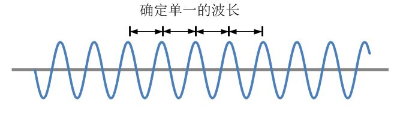

​    对一个这种平面波，我们说，如果对它所描述的粒子进行一次动量的测量，我们一定会得到一个确定的动量数值。

​    等等等等。

​    在量子力学中，对于某一个可观测量而言（位置、动量、能量、角动量……），如果有某个特定的量子态，处于这种量子态下的粒子，总是给出这个粒子相应的确定的观测值，那么，这种特定的量子态，就叫做这个可观测量的**本征态**。像前面的粒子，δ波就是位置的本征态，平面波是动量的本征态，等等。

​    事实上，人们可以证明，**任何一个可观测量，都有这么一组本征态。**处于这个本征态的粒子，我们观测它的这个力学量，得到的永远是一个确定的值。比如说，对平面波观测动量总是得到确定的动量，对δ波观测位置总是给出确定的位置……。这些本征态可能是有限个数的，互相离散的状态，也可能是无限多个的，互相连续的状态（连续态这一点我们省略不讲，原则上和分立态是一样的）。

​    好了，我们现在可以继续往下，谈一下量子力学中一个非常奇怪的原理：态叠加原理。

​    比如说，我们现在有一个粒子，这个粒子的波函数是这样的：

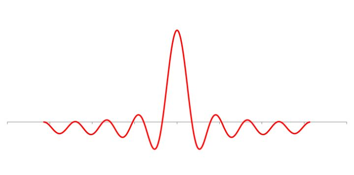

​    根据我们前面讲的，我们看到这个波函数，就大概知道这个粒子的大致情况。比如说，我们知道，如果我们观察一下这个粒子，我们最有可能在中间的位置发现它，而不大可能在边上发现它。

​    对于一个波动我们知道，它可以看做多个波叠加在一起形成的，比如说，我们可以把这个波函数看做是无数个“尖峰”高度不同的δ波，叠加在一起组成的：

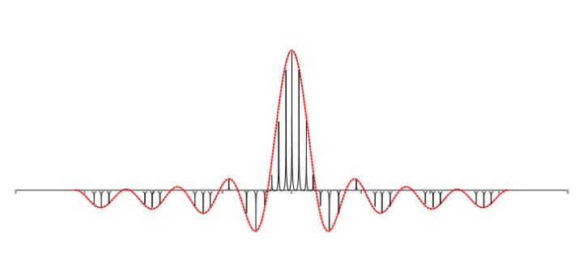

​     也就是说，这个波函数是由无数个位置本征态波函数加权后叠加在一起形成的。这在数学上非常简单，你只要把这些波乘以一个系数然后加在一起就可以了，如果是无数个波的叠加，只要做个积分就可以了。但是在物理上怎么理解？我们知道，每一个位置本征态代表着一个确定的位置。它们叠加在一起，就是无数个确定的位置加权后叠加在一起。这恰恰就是我们所说的波函数概率诠释：一个粒子的位置是多个确定的位置的叠加态，如果我们观察这个粒子，那么这个粒子会随机地从这些参与叠加的位置当中选择一个，出现那儿，而自己就“坍缩”成为这个位置的本征态。具体这个粒子会选取哪一个位置？概率由叠加时该位置的权重来决定。

​     当我们把一个波函数看做是若干其它波函数的叠加时，我们是不是只有一种叠加方式选择吗？答案是否定的。就好像5可以是1+4得到，也可以是2+3得到，还可以是1.5+3.5得到，……，总之，我们可以把5看做是无数种数字组合相加的到底。相类似地，一个波函数也可以看做是无数种不同的波的组合模式。例如，同样是前面这个波函数，我们还可以用一系列平面波叠加得到：

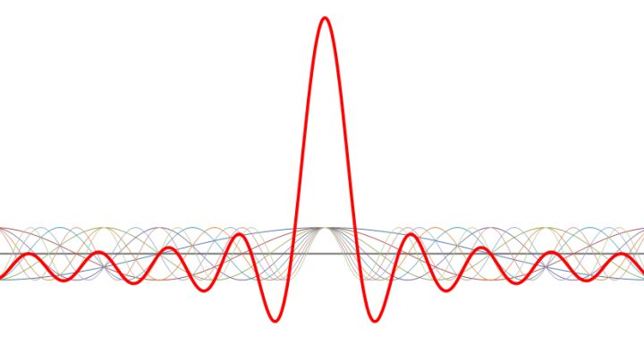

​     数学上可以证明，任意一个波，都可以看做是某一组（可能是无数多个）具有不同波长的平面波的加权叠加。给定一个波函数，我们可以把它“分解”成为这一系列的平面波以及它相应的权重系数，这在数学上叫做“傅里叶分析”。比如说我们讨论的这个波函数，它可以被分解成为9个不同波长的平面波的叠加（如上图所示）。

​    而我们刚刚提到，每一个平面波都是动量的一个本征态。它对应着一个确定的动量值，这个动量值是由它的波长唯一确定的。也就是说，波函数除了可以看做是若干个位置本征态的叠加以外，还可以看做是若干个动量本征态的叠加。

​    那么同理，我们就可以把这个波函数所代表的动量看做是若干个确定的动量值的加权叠加。当我们对动量做出观测时，我们得到的结果，就是在这样一些动量值中做出一个随机的选择。而我们会得到哪一个确定值呢？它的概率是由叠加的权重所决定的。

​    前面我们提到的，当我们观察粒子的位置时，它会从一个无处不在的状态（现在我们知道了这是一种无数个位置本征态的叠加态）突然概率性地收缩成为一个δ函数（其中的一个位置本征态），然后给出我们一个确定的测量结果。那么当我们测量动量时会发生什么呢？

​     非常相似，粒子本来处于多个动量本征态的叠加态。当我们观察粒子的动量时，它会从这样一个多个本征态叠加的状态突然收缩，概率性地选择这些本征态的其中之一，然后给出我们一个确定的测量结果，这个过程中，波函数的坍缩，并不是在位置上（真实空间中）发生坍缩，而是在动量上（波长的多选一）发生坍缩：

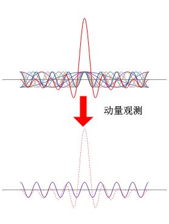

​     推而广之，一个粒子的波函数其实不光可以表示为位置本征态的叠加、动量本征态的叠加。对每一个可观测量，它的一组本征态，都可以通过叠加的方式构造出这个粒子的波函数。这就是态叠加原理的普遍性。态叠加原理其实起源于一个事实，就是量子演化的薛定谔方程是一个线性方程。熟悉微分方程的同学们都知道（不熟悉的可以直接跳过这段），线性微分方程的一大特点就是，任意两个解的叠加（线性组合），仍然是这个方程的解。也就是说，任何一个量子态都可以看做是一组其他满足薛定谔方程的量子态的叠加结果。

​     那么，自然而然地，我们可以把一个动量本征态（具有一定波长的平面波），表示为位置本征态的叠加。我们前面看到，动量本征态是一个在空间上无限延展，均匀分布的状态，这就意味着它需要在空间上前后无限远的范围内无穷多个δ波来叠加。也就是说，动量本征态是一个动量完全确定、但是位置分布在全空间的状态，也就是说，是一个动量完全确定，但是位置完全不确定的状态

​     反过来，位置本征态也可以用动量本征态来叠加。我们用不同波长的平面波来叠加，随着我们用到的各种波长数目增多，我们可以发现，叠加而成的波就会渐渐地从空间的均匀分布向中心集中。波长数目用到的越多，这个波就越集中，中间出现的波峰就越“尖”。如下图所示，我们可以比较2个不同波长的平面波叠加，以及4个、8个、16个叠加的情况，就可以看出这种向中心的尖峰集中的趋势。我们可以合理得到结论，当我们用到从零到无穷大分布的无数个波长平面波叠加时，我们就可以得到一个无限窄的Delta波。这就是我们如何用动量本征态叠加得到位置本征态的方法。我们可以看到，一个位置本征态是由无数个波长叠加成的，也就是说，位置完全确定，但是动量却完全不确定。

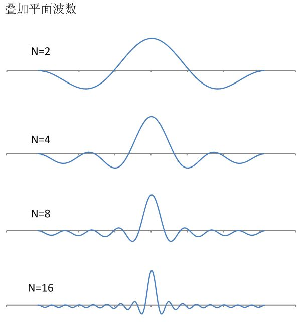

​     那么我们可以看到很明显的趋势：当波函数在空间分布非常窄（极限情况是δ波）的时候，它的波长分布非常宽（极限情况是平面波）；而反过来，当它在空间分布非常宽的时候，它的波长分布非常窄。这和我们前面提到的不确定原理不谋而合：动量不确定度和位置不确定度的乘积不小于一个数值，动量越确定，位置越不确定，反之动量越不确定，位置就越确定。

​    因而我们可以看到，不确定原理其实是态叠加原理和玻恩规则的自然结论。

​    现在，我们再从另外一个角度来看量子态。

​    前面在讲经典力学的时候，我们曾经用了很大量的精力，来说明一个系统的演化如何表现为相空间中的轨迹。系统的不确定性又是如何表现为相空间中粗粒的拉伸、扭曲、缠绕的。相似地，在量子力学中，也有一个类似相空间的概念，叫做希尔伯特空间。

​    什么是希尔伯特空间呢？这个理解起来可能有一点抽象，我首先做一个一个类比：经典的速度矢量。

​     你已经学过了笛卡尔坐标系，在笛卡尔坐标系中，我们用两个方向（x轴，y轴）就可以覆盖所有的平面空间。任何空间中的任何一个点，都可以用它在这两个方向上的投影来表示，这就是这个点的坐标。当然，你们还没有学过的是，空间中的任意一点W，其实可以用一个从原点出发的“箭头”来表示，这个“箭头”有方向，也有长短，在数学上叫做“**矢量**”或“**向量**”。在x轴和y轴上分别两个长度为1的矢量**X**和**Y**，可以通过把**X**和**Y**叠加的方式表示任意的一个点：

![[公式]](https://www.zhihu.com/equation?tex=%5Cmathbf%7BW%7D%3Dv_%7Bx%7D%5Cmathbf%7BX%7D%2Bv_%7By%7D%5Cmathbf%7BY%7D) 

一般我们会把上面的写法简化，把两个坐标轴上的单位矢量略去，写作如下形式（列向量）：

![[公式]](https://www.zhihu.com/equation?tex=%5Cmathbf%7BW%7D%3D%5Cleft%28+%7B%5Cbegin%7Barray%7D+%7Bc%7D+v_%7Bx%7D%5C%5Cv_%7By%7D+%5Cend%7Barray%7D+%7D%5Cright%29) 

如下图所示：

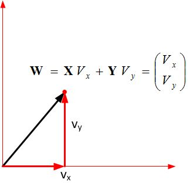

​     我们知道，任何一个速度都可以看做几个方向上的速度叠加。例如，向东北方向的一个速度，可以看做向东的速度和向北的速度两个分量的叠加。对一个速度而言，它所处的坐标系是可以任意选取的。如下图，一个速度w，它在坐标系1（红色）中，是由vx和vy两个速度叠加的，而在坐标系2（蓝色）中，是由ux和uy两个速度叠加的。总之，在一个平面中，我们只需要两个坐标轴，就能表示所有的矢量。对于同一个矢量，我们选择不同的坐标系，对应的叠加方式（系数）就不同，因而，它的坐标表现就不同，例如，在坐标系u中，W的坐标为（a，b），而在坐标系v中，它的坐标就是(x,y)。相应地，在三维空间中，我们需要三个方向。一旦这三个方向确定了，整个空间的所有的点就确定了。

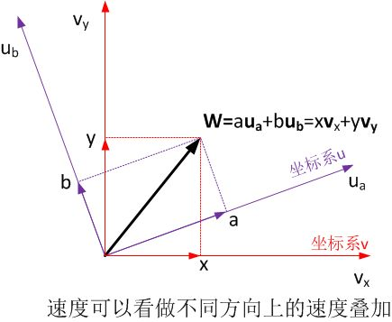

​     那么，我们把一个波函数也类比为这样一个矢量，同样道理，任意一个波函数，我们都可以看做其他几个波函数叠加而成的。如下图，一个波函数Ψ可以看做是一组波函数ψ的叠加，也可以看做是一组波函数φ的叠加。就像是在平面和空间当中一样，我们也可以选择一组ψ或者一组φ，使得任意一个波函数都可以用这一组波函数的叠加来表示。因而，量子态又被称为“**态矢量**”。而我们选择的一组ψ或φ，被称为一组“**基矢**”，它担当着类似平面坐标系中的坐标轴的作用。不同的系统，要想覆盖所有的量子态，所需要的基矢数目不同。由一组基矢如果可以覆盖全部的量子态，那么这组基矢就可以定义一个量子态的空间（“张成”一个空间），这就是希尔伯特空间。

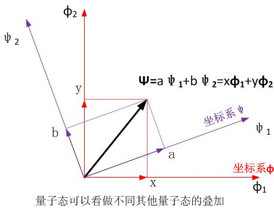

​     在前面速度矢量的例子里，在一个平直的三维空间中（欧几里得空间），任意一个矢量都可以用相互正交的三个坐标轴表示，我们可以选择任意地一组相互正交的坐标轴，用它们的叠加就可以表示出空间中所有的矢量。对一个一般的欧氏空间，要想把空间中所有的都矢量表达出来，这个欧氏空间有几个维度，就需要有几个这样的正交坐标轴。

​    任何一个力学量的一组本征态，都有一个非常有意思的特点，让它们表现的非常像欧氏空间里的坐标轴：

- 欧氏空间中任意两个坐标轴不重叠，或者更进一步，相互正交。一个力学量的一组本征态互相正交；
- 欧氏空间中的所有点都可以用一组坐标轴来表示，希尔伯特空间中的任何一个量子态都可以用一个力学量的一组本征态来表示；
- N维欧氏空间中一组n个坐标轴，是能够表示空间中所有点所用到的的最少数量的坐标轴，一个力学量的一组本征态是能够表示希尔伯特空间中所有量子态所用的最少基矢。

​    简言之，任何一组本征态，它们两两之间互相正交，它们可以组合成为所有可能的量子态，并且它们是能够组合成所有量子态所用到的最少数量的基矢。用数学语言表述，它们可以构成**一组最简完备的基矢**。通俗一点讲，就是一组本征态刚刚好够用来构成一组完整的坐标轴。

​     那么，我们很自然地，选取某个力学量的一组本征态作为基矢（“坐标轴”），用它来表示所有的波函数。任何一个波函数都可以看做是这组本征态的叠加。而每个本征态，就代表着一个确定的力学量取值。因而，任何一个量子态所代表的力学量，都可以看做是它所有可能取值的叠加。

​    好了，我们开始领略到态叠加原理的怪诞所在了？我来举个例子。比如说，我们选取位置的本征态作为一组基矢。那么任意一个量子态，都可以看做是这组基矢的叠加：

​    这里解释一下，这个公式中用到了狄拉克的量子态表示方法，|状态>，这个括号表示的是一个量子态（区别于经典状态）。在本文的范围内，你可以忽略它。

​    我们常听到这样一种解释：任意一个粒子的位置，都可以看做是这个粒子在空间所有位置的叠加。这让人十分的费解，如何理解空间所有位置的叠加？好吧，这就回到了我们前面讲到的量子幽灵，即粒子同时既在A点，又在B点，又在C点，总之，它无处不在，又无处存在。

​    然而，更加严格地讲，这种位置叠加的理解是有问题的。因为我们前面谈到的那个叠加，说的是是量子态的叠加，而不是可观测量的叠加。上面这个公式的真实含义是这样的：

​    某个粒子位置表象的量子态，等于粒子在空间中所有可能位置的本征态的叠加。

​     这看起来很抽象，更直观的意思是说，一个量子态等于每个位置的本征态的叠加。也就是说，当我们想知道一个粒子位置的时候，我们首先要知道这个粒子的量子态。而这个量子态相当于粒子每一个可能位置对应的本征态的一种加权叠加。而最后，这个叠加起来的量子态给出来的位置信息，就是每一个可能位置的概率。

​    所以说，**位置从来都不能叠加**，而是描述位置的**量子态才可以叠加**。我们要不断地给自己洗脑：当我们不观测某个粒子的时候，它的位置在哪里？答案是，它的位置**毫无意义**！它**只有量子态（波函数）在空间的分布，而没有“位置”**。“位置”只是对粒子经典运动状态的一种描述，而在量子世界，我们只知道量子态，并且只需要知道量子态。而在量子态中，所叠加的，只是位置的概率而已。同理，当我们谈论双缝干涉中粒子是如何**同时穿过两条缝隙**的时候，我们应该知道，如果我们没有做出观测，粒子穿过哪一条缝隙是一个毫无意义的问题，我们只知道粒子的量子态在空间的分布同时穿过了两条缝隙。

​    那么“粒子同时穿过了两条缝隙”，这个说法对吗？如果这句话指的是粒子的波函数（量子态）同时穿过两条缝隙，那么它是对的，但是如果你要想象成为经典图像，粒子在穿过双缝时，有两个确定的位置和路径，像“分身法”一般同时穿过，那就大错特错了。

​    由态叠加原理引出的还有比这个更加变态的话题，比如说量子纠缠、量子延时擦除、还有量子芝诺效应，等等，这些无一不让人感觉大脑爆裂，但是最大名鼎鼎的就是那种著名的薛定谔猫。我们后面再来谈它。

​    那么最后，我们来看看在希尔伯特空间中，一个量子态的“坍缩”是怎么一回事儿。

​    我们提到，在希尔伯特空间中，一个量子态可以表示为一个单位长度[[3\]](https://zhuanlan.zhihu.com/write#_ftn3)的“箭头”（矢量）。系统的演化就是这个矢量在希尔伯特空间中的旋转。那么，对这个系统进行测量的时候，发生了什么？它发生了这么几个步骤：

1. 我们对这个系统选择了一组“坐标系”（基矢）。前面我们知道，系统的基矢是可以任意选择的，而在我们测量的时候，根据我们想要测量的具体可观测量，我们人为地确定，这个系统的基矢是这个可观测量的一组本征态。比如说，测量动量的时候，就选择动量本征态作为希尔伯特空间的基矢。
2. 系统的态矢量因此就表示为这一组基矢的叠加。当我们进行测量的时候，我们对态矢量做了一个投影，投影到它的其中一个基矢上去，因而系统的状态就变成了它的投影了。
3. 系统的态矢量到底会选择哪一个基矢投影过去呢？这取决于这个态矢量与哪一个基矢最“靠近”。也就是说，它的方向最偏向哪一个基矢，就最可能投影到哪一个基矢上去。它在某个基矢的投影长度，就是决定了它投影到该基矢上的概率。
4. 每一个基矢，对应着一个实数，叫做本征值[[4\]](https://zhuanlan.zhihu.com/write#_ftn4)。态矢量最终选择投影到哪一个基矢，测量的结果就得到相对应的本征值。

​    由此可见，在量子力学中可观测量不再是一个**数值**，而是一个**算符**。什么是算符呢？算符就是一种针对量子态的操作规则和运算法则。对于一个态矢量，我们用某个算符作用于它，就意味着我们根据算符的规则来对这个态矢量进行变换，例如增长、缩短、旋转，等等。一个力学量的算符实际上包含了选择基矢、投影、求特征值等一系列操作。

​    关于这一点和经典力学非常不同。有个不太严谨的说法，因为测量过程就是我们对系统进行某种**干预**的过程，只有在干预系统时，我们才能得到系统的反馈，因而得到想要的信息。因而测量就是按照某种规则对系统做出改变，我们通过这种改变获得想要的结果这就是为何可观测量不再是一个不动的数字，而是一个变换系统的算符。

​    最后，我们再来看看本征态的含义：本征态就是这样一种特殊的态矢量：力学量的算符作用到它身上，不会改变它的方向，只能进行伸长或缩短[[5\]](https://zhuanlan.zhihu.com/write#_ftn5)。因而它只能投影到他自身。这就是本征态永远都可以获得确定的测量值，并且测量前后状态不改变的原因。

​    本章我尽量通俗地解释了希尔伯特空间和态叠加原理，非常多的数学思维，但是希望你可以大概领略量子力学中因为态叠加而产生的诸多怪异行为。而态叠加产生的最著名的两个妖孽，一个是**薛定谔猫**，另一个是**量子纠缠**。下面我一一道来。

------

[[1\]](https://zhuanlan.zhihu.com/write#_ftnref1)德布罗意波的一个最基本关系就是，粒子的动量与他的波长成反比，确定的波长就意味着确定的动量。

[[2\]](https://zhuanlan.zhihu.com/write#_ftnref2) 严格说，应该是它的实部是个正弦波，整个复函数波是在复空间旋转的复数。这一点，我们在本文加以简化，只用实部来表示。

[[3\]](https://zhuanlan.zhihu.com/write#_ftnref3) 因为一个量子态所可能产生的可观测量的概率加和必须为1，这一点你暂时可以不用细究。

[[4\]](https://zhuanlan.zhihu.com/write#_ftnref4) 本征态和本征值的问题，是线性代数中最核心的问题。现在你只需要知道存在这个本征值就可以了，如果细究，还需要补充很多数学知识。

[[5\]](https://zhuanlan.zhihu.com/write#_ftnref5) 真正有严格物理含义的态矢量长度为1，这是由概率性决定的。所有长度不同、但是方向相同的态矢量，对应的是同一种量子态，没有区别。

