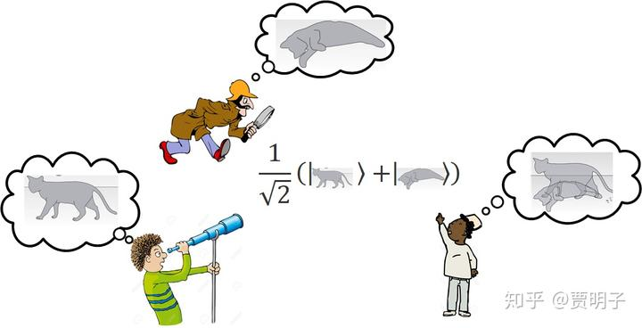
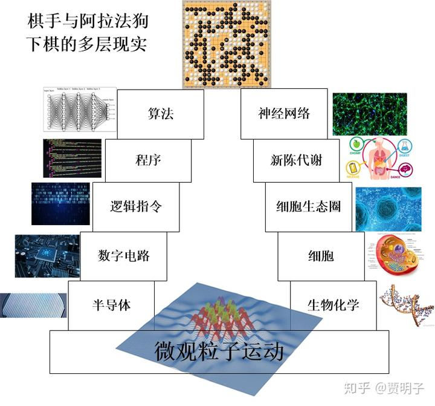
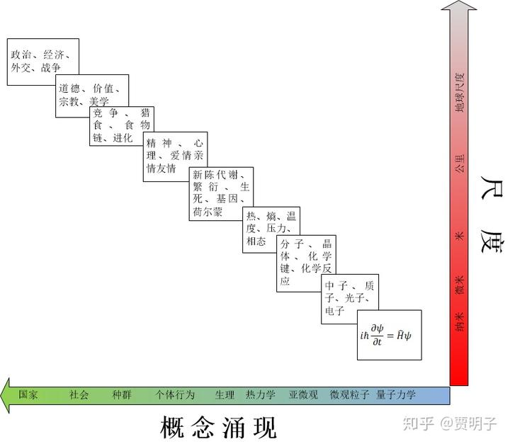
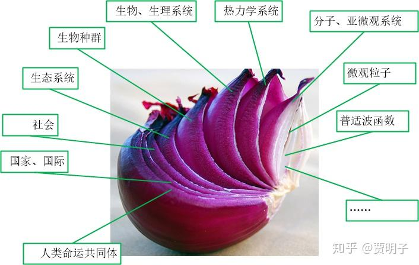

# 现实是个臭洋葱

> **“Ogres are like onions.”**
> **“They stink?”**
> **“Yes. No.”**
> **“Oh, they make you cry.”**
> **“No. Layers. Onions have layers. Ogres have layers. Onions have layers. You get it? We both have layers.”**
> **“Oh, you both have layers. Oh. You know, not everybody like onions.”**
> **“食人怪就像洋葱”**
> **“它们都很臭？”**
> **“是的……，不，不是的！”**
> **“啊，它们都让人哭泣。”**
> **“不，分层！洋葱有很多层，食人怪有很多层，明白吗？我们都有很多层。”**
> **“啊，你们都有很多层。你知道吗，不是每个人都喜欢洋葱的。”**
>
> **-《Shrek》中Shrek和驴子的对话**

本章题记里面引用的这段话，出自你看过的动画片《Shrek》中Shrek和驴子的一段对话。

我发现用这段话来描述“现实是什么”这个问题再也合适不过了。没错，**现实就是个萌萌哒洋葱头。**

我们先小小地皮一下，用文青的角度来看看现实。现实是无奈的，当我们把它表面温情脉脉的皮剥开，刺鼻的味道就会冲出来，让我们感受到它人畜无害的外表下层层包裹的辛辣，如果我们没有能够立刻把自己保护好，我们将会无奈地哭泣。

呵呵，很有哲理吧。真是一碗不错的鸡汤。

但是我们这里所关注的，是另一件事：**现实和洋葱一样，是一层一层的**。

我们回到前面曾经提到过的“偏好基问题”。偏好基问的，等于是这样一个问题：既然多世界理论中的现实，就是那个以矢量的形式生存于希尔伯特空间的普适波函数（universal
wavefunction）的诸多分支之一，然而希尔伯特空间只是一个抽象空间，在我们日常所经验的，是存在于真实时空中的真实事件，是波函数这个抽象现实的“分支”在我们“真实现实”中的体现，那么这些“分支”到底是怎么从这个普适波函数中产生的？

我们前面曾经提到过，作为一个抽象矢量，普适波函数在数学上满足一切矢量的性质，包括可叠加性，以及这种可叠加性的任意性。我们可以选择任意的方式来看待这个矢量的叠加：就像是“东北”可以看做是“东”和“北”的叠加，也可以看做“东偏北10°”与“北偏西10°”的叠加，它们是不确定的。这在现实中是什么意思？如果我们认真地把波函数以及波函数演化所遵循的线性幺正规则看做是一种对现实的真实反映，那么这种性质必然就意味着，不但现实是**多重的**，而且这种多重性还是**任意的**：我们这个自然界的现实，是以无穷多种、任意的方式来分支的。不但死猫存在，活猫存在，死猫+活猫也存在，甚至猫+狗也存在。

从数学上讲，所有的这些“现实的分支”是等价的，而多世界理论从来就没有在它的基本假设中明确这些分支到底是如何定义的：哪一种方式的叠加才是我们“真实”的现实的叠加，而哪一种方式又不是。那么我们必须要以同等认真的态度来对待所有这些看似荒谬、没有明确定义的“现实”。也就是说，如果我们不在多世界理论中**附加一个打破这种矢量空间的性质的额外假设**，不论我们如何操作、推论我们的理论框架，我们都无法获得一个明确的、毫不含糊的对现实的定义。不但是多世界的理论框架不行，我们前面提到的退相干理论关于偏好基的环境选择（Eiselection）和量子达尔文主义，也不行。鉴于这种任意性，我们所经验的，就不可能是一个真正的确定的现实。

退相干理论关于偏好基的解释，并没有解决我们经典世界的现实性的问题，它不过是解决了这样一个问题：我们的世界总是**看起来像是**只有一种明确的叠加方式 – 由我们的经典世界叠加而成，而不是那些荒谬的“量子”世界；是由那些只有死猫，或者活猫，而没有a、b其它任何取值的（a死猫+b活猫）的经典世界的叠加。但是，退相干理论并没有提供那个能够打破矢量空间性质的额外假设（当然，退相干理论的目标就是，不需要这些假设，仍然完成这个不可能的任务），因而它的结论也就只能是，**它只是看起来好像这样（FAPP）**，而实际上它只是一种幻觉。也就是说，它没有能够提供一个明确的、没有模糊性的现实分支的定义。

退相干告诉我们，由于我们总是只能观察这个宇宙的一部分，因而我们总会面对一个系统和一个环境。那么，我们、系统、以及环境构成了一个三足鼎立的整体。由于无所不在的量子纠缠，系统的绝大多数性质与广袤无垠的环境纠缠在一起而“弥散”在一个广域的空间中，而只有极少数的性质没有受到这种纠缠的影响因而仍然“集中”在系统的一个定域空间中。因而在我们无法对整个环境进行全面观察的情况下，我们只能获取那部分没有被环境纠缠的信息：系统的信息在被我们接受之前，先被环境仔细地审查过（censorship），只有通过这个审查的信息，才能被我们看到，通不过的，就不能被我们看到。我们所谓的多世界分支就是波函数所包含的信息被环境过滤之后，表现出的一个特定的叠加方式：只有按照这种叠加方式叠加，它的每一个基底才不会泄漏到环境中去。因而展现在我们面前的，就是这种特定方式叠加的多世界。其实，说到底，我们的经典现实之所以与众不同，全凭两个字：

**定域。**

退相干过程所选择的“偏好现实”，是那些定域的现实。也就是说，我们只观察这个宇宙的一个局部就感知的现实。而更多的、任意的广域现实，它们“弥散”在相互纠缠的广袤宇宙之中，无法通过对局部的观察而感知。前者就是我们的经典现实，但是它只是管中窥豹的一小部分，而后者则隐藏至深。的就像我们前面 [量子现象的消亡史](http://zhuanlan.zhihu.com/p/34358814) 中举的那个双胞胎实验的例子一样。从定域（单独的教室）看到的完全随机的结果，从广域（同时观察两个教室）看却是有规律的分布。

对我们这种观察范围有限的生物而言，永远只能感知到定域现实，而很难感知到广域现实。定域现实就是我们的经典世界，而广域现实则是怪异的，任意的、模糊的、没有定义的 – 然而多世界理论告诉我们说它们必须存在。这是一组荒诞的爱丽丝奇境。或者我们应该这样说：

**波函数所对应的现实，是兔子洞里面的那个荒诞的爱丽丝奇境，而我们看到的，是兔子洞上面的那个无聊的经典世界。**

这里有两个问题：

第一、我们知道，系统的划分永远都是任意的，系统和环境的界限永远都是按照观察者的主观意愿完成的，如果我们把系统和环境看做一个整体，那么所有的那些荒诞的爱丽丝奇境全都存在、而且是以一种无法定义的任意方式存在。作为一个与外界纠缠在一起的宇宙的一部分，我们以“井蛙”的视角，深陷宇宙的多重现实之中，我们只能经历这个多重现实中的一个经典分支。而在一个外部的，眼光高于我们的“鸟瞰”视角观察者看来，我们的现实，其内核是模糊不定的，没有明确定义的。我们**不但是深陷多重现实，而且是同时以无穷多种方式深陷其中[[1\]](https://zhuanlan.zhihu.com/write#_ftn1)，**我们的现实分支，也是任意的、不明确的。一个没有明确定义的现实，如何会被称为现实？按照多世界理论，如果我们能够很精确地操作这个宇宙的每一个自由度，我们完全可以还原出各种匪夷所思的现实：既死又活、既是狗又是猫、既是你又是我，等等。

第二、即使是我们不去打破砂锅问到底，而只满足于我们看到的这个表象，也存在一个问题，那就是环境的审查本身，也并非完全彻底的，环境的筛子筛孔是粗糙的：退相干的过程是**快速**的，但不是**瞬时**的；干涉变得**难以**被观察到，但并没有**消失**；它选出了**近似**于经典世界的分支，但并非**精确**；它使得密度矩阵非对角元素**趋向**于零，但并非**变为**零，如此等等。例如说，一个粒子的确定位置，在环境-系统完全定域的相互作用之中，可以完整地通过环境的审查（也就是说，粒子的定域化，其实源自相互作用的定域化），但是，那些与确定位置非常接近的、有着“不太确定”的位置的粒子，也会部分地通过这种审查。最后通过环境这个筛子的，并非是粒子的确定位置，而是粒子的一个非常窄分布的位置，它是不确定的。如果我们能够观察我们的世界足够细致，我们会发现所有的粒子仍然是不确定的，它们之间仍然存在着某些干涉。我们仍然有极小的概率观察到一只既死又活的猫。这在现实中（FAPP），可以用它近似地计算世界的演化，但是它并非严格。

所以，从多世界理论的数学框架中，**我们其实找不到一个严格的、真实的、明确的关于现实的定义**。退相干理论关于偏好基的讨论，可能算是架设了一个通向这种现实的桥梁，但是桥梁的那一头是什么，多世界理论却给不出确切答案。本章要讨论的一个核心问题就是：现实，并非明确定义的、“原本”就存在的一个“本质”，而是在一种在不同层面上表现出来的性质。这种在不同层面上的不同表现，我们可以称之为“**涌现**”（emerge）。

我们可以举一个类比。例如说，我们正在和阿尔法狗下围棋。那么我来问你，我们在干什么呢？

我们不是在和阿尔法狗下棋吗？不是吗？

好的，我说，在我们这个层面，是的。但是**严格**来讲，到底在发生着什么？阿尔法狗是什么？阿尔法狗会下围棋吗？

我们说，围棋是一个游戏，其实就是按照一定逻辑规则进行的逻辑运算。阿尔法狗是一台电脑吗？应该说不是，它可以存在于这一台电脑中，也可以存在于另外不同的电脑中，或者是手机中，平板中，甚至是某些其它的非电子类的逻辑处理系统中，它是一个程序，一个各种逻辑指令和逻辑运算的集合。比如说，我们和它在一个电脑中下棋，阿尔法狗在某一点下了一个白子，它真的是下了一个白子吗？其实不是，它只不过是给显示屏发了一个指令，把显示屏上某一块个位置的像素变成白色：它给通往显示器的电线发出了一个怪异的电信号 – 一组按照某种波形变化的电流脉冲，这组脉冲包含了电子的某种特定运动，这种运动导致了显示屏上面相应位置的液晶分子按照某种方式旋转，最终导致这个位置的光变成了白色。而我们在下棋的时候，肯定不会去琢磨这中间电子的运动、液晶分子的旋转等等，如果我们陷入其中，我们根本就不可能得到“下了一个白子”这种概念。我们想的其实很简单，“看，这只狗在这里下了一个白子”。

而它是如何做出决定在这个特定的地方下这个白子的呢？再一次，我们“严格地”来看一下。这是阿尔法狗的程序中按照一种逻辑运算（可能是很复杂的运算）计算的一个结果。而这种逻辑运算又是怎么完成的？它是由很多很多“单元”的逻辑过程组成的：与、或、非、与非等等。而进一步，这些单元逻辑过程，其实是由电脑中一个个的逻辑电路完成的：一个高电平和一个低电平通过一个“或”的逻辑电路，就成为一个高电平。而这种逻辑电路，其实是用电子元件“逻辑门”对电子的操作完成的，它在某些时候让电子通过，或不让电子通过。

而逻辑门又是如何实现对电子的操作的呢？这是大量的按照特定晶体网格排列的半导体（例如硅等）原子等和局部的掺杂元素在一起共同作用，形成的价带结构，电子在其中跃迁的过程中完成的。而电子又是如何在半导体的价带结构中跃迁呢？这才涉及到我们一直谈论的电子的种种量子性质：叠加、纠缠、幺正演化等等。

那么，当这么层层深入下去，直至量子底层，是的，我们的确会发现所有这些电子的运动充满了不确定和任意性。但是，如果我们只关注这些底层的电子、以及半导体的原子的运动，无论如何我们是不可能得到“下棋”这个概念的。即使是我们把整个电脑的所有微观粒子全部研究得清清楚楚（这将是一个现实中不可能完成的任务！），我们仍然只知道一堆粒子的运动，我们甚至不知道逻辑电路的存在，当然不可能知道下棋是个什么东西。

当我们把眼光向上移动，不去关注单个的电子和原子，而是在一个逻辑门的尺度上观察这个逻辑门的变化规则，我们就完全忽视了电子的量子效应。我们当然从原理上知道，逻辑门的电路必须是在建立量子力学的基础之上的，并且我们看到的电路的行为，必然是退相干的结果，但是我们在这个层面上不关心这个退相干是如何发生的，更不必关心退相干这个链接宏观与微观的桥梁的“另一头”是个什么样的现实 – 过渡追求这些细节不但毫无用处，反而会使得逻辑电路的整体概念支离破碎。我们所关心的，是一个电平通过一个逻辑门之后，输出的是一个什么样的电平：这完全是宏观概念。

那么，在一个个逻辑门之上呢？是巨大的数字电路系统，每一个芯片，都是无数个逻辑门之间按照复杂的关系组成的整体。按照这个数字电路系统的宏观构架，我们就有了CPU、GPU、存储器、I/O系统等等数字模块。例如说CPU，我们就不再关注每个逻辑门的情况，而是关注CPU的每个管脚的输入输出模式：各种指令集。如果以单个的逻辑门的眼光，我们永远不会理解CPU的运行模式。

那么又是什么在支配着整个数字电路的运转呢？是一系列的逻辑指令。我们根据数字电路的特征，用这些电路可以理解的二进制语言，来命令它们如何运转。这些二进制语言，是一串连绵不绝的0和1组成的数字串。我们拿到整串的逻辑指令，完全可以预言整个电路的运行结果，但是我们仍然不知道这串逻辑指令的意义何在。它与人类想要实现的功能之间，必须有机器语言和程序语言之间的翻译过程。于是有了各种程序设计：比如说汇编、C++、Fortran等等。我们可以读懂这些程序的指令以及它所想要实现的过程：算法。

算法则是把我们真正想要完成的功能进行分析、分解、数学模型化等等之后，把“下棋”这个宏观规则（例如有眼杀无眼、长气杀短气等等）拆解成复杂的数学运算过程。它本身是一个巨大的逻辑运算集合。而所有的这些逻辑运算整合在一起，就实现了下棋这个功能。

然后，根据运算结果，阿尔法狗才能实现诸如“**把显示屏上的某块区域变成白色**”这种人机交互层面的动作。然后，下棋的我们把这种显示屏上的变化诠释为“**下了一个白子**”。

那么，“严格”将，阿尔法狗到底是一个什么“现实”？它是一大堆的微观粒子的运动和它们之间的相互作用吗？在微观层面上说，是的。但是，无论我们对这堆微观粒子的运动理解得有多深，我们都不可能产生“下棋”这样的概念。所以说，这种强还原论的说法又不对：它无法反映出我们游戏的层面上“下棋”这个现实。阿尔法狗**绝不仅仅是一堆微观粒子的运动的集合。**而反过来，我们知道在最微观的底层，根本就没有一个明确的“现实”的定义，但是随着我们层层向上，我们却产生了各种明确的现实的定义：逻辑门、数字电路、CPU、指令集、程序、算法、人机交互、乃至下棋。这就是“层展”的现实。他在每一层都不“严格”，但是却确确实实存在。

现在，再反过来看看阿尔法狗的对手，作为棋手的我们。“严格”讲，我们是什么？按照相同的思路：

- 微观层面，我们是一堆微观粒子的运动，是一个模糊的现实，通过退相干我们能接收到相对精确的现实分支。
- 微观粒子增多，则产生了化学反应、以及化学反应系统。
- 大量的化学反应耦合，出现了大分子诸如蛋白质、核酸，然后与身体的内环境相互作用，产生了这些大分子的“生态圈”：细胞。
- 各种细胞之间共生，互相交换物质和能量，支持着对方的生存，也被对方所支持，形成了体内的细胞之间的生态系统：组织、器官。
- 所有的这些细胞，包括我们自己的细胞、外来细菌的细胞、以及大量的病毒，在一起维持着我们的新陈代谢。
- 神经元细胞形成的巨大网络，通过整个新陈代谢系统，产生生物电、然后形成神经网络运算，有了思维和意识。
- 通过手眼等人机交互器官，我们与阿尔法狗下棋。

这也是同样的层展结构。从微观粒子运动的角度，我们永远不会有“人”这样的概念。但是即使是在宏观层面上，“人”本身的定义也是模糊的，何为“人”？所有皮肤下包裹的血肉总和吗？显然不对，我们呼吸、吃饭吸入的空气、食物算不算？进入身体的食物从什么时候开始才算是成为我们的一部分，变成“人”的血肉的？人不但包括了自身的细胞，还有大量外来生物：各种细菌之类，它们和我们的细胞共生，我们离不开它们，它们离不开我们，那么它们又算不算“人”的一部分？人本身就是一个由大量微生物组成的生态系统，它的定义也是模糊的。只有在生物的层面上，抛弃那种还原论式的对严格的追求，我们才能定义一个“人”。同理，“生存”和“死亡”也是同样的模糊概念。只有在生物学的层面，我们才能真正定义省或死。但是，这些不严格的概念从层展中涌现，又实实在在存在着。

那么，现在你应该大致了解了何为“涌现”。所谓涌现，指的是一个系统的尺度和复杂度在不断放大的过程中，由于系统的各个子系统之间的关系越来越复杂，系统整体渐渐地出现了小尺度中不曾有的概念。在不同的层级，这种概念会逐步显现。涌现出的概念，并没有一个明显的边界，但是在不同尺度的层级却是不可或缺的现实内核。

- 从量子力学底层的普适波函数，如果考虑越来越多的子系统和复合系统，那么退相干的作用就会逐渐显现，使得“偏好现实”浮现出来，于是就有了“坍缩”的概念，然后有了我们熟知的具有定域位置的微观粒子的概念，进而有了整个经典世界的概念。
- 多个微观粒子结合形成原子，原子之间相互作用，电子之间相互作用，会形成单粒子中不存在的化学键，这种化学键一步步复杂，最终形成各种复杂的分子，分子是多种微观粒子之间结合的一种“样式”（pattern）。
- 大量的分子聚集在一起，就形成热力学系统，于是我们有了温度的概念 –
  单个或少数粒子是没有办法定义温度的。相似地，压力、熵、相态等概念就出现了，它们是大量热运动粒子结合的一种样式。
- 复杂的化学系统使蛋白质和遗传物质成为现实，同时开放的热力学系统与环境的不断物质和能量的交换，使得系统得以持续吸收负熵，不但使得本系统不至于由于热运动而崩解，而且使系统的有序度和复杂度不断增加。于是生命的概念产生了。生死、代谢、遗传等概念就是这种复杂的开放系统的一种结构图样。
- 生命必然伴随着整个生命系统的控制和指挥系统。随着生命复杂度的增加，中枢神经系统越来越强大，于是意识、情感、心理等现象次第浮现。这些高级精神现象，就是复杂的控制系统的一种结构图样。
- 个体生命众多的系统中，个体之间相互形成复杂的关系：捕食、共生、寄生等等。不同物种之间竞争同时又合作，于是生态这个概念产生了。个体、种群、种群间的种种关系，就是生态系统的结构图样。
- 更加复杂的生态系统就形成了我们人类的社会。人与人之间，就像生态系统中一样，存在着相互竞争又相互依存的复杂关系。于是那些促使社会稳定的诸如价值观、道德、美学、宗教等概念产生了。无独有偶，它们是社会结构的一种图样。
- 庞大的社会最终产生了领导者，于是国家产生了。政治、经济、外交、战争等，是国家、国际结构的一种图样。

我们可以看到，不同的尺度，不同的层面，我们所面对的，就是不同级别的现实。没错，以强还原论的角度，一切的一切最终还是起源于那个终极的微观现实。但是强还原论者把一切归结为微观机制的做法**不但是极端的，而且是错误的**。因为只有当我们到达了某个层面，相应的现实才会涌现出来。单个粒子不会坍缩，单个原子不会有化学反应，单个分子不会有温度，单个封闭系统不会有生死，单个人不会有道德，更不会有国家。

这，就是我们洋葱中的现实结构。

大千世界是从粒子相互作用中涌现的现象，经典世界是从量子世界涌现的现象，定域化的偏好基是从普适波函数中涌现的现象。我们可以一层层向下追寻。**而洋葱是没有心的，**我们一直层层剥开，最终到达的，并没有一个硬核的“终极现实”在那里等着我们。循着这条还原论的路径探幽溯源，那么我们寻求“终极现实”的努力将会注定失败。但是，这一层一层的现实，却有着一个共同的特征，这个特征才构成了“终极现实”的内核。我们下章再讲。

------

[[1\]](https://zhuanlan.zhihu.com/write#_ftnref1) 以量子力学的语言来说，就是我们看到的是一个improper mixed state，而不是一个真正的 mixed state。

编辑于 2023-01-26 21:27・IP 属地未知

