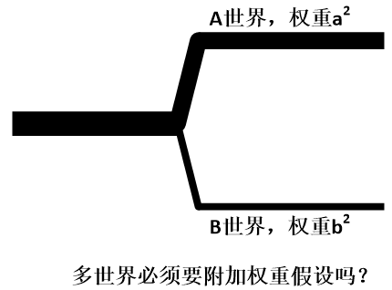
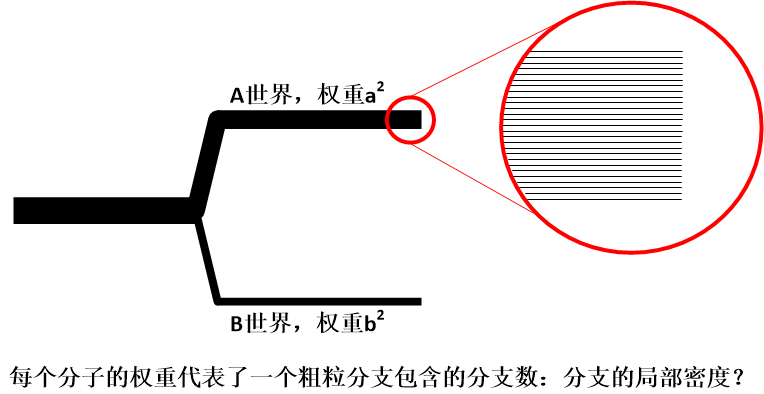
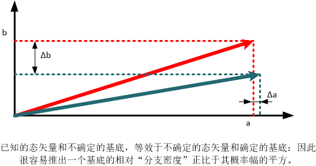

# 量子世界的决定论、概率、以及拉普拉斯之妖

**“I went to Godel, and I asked him, ‘Prof. Godel, what connection do you see between your incompleteness theorem and Heisenberg’s uncertainty principle?’ And Godel got angry and threw me out of his office!”**

**“我找到哥德尔，问他：‘哥德尔教授，您觉得您的不完备定理和海森堡不确定原理之间有什么内在联系吗？’哥德尔听后非常生气，把我轰出了他的办公室！”**

**– 约翰.惠勒[[1\]](https://zhuanlan.zhihu.com/write#_ftn1)**

在继续讨论多世界理论中的概率问题之前，我们先来看看，一直占据着“正统”地位的哥本哈根学派对概率是一种什么看法。

哥本哈根诠释当中，占据着核心理念的，是“观察”、“坍缩”、以及“不确定”。我们前面已经多次提及，所以这里不想再重复哥本哈根学派的全部基本理念，只是要强调一点，玻恩规则 – 事件发生的概率是它概率幅长度的平方 – 是哥本哈根学派的一个**基本假设**，它是整个理论框架的基石之一，它不需要推导，也不需要解释，因为它很任性地**天然真**。

根据我们前面所提到的概率的各种诠释，这里，哥本哈根的概率似乎非常适合概率的物理倾向性诠释，即所谓的“真•概率”。因为在它看来，世界本身就不是决定论的，而是內禀随机的。不但我们不可能准确预言下一刻将发生什么，而且下一刻发生什么本身就是不确定的：我们只能预测它“可能”发生什么，而且整个自然界也只能知道它“可能”发生什么。而玻恩规则给了这种“可能性”一个定量的度量。

我们前面曾经提到过，概率的倾向性诠释有着自身的问题，就是这种“倾向性”没有办法严格定义。玻恩规则的出现，另很多人感到很兴奋，因为终于，我们的真•概率有了一个严格的定义！真概率是什么？就是玻恩规则从数学上所锁定的那个数值。因此，哥本哈根诠释似乎是可以把“概率”这件事说圆了。有了哥本哈根诠释，真概率这个概念就有了坚强的背书。

但是如果我们仔细推敲，却发现它不那么圆满。

首先， “倾向性概率”本身的问题是个概念问题，它没有办法通过玻恩规则来解决。没错，玻恩规则给了这种概率一个**定量化的度量**，但是它并不能给出这个概率的**概念化定**义。从操作层面上，人们仍然必须通过大量实验的相对频率来对玻恩规则进行实证，所以，从实证的角度，玻恩规则所断言的，是大量的量子事件的相对频率，至于它是不是一个量子事件的“倾向性”，或者说，是不是真•概率，我们无从确认。因为说到底，对于一个单一的随机事件，“倾向性”是不可能被直接观察到的，因为人们要么观察到它发生，要么观察到它不发生，无论如何都只能是确定的结果，而“可能性”，必须通过大量事件才能体现。从这点而言，玻恩概率操作上和频率论的概率没有可辨的区别。与其说玻恩规则给了倾向性概率一种背书，还不如反过来：**正是因为我们有了“真•概率”这种概念，玻恩规则的数学结果才有了背书。**

其次，我们必须要知道，严格讲玻恩概率讲的其实并不是**粒子本身的性质**：粒子本身的运动“倾向性”或“随机性”，而是在讲**观察行为所产生的结果的一种性质**。因为哥本哈根诠释一再强调，在没有进行观察的时候，粒子的“真实的”状态毫无意义，因而脱离开观察而谈论概率就毫无意义[[2\]](https://zhuanlan.zhihu.com/write#_ftn2)。而观察这个事件，哥本哈根诠释一直以来是拒绝正面谈及的。一方面，它把物理事件分成“量子的”和“经典的”两类不相容的类型，另一方面，它又拒绝给出两类事件的划分界限。那么我们就回到了“观察”这个神秘事件本身了。玻恩规则所涉及的“真•概率”，到底是粒子的性质？观察的性质？还是两者混合的性质？就无法说清楚。但是如果我们对这个不能清晰地完成分析，我们就无法断言粒子的“真•概率”。

对此，一种把哥本哈根诠释向着极致化[[3\]](https://zhuanlan.zhihu.com/write#_ftn3)引申的理论出现了。它直接断言，量子概率就是主观概率，薛定谔方程所描述的，不是物理现实，而是我们对物理现实的认识信念。这个，叫做“**量子贝叶斯主义（QBism）”**。它认为波函数是纯粹的**认识论**（epistemological）概念，而不是**本体论**（ontological）概念。也就是说，它无关任何现实，而是代表“我”的知识和认知状态，以及我对事件的信心（beliefs），这是一种纯粹主观的、个人化的概念。所谓的客观概率是不存在的，玻恩规则不过是把主观概率应用到了量子力学中去了而已，波函数坍缩只不过就是贝叶斯概率中的信息更新而已。那么现实是什么？QBism对此毫不关心。甚至说，由于主观概率涵盖了量子力学的一切，这个世界上基本上就没有所谓的“客观存在”。

这类理论，我们可以想象，是一种极具个性的、评价两极分化的理论。这就基本上注定了它的小众化，不可能获得主流物理学界的认同。因为物理学家们或多或少地以理解“外面的世界”（out there）为己任。这种把外部世界完全抹杀而只承认“内部”的主观世界的说法，的确令不少人强烈不喜。例如，Wallace很不客气地直斥其为“极端的工具主义”。并且，量子力学的预言可以很好地符合各类（近乎无穷多次的）客观的实验结果，这中间所表现出来的客观性很难让人认同它们不过都是“个人信念”。如果这中客观性真的只是一种幻觉，那么量子力学对**人们的信心**的描述达到了一种令人发指的精确程度 – 这怎么可能？如果说多世界理论如何与概率相容是一个问题，那么量子贝叶斯如何与客观经验相容也是同样的问题。

现在我们来看看多世界理论中概率是什么。

前面我们已经知道，多世界理论宣称：

- 整个宇宙就是一个无比复杂、无比巨大的波函数（所谓的universal wavefunction）。这个终极的波函数生活在一个近乎无穷维度的希尔伯特空间中，是这个空间中的一个态矢量。
- 这个态矢量随着时间的演化过程满足线性、幺正的薛定谔方程。

So far，这些论断和“正统的”量子力学是一致的。但是，它和后者接下来就分道扬镳了。多世界理论说，**波函数本身就代表了全部的物理实在，that’s it！ 这就是物理学中全部的秘密，**再也没有其它了。“正统”诠释中占据极其特殊地位的观察行为以及其引出的量子-经典分界线（所谓的Heisenberg Cut），全部都是画蛇添足的玩意儿。薛定谔方程是波函数的唯一法则，把“观察”推向神坛的所谓的波函数坍缩（第一类演化）毫无必要，且难以实证，除了增加理论复杂性、含糊性以外，毫无作用。

那么，我们简单总结一下前面几个章节谈到的多世界理论的框架：

多世界理论的两大特点，一个是希尔伯特空间，一个是线性（幺正）演化，它们的本性就自然而然地产生了量子系统的两个核心性质：一个是**叠加态**，另一个是**量子纠缠**。这两者在多世界理论中至关重要。

如前所述，由于多世界理论抛弃了坍缩的概念，纯粹的幺正演化的一个必然结果就是态叠加永远不会消失，整个宇宙永远处在叠加态之中。而量子纠缠则使得观察者、系统、以及环境事实上只能用一个统一的波函数描述，你中有我，我中有你，完全无法分割。这就产生了两个重要后果：**退相干**和**相对态**。退相干从无穷多种可能的叠加形式中选择了一组稳定的叠加态（“**偏好基**”）能够被我们观察，这就是我们日常所见的经典态；而相对态则意味着这些叠加态的每一个叠加分量会与作为观察者的我们的某一个叠加分量形成关联，所以系统的状态和观察者的状态是成对出现的，只有相对于彼此它们才有意义。而这些分支由于都是宇宙波函数的一个分量，它们**同等真实**而且相互之间**绝无交集**：看起来好像是这个世界被分裂成很多个互不相干的分支一样。用**方便的说法**，就是宇宙“分支（branching）”了，而事实上，波函数永远都是那一个，从来不会“分裂”。

这，就是我们可以用最简语言来描述的多世界理论，以我的水平，真的再难减缩一个字了[[4\]](https://zhuanlan.zhihu.com/write#_ftn4)。

至此，Zurek所提出的量子-经典过渡的三大问题：干涉消失、偏好基、以及输出值问题，前两个都已经有了很合理的解释了。而最后一个，输出值问题，大家对此仍然处于纠结状态。这个问题的核心就是，多世界理论作为一个决定论的理论，它是如何产生“概率”的？具体讲：

1. “**概率”到底是什么？**我们如何在一个完全决定论的世界里产生“概率”的概念？概率必然要求“无知性”或“随机性”，既然多世界理论中没有真正的随机性，而且我们也可以完全掌握其量子态的系统。那么概率从何而来？
2. **玻恩规则又是怎么一回事？**即使我们抛开概率的哲学含义，仅仅把它当做一个数学概念，它又是如何进入多世界的理论体系的呢？既然所有的“分支”都已经存在，为何我们还会按照玻恩规则来“指定”一个事件分支的“概率”？既然所有的“分支”同等真实，那么根据**无差别原理**，它们的概率难道不应该是一样的吗？怎么会出现不同的权重？

自Everett起，已经有无数的人试图在解决这个问题。但是，这并不容易。Everett本人在提出多世界理论的博士论文中，就以一种简化的过程从薛定谔方程推导出了玻恩规则，然而他提出了一些额外的假设，这些假设被后人严格检查后，发现其实已经隐含了玻恩规则在里面了：这是一种循环论证。后来人们给出了一波又一波的解释，但是往往都在重复着这样一个循环：

1、有人提出一个玻恩规则的解释或推导；

2、大家觉得这个推导过程很漂亮，“哇！真的好有道理哦！”

3、可是另外有些人开始仔细检查这些推导过程，发现中间或多或少有漏洞，要么是循环论证，要么是附加了不那么令人接受的假设（至少不比玻恩规则本身更加令人接受），要么是论证过程中有纰漏。总之，人们发现这个解释不完美。

4、又有人从另外的角度开始提出新的论证。

到现在为止，已经有很多种理论来导出玻恩规则了。对此人们仍然在争论当中。当然，近十几年中这个领域进展神速，有几个理论研究初露峥嵘。后面我可以简略介绍一下。

既然多世界理论是一种严格的决定论理论，那么，有一点是可以肯定的：**在它看来，“真•概率”是没有存在的意义的。**那么剩下的呢？经典概率、频率概率、以及主观概率，其实都有它的粉丝。我这里只捡几个理论来说。

首先，频率派。频率概率的基本原则是，概率就是大量（无穷多？）事件中我们所关注的事件发生的相对频率。如果我们把它直接应用于多世界理论，那就是说，多世界“分支”的相对个数。例如说，我们想要观察某一个事件A发生的概率。在观察过程中，系统“分裂”成为多个平行的分支，在某些分支世界中，A发生了，而在另一些中A没有发生。我们把这些分支数一数（branch counting，或者叫分支计数）那么那些包括了“A发生了”的分支的数目，占所有分支数目的百分比，就是A发生的概率。

我们仍然以薛定谔猫为例来说明。例如说，某个试验最终演化成为这样一个状态（我们省略细节）：

|猫\rangle=a|放毒\rangle |死猫\rangle + ba|美毒\rangle |活猫\rangle \equiv a\left( 世界A \right)+b \left( 世界B \right)

那么，根据玻恩规则，我们知道，当我们观察猫的时候，我们有a2的概率发现猫死，b2的概率发现猫活。那么问题来了，多世界一再宣称，A世界和B世界同等真实，那么根据无差别原理，它们应该有着相同的概率才对，也就是死猫和活猫的概率各占50%。这明显与玻恩规则不相容。所以多世界理论不可能是正确的。这怎么解释？

人们可以解释说，A和B两个世界在概率上是不等价的，因为它们的“系数”a和b（也就是概率幅）不相等，它们的概率应该与a和b有关，在考虑时应该附加上这个系数作为权重。根据玻恩规则，这个权重分别是它们的平方。也就是说，我们也像哥本哈根诠释一样，把玻恩规则作为一个天然真的前提 – 我们不过是附加了一个假设而已，即使是这样，多世界理论仍然比哥本哈根理论简洁。

但是这样做严重违背了多世界理论的初衷：创建一个自然相容的、纯幺正的理论。如果我们附加了玻恩规则作为假设，不但增加了理论的复杂度，而且会带来相容性的问题：如果这个权重是概率性的，那么纯幺正的演化规则和概率性假设是无法同处一个房檐下的；如果这个权重不是概率性的，那么它又是如何与概率挂钩的？这对哥本哈根学派并不是那么严重，因为哥本哈根的演化规则本身包含了一个非决定论的坍缩。也就是说，如果我们在操作上，必须采用这种“权重”的处理手法，我们也必须要找出一种关于这种权重的合理解释。

早在退相干理论出现之前，Neil Graham提出了一个解释，就是说，一个“粗粒化”的分支所包含的 “细粒化”分支的数目恰好正比于这个权重系数。也就是说，如果我们把我们这个分支世界不看做是一个严格的世界，而是一种由很多个非常非常接近的分支的混合。因此，现实中（FAPP）我们谈论的任何一个分支，是由多个真实的分支组合构成的。那么这种权重，就代表了我们一个粗粒现实所包含的分支数目。比如说，如果a=2，b=1，从多世界理论出发，我们就可以计算出在A和B两个世界的分支中，各自包含了一系列非常相似的分支，这些分支彼此之间差别细微以至于无法分辨。A世界包含了400个分支，而B世界包含了100个分支，那么根据分支计数，我们就可以得出死猫的世界相对频率是80%，而活猫是20%。而根据玻恩规则，我们恰恰可以算出有80%的概率看到死猫，20%的概率看到活猫。因此这种相对频率的概率和玻恩规则是一致的。

当然如果我们把退相干的过程考虑进去，可能会更加合理：退相干给出了合理的“粗粒分支”的解释，因为退相干所选择的稳定基底并不是精确的一个本证态。根据退相干理论，稳定基底不会衰减，但是不稳定基底由于环境纠缠，是以指数速度衰减的，这种衰减虽然极其迅速地趋向于零，但是永远不会等于零。也就是说，现实中的一个分支，是混合了稳定基底以及与稳定基底非常接近的其它基底的叠加。所以我们实际过程中的分支世界，是有“宽度”的，虽然这个宽度极其之窄。

请注意的是，这个看起来很有道理的解释，在学术界传播并不广泛，很少有人提及。我找遍了文献，也找不到原始的文章，只是从网上看到一个两句话的描述。上面关于这个解释的细节描述，都是我根据“粗粒化分支”这个名字硬猜的[[5\]](https://zhuanlan.zhihu.com/write#_ftn5)。至于在真正的专业人士眼中它是否合理，我不得而知。

而真正在圈子里影响力比较大的理论，是近十几年出现的，一种是以Deutsch和Wallace主导的，基于**决策论**的推导方法，另一种是以Zurek和Carroll主导的，基于**量子对称**的方法。我们一一道来。

决策论顾名思义，是一个主要研究如何决策才能获得最优利益的理论。你也可以把它看作是**一个人如何理性看待概率的理论**。用决策论的视角，我们可以把一切量子事件看作是博彩游戏[[6\]](https://zhuanlan.zhihu.com/write#_ftn6)。要知道，概率论的起源就是来自博彩业，一个博彩的预期回报，就是这个博彩的随机结果的概率预期，因而博彩的结果本身就体现了概率的本性。

例如，一个双态量子系统，比如说一个粒子可能出现在x1，也可能出现在x2。那么这个粒子的量子态就是两个位置的叠加：

$a|x_1\rangle +b|x_2\rangle$

这里我们需要论述的是，具有相同的系数的两个分支，必须有着同样的概率，也就是说，如果a=b，那么粒子出现在x1和x2的概率相等。然后我们可以基于此继续推导出一般情况（这里就不讨论这一步了）。对于a=b，那么这个量子态就是：

$\frac{1}{\sqrt{2}}\left( |x_1\rangle+|x_2\rangle \right)$

现在我们来做一个博彩游戏：我们对这个系统做一次测量，我们所得到的回报就等于这个测量结果。

$V\left( |x\rangle \right)=x$

也就是说，如果得到结果是x1，那么我们就会赢得x1的回报，如果得到结果是x2，我们就会赢得x2的回报。决策论中有几个非常符合直觉的公理，首先，第一个公理说的是，如果对于这个游戏的所有结果，每个结果的回报前面全部加一个负号，那么整个游戏我们的回报也要加一个负号。“前面加一个负号”的意思就是回报为负数，也就是我们会输掉一部分价值。如果原来这个游戏规则下，我们会赢得某些价值，那么把原来游戏规则的全部“输”和“赢”反过来，总的说我们就会输掉同样的价值。我们可以想象这种情况就是我们游戏者和游戏的庄家身份调换，对于零和游戏，原本赢多少的，现在当然就会输多少。所以，对于我们的情况就是：

$V\left( \frac{1}{\sqrt{2}}\left( |-x_1\rangle+ |-x_2\rangle\right) \right)=-V\left( \frac{1}{\sqrt{2}}\left( |x_1\rangle+ |x_2\rangle\right) \right)$

第二个公理就是，如果对游戏的每一个结果，原来的回报都加上一个固定的价值k，整个游戏的价值就要增加k。这个也很容易理解：因为每个可能回报都增加了k，而我们只能得到一种可能，当然总的回报就会增加k。也就是：

$V\left( \frac{1}{\sqrt{2}}\left( |x_1+k\rangle+ |x_2+k\rangle\right) \right)=V\left( \frac{1}{\sqrt{2}}\left( |x_1\rangle+ |x_2\rangle\right) \right)+k$

那么现在我们令k=-x1-x2，根据上面的公理：

$V\left( \frac{1}{\sqrt{2}}\left( |-x_1\rangle+ |-x_2\rangle\right) =\right)V\left( \frac{1}{\sqrt{2}}\left( |x_1\rangle+ |x_2\rangle\right) \right)-x_1-x_2$

那么很容易得到：

$V\left( \frac{1}{\sqrt{2}}\left( |x_1\rangle+ |x_2\rangle\right) \right)=\frac{1}{2}\left( x_1+x_2 \right)$

这个结果，恰恰就是波恩规则。什么意思呢？这里说的是，对于这个量子叠加态的博彩，我们认为的预期回报，完全**等效于**它两个分支出现等概率的情况下的预期回报。也就是说，作为一个理性的游戏参与者，**我们的一切选择，就必须认为这个量子事件好像是满足玻恩规则一样。**至于它是否“真的”满足玻恩规则，这不重要，因为基于主观概率的看法，本来就没有“真的”概率 – 这显然是一种主观概率的诠释。但是这里的主观概率，却和贝叶斯概率不同，它认为“理性的”主观概率必然是由玻恩规则来度量的，而不是由我们不断地信息更新获得的。根据Principal Principle，这就是主观概率和客观概率之间的等价性。

现在，我们再来看看Zurek的论证方法。秉承了退相干理论一脉相承的思路，他仍然是从量子纠缠以及系统与环境的关系来论证的。他发现，量子系统中由于量子纠缠的存在，有一种非常独特的性质，人们即使是对系统整体全知全解，仍然会对局部一无所知。

这在经典系统中是不可思议的。在经典世界中，对一个系统的全知必然意味着对系统的每一部分的全知：比如说你不知道你们班一个同学的名字，你当然就不能说你认识了全班的每一个人。但是在量子系统中这个逻辑却崩溃了。就好像是你们班的同学在一起的时候，你都认识，但是一旦把他们分开，你却发现一个都不认识了。我们前面提到过好几次，量子系统中整体≠每个部分的加和。或者这样说，纠缠系统是一个不可分的系统，因而严格上是不存在所谓的“系统的每个部分”这种东东的 – 系统没有“每个部分”。而我们把宇宙划分成为系统、环境、以及“我”这几个部分，就必然导致了对系统整体信息的抛弃 – 即使是你完全知道这些信息，你仍然不得不抛弃它。所以说，如果我们跳出宇宙之外，以上帝视角观察这个宇宙，它只遵守唯一的、完全决定论的薛定谔方程。而在一个没有上帝视角、深陷其中的你看来，你只能看到其中的某一个事件，而你的无数其它“版本”分别看到了无数其它的事件。

我们前面说过量子系统的非定域性。但是，多世界理论是一个严格的定域性理论。贝尔定理所说的定域性隐变量不存在，其实有一个隐含前提，那就是“单一结果的隐变量”。而多世界是一个多结果并存的理论，并不违背贝尔定理。事实上，我们有一点前面没有讲到的就是，在偏好基的选择上，为何总是确定的位置成为偏好基？原因其实很简单：因为系统与环境的一切相互作用都是定域的，因而系统的位置的定域性就必然成为稳定的基底。我们所说的非定域性，其实是量子态本身的非定域，而绝非相互作用的非定域。前面讲的EPR佯谬中所谓的“瞬时同步”，不过是因为观察者进入一个其中两个粒子自旋相反的分支而已。

那么，Zurek说，一个量子整体，它可以有“**广域性质**”和“**局域性质**”。所谓的广域性质，就是这个系统的整体波函数，一个态矢量。对这个系统而言，它描述了系统的所有信息。而局域性质，这是那些我们对系统的一个局部所指定的性质。一个很合理的假设就是，局域性质只取决于我们观察的局部范围：我们观察一个粒子的结果，不会受到远处事件的影响。然后，他发现，系统的局域性质存在着一种特殊的对称性，所谓的“**环境干预对称性**”[[7\]](https://zhuanlan.zhihu.com/write#_ftn7)（“Environment Insisted Variance”，或者叫“**Envariance**”）这种对称性是这样的，假设一个系统+环境的量子态处于最大纠缠态（其中s表述系统，e表述环境）：

$\frac{1}{\sqrt{2}}\left( |s_1\rangle|e_1\rangle +|s_2\rangle|e_2\rangle \right)$

我们可以只对其中的环境或系统进行操作，而不去动另外一个，他发现一种幺正操作，可以对上述量子态进行重新“洗牌”，首先，我们可以只对系统进行操作而不去改变环境，这个“洗牌操作”[[8\]](https://zhuanlan.zhihu.com/write#_ftn8)把系统的基底调换一个个儿，使其变为：

$\frac{1}{\sqrt{2}}\left( |s_2\rangle|e_1\rangle +|s_1\rangle|e_2\rangle \right)$

这时我们可以预期，对系统的操作肯定会改变了系统的某些局域性质。但是，这时候我们再对环境做同样的“洗牌操作”，这一次，我们只对环境进行操作而不去改变系统，这样一来我们把环境的两个基底调换一下，整体的量子态就变成了：

$\frac{1}{\sqrt{2}}\left( |s_2\rangle|e_2\rangle +|s_1\rangle|e_1\rangle \right)$

很明显，根据加法的交换律，我们立刻知道，整个环境+系统的整体量子态被恢复到原来的状态了。这一点看起来有些奇怪。就好像是你们班里一个同学改了名字后，你不去把他的名字改回来，反倒去改其它同学的名字，最终结果却使得你们班回复到原样！

那么在这个“洗牌”过程中，第一次我们改变了系统，把局域性质由S1变为S2，但是，随后我们通过对环境的操作，就又使环境+系统的整体完全恢复原样。由于这个过程中我们对系统没有任何操作，所以我们必然会认为系统的局部性质不发生变化。对于系统的局域性质，它只于那些对系统的操作有关，而对环境的操作可以无视。因而在我们这种情形下，得到的结论就是：我们对系统的操作前后是无差别的，根据经典概率的解释，S1和S2必然等概率。

我们可以看到，这种对称性只有在两个分支的系数完全相等时才成立，如果他们不等，则不存在这种对称性，这就驳斥了前面所提到的“各个分支无差别，因而概率必须相等”的说法。对于不对称的一般情况，我们有其它的办法把它们变换成由多个相等分支的组合，最终结果就是玻恩规则。

我们可以看到，这是一种基于经典概率的诠释：对称性导致等概率。说到底，这其实说明的是我们的观察（相互作用）的局域性与量子系统的广域整体性之间的矛盾所导致的。整个过程中我们一直保持着对系统+环境整体的全知，而没有任何经典概率的“无知”在里面，但是仍然，对局部的无知就这么发生了。

我们可以看到，前面从相对频率、主观概率、以及经典概率三个角度，我们对多世界理论的终极问题“输出值问题”做出了不同的阐述。这三种阐述，从我的直觉上来看，似乎应该是等效的。只是限于我的水平，难以对其做出数学上的证明。

但是，这里仍然有一个问题，那就是，我们证明了玻恩规则的成立，但是并没有明确说明概率到底是如何产生的。比如说，相对频率中，为何分支计数的相对数目就对应了概率？决策论中，一个主观概率，并不能说明不确定性到底是如何发生的？而在量子对称性中，我们可以看到，如果系统可以用概率描述，那么它必然满足玻恩规则，但是为何系统可以用概率描述？说到根本上，多世界理论仍然是绝对的决定论啊。

Corroll对此有着一段论述，他认为这取决于所谓的**“自定位不确定性”（self locating uncertainty）**。也就是说，我们虽然对未来世界的分支可以做到完全预测，但是我们所不能预测的，是我们将在会出现在哪一个世界，这就成为不确定性的根源。他对所谓的“后观察过程”（post measurement）分析道，退相干的过程极其迅速，它在10^-20秒中就完成了，也就是说，世界的分支几乎瞬间就完成了，但是人的意识的产生则慢得多，在毫秒级。当人们完成了观察，世界完成了分支的时候，我们对此毫不知情。等过了无穷长（相对于退相干时间来说）时间之后，我们才意识到自己处于哪一个分支上。而这，就成了不确定性、也就是概率的起源。

从这里往下，我还想进一步大开脑洞，探讨一些似乎不那么靠谱的、哲学的东西。我把“自定位不确定性”引申为**“自定义困境”（self defining dilemma）。**为何这么说呢？因为我觉得，尽管人们多么不希望在物理中涉及“意识”，**多世界最终必然导致“多意识”（many minds interpretation）。**因为人的意识是建立在大脑的物理状态之上的。当大脑的物理状态与被观察的系统形成纠缠之时，相对应的意识状态是否也会形成多个意识的分支，然后一一纠缠于每一个物理分支？我认为这是必须的。不仅仅是因为我们的经验中从来就没有发生过多个记忆分支的叠加的情况（例如同时看到猫死和猫活），而且是从逻辑上讲这就是必然。

“我”必然要对自己做出一个定义（自我意识），这是我洋洋洒洒些这么多、我们之间谈论这一切的基础，否则整个世界都毫无意义。而“我”这个定义必然会对**物我之辨**做出一个划分，因为否则的话，在这个纠缠的量子世界，“我”将会囊括整个宇宙，就无所谓“我”，也无所谓“物”了。而这种物我之间的划分，从前面退相干的讨论中我们知道，必然会导致退相干的发生，使得“我”发生分支。这就意味着多意识。

那么我们回到本部分的引子，笛卡尔的“我思故我在”上面。我们可以把这个思辨进一步挖掘，我们将不得不下这样一个结论：**“我思”和“我在”之间是互为因果的**。

首先，“我思”是“我在”的因。因为只有我思，才有我的自我意识。而自我意识恰恰就定义了“我”的存在。如果我不能“思”，那么就不会存在自我意识，当然就不存在“我”了。

其次，“我在”是“我思”的因。因为“我思”的主体就是“我”，如果我不在，当然也就谈不到“我思”了。

我思故我在，就是表现了这样一种自定义的逻辑循环。你还记不记得前面我们关于自由意志的探讨（[16、决定论、自由意志、以及逻辑怪圈](https://zhuanlan.zhihu.com/p/28535294)），以及在这之后，我们的一次饭后谈话中曾经热烈探讨过，**自我定义就是哥德尔不完备定理的根源，它会不会就是康德的“二律背反”的终极起点？**

总而言之，“我将会处于哪一个世界分支上？”这个**自定位**的问题，其实就是“在近乎无穷多个意识分支中，哪一个才是我自己？”这样一个**自定义**的问题。 “我”这个字，可能是我们日常中最常用的字之一，但是我们平时基本上没有注意到过，说到底它包含了一个终极哲学秘密：自我定义。**自我定义注定是逻辑不完美的，因而我们的世界注定是概率性的**。

那么我们回来看看第一部分最开始的话题，拉普拉斯之妖。**从多世界理论出发，没错，在处于宇宙之外的拉普拉斯之妖看来，世界是决定论的，一切都是注定的。但是，在作为“槛内人”的我们看来，未来有无穷多种可能性。二者看似矛盾，然而和谐相处。**

------

[[1\]](https://zhuanlan.zhihu.com/write#_ftnref1) 这句话的原话实际上并不是John Wheeler自己直接说的，而是在Gregory Chaitin的书中转述的Wheeler对他讲的一个故事。

[[2\]](https://zhuanlan.zhihu.com/write#_ftnref2) 事实上，真•概率如果真的是量子事件的內禀属性，那么我们从逻辑上必然会导致脱离观察的粒子不存在确定的真实状态这个结论。即使是抛开贝尔定理这个实证的判定，单纯从概念上，粒子的真实状态就无法自洽。-- 如果我们承认粒子存在真实的状态，那么立刻，这种真•概率就被还原成为经典的“无知”概率了。更加严重的是，如果我们认为粒子随时都存在着“真实的”状态的话，对于一个完全连续的时间线中，连续演化的概率分布（薛定谔方程）、同时伴随着不连续的真•随机运动，这种“真概率”会吧芝诺的“飞矢不动”悖论中的矛盾极端放大。

[[3\]](https://zhuanlan.zhihu.com/write#_ftnref3) 有人倾向于把量子贝叶斯划为独立的一类诠释，但事实上，它起源于哥本哈根诠释，并且把后者的一些模糊的（或者是故意回避的）问题给出了一种沿着哥本哈根道路走向更加极致化的答案。这里我不想用“极端化”这样的词语，因为我们不能对一个科学理论使用带有强烈主观倾向的描述。但是，从个人喜好而言，我觉得这种引申是极端化了。

[[4\]](https://zhuanlan.zhihu.com/write#_ftnref4) 请注意，在量子力学发展今天的这个阶段，多世界理论渐趋完善，我们再提到多世界理论的时候，态叠加、量子纠缠、退相干、以及相对态这几个概念都是缺一不可的。它们是多世界理论的四条腿，随便少了哪一个，都会导致它成为瘸子。而流传的很多科普作品有的因为出版稍早而时效性太差，有的是真的只是半瓶子醋，把多世界简单归结为所谓的“观察导致分裂成多个世界”，纯属误人子弟。Tegmark曾经感慨，说大家人人都能对多世界理论评头论足，可是没有几个真的知道多世界理论到底是个什么东东，在科学理念发展至斯的今天，这简直匪夷所思。

[[5\]](https://zhuanlan.zhihu.com/write#_ftnref5) 如果有人可以帮忙找到原文的full text，非常感谢。

[[6\]](https://zhuanlan.zhihu.com/write#_ftnref6) Deutsch和Wallace的论证很formal，牵涉了严谨的数学和逻辑，是一个比较复杂的过程。Wallace的论文就长达20多页。这里采用的，是Corroll在一个科普性讲座中比较形象化的论述，因此才有了用博彩类比量子事件不太严肃的说法。

[[7\]](https://zhuanlan.zhihu.com/write#_ftnref7) 我自己的翻译，因为中文文献中找不到一个已经确立的翻译法。

[[8\]](https://zhuanlan.zhihu.com/write#_ftnref8) 这个操作看起来类似于这样： $\hat{U}=\left( |s_2\rangle \langle s_1| + |s_2\rangle \langle s_1| \right)\otimes I_e$

编辑于 2023-01-12 08:39・IP 属地未知

