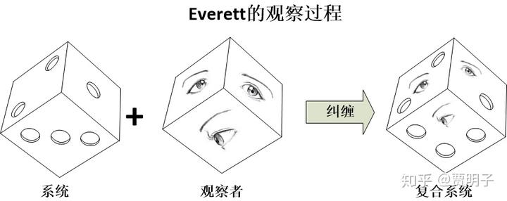
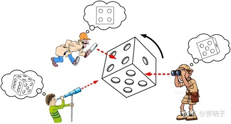

# 量子理论中的“意识”是什么？

我发现很多吃瓜群众津津乐道在量子力学中，“意识决定了世界”。这些流传甚广的说法，充满了各种不严谨，乃至近乎玄学。这里我来详细讨论一下。

量子力学的诸多诠释中，有一两种，是明确涉及到“意识”的。但是我们应该知道，它们都是出自一些物理学大师之手，这些大师们的科学素养，并非吃瓜群众中流传的那样简单，他们也都不是闲极无聊，想改行去研究玄学或哲学。这些诠释的背后，其实是有着丝丝入扣的物理学逻辑链的。

我们知道，所有的量子力学诠释问题，最终的根源都在用著名的“测量问题”。也就是说，在量子力学理论框架中，量子态是希尔伯特空间中的矢量，它有着一切希尔伯特空间的数学性质：叠加，幺正，干涉等等。然而，在我们对量子系统进行测量时，我们永远只能得到一个确定的状态。这中间发生了什么？

我们用著名的薛定谔猫思想实验来说明这个问题。

薛定谔设计了这样一个实验系统，在一个封闭的箱子里，有一只猫和一个可以释放杀猫毒药的装置。这个装置用一个量子事件（粒子的衰变过程）引发杀猫毒药的释放，因而可以将猫杀死。毒药释放的概率为50%。

如果我们认为量子力学是个普适规律 – 也就是说，量子力学的规则同样可以描述猫态。这是一个合理的假设，因为猫也是由微观粒子构成的，我们有理由认为大量的微观粒子整体仍然满足量子力学。因而，猫有两个本征态，“死”（用D表示，“Dead”）和“活”（用A表示，“Alive”），毒药系统两个本征态，“释放”（用R表示，“Released”）和“未释放”（用S表示，“Sealed”）。我们已知，释放的毒药必然杀死猫：

$|A\rangle|R\rangle\rightarrow|D\rangle|R\rangle$

未释放的毒药则不会杀死猫：

$|A\rangle|S\rangle\rightarrow|A\rangle|S\rangle$

在实验之前，猫活，毒药未释放，猫和毒药相互独立，互相不影响，因而，这个装置的初始态就是猫态与毒药态的张量积：

$|A\rangle|S\rangle$

随着量子事件的发生，粒子态发生演化，进入到释放与不释放的叠加，由幺正演化的线性我们立刻可以得到：

$|A\rangle|S\rangle\rightarrow|A\rangle\left( |S\rangle+|R\rangle \right)=|A\rangle|S\rangle+|A\rangle|R\rangle$

然后，猫与毒药发生相互作用，猫与毒药的复合态就发生如下演化：

$|A\rangle|S\rangle+|A\rangle|R\rangle\rightarrow|A\rangle|S\rangle+|D\rangle|R\rangle$

那么，现在猫与毒药进入了这样一个纠缠态（贝尔态），

$|A\rangle|S\rangle+|D\rangle|R\rangle$

现在的问题是，当我们打开箱子的时候，我们会看到什么？

一只死猫或一只活猫，它们出现的概率各为50%。这是所有有理智人的第一反应。然而结合量子力学的怪异，这个答案却模糊不清了。因为在我们没有观察这个量子事件的时候，它只是一个处于叠加态的概率云。就好像我们不观察光子时它处在“穿过左缝”和“穿过右缝”的叠加态一样，我们不观察箱子的时候，这个量子事件处在“发生”和“没发生”的叠加态。而发生必然引发毒气释放，进而引发猫死，不发生则必然不会释放毒气，猫就会活下来。既然事件处于发生与未发生的叠加，那么自然而然地，毒气就会处于释放和未释放的叠加。那么，猫到底是会死去还是会活着？

倘若猫要么活着要么死去，那么按照这种因果链条，活着说明量子事件未发生，死去说明量子事件发生了，那么就说明量子事件要么发生了要么没发生，因而“发生”与“没发生”之间的量子叠加就是不存在的，因而就威胁到量子理论的基础。倘若猫不是要么活着要么死去呢？这又是什么意思？“死”和“活”的叠加态？“既死又活”？！

我们姑且接受猫的这种既死又活的状态，那么为何我们永远看不到？我们打开箱子观察的时候，总是看到“**或死或活**”的状态，而不是“**既死又活**”。是我们的观察造就了观察结果吗？

对此，玻尔为首的哥本哈根学派宣称，在观察之前谈论猫态毫无意义。观察过程和观察者必须是独立于理论之外的特殊过程。

这就是哥本哈根学派著名的“量子经典边界”：观察者是经典的，粒子是量子的，观察必然要跨越这个边界。例如，海森堡提出所谓的**“海森堡边界”（Heisenburg Cut）**，边界的一边是经典世界，一切必须按照经典定律来描述，没有叠加，没有干涉，没有不确定性；而另一边则按照量子力学的定律来描述，处处充满了叠加、干涉等量子现象。但是，对于这样一种十分重要的界线，他却语焉不详 – 我怀疑他自己就根本说不清楚，他说：

> ***“在一边，是我们用来帮助观察的仪器，因而必须看作是我们（经典世界）的一部分，在另一边，则是我们想要研究的物理系统，数学上表现为波函数，在这中间我们需要划分一条分界线。……这条划分被观察系统和观察仪器的分界线是由我们所研究的问题本身的性质决定的，但是很显然在这种物理过程中不应该有不连续性。因而这条线在什么位置就有着完全的自由度”\***

作为量子演化中如此关键的一个概念，采取这样模糊的看法是完全说不过去的，这可以说是哥本哈根诠释一个无法洗白的槽点。

关于量子-经典过渡，玻尔还有一个原理，叫做“**对应原理**”。在这个原理中，它要求量子力学的理论在**经典边界**必须能够自然而然地与经典理论兼容。何为经典边界？我们知道，微观粒子尺度微小，质量很低（诸如电子），在这种领域下，各种量子现象诸如干涉、叠加占主要地位；然而在经典领域，尺度宏观，质量很大（诸如一个垒球），这时候我们把这些条件代入量子理论，就会发现它得出的结论与经典理论相一致：量子理论在尺度渐趋增大时，渐渐地蜕化为经典理论。这个要求是自然而然的：因为量子力学的预言必须要符合我们的经验。不确定原理在大质量物体上，不确定度就会变得极小而可以忽略；再例如物质波在宏观物体上波长如此之短，以至于我们无法察觉。那么，量子行为在经典世界中无法被察觉也就是顺理成章的事情了。这就是玻尔对量子-经典过渡的解释。

这个解释看似非常合理，并且在绝大多数教科书中都是这样讲的。但是它仍然存在着极大的漏洞。我们前面提到的“薛定谔猫”的思想实验[[1\]](https://zhuanlan.zhihu.com/write#_ftn1)，就把整个微观的种种怪异传递到宏观来了，让我们无法接受。这个思想实验表明，所谓的对应原理肯定在某处有问题了。事实上，人们发现，虽然表面上这个原理非常有道理：既然一切微观状态在尺度增大的过程中都渐变为经典状态，那么就不应该存在这种微观-经典的边界。然而事情并非那么简单，这种经典-微观的对应关系，实际上是经典的确定状态与微观量子不确定性的统计平均的对应，而不是经典状态与量子态的对应。也就是说，在经典世界中，量子怪异只是看似消失了而已。在混沌系统中这种矛盾就被放大了：无论我们如何增大系统的尺度，量子力学都是线性的，都不可能产生混沌现象，而经典世界中混沌却无处不在。Zurek等人的研究表明，如果没有退相干理论[[2\]](https://zhuanlan.zhihu.com/write#_ftn2)的介入，对应原理扎这种情况下根本就无法成立。

事实上，玻尔对他的对应原理的态度也很明确：对应原理所说的只是量子理论在**统计解释**的意义上重现了经典理论的结论，但是它并非**自然蜕化**为经典理论。也就是说，在经典边界上，量子理论的**统计平均**与经典理论的确定结果**近似**一致。这二者有着截然的不同。经典理论是独立于量子理论的存在，而并不能从量子理论中合理推论出来。玻尔认为，我们不能指望从量子力学中得到我们对观察结果的合理解释，因为我们作为宏观物体，必然是经典的，我们所需要的观察仪器，也是经典的。那么这种经典-量子边界就在观察过程中起到了迫使波函数坍缩的作用：波函数生活在微观领域，我们对观察结果的接收必然处在宏观领域，那么对波函数的观察，必然要使得观察结果穿越这种边界，从量子变为经典，从“既此又彼”的叠加态变为“非此即彼”的概率。

也就是说，玻尔认为**，R过程（坍缩过程）必然是一种独立于U过程（幺正演化过程）的演化规则，这种二元对立事实上起源于量子-经典的二元对立[[3\]](https://zhuanlan.zhihu.com/write#_ftn3)**。

那么我们就遇到尴尬了。如果真的存在这样的边界，那么这个边界在哪里？你玻尔不是一直在强调波函数只是一种我们计算观测结果预期用到的工具吗？那么你当然应该指明，我们何时可以用这种工具，又何时不能用它呢？

你宣称存在这么一个边界，然后你却不说它在哪儿？！这近乎敷衍。既然我们人类、我们的观察仪器无一例外都是由微观粒子组成的，那么为何所谓的这些“经典事物”就要必须遵守一种特别的规则呢？事实上，直到今天人们一直都在寻找这个边界是否存在，人们在越来越大尺度的物体上观测到了量子现象，例如，双缝干涉实验已经做到了由810个原子组成的巨大分子尺度，仍然发现量子现象的存在。随着人们在越来越宏观尺度上直接观测到量子效应，人们完全有理由相信，宏观物体从根本上讲，也是遵循着量子规律的。

这时候冯诺依曼说，量子力学必须是对全部物理世界普适的，**量子力学不但对微观粒子有效，对宏观的测量仪器乃至于观察者同样有效。**也就是说，**不存在所谓的经典世界和量子世界的边界**，它们都是由量子力学描述的。测量，不外乎是**被测量的粒子和测量仪器之间的相互作用**。这个假设非常合理，因为只有这种相互作用，才会发生粒子与观察者的因果关系，从而使得粒子的信息得以传递给观察者。因而，观察过程中必然要考虑观察者。如果我们看到猫死，我们伤心（用U表示，“Upset”），如果看到猫活，我们高兴（用H表示，“Happy”）。那么，当我们观察时，这个过程就变成了：

$|A\rangle|S\rangle|H\rangle+|D\rangle|R\rangle|U\rangle$

也就是说，我们和猫、毒药一起进入了纠缠的叠加态。整个过程按照量子力学的规则必须如此演化。但是，这个演化的结果却是荒谬的：现实世界中，我们不可能既高兴又伤心。那么我们到底是高兴，还是伤心呢？经验告诉我们，发生了某种过程，把我们从叠加态中“拽出来”，成为一个确定态：

$|A\rangle|S\rangle|H\rangle+|D\rangle|R\rangle|U\rangle\rightarrow“H” or “U”$

而我们整个“物理的”过程中并没有引入任何有别于幺正演化的过程，因而量子态就不会自发地切换为与之对立的经典态。那么坍缩就只能发生在“意识的”过程中。

冯诺依曼表示，在这整个过程过程中，不存在所谓的“经典”仪器，一切仪器，包括我们的感官，都是由量子微粒构成的，因此它们全部遵从量子定律。毒药释放与不释放的叠加，就必然会把猫拖入死和活的叠加，然后当我们观察时，我们的眼睛就被拖入看到死和看到活的叠加，进而把我们的视神经拖两种不同方式的激发状态的叠加，这个相互作用一直发生，直至传入到我们的大脑，被大脑诠释：如此种种，所有的中间过程都没有坍缩发生，一切都处于叠加态。但是，我们无法回避的是，无论这个过程的链条有多长，我们的经验告诉我们，最终我们只能看到一个状态。最后终止于我们意识中接收到的，要么毒药释放、猫死、我们伤心，要么毒药没释放、猫活、我们高兴的二者之一的状态。整个链条中间，必定是某一个环节出现了打破量子力学演化规则的事情，使得叠加态“坍缩”成为一个确定的状态。到底是哪里出问题了呢？

冯诺依曼认为，物理定律应该是普适性的，但这种普适性应该仅限于**物质世界**，也就是说，一切宏观物质都是由量子微粒构成，因此我们必须假定即使是宏观物体，也会遵循量子力学规律。我们有理由相信量子力学是普适的，但是**我们没有理由相信它对物质以外的现象也是是普适的 – 对于精神和意识，没有任何证据表明它们也满足物理定律**。对于意识而言，至今物理学还不敢说对它有一丁点的了解。因此，冯诺依曼断言，一定是意识在作怪。意识是这整个链条中唯一的一个**可能**不遵守物理规律的因素。所以说，必定是意识导致了波函数的坍缩！意识是存在于物质之外的那个神秘的“观察者”，因而它也就是波函数坍缩的唯一可能的罪魁祸首。

这就是冯诺依曼最初提出的，意识可能在测量过程中起到的作用。

这就更加尴尬了！冯诺依曼对观察做出了明确的分析和回答，他拒绝哥本哈根式的含糊和二元对立，但是这个答案却无可避免地让意识直接决定物质世界了！说到底，从多态叠加的量子态到单一确定的经典态，中间必然要经历某种独立于幺正演化的第二类过程才可能实现，因为幺正演化就其本身的性质而言必然要保持这种叠加态永不消失的。那么这种第二类过程必然意味着一种二元对立，因而如果我们去掉了**量子 – 经典**对立之后，我们必须需要一个角色来替代它的作用，在冯诺依曼这里，这个角色就变成了**物质 – 意识**的对立。说到底，**冯诺依曼的诠释仍然是某种哥本哈根诠释，它只不过是把原本模糊的二元边界明确地划在了人的意识边界处。**

冯诺依曼在这个问题上的最大贡献，是建立了一套具体的测量理论，把玻尔他们含糊处理的观察过程用物理的手段进行了分析，并且这种分析成为后人进行量子力学诠释问题研究的基础，成为了后人得以站在他肩膀之上的那个巨人。至于“意识坍缩”，他却并没有深入探讨，而只是简短地对此评价到，**“坍缩发生在从仪器到被意识接受的时刻”**。然而，他的整个分析过程，绝大多数是纯粹的物理理论，而不仅仅是一个诠释。

1956年，也就是伟大的爱因斯坦去世后的第二年，一个尚在攻读博士学位的学生，**休.艾弗莱特（Hugh Everett）**想到了一个问题：“现在的量子力学中，观察导致波函数坍缩。那么在薛定谔猫实验中，猫的观察到底有没有同样的功能呢？我们没有办法向猫求证这件事，因为猫没有办法告诉我们它的感受，但是如果是一个人呢？”于是，为了回答这个问题，他把薛定谔猫实验给改动了一下：

比如说，还是在薛定谔猫的实验中，为了便于对猫的监控，我们把一个朋友和猫一起关进盒子。当然，为了这个可怜的朋友免于被毒死的厄运，我们可以给他一副防毒面具。我们的朋友向我们保证，他绝不是一个动物保护主义者，在全部的实验过程中，他只在那儿静静地观察，不论猫死还是或，他都会保持冷眼旁观，而不会采取任何对实验的干涉行为。然后，实验开始了。一小时之后，我们知道，盒子里的猫有50%的概率被毒死，50%的概率仍然活着。那么这时候我们发出与薛定谔同样的疑问：在我们打开盒子之前，猫是死的还是活的？

这就是著名的“魏格纳的朋友”思想实验 – 没错，最早它不是魏格纳提出的，但是是魏格纳让它变得著名的。

这个答案与原版的薛定谔猫实验有何不同？我们可以看到，唯一的不同就是，盒子里多了一个旁观者，见证了盒子内部的全部过程。那么对我们而言，这不会有任何区别 – 如果我们把我们的朋友看作是一堆符合物理和化学定律的蛋白质、脂肪、无机物的组合的话。那么，本着哥本哈根精神，没有被观察的现实不是现实，那么我们自然认为，猫仍然是处于死和活的叠加态，既死又活。而我们的朋友呢？必然就会处于“看到猫死”和“看到猫活”的精神分裂的叠加态。这就更加不可思议了！对我们的朋友而言，他的观察会使得波函数坍缩，因而早在这之前，猫就已经被坍缩为或死或活的确定态了。我们可以向我们的朋友询问加以求证 – 当然，我们的朋友不会突然地变成了精神分裂的发疯状态，他会告诉我们，他看到的一切确定无疑。那么问题就来了，我们的朋友和我们的理论预言就明显冲突了，到底是谁对谁错？

魏格纳有着一种二元论的思想，他坚信，意识和物质是两种截然不同的东西。在魏格纳看来，观察是一种可以被严格界定的东西，而不像哥本哈根学派的那种含糊描述。他说：

> ***“对于一个物体，波函数可以给我们关于它的一切可能知识。它是一个数学概念，其确切含义我们完全不必关心。……更加确切地讲，如果我们让这个物体直接或间接地与我们发生作用，波函数可以让我们事先预见到，这个物体将以何种概率让我们对其产生一种或者其他印象。”\***

因而，观察其实不过就是**人们在意识中形成印象（impression）的过程**。比如说我们观察薛定谔猫，我们所谓的“猫死了”或者“猫活着”的观察结果，不过就是“我们的大脑中产生了猫死了（或活着）的印象”。离开了我们的印象，观察结果将不会是一种观察结果 – 它毫无意义。也就是说，观察结果就是被我们的意识所接受到的信息。所以，波函数只不过是一种描述我们对外界事物的知识的数学工具，与“预测事物的未来行为”毫无关系。基于这个原因，我们与事物的相互作用在我们的意识中创造了一种感觉（sensation），这就是观察。当我们获得关于外界印象的时候，我们就对外界的知识形成了更新。同时，当我们接收到某种确切信息（例如“猫死”的信息）的时候，一切与之相悖的信息（例如“猫活”的信息）就自动被我们排除掉了。这就是波函数坍缩的最自然解释：它只不过是我们大脑中的信息更替而已。

在“魏格纳的朋友”实验中，我们打开盒子的瞬间并不知道猫的死活，它是一种“叠加态”：**对它的两种预期印象同时存在于我们的意识中 -** 对于一个现实的状态，死活叠加确实是一种难以理解的概念，但是对于我们意识中的印象，却毫无滞涩 - 然后我们问我们的朋友，“猫死了还是活的？”，朋友回答说，“死了（或活着）。”这个回答立刻给了我们一种确定的信息，这种信息就立刻**在我们的意识中排除掉了另一种可能**，在这一刻，猫态坍缩了 – 它在我们意识中坍缩了，实在是再简单不过了，一点都不奇怪。至于在这之前，波函数表达的叠加态是何意义，魏格纳早已经明确说过，它不过是对我们意识中关于猫可能影响我们印象的数学描述，仅此而已。这时候，我们继续问我们的朋友第二个问题：“在我问你这个问题之前，猫是死的还是活的？”，此时我们的朋友会感到一点不耐烦，他会说，“我早就告诉过你了，它是死的（或活的）！”于是我们就知道，其实早在我们意识中关于猫的印象形成之前，我们的朋友关于猫的确定印象早已经形成了。我们关于印象的信息是可以互相交流的，这就使得我们产生了矛盾：在我们第一次问我们的朋友之前，我们对猫态的描述仍然是一个叠加态，然而我们的朋友在第二次提问的时候却告诉我们，早在这之前，在他那儿猫态早已经是一个坍缩的确定态了！

如果我们的朋友仅仅是一台仪器，那么我们在第一次查询仪器测量结果之前，我们可以很安心地用叠加态来描述猫和仪器：仪器此时处于观测到猫死和观测到猫活的叠加态。但是现在实施观测的不是一台仪器，而是我们的朋友，这就未免太过奇怪了：我们的朋友不可能处于看到猫死和看到猫活的叠加态。当然，我们也可以认为我们的朋友和一台仪器没有任何区别，但是这很难令人接受。因为我们自然而然地会假设我们的朋友应该有着**和我们一样的印象和感觉** – 他应该的印象不会处于两种状态的叠加，而是应该有着确定地感知到猫死或猫活的印象。否则的话将会让我们陷入**唯我论** – 我们逻辑上无法证实别人是否有着和我们一致的印象，从而断然否认他们的意识。从逻辑上我们的确无法否认唯我论的可能性，但是物理学家们极不愿意陷入这个泥潭。所以更加自然的观点就是，我们必须认为在我们知道猫态坍缩之前，它就早就已经被坍缩了：它坍缩在我们的朋友看到它的那一刻。也就是说，一台没有意识的仪器可以处于叠加态，但是一个有意识的人却必然会使得叠加态坍缩。因而，结论就非常简单了：

> ***“It follows that the being with a consciousness must have a different role in quantum mechanics than the inanimate measuring device”（于是乎，我们知道在量子力学中，一个有意识的生物与无意识的仪器有着不同的作用。）\***

那么，不可避免地，我们必须认为，意识是使波函数坍缩的罪魁祸首。

这就是“**冯诺依曼-魏格纳诠释**”（简称**VW诠释**）。魏格纳的朋友的思想实验，其实就是把冯诺依曼的测量因果链用一种非常形象的形式向我们表达出来了。冯诺依曼首次提出意识可能与坍缩有关，而魏格纳随后把这个论述具体化，明确化了。

但是，VW仍然有着巨大的模糊空间，例如说，我们可以问什么是“意识”？我们怎么来判定一个观察者是有意识的？一般我们认为人类有意识，但是猫狗有没有？鸡鸭呢？甲鱼呢？蚂蚱？蚯蚓？变形虫？如果猫是有意识的，那么薛定谔猫就不会处于既死又活的叠加态：因为它自己就把自己给坍缩了。其次，如果我们认为只有人类的意识才算意识，那么我们人类为何在宇宙中有着如此特殊的地位、可以把宇宙的叠加态坍缩掉，并且造就了宇宙现在的状态？

更有甚者，如果我们接受了“意识坍缩波函数”这种说法，那么一个逻辑必然就是，意识不但是创造了宇宙的**现在**状态，它还创造了宇宙的**整个历史**！因为宇宙早期还不存在意识生物的时候，按照这种逻辑显然是没有什么东西使它坍缩的，于是宇宙自诞生之日起就一直是一种模模糊糊，云山雾罩的概率云。这种存在状态一直保持到宇宙中第一个意识出现，它看了一眼宇宙，于是宇宙就坍缩成了现在这个样子，包括它的一切历史，从大爆炸到原子的形成再到星云星系的整个演化，就都变成了现实。也就是说，在150亿年的现在，一个意识看了一眼，就导致了150亿年前，宇宙诞生了！

哥本哈根诠释一直小心翼翼地避免谈及意识这个话题，因为玻尔显然明白，在物理学理论中引入“意识”这个不属于物理世界的概念是多么危险。然而，不论玻尔多么不愿意，**对哥本哈根的穷究就必然会导致导致意识坍缩的结论** - 这种结论几乎就是逻辑必然的，只要我们认定这个宇宙存在着一个一致的、普适的理论，就不得不如此。

我们回到前面最早提出魏格纳朋友实验的Everett。事实上他提出这个实验的目的并不是为了证明意识的作用，而是为了证明哥本哈根诠释的不自洽。他的解决方案就是，**多世界理论。**

多世界理论非常明确地赋予观察一个物理意义：观察只不过是观察者和被观察系统之间的某种**相互作用**，它可以、也必须**由量子理论本身来描述**。并且同时，观察者本人也不过是某种物理实体，从物理上，观察者和一台观测仪器的观察行为并没有任何区别，他们的观察行为和信息的接收也是由量子理论来描述的。而我们前面的简单推导已经显示了，量子系统的一个非常独特而且普遍的现象就是，**观察导致纠缠，纠缠导致独立性的丧失**。

我们仍以薛定谔猫为例。前面显示，按照量子力学的演化规则，整个“猫+毒药+观察者”的复合系统最终无可避免地结束于这样一种状态：

$|A\rangle|S\rangle|H\rangle+|D\rangle|R\rangle|U\rangle$

用人话来讲，整个复合态就是这样的：

{（毒药释放，猫死，看到猫死）+（毒药没释放，猫活，看到猫活）}

我们可以看到，我们没有任何办法把它分解成毒药态、猫态、观察者态三者的直积形式。也就是说，当观察者完成了对猫的观察之后，观察者和猫之间就形成了量子纠缠。完成观察后，猫的每个状态（“死”和“活”）、观察者的每一个可能状态（“看到猫死” 和“ 看到猫活”）都不再独立。

理论上，单独的观察者的状态和单独的猫的状态都已不复存在。也就是说，我们如果笼统地问：猫是死的还是活的？这个问题就变得毫无意义了。因为猫已经不是一个独立存在了，它和观察者纠缠在一起了。此时我们对猫的状态的描述必须建立在观察者某个状态的前提下，反之亦然。也就是说，猫的状态是相对于观察者状态存在的，而观察者的状态也是相对于猫的状态而存在的。Everret把这个叫做“**相对态**”（**relative state**）：系统的每个叠加态仍然存在，但是它们是相对于观察者存在的，反之亦然。

因此，在观察的时候，观察者的一个状态（看到猫死）就会和猫的一个状态（死）关联起来，而他的另一个状态（看到猫活）和猫的另一个状态（活）关联起来。这是由薛定谔方程的线性演化导致的必然结果。这样一来观察者并不是以**一个**独立的观察者而分别观察猫的“死态”或“活态”，而是以一个多态叠加的形式，分别于猫的各个状态纠缠。

当观察者问自己，“猫是死的还是活的？”我们只能这么回答：相对于我们看到猫死的状态，猫是死的；相对于我们看到猫活的状态，猫是活的。而你非要想问，猫**自己**本身到底是死的还是活的？对不起，猫**自己**是什么？只有一个和整个宇宙纠缠在一起的波函数，没有独立的猫自己存在。当我们在用“猫自己”这种词语的时候，我们指的就不会是纯的量子态，而是量子态相对于观察者的的一个分支（**branch**）。

现在，不论是观察者还是猫，都不可能完全与外界环境隔绝，他们都浸泡在大气当中，在引力场中，并且在宇宙的背景辐射中游泳。并且，量子纠缠与经典的相互作用完全不同，它是长程的，相互作用的两个物体可以跨越时空相互关联，并且保持这种关联。那么很迅速地，系统就会和外界环境纠缠起来，而环境又会和环境之外的环境纠缠起来，把系统与外界的纠缠不断扩大。最终，系统与整个宇宙浑然一体而不可分割。

{（猫死+猫活；尚未观察；宇宙）}→{（猫死/看到猫死）+（猫活/看到猫活）；宇宙）}→{（猫死/看到猫死/宇宙1）+（猫活/看到猫活/宇宙2）}

这样一来，整个宇宙的叠加态们都会不可避免地与观察者的状态纠缠在一起。宇宙态1与死猫和看到死猫的记忆在一起，宇宙态2和活猫以及看到活猫的记忆在一起。它们就构成了宇宙波函数的两个分支。

从数学上讲，每一个分支，就是宇宙波函数在极高维度的希尔伯特空间中的一个侧面。我们用一种形象的方式，分别定义这些侧面“世界1”和“世界2”。那么，由于观察者与外界的相互作用，整个宇宙的叠加态就分成了两组：世界1和世界2。所有的这些侧面在一起，就构成了量子态的整体的立体结构。这个“立体的”波函数浑然一体，不分你我。

在高维希尔伯特空间中，数学上可以证明，任意的两个“世界”之间，存在任何重叠的可能性趋近于零。也就是说，从一个“世界”不可能感受到另一个“世界”任何存在。所以说，多世界理论中，不同的宇宙分支互相平行无涉，这一点非常合理地从数学形式上就得到了，毫不奇怪。奇怪的是另一个问题，**“偏好基问题”**。

如果我们认为量子力学就是由希尔伯特空间中的矢量描述的，而不存在预设的经典状态，那么一切叠加方式 – 任意的叠加方式 – 都是等价的，我们可以用任意的基底来完成对普适波函数的描述。例如说，一个“活猫”的状态，可以看做是“死猫+活猫”和“死猫-活猫”两个猫态的叠加，而后两种猫态与“活猫”和“死猫”态完全等价。

宇宙波函数是一个存在在极高维度希尔伯特空间中的矢量，我们可以做一个类比，把它看做是一粒骰子。骰子的每一个面就是一个确定的经典“世界”。我们只能观察到这个骰子在一个低维空间的一个投影，但是这个骰子是一种立体结构，它可以从任意角度上投影，只有在某些特定的角度，我们才能观察到一个确定的面，而在无数其它角度上，我们会看到多个面的叠加。现在问题是，希尔伯特空间中并没有规定这个骰子的每一个面的角度是特殊的 – 事实上，我们可以从任意角度观察它。而几乎不可能观察到一个确定的面，而更可能同时看到多个面。

每一个那么，为何那些经典的“角度”，也就是**基底（basis）** – 诸如确定的位置等等又是如何是在宏观世界中变得如此特殊？为何我们看不到那些任意的叠加态？我们观察到的，只有一个经典世界。为何我们不会同时看到猫的死和活？多世界如何使理论预言和我们的经验相一致起来？

这个问题在哥本哈根诠释中，并非一个问题，因为它在预设了量子-经典边界的时候，就已经预设了一组特殊的经典态的优越性了。经典的“偏好基”是一个理论的预设前提。然而多世界理论的目标就是要取消这个量子经典边界，它就必然面临这个问题。

此外，在多世界理论中，只有幺正演化一种演化规则，因而就不存在某种过程使得叠加态“坍缩”成确定态。也就是说所有可能发生的事件都发生了。无数版本的“我”见证了每个可能事件的发生。那么，我们不可避免地要谈论哪一个“我”才是“我自己”的问题。无数个“我”在每个“世界”中存在，每一个“我”都会有一个自我意识。因而我们就逃避不了“多意识”的讨论，这就形成了多世界理论的一个分支，称为**“多意识理论”（Many minds interpretation）**。

多意识理论秉承了多世界理论的基本思想，但是又有所不同。在最初多意识理论的出现是为了解决前面所说的“偏好基问题”以及“输出值问题”。在多意识理论看来，偏好基问题不是问题，而是我们看问题的角度不同。就像是整个宇宙的物理状态一直处于多重叠加一样，每个意识生物的大脑，其物理状态都会由波函数来描述，因而也就是一种可以在任意基底上描述的叠加态。也就是说这个大脑波函数是量子的、不确定的、叠加的并且是以任意方式叠加的。然而，并非所有的叠加形式都会产生所谓的意识。这些意识的每一个叠加态 - **意识之所以能够成为意识，其一个必要条件就是它有着确定的自我认知状态 – 必然是确定的、经典的。因为一个不确定的意识态必然是与外界纠缠在一起，并且无法区分的，它必然不可能产生“自我”，因为这时候已经无所谓“我”，也无所谓“物”了。**

**这在后来的退相干理论中关于preferred basis problem的论述中也非常清楚。所谓的偏好基，就是那些在于外界相互作用中保持独立的基底。而偏好基的叠加，则是和外界无法区分的。**物我之间就像是巧克力与牛奶一样，变成了巧克力奶了。

我们应该注意的一点是，也就是说，多世界理论中，所谓的“多”，其实不准确，恰恰相反，多世界理论中，只存在一个唯一的宇宙波函数，它不但唯一，而且不可分割。我们大脑的每一个叠加态头与外部世界形成纠缠。当整个意识与外部世界进入纠缠之后，整个世界并不分裂（这里，**多意识理论与Dewitt的“分裂”的多世界理论形成冲突，但是，它恰恰与Everett最初的普适波函数相一致！**），因而从每个意识角度，偏好基就自然出现了：那些叠加的、不确定的大脑状态必然不能成为意识，因而也就无法形成主观经验。

也就是说，“叠加态”的、“不确定”的世界们都是存在的，并且与经典的、确定的世界同等真实。它们不过是从不同的角度观察宇宙波函数获得的不同的侧面。然而，从数学形式上看，所有那些非经典的侧面，所对应的意识生物的大脑状态是不能形成自我意识的 – 因而也就无所谓意识了。所有那些可以存在主观生物、能够被认知并且形成主观经验的，都必然是在确定的意识态视角下的。这些确定的意识态就是偏好基。因而，**在多意识理论看来，整个世界并不分裂，“分裂”的是观察者的意识：这些意识从不同的视角（偏好基）观察宇宙波函数，就形成了不同的观察结果。**而“我”则是随机地选择了某一个观察视角，观察到了一个可能结果。当然，随着退相干理论对偏好基问题的研究，多意识理论中的很多附加假设已经变成了不必要，现在渐渐地与多世界理论融合在一起了。

同时，人们还在诘难这样一个问题，即使多世界理论中一切都是确定的，那么 “概率从何而来”？

Carroll对此有着一段论述，他认为这取决于所谓的**“自定位不确定性”（self-locating uncertainty）**。也就是说，我们虽然对未来世界的分支可以做到完全预测，但是我们所不能预测的，是我们自己将在会出现在哪一个世界，这就成为不确定性的根源。他对所谓的“后观察过程”（post measurement）分析道，退相干的过程极其迅速，它在10^-20秒中就完成了，也就是说，世界的分支几乎瞬间就完成了，但是人的意识的产生则慢得多，在毫秒级。当人们完成了观察，世界完成了分支的时候，我们对此毫不知情。等过了无穷长（相对于退相干时间来说）时间之后，我们才意识到自己处于哪一个分支上。而这，就成了不确定性、也就是概率的起源。

这种“后观察过程”就把人的主观意识引入到多世界理论的框架中了。这是必然的，因为在一个完全决定论的理论中，唯一可能的概率性，只能来自人们的无知度，它就只能是一种主观概率。那么，多意识理论的说法就更加有意思了。多意识理论中，我们所观察到的每一个可能结果，都是我们的一个意识分支选定的一个视角。而意识在选定观察视角的同时，就定义了自己。而这种自我定义，就完成了偏好基的定义。“我”是什么，它首先必然是一种**自我意识**。而这种自我意识，就**必然是一个确定的、与外界完全区别（distinct）的东西。我们之所以能够谈论我们的经验，我们的观察，这一切的基础全在此：“我”这个定义必然会对物我之辨做出一个划分，因为否则的话，在这个纠缠的量子世界，“我”将会囊括整个宇宙，就无所谓“我”，也无所谓“物”了，进而整个世界都毫无意义。因而，整个不确定性的起源，不仅仅是自定位的问题，而且是一种自定义的问题。**

Frauchiger和 Renner曾经设计过一个非常巧妙的、但是复杂的类似于魏格纳朋友的思想实验，并且从中得到一个定理[[4\]](https://zhuanlan.zhihu.com/write#_ftn4)：**单一世界的量子理论不可能是自洽的**。这个定理显示，如果我们认为量子力学是普适的定律，我们必须要承认多世界的平行存在；反之，我们如果否认多重现实的存在，那么量子力学就做不到自洽，它必须在某些地方被违背了 – 比如说，我们必须需要一个理论之外的观察者来救场。说到底，**一个量子理论不可能自洽地描述一个使用量子理论的观察者，**这个就涉及到了自指和无限递归了。人们经常会有所疑惑，量子理论中的不确定性，与哥德尔不完备定理中的不确定性，两者到底有何内在联系？一般而言，大家对此问的直接反应就是，一个是物理问题，是一个基于经验的，另一个是数学问题，是基于逻辑的，两者不可能有何关联。然而，这个定理却显示，它们之间确实可能存在着某些微妙的联系。

所以说，这个定理告诉我们，**要么，我们承认量子理论不自洽或不完备，要么，我们承认多世界。**

总而言之，下面这个问题

“**这个世界中某事件发生的概率有多大**？”

是“正统”量子力学所问的问题。然而在多世界理论中，这个问题就变成了：

“**在所有的一个世界分支上，哪一个我才是‘我’？**”

这是个自定位（self-allocation）的问题，我们可以进一步引申，在多意识理论中，它就变成了：

“**在近乎无穷多个意识分支中，我将会如何定义我自己？**”

这就变成了一个**自定义**的问题。

“我”这个字，可能是我们日常中最常用的字之一，但是我们平时基本上没有注意到过，说到底它包含了一个终极哲学秘密：自我定义。**自我定义注定是逻辑不完美的，因而我们的世界注定是概率性的**。

所以说，与意识坍缩相比，多意识理论可以被看作是换了一个角度看问题。意识坍缩中，多重性被意识任选其一保留下来，其余则被抛弃；而在多意识理论中，多重性一直存在，而每个意识分支选择了一个视角，“我”只不过是选择了这些意识分支中的其一而已。

**如果从“我”的视角来看，意识坍缩与多意识理论也就自然融合在一起了。**

所以说，如果抛开我们对“现实”的看法，两大对立阵营（多世界和单一世界观点）最终在各个问题上都有着令人意外的一致性。

------

[[1\]](https://zhuanlan.zhihu.com/write#_ftnref1) 事实上，薛定谔是一个坚定的哥本哈根诠释的反对者，可以说是它对立阵营中除去爱因斯坦之外的二号人物。薛定谔猫实验就是他提出来反对哥本哈根诠释的重要一击。

[[2\]](https://zhuanlan.zhihu.com/write#_ftnref2) 退相干理论是一种从纯粹量子力学出发、抛弃坍缩概念的研究量子-经典过渡的理论，我们在后面将会提及。

[[3\]](https://zhuanlan.zhihu.com/write#_ftnref3) 事实上，这只是玻尔的看法，我们知道，哥本哈根诠释并非是一个诠释，而是相类似的一大类诠释的组合，对待坍缩这个问题上，其内部有着多种不同的、甚或相互矛盾的看法。

[[4\]](https://zhuanlan.zhihu.com/write#_ftnref4) arXiv:1604.07422v1

编辑于 2022-11-14 16:58・IP 属地未知

