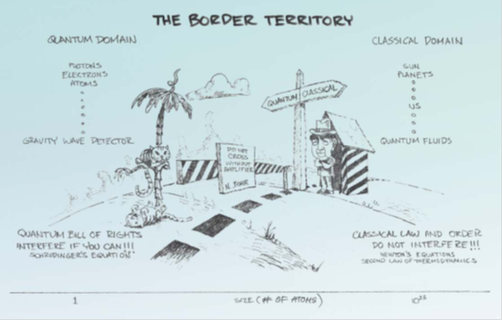
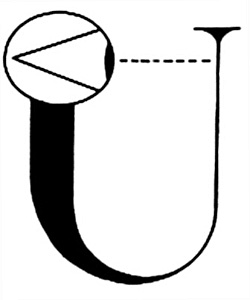

# 量子纠缠：超越EPR之后

**“The ultimate metaphysical secret, if we dare to state if so simply, is that there
are no boundaries in the universe. Boundaries are illusion, product not of reality but of the way we map and edit reality”**

**“我敢说，形而上学的终极秘密就是，宇宙中（物体间）不存在边界。边界只是一种幻觉，它不是现实的产物，而是我们对现实的映射和加工的产物”**

**–** **韦伯**

我想，现在我们已经可以开始谈一谈量子力学中最具争议的话题 – “测量问题”了[[1\]](https://zhuanlan.zhihu.com/p/33017837/edit#_ftn1)。

这个话题的争议之处在于，在物理实在这个概念的建立过程中，观察者到底是何种角色？或者更进一步说，**物理实在是独立于观察者客观存在的吗？**

我们不妨再来回顾一下这个问题上人们的认知是如何发展的。自古至今，人们对物理实在的认识就有着不同的认识。在本体论意义上，有认为“实在独立于意识而存在”的唯物主义、“实在是意识的产物”的唯心主义、以及两者相结合二元论或多元论。而在认识论意义上，则存在着理性主义和经验主义的分歧。尽管哲学流派百家争鸣，但是在17世纪的经典物理学建立以来，科学家们似乎已经（至少在自然科学领域[[2\]](https://zhuanlan.zhihu.com/p/33017837/edit#_ftn2)）取得共识：

1、 在观察者之外，存在着独立的“客观实在”。**这个实在与观察者和观察方式无关**。无论我们何人、何时、何地，只要是正确的观察，总能够获得一致的观察结果。比如说，我们总是可以谈论月亮在此时此刻的位置、体积、形状、运行速度、自转速度等等一系列性质：我们坚信，哪怕是现在没有任何人在观察它，它也总是**确定地**在那里存在的，我们可以不知道它此刻的状态，但是不能否认它的确实存在；同理，宇宙中的每一个物体，大至星系，小至微尘，无不如此。宇宙总是以其一致的方式存在的，不论它是不是被观察，也不论是否存在一个观察者
– 观察者本身，也是客观实在的一部分。

2、 所有这些客观实在，都受到某些（确定的、至简的）自然规律所支配，任何一个因都会毫不含糊地导致一个确定的果。仍以月亮为例，根据牛顿定律和万有引力定律，我们可以准确预测它未来的运行轨迹 – 只有精度的区别，没有不确定的未来；哪怕是混沌系统，也只是我们不能预测而已，并非它的未来不确定[[3\]](https://zhuanlan.zhihu.com/p/33017837/edit#_ftn3)。观察者本身，包括观察行为本身，都是这个自然规律运作的结果。

这种经典的“机械宇宙观”，在经典物理学取得巨大成就的同时，根深蒂固地确立在科学家的概念之中。**“实在论”、“因果论”、“决定论”**成为自然科学的三条不可或缺的支柱。这个非常符合人们的直觉，似乎无懈可击。直至后来狭义相对论和广义相对论以几何纲领重新表述了整个经典物理学，几乎是重建了人们的认识，但是，相比之下，这三个支柱并没有被触动，相反，它们更加牢不可破了。

然而20世纪初诞生的量子力学，却同时冲击了这三大支柱。不确定原理和概率性演化颠覆了决定论和人们对因果论的认知，更加重要的是，所谓的“测量问题”迫使人们开始重新思考对“实在”的认识。量子力学发展史上，自从薛定谔方程和波函数的概念出现那一天起，争论就从没有停止过。大家所能达到的最大共识，就是用“纯”物理语言不加诠释地表述的量子力学 – 所谓的狄拉克-冯诺依曼公设：

- 一个粒子由“量子态”（波函数）描述，这个量子态的演化过程可以用薛定谔方程严格确定。而量子态可以看做是希尔伯特空间中的一个矢量，这就意味着粒子的状态可以用多个确定的状态的叠加态来表示[[4\]](https://zhuanlan.zhihu.com/p/33017837/edit#_ftn4)。比如说，它可以是是空间所有可能位置的叠加（“既在这儿又在那儿？”），也可以是所有可能动量的叠加（“既快又慢？”）。甚至，以薛定谔戏剧性的语言，一只猫会处在“死”和“活”的叠加态（“既死又活？！”） -- **“态叠加原理”**；
- 然而我们永远看不到一个既在这儿又在那儿的粒子，也永远看不到一个既快又慢的粒子，当然更不会看到一只既死又活的猫。每当任何时候我们观察一个粒子时，我们总是只能看到一个确定的状态 – 本征态。观察的后果是，粒子的状态会突然变成构成它叠加态的诸多确定状态中的其中之一。具体我们会观察到哪一个确定状态呢？它的概率由玻恩规则确定，这是“随机”[[5\]](https://zhuanlan.zhihu.com/p/33017837/edit#_ftn5)的。-- **“波函数坍缩”**。

我们可以看到，这几条公设给了我们一个用于预测粒子行为的“手册”。按照这个手册所规定的步骤123完成计算，这个过程大致如下[[6\]](https://zhuanlan.zhihu.com/p/33017837/edit#_ftn6)：

1、通过解薛定谔方程计算粒子的波函数 $ \mathinner{|\psi\rangle} $ 随时间的演化过程；

2、根据我们想要做的测量，确定所有可能的本征态 $\mathinner{|\phi_i\rangle}$ ，然后把波函数看做这些本征态的叠加： $\mathinner{|\psi\rangle}=\sum_{i}{C_i \mathinner{|\phi_i\rangle}}$

3、根据玻恩规则，每个本征态在这个叠加过程中所占的权重 $C_i $ ，就对应着这个本征态出现的概率；

这是一个“纯数学”的手册，根据这个步骤做完计算，我们就可以知道，当我们观察一个粒子的时候，我们会有多大的概率发现它具有何种状态 – 整个过程，我们完全不需要知道所谓的“波函数”、“叠加态”、“坍缩”这些概念在其数学意义背后的“物理”涵义是什么。我们只需要知道，我们根据这个手册的指引一步一步完成计算，最后得到的结果就是，如果我们对这个粒子做一个观察（任何观察，可以是位置、动量、能量、自旋，随便你指定），我们会观察到的、这个粒子的所有可能状态，以及每个状态出现的概率。因此，我们完全**可以**不在乎这些看起来很奇怪的问题：

- 什么是“叠加态”？
- 如果叠加态存在，我们为何看不到？
- 我们的观察如何使叠加态“坍缩”到一个确定状态？
- “坍缩”到底是什么，anyway？

我们不必在乎它们，因为就 “我们将会看到粒子的状态是什么？”这个问题而言，它们都可以看做是纯数学概念：不管这些问题的答案是什么，都不会影响我们就算得到的最终答案，什么事情会发生，发生的概率是多少？因为只有这个最终结果，才是可以实证的。而“实证”才是自然科学所必需的，也是自然科学所要求的一切。我们非要去问，没有观察到的“叠加态”是什么，还有我们观察的瞬间发生了什么“坍缩”，这些问题就算是你有一个答案，因为它们都不是实证概念，你又能如何证明你的答案是正确还是错误的呢？所以，“Shut Up and Calculate！”

**这种答案，你觉得这样满意吗？**

好吧，当我写到这里，我立刻就想象出来你那张不服气的小脸。你当然不会满意这种回答。但是，无论你服不服气，现在多数的物理学家都持有这种态度，以至于“shut up and Calculate”这句话已经成为科学界知名度极高的一句名言。在人们传统的观念中，物理学中的每一个数学概念，都有一个物理意义，它实际代表了某种**现实的存在**。而闭嘴计算的科学家们，事实上否定了“物理概念映射现实世界”这个人们一直以来认为理所当然的观点，而把它看做是一种单纯的计算工具 – 至于这个工具中出现的那些概念，它们只是我们脑子里为了计算的方便而“硬造出来”的概念而已，与现实无关。

那么，物理学家们为何会学鸵鸟，把脑袋埋进沙子里，回避这些如此明显的问题呢？当然物理学家们可以用上面那种纯粹的实证主义言论来回答，用“萨根的隐形龙”[[7\]](https://zhuanlan.zhihu.com/p/33017837/edit#_ftn7)来嘲讽你，甚至用泡利的名言“This is not even wrong （这连个错误都算不上）[[8\]](https://zhuanlan.zhihu.com/p/33017837/edit#_ftn8)”来怼你，让你无言以对。但是，这些闭嘴计算的物理学家们心里难道就没有一点点好奇心、想要知道那个荒诞的叠加态究竟是什么，而我们的观察又是如何会让宇宙的状态坍缩的呢？

科学家们当然想知道，非常非常地想。据我所知，已经不止一人曾经表示过，如果让他知道了在观察过程中，叠加态是如何坍缩成确定态的话，他们哪怕立刻就死了也开心。问题是，**要得到一个既符合观察，又符合逻辑，又符合我们直觉的诠释，简直是不可能的任务！**所以，很多人只能无可奈何地耸耸肩：微观粒子就是这么奇葩，世界本来如此，我又有什么办法？先把这个问题放一边，别费脑细胞了，等有人搞到好的答案，我再去选择相信或不相信吧！

前面我们已经提到过好几种试图对观察过程进行诠释的努力。例如说，曾经一度占据了主流的哥本哈根诠释。

哥本哈根诠释以玻尔为领袖，海森堡、玻恩等人为中坚。我们已经看到，他们的基本论点与纯粹的闭嘴计算很接近。他们认为，物理学的第一要务是满足实证的要求。既然双缝干涉等观察事实表明，微观粒子必须处于某种“叠加态”，那么它们就是处于叠加态好了。但是我们的经验告诉我们，经典世界中不会出现这种叠加态，那么我们必须承认，经典世界不存在叠加、波动性等量子性质。那么，经典与量子世界之间，就存在着两种不同的模式：经典的世界完全符合我们的日常经验，而量子世界则就是那么奇葩。经典和量子之间，存在某种对应关系，就像是不确定原理所显示的，当一个系统的尺度逐渐变大时，它的不确定性就会逐渐变弱，直至我们完全无法辨别，这就叫做“对应原理”。而我们人类，是一种不折不扣的经典物体，我们所能够直接观察的，只能是经典的现象，而无法直接观察到微观粒子 – 我们只能借助经典仪器（包括我们的眼睛、我们的大脑，都是所谓的“经典仪器”）才能获取粒子的信息。那么，当一个微观粒子遇到经典的仪器，仪器就必然会破坏原本的粒子的量子特征，使得粒子只能选择某一个本征态。也就是说，粒子的叠加态“坍缩”了。那么，观察者在这个过程中，就起到了决定性的作用。正是观察行为本身，迫使粒子从叠加的量子态坍缩成为某一个确定的本征态。我们并不是“观察到了”粒子的状态，而是“造就了”粒子的状态。这个宇宙根本就不存在独立于观察者的客观实在。宇宙以何种方式存在，取决于你如何观察它。

哥本哈根诠释在量子力学的早期明确地与传统的实在论、决定论、以及因果论相对立：

- 那些没有被观察的，并不存在；那些存在的，取决于我们的观察；
- 上帝是掷骰子的；
- 粒子所发生的一切，都不存在一个明确的“因”，并且不产生一个明确的“果”。

总而言之，早期的哥本哈根学派就像是一个对一切都叛逆的熊孩子，无疑是让很多人讨厌的。这些讨厌它的人里面就包括了量子理论早期的几个大佬：爱因斯坦、薛定谔、德布罗意。但是，随着那20多年有如特洛伊战争一般经典的大论战，玻尔领导的大军不断取得优势，于是，如果人们不满足于闭嘴计算，还想再思考一下物理含义的话，哥本哈根诠释渐渐在上世纪40年代以后成为最主流的一种说法。但是，如果我们真的发掘一下这个诠释，我们发现其实它比闭嘴计算的说法并没有多说什么，它仍然在很大程度上是一种工具主义。它拒绝谈论“叠加态”的**真实**含义；并且它拒绝谈论“坍缩”**究竟**是如何发生的 – 只是说它是瞬间的、不可逆的，在观察结果产生的同时发生；它甚至不能够定义什么行为可以算作是一个“**观察**” – 作为这个诠释里面如此核心的一个概念，这不说清楚可以说是非常草率了。并且，最为严重的是，它把物理过程分成了两个互不相容的领域：经典领域和量子领域。这个不和谐的区别，一直被很多人所诟病。下面这张图就是一张很经典的漫画，它出自物理学家Zurek（“Decoherence and the Transition from Quantum to Classical - Revisited”）之手：

这张漫画叫做“分开的地盘儿”，图的最底下有一个坐标轴，显示尺度，从最左边的1个原子的大小，到右边10^23个原子的大小。中间被一条分界线划开，左边是“量子区域”，有一棵长相怪异的树，树上（下）有一只猫，它既是死的，又是活的。这个区域写着“量子法案：请尽量干涉！！！ - 薛定谔方程签发”。而分界线的右边，是“经典区域”，写着“经典律法：禁止干涉！！！ - 牛顿定律和热力学第二定律签发”。在分界线上，由玻尔把守，界碑上写着：“没有放大器[[9\]](https://zhuanlan.zhihu.com/p/33017837/edit#_ftn9)的禁止通行！”

这张漫画表达的，就是哥本哈根诠释中的那个极不和谐的经典和量子之间的划分。量子世界中，到处都是波粒二象性、干涉、叠加态、纠缠等等一系列现象；而经典世界中，所有这些现象都被禁止了。那么，这就出现了几个很难回避的问题。首先，难道宏观世界的一切物体，不都是由量子微粒组成的吗？为何宏观和微观就要遵循不同的规律？其次，量子到经典的转变是如何发生的？第三，如果真的存在着一条鸿沟，那么这条鸿沟应该在什么地方？

种种诘难表明，虽然哥本哈根学派在对传统的实在论和决定论的战役中大获全胜，但是它本身也是困难重重。正如John Wheeler所说：

> ***“哥本哈根学派有着致命的缺陷，但这些缺陷却不是爱因斯坦所认为的那样。”\***

于是有人开始尝试着取消这条鸿沟。冯诺依曼可能不是第一个这样做的人，但他显然是早期这么做的人里面最具启发性的一个。我们以薛定谔猫为例：一个衰变的粒子，引发毒气释放装置，然后毒死一只猫。哥本哈根诠释认为，一开始，触发毒气的粒子处于衰变和不衰变的叠加态：

$\mathinner{|粒子\rangle}=a\mathinner{|衰变\rangle}+b\mathinner{|未衰变\rangle}$

当它和毒气在一起，那么，就会使毒气释放装置一起进入一个叠加态，释放和不释放的叠加：

$\mathinner{|粒子，毒气\rangle} \Rightarrow a\mathinner{|衰变，释放\rangle}+b\mathinner{|未衰变，不释放\rangle}$

它们再和猫在一起，就成了这样：

$\mathinner{|粒子，毒气，猫\rangle}\Rightarrow a\mathinner{|衰变，释放，死\rangle}+b\mathinner{|未衰变，不释放，活\rangle}$

也就是说，这个系统处于这样一种叠加态：（粒子衰变、毒气释放、猫死）和（粒子没衰变、毒气没释放、猫活）的叠加态。如果我们打开箱子进行观察，那么，就必然把量子事件拖入经典的观察仪器，观察使叠加态坍缩，它就成为这两种状态的其中之一：

$\mathinner{|衰变，释放，死\rangle}+\mathinner{|未衰变，不释放，活\rangle}\\ \Rightarrow_{坍缩} \mathinner{|衰变，释放，死\rangle}, 或\mathinner{|未衰变，不释放，活\rangle}$

这个过程就是波函数坍缩。

而冯诺依曼表示，不存在所谓的“经典”仪器，一切仪器，包括我们的感官，都是由量子微粒构成的，因此它们全部遵从量子定律。粒子的衰变与不衰变的叠加，就必然会把毒气装置拖入释放与不释放的叠加，然后把猫拖入死和活的叠加，当我们观察时，我们的眼睛就被拖入看到和没看到的叠加，进而把我们的视神经拖入激发和没激发的叠加，这个相互作用一直发生，直至传入到我们的大脑，被大脑诠释：

$\mathinner{|衰变+未衰变\rangle}\mathinner{|毒气，猫，眼睛，……，脑\rangle}\\ \Rightarrow\mathinner{|衰变，释放\rangle}\mathinner{|猫，眼睛，……，脑\rangle}+\mathinner{|未衰变，不释放\rangle}\mathinner{|猫，眼睛，……，脑\rangle}\\ \Rightarrow\mathinner{|衰变，释放，死\rangle}\mathinner{|眼睛，……，脑\rangle}+\mathinner{|未衰变，不释放，活\rangle}\mathinner{|眼睛，……，脑\rangle}\\ \Rightarrow\mathinner{|衰变，释放，死，看见死\rangle}\mathinner{|……，脑\rangle}+\mathinner{|未衰变，不释放，活，看见活\rangle}\mathinner{|……，脑\rangle}\\ \Rightarrow\mathinner{|衰变，释放，死，看见死，……，悲伤\rangle}+\mathinner{|未衰变，不释放，活，看见活，……，高兴\rangle}$

如此种种，所有的中间过程都没有坍缩发生，一切都处于叠加态。但是，我们无法回避的是，无论这个过程的链条有多长，我们的**经验**告诉我们，最终我们只能看到一个状态。我们不会看到猫既死又活，当然也就不会既悲伤又高兴。那么这个链条中，**叠加态是什么时候消失的呢？**我们前面已经讲到，冯诺依曼把它归结为意识。他认为，物理定律应该是普适性的，但这种普适性应该仅限于物质世界，也就是说，一切宏观物质都是由量子微粒构成，因此我们必须假定即使是宏观物体，也会遵循量子力学规律，所谓的经典现象，是大量量子微粒在一起显示出来的综合效应，是一种“涌现（emerge）”的现象。我们有理由相信量子力学是普适的，但是我们没有理由相信它对物质以外的现象也是是普适的 – 对于精神和意识，没有任何证据表明它们也满足物理定律，对于唯物主义来说，意识是物质运动所涌现出来的现象。但是，冯诺依曼认为，**意识是存在于物质之外的那个神秘的“观察者”**，因而它也就是波函数坍缩的唯一可能的罪魁祸首。 -- 这实质上，是一种二元论的说法,甚至稍加引申，就是一种彻头彻尾的唯我论：我没有任何办法可以确知外部的任何一个人或动物是有意识的，它们最多只是“看起来像是”有意识的而已。那么对我而言，外界的一切现实都不会是被它们坍缩的，而只能是被我自己的意识坍缩了。所以说，整个宇宙的存在，事实上是取决于我一个人而已，可以说，宇宙的存在就是我造就的，我就是宇宙的造物主。

这就更加尴尬了。一个暗含唯我论的理论，本质上是和物理学冲突的：唯我论否认了“我自己”意识之外的所有存在的真实性，那么用于描述这些外部存在运行规律的物理学就沦为一种可笑的幻觉。冯诺依曼直接地把宇宙的存在形式归结于意识的作用，这让绝大多数科学家无法接受。首先，什么是“意识”？我们怎么来判定一个观察者是有意识的？一般我们认为人类有意识，但是猫狗有没有？鸡鸭呢？甲鱼呢？蚂蚱？蚯蚓？变形虫？其次，如果我们认为只有人类的意识才算意识，那么我们人类为何在宇宙中有着如此特殊的地位、可以把宇宙的叠加态坍缩掉，并且造就了宇宙现在的状态？

更有甚者，冯诺依曼意识说的支持者，魏格纳把这种说法更推进一步：意识不但是创造了宇宙的现在状态，它还创造了宇宙的整个历史！因为宇宙早期还不存在意识生物的时候，按照这种逻辑显然是没有什么东西使它坍缩的，于是宇宙自诞生之日起就一直是一种模模糊糊，云山雾罩的概率云。这种存在状态一直保持到宇宙中第一个意识出现，它看了一眼宇宙，于是宇宙就坍缩成了现在这个样子，包括它的一切历史，从大爆炸到原子的形成再到星云星系的整个演化，就都变成了现实。也就是说，在150亿年的现在，一个意识看了一眼，就导致了150亿年前，宇宙诞生了！

“意识坍缩”的说法，是一种非常鲜明的观点，它虽然可以看做是哥本哈根诠释的一种引申，但是与根本哈根诠释却有本质的不同：它明确地认为是意识导致了坍缩，而哥本哈根学派虽然说观察导致坍缩，但是却一直犹抱琵琶半遮面，把它归结为量子-经典边界的问题，不肯说明到底什么是“观察”。意识坍缩这个说法虽然一直以来并不被大家所广泛接受，但是它却是一种不能被排除之外的可能性。另外，冯诺依曼关于测量过程中的整个链条的分析，也提出了一种极好的启发：**测量导致纠缠**。而沿着这条思路下去，人们发现了一个自然而然的推论：**纠缠导致坍缩**，这就是所谓的“退相干”。

好吧，我们又看到“纠缠”了。前面我们曾经用了很多的篇幅来讲量子纠缠，但是我们前面主要关注的，是它的超远距离瞬间关联，这里，我们要涉及到它另外一个很反常识的特性：它使得粒子不再具有“自己”的状态。这话如何理解呢？难道一个粒子没有自己的状态吗？即便是它的状态是这个宇宙状态的组成部分，我们总是可以抛开宇宙中的其它物体，来看这个粒子的自身状态啊！但是实际上，在量子力学中，经常发生的情况是，你确实没有任何办法来谈论一个粒子**自己的**状态！

这种情况就发生在量子纠缠当中。当两个粒子处于纠缠状态以后，我们就只能把这两个粒子看做是一个不可分割的整体，来谈论它们的共有状态，你这时候已经不能够谈论其中单独的某一个粒子的状态：不是你不知道，而是它单独的状态已经不复存在了。或者说，**单一的一个粒子已经不复存在，只有作为量子纠缠的一部分的粒子**。

为何这么说呢？我们在前面提到，相互纠缠的两个粒子，它们之间的相互影响是“瞬间发生”的。但是，这种说法是在用经典的经验描述量子行为，它其实是不准确的。严格说，两个粒子之间并没有所谓的“互相影响”。因为双方发生的变化是“瞬时”的，而“瞬时”则意味着一个绝对的“同时”。我们所说的一个粒子A的变化影响另一个粒子B，必然意味着两者不可能是“同时”的，必然是A先发生，然后作为因果关系的结果，B才跟着发生。而对绝对的“同时”，你根本就不能说是哪一个的发生**影响了**另外那个的发生。

例如，前面我们提到的，相隔千里的一对自旋态互相纠缠的粒子，分别在Alice和Bob处。如果此时Alice对A进行观察，得到一个上旋的结果，那么我们立刻知道B为下旋。那么，我们直觉上认为，Alice观察导致了A坍缩为上旋态，而A的坍缩导致B立刻坍缩到下旋态，但是这种说法是站不住脚的。“同时发生”就意味着两个事件不可能有因果关系：因为因必须先于果。不可能是A的坍缩导致了B的坍缩。在相对论看来，不同的人会对它们“先后”顺序有着不同的看法。因而我们根本就无法定义到底是谁对谁产生了影响。我们只能认为，Alice的观察同时坍缩了A和B。更进一步，我们认为A和B作为一个系统，它们共享一个“分散”在空间的状态。

所以，量子纠缠在更严格的意义上说，是指两个粒子的**共有状态**在空间中的扩展（delocalize），一直扩展到相隔千里。当你观察粒子A的时候，你观察的不是粒子A，而是在广袤空间中相互纠缠的AB的一部分：你**觉得**你通过观察A获得了A的全部信息，但是实际上，所谓“A的信息”这里已经失去意义了，只有AB这个纠缠系统才是有意义的，而AB的信息扩展在整个空间，**观察者在一个局部，就只能获得它的一部分信息。**

我们可以进一步来看看这个共享状态的含义。对于两个任意的粒子（不必处于纠缠态）A和B，我们知道A有两种可能状态，上旋和下旋，B也是如此，根据态叠加原理，它们的态矢量可以写作如下形式:

$\mathinner{|A\rangle}=a\mathinner{|\uparrow\rangle}+b\mathinner{|\downarrow\rangle}\\ \mathinner{|B\rangle}=c\mathinner{|\uparrow\rangle}+d\mathinner{|\downarrow\rangle}$

我们前面提到，态叠加过程中，每个基态前面的系数是个复数，代表了它的概率幅。这个系数的平方模越大，就表示这个本征态出现的概率越高。量子态表示的是这个粒子所有可能状态的概率幅的组合。那么，现在我们来问，对于AB的复合系统，我们用什么样的形式来描述它的状态？自然而然地，一个组合系统的状态就是这个系统所有可能状态的组合。对于上述两个自旋1/2粒子的组合，它们一共有四种可能状态：A上旋B上旋、A上旋B下旋、A下旋B上旋、A下旋B下旋，表示为：

$\mathinner{|\uparrow_A\rangle}\mathinner{|\uparrow_B\rangle}, \mathinner{|\uparrow_A\rangle}\mathinner{|\downarrow_B\rangle}, \mathinner{|\downarrow_A\rangle}\mathinner{|\uparrow_B\rangle}, \mathinner{|\downarrow_A\rangle}\mathinner{|\downarrow_B\rangle}$

也就是说，AB系统的状态是由这四个状态叠加构成的。

$\mathinner{|A,B\rangle}=k\mathinner{|\uparrow_A\rangle}\mathinner{|\uparrow_B\rangle}+l\mathinner{|\uparrow_A\rangle}\mathinner{|\downarrow_B\rangle}+m\mathinner{|\downarrow_A\rangle}\mathinner{|\uparrow_B\rangle}+n\mathinner{|\downarrow_A\rangle}\mathinner{|\downarrow_B\rangle}$

正如我们所讲，一个单独粒子的所有状态都位于一个希尔伯特空间中，这个空间是由一组本征态作为“坐标轴”撑起来的。比如说，所有的自旋态构成了由上旋和下旋两个状态“坐标轴”所张成的空间。两个粒子的自旋态就是上述四个状态张成的四维空间。这个四维空间的构成看起来非常像是两个二维空间的乘积：

$\left( \mathinner{|\uparrow_A+\downarrow_A\rangle} \right)\otimes\left( \mathinner{|\uparrow_B+\downarrow_B\rangle} \right)\\= \mathinner{|\uparrow_A\rangle}\mathinner{|\uparrow_B\rangle}+\mathinner{|\uparrow_A\rangle}\mathinner{|\downarrow_B\rangle}+\mathinner{|\downarrow_A\rangle}\mathinner{|\uparrow_B\rangle}+\mathinner{|\downarrow_A\rangle}\mathinner{|\downarrow_B\rangle}$

这种发生在两个抽象空间的“乘积”叫做张量积[[10\]](https://zhuanlan.zhihu.com/p/33017837/edit#_ftn10)。

我们知道，两个互相独立的事件同时发生的概率，就等于两个独立事件概率的相乘。所以如果A和B互相之间没有关联，它们各自独立，那么AB系统的某个事件发生的概率就等于A和B两个独立系统的概率的乘积。例如，两盏灯，分别可能亮或灭，两盏灯亮的概率分别是P1和P2，那么，两盏灯同时亮起的概率就是P1P2。这是经典概率论的一个最基本的原理：乘法原理，也是非常符合我们直觉的。那么，同理，如果A和B相互独立，那么AB系统的量子态可以表示成A的部分与B的部分的乘积（张量积）形式：

$\mathinner{|A,B\rangle}=\mathinner{|A\rangle}\otimes\mathinner{|B\rangle} =\left( a\mathinner{|\uparrow_A\rangle} +b\mathinner{|\downarrow_A\rangle}\right)\otimes\left( c\mathinner{|\uparrow_B\rangle} +d\mathinner{|\downarrow_B\rangle}\right)$

或者我们也可以反过来说，如果一个复合系统的量子态可以分解成两个子系统的某种量子态的张量积形式，那么构成这个张量积的两个因式就是这两个子系统分别的独立的状态。也就是说，当一个复合系统的状态可以分解为两个子系统乘积（张量积）的形式，此时我们谈论每个粒子的状态是完全没有问题的。但是，对一个A和B并不互相独立的系统，它的一般状态：

$\mathinner{|A,B\rangle}=k\mathinner{|\uparrow_A\rangle}\mathinner{|\uparrow_B\rangle}+l\mathinner{|\uparrow_A\rangle}\mathinner{|\downarrow_B\rangle}+m\mathinner{|\downarrow_A\rangle}\mathinner{|\uparrow_B\rangle}+n\mathinner{|\downarrow_A\rangle}\mathinner{|\downarrow_B\rangle}$

它可不可以表示为A和B的张量积呢？

$\mathinner{|A,B\rangle}=k\mathinner{|\uparrow_A\rangle}\mathinner{|\uparrow_B\rangle}+l\mathinner{|\uparrow_A\rangle}\mathinner{|\downarrow_B\rangle}+m\mathinner{|\downarrow_A\rangle}\mathinner{|\uparrow_B\rangle}+n\mathinner{|\downarrow_A\rangle}\mathinner{|\downarrow_B\rangle}\\ \equiv \left( a\mathinner{|\uparrow_A\rangle} +b\mathinner{|\downarrow_A\rangle}\right)\otimes\left( c\mathinner{|\uparrow_B\rangle} +d\mathinner{|\downarrow_B\rangle}\right)?$

这在数学上可以看做是一个很简单的因式分解问题。你知道，并不是任何一个公式都可以完美地分解成两个因式相乘的形式的，事实上，绝大多数公式是不能分解的。比如说，A和B在处于我们前面所说的纠缠态：

$\mathinner{|A,B\rangle}= \mathinner{|\uparrow_A\rangle} \mathinner{|\downarrow_B\rangle}+\mathinner{|\downarrow_A\rangle}\mathinner{|\uparrow_B\rangle}$

这个复合系统的状态就没有办法分解成A的状态和B的状态相乘的形式。那么，在这个系统中，A的“独立”状态是什么？我们发现，无论如何，我们都不可能把B的状态剔除去来谈论A的状态。反之，B的状态也是这样。也就是说，此时，AB这个系统中，已经不存在一个独立的A和独立的B的状态了。我们只能考虑AB的共有状态。

为何会有这种情况呢？我这里用一个非常不严格的类比来说明一下这个事情。我们知道，概率论中的乘法原理只对相互独立的事件适用。两个相互作用的粒子，它们不是相互独立的，因而它们的概率就不能用简单的乘法来描述。

比如说，假设某天早上，爸爸和你都要读书，并且互不影响。我们都可以在餐厅或书房读书。那么，我们同时在餐厅、同时在书房、一个在餐厅另一个在书房的概率就很简单，只要把我们两个人选择的概率相乘就可以了。例如：我们同时在书房的概率是：

$P\left( 同时在书房 \right)=P\left( 爸爸在书房 \right)P\left( 粲粲在书房 \right)$

但是，如果我们之间会有互相影响，比如说我们都想在同一个屋子里一起读书。如果你选择书房，则爸爸必然会选择书房，如果爸爸选择餐厅，那么你必然也会选择餐厅，如此类推。那么，我来问你，我们同时做出决定在哪儿读书，最后你在书房的概率是多少？

这个问题就很微妙了：你选择在哪儿完全取决于爸爸选择哪儿，但是同时，爸爸选择在哪儿也完全取决于你选择哪儿！此时，爸爸的选择和你的选择都已经不能够单独完成了：我们的选择都要以对方为前提。最后，我们只能通过额外的信息，来让你和爸爸同时做出决定：比如说我们在一起抛个硬币什么的。但是无论是爸爸还是你都不能够单独决定了。这就是一种类似于纠缠态的经典概率问题。

当然，这个类比并非完全恰当，因为经典概率是一种非此即彼的问题，而叠加态则是“既此又彼”的状态，就会使得它们的纠缠更加无法分割。这个类比只是让你大致有关概念，一个无法分割的状态是怎么回事。

说了这么多，其实中心的问题就是：**一个纠缠的复合系统中，单个子系统无法具备独立的状态，它们只能和整个复合系统有一个共有状态。但是相互独立的子系统则可以具有独立状态。**

我们来看看冯诺依曼关于测量的分析。我们仍然以薛定谔猫为例，为了不去涉及那些令人疑惑的“意识”，我们暂时不把一个“有意识的观察者”包括在我们的例子里面。这个过程仅仅包括如下：一个衰变的粒子，可能放出射线，引发毒气释放装置；同时，我们在箱子里放置一个相机，过一段时间，我们拍下一张照片 – 死猫或者是活猫（或者是叠加态的猫？）的照片。那么，我们来考虑粒子、猫、照片。粒子存在两种可能的状态：衰变、未衰变，粒子的量子态就是这两种状态按照某种权重的叠加：

$\mathinner{|粒子\rangle}=a\mathinner{|衰变\rangle}+b\mathinner{|未衰变\rangle}$

我们对a和b的不同取值，就构成了粒子的不同状态。a的取值越大，粒子的状态就越“接近”衰变，当我们观察它时，我们就越有可能发现它已经衰变了；反之如果b取值越大，粒子的状态就越“远离”衰变，当我们观察它时，我们就越有可能发现它还没有衰变。同理，猫也有两种可能状态：死和活。那么猫态就是这两个状态按照某种权重的叠加，相应地，照片也是两种状态的叠加：

$\mathinner{|猫\rangle}=c\mathinner{|死\rangle}+d\mathinner{|活\rangle}\\ \mathinner{|照片\rangle}=e\mathinner{|死猫照\rangle}+f\mathinner{|活猫照\rangle}$

首先，我们把猫和粒子作为一个复合系统（猫，粒子），量子力学中，我们对这个复合系统就可以用一个整体的波函数来表示。那么这个整体波函数也是某些状态的叠加，它的希尔伯特空间的基底就是猫态和粒子态的基底的张量积，也就是说，猫和粒子的整体状态就是猫和粒子所有可能的组合，它们是：

$\mathinner{|衰变，死\rangle}，\mathinner{|衰变，活\rangle}，\mathinner{|未衰变，死\rangle}，\mathinner{|未衰变，活\rangle}$

那么这个复合系统就是上面的四种状态的叠加。

一开始，我们把粒子和猫隔开，使它们之间不会发生任何关联，那么，对于这个完全孤立的的粒子，它和猫的一切无关。它的状态就仅仅是衰变和不衰变的叠加，（ $a\mathinner{|衰变\rangle}+b\mathinner{|未衰变\rangle} $），同理，猫的状态也与粒子无关，它处于死和活的叠加态（ $c\mathinner{|死\rangle}+d\mathinner{|活\rangle}$ ）。因为猫和粒子相互独立，整个复合系统的量子态就是：

$\mathinner{|粒子，猫\rangle}=\left( a\mathinner{|衰变\rangle}+b\mathinner{|未衰变\rangle} \right)\otimes\left( c\mathinner{|死\rangle}+d\mathinner{|活\rangle} \right)\\ =ac\mathinner{|衰变，死\rangle}+ad\mathinner{|衰变，活\rangle}+bc\mathinner{|未衰变，死\rangle}+bd\mathinner{|未衰变，活\rangle}$

那么，整个系统中粒子和猫的四种可能状态的概率就由ac、ad、bc、bd这四个系数所决定。

我们可以选取粒子的初始状态，如果我们取a=0，也就是说，粒子处于一个确定的未衰变状态[[11\]](https://zhuanlan.zhihu.com/p/33017837/edit#_ftn11)：

$\mathinner{|粒子初态\rangle}=\mathinner{|未衰变\rangle}$

对于这样一个确定的未衰变态，我们知道它必然不会释放毒气，这时我们把它和猫放在一起，使它们发生关联，它们就不再是单纯的乘积了。我们知道，未衰变的结果猫必然是活的，也就是说，这个变化就是这样的：

$\mathinner{|未衰变\rangle}\mathinner{|猫初态\rangle}\Rightarrow \mathinner{|未衰变\rangle}\mathinner{|活\rangle}$

反之同理：

$\mathinner{|衰变\rangle}\mathinner{|猫初态\rangle}\Rightarrow \mathinner{|衰变\rangle}\mathinner{|死\rangle}$

那么对于任意一种粒子的初态，根据量子力学的线性演化规则，就必然会有：

$\mathinner{|粒子\rangle}\mathinner{|猫初态\rangle}=\left( a\mathinner{|衰变\rangle}+b\mathinner{|未衰变\rangle} \right)\mathinner{|猫初态\rangle}\\ =a\mathinner{|衰变\rangle}\mathinner{|猫初态\rangle}+b\mathinner{|未衰变\rangle}\mathinner{|猫初态\rangle}\\ \Rightarrow a\mathinner{|衰变\rangle}\mathinner{|死\rangle}+b\mathinner{|未衰变\rangle}\mathinner{|活\rangle}$

我们可以看到，此时，猫和粒子的复合系统就处于（衰变，死）和（未衰变，活）的叠加态。到这里，我们就没有任何办法把这个状态分解为单独的猫态和单独的粒子态：它们处于一种**纠缠态**。也就是说，这时候，我们如果问：猫是死的还是活的？这个问题毫无意义。我们能问，猫和粒子的复合态，是猫和粒子共同处于（死，衰变），还是处于（活，没衰变）的状态？

我们看到，两个子系统（猫和粒子）之间的相互作用，就不可避免地破坏了双方的独立性，使得它们形成纠缠态。

同理我们可以进一步延伸这个过程，当我们拍照的时候，照片与猫和粒子的状态发生了关联，最后就成了这样：

$\left( a\mathinner{|衰变\rangle}\mathinner{|死\rangle}+b\mathinner{|未衰变\rangle}\mathinner{|活\rangle} \right)\mathinner{|相机\rangle}\Rightarrow a\mathinner{|衰变\rangle}\mathinner{|死\rangle}\mathinner{|死猫照\rangle}+b\mathinner{|未衰变\rangle}\mathinner{|活\rangle}\mathinner{|活猫照\rangle}$

这就是三个子系统的纠缠。

我们前面说到，一个复合量子态如果可以分解为两个子系统的张量积，那么它们是相互独立的。否则它们就存在着一定程度的纠缠。那么，纠缠有没有“大小”？也就是说纠缠的程度有多少呢？

这需要我们看它们之间的关联度。对于纠缠系统，我们可以通过对一个子系统的观察，获知另一个子系统的信息。如果是“完全无关”，那么通过观察一个子系统，我们对另一个子系统的状态完全无知。比如说，上面那个猫+粒子的系统，当猫和粒子各自独立的时候，我们观察粒子不会告诉我们任何关于猫的信息，反之观察猫也不会告诉我们任何关于粒子的信息。那么，此时猫和粒子就是各自独立的，完全没有纠缠。

但是，当猫和粒子在一起相互作用的时候，我们就可以通过粒子知道猫的信息：如果我们观察到粒子已经衰变了，那么，猫必然是死的。反之，如果我们观察到猫是死的，我们必然知道粒子已经衰变了。也就是说，我们可以通过观察一个子系统，就可以完全确定地知道另一个子系统的状态，这就是一种“完全关联”的状态。那么，这两个子系统是处于“最大”的纠缠程度，这种最大程度的纠缠，量子力学中称作“**贝尔态**”。

如果我们把我们的实验改一下，粒子的衰变不会释放杀猫毒气，而是会释放出一种病毒，我们姑且把它叫做“猫流感病毒”。这种病毒对猫来说几乎是致命的，它可以杀死猫，但是猫也有一些可能战胜病毒并且存活下来。比如说，这种病毒有80%的概率会把猫杀死。那么，这时候就是一种“部分关联”的情况：我们通过观察粒子是否衰变，可以“大致”知道猫是否已经死了。如果粒子没有衰变，那么猫一定还活着，但是如果粒子发生了衰变，那么，猫有80%的概率已经死了。那么，和前面不同的是，已知粒子的状态并不能使我们完全确知猫的状态。此时，粒子和猫就不再是最大程度的纠缠了，它们此时处在一种相对比较“不严重”的纠缠中。

在这里，“死”和“活”、 “衰变”和“没衰变”这些状态两两之间是互不相容的，它们之间没有重叠（不存在一个30%死70%活的状态，也不存在一个“衰变了50%”的粒子）。用量子力学的术语来说，就是死和活、衰变和没衰变，这两个状态是“正交”的。我们可以形象地在希尔伯特空间中想象，死和活两个态矢量互相垂直，因而一个矢量到另一个矢量的投影为零。也就是说两个矢量没有任何重叠的部分。所以说，当两个子系统各自**一对互相正交的状态与对方形成一一关联**的时候，它们就达到了最大程度的纠缠。但是，我们知道，“80%可能性死，20%可能性活”和“活”这两种状态之间是存在重叠的（即20%活的概率），它们之间就不是正交的关系。所以当衰变与“80%可能性死，20%可能性活”这种状态相关联的时候，它们就不再是最大程度纠缠了。

也就是说，子系统间相互正交的状态之间的关联，就造成最大纠缠，相互不正交的状态之间的关联，就造成不完全纠缠；相互之间没有关联，就没有纠缠。**最大纠缠的系统，子系统完全丧失独立状态；部分纠缠的系统，子系统的独立性就只有部分丧失。如果相互独立，子系统就是独立的。**

这种纠缠使得粒子丧失独立状态的特性，是薛定谔在爱因斯坦的EPR佯谬发表之后提出的，并且首次是用来“纠缠”这个词语：

> *“When two systems, of which we know the states by their respective representatives, enter into temporary physical interaction due to known forces between them, and when after a time of mutual influence the systems separate again, then they can no longer be described in the same way as before, viz. by endowing each of them with a representative of its **own**. I would not call that* ***one\*** *but rather **the*** *characteristic trait of quantum mechanics, the one that enforces its entire departure from classical lines of thought. By the interaction the two representatives have become **entangled**…the best possible knowledge of a whole does not necessarily include the best possible knowledge of all its parts.”*
> *“当两个系统 – 我们可以知道它们各自自身的状态 – 发生了某种已知的相互作用，它们相互影响，过一段时间后，它们又各自分开，那么它们不再能够像以前那样，对它们各自赋予它们**自身**的性质了。我不想说这是量子力学的**一个**特性，而想说这是它的**终极**特性，这个特性使得它和经典思维彻底决裂。由于相互作用，两个系统的性质变得**纠缠**在一起。……关于整体我们可能获得的全部信息，不一定就是包含了它所有组成部分的全部信息。”*

如果说EPR佯谬首次发现了量子力学中**超远距离的同步关联**，那么薛定谔提出的“量子纠缠”则更进一步，指出了超远距离的两个系统的“**不可分割**”：整体不等于它所有部分的综合。这一点就更加令人困惑：在Alice处的粒子A，和在Bob处的粒子B，你不能把它们看做是**两个**粒子的组合，而只能看做是**一对**粒子的整体。这里绝不是在玩儿什么文字游戏，而是确确实实地，这两个粒子作为一个整体，是没法分开来描述的。如果我们非要硬把这两个粒子分开，当做两部分来看，那么我们必须要吞下苦果：这两个粒子分别的状态，综合在一起必然不能反映他们整体的状态。也就是说，在经典物理学中，我们惯于把宇宙分成若干系统单独研究，而把系统间的相互作用表示为系统的边界条件。**但是量子纠缠告诉我们，以这种方式划分得到的所有系统，组合起来必然不是整体的宇宙本身。**

这里矛盾就出来了，我们现实世界中，任何观察都是**局域**的。我们一般没有能力同时观察到A和B这对粒子。当Alice在观察A的时候，她“以为”她观察的是单独的A的状态，但实际上，由于量子纠缠的存在，她观察的是AB复合系统的一部分：A粒子与B纠缠的那部分信息由于是空间广域的，她并没有看到。她丢失了很多信息而不自知。同理，当Bob在观察B的时候，AB纠缠的那部分信息他同样观察不到。因此，当我们把Alice和Bob的观察结果放在一起的时候，我们并没有得到AB复合系统的整体状态：它们的纠缠信息已经丢失了。

就像我们前面章节，[量子纠缠和超光速通讯？！](https://zhuanlan.zhihu.com/p/31172662)，以及 [不神秘的量子擦除：未来可以改变历史吗？](https://zhuanlan.zhihu.com/p/31772437) 所描述的纠缠光子的双缝干涉那样，干涉仍然存在，但是我们看不到。只有当我们用特殊的**广域**方法 – “coincidence counting（同步计数）”— 同时观察这一对粒子的时候，它们的干涉条纹才能被揭示出来。

这，就是**退相干**理论和**多世界诠释**的思想精髓，也是量子力学诠释问题的一道新的曙光。我们将在下一章来看看它们是如果来看待波函数坍缩这个问题的。

------

[[1\]](https://zhuanlan.zhihu.com/p/33017837/edit#_ftnref1) 请注意，这后面有一些看似简单的数学，但是它们很不严谨。我不想去讨论这背后严谨的含义，这需要你太多的数学基础。这里面很多用数学语言能说明白的，请原谅我水平有限，暂时找不到浅显的语言来代替，所以我会牺牲严谨性。你明白大致思想就好，希望你很快可以用数学语言和我讨论这些问题。

[[2\]](https://zhuanlan.zhihu.com/p/33017837/edit#_ftnref2) 在哲学界，这种共识似乎并不明显。哲学大家康德、谢林、黑格尔等人都有着不同角度的认识。然而很多科学家对哲学家的思辨不屑一顾。例如玻尔兹曼这样评价“To go straight to the deepest depth, I went for Hegel; what unclear thoughtless flow of words I was to find there! ... Even in Kant there were many things that I could grasp so little that given his general acuity of mind I almost suspected that he was pulling the reader's leg or was even an imposter.”（“为了直达最深层的本质，我研究了黑格尔；我看的了什么？毫无思想的含糊不清的文字游戏！……甚至是康德，在他那里几乎我毫无所获，以至于我几乎怀疑他是在搞恶作剧或者干脆是个冒名顶替的骗子，虽然泛泛而言他的思想还算敏锐”）

[[3\]](https://zhuanlan.zhihu.com/p/33017837/edit#_ftnref3) 参见在我们的第一部分“未来”中关于拉普拉斯之妖的讨论。[1、拉普拉斯之妖](https://zhuanlan.zhihu.com/p/28522532)

[[4\]](https://zhuanlan.zhihu.com/p/33017837/edit#_ftnref4) 请注意，粒子的叠加态在数学形式之外，具体有什么“物理”含义，是争议点之一。然而大多数物理学家们可以很happy地不去想这些含义，而只用使用这里的数学工具，得到自己想得到的计算结果，这就是所谓的“shut up and calculate”。

[[5\]](https://zhuanlan.zhihu.com/p/33017837/edit#_ftnref5) 这也是争议点之一，“随机”的含义，是真的完全不确定，还是我们不知道？

[[6\]](https://zhuanlan.zhihu.com/p/33017837/edit#_ftnref6) 这个大致过程只是一个复杂计算的极简略的概括。你暂时不必知道细节，甚至这个步骤123也可以略过不看。这里想要说的，所有这些过程，是纯数学的。

[[7\]](https://zhuanlan.zhihu.com/p/33017837/edit#_ftnref7) 萨根的隐形龙是一个寓言故事，用来说明不可观察的事情无意义。故事是这样的:

\- “一条会喷火的龙住在我的车库里。”

\- “是吗？块让我看看,龙在哪？！”

\- “她就在这呢，我忘了告诉你，她是条会隐形的龙。”

\- “你在地上撒上些面粉，那么我们就可看到龙的脚印了。”

\- “但是这条龙浮在空中。”

\- “那我们可以用温度计探测它喷出的火焰。”

\- “建议不错，但是这个火焰同时是没有温度的。”

\- “你可以喷漆啊，她身上沾了漆就显形了。”

\- “但是她是条无形的龙，漆不会留在她身上的。”

\- “……”

\- “是的，她就是这样一只奇怪的龙！她存在，但是我们绝对没有任何办法观察到她！”

\- “你特么在逗我？！”

[[8\]](https://zhuanlan.zhihu.com/p/33017837/edit#_ftnref8) 这句话可以说是怼人神器了。

[[9\]](https://zhuanlan.zhihu.com/p/33017837/edit#_ftnref9) “放大器”指的是把量子信息放大到经典仪器，由我们观察，也就是前面所说的“经典仪器”。

[[10\]](https://zhuanlan.zhihu.com/p/33017837/edit#_ftnref10) 线性空间以及在其中的矢量的乘积有很多种，例如点积或数量积、叉积或向量积、还有张量积。张量积是看上去最简单的一种。

[[11\]](https://zhuanlan.zhihu.com/p/33017837/edit#_ftnref11) 一般而言，由于量子力学的随机性，我们无法确定地选取某个确切的量子态，但是我们却可以选取一个确定的本征态：我们只需要观察一下粒子，如果观察结果是粒子尚未衰变，那么我们就知道它处于一个确定的“未衰变”状态，而不是叠加态。

发布于 2018-01-17 12:32

