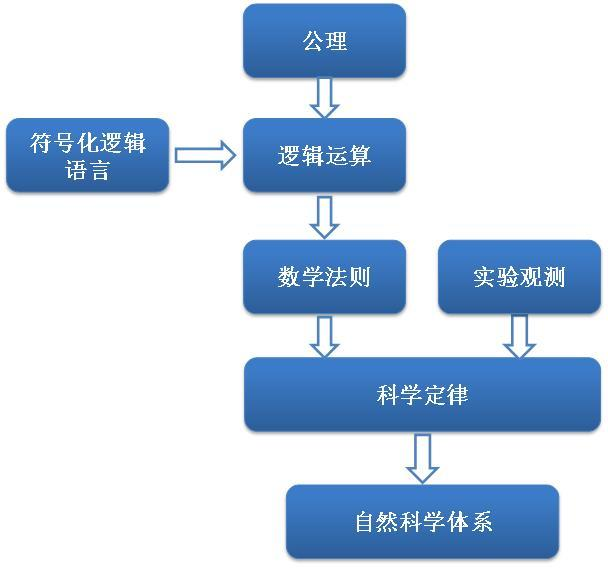
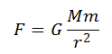
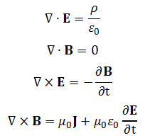
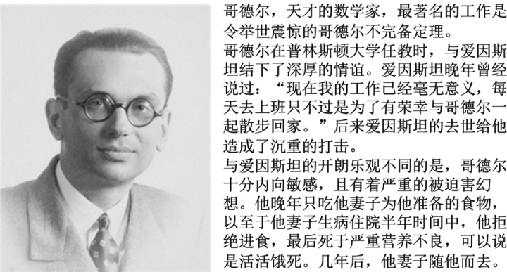

[14、逻辑不确定性](https://zhuanlan.zhihu.com/p/28544499)

***“WIR MUSSEN WISSEN，WIR WERDEN WISSEN”\***

***“我们必须知道，我们终将知道”\***

***-- 希尔伯特墓志铭\***

这一章，我们来谈一谈逻辑。前面我说过，科学的语言是数学，这里，我进一步引申这句话：数学的语言是逻辑。这话是怎么说的呢？

我们在前言中提到了物理学中的“**定律**”和“**定理**”。这两者实际上就是构成了一个科学理论的基本框架。定律是个什么东西呢？它是一个科学理论的基石，是最底层的东西。它是一切科学理论的起点，因而定律本身只能是来自于观测事实。是人们通过大量的实验和实践中，通过抽象、总结而发现的一般规律，是人们已经发现的各种不同事物的共同之处。人们把这些共同之处总结起来，提出假说把它推广到那些包括了人们尚未发现领域的一般情况。通过已发现的规律，推广到所有领域，认为它是所有事物共同遵守的规律，这种方法叫做“**归纳**”。归纳法是整个科学理论的源泉，因为说到底，科学是建立在众多实践结果之上的。通过归纳得到的定律，必须要获得实验结果的验证，它总是有效的，直到有实验结果与之不符为止。

科学定律追求的，是事物变化的最一般的规律，因而它往往是普适的。并且，就像前面所说的，科学家的一个信念，“运动是复杂的，但规则是简单的”，就注定了定律的数量不会很多，并且定律本身也不会太复杂。一个好的科学理论，其中的定律往往只有为数不多的几条。比如说，经典动力学是以牛顿三定律为基础的：

牛顿第一定律：物体保持静止或匀速直线运动，直至外力迫使改变其状态

牛顿第二定律：动量的变化与冲量成同向正比（更加流行的一个版本是：运动的变化与受力成正比，与质量成反比）

牛顿第三定律：力的作用是相互的

基本上，整个经典动力学就是建立在这三个定律之上的。

定律只是一个理论的基础，在这个基础上，通过严密的逻辑推理和数学演算，我们就可以得到很多的结论。如果推理过程和演算过程是正确的，那么得到的结论正确性就可以由定律直接保证。这种由定律推演得到的结论就是定理。与归纳法相比，定理的得出不是直接通过观测结果的总结，而是以定律为基础的。定理往往是有条件的，适用于局部范围的。

定理的正确性可以由推论过程直接检验，也就是说，定理是可以“证明”的，而定律只能“验证”。证明的过程是证明其正确性：如果定律是正确的，那么相应的定理必然正确。这种在一个假定正确的前提下，经过严密的推理过程得到新的结论的方法，叫做“**演绎**”。而定律的验证过程是不能**证明**正确性的，它只能**检验**正确性：如果事实与定律不符，那么定律必定错误，如果相符，定律未必是正确的。

前面所说，定律的数量一般比较少，所以一个科学理论是否有效，我们所需要不断检验的，就只有少数的几个定律。当然这个前提就是演绎过程必须严谨且正确。在自然科学里，这种演绎的过程基本上是通过数学运算完成的。

数学用于描述科学规律，几乎是天造地设地般配。我们随便举一个例子。在牛顿万有引力定律问世之前，人们对天体的认识和总结十分繁琐。丹麦天文学家第谷进行了大量的天文观测，留下了汗牛充栋的天体运行数据。后来，他的助手开普勒穷毕生时间对这些数据进行归纳和总结，总结出来三条定律，史称开普勒三定律：

开普勒第一定律：每一个行星都沿各自的椭圆轨道环绕太阳，而太阳则处在椭圆的一个焦点中。

开普勒第二定律：在相等时间内，太阳和运动着的行星的连线所扫过的面积都是相等的。

开普勒第三定律：各个行星绕太阳公转周期的平方和它们的椭圆轨道的半长轴的立方成正比。

开普勒三定律只在部分上上运用了少量的数学语言，虽然已经抓住了太阳系各大行星的运动规律，却十分繁琐，并且很难应用。后来，牛顿在这三个定律基础上，通过数学推演，把它们结合成为一个基本定律，著名的万有引力定律： 

我们可以看到，这个定律充分利用了数学语言，简洁而且易用。因而后世基本上把开普勒定律丢到一边，它只剩下历史意义了。

再比如说，电磁学的基础包括了几个定律：库仑定律、高斯定律、安培定律、法拉第定律。这些定律的基本数学语言就是麦克斯韦方程组： 

当然，这个方程组表达了什么意义，你现在可以不用理会，这里只是向你展示一下，用数学语言是多么方便而有力地表达一个物理原理。

数学用于科学推理的方便之处在于，**我们只需要知道基本的数学运算规则就可以进行运算了，运算的过程就是推理的过程。而这个过程背后到底代表了什么含义，我们可以完全不必理会。**一旦我们根据物理定律把它的数学形式表达出来，我们就可以抛开物理概念，而只去进行数学演算，一个对物理一窍不通的人也可以完成这个过程。演算的结果，我们知道它必然是正确的。我们只需要对结果进行物理诠释就可以了。

在一个科学的理论大厦中，定律是地基，整个建筑是所有的定理、应用等，而把这个大厦建筑在一起的水泥混凝土，则是数学。如果数学家们可以保证他们提供的数学工具是可靠的，那么科学家们就可以只集中力量考虑地基是否牢靠。而这中间，数学本身的可靠就至关重要了。

数学理论的结构，跟科学理论是十分相似的。正如定律在科学理论中的地位，整个数学是建筑在“**公理**”基础上的。公理是一批被认为天然正确的，“不证自明”的论断（命题）。比如说，整个欧几里得（平面）几何，就是建立在几个公理之上的：

一、 从一点向另一点可以引一条直线。

二、 任意线段能无限延伸成一条直线。

三、 给定任意线段，可以以其一个端点为圆心，该线段为半径作一个圆。

四、 所有直角都相等。

五、 过直线外一点有且仅有一条直线与之平行。

公理一般而言，看起来像是“废话”，因为它们完全符合人们的直觉，在古代数学家看来，是上帝留在我们大脑中的概念。但是事实上，作为数学理论的基础，这些公理也需要经过严苛的论证。有时候，公理仅仅是我们“假定”正确的一些论断，它不像是物理定律，可以通过事实来检验，因而有时候看似自相矛盾的两个命题完全可以分别作为公理，建立起不同的数学体系。比如说，欧氏几何的第五公理（平行线公理），就可以变成完全不同的命题：

（1）、过直线外一点不存在直线与之平行

（2）、过直线外一点有无数条直线与之平行

分别以这两个公理来替代原有的平行线公理，就可以建立起不同的几何理论。例如，以上面第一条“过直线外一点不存在直线与之平行”
作为公理取代欧几里得几何中的第五公理，其余公理保持不变，我们同样可以建立起一套几何自洽的理论，它当然与欧几里得几何不同，这就是黎曼几何；而以上面第二条“过直线外一点有无数条直线与之平行”取代第五公理，我们就得到了双曲几何。其中，黎曼几何已经成为广义相对论的数学基础。

与科学理论相似，在公理的基础上，通过演绎的方法，也可以得到很多有用的结论（比如说，欧几里得几何中，三角形内角和为180度；黎曼几何中，三角形内角和>180度；双曲几何中，三角形内角和<180度，等），这些结论是在公理正确的前提下，通过正确的推理方法得到的，也被称为数学定理。公理和定理以及数学的各种应用，就一起建筑起了数学理论体系。

同样的，与科学理论相似，整个数学理论大厦以公理为基础，定理和应用为建筑，而把数学大厦建筑在一起的水泥混凝土，就是逻辑。

在想当初，数学家们有一个梦想，就是想用数学表达科学理论一样，把所有的数学运算和数学定理全部归结为少数的几种逻辑关系的表达。通过为数不多的若干逻辑公理，把所有的数学定义、数学运算全部推论出来。通过把逻辑关系的符号化，建立起一套逻辑运算体系。根据这些逻辑运算体系，只要提供一套数学公理，就可以用运算的方式把所有的数学定理全部证明出来，而在证明的过程中，人们根本不必知道这些逻辑运算背后的数学意义是什么。只要知道了逻辑运算的最终结果，我们就有了一个新的数学定理。这样一来，任何的数学的推导和证明过程，全部都可以用逻辑运算来完成。这个梦想最早起源于微积分的发明者莱布尼兹，他说：

“面对一个复杂的事件，几位数学家坐在一起开会，他们说‘我们算一下吧！’然后他们拿出一张纸，在上面像加减乘除一样做出逻辑计算，得到一个计算结果，然后面对结果，每个人都知道它是正确的。”

举一个例子来说，你们以前遇到的经典的鸡兔同笼问题：

“今有雉、兔同笼，上有三十五头，下九十四足。问雉、兔各几何？”

这个问题，相信你们已经都知道如何去解。通过传统的推演方法，是有一些费脑子的，需要仔细想。但是，如果通过解方程的方法，就非常省脑子：

设鸡x只，兔y只：

x+y=35 ……（1）

2x+4y=94 ……（2）

我们得到这个两个方程之后，只要应用基本的数学运算法则，把方程解出来，就知道鸡和兔各有多少只了。这中间的数学运算，实际上是在用数学语言对这个问题进行具体的逻辑推理。比如说，按照我们解方程的标准方法，我们可以分为几步：

第一步，把方程（1）乘以2，得到2x+2y=70。这样做的背后逻辑含义是：如果鸡和兔都各长了两条腿的话，一共应该有70条腿。

第二步，用方程（2）减去方程（1），消去x得到2y=24。这样的逻辑含义是：实际上有94条腿，多出来了24条腿。

第三步，解上面消去x的方程，得到y=24÷2=12。这样做的逻辑含义是：我们前面假设鸡兔都长了两条腿，但是实际上每个兔子多两条腿，那么多出来的这些腿除以2，就是兔子的个数。

我们看到，整个解方程的过程，其实内部的含义就是对这个实际问题进行逻辑推理，只不过这个推理被符号化了（数字、未知数、加减乘除）。数学运算事实上就是对推理过程的一种符号化，它的方便之处在于，整个推理过程我们根本不必知道方程背后的实际意义是什么，我们只通过已知的运算法则就可以完成整个推演。原来的烧脑过程变成了一二三的傻瓜步骤，不但简单，而且可靠。

这，就是一个用数学运算代替实际问题推理过程的一个例子。

而前面所说的数学家的梦想，就是要搞一套逻辑运算法则，把所有的数学证明和运算过程也都省略掉。一个数学的证明完全变成逻辑运算就可以了。比如说，你们的平面几何中某一个证明题（例如，证明三角形内角和180度），你们就不必费脑筋去想这个证明过程了，只需要列出逻辑算式，根据逻辑运算法则计算就可以啦！就像数学中的+、-、×、÷等运算符号一样，通过定义一套逻辑运算法则以及逻辑运算符号，我们就可以通过逻辑符号的运算来完成一切的逻辑推理和证明的过程。那么，在几个有限的数学公理下，我们用各种逻辑符号对这些公理进行运算，就可以得到一切数学定理！

这不可谓不雄心勃勃。其实更加雄心勃勃的是，一些数学家们认为，只有那些基本的逻辑公理才是真理，其余一切，都不过是这寥寥几个公理的衍生品而已。那么根据几个公理，就可以把所有的数学哲学和自然科学的一切全部推导出来！自莱布尼兹以下，几代数学家进行了前赴后继的探索，并且逐渐发展出了一整条数学的分支学科。这个学科被称作“形式逻辑”或“元数学”。

在建设这个宏大的逻辑体系时，人们必须万分小心，那些我们依赖的逻辑公理是否正确，因为这关系到整个逻辑系统、进而整个数学系统和科学系统的可靠性。最初的逻辑公理是2000多年前亚里士多德提出的三定律：

同一律：A=A

矛盾律：A和非A不能同时为真

排中律：A和非A不能同时为假

当然，在集合论中，又有若干其它公理。前面提到的罗素悖论，就是直接原因无限制概括公理导致的矛盾。这说明它与矛盾律是相冲突的，必须舍弃其一。这才有了后面的限制概括公理。

由于罗素悖论的出现，人们修改了形式逻辑的公理基础，提出了ZFC集合公理，然后，数学家希尔伯特提出了著名的希尔伯特纲领，就是为建立完美的逻辑体系吹响的冲锋号。希尔伯特满怀信心，提出23个待解决的数学问题，其中最为人们所关注的就是：一个公理系统的**一致性**（有人把它称作“**相容性**”）和**完备性**。这句话的意思是说，我们能否构建一组公理系统，做到：1、这个系统不会发生自相矛盾；2、以这组公理为基础，可以对系统内部的所有数学命题原则上可以做出“真”或“假”的判定。当时数学的发展已经到了这样一个时刻，人们热血沸腾，要以形式逻辑一举统一数学和自然科学。

前面的两条性质，第一条是说，一套公理体系所推导出来的结论必须是相容的。如果这个系统同时得出两个结论：1、A为真；2、A不为真，那么这套系统就是失败的。因为我们可以从逻辑上证明一点：**一个理论体系中如果存在这一对矛盾，那么我们可以通过它证明一切命题。**

第二条是说，这套体系必须是完备的。我们在数学中的所有命题，要么为真，要么为假。比如说“5>0”为真；“实数有无穷多个”为真；“存在一个自然数大于所有的自然数”为假；“一个自然数的后续自然数多于1个”为假；等等。基于这套体系，对于任意一个数学命题，我们必须能够判定这个命题为真还是为假。

然而，就连伟大的希尔伯特最后也不免梦碎。击碎完美形式逻辑之梦的，是一个24岁的正在读博士的学生哥德尔。他用一种极其繁复，然而又极尽精巧的方式，证明了，希尔伯特的梦想终究不过是黄粱一梦罢了。

我们已经知道，形式逻辑可以把一个逻辑推理过程通过一些逻辑算符，写成一个逻辑运算的计算式，而哥德尔更进一步，它用自然数来代替逻辑运算的算符。通过一定的替代规则，使得一个逻辑命题变成一串自然数组成的数字。然后把所有的逻辑推理过程和逻辑运算过程完全变换成最简单的自然数运算过程。这是一种令人瞠目结舌的想法，更加令人难以置信的是，哥德尔竟然搞成了。

而接下来，哥德尔利用他的这一套符号系统，构造出来一个自己判定自己的命题。前面我们提到，一个命题不能自己引用自己，自指系统直接导致悖论，而哥德尔却巧妙地在一个命题中不引用自身却对自身做出了判定。这个过程过于复杂，这里我不会描述他是怎么做到的。

但是你一定会很好奇，怎么才能不提到自己，又完成对自己的判定呢？我们可以举一个类比的例子，我们可以说一句话，对自身所包含字数做出一个判定，这非常容易做到，例如：

“本句话有7个字。”

但是这句话显然已经引用了自己了（“本句话”）。如果一句话不引用自身，但是又要明确陈述自身所含的字数，怎么办呢？我们看下面这句话：

***“重复引号中字符后共有二十八字” 重复引号中字符后共有二十八字。\***

请想一想，这句话是否符合前面的要求呢？

哥德尔的构造过程，当然要比这句话复杂的多，这个例子只是想说明，一个命题是可以做到不引用自身而对自身做出判断的。

哥德尔所构造的命题，类似于“本命题是不可证明的”。（说谎者悖论，“本命题为假”，在哥德尔体系中是构造不出来的。）那么这个命题是可证的吗？很显然，我们遇到了罗素悖论的一个变种：这个命题为真命题当且仅当它不可证！

当然，对哥德尔的证明工作，这只是一个极其简陋，甚至是破绽百出的的介绍，请不要低估这个证明过程的复杂性。有些技术细节[[1\]](https://zhuanlan.zhihu.com/write#_ftn1)甚至很多数学教授无法理解。总之，在最后，哥德尔先后证明了两条定理：

***任何一致的系统，只要蕴含皮亚诺算术（可以包含自然数），其中必然存在不能被证明的真命题。\***

***任何一致的系统，只要蕴含皮亚诺算术，它就不能证明它本身的一致性。\***

这两条定理，被称作“**哥德尔不完备定理**”，它们告诉我们，一个数学体系，如果它复杂到一定程度，内部能够把最简单的自然数系统定义出来的话，要么它是自相矛盾的（**不一致**），要么它内部存在着我们无法证明的命题（**不完备**）。它之所以被称作“不完备”定理，而不是“不一致”定理，原因是我们无法担负舍弃“一致性”的后果，也就是说，我们不能容忍一个理论可以推出相互矛盾的结论。那么，我们就必须相信，在最严谨的数学中，也总有一些命题是无法证明的。

一个非常著名的不可解问题，就是在计算机算法中的“**停机问题**”。一个计算机程序有可能在某些情况下陷入死循环，不停地进行计算而永远无法输出结果（想象一下你在用电脑的时候发生死机让你抓狂的时候吧）。我们有没有一个办法，编一个程序，来判定其他程序是否会发生死循环呢？答案是否定的。在计算机语言中我们永远无法判定一个程序是否发生死循环。

哥德尔定理为数学划定了一条界限：无论我们如何完善我们的公理系统，只要公理的数目是有限的，里面总有一些事情，它们是真的，但是我们永远无法证明！一个严谨、明确、并且完全确定性的数学系统就此崩塌了。难怪有人说：

***“上帝是存在的，因为数学无疑是一致的；魔鬼也是存在的，因为我们无法证明这种一致性”\***

上一篇：[13、只缘身在此山中](https://zhuanlan.zhihu.com/p/28537185)

下一篇：[15、产生于不确定的确定性](https://zhuanlan.zhihu.com/p/28576046)

专栏：[魔鬼眼中的自然界](https://zhuanlan.zhihu.com/c_116602381?group_id=884931161871237120)

*[[1\]](https://zhuanlan.zhihu.com/write#_ftnref1) 最关键的两个技术细节是：1、如何将任意一个命题和推理以指定的自然数唯一替代，以及自然数运算如何表示逻辑运算；2、如何构造上述命题。*

