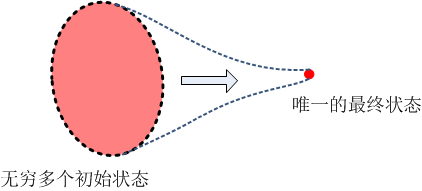
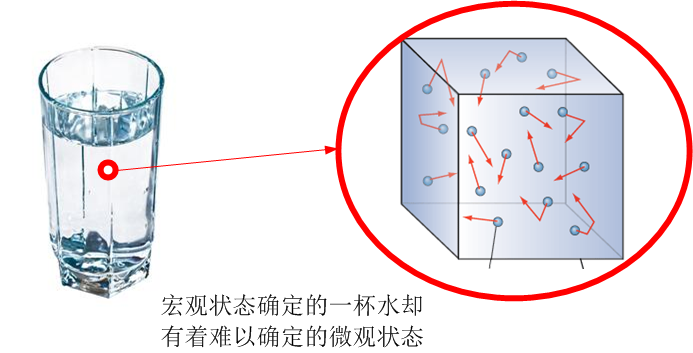
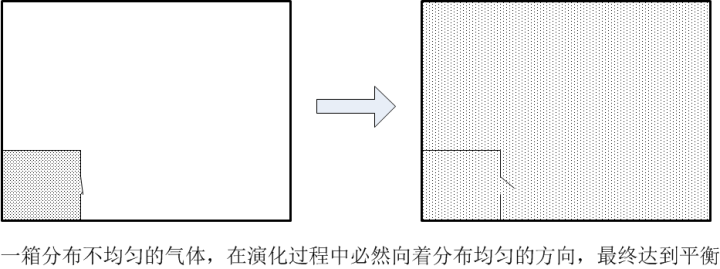
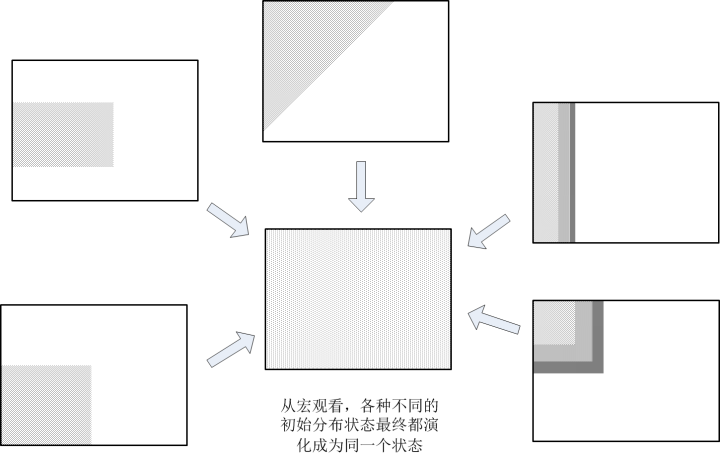
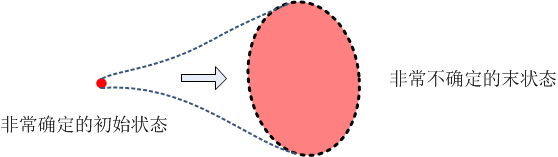

[15、产生于不确定的确定性](https://zhuanlan.zhihu.com/p/28576046)

***“Ludwig Boltzmann, who spent much of his life studying statistical mechanics,  died in 1906 by his own hand. Paul Ehrenfest, carrying on the work, died similarly in 1933. Now it is our turn to study statistical mechanics.”\***

***“穷其一生钻研统计力学的玻尔兹曼，于1906年亲手结束了自己的生命。艾伦费斯特（玻尔兹曼学生）继承了他的工作，于1933年同样死于自杀。现在，统计力学这块阵地轮到我们上了”\***

***-- David Goodstein\***

前面一系列的讨论，我们看到，在经典物理学里面，我们遵从的是决定论的物理定律，一切系统，在给定了初始状态以后，似乎都必须按照一条规定好的路径按部就班地演化。但是，我们还看到，不论是现实中（FAPP）、物理原则中、还是逻辑原则中，总是存在着不确定的种子。而这个种子经过混沌这个无处不在的误差放大器，就快速茁壮成长，最终我们完全不可能对我们的未来做出预言。哪怕是原则上都不可能。

既然混沌无处不在，那么按照这套逻辑，我们根本就不可能做出任何有效预言，那么，我们在前面第1章中所谈到的，经典物理学的成功和那些伟大的预言，又是如何实现的呢？难道我们看到的是一个假的物理学？

我们来讨论这样一个问题：一个系统，假如说它的每一个粒子的运动都是概率性的，甚至是完全随机的（非决定论），那么，在宏观上，这个系统的运动是否必然是非决定论的？也就是说，我们是不是对这个系统的宏观运动失去了预言能力？

这问题看起来似乎完全多余：这不是废话吗？一个系统的每一个组成部分都是不确定的，在最底层遵从的是非决定论的规则，难道总体上它可能是可预测的吗？但是事实上答案并不是那么一目了然。

我们举个例子，比如说给我们一杯水，由于我们前面所述的混沌的原因，我们不可能在分子动力学意义上完成对它的预测（也就是说，准确预测每个水分子的运动状态），每一个水分子在我们看来，都是杂乱而随机的。但是，作为这一杯水的整体，我们却可以非常容易地预测它的流动（流体力学）。再举一个例子，在历史中，每一个人的个体行为都是随机的，完全不可预测的，但是当地球上所有的人集合成为一个整体，进而形成的宏大历史，却是有着非常明晰的趋势和规律的。在后面章节中我们讲到层展和熵的时候，你会发现，有时候，个体的完全随机行为（100%不确定性），在整体尺度上却反过来抹杀一切未来的不确定性（100%确定），导致整体系统的无可避免的命运。

这里的关键问题就是，因为当我们向着宏观的方向扩展一个尺度时，我们所关心的系统状态就不一样了。比如说，一个原子，我们关心它电子和原子核的能级排布等；一个分子，我们关心电子能级之间的相互作用和化学键；一杯水，我们在宏观层面关心的，是它的密度，温度，压力，流动情况等等；一个天体，我们把它当做刚体，只关心它的质心运动和自转。对一杯水而言，我们绝不会过分在意这杯水中的每一个分子的运动状态。这杯水的整体运动状态叫做“**宏观态**”，而组成这杯岁的每一个分子的运动状态叫做“**微观态**”。

微观态和宏观态是两种我们对系统截然不同的描述方法。对微观态而言，它需要用每一个分子的三个方向上的速度和三个维度的位置来描述。一般我们接触的系统大约由10^23个分子组成，那么，对每一个微观态，我们需要6×10^23个变量才能完成对它的一个描述，这无疑是一个极大的天文数字。而对于一个宏观态，我们只需要温度、压力、密度等区区几个变量来描述。等于说，在宏观态中，我们忽略了绝大部分的系统运动细节，因而是一种极为粗略的描述方式，然而恰恰是这种粗略的描述，才是我们力所能及的。反之，如果我们只在微观层面上关注每一个水分子的运动，我们根本没有办法预测一杯水的整体流动。从强还原论角度出发，人们会认为，既然每个水分子的运动规律我们都知道了，把它们整体加合起来，不就是一杯水的运动规律了吗？事实上（FAPP），这是不可能的 – 我们已经看到，这个巨量自由度体系中，考虑大量水分子运动，不仅仅是增加了计算量这么简单。

所以，我们不去关心微观态，而是采取统计的处理手法，把这么多的粒子的运动统一起来看待。这样一来，大量的微观随机性和涨落，在宏观尺度上就会相互抵消、抹平，因而微观的随机性在宏观就体现不出来了。

这里，恰恰是因为微观上的随机性，才能使得它们在宏观上能够得以彼此抵消抹平。因为极大量的粒子的随机运动，体现为在各个方向上偏差都是基本上相等的，所以才能相互抵消。而如果微观上不具备随机性，它的偏差必然是**各向异性**的，宏观上就不会被抵消干净。

这就是为何我们在处理宏观系统的时候，根本不必去考虑每一个粒子的运动。只有像统计力学这种做微观和宏观之间的桥梁的学科，才会在宏观系统中考虑微观定律。

因此，我们在对水分子内部相互作用以及运动情况几乎完全无知的情况下，在宏观层面上对水的流动却可以达到很精确的预测，这是因为我们忽略了绝大多数的**自由度**（每一个单个分子的运动状态），而把我们所关心的，在整体的尺度上统合到了一个自由度很低（水的整体流动）的空间。**在还原论表现得无可奈何的时候，整体论出来救场了**。

这回我们再看一个例子：一箱气体。在初始状态t=0时刻，这箱气体内部分布是不均一的，它分布不均一的方式有无数多种，比如说，我们用隔板把它限制在箱子的一角。这时，我们把隔板打开，气体开始在整个箱体内部逸散。那么，这箱气体状态的演化是朝着怎样的方向？它最终会达到什么状态？

这个问题不需要动脑子，根据日常经验，我们就知道结论：最终，气体会扩散至整个箱子内部，并且达到处处密度相等。

我们从宏观层面来看。此时，我们关心的是这箱气体的宏观状态，最常用的例如温度、压力、密度、内能等等。在宏观层面上，我们既有流体力学的方程，也有热力学的方程来进行描述。这箱气体存在着内部的扩散和流动。通过流体力学方程可以计算气体的速度场、温度场、压力场、以及密度场随着时间的变化过程。不论初始条件多么不确定，最终它一定达到一个确定的平衡点[[1\]](https://zhuanlan.zhihu.com/write#_ftn1)。

在这箱气体的初始时刻，把气体限制在内部较小空间所用的隔板的位置、大小、形状我们都是可以任意选择的，所以，随着我们选取的限制手段不同，气体的初始状态也是千变万化。（比如说，把气体限制在一个小空间，还是大一点的空间，它的状态是不同的）。我们可以选择的气体初始状态的密度分布可以有无穷多种方式。但是，它的最终状态却只有一种，就是密度均一。也就是说，有无穷多种初始状态，最终演化变成了同一种状态。

因而，在相空间中，我们就有无穷多个初始状态构成的连续空间（粗粒），这个粗粒的演化就会不断缩小，直至最终一点。

是什么原因导致了这种现象呢？就是因为我们忽略了大量的**分子自由度**，而只考虑少数的几个**宏观自由度**造成的。这样一来，我们系统相空间的维度就从10^23这样一个巨大的数量级降低到区区几个。当我们考虑每个分子的微观运动时，我们是在详细追踪所有的系统信息的。而当我们不考虑每个分子运动，而只考虑系统的整体运动时，我们其实是在不断地忽视每个分子的运动信息的，因而我们所掌握的系统信息就会越来越少。我们前面讲过，考虑了所有分子运动时，相空间的体积是守恒的，相体积守恒意味着信息的守恒。而我们忽略这些分子运动而只考虑整体运动时，信息是不断丢失的，因而相体积必然不断缩小[[2\]](https://zhuanlan.zhihu.com/write#_ftn2)。

也就是说，这箱气体的宏观状态是注定的：不论它的初始状态是什么样子，最终它总是达到处处均一的状态。这比起我们前面一直所说的动力学系统有着更强的决定论演化，那些系统是每一个初始状态对应一个确定终点，我们需要知道系统确切的初始状态才能做出有效预测；而这箱气体，是无穷多种初始状态达到同一个确定终点，我们无需知道它的初始状态就可以断定的的终点！[[3\]](https://zhuanlan.zhihu.com/write#_ftn3)

我们知道，气体所表现出来的一切宏观状态，温度、压力、密度等等，都是微观上分子运动的统计结果。如果我们想判断系统的宏观状态，最根本的做法是考虑系统的微观状态，然后对微观状态进行宏观统计。对于气体的微观状态，我们需要考虑每个分子的运动，正向前面讨论的，它的相体积会不断精细扩散直至不可辨，使得在现实中，我们总会看到相体积的增大。如下图所示

那么，我们看到，在微观层面上，这个系统体现出来的是与宏观行为完全相反的特征：它是一个相体积扩大的过程，而宏观上它表现出来的是一个相体积不断缩小的过程。在微观上，这个系统的未来是完全不确定的，但是在宏观上，它却是超级确定的。这个似乎是很矛盾。

但是更加有意思的一点是，正是由于微观状态的**不确定**，才导致了宏观状态的**超级确定**。

怎么理解呢？我们说，从微观状态来看，这个系统的演化是迅速失去确定性的。任何一个初始状态的粗粒，最终都会扩散到整个可能的相空间：也就是说，不论系统出自何种初态，演化过程中它的每一个分子出现在何种位置，都是等概率的，而与初始状态无关。这就是统计力学的一个基本假设，先验等概率假说：在相空间中，任何演化到了最终，每一种微观状态（气体分子的位置和动量分布）都是等概率的，与初始状态无关。

现在我们将箱子等分成两部分：左边和右边。我们有若干个气体分子，我们把这些分子随机地放入到这个箱子的两边，那么，考虑如下一种情况：箱子的左侧有m个分子，而右侧有n个分子，那么m与n之间会出现什么关系呢？

为了做到完全随机，当我们向箱子中放一个原子的时候，我们通过抛硬币来决定左边还是右边。硬币正面，分子就放置在左边，反之则右边。那么，在完成大量分子的分配以后，它在左边还是右边的概率就完全等同于硬币哪一面朝上的概率。我们知道，当我们反复地抛硬币，次数不断增加的时候，硬币出现正面朝上的次数就基本上等于反面朝上的次数。当我们抛出的次数趋向于无穷时，正面次数就等于反面次数。相对应的，就是大量分子随机分布在一个箱子里时，左侧的分子数基本等于右侧分子数，即密度处处均一。

当然，左侧和右侧分子数并必然严格相等，我们可以计算其概率。事实上，对我们一般的宏观系统，一箱热力学尺度的气体，一共有大约10^23个数的分子，那么在这种情况下，我们可以计算出，有99.99999999%的概率会出现两侧分子数相差小于0.0000000001%的情况。既然分子在箱子的左侧还是右侧是完全随机的，那么，总有凑巧的时候，箱子左侧的分子运动稍微多那么一点，导致左右两侧分子数不那么相等，这种可能性有多少呢？上面的计算告诉我们，如果左侧比右侧多的分子百分比超过0.0000000002%，这种情况下出现的概率是：小于0.000000001%！也就是说，如果我们对分子数的观察精度高达0.0000000001%（凭着现代的认知，这是个神都做不到的精度），我们有99.999999999%的把握可以确定分子在箱子里是完全均匀分布的。如果我们的观察精度只有1%呢？我们的把握就提高到99.99……9%，小数点后面有，抱歉，数不过来的9。

从前面这个简单的讨论可以看到，一个热力学系统之所以最终总是趋向于处处均一，并不是因为动力学定律决定了它必然达到这种状态。而是说，不均一的分布状态从概率上是极不可能发生的。这其实是统计数学中大数定律和中心极限定理的具体体现。

当我们反过来看，实际上，我们所说的，“分子完全随机地分布在两侧”这个假设是有一定问题的，因为**从微观角度看，分子并非随机运动，而是我们无法分辨这种运动与随机运动的区别**，这是相体积的分形扩散所决定的[[4\]](https://zhuanlan.zhihu.com/write#_ftn4)。也就是说，在一切可能的现实中（FAPP），分子可以看做随机运动。

也就是说，我们对分子的运动确定性的把握在不断丧失，直至最后我们只能完全用随机过程来描述它。**这个过程，也就是我们对分子运动信息不断丢失的过程，当我们认为分子已经是完全随机运动的时候，我们对分子信息的掌握已经丢失殆尽了。而此时，也就是气体达到处处均一的平衡状态的时刻了。**

这就是我为什么说，正是由于微观运动完全丧失了确定性，导致了宏观状态获得了超级确定性。

随机过程，也意味着某种程度的决定论 – 因为随机规律也是一种运动规则。尤其是当数量极高的时候，随机涨落被抵消掉，反而会出现决定性的结果。因而，在宏观世界，我们仍然可以不必考虑微观的不确定性，来进行宏观的计算和预测。

而历史上那些著名的预言，在一定程度上，是相对比较“简单”的。首先它的自由度很少，因而，发生蝴蝶效应的机会就大大降低；其次，这些系统中恰好是没有存在混沌现象的。而在经典物理学的时代，实际上人们已经接触到了混沌系统，只不过当时人们并没有意识到。这个系统就是三体系统。你早已经看过科幻小说《三体》了，应该对三体系统的混沌运行有一个概念了吧。三体系统就是一个非常典型的区区几个自由度就构成的混沌系统。当然这样的例子还有，例如人们在研究生物种群的发展时提出的Logistic映射、由两个摆连在一起构成的复摆等等。与前面讨论的相比，小自由度系统中的混沌现象仍然是时有发生，但是很多时候我们已经可以进行不错的预测了。

上一篇：[14、逻辑不确定性](https://zhuanlan.zhihu.com/p/28544499)

下一篇：[16、决定论、自由意志、以及逻辑怪圈](https://zhuanlan.zhihu.com/p/28535294)

专栏：[魔鬼眼中的自然界](https://zhuanlan.zhihu.com/c_116602381?group_id=884931161871237120)

*[[1\]](https://zhuanlan.zhihu.com/write#_ftnref1) 流体力学的方程和我们前面所说的，对粒子系的方程，虽然根本上都是从牛顿三定律得来的，但是它们有一个很大的不同，就是流体力学方程是所谓的“耗散方程”，也就是说，流体力学方程所描述的系统相空间是随时间缩小的*

*[[2\]](https://zhuanlan.zhihu.com/write#_ftnref2) 事实上，信息不断丢失的过程，在微观态是一个相体积扩大的过程，而不是缩小。但是从宏观来看，属于相体积不可辨的过程，就是缩小了。*

*[[3\]](https://zhuanlan.zhihu.com/write#_ftnref3)如果我们不关心路径，只关心最终状态，那么热力学更加方便，在热力学层面上，这个过程要遵守热力学第一定律和热力学第二定律。热力学第一定律就是能量守恒定律，这个定律告诉我们，气体在逸散过程中平均温度保持不变（假定理想气体）。热力学第二定律告诉我们的是，孤立系统总是沿熵增方向演化。也就是说，它不管中间变化过程是什么样的，最终的结果必然是达到热力学平衡。也就是说，最终密度均一。*

*热力学第二定律是自然界中最最基本的定律之一。事实上，在包括爱因斯坦和霍金等著名科学家看来，前面这句话中的“之一”二字纯粹多余。与物理学中的其它定律相比，热力学第二定律非常不同：其它定律描述的都是物质运动的必然性（物质的运动必然遵从某种规则），而第二定律描述的却是不可能性（物质的运动在某些方面是不可能的）。*

*[[4\]](https://zhuanlan.zhihu.com/write#_ftnref4)如前所述，我们看到的相体积扩大，并非它“真正”扩大了，而是因为它与周围混合得不分彼此了。*

