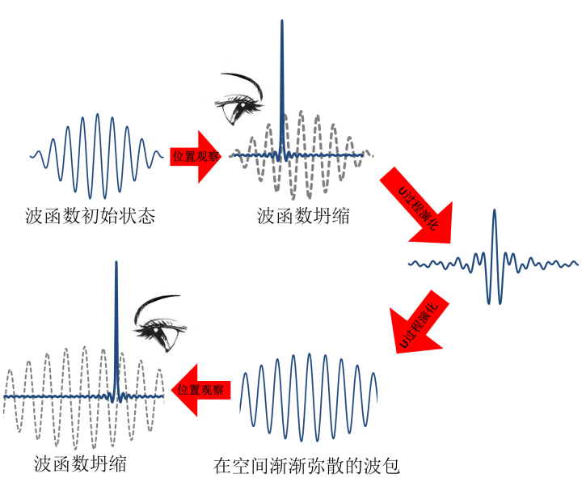
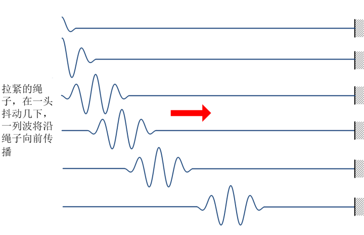
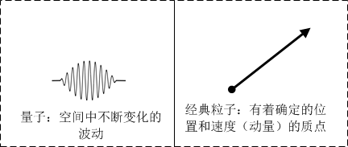
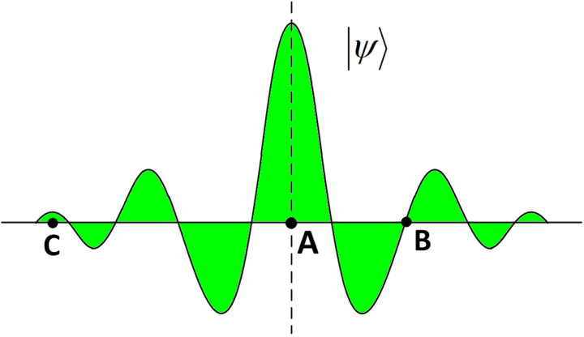
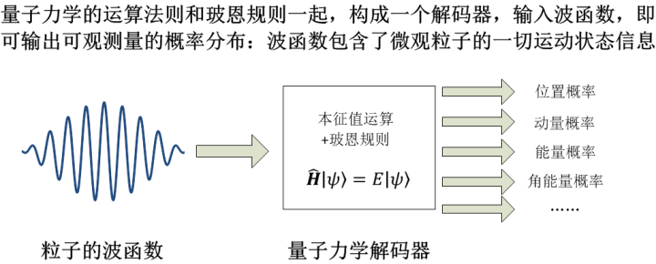
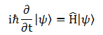
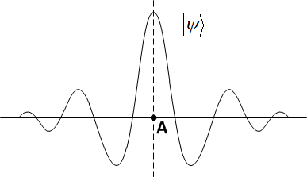
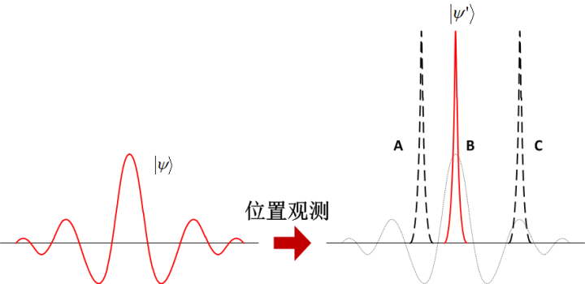

[18、量子：确定性和不确定性](https://zhuanlan.zhihu.com/p/28589770)

**“(Quantum mechanics) describes nature as absurd from the point of view of common  sense. And yet it fully agrees with experiment. So I hope you can accept nature as She is - absurd.”**

**“以常识看来，量子力学把自然界描述成为一个荒诞之物。但是它完全符合实验。所以，我希望你能够接受这个自然界的本来面目 – 荒诞”** 

**– 费曼**

前面提到不确定原理以及微观粒子的不确定性，事实上，量子力学中处处充满着各种确定性和不确定性的混合，我们来进一步看看这个奇葩的理论吧。

前面我们一直在说，根据不确定原理，量子系统不能同时具有确定的位置、动量、能量、角动量等物理量。这说明，我们在经典体系中以位置和动量定义系统的状态的做法在量子体系中显然是行不通的。微观粒子的运动状态已经不能像宏观质点那样，用确定的动量和位置来描述了。而是用一种类似“概率云”的**量子态**来描述。那么，什么是量子态呢？这个，就是著名的“**波函数**”。简言之，一个量子系统的状态是什么？就是空间中的一团波动，也就是它的波函数。这是一个完全确定、毫不含糊波纹。知道了它，就知道了量子系统的一切信息；反之，量子系统的一切信息全部组合起来就构成了波函数。

怎么理解这个波函数呢？它是这样的：任何一个粒子，一个系统，都由一个“波”来描述。这个波，是一个随时间变化的、在空间中分布的一团振动。它随着时间不断变化，在空间有一个分布范围。就像是一端固定拉紧的绳子，我们在绳子的另一端抖动几下，就会有一个绳子的波动沿着绳子传播出去。这个波动有着一个大致的形状，这个形状做波包，另外，一列波，有着几个重要性质：

它有着一定的传播速度（波速）；

它有波动的强度（振幅）；

它有波峰排列的“密度”（波长）；

另外，它还有振动的快慢（频率）。

我们以后会看到，这列波的每一个性质，都会表现为微观粒子的某种可观测量，例如，波长的大小就对应了粒子动量的大小，频率的大小就对应了能量的大小，等等。 

波函数最早提出是由薛定谔在他著名的“**薛定谔方程**”中提出来的。薛定谔方程也是一个微分方程，它的地位，就像是牛顿第二定律在经典动力学中一样，占据着最基础的那块基石。一切微观粒子的运动，都是由薛定谔方程来描述的。而薛定谔方程，就是一个关于波函数的存在和演化的方程，它的主要作用，就是描述这个波是如何存在和变化的：它的波包形状如何？它的传播速度如何？它的振幅多大？它的频率和波长有多大？等等。

那么，这样一来，对量子状态的描述，与经典的粒子就非常不一样，经典粒子是一个“质点”：

它是一个没有体积的数学点，具有质量，

在任何时刻，它都有一个（且仅有一个）确定的位置，

在任何时刻，它都有一个（且仅有一个）确定的速度。

对于经典粒子，从来不会发生“既在这儿，又在那儿”的情况，也不会认为“既快又慢”的情况
–  这些都是非常不可理喻的。而对一个量子（比如说，一个电子），情形就完全不一样，量子力学中用一个波来描述它的运动。波是空间中分布的一团，在这团波所覆盖的空间中，每一点都在不停地震荡，这个震荡在空间中不断地传播。对于一团波你无法谈论一个确定的位置。同理，你也很难谈论一个确定的速度[[1\]](https://zhuanlan.zhihu.com/write#_ftn1)。从这个直观解释上，我们可以简单地理解不确定原理的含义。

但是，我们还是不明白，一个量子力学意义下的粒子，是怎么用一个波来表示的。这究竟是什么波？自然界有很多的波动，绳子、琴弦、最常见的水波，等等这一类由实在的介质振动构成的波动叫做机械波，其实声音就是一种机械波，它是由空气（或其他声音传播的介质）的振动构成的。还有一种波动，不是“实在”的物体波动构成，而是电磁场的波动，这就是“电磁波”。

但是，“波函数”到底是什么东西在波动呢？我们可以从数学意义上轻易地理解它，但是从物理意义上说，它描述的是一个什么样的“真实”概念？这个问题，在历史上也曾经有巨大的争议。在最早薛定谔提出它时，曾经认为每一个粒子其实就是一个狭窄的波包，但是后来，人们发现粒子的所谓“波动性”与经典的波驴唇不对马嘴，它具体指的是什么，就众说纷纭了。

这场争论最终由玻恩终结了（当然，现在仍然有部分异议）。玻恩对波函数的诠释就是，这个波，波动的不是什么实际的物理实体，而是“概率”在波动，因而这个波函数，其实是一个**概率波**。

那么什么是概率波呢？

在玻恩的诠释中，一个微观粒子的运动是概率性的。在任何时刻，我们对它做一次观察，我们会发现这个粒子随机地出现在某一个地方。对于一个概率波描述的粒子，这个概率波告诉我们的是，对这个粒子做一次观察，它出现在某个地方的概率大小。

比如说，有一个粒子，它具有如下的一个波函数Ψ：

我们说，我们每次观察看到粒子，它出现的位置都是不一定的。在某个位置出现的概率取决于这个波函数在这个位置周围所覆盖的面积（绿色部分）的大小。[[2\]](https://zhuanlan.zhihu.com/write#_ftn2)比如说，在上面这个图中，粒子出现在A点周围的概率最高，而它不可能出现在B点，因为B点的波函数取值为零。那么C点呢，我们也有可能在C点附近看到这个粒子，只不过看到粒子在C点的概率很小，因为它这一点波函数的取值很小。也就是说，虽然我们有一个确定的波函数，但是我们从这个波函数中所提出的位置信息是概率性的，也就是不确定的。这就是著名的玻恩规则。

这个，就是波函数作为一个概率波的真实含义。

我们前面所说的，是位置的概率。除了位置以外，对一个微观粒子，我们还会关心其它的一些所谓的**可观测量（obserables，或称力学量）**，除了位置以外，还有动量、角动量、能量等等。其实，就像描述位置概率一样，波函数同时也描述了微观粒子的其它所有可观测量的概率。究竟是如何描述的，是通过所谓的**本征值问题**来完成的，你现在不必过于关心。

现在我们暂且把波函数类比于一套加密的编码，它把一个量子系统的全部运动状态都编码到其中了。如果我们想获得这些力学量的信息，就需要对波函数进行相应的“解码”，这个解码过程就是一系列量子力学运算，例如本征值运算等等，这涉及到一些数学过程，这里不详述。我们只需要知道，这一套量子力学运算过程就像是一个解码器，通过这个解码器，我们就可以把波函数中所包含的可观测量的信息完整地提取出来。在这个解码过程中，玻恩规则同样起着非常重要的作用，在玻恩规则的作用下，通过解码运算，我们提取出可观测量的信息是一种概率分布。

总而言之，在量子力学中，一个波函数可以**完全**定义一个微观粒子的全部运动状态。这就是为何它被称为“量子态”，这个量子态可以告诉我们，如果我们观测某一个力学量（比如说，动量），我们可能会观测到什么数值，这些数值出现的概率是多少。

我要再强调一遍，波函数给出了**全部**的系统状态。波函数之外，再没有额外的量子信息了。至于它只能给出**概率性的**可观测量数值，而不是**确切**的数值，是因为这些可观测量的概率分布就是一个量子系统“本来”所具备的最为确定的信息。不要问在这些概率“背后”，一个系统的动量究竟是多少、位置究竟在哪里，因为量子力学中的概率已经是“最后”了，它没有“背后”。

我们常说，微观粒子不具备确定的状态，指的是它不具备确定的**可观测量**，例如动量和位置。但是它的量子态，是确定的。下面我们最关心的问题就是，给定一个量子系统的初始状态（初始波函数），它的量子态随着时间的演化是怎么样的？具体讲，它的演化是否是确定的？我们能不能预测？这个问题，比想象中的要复杂那么一丢丢。事实上，一个系统的量子态演化过程有两类：

过程I（**R过程**）：是由观察行为所引发的，在观察的瞬间发生的随机的，不连续的突变，即“波函数坍缩”；

过程II（**U过程**）：在不对系统进行观察的时候，波函数由薛定谔方程描述，发生确定的，连续的，幺正的，“从容不迫”的演化。

就是这两个过程在一起，就构成了整个量子演化。

在U过程中，波函数的存在和演化是遵守薛定谔方程的：

这个微分方程，它的形式，与前面第3章所提到的经典动力学微分方程，是完全一样的，也是类似于**【某一时刻波函数的变化由该时刻波函数本身唯一决定】**。也就是说，它也是个**决定论**的方程。也就是说，当我们已知一个粒子的初始波函数，它随着时间的演化是一个可预测的过程。如果我们已知系统系统的初始量子态Ψ0，我们可以根据方程计算出将来无限远的未来中任一时刻准确的量子态，然后根据量子态，通过前面所述的“解码”运算，我们就可以做出实际可观测量的概率性预测。虽然量子态只能给我们概率性的可观测量的分布，但是，就像我们前面指出的，在宏观上，我们所关心的并不是每一个粒子的动量或者位置，而是他们的统计平均。由于随机性的相互抵消抹平，波函数所作出的概率预测，足以在宏观状态下给出非常精确的数学预期值，因此我们仍然可以对这个世界作出相当准确的预测。在宏观层面，那么，这一部分的**量子力学仍然是一个决定论的理论**。

然而，这只是量子态演化过程的一部分：U过程。真正在物理学界引起轩然大波，并且引发了长达一个世纪的史诗般的大论战的，是前面所说的R过程，也就是著名的“**波函数坍缩**”。正如上面所描述的，这个过程之所以如此富有争议，主要的原因有两个：

1、 它的发生是与观察者的观察相关的：一个系统似乎不再是独立于我们之外的客观世界，而是与我们密不可分。微观粒子似乎是知道我们在何时做何种观察，并且根据我们观察的行为跟我们玩躲猫猫游戏。

2、 它的发生时随机的，粒子在完全没有原因的情况下，随随便便就选择了一个状态。

为说明过程R，我们先以一个位置测量过程为例，说一下过程I到底发生了什么。比如说，有一个粒子，在某时刻它的波函数ψ(x,t0)在空间的分布表示如下：

那么，根据玻恩的概率波诠释（玻恩规则），我们知道，波函数的意义是概率波，是指我当们观察这个粒子时，发现它出现在空间的某一点的概率。从这个波函数来看，如果我们对粒子的位置做一次观测，那么我们发现粒子出现在A点的概率最高。

那么如果在t0时刻，我们对这个粒子的位置做出一次观测，结果发现粒子出现在了A点。我们问三个问题：

1、在t0时刻的**前一个瞬间**，粒子的位置在何处？

2、在我们完成观测之后，也就是t0时刻的**后一个瞬间**，粒子的位置又在何处？

3、在我们完成观测之后，波函数还是原来那个波函数吗？

这三个问题，在量子力学中表现出来的，就是一种完全反常识的答案。首先，我们看问题1。

按照经典思维，这根本就不是问题，答案是非常明确的，如果粒子在t0时刻出现在A点，那么意味着在t0时刻的前一个瞬间，它必然也在A点附近，或者说，是在A点附近无穷小的一个邻域之中。否则的话，这个粒子就具备了无穷大的速度，这显然是违背了相对论，是不可能的。

那么在量子力学当中呢？答案就不是这样了。对这个问题，一直以来，公说公有理婆说婆有理。我这里列举几类观点：

1、量子力学的“正统观点”。这个观点认为，在测量完成之前的所有时刻，这个粒子没有位置，它既不在A点，也不在空间中的**任何一个**确定的点，总之它无处不在，又无处存身（用爱因斯坦的话，“量子幽灵”）。谈论这个粒子的位置是毫无意义的事情。直到我们观察这个粒子，才能说它的位置在哪儿。而测量行为本身的后果，它不仅仅是获得了系统的信息那么简单，也不仅仅是对系统产生了不可避免的干扰那么简单，更加重要的是，它“迫使”这个弥漫在空间的幽灵一瞬间收缩成了一个粒子，使这个本来没有位置的粒子出现在了一个确定的位置。不夸张地说，测量不是“**获知**”了一个系统的位置，而是“**造就**”了一个系统的位置。至于测量是如何迫使粒子“显形”的呢？我们不知道，也无需知道，我们只需要知道我们的理论与实际观测一致就好了。就这个问题，可以衍生出无数种诠释，这就是量子力学主要学派之间的区别所在。

2、“现实主义”观点。这个观点认为，没错，在t0前的一瞬间，粒子像经典图景下一样，肯定也是在A点。不确定并非自然的**本性**，而是我们对自然的**无知**。那么问题就来了，既然测量前粒子有确定的位置在A点，我们的理论就应该给出这个结论。然而我们知道，波函数只能给出粒子出现在某个位置的概率，却没有能力给出它确定出的位置。也就是说，在我们观测前的一瞬间，我们明知道粒子就在A点，但是理论上却无法给出这个结论。这就意味着，量子力学本身是**不完备**的，波函数并不能完整地定义一个量子态（粒子有确定的位置，量子力学却不能描述）。具体还有其他的信息怎么描述？那就用到量子力学以外的理论了（“隐变量”理论）。

3、“Shut up and  Calculate”观点。这据说是费曼的一句名言，当一次有人问费曼，你究竟更喜欢哪一种诠释？他回答说：“闭嘴，计算！”意思是说，哪来的那么多为什么，这个世界本来就是这样运行的。比如说这个问题，什么叫“测量前”？你去问测量前粒子的状态，有意义吗？反正不论怎么回答你都无法检验对错，任何一个无法判定对错的讨论都是在耍流氓！“这和讨论一个针尖上面能坐多少个天使有何区别？我们无需为某些我们根本无法实证的事情浪费脑力。”“**这连一个错误都算不上**。”（泡利名言）怎么，还不明白？还想再问为什么？好你个哲学家妖孽（费曼以极其蔑视哲学家而著称），吃俺一棒！

事实上，令人惊讶的是，到现在为止，多数科学家采取的态度多多少少都是第三种。这个逃避态度其实并非那么不堪。因为物理本身是实证科学，我们最关心的不是理论与“**客观现实**”相符，因为我们不知道真正的“客观现实”是什么，我们只知道我们对“客观现实”的观察结果是什么，因此，我们关心的是理论与“**测量结果**”是否相符。至于  “客观现实”如何理解，那就很随意了，只要能自圆其说就可以了，反正都没法实证。很多人的态度是：我现在姑且接受“正统”诠释，这个诠释十分奇葩，让人迷惑，但是我习惯了也就好了。如果你继续刨根问底，最终我会变得不耐烦，让你闭嘴，有闲工夫不如多做两道题。大多数量子力学课本对此也往往采取回避的态度，它们只是向你罗列各种学派的观点，很少有人深入讨论。说到底，各派观点最终产生的定量结果是没有什么差别的。理论能如此严格地符合实验，又产出了如此辉煌的实用价值，这是一个实证主义物理学家的最高境界，夫复何求？

对于第二个问题，“在我们完成观测的后一个瞬间，粒子的位置在何处？”大家倒是毫无异议，一致认为：在t0后一瞬间再进行测量，粒子的位置仍然是A。这是当然的，作为一个理论的可预测性和可重复性的要求，它必须是这样的。否则的话，时间间隔无穷小的连续两次测量给出的位置不一致，就必然违背相对论。

那么第三个问题也就毫无异议了。因为，一个系统的波函数如果是一个分散在空间的波，意味着粒子位置的可能性也分散在空间。当我们确知粒子的位置时，它在空间其他位置的可能性就全部变为零。既然测量后的瞬间我们知道粒子具有确定的位置A，那么就意味着粒子的波函数只在A点有值，其余的位置都是零。那么这个粒子的波函数就是在A点的一个无穷狭窄的尖峰[[3\]](https://zhuanlan.zhihu.com/write#_ftn3)。（也就是说，A点是唯一一个有概率的点，其余的任何一点，粒子出现的概率为零）。

我们暂时抛开其他，单考虑“正统”的量子力学诠释。对前面三个问题的答案很容易引导我们得到了这样一个结论：就是观察者在对系统做出一个观测的时候，系统的量子态会根据你测量而相应作出改变。对一个分散在空间的波函数，测量的结果就会使得波函数从一个扩散在空间的波变成了一个狭窄的尖峰。而这个尖峰它会出现在何处呢？它就出现在我们测量过程中找到粒子的那个位置，这个位置是概率性的，根据观测前波函数的具体取值，取值高的地方，这个尖峰出现在这里的概率就大，取值小的地方，尖峰出现的概率就低。总而言之，在观测的瞬间，波函数从一个“正常”的波，突然之间缩成了一个尖峰。尖峰可能出现在A、B、C或者其他任意位置，这样我们就得到了一个确定的位置测量。对于一组完全相同的量子态（系综），做出完全相同的观察，每次尖峰出现的位置是不同的。这就是“**波函数坍缩**”。

所以说，这个过程R描述的是，一个观测行为使得系统的量子态（不论它以前是什么状态）在一瞬间从一个分布变成一个尖峰，而尖峰出现位置的概率是由玻恩规则所描述的。这就是为什么在观测之后立即做出下一个观测的时候，我们仍然得到相同的观测结果，因为此时波函数仍然是一个尖峰，当然我们必然观察到粒子在确定的A点，而不可能在其它任何地方。

现在，我们回头总结一下量子演化的两个过程，R过程是由观测引发的，一瞬间使得波函数发生突然的、概率性的变化。U过程是在我们不对系统做出任何观测的时候，系统按照决定论的方式连续地，“乖乖”地演化。这里令人无法接受的地方集中体现在：

- 当我们不观测粒子的时候，它弥漫在空间，像个幽灵，无处不在，同时无处可寻。你要是问它在哪儿？对不起，这个问题毫无意义。如果用戏剧性语言描述的话，它哪儿都在，同时哪儿都不在。
- 观测行为成为一个物理过程中的关键，因为在观测的同时，那个无处不在的幽灵突然之间缩成一点出现在你面前，变成了“实体”。而它具体缩到哪一点？完全由它自己随心所欲，我们除了可能性，其他的无法事先获知。
- 事实上，当你完成一次观测，波函数坍缩成一点以后，如果你不立刻进行下一次观测，量子力学的必然结果就是，这一点又迅速开始弥散开来[[4\]](https://zhuanlan.zhihu.com/write#_ftn4)（重新扩散到空间成为一个幽灵。

很怪异，不是吗？

当我们回来再重新审视量子力学中的概率性和非确定性时，我们此时就会有一个新的认识。当我们不观测一个粒子时，我们可以根据薛定谔方程计算它的波函数。而这个波函数的含义是个概率波。请注意的是，这个概率并不意味着非确定性，因为就像我们一再强调的，波函数（量子态）才是粒子运动状态的描述，而此时粒子没有位置这个概念。不论量子态给出怎样的位置可能性，那只有在我们观测时才有意义。如果我们不观测，就不会引入任何非确定性。真正引入非确定性的，是在观测的时候 – 也就是著名的“波函数坍缩”过程。

波函数坍缩是由观测引发的。观测过程中发生了两件事：1、我们获得一个可观测量的确定值；2、我们对使波函数随机地发生一个突变（坍缩）。每一次的测量，都会使得波函数发生一次瞬间的突变，而这个突变是概率性的，它遵守玻恩规则。很明显，这个波函数坍缩的过程，是非决定论的。每次观测前，我们只能预测我们观测得到的数值的概率分布，以及观测后波函数可能出现的概率分布。

好了，纵观整个量子态的演化过程，每当我们进行观测时，系统波函数就发生坍缩，这是唯一的不确定过程。正是由于波函数的坍缩，使得系统发生了随机性的变化。这个怪异的观测过程，是非决定论的。

我们不可避免要对系统进行观测，正如前面所说，一个无法观测的系统是毫无意义的。那么我们似乎可以下结论，量子演化总的说来是非决定论的。

哦……，对吧？

我们考虑这样一个系统：在根本上，我们都遵从量子力学的规律，这时爸爸在房子里观察房子里旺财的动静，而你在房子外面，随时可以开门来观察爸爸和旺财的动静。对爸爸而言，旺财是被观察的系统，而对你而言，爸爸、旺财、整个房子在一起是被观察的系统。当爸爸对旺财做出一次观察时，爸爸认为，旺财的波函数坍缩了，它发生了一次随机性变化，产生了一个确定的状态；而此时，你并没有观察，因而，你认为，爸爸和旺财的波函数都没有发生坍缩，一切的一切都“正常”地按照决定论方式的薛定谔方程演化。那么，这两者，你认为的 – 一切还都在掌握之中、爸爸认为的 – 发生了一次随机的变化，谁正确呢？

看到这里，你知道，问题还远没有结束。事实上，再往下讲，我们会发现越来越多的量子力学奇葩之处，不光是决定论和因果论，我们另外一个更加稳固的常识也将受到严重挑战：“这个世界是真实的吗？”，也就是世界的“实在性”。在整个量子力学中，决定论和实在论将同时变得纠缠不清,这将需要把我们的话题进一步扩大。

所以，**关于决定论的讨论虽然还没有结束，但是我就先到此为止吧**。下面将更与其他问题混杂在一起，也更加精彩，请期待第二部分“世界是真实的吗？”，在那里，庄周蝴蝶、笛卡尔恶魔、薛定谔猫、魏格纳的朋友、量子幽灵、罗素的茶壶玻尔兹曼大脑，等等各种精灵你方唱罢我登场。预知后事如何，且听下回分解！

====================

好了，在我们进入本书第二部分之前，我们先来把拉普拉斯之妖和它的决定论做一个阶段性的总结。我们知道了决定论，也知道了在决定论中，有着各种不确定性的端倪，包括：

1、经典不确定性

2、逻辑不确定性

3、量子不确定性

经典的物理学是决定论的。对于任何一个系统，只要给定了初始状态，那么，我们都可以通过动力学方程，把它未来任何一个时刻的状态计算得清清楚楚。当然，我们也可以反过来，用现在的状态把它历史上发生了什么也计算得清清楚楚。不但如此，我们对现在观察的精度，就决定了我们对历史的推算和对未来的预测精度，它们是一致的，宇宙的演化过程不增加任何不确定性。总而言之，经典的物理世界就是这样，现在、历史、未来所包含的信息量一模一样。历史和未来，就像是一面哈哈镜中映射出来的现在。所以，我们说，当我们在观察现在的时候，同时我们也在观察历史和未来。我们对现在观察有多精细，对历史和未来的观察就有多精细。从这个角度上说，过去即现在，现在即未来。所谓的时光流逝、过去现在未来之间的差别，似乎都是幻象。

但是，哪怕我们这个宇宙的未来是唯一注定的，它也隐藏于迷雾当中，让我们无法看穿。这个迷雾就是混沌。混沌的主要特征包括蝴蝶效应和相空间的分形演化。因为蝴蝶效应的存在，任何一个微小的误差都可能会以恐怖的指数速度放大，因而在极短的时间内，我们的预测就失效了。而由于蝴蝶效应和分形演化的共同作用，系统那个确定的未来和其它各种可能性以无穷精细的程度混合在一起，乃至于任何现实的精度都无法把它分辨出来。

在现实中，我们不可能达到一个无限的观察精度，我们也不可能有一个绝对无干扰的孤立系统，即使是我们的观察，也会对系统造成不可避免的扰动，因而，我们对系统的把握，总是有那么一丢丢不确定性的，而通过蝴蝶效应的放大，这一丢丢不确定性就迅速变成了完全不确定，因而在现实中（FAPP），未来是不可预测的。

“不可预测”与“不存在”还是有所区别的。原则上，我们不能达到无限的精度，但是我们可以逼近零误差，这样我们的预测就能逼近实际。这是经典物理的决定论方程所决定的。**因此经典物理学认定现实中未来不可预测，但是原则上并不否认一个确定的未来。**

但是，我们很快发现，这个确定的未来**即使是在原则上也是不可知的**，这是由于逻辑悖论。

我们必须知道，作为预言者的自己也是宇宙的一部分，而要想预言一个包含了预言者本身在内的宇宙，从逻辑上总是陷入自我引用的悖论。“我”在完成一次预测的同时，不可避免地改变了“我”自己的状态 –  我对宇宙的认知状态。既然“我”是宇宙的一部分，“我”的自我状态就是宇宙状态的一部分。因而，基于宇宙的某一个初始状态A，我们做出预测，而预测这个行为本身，却把宇宙的初始状态改变了，变成了B。我们预测的是一个基于A的宇宙，但是实际上我们得到的是一个基于B的宇宙。A和B的区别在于“我”对宇宙的认知，而这个认知将会极大地改变“我”的行为，进而改变了宇宙的命运。

哥德尔不完备定理正是用一种极其精巧的方式，构造了严格数学意义上的自我引用命题“本命题不可证”，证明了，我们的逻辑中总有一些明明是**正确**的，但是我们却**无法证明**的东西。而经典物理学中，确定的未来明明是**存在**的，但是我们原则上**不可知**，这是多么相似的结论啊。

而量子力学的出现，更是以它匪夷所思的种种特性，刷新了我们的三观。海森堡的不确定原理说，一个微观粒子的运动，本身就是不确定的，我们甚至无法定义微观粒子确定的位置和动量。因此我们会面临着无处不在而又无处存在的微观粒子 –  量子幽灵。事实上，在量子力学中，我们用波函数来描述微观粒子的运动状态，而波函数是个概率波，它编码了微观粒子所有的运动信息，我们通过量子力学的运算和玻恩规则，就可以获知粒子所有可观测量的概率 – 但是也只能获知概率。

波函数的演化有两个过程，一个是决定论的U过程，另一个是“波函数坍缩”的R过程。R过程的存在是量子力学中最令人疑惑的部分，正是由于它，在量子系统中引入了真正的随机性，

量子力学无疑是匪夷所思的，完全违背我们的直觉。到现在为止，似乎没有任何一种诠释可以令人完全满意。很多人采取了“闭嘴计算”的态度，我现在仍然处在迷惑之中，而你的妈妈则明确地讨厌这种态度。但是说到底，科学是一个研究“HOW”而不是“WHY”的学问，想要满足内心深处的好奇，我们必须要对它进行诠释。而后面我们会看到，正是这种诠释，让我们产生了更大的疑惑：这个世界的“实在性”。

前面把拉普拉斯之妖的全部内容做了一个简单的总结。更加浓缩的话，只有三句话：

经典不确定性使我们丧失了对未来预测的**可行性**；

逻辑不确定性使我们丧失了对未来预测的**可能性**；

量子不确定性（可能[[5\]](https://zhuanlan.zhihu.com/write#_ftn5)）使我们丧失了确定的未来**本身**。

上一篇：[17、经典不确定和量子不确定](https://zhuanlan.zhihu.com/p/28582873)

专栏：[魔鬼眼中的自然界](https://zhuanlan.zhihu.com/c_116602381?group_id=884931161871237120)

*[[1\]](https://zhuanlan.zhihu.com/write#_ftnref1)这一点似乎不那么明显，事实上，一个波包是不具备确切的传播速度的，根据傅里叶变换，任何一个波包都可以分解成一系列不同波速的“谐波”，而每个谐波的传播速度有所不同，因此一个波包包含了一系列不同的波速。波包作为一个整体的传播速度，其实是各种速度的统计平均值（群速度）只有这个波是一个谐波的情况下，才会存在着确定的速度。然而，谐波就意味着，这列波在空间是无限弥漫的，也就是说，它的位置是极度不确定的。这就是为何会出现不确定原理所说的：确定的位置意味着极度不确定的动量，而确定的动量意味着极度不确定的位置。*

*[[2\]](https://zhuanlan.zhihu.com/write#_ftnref2) 事实上，这样说是不严格的，波函数是一个复函数，并不能表示概率分布，真正表示概率的，是归一化的波函数的模平方。此处限于你的数学基础尚未了解复数，就不作区分了。*

*[[3\]](https://zhuanlan.zhihu.com/write#_ftnref3)这个尖峰有这样一个特点：它只在A点有值，但是它所覆盖的面积却是1。这是一个抽象函数，叫做狄拉克函数（著名的Dirac-Delta函数）。*

*[[4\]](https://zhuanlan.zhihu.com/write#_ftnref4) 这个叫做波包的“色散”现象，你暂时可以不必明白*

*[[5\]](https://zhuanlan.zhihu.com/write#_ftnref5) 这件事情，远远还不到定论的时候，似乎是“正统”的概率性非决定论的量子力学诠释取得了全面性胜利，但是它中间致命的难题，仍在争议中。决定论式的量子力学诠释也仍然不能被彻底否认。*

