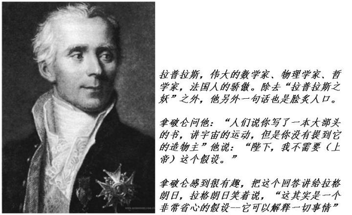

https://zhuanlan.zhihu.com/p/28522532

# 1、拉普拉斯之妖

**“We  may regard the present state of the universe as the effect of its past  and the cause of its future. An intellect which at a certain moment  would know all forces that set nature in motion, and all positions of  all items of which nature is composed, if this intellect were also vast  enough to submit these data to analysis, it would embrace in a single  formula the movements of the greatest bodies of the universe and those  of the tiniest atom; for such an intellect nothing would be uncertain  and the future just like the past would be present before its eyes.”**

**“我们可以把宇宙现在的状态看作是它历史的果，和未来的因。如果存在这么一个智慧，它在某一时刻，能够获知驱动这个自然运动的所有的力，以及组成这个自然的所有物体的位置，并且这个智慧足够强大，可以把这些数据进行分析，那么宇宙之中从最宏大的天体到最渺小的原子都将包含在一个运动方程之中；对这个智慧而言，未来将无一不确定，恰如历史一样，在它眼前一览无遗”**

大约200年前的一天，法国著名的科学家拉普拉斯说了上面这段话，在科学和哲学界引起了轩然大波，余波至今未消。就是著名的“拉普拉斯之妖”的表述。

这段文字对你而言可能稍微有点拗口，我可以把它重新表述一下：这个世界是服从因果律的，也就是说，每一件事情的发生，都是有它的原因的，比如说，起风了，那是因为空气在流动，而空气流动，那是因为大气压强发生了不平衡，而大气压强的不平衡，是因为太阳辐射到地球的能量引起的，……，等等等等，我们可以一直向上追溯。一件毫无起因的事情是无法想象的；那么反过来说，每一件事情的发生，都是有后果的，我们同样无法想象一件事情发生之后没有任何影响。那么，一件事情A发生后，产生了一个后果B，而B的发生，又引发了一个后果C，……，这就形成了一个因果链。

物理学中，对自然界中的任何一个“因”，我们想推知它的“果”，物理学就是研究自然界中这些因和果之间的相互规律的，这些规律就是物理定律。当我们知道任何一个“因”，通过物理定律我们就可以推测出它所有的“果”。顺着这条链，当我们知道A发生时，就可以推测出B，再推测出C的发生，进而推测出A这个事件对未来产生的一切后果。

我们不可能对一个事物穷究它的一切起因，因为这总不会有一个尽头，我们必须在某一时刻停止对“因”的回溯，比如说，在事件A，我们认为它是一个起始事件，它将成为后续一切事件的最开始的那个“因”，在A之前，我们就不再追究。我们就把A称作“**初始状态**”。当我们知道了A时，我们可以向后推测A所引发的一切后果链。

然而，在现实中我们人类没有能力完全预测所有的未来。原因是，我们不可能知道这个世界上发生的一切。比如，在我们已知的事件中，我们可以根据A推测出B的发生，进而推测出C的发生。但是这个世界中有太多我们不知道的情况，这些事情的后果也都足以影响到你所关注的因果链。比如说，你在读这段文字的时候，并不知道院子里旺财的情况：它正在趴着晒太阳，还是在愉快地奔跑，还是在幽怨地等候你去开门把它放进屋里？你不知道这些事，因而这些事产生的后果你也就不会知道，而这些后果对你身边的事情有何影响？下一时刻会不会来了一个快递小哥，引起了旺财的狂吠，而打断你的思考？你更加无法预测。你身边的事情，受到了太多的你所不知道的事情的影响，因而，世界中就有了太多的不可预知。

这时候，拉普拉斯想象了这样一个无所不能的妖怪：它无比渊博，而又无比聪明。在某一时刻，它观察了一下这个世界，因而知道了这个世界上正在发生的的一切，它知道了所有事物的状态，从每一个微小的原子，到所有的星系。它又知道所有的物理学定律  –  也就是说，它知道这一时刻所有的“因”，也知道所有的因果之间的必然联系，那么它就可以推测出这些“因”产生的所有的“果”，进而推测出这个世界未来发生的一切事情。

你可以怀疑这么强大的妖怪是不是可能存在，这不重要，重要的是，不论它是否存在，这个思想实验都得到了一个结论：这个世界的未来一切都是已经确定了的，原则上我们是可能预测的。我们知识有限，因而不能够完全预测，这并不影响这个已经注定的未来存在这一事实！

这段论述出自1814年拉普拉斯著作“A  Philosophical Essay on  Probabilities”（概率论的哲学探讨）。这可能是整个科学哲学历史上最有争议的一段文字之一了。这中间提到了一个可以全知初始条件并可以根据物理定律预测一切未来的“妖怪”，这就是后人谈论的著名的拉普拉斯之妖。在我看来，科学家和哲学家们创造了那么多的“妖怪”，其在科学和哲学上引起的争议，都难以与拉普拉斯之妖相提并论。事实上，拉普拉斯之妖的争论经过了200年直至今天，仍然没有得到公认。

**这种信念：自然界的一切，每个“因”严格决定了每个“果”，而每个“果”都可以追溯到它的“因”，进而推而广之，自然界中的整个时空中，每一时刻、每一位置，所有现象都是由自然规律的因果链严格确定的，就是决定论。**

这段话有它的特定历史背景。当时，正处在在经典力学的巅峰时刻，物理学取得了巨大的成就。

经典力学是物理学发展史上第一个黄金时期，它从伽利略第一次本着实证和分析相结合的精神对亚里士多德的自然哲学进行批判开始，到牛顿提出了著名的牛顿三定律和万有引力定律、牛顿和莱布尼兹同时建立了微积分的数学工具，这时整个理论框架已经完全建立起来；后来，由拉格朗日、哈密顿等人把牛顿力学重新表述，最终成为简单优美的哈密顿方程；再后来，玻尔兹曼、麦克斯韦、吉布斯等人建立了统计力学把热现象归结为分子运动；直到它最后一个高峰，在法拉第、安培等人的铺垫下，麦克斯韦建立了完整的电磁理论，把电磁场的运动规律描述得清清楚楚。

到这个时候，整个自然界，各种宏观物体的运动，热现象，电磁场，全部有了完备的理论。宇宙万物，从质点和刚体的运动，到宇宙天体的运行规律，都可以归结为几个简单的力学定律（牛顿三定律）。看不见摸不着的电磁场，人们也可以得通过麦克斯韦方程组心应手地精确计算。

在经典力学的理论下，如果已知一个系统现在的运动状态，人们通过构造若干微分方程，然后就可以精确计算这个系统未来的一切运动情况。经典力学定律简洁、优美而有效，从简单的质点和刚体运动，到大量质点构成的流体系统，从人们设计的复杂机械，到整个太阳系所有行星和彗星的运动，人们的观察结果无一不验证了经典力学的正确性。

经典力学冷酷而完美，它的每一个成就，都在向我们展示决定论的强大威力：我们可以计算太阳系中每一颗行星的运动，精确说出它们在未来几年内的运动轨迹，人甚至不用经过天文观测，仅仅通过数学计算，就可以断言当时尚未发现的海王星的存在，以及它在何时出现在何处。

经典物理学的另一个伟大预言就是电磁波。当时人们完全不知道有电磁波这个东西的存在。1864年，麦克斯韦在解他的方程组的时候，预言存在一种电磁场的波动，可以传递能量和信息。因为计算发现电磁波的传播速度正好是光速，他同时预言光是一种电磁波。20几年后，赫兹做实验发现了电磁波的存在，并且实现了跨越大西洋的远程传播。

经典动力学对质点、刚体、乃至电磁场的精确计算，使当时的人们越来越滋长了一种科学的傲慢：这个宇宙中的每一个体系，它的运动都是是可精确预测的。推而广之，我们的世界，包括我们每个人，前途都是可以计算出来的，因而是注定的。

其实，追根溯源，从很久以前，人们就早已经根深蒂固地用决定论的思维模式来考虑问题了。比如说，在古代士兵们射箭。面对一个靶子，一个射手要如何才能射中靶心？这包括了士兵射击时的力量，角度，时机等等。士兵们大致知道，他们用的是多重的箭，多长的箭，用什么样的力量，什么样的角度，射出去的箭就会按照预想的飞行路线，最终射中该射中的地方。复杂一点，他们还会考虑射击时候的风速、风向，以及自己的运动状态等等。现代的每一个高中生都明白，这其实是在考虑一个关于抛物线的问题，当然其中还间杂着空气动力学的问题。一个好的射手，他会根据环境的情况（风速，弓箭的情况，敌人的运动速度等）非常熟练地估计出一个角度和拉弓的力度：把射箭的姿势调整成这样，就必然正中靶心。这里就有一个典型的决定论思维：如果没有外界的突然干扰的话，箭在离弦瞬间的那一刻的状态（还包括周围环境的状态）一定，那么它后面在空中飞翔的每一秒钟的状态都是精确确定的：箭飞翔的未来完全由此刻离弦的状态所决定。

甚至我们日常的一切行为，都深深地打上了决定论的烙印：比如你在打羽毛球的时候，你的跑位、调整姿势、挥拍出击，这一系列动作都是基于你对球的飞行轨迹的预判：你坚信，根据球从对手那边击出的情况，你能预先知道球在什么时刻飞向球场的什么位置，包括高度、角度、力度等等一切。假如说你没有这种决定论式的预判，球飞过来是完全不可预料，你根本就不可能完成一次漂亮的击球！再比如说，当我们开车出行时，我的每次油门、刹车、方向盘的动作，都是对行车轨迹预测的结果，如果车行的情况完全不可预测，那么我要吃到多少罚单啊。

我们再来看一个稍微复杂一点的例子：桌球。我们假设一个绝对光滑的桌面，它的边框是完全刚性的，里面的小球也都是光滑而且刚性的。那么，小球在桌面上的运动将会完全没有摩擦力，并且所有碰撞都是完全弹性的。这时，我们在桌面上放置一个桌球，并将它击打出去。好了，凡是有中学物理概念的人都很清楚，只要是这个小球在出发的那一刻，它的运动方向和快慢已知，那么这个小球在桌面上的运动我们就可以精确计算。小球的运行轨迹和速度的演化过程完全是确定的。我们可以很自信地说，小球的命运将是注定的：在无限长的未来，它每一时刻的位置和速度我们都可以精确预言。

那么，如果桌面上有两个小球，小球除了在桌面上匀速运动、与边框碰撞以外，还多了相互之间的碰撞。计算上会复杂一些，但是仍然，碰撞过程也是一个确定的过程，任何高中生都可以根据能量和动量守恒计算出来。那么根据这两个小球的初始运动状态，我们同样可以精确预言未来它们的全部运动轨迹。

那么，如果桌面上有三个桌球呢？很容易推而广之，这其实也没有什么区别，你根据每个小球的位置和速度，就可以计算出它未来每一时刻的位置和速度，本质上讲，桌面上无论有多少个小球，都不会影响到我们的这种预言。N个小球，如果我们已知这N个小球每一个的初始的运动快慢和方向，那么它们的命运就全部一览无余了。不论N是区区几个，还是一个天文数字，区别仅仅是计算量而已。

如果你说，光滑和刚性都是理性情况，实际上是不存在的。其实，这只是增加了一下复杂性而已。如果我们知道桌面的摩擦系数，以及碰撞过程中的阻尼系数，小球的命运仍然是可以精确预言的。甚至而言，即使是考虑到小球之间、小球与桌面之间的一切相互作用力，包括小球之间的万有引力，都不会阻止我们做出预言。当然，现实中，这个预言是有精度的，不可能做到绝对精确。但是无论如何，从原则上讲，随着我们观察精度的提高，我们的预言就可以不断逼近现实。**这个不断被逼近的现实，就是小球注定的命运：小球的未来不会随着我们的精度有所变化，它是注定的。**

我们已知的宇宙中大约有1080个原子，如果每个原子看做一个桌球，那么推而广之，我们可以说，整个宇宙无非就是一个大个儿的桌球游戏而已。（当然，原子之间的相互作用和桌球不同，但在经典力学中，它们的决定论原则并无不同）。

那么，以此类推，如果拉普拉斯之妖的智慧足够强大，以至于在某一时刻，它可以精确获知此时组成这个宇宙中的所有粒子的状态，那么，在它看来，宇宙中每一个粒子的未来都是可以精确预测的，每一个粒子都有一个注定的命运。既然每个粒子的命运都是注定的，那么这些粒子所组成的宏观事物，石头、山水、飞禽走兽、行星、恒星、星系，等等一切，这些事物的命运也就是注定的  – 既然拉普拉斯之妖可以准确预测出你的每一个组成部分，那么你作为整体当然也就确定了。那么，整个宇宙的一切命运全部不言而喻地难逃那个注定的命运。

我不知道你还记不记得我们一起在科技馆中看到的那些精巧的机械结构：齿轮、链条、轴承、凸轮，等等。把这些很复杂的机械零件组合起来，就可以使得它非常精确地完成我们想要的动作，绝不走样。一个非常典型的这种机械就是钟表。无数个大大小小的齿轮组合起来之后，这个钟表就会一丝不苟地按时间一圈圈转下去，不快一步，也绝不慢一步。时针的命运就注定这么孤独地在表盘上跑马拉松。

这就涉及到一个对于人类而言非常根本的话题：我们自身，作为这个宇宙的一部分，命运到底是不是也是可以精确预测的？或者退一步说，即使因为技术原因不能够精确预测，它在原则上是不是注定的？我们为了改变命运而所做的一切努力，是不是仅仅是命运的一部分？我们是不是只是一群可笑的提线木偶而不自知？

拉普拉斯的论述表明，我们这个宇宙也是一个复杂无比的钟表，我们每个人都按照既定的轨迹，孤独地奔跑着。在这个世界里，我们每个人的命运都是一开始就安排好的，每个人的所谓自由意志都只不过是一种幻象。包括我们此时兴致勃勃讨论这个问题所展现出来的好奇心，都是假的

– 多么令人悲哀的结论啊。

我不知道你喜不喜欢这样的结论，反正我不喜欢，非常不喜欢。很多人都不喜欢，于是，人们就开始寻找那些反例，来寻求一些希望，来证明我们是自由的，我们的未来充满各种可能，而我们自己，在一定程度上是可以决定我们自身的命运的。

渐渐地人们发现，我们的预言能力在某些领域中似乎失效了。例如天气预报，我们的预报能力近年来大大增加，但是，如果电视上出现了一个预报，说两周后会有寒流到达，那么这必定是在胡说八道  –  我们只能大致预测今后几天的天气。再比如，股票的走向，没有任何人可以根据经济学原理预测一支股票在一个月以后价位如何（人们渴望这个点石成金的能力，程度超出了所有的科学研究）。最简单的，人们甚至不能预测一个硬币落下时哪一面朝上。

拉普拉斯之妖说，这是系统复杂性在作祟。渺小的人类的智慧和计算能力如此不值一哂，远远不能满足预测所需要的计算量。比如对硬币而言，如果我们能够精确判断抛出时的力道、下落时的风速、地面的地形等等一切，我们还是有能力准确判断硬币落下时哪一面朝上的。

真的会是这样吗？

后来，20世纪物理学发生了几件大事，其中就有**量子力学、混沌理论。**

混沌理论发现，在某些系统中（哪怕是一些非常简单的系统），两个无比相似的系统，随着演化的时间也会迅速分道扬镳，变成陌路。于是乎，如果我们想要预测这样一个系统，我们必须精准地知道初始条件，一点点误差都会导致差之毫厘谬以千里  - 这种严苛到变态的精度要求已经完全超出了我等凡人的境界了。因而从一切现实的可能性出发，我们都无法预测我们的未来 -  而混沌系统的普遍性超出你我的相信，它几乎是无处不在的。这样一来，**基本上否决了一个可预知的未来存在的可能性。我们只能幻想一个不可预知的但是确定的未来。**

量子力学的崛起更加震惊了世人。量子力学发现，微观世界的粒子，不但不满足经典物理定律，甚至无法用我们熟知的经典物理概念（比如说速度、位置等）来描述。微观粒子有一种完全怪诞的行为模式，颠覆了人们的三观。不但一个“因”不一定引起一个确定的“果”，甚至我们无法谈论“确定”本身了。人们开始意识到，微观的物理定律未必是决定论的。但是，经典决定论真的要被颠覆了吗？人们在欢庆从命运枷锁之下重获自由之余，在一步步深入这个问题时，却发现它不那么简单。**在决定论变得像迷雾一样难以捉摸的同时，人们发现，实在论、因果论等人们引为必然的观念，也同样变得暧昧无比。有时，我们如果相信我们的未来重获自由，就必然要放弃很多其它的信仰，**比如，外在的世界是独立真实存在的、我们的历史无法改变、等等观念。于是人们争论纷纷，莫衷一是。

虽然量子力学看起来从根本上颠覆了经典决定论，但是这种微观上的不确定性似乎并不对我们周围的宏观世界造成多大的影响。经典物理定律，其实正是量子力学在宏观世界的体现，宏观世界的决定论演化其实是大量微观粒子随机运动的总和，因而经典定律其实是量子力学在宏观世界的必然体现。因此，即使统治着这个世界的量子力学真的是非决定论的，我们还是有必要撇开它而单纯地探讨宏观世界的确定性和不确定性，这本身不但是有益的，而且是必须的。

在本书的这一部分，我将试着把拉普拉斯之妖的奇幻之旅展现给你。首先从经典世界说起，渐渐过渡到量子世界。

上一篇：[0、这是一本写给女儿的科普](https://zhuanlan.zhihu.com/p/28266445) 

下一篇：[2、精致冰冷的还原论](https://zhuanlan.zhihu.com/p/28526739)

专栏：[魔鬼眼中的自然界](https://zhuanlan.zhihu.com/c_116602381?group_id=884931161871237120)

