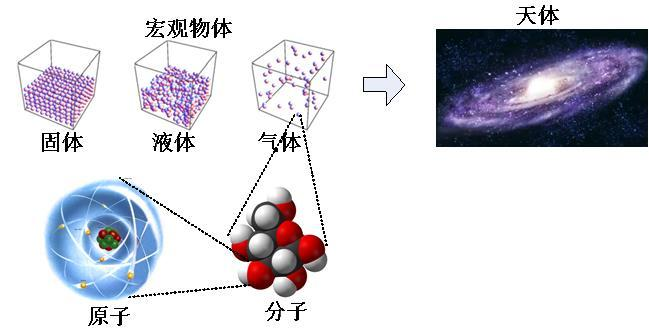
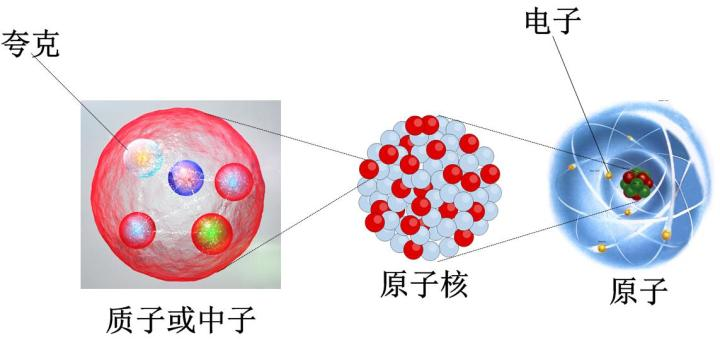
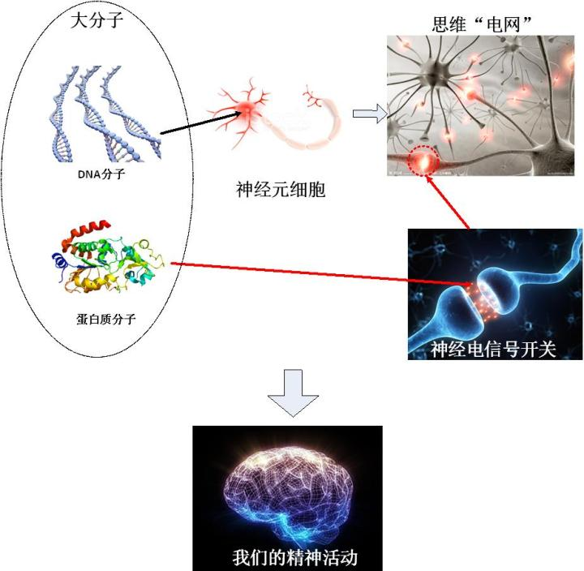
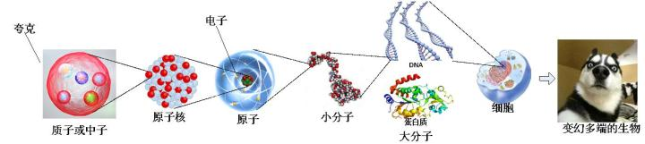
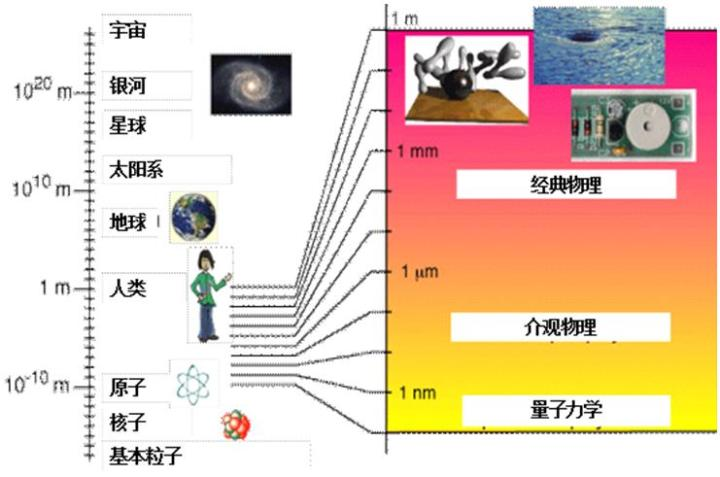

https://zhuanlan.zhihu.com/p/28526739

# 2、精致冰冷的还原论

**“The love of complexity without reductionism makes art; the love of complexity withreductionism makes science”**

**“对复杂性的热爱，无还原论，成就了艺术；和还原论一起，则成就了科学”**

**– E.O. 威尔逊**

那么，我来总结一下拉普拉斯之妖的核心，它包括两个层面：

\1. 一切复杂运动的规律皆可以还原至最基本组成部分的运动规律，**“还原论”**

\2. 当一个事物在某一时刻状态已经确定时，我们可以预言它的一切未来轨迹，**“决定论”**

这一章我首先来简单地说一下还原论这件事。

以典型的还原论观点来看，万物的运动，最终都是它们的每个组分综合而成的。对于一个宏观的事物而言，如果组成这个事物的每一个部分的运动状态，以及这每一部分相互之间的相互关系和相互作用，对这些情况我们都已经了如指掌的话，那么，这个宏观事物的整体运动，我们只需要把每个部分的运动综合起来，就可以很清楚地知道了。比如说，我们在欣赏一副油画，如果对画布上的每一个点的颜色，我们都已经知道了，那么毫无疑问，整个画面的状态我们也就知道了。

我们这个宇宙间的万物，大到天体，小到细菌病毒，归结到最终，都是由一些基本粒子组成的。在我们地球上常见的物体中，我们基本上可以说，所有的东西都是由原子组成的。而原子，则是由带正电的原子核和带负电的电子组成的。原子核呢，则是由两种粒子：质子和中子组成的，不论质子还是中子，它们都是由一种叫做夸克的粒子组成的。这些粒子，原子、电子、质子、中子等等，它们有些是可以再分的（例如原子、质子、中子），有些已经是最小单位，没有办法再分了（例如电子、夸克）。这些没有办法再分的粒子，就叫做“基本粒子”。

你必须知道，所有这些基本粒子，都是完全相同的，它们之间没有任何区别。旺财身上的某一个电子，和你身上的某一个电子，乃至于和我们电视里面正在给我们显示画面的某一个电子，是一模一样的，在现代物理学里面，很多时候我们甚至没有办法把它们编号，区分为电子1、电子2……等等。一个电子，不会因为在你的身体里面，就会与旺财拉的一泡屎中的电子有丝毫不同。夸克之间的互相不同组合，就形成了中子或者质子，而中子和质子的不同组合，再加上电子，就形成了不同的原子，比如说，碳原子就有12个质子；而1个质子组成的呢，就是氢原子。同样道理，一个在你身体里的碳原子，也不会与一堆煤炭里面的碳原子有丝毫不同。

原子呢，它们的电子可以和其它原子的电子互相“握手”而紧紧地拉在一起，“在一起”的这些个原子组成的，就是分子。比如说，一个水分子就是一个氧原子和两个氢原子相互拉手组成的。而无数个分子“堆积”在一起，就是我们看到宏观世界的各种物体。我们看到的物体不同，是因为组成它们的分子不同。然而，如果我们继续细分，组成它们的所有基本粒子都是相同的，所不同的是，这些基本粒子相互之间的关系不同。

那么生物呢？我们人类是细胞组成的，而细胞无非就是一些以蛋白质为主的各种分子的组合、以及遗传物质DNA。蛋白质和DNA都是一种由数以万亿计的原子组成的一些巨大的分子（当然，“巨大”只是相对而言的，它们相对于一个原子是巨大的，但是实际上，它们只有几到几十纳米，需要很精密的电子显微镜才能够看得到）。我们的精神活动，包括我们的喜怒哀乐、我们的思维，都是一些电流信号，这些电流是通过神经细胞长长的触须连接成的“电线”传递的，电流的开关，则是由神经细胞连接中间的一些特殊蛋白质的运动来控制的。

那么，可以说，精神运动，无非就是某些特定的蛋白质分子构成的电路系统和电路元件而已。

综上所述，如果宇宙中每一个粒子的命运都是注定的，那么，每一个宏观物体的命运也就是注定的，我们大脑中的每一个细胞的电信号如何传递也是注定的，我们的喜怒哀乐、自由意志也就是注定的了。

这就是还原论的一条冰冷无情的链条。

所有这些构成宇宙万物的基本粒子，它们各自的运动，都遵循着同样规律：量子力学。这个我们后面再讲。

物理学对这些粒子的运动规律已经可以说了如指掌了。然而人们会有疑问，这些粒子单独的运动，与它们大量聚集在一起时的运动规律，会是一样的吗？我们知道了每一个粒子的运动规律，就等于知道了大量粒子在一起组成的宏观物体的运动规律了吗？

首先，科学家至今为止，没有发现任何证据显示，粒子在不同的聚集状态下，运动会有所不同。这使得科学家吗对上面这个问题断然持肯定的答案。

更加进一步说，科学家们有一种信念：**世界是复杂的，但规则是简单的**。

爱因斯坦曾经打了一个比方，他问，自然规律是像围棋呢？还是像美式足球（美式橄榄球）？我们知道，围棋和美式足球都可以形成错综复杂的战局，但是两者的规则完全不同。围棋的规则极其简单，就一两条而已，落子的时候几乎是完全自由的。但是美式足球的规则却是非常复杂，足足有70多条。自然界的现象无疑是极其复杂的，但是自然规律是否也是复杂的呢？爱因斯坦给出的答案也代表了几乎所有科学家的答案：自然规律必定是极其简单的。

这不但是基于大量的观测事实得出的结论，更加是物理学家们掺杂了哲学和美学观念的一个信仰，这也是还原论者的一个基本理念。一个非常有代表性的原则就是大名鼎鼎的奥卡姆剃刀原则，说的是，如果理论中有一个假设不能够得出任何额外的结果，就必须动用剃刀把它剔除。

这种信念（当然也是经过实践检验的信念）告诉我们，宇宙万物，从宏观到微观，必然遵循同样的物理定律。作为宏观物体一部分的粒子，和自由的粒子，它们的运动规律并无二致。

当然，人们还发现，与还原论相对的，如果我们只从整体来看，单个个体和少数个体的行为与群体行为之间的区别，并不是简单的加和。**通常，一个系统的尺度在从小到大的变化过程中，会表现出一种“层展”的现象，意指在个体数增加的时候，突然出现了某些在小尺度下不存在的特征。**也就是说，它会不断“涌现（emerge）”出来的小尺度范围中不曾出现的新的现象和概念。

比如说，小群体的人群里面不会出现国家这个概念，但是人口数量增多之后，它却不可避免。还有，历史长河中绝大多数人的个人的行为杂乱无章，但是但是当地球上所有的人集合成为一个整体，进而形成的宏大历史，却是有着非常明晰的趋势和规律的。

最方便的一个例子还是围棋：围棋的规则非常简单。然而懂得了围棋的规则并不等于会下围棋。局部的打劫、小范围的手筋、大范围的布局，在不同的尺度上的落子方法是截然不同的。在很小范围内几个子打劫的时候，是没有“势”的概念的。同样，在布局和争势的尺度上，也不会计较一子一气的得失。然而我们都知道，不同的尺度下围棋的规则并没有随着棋盘大小发生什么变化。但是人们下棋的方式却完全不一样。“势”的出现，仅仅是由于棋子之间的相互关系更加复杂而产生的。

**还原论与整体论是一体两面的，是对一个事物的两个不同角度的观察。一切大尺度涌现出来的复杂现象，其起源都是简单的底层规则。**就像前面围棋的例子，所有的大范围的落子方法和“势”的概念，都是在基本规则基础上出现的。这些新概念的产生却是不可避免地由微观底层规则所决定。正是由于围棋的基本规则决定了“势”这种宏观现象会涌现出来，那么它必然会涌现出来。

所以，拉普拉斯之妖如果能够确知宇宙中每一个粒子的状态，它就可以确知宇宙的整体状态。这一点，我们并不怀疑。而真正引起争议的，并不是还原论，而是这样两个问题：

**1. 是不是已知一个粒子的状态，就必然可以预测它未来的所有状态，而不带一点不确定性？**

**2. 拉普拉斯之妖是不是真的能够在原则上确知一个粒子的状态？**

这是决定论的问题，它必须回答。

上一篇：[1、拉普拉斯之妖](https://zhuanlan.zhihu.com/p/28522532)

下一篇：[3、决定论和非决定论](https://zhuanlan.zhihu.com/p/28532612)

专栏：[魔鬼眼中的自然界](https://zhuanlan.zhihu.com/c_116602381?group_id=884931161871237120)