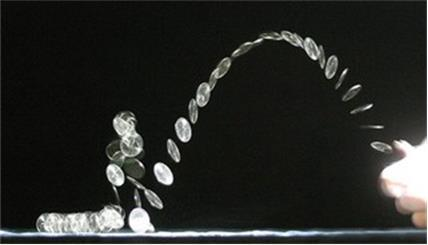
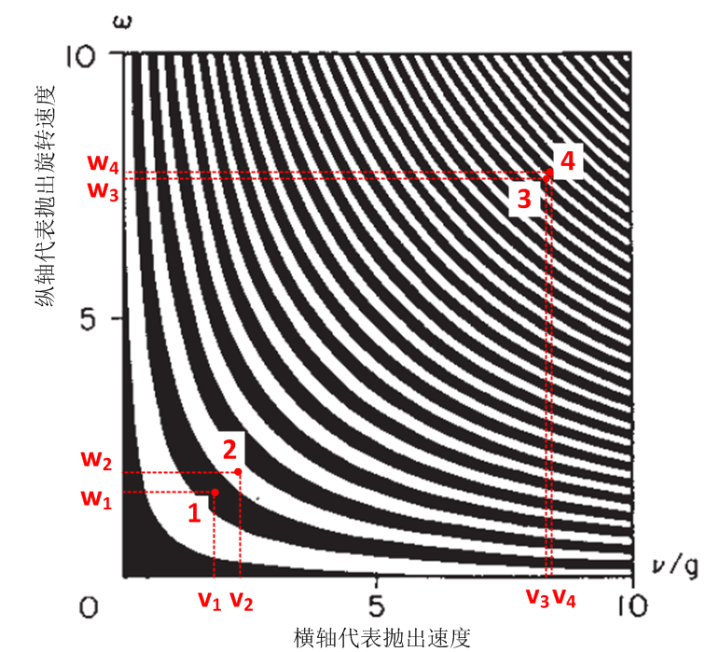

[4、抛硬币和概率性](https://zhuanlan.zhihu.com/p/28551569)

***“Probability is expectation founded upon partial knowledge. A  perfect acquaintance with all the circumstances affecting the occurrence of an event would change expectation into certainty, and leave neither  room nor demand for a theory of probabilities. ”\***

***“概率是在我们只有部分认知的情况下的一种预期。如果可以对影响事件的所有情况获得完美的知识，预期将会变成确定，也就不存在概率理论的生存空间和需要了”\*** 

***-- 乔治.布尔\***

本部分第一章开始引用拉普拉斯的那段话，如果我们继续往下读下去，就会发现非常讽刺的一点：拉普拉斯广为流传的这段话并非历史的全貌。就像历史上很多其他只流传了一半的名言一样，拉普拉斯在说完这段话以后，紧跟着说了另一段几乎是翻转的话，而这段话，却几乎淹没在历史之中，他说:

*“The human mind offers … a feeble idea of this intelligence. Its discoveries …have enabled it to comprehend in the same analytic expressions the  past and future states of the system of the world. …All these efforts in the search for truth tend to lead it back continually to the vast  intelligence which we have just mentioned, but from which it will always remain infinitely removed.”*

*“人类的心智提供了……与这个智慧（拉普拉斯之妖）相比微不足道的思想。人类的发现使得我们能够以与之相似的分析手段来理解世界的去过和未来。……所有的这些寻求真理的努力使得我们不断地靠近这个智慧，但是我们将永远距离这个智慧无穷远”。*

然后他接着说，

*“The curve described by a single molecule in air or vapour is regulated in a manner just as certain as te planetary orbits; the only difference  between them is that which comes from our ignorance. Probability is  relative, in part to this ignorance, in part to our knowledge.”*

*“空气中的每一个分子的运动轨迹，与天体的的轨道运动方式别无二致；所区别的仅仅在于，我们对它们的无知。概率是相对的，相对于我们的无知，相对于我们的知识。”*

如果人们认为拉普拉斯之妖的缔造者，拉普拉斯本人，是在试图表达他决定论的世界观，这无疑只是一个片面。拉普拉斯之所以提出这段论述，其实后面的那段话才是重点：**人们绝无可能达到拉普拉斯之妖的全知全能境界，所以我们不可避免地要用概率来描述这个世界。而概率反映的，不是运动的不确定，而是我们对运动的无知。**

那么，什么是随机性？什么是概率？

最常用的一个例子就是抛硬币。你抛出一个硬币，来观察它落地时是正面朝上还是反面朝上。然后你会发现，几乎不可能根据抛出硬币时用的力度和抛出的高度，来事先预测到底是哪一面朝上。事实上，每次落地时，哪一面朝上似乎是毫无规律的。要想事先就猜出来哪一面朝上？做梦吧！这种不可预测性，就叫做**随机性。**

然而，在做这个抛硬币实验次数很少的时候，你几乎找不到任何规律，正面还是反面朝上每次都完全不可预测，但是这个硬币不停地抛出时，渐渐地规律出来了：似乎正面出现的次数和反面出现的次数很接近，大约一半时间是正面朝上，而另一半时间是反面朝上。并且实验次数越多，它们就越接近。比如说，你抛了1000次，大约500次是正面，500次是反面。于是，人们就假定，如果我们后面再抛1000次，我们仍然会有500次左右正面，500次左右反面。于是，人们认为，出现正面和反面的机会各是50%。50%这个数字，就是**概率**。

也就是说，概率是对随机过程中**可能性**的一种定量化描述。

那么，可以把随机性看做是系统完全无规律运动的表现，这样可以吗？

现在，我们把抛硬币的实验稍微做一个改动。假设有这样一个黑盒子，封闭得十分严密，你没有办法观察到里面，因而对内部一无所知。这个盒子有一个入口和一个出口。这时，你开始把硬币扔到盒子里，然后，硬币从盒子的出口掉出来，你来观察硬币的情况。你发现，落下来的硬币与你之前的抛硬币实验结果完全类似：它每次都毫无规律，但是，大量的实验结果显示，正面朝上的次数和反面朝上的次数几乎一样。从这个结果，你完全无法区分这次实验与前一次实验有任何区别，于是，你判断：和上一次一样，这次硬币实验结果仍然是随机的，我们只能用概率来描述它的情况。

然后，这个黑盒子打开了，你惊奇地发现，里面有一个人。这个人手里拿着一个数字，是个无理数，比如说，π。这个人把这个数字的每一位都列出来，就得到一连串无限长的数字队列：31415929……。当你把第一枚硬币扔进盒子，这个人把它收走，然后根据手里这个数字的队列的第一个数字做出判断，如果这个数字小于5，那么他吧硬币正面朝上扔出盒子，如果大于等于5，他就把反面朝上扔出来。当你第二次扔进去的时候，他同样收走，然后根据第二位数字做出同样的判断，以此类推，你扔进去的每一枚硬币，都被他收走，按照手里的数字队列中相应的那一位做出判断，然后把它正面或反面向上抛出来。请注意，无理数之所以是无理数，就意味着这个数字的每一个位数都是没有规律的（否则就是有理数了）。因此他扔出来的硬币正反面看起来也都是毫无规律可言。

那么，这次实验与上次实验有什么不同吗？

第一次的实验中，你“确实”是没有办法预测硬币的情况，而第二次呢，如果你知道了这个无理数，你就能够准确预测每一次硬币的朝向。当你不打开黑盒子的时候，你没有办法预测，只是因为你不知道那个有理数而已，并不是它真的不可以预测。

这里的关键的区别在于，第一次中硬币的未来是“真正”随机的，而第二次，硬币的未来是完全确定的，只是因为你对抛硬币过程的无知导致了它看似不可预测。

我再来进一步问更加尖锐的问题：即使是第一次硬币实验中，硬币的未来就**真的**无法预测吗？如果我们精确控制每一次抛出硬币的力道不变，让它每次抛出的情况一模一样；并且每次扔出的时候周围环境没有干扰的话，扔出的硬币朝向会是一样的吗？

无聊的科学家们真的对抛硬币游戏做了预测。如果我们抛出硬币时，我们已知硬币的速度v和硬币的旋转速度w，它落地时哪一面朝上？科学家用前面第4节里面提到的那个微分方程进行了计算。计算结果就是下面这张图。这张图怎么看呢？图中是一个由横坐标和纵坐标构成的一个平面，平面中的每一个点对应的就是抛出硬币的一种不同状态，这个点的坐标（v，w）就是抛出硬币时硬币的速度和旋转速度。当这两个坐标已知时，这个点在平面中的位置就确定了。如果这个点恰好落在黑色的区域，就意味着正面朝上；反之如果落在白色的区域，那么就是反面朝上。比如有一个硬币1，它以速度和旋转速度分别是（v1，w1）的情况抛出，那么从这张图上看，它代表的点1落在黑色区域，这就表示，如果我们用速度v1，旋转速度w1抛出硬币，它就必然正面朝上。同理，另一个硬币2以（v2，w2）的速度和旋转速度抛出，它代表的点2落在白色区域，这表示如果我们用速度v2，旋转速度w2抛出硬币，它就必然反面朝上。这样一来，对于一个硬币，它以任何初始状态（速度和旋转速度）抛出，我们都可以预测它哪一面朝上。在这个预测中，没有什么是不确定的。如果在硬币抛出的瞬间，我们知道它的状态，我们就知道它必然哪一面朝上 – 它的命运也是注定的。                   

哈！原来抛硬币一点都不公平！一场球赛开始之前，裁判总是要抛出一枚硬币让球员来猜，以此决定谁先发球。原来这枚硬币是可以作弊的，只要控制好了，就一定可以抛出我想要的结果！

是这样吗？

我们再来看这张图，越是右上方，黑白的条纹就越密，而左下方呢，条纹就稀疏。条纹越密，就意味着正面和反面就越难以区分，反之则越容易区分，这是什么意思呢？就是说，当你抛出的速度和旋转速度比较慢时，你相对比较容易得到你想要的结果，也就是它不需要太精确的控制；而当你抛出的速度和旋转速度比较快时，你就需要控制得非常精确，稍微一点点失误就让你的小算盘失效。比如说图中左下方的点1和点2，分别是正面和反面，它们之间的速度（V1和V2）和旋转速度（W1和W2）的区别较大，意即容忍较大的误差。而在右上方，点3和点4，两种速度（V3和V4）和旋转速度（W3和W4）只是一点点差别，就导致了一个是正面一个是反面两个相反的结果。而人们通常抛硬币用的力量，在条纹比较密集的区域。这需要你非常非常小心地控制你的力量才能达到你想要的结果 –  乃至于你皮肤下血液流动的一个颤动就大大影响了你的控制，最终破坏掉你的结果。人类是没有办法控制这样精确的，所以每次抛出硬币结果如何，我们仍然是不知道的。但是，机器却很容易做到这一点，哈佛的物理系就有人做了这么一台“抛硬币机”，它可以连续1000次抛出正面。（Persi Diaconis, “The Problem of Thinking Too  Much”）事实上，作者甚至可以通过训练，仔细掌握方法，做到连续10次抛出同样一面。

那么，这个例子告诉我们什么呢？在讲概率问题时最常用的抛硬币的例子中，其实，硬币是可预测的，而且是可以在一定程度上做到随心所欲控制哪一面朝上的。现实中我们无法事先猜测结果，不是因为它的未来不确定，而是相反，它的未来仍然是确定的，但是第一，我们对抛硬币预测不够准；第二，我们对抛出硬币的初始状态控制不够准。**这是一个有着注定命运的硬币，因为我们的不够精确，所以它看似是随机的。**

到这里，你应该已经有所悟。拉普拉斯之妖对“随机过程”是这样认为的[[1\]](https://zhuanlan.zhihu.com/write#_ftn1)：随机之所以是随机，是因为人们对它认知的缺失，而不是它“本身”不确定。– **我们虽然对未来无知，但是未来就在那里，只是我们看不到而已。世间的一切，莫不如此。**

从实证的角度来讲，随机性，并不一定是事物“本身”运动的无规律，而是我们对它**不可预测**。不可预测的原因，可能是它“真的”没有规律，也可能是我们没有能力做出预测。如此而已。

那么，站在我们的立场上讲，下面两种情况有何区别呢？

\1. 一件事情的未来是不确定的，只有概率性的演化。

\2. 一件事情未来是确定的，但是我们**原则上**没有任何可能来精确预言它，只能通过管中窥豹的方式以残缺的知识推测它的可能性。

是的，我们根本就不可能知道两者有何区别！我们只能区分一件事情是不是可预测的，而不能区分它是**确定而不可预测**还是**不确定的**！

这是经典物理学那个时代中科学家和数学家相当普遍的观点。

上一篇：[3、决定论和非决定论](https://zhuanlan.zhihu.com/p/28532612)

下一篇：[5、用“几何观”看世界](https://zhuanlan.zhihu.com/p/28557211)

专栏：[魔鬼眼中的自然界](https://zhuanlan.zhihu.com/c_116602381?group_id=884931161871237120)

*[[1\]](https://zhuanlan.zhihu.com/write#_ftnref1) 这种观点到底对不对？这正是我们所要讨论的核心问题之一：未来的不确定性到底是我们知识的缺失，还是它“本质”上的不确定？*

发布于 2017-08-16

编辑于 2017-08-28