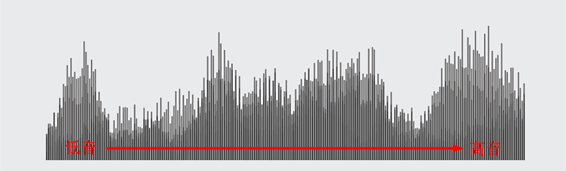
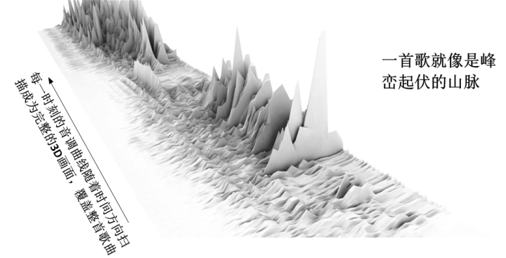
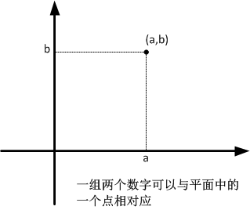
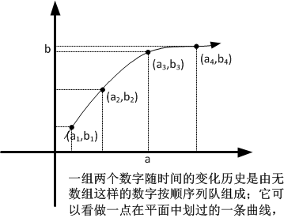

[5、用“几何观”看世界](https://zhuanlan.zhihu.com/p/28557211)

***“In mathematics you don’t understand things, you just get used to them.”\***

***“在数学中，你不是去理解它们，而只是去习惯它们而已”\***

***-- 冯诺依曼\***

在我们进行后面的讨论之前，我先来完成一个不可能的任务：把Michael  Jackson的一首歌用一幅画给画出来，不但画出来，而且要做到每个音符、所有配乐一点不漏，所有的音色，包括MJ的独特嗓音、各种乐器等等，100%还原。然后我们还可以照着这幅画把音乐再还原出来，**完全无损**。

你可能觉得这很不靠谱儿，歌声是听觉，而画面是视觉，怎么可能把歌声画出来呢？当然，我们可以用比较“文艺”的办法，把歌声的**感觉**用画来表示出来（比如我们在听古乐“高山流水”时画出真正的高山和流水），但是这样是一种模模糊糊的、主观的画法，不可能做到反过来再把画无损地还原成歌声。我这里说的，绝不是这种似是而非的画，而是真正地把歌声中每一个音符和每一个音调全部画出来。

这中间其实有很多种办法。下面我说的其实只是其中一种办法。要想做到无损，我们必须要求歌声和画面有一种一一对应的关系，歌声里面每一个音符和音节，都在画面里体现出来，而反过来，画面中的每一个点和线条，也都能从歌声中来，绝没有半点冗余。也就是说，画面和歌声必须有完全相等的信息，一点不多，一点不少，这样才能做到“无损”。

首先，我们知道，任何一个歌唱家的嗓音，都是很多种不同的声调混合而成的。有高音、中音、低音。MJ的嗓音相当独特，你常说它“有时候像天使，有时候像魔鬼”。当他用天使的嗓音唱出来时，清亮透彻有如天籁，这时组成他嗓音的音调就比较单纯而且集中在高音区；当他用魔鬼的嗓音唱出来时，金属嘶哑就像发狂，这时候，嗓音中所包含的音调就比较多，既有高音又有低音。这个音调，是MJ声带振动的频率决定的，高频的声音尖，低频的声音沉。在欣赏MJ的一首歌的时候，我们可以选任一时刻，来分析这个声音，它包含了从低到高的一系列音调，而每个音调的强度（音高）又不同，有的声调强烈，而有的就比较弱。我们首先把音调从低到高在水平方向排列起来作为X轴，然后把每个声调的强度（音高）在竖直方向上表示为柱状图，那么，所有这些音调都在一个二维图上表示出来，就形成了下面这样一个图形：

这是某一个时刻声音的图形，而一首歌则是声音在一段时间内的连续变化，也就是上述类似图形沿着时间方向扫过而形成的连续图形，就像下图：

这样一来，我们就把一首歌画成了一幅画！

反过来，我们照着这幅画，把每个时间的声音曲线就可以全部提取出来，然后，就可以再根据声音曲线，把这首歌完整地回放出来！

我们可以说，这幅画和这首歌所记录的，是同样的信息。这种信息可以有各种不同的表现形式，无论是歌声，还是画面，只是这种信息在人们不同的感官中的具体体现而已。这里的关键，就是前面说的，歌声的每一个音符和画面中的每一个点和线都存在着**一一对应**的关系。所以他们才能够承载着完全相同的信息。这种一一对应关系是通过某种数学规则来构建起来的。这是一种**拓扑学**的关系，叫做“同构”或“同胚”。

事实上，通过构建类似的数学规则，我们的世界里，任何一件事，一个物，都是可以用图形“画”出来的。我们的五感，其中视觉当然是可以画出来的，然而其余的味觉、嗅觉、听觉、触觉，通过同构变换，全部可以画成图形！
不夸张地说，世间万事万物，均可以用图形表示。

万物皆可“图化”，这一点十分重要。因为这让我下面的讲解提供了一种可能：让我用图形，把一个系统的演化过程讲得直观形象，而不必用太多很抽象的术语。我们只需要看图形的变化就可以推知一个系统的演化过程。这相当地省劲儿省脑。我把这种以图形来思考动力学的方式，叫做“**几何观**”。

当然，把一些抽象的概念用几何图形来表示，这在科学界有着更加深层的原因。在整个数学史上，欧几里得几何可以算作是一个标杆式的存在，它简洁，优美，严谨……，几乎所有你能想到的关于数学的溢美之词，都可以扔到它的头上。因此，在哲学界，古典的思想家们几乎都有一种偏执的想法：几何是“先验”的，是上帝创造的东西，放到了我们的脑子里。因而几何在形而上学中也是一种独特的存在。把物理用几何来描述，几乎是物理学家的最高境界。

为了我们在本文以后所有的讨论中说的比较形象，我们在这一节需要花一点点时间，来说一下怎么用图形描述事物的演化，这个过程，有那么一点点抽象。

请不要害怕所谓的“抽象”。对于**很多数学中的“抽象”概念，只是思维方式的一种全新的规则而已，你并不需要去“理解”它，而只需要去“习惯”它。**要知道，数学中最抽象的概念，莫过于“自然数”的概念了[[1\]](https://zhuanlan.zhihu.com/write#_ftn1)，但是你思考问题的时候，丝毫不会觉得自然数有什么令人费解的地方，原因是你从很小的时候，就不断地用数字去考虑问题，它已经变成你思维的一部分，以至于你觉得它们是一种自然而然的东西。相信我，当你习惯于用几何观来看待问题的时候，你会像用自然数一样顺理成章。

简而言之，我们为什么可以做到用几何观来看待世界呢？因为第一，所有的物理现实都可以用数学语言描述，第二，所有的数学结构都可以用几何图形表示。我们将分两个部分来说。

首先，第一个，如何用数学语言描述实际物理过程？

我在前言中提到，所有的科学理论，都是用数学语言来说话的。为什么这样呢？用费曼的一句话来说，“这是一个谜”。但是，在我看来，这不完全是一个谜，甚至是一种水到渠成自然而然的事情。

因为科学的一个任务，就是用尽量简洁的预言，来尽量精确地描述这个世界，最好是**定量化**描述。没有什么比数学更加能够胜任这个任务的了。于是，在科学里面，经常用到一种叫做“数学模型”的方法。在数学模型中，我们用种种数字或数字的特定结构来表示一些物理现实，我们用数学运算和变换过程来表示事物的物理变化。比如说，你们数学中的每一道应用题，都是一个建立数学模型和求解数学模型的过程。在数学模型中，我们用一个个的数学结构来表示实际的物理结构，用数学运算表示实际的物理变化。下面有几个用某些数学结构来表示实际物理结构的例子：

比如说，我们用一个数字来表示实际事物的个数；用一个数字来表示事物变化的快慢（速率）；用一个数字也可以来表示物体的长度（尺寸），……；

比如说，我前面提到的，用一个粒子的位置和速度来表示它的运动状态，那么（位置，速度）这一组两个数字就可以表示一个粒子的状态；

比如说，我们面对一个系统，有10个粒子组成，那么我们就用每一个粒子的位置和速度来表示这个系统的状态，（位置1，速度1，位置2，速度2，……，位置10，速度10），这一组20个数字就表示这个系统的状态；

比如说，一个粒子在历史中每一个时刻的（位置，速度），按照时间顺序排列起来，形成一个由无数组数字形成的“队列”，就可以表示这里粒子在历史中的变化轨迹；

如此等等……（你自己能不能举出一个例子？）

前面说的，不论是单个数字、一组数字、还是无数组数字组成的队列，都是不同的数学结构。当我们在处理一个系统的演变过程的时候，我们总是要处理这些数字和数字的结构。而这种数字和数学结构，和图形都有一种很奇妙的对应关系。

那么，如何把数学结构用图形表示出来呢？

为了帮助你理解，我们先来看看你已经学过的数轴，数轴是“数”与“几何”相结合的一个典型，可以说是数学中最早出现的试图用图形表示一个数学结构的例子。你已经知道，一条直线与整个实数域，是存在一一对应关系的：

- 实数有无穷多个，直线上的点也有无穷多个；
- 实数可以定义“大小”，直线可以定义“长度”
- 两个实数可以定义“加（减）法”，直线上两点可以定义“距离”；
- 实数向正负两个方向无限增加，直线向前后两个方向无限延展；
- 任意两个实数之间有无穷多个实数，而直线上任意两点之间也有无数个点；
- ……

总而言之，数轴上任意一个点都可以表示一个数字，而反过来任何一个实数也都可以用数轴上的点来表示，也就是说，实数和数轴上的点是一一对应的，整条数轴就代表了所有的实数（用数学语言说，就是“实数集与直线是同构的”）。

那么，我们手里有一个在不停变化的实数（变量），在数轴上是怎么表示的呢？很明显，实数的变化可以看做直线上一个点的沿着数轴的移动。

那么，我们用一组两个数字，比如说（位置，速度）这个组合，怎么来对应成一个图形呢？我们可以用两个数轴来表示。记得我们讨论过的一个平面中的一个位置怎么表示吗？对了，可以用它水平位置和竖直位置两个数字来表示，反过来，任何一组两个数字，也都可以表示成为一个平面中的一个位置（一个点）；这是由两个相互垂直的数轴构成的空间（你们将要学到的笛卡尔坐标系，就是其中一种方法）：

这里的一一对应关系就是：平面上任意一个点都对应着一组两个数字，而任意的一组两个数字，都对应着平面上的一个点。一个平面就对应了所有的一组两数（a,b）形式的结构。而平面，又被称为“二维空间”，流行的网络用语把纸面上的漫画叫做“二次元”，就是这个道理。

同理，这一组两个数的变化，就可以表示为平面中的一个点的移动。而一个点移动所扫过的轨迹，就是一条曲线，这条曲线，就可以表示这个点的运动历史。

两个数字组成的组合可以看做平面中的一点，那三个数字呢？自然而然就可以表示为以三个交叉数轴确定的一个立体空间中的一点。一个立体空间就包含了所有的一组三数（a,b,c）形式的结构。而这这一组三个数的变化，就可以表示为立体空间中的一个点的移动。因而，立体空间又被称为“三维空间”。

那么一组有4个数字呢？或者更多数字呢？就需要你展开想象力，把它们看做比三维空间更加高维的空间中一点。这一点可能会很费脑子，但是如果你暂时无法想象出来，也没有问题，你只要知道，**不管是几个数字的组合，都可以看做是相应空间中的一个点。**两个数字的组合是二维平面空间中的一点，3个数字的组合是3维立体空间中的一点，而n个数字的组合，则是n维空间中的一点。而这一组数字的变化，就是n维空间中一个点的移动。这个点移动所扫过的轨迹，就是n为空间中的一条曲线，代表了这个点的运动历史。

**任何一个一组n数的组合，都与n维空间中的一点一一对应，而一个n维空间，就对应了全部的一组n数的集合。**

我们还知道，一个系统的状态，都是由一组数字来表示的，根据我们对“状态”的定义，这些数字可多可少。比如前面提到，一个粒子我们可以用（位置，速度）两个数字来定义它的状态，N个粒子就用2N个这样的数字组来定义[[2\]](https://zhuanlan.zhihu.com/write#_ftn2)。所以说，任何一个系统的状态，都与一个一组n数的数字组合相一一对应。

那么，很自然地，任何一个系统的状态，都有一个多维空间中的某一点一一对应。一个由N个粒子组成的系统的一个状态状态，可以用2N个数字组合来表示，那么一个2N维空间，就对应了了一个由N个粒子组成的系统的所有状态。于是乎，我们可以用一个2N维的空间中的一个点代表系统的一个特定状态。**而这个2N维的空间，则是这个点所存在的范围，也就是这个系统的所有可能状态的集合**。

请注意，这里这个点的“位置”表示的是系统的状态，而不是系统真实的位置。因此，为了强调这个“状态位置”与真实的位置之间的区别，我们把这个点叫做“状态点”，或者说，物理术语叫做“**相点**”。而这个状态点所存身的那个2N维空间，是个抽象的“状态空间”，是所有可能的系统状态的集合，而不是真实的物理空间，人们把它叫做“**相空间**”。

那么，前面罗里吧嗦说的一大片，用最简洁的话来说，就是：**一个系统的物理状态就是相空间中的一个点（相点）。物理状态的变化，就是相空间中一个相点的移动。**

那么，我们再来看看系统状态变化怎么用图形表示。

对一组两个数字，我们仍然用一个粒子的（位置，速度）来举例，随着时间，它们会发生某些连续的变化，对应在状态空间（相空间）里面，就是这个粒子的状态点（相点）在不停地移动。你把这个相点想想成为一个铅笔尖，那么这个点就会划过一条轨迹，，这个轨迹就是系统状态变化的历史。这个历史包含了粒子所有不同时刻的（位置，速度）按照时间顺序排列起来，形成的“队列”（所谓的“点动成线”）。

那么，一个粒子的变化过程，就可以用一条线来表示。

一个粒子的状态是两个数字（位置，速度）的组合，它的变化过程，就是二维平面中的一条曲线，而10个粒子组成的系统的状态，则是一个20维空间中的一个点，它们状态随时间的变化，就是在20维空间中的一条曲线。

那么，现在你应该有了初步的概念，一个系统的状态可以用相空间中的一个相点来表示，而一个系统的变化过程，则是相空间中的一条轨迹线。根据系统大小的不同，这个相点和相空间的维度也不同。

好了，总结一下本章中心思想，实际的物理变化，可以反映成数字变化，而数字变化，又可以反映成图形变换。所以，万物皆可“几何”。在几何观里面，**一个事物的状态，是相空间中的一个点，一个事物的变化，是相空间中点的移动，一个事物的变化过程过程，是相空间中的一条曲线。**

有人说，***动力学（哈密顿力学）就是相空间中的几何学\***，就是这个道理。

我们再回头看看前面第3章“决定论和非决定论”中，其实我在讲系统的演化历史和未来的时候，早就已经用一条曲线来描述系统的变化历程了，现在再看，这条曲线绝不是随随便便画出来的一个比喻而已，它包含了很严格的物理意义。你现在是不是有了更多的领悟？

这里的关键，就是图形与物理现实的数学模型存在一一对应的关系，而数学模型与图形也存在一一对应的关系。如果是一一对应，那么我们就可以从图形的变化反映出（“映射”）出数字的变化，而从数字的变化反映出实际系统的变化。这种一一对应关系，在数学上叫做“互射”，而由互射联系的两种结构，叫做“同构”。我们在后面还会用到一点点“同构”这个概念。

那么，从现在开始，我们将可以**用一条带箭头的线来描述系统的演化过程**，并且你已经知道，这条线并不仅仅是个类比，它是由实际物理含义的。

上一篇：[4、抛硬币和概率性](https://zhuanlan.zhihu.com/p/28551569)

下一篇：[6、用“几何观”看不确定性](https://zhuanlan.zhihu.com/p/28559144)

专栏：[魔鬼眼中的自然界](https://zhuanlan.zhihu.com/c_116602381?group_id=884931161871237120)

*[[1\]](https://zhuanlan.zhihu.com/write#_ftnref1) 有人说，“自然数是上帝的概念，由此，所有的其它数学结构都是人为的”*

*[[2\]](https://zhuanlan.zhihu.com/write#_ftnref2)事实上，位置和速度分别是3个数字的组合，所以，一个粒子的状态是6个数字的组合，是6维空间中的一点，而n个粒子组成的系统，则是6n维空间中的一点，这里不加以详细区分，因为它不会影响我们讨论的原则*

发布于 2017-08-16

编辑于 2017-08-28