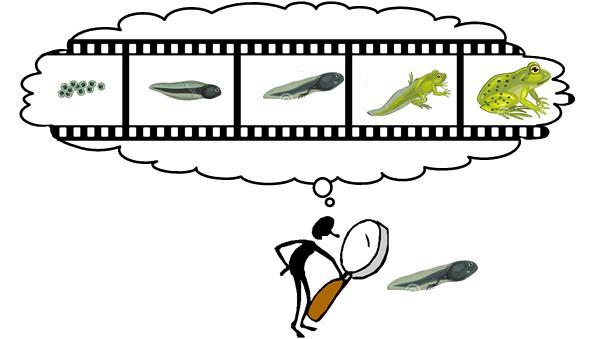
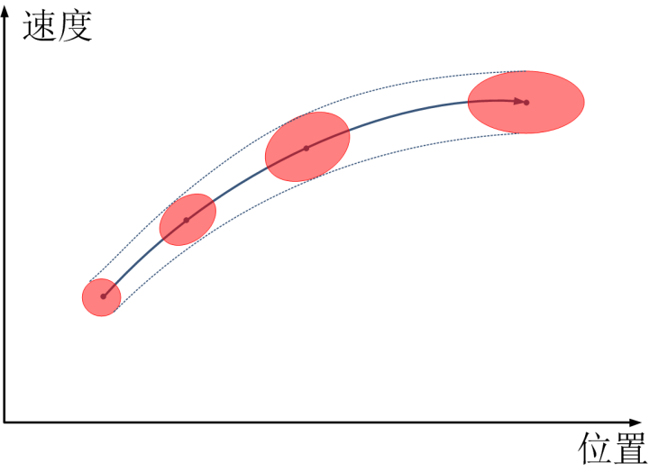
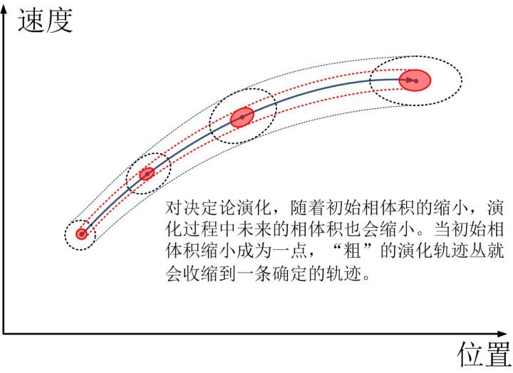
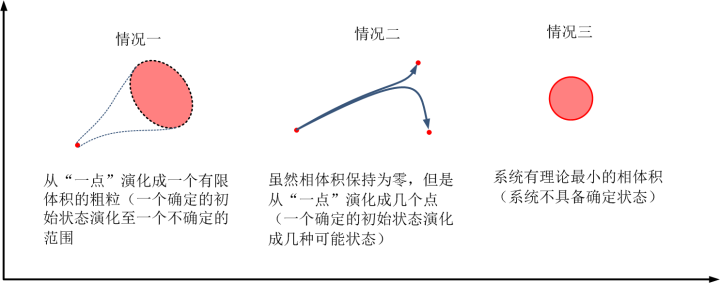
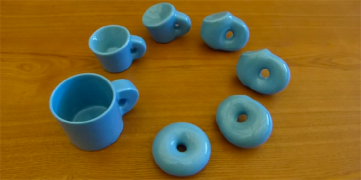
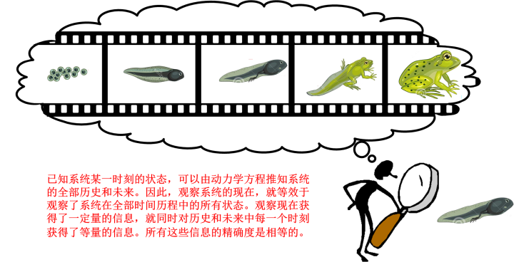
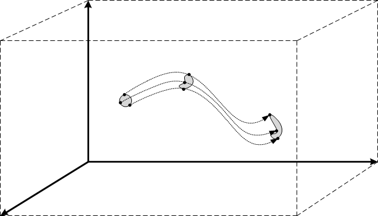
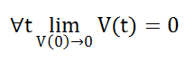

[7、茶杯与甜甜圈之辨](https://zhuanlan.zhihu.com/p/28566895)

***“Statistics are like bikinis. What they reveal is suggestive, but what they conceal is vital.”\***

***“统计学就像是比基尼，它所揭示的令人浮想，但是它掩盖的是最关键的部分”\***

***-- Aaron Levenstein\***

到此为止，我们大概明白了一点：即使是我们这个世界按照一个完全确定的物理定律演化，它的未来轨迹是唯一确定的，但是在我们粗糙的眼睛里看来，它却完全有可能充满了各种选择和不确定性。照这种说法，这个世界本来还是注定的，如果我们的观察精度不断提高，我们就会做出更加精确的预言，这个预言可以不断逼近我们那注定的命运 – 命运是不可避免的，只是我们还没有能够看清楚而已。

那么，这种说法到底是正确的还是错误的呢？我们确定的物理定律，能否演化出一个不确定的未来呢？我不知道你喜欢什么答案，反正我个人是急切希望得到一个肯定的答案的：这样一来，我们既可以继续信任我们的科学，又能保证一个充满了各种可能性的未来供我们自由选择。我们来对这个问题做一个一步探险：

前面讲到，我们不可避免地用粗粒，而不是一个状态点，来描述一个系统的状态。上一章中讲到了，从一个粗粒出发演化出的线簇，与从一个细粒出发演化出的一条轨迹线，这中间可能有何不同。我们还要知道，而相对于一个状态点（细粒）而言，粗粒有很多复杂的性质，例如“大小”、“形状”和“密度”。在演化过程中，这个粗粒本身的大小、形状和密度的变化，也会对系统的不确定性产生微妙的影响。

我们知道，粗粒的大小，就代表了我们对系统认知的不确定性。越大的粗粒，代表我们对系统的不确定性越高。如果说一个初始粗粒在演化过程中不断膨胀，那么，系统的运动状态就越来越不确定。也就是说，我们对这个系统认知的的确定性就不断丧失。反之，则对质点运动的确定性就不断增加。

我们这里进一步用到一个叫做“**系综**”的概念：一个粗粒所对应的，是无数个相点，而每一个相点所对应的，就是一个具有某种**确定**状态的系统。那么，一个粗粒所对应的，就是**无数多**个具备某种确定状态的系统。所有这些系统的状态略有差别。这些所有的系统集合起来组成一个团队，这个团队就是系综。系综是无数个状态略有偏差的系统组成，来表示一个系统的不确定性。

假使说，我们有一个系综，它的演化如下图所示，那么，我们看到，初始的相体积在演化过程中不断扩大，我们一开始可以在很小的范围内确定系统的状态，到后来，我们不得不在更大的范围内去寻找这个系统的状态，那么很明显，这个系统的演化过程中，不确定性是不断增加的，我们说，系统的演化在不断放大系统的不确定性。那么，我们要想获得未来一定精度的预言，就必须用更高的精度获得系统现在的状态。我们说，这个系统未来的不确定性要高于现在。

问题是，从原则上讲，一个系统是否具有确定的未来，与你对它的观测精度是没有关系的：你不能精确观测，那是你预测能力的问题，而不意味着系统**原则上**不可预测。所以，在原则上，对于一个有确定未来的系统，如果我们能够不断缩小初始粗粒的体积（提高精度），它未来的相体积也会缩小（预测精度随之提高）。那么如果我们初始相体积不断收缩，直至趋向于零，那么它未来的所有时刻的相体积必须随之也趋向于零（如果我们能够以绝对精度获知初始状态，我们就会以绝对精度预测未来），相应地，轨迹丛的“粗细”也会趋向于一条确定的曲线。

只有这样，我们才会说，这个系统有确定的未来。

反过来说，即使我们可以不断提高精度，使得初始的相体积不断缩小直至向零逼近，它未来的相体积也不会逼近于零，那么我们就不能说系统有确定的未来。如果我们把系统的相体积用V来表示，系统的初始相体积为V(0)，在某个未来的时刻t时，有V(t)的相体积，那么，如果一个系统具有确定的未来，必须有：

**当V(0)逼近零时，对所有的t，V(t)逼近零[[1\]](https://zhuanlan.zhihu.com/write#_ftn1)**

这就是决定论。

与之相对应的，非决定论有什么特征呢？我们从几个角度来说明这件事：

第一种情况，当我们包初始粗粒的体积不断缩小，逼近于零的时候，它未来的相体积不会收缩，或者是收缩逼近于一个大于零的体积。也就是说，当我们达对初始状态达到了逼近100%的确定性时，它的未来仍然存在较大范围的不确定性。

第二种情况，与第一种其实是类似的，即初始粗粒缩小趋向于一个点，虽然它的演化过程中，相体积保持为零，但是，他分裂成几个也趋向于零体积的粗粒。也就是说，从体积上讲，虽然未来的粗粒相体积也会收缩到逼近于零，但是过程中，它分裂成为相互分开的几个无穷小的粗粒。

第三种情况，就是在原则上不存在趋向于零的初始粗粒。也就是说，系统不存在确定的运动状态。这一点在后面我们会讲到，正是量子力学令人迷惑的地方之一。在这种情况下，系统的演化也就不存在确定的轨迹（不是我们无法获知，而是压根儿就没有）。当然，此时系统的不确定度如果不扩散（相体积守恒），我们仍然认为它在一定程度上是决定论的。

这几种情况可以用下图表示出来：

那么，问题来了，粗粒的相体积在演化过程中到底会如何变化呢？

经典动力学中有一个非常优美的定理回答了这个问题，这个定理就是**刘维尔定理**。

刘维尔定理是针对于一个任意的N粒子系统，通过基本的物理学方程（哈密顿方程）[[2\]](https://zhuanlan.zhihu.com/write#_ftn2)推导得来的。因而，它的有效性与牛顿三定律是等价的，也就是说，只要牛顿定律成立，它就必然成立。这里我不打算讲刘维尔定理的具体表述，而只用你能听懂的语言说一个结论：

***对于能量守恒的动力学系综，在演化过程中，它的相体积保持不变（相体积守恒）。\***

这是什么意思呢？我这里给出一些直观的解释：

我们先用流体来对相空间做一个类比，假设整个相空间是一杯水，而我们的初始粗粒是水中的一滴油。这个粗粒的演化（也就是它在相空间中的运动轨迹）可以类比于这个油滴在水中的运动；而粗粒中的概率分布就类比于油滴中的密度分布。你会发现，这个油滴在水中无论以如何方式运动，它都是不可压缩的。也就是说，这个粗粒可以发生拉伸、扭曲、压扁等一系列形变，但是他内部各处的密度保持不变，它的体积也保持不变，另外，它绝不可能分裂。

我们来回忆一下前面讨论的内容。我们对系统的任何观测都有一个精度，记做δ。当我们观察一个系统的时候，我们得到结果，然后下结论：“这个系统的状态为S！”然而，我们说这句话的时候并不意味着我们确知这个系统的状态就是S，这句话的真正含义是说，我们确知这个系统的状态一定位于S±δ之间。在高维度，我们说，**这个系统的状态以100%的置信度位于以S为圆心，δ为半径的圆球内**。这就是一个初始的粗粒 –  粗粒越大，代表着观测精度越差，我们对这个系统的确定性越低。而在这个粗粒内部，系统状态位于何处，我们是不知道的，但是我们可以猜测，在不同的位置，它的概率是不一样的。一般而言，靠近中心的位置概率越高，而边缘的位置概率越低。我们只知道它的概率分布，因为**观察精度以外的东西，我们只能猜测**。

当我们知道系统的某个初始可能状态时，我们根据动力学方程可以推测系统相应的未来可能状态。系统初始的所有可能状态构成一个集合，在相空间里面就是我们前面所谈论的粗粒。而随着时间的变化，系统在未来的可能出现的状态，就表现为相空间里面粗粒随时间的演化，包括移动、旋转、形变等过程。刘维尔定理就是在告诉我们这个粗粒在相空间中的变化情况：第一、它的体积不发生变化；第二、它内部的概率分布也不发生变化。也就是相体积守恒。

系统的相体积守恒，这意味着什么呢？

正如前面已经讨论过的，相体积的大小就意味着不确定性的大小。直观来说，在演化过程中粗粒的相体积守恒，就表示我们对系统的不确定度就没有发生任何变化：**我们对系统未来演化的预知，完全等于我们对系统现在的认知；我们对系统未来的演化的无知程度，也完全等于我们对系统现在的无知程度**。

对一个系统，我们可以在某一时刻（t0）进行观测，这个观测有一定的精度，以这一个观测结果作为基础，我们就可以根据动力学方程计算它的任一时刻的未来和过去，因而获知了系统在整个时间尺度上任一时刻的信息（一切未来和过去）。那么，我们所获知的这些未来和过去，又能达到什么样的精度呢？理论上我们可以对动力学方程进行精确的计算（原则上这是没有问题的），那么**我们对系统未来所获知的信息的精度，就完全取决于t0时刻观测结果的精度**。而相体积守恒就告诉我们，这两者的精度相等，我们t0时刻对系统的观察达到什么精度，我们对系统未来和历史的认知就达到同样的精度！反过来讲，我们对系统未来的不确定度，和我们对现在的不确定度是一样的。

因而，对前面的问题我们就有了答案：系统未来的相体积，就等于现在的相体积，系统未来的不确定度，就等于现在的不确定度。当我们不断提高观察精度，使得系统的初始粗粒越来越小的时候，它未来演化过程中的相体积必然随着越来越小。我们所说的三种非决定论情况统统不会出现！-- 这是个决定论的宇宙。

刘维尔定理说，相体积守恒，其实，相空间中粗粒的变化，还有比这个更加丰富的数学内涵。

从数学角度来看，在某个时刻t0，我们对系统进行观测，根据精度，我们得到它具有一定的状态粗粒。我们把它记做C（0）；在C（0）中的每一个状态，以其为起点，演化一段时间，这些状态的演化就表现为状态点在相空间中移动。在时间t，我们再来看这些状态点组成的粗粒，我们记做C（t）。那么C(0)和C(t)之间有什么联系呢？

***一一对应！\***

没错，C(0)中的每一个状态点与C(t)中的每一个状态点都是一一对应的。原因很简单，因为C(0)中的任意一点，都会通过唯一一条轨迹线到达C(t)。所以，C(t)中的每一个点都唯一地来自C(0)，而C(0)中的每一个点都唯一地到达C(t)。那么在整个时间历程中的任意时刻t∈（-∞，+∞）（全部的历史、现在和未来），每一个时刻的系统粗粒C(t)，这无穷多个粗粒相互之间都存在着一一对应的关系。记得前面讲过的，这叫做什么吗？没错，这叫做“同构”。

就像是前面我们用图画把MJ的一首歌画出来，图画和歌声包含着完全相同的信息，我们可以任选一种方式，都代表了相同的内涵。那么同理，在系统演化的整个历程中，在全部的历史、现在和未来里面，从中间任意一个时刻，我们拿出它的状态粗粒，就可以代表了这整个时间长河中所有时刻的状态演化粗粒。也就是说，其实，我们不必费心考察系统的变化，我们只需要知道现在的状态，就等于同时知道了它过去未来的一切状态。未来的状态看上去和现在回非常不同，但是其实，它们所包含的信息是完全一样的，对未来的预测，就像是用哈哈镜照射现在一样，看似镜中的影像光怪陆离，但是其实，找出来的还是现在的影子，不会给你多一个鼻子，也不会给你少一个眼睛。

那么刘维尔定理告诉我们，当我们对未来进行预测的时候，其实，我们并没有得到额外的信息。因为，我们对未来的预测得到的信息，与我们对现在观测得到的信息是一样多的。也就是说，是**信息守恒**的。

一一对应这种性质，在数学的一个分支，**拓扑数学**中是一个非常重要的概念。它可以描述那些虽然表面上形状变化很大，但是实际上它们“基本上”的形状却是一模一样的。数学家中有一个很流行的笑话，叫做“拓扑学家是一群分不清茶杯和甜甜圈的人”。这和系统的演化历史很像。虽然系统在演化过程中，看起来发生了天翻地覆的变化（从茶杯变成了甜甜圈），但是，在拓扑学家看来，它们其实是同一个东西，没有发生什么本质的变化。

所以，预测过程就是一个编码器和解码器，它把一个系统在时间轴上的特定一个时刻的信息编码到一个映射中，通过这个（解动力学方程）进行解码，我们即可获知整个时间轴上所有时刻的系统信息，而这个编码和解码的过程理论上是无损的 – 已知时刻的信息有多精确，我们能够了解的未来信息就有多精确。

从信息论的角度说，在某一时刻，我们从系统获得了多少信息，就等于在同时，我们对这个系统的历史和未来的每一时刻都获得了等量信息。换句话说，我们对系统的现状有多了解，就等于我们对系统的过去和未来的每一时刻都有了同样的了解；当我们通过观测，得到了关于我们宇宙的一定量的信息时，我们不仅仅是得到了宇宙现在的信息，而是通过动力学方程，我们对宇宙过去和将来的每一时刻，都得到了等量的信息。用一句极端一点的话来说：***此时此刻，我在观察系统，我同时看到了系统的一切历史和未来。\***此时此刻我观察得多仔细，就对历史和未来看得有多仔细。未来并不比历史和现在多一点点不确定性--这就是决定论，甚至是宿命论。

其实，除了刘维定理，还有一个定理也对相体积的变化至关重要，它是拓扑学中的一个重要定理，叫做“连通性定理”（main theorem of  connectedness），这个定理我这里不过多说明，只是说一个它对相空间演化的结论，就是说，初始相体积在演化过程中不会发生分裂，它不论发生什么形变，总有一种形变是不可能的，那就是“撕裂”。

如前所述，一个粗粒在系统中的演化轨迹是一个由无限多个轨迹线组成的、有限粗的线簇。我们前面用绳子类比。这个粗粒演化过程中在相空间中划出的“绳子”，第一，它的截面积是不变的，第二，也它会持续拧成一股，而不会中间分裂成两股或多股。就是说，这个绳子可能会从一个圆绳子压扁成一个扁绳子，但是它的粗细是不变的！

我们说，系统的演化过程中，如果其轨迹丛（绳子）没有分叉，也没有变粗，也就意味着它未来的不确定性没有增加。那么，我们对系统未来的未知程度，就仅仅取决于我们的观察精度。我们把观察精度逼近到一个精确程度，我们就对未来获得了无穷精细的预言。

**相体积的守恒，即系统演化的确定性的守恒，在演化过程中，不会产生任何不确定性，唯一的不确定性，就是我们的观察精度。这就是刘维尔定理对决定论的注脚。**而精度，这只是个现实问题，而不影响原则问题。世界的确定性，与我们的精度无关，只要你能够在测量上不断逼近，你就能不断逼近真相 – 真相是存在的，区别的只是你的双眼能不能看到。

这就是决定论的雄辩，对此我们似乎已经哑口无言。

然而为了我们充满各种可能性的未来，我们对此仍不死心，继续寻找不确定的种子。

上一篇：[6、用“几何观”看不确定性](https://zhuanlan.zhihu.com/p/28559144)

下一篇：[8、指数发散和蝴蝶效应](https://zhuanlan.zhihu.com/p/28570511)

专栏：[魔鬼眼中的自然界](https://zhuanlan.zhihu.com/c_116602381?group_id=884931161871237120)

[[1\]](https://zhuanlan.zhihu.com/write#_ftnref1) 用数学语言表述，就是：           

[[2\]](https://zhuanlan.zhihu.com/write#_ftnref2) 哈密顿方程是牛顿三定律的一种等效的数学描述，它正是我们前面章节中提到的微分方程。  

