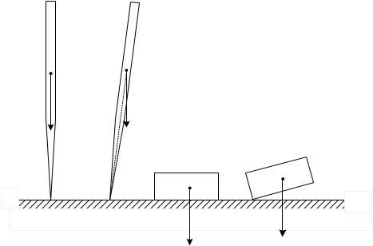
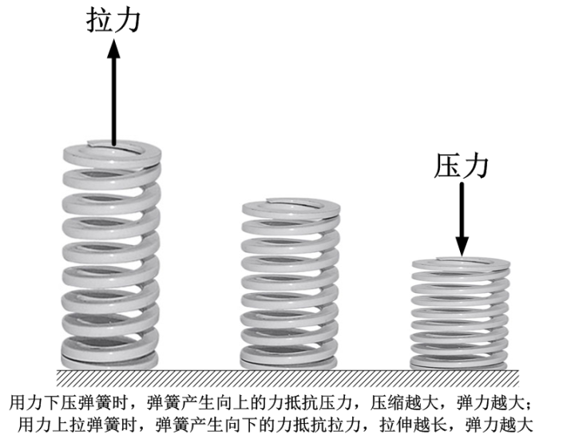
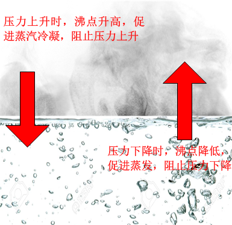
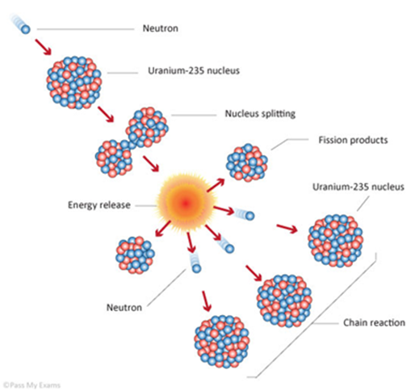

[9、我们这个反馈的世界](https://zhuanlan.zhihu.com/p/28573752)

***“Among all of the mathematical disciplines the theory of differential  equations is the most important... It furnishes the explanation of all  those elementary manifestations
of nature which involve time.”\***

***“在所有的数学原理中，微分方程理论是最重要的……它解释了自然界一切与时间相关的光怪陆离”\***

***--索菲斯·李\***

这里我将解释一下为何会出现对初始条件极端敏感的现象。在解释之前，我先列举几个例子，供你思考：

1、弹簧。一个理想弹簧的弹力是满足胡克定律的。当我们对弹簧施加压力的时候，弹簧缩短，缩短产生的力向上，其的后果就是产生更大的弹力来阻止弹簧的继续缩短，缩短越多，弹力越大；同理，当我们对弹簧施加拉力的时候，弹簧伸长，伸长产生的的力向下，其后果就是产生弹力来阻止弹簧的继续伸长，伸长越长，弹力越大。

想一想，如果弹簧的性质相反，即压缩时产生的力向下，而拉伸时产生的力向上，会怎样？

2、沸腾。我们知道，水在一个大气压下的沸点是100℃，而随着压力的增加，它的沸点逐渐升高。我们把一个高压锅中的水加热并保持在100℃，让它保持沸腾。这时如果我们增加锅子的压力，那么水的沸点就会超过100℃，也就意味着水蒸发的难度增加而蒸汽凝结的难度降低，此时锅中的温度就会低于沸点，这时候，锅中蒸发出来的水蒸气将会凝结成水，使得压力降低。反之，如果我们降低锅子的压力，那么水的沸点将会降低，使得沸腾过程更加剧烈，从而蒸发出更多的水蒸气，使锅中的压力增加。

想一想，如果沸点的性质相反，压力增加时，沸点降低，会怎样？

3、比热。我们日常所见的物体，都有正的比热值，而没有负的。正的比热意味着什么呢？就是说，物体在向外放热的时候，它的温度会降低，而它在吸收热量的时候，它的温度会增高（听起来似乎是必需这样的，但是自然界确实存在着负比热的物体！）。比如说，一块物体的温度比环境温度高，那么它就不可避免地向外散热，散热的结果就是自身的温度下降。而自身温度下降之后，向外散热的强度就会受到抑制。想一想，如果比热是负的，也就是说，向外散热后自己的温度升高，会怎样？

这里我希望你能够放下这本书，仔细想一想这几个问题：1、它们有什么样的共同点？2、如果它们有着的相反的性质，会发生什么事情？想明白了，你将会发现一个非常神奇的自然界奥秘。

===========================华丽的分割线===========================

好了，我们来看上面我问的几个问题，首先，你看出它们的共同点没有？它们内部有着何种必然联系？

聪明如你，肯定已经看出它们之间的共同点：那就是这些系统**对外力的干扰都是在抵抗的**。外界对它们的产生某种扰动，这种扰动会使它们状态发生变化，而这个**状态的变化又会反过来会影响最初的扰动，这个响应链条就叫做反馈**。前面几个例子的共同之处就是，系统对外力扰动的反馈都是在抵消这个扰动：

- 外力压弹簧，弹簧压缩，压缩的弹簧产生弹力抵抗外力，抑制弹簧的继续压缩；
- 沸水加压，水的沸点增加，抑制蒸发，增加蒸汽冷凝，蒸汽压力下降，抑制压力的增加
- 高温物体向外散热，散热后温度降低，温度降低抑制散热，从而抑制温度降低

这种形式系统对外力抵抗的现象在自然界中比比皆是，每个人都可以轻松举出几个例子。这里的问题是，它们身处截然不同的领域，为何会表现出这种神似而形不似的共同点呢？这中间有什么必然联系？

答案很简单，那就是：因为它们能够**稳定**地存在与这个自然界，所以它们必然会有这种反馈形式！

为何这么说呢？接下来请想一想，如果它们的性质相反，会发生什么？

我们先来看看弹簧，胡克定律告诉我们，弹簧的弹力与它的形变成正比，方向与形变方向相反。如果说，弹力与形变方向相同的话，会出现什么结果呢？我们来分析一下，现在我们有一根自由的弹簧，它没有受力，因而它的长度没有变化，也没有弹力。现在，我们轻轻地，用我们最小最小的力量去碰它一下，那么它就会发生一个很微小的压缩。这个压缩产生的弹力与它的压缩方向相同，那么这个弹力就必然会继续想回拉弹簧，使得弹簧继续缩短，而继续缩短的弹簧又会产生更大的力，加速弹簧的缩短，这样以此类推，形成一种多米诺骨牌式的连锁反应，弹簧就会持续缩短，完全不需要额外的力来压缩它了。弹簧的收缩永远不会停止，并且这个缩短过程会越来越快。在一瞬间，弹簧就会收缩到一个无穷短的长度中，并且还在持续。这显然是不可能的。而在现实中，一个弹簧总是受到各种干扰，这些干扰虽然非常小，但是，由于前面所述的连锁反应，哪怕是再小的干扰，也会被无限放大。所以，现实中，弹簧的弹力必然会是抵抗它的形变的 **– 不抵抗形变的弹力在自然界是不能稳定存在的**。

对于沸腾呢？如果说沸点对压力的响应是相反的，即增加压力使得沸点降低，那么会发生什么呢？跟弹簧类似，在沸腾的锅里，如果压力稍微受到一点点干扰，增加了那么一丝一毫，这个压力的增加会降低沸点，使得沸腾更加容易，更多的水蒸气会蒸发出来，而更多的水蒸气会使得锅里的压力更加升高，从而使沸点更加降低，就更加加速水蒸气的蒸发，因而进一步增加压力，也会形成一种“根本停不下来”的连锁反应。水会在一瞬间蒸发干净。而压力也会持续增加直至爆棚。我们根本就不可能看到稳定的沸腾现象，这显然是不可能的，因而沸点必须随着压力的增加而增加 – **不抵抗压力波动的沸腾在自然界中是不能稳定存在的**。

我们再来看看比热的问题。跟前面类似，如果比热是负数，那么物体向外散热导致的后果就是物体温度上升，而温度上升导致散热更快，更快的散热会导致更快的温度上升
– 这种连锁反应和前面是一样的。因此，一个负数比热的物体总是处在极快速的温度上升过程中，即使比太阳温度还高也不会停下来，在我们日常生活中根本不存在这样的物体。因而必然必须是个正数 – **不抵抗温度波动的热量传递是不可能稳定存在的**。

总而言之，现实世界中，每一个系统都不会是完全孤立的，总会受到多多少少的扰动。如果对于外界的某个扰动，系统的反应是强化这个扰动，而强化的扰动又会强化系统的反馈，那么，这种连锁反应就会使得系统经受不住**哪怕是无穷小**的扰动，扰动就会迅速被放大，系统也就不可能稳定存在。所以说，系统对扰动的反馈抵抗这个扰动（负反馈），是系统稳定存在的前提。

这里我提到一个名词，叫做“**负反馈**”。指的是一个扰动所引起的系统响应是抵消这个扰动。反之，如果这个扰动所引起的系统响应是强化它，那就是正反馈。一个稳定的系统，必须是负反馈的。一个**正反馈**的系统，会不断扩大这扰动，使得扰动以指数速度迅速扩大（我们又看到“指数扩大”这个词了！），导致系统的崩溃。

那么，自然界不存在正反馈吗？当然不是，正反馈的系统是存在的，但是它不可能稳定存在。比如说，一根垂直竖立的针。我们对这根针做分析会发现，它的倾斜和力矩之间是正反馈的：一个小小的扰动导致它倾斜了一点点，其后果就是使得重力对它产生了力矩，这个力矩的作用是使它更加倾斜。因而，虽然它理论上能够在竖直的状态下保持平衡，但是我们永远看不到一根保持竖立的针（当然不包括插在那里的）。因为一点扰动就会使得它迅速倒下。而相反的例子，一个盒子，这就是一个负反馈系统，盒子的倾斜导致的力矩是抵消它的倾斜的，所以我们到处可以看到平稳放置的盒子，但是永远不会看到一个盒子自己站立起来。

我们还可以举出很多其他正反馈的例子，它们无一例外都是不稳定的：

比如说爆炸。例如泄露在房间中的燃气。如果房间中某处产生了一个温度波动，比如说一个小小的火花。不论这个火花有多小，它必然会引起周围小范围的燃烧，这种燃烧就会产生更多的热量，从而引起周围更多的温度提高，而这个温度提高就会进一步产生更大范围的燃烧，引起更多的温度提高……，于是一瞬间，整个混合气体就暴然狂烧起来了，爆炸就发生了。我们在自然界中永远看不到稳定的爆炸，它总是在一瞬间引发，一瞬间结束：因为它是正反馈。

更加夸张一点的，是原子弹。原子弹的爆炸是通过连锁反应完成的：一个中子轰击到一个铀原子核上，把这个原子核轰碎，碎片中就包含了多个中子，而每个中子又会继续轰击周围的铀原子核，产生更多的中子，依此类推，就会发生剧烈的原子弹爆炸：这个过程也是在一瞬间就结束了。

再说一个例子，前面提到比热的时候，我说过，自然界是存在负数比热的物体的，那就是巨大的恒星。恒星向外散热，导致内部能量降低，恒星巨大的压力就会使得恒星压缩，压缩的结果就是它的温度更高，散热更快，然后压缩的更厉害。以此类推，大质量恒星的收缩也是永远停不下来的。最后变成什么了呢？我猜你已经知道了，就是**黑洞**。黑洞就是这种恒星无限压缩，直至压缩成为一个没有体积的点（科学家把它叫做奇点），从而形成的。

好了，下面我要考考你了。我知道你还没有学化学，对化学反应一无所知，但是，通过我们这个“反馈”的原理，你不需要知道化学反应，也可以判断一些化学反应的变化方向。比如说，有A和B两种气体，它们混合以后，可以发生反应，一个A和一个B结合，产生了一个AB。而在同时呢，AB也会发生分裂，产生一个A和一个B。这两个方向的反应同时进行，最后，每秒钟A和B生成AB的速度，就等于AB分解成A和B的速度，因而A、B和AB的数目都不再变化，达到一个平衡，形成一种A、B、和AB的混合物。用下面的方程表示：

**A+B↔AB**

这个反应中，1升A和1升B可以生成1升AB。在这三者平衡的时候，我们对这个气体混合物增加压力，增加压力的后果，是使这个反应向右边进行（A和B产生AB），还是向左边进行（AB分解成A和B）？

如果你想明白了，恭喜你，你在没有化学基础的情况下，发现了一个重要的化学原理：**勒沙特列原理！**

说到这里，你可能会疑问，扯了这么多“反馈”，与我们的话题何干？好吧，让我们再回忆一下第3章提到的微分方程：

**一个系统某一时刻状态变化率，（在边界条件确定的情况下）是由此时它的状态唯一确定的。**

这是一种非常典型的微分方程形式，在第3章中我提到，以牛顿定律为基础的经典动力学，最终的微分方程形式就是这样的。事实上，绝大多数物理定律、化学定律的数学形式都是这样的。因为**科学研究的就是事物的状态和事物状态的变化，**因而，科学定律必然是与“状态”和“状态的变化”有关的，所以科学定律表达成这种形式就顺理成章了。

不知道你是否已经发现了，这种形式的微分方程，描述的就是一个**反馈系统**！

怎么理解呢？我们说，这个方程的形式告诉我们，在某一时刻系统状态的变化率是由系统状态本身决定的。而系统状态变化率又会决定下一时刻系统的状态，下一时刻的状态又决定了下一时刻的变化率，继而又决定了下下时刻的状态……，**系统就以这种方式不断反馈给自身。**

简单说，对一个初始稳定的动力学系统，它的所有状态不随时间变化，也就是变化率为零。如果在0时刻系统的状态发生一个扰动δ，使得它的状态偏离了平衡态，那么，根据微分方程，这个偏离了平衡态的状态就导致了它的变化率偏离了零（也就是说它的状态会进一步发生变化）。而不为零的变化率就会使得下一时刻系统状态进一步变化。如果这个变化的方向与最初的扰动δ一致的，那么它会使得系统在最初扰动的方向上走得更远，系统状态就会更加偏离最初的稳定态。而更加偏离的状态又会使得其下一刻的变化率更加有利于这个方向。这是一个正反馈，那么，系统的这个扰动就会以非常快速的速度扩大，在一瞬间崩溃。

反之，最初的扰动使得系统状态偏离平衡态，而偏离的平衡态导致状态变化率偏离了零，如果这个变化率与最初的扰动方向相反，那么，它就会把系统状态从偏离的方向拉回平衡态，动力学方程是个负反馈的，那么，系统的扰动就会以指数速度缩小，因而系统回到最初的状态，这就是微分方程中得到的指数收敛的结果。当然，负反馈结合系统的惯性，还会产生震荡的情况。对应上节，特征值为复数就会出现这种情况，震荡本身也可以是发散或收敛的。为了简化讨论，这里就不多提了。

**总之，如果系统状态的变化方向与抵抗它的扰动方向，那么这个系统是负反馈的，初始的扰动会以指数速度迅速缩小直至为零；如果系统状态的变化方向强化它的扰动方向，那么这个系统是正反馈的，初始的扰动会以指数速度迅速扩大直至完全不知所踪；**

在一个动力学系统中，由于其状态变量的数目极其之多，所以，总有一部分变量是正反馈的，而一部分变量是负反馈的。正反馈的那一部分变量就会使得误差呈指数速度放大，而负反馈的那一部分变量就会使误差呈指数速度缩小。

所以说，**系统对初始条件的极端敏感，根源就在于，描述我们这个世界的方程是反馈的。**

**上一篇：**[8、指数发散和蝴蝶效应](https://zhuanlan.zhihu.com/p/28570511)

**下一篇：**[10、运动是个毛线球](https://zhuanlan.zhihu.com/p/28573959)

**专栏：**[魔鬼眼中的自然界](https://zhuanlan.zhihu.com/c_116602381?group_id=884931161871237120)