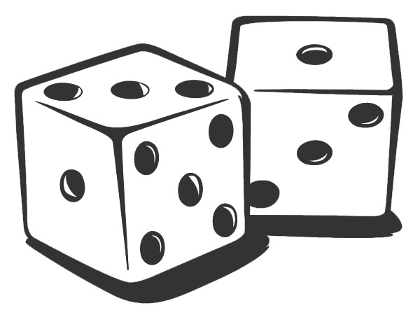

[再谈概率](https://zhuanlan.zhihu.com/p/35934630)

**"In no other branch of mathematics is it so easy for experts to blunder as in
probability theory."**

**“在所有数学的分支中，再也没有哪一支像概率论那样让数学家们轻易地出口成错”**

**—Martin Gardner** 

我们前面讨论了好几章的多世界理论和退相干理论，我们注意到，多世界理论是一个严格的决定论。多世界理论抛弃了坍缩假设，就连带着抛弃了玻恩规则。如果我们跳出宇宙之外，以上帝视角观察这个宇宙，它只遵守唯一的、完全决定论的薛定谔方程。因而整个过程中，没有任何“随机性”的生存空间。**每一个符合量子力学定律的事件都必然发生**，它们发生在不同的“世界”中。进而，“可能性”也就没有生存空间了：一个事件要么是必然发生的（符合量子力学定律），要么是必然不发生的（不符合量子力学定律）。没有“可能发生”的情况出现。而在一个没有上帝视角、作为宇宙的一部分的你看来，你只能看到其中的某一个事件，而你的无数其它“版本”分别看到了无数其它的事件。那么，问题来了：

1. 我们所说的“可能性”是怎么回事？或者说，“概率”是怎么一回事？我们**如何在一个完全决定论的世界里产生“概率”的概念？**
2. 玻恩规则又是怎么一回事？**为何我们会按照玻恩规则来“指定”一个事件的“概率”？**

这，就是人们彻底接受多世界理论之前，横亘的最后一个壁垒。如果这个问题无法解决，多世界理论最终总归是面临着一个喉中鱼刺，让人无比难受。

在近几十年，无数的人们在试图寻求这个答案，这些试图从纯幺正的量子力学中推导出玻恩规则的，从最早的Everett开始，有科学界的大佬，例如量子信息的大佬Deutsch、Wallace，有宇宙学的大佬Tegmark，也有退相干理论的大佬Zurek等等，还有很多不那么出名的科学家。至今已经有不下几十人提出了各种不同的理论，同时有更多的人在对这些理论进行着近乎吹毛求疵式的批评。在人们不断地深入探讨的同时，人们发现了这样一个问题：其实，多世界理论中“概率”的问题，并非只有在多世界理论中存在。事实上，所有与多世界理论中的概率相关的问题，都是在“概率”这个**一般概念**之中就问题重重。我们现在必须要先跳出多世界，甚至跳出量子力学，从概率的根子上探寻。

概率可以算作是数学理论中一个比较奇怪的概念。一般而言，数学理论中的每一个概念都是极尽严谨之能事，让人们在逻辑上毫无分歧的余地。但是概率理论则不然，一方面，作为一个纯数学理论，它的逻辑结构清晰，理论体系完备。事实上，概率论是数学理论中的一个重要分支[[1\]](https://zhuanlan.zhihu.com/write#_ftn1)，概率的应用在数学、自然科学、社会科学等各领域十分广泛。而另一方面，在纯粹的数学含义背后，概率到底意味着什么？作为一个核心概念，它的严格定义又是什么？说到底，人们**对概率如何诠释**？对此人们的认识可以说仍然是一笔糊涂账。

这一点非常像量子力学的现状：量子力学有着严格的形式理论和逻辑体系，遵从这种形式理论，人们对一个问题不会有任何分歧的结论，但是，这种结论如何诠释，例如波函数到底是什么？坍缩到底是什么？此类问题争论了100多年以后，大家仍然是公说公有理婆说婆有理。并且后面我们可以看到，关于量子力学诠释的争论，和概率诠释的争论有着密切的联系。

我们在第一部分的第四章[4、抛硬币和概率性](http://zhuanlan.zhihu.com/p/28551569) 曾经非常简单地讨论过概率到底是什么，以及在经典决定论下概率的含义,但是我们并没有深入探讨。那么我们现在可以再来看看，“概率”到底是个什么东东。

概率就是，我们前面说过，我们对一个事件的“可能性”的定量描述。这个说法虽然看起来很符合直觉，但是它作为一个定义，还是嫌太模糊不清了。更有甚者，即使是作为一个大体的描述，它也并不显而易见，很多人并不同意这种说法。首先，什么是“可能性”？其次，我们又如何对“可能性”来定量？对此有很多种不同的说法，如果把这些一一列举，这将是一个非常巨大的话题，恐怕没有200页是讲不完的，我这里仅用最简的语言挑几个有代表性的观点。涉及到数学，总是容易有很多看似繁琐乏味的陈述，我决定牺牲大量的严谨性，用浅显但不严格的语言来描述这些问题。

首先，是**“经典”的概率**。在我们这本书的开始，第一章 [1、拉普拉斯之妖](http://zhuanlan.zhihu.com/p/28522532) 中，有一段拉普拉斯的引言（关于拉普拉斯之妖），这包含了拉普拉斯最早对概率一种哲学观。在拉普拉斯的同一本著作中，他还说道：

> “*The theory of chance consists in reducing all the events of the same kind  to a certain number of cases equally possible, that is to say, to such  as we may be **equally undecided** about in regard to their  existence, … The ratio of this number to that of all the cases possible  is the measure of this probability。*”
> “*关于可能性的理论，其实就是把那些所有同类的事件分解成为一定数量的等可能性的事件，也就是说，分解成为我们**对其同等不确定**的情况，……我们关注的事件的数量与所有可能事件的数量之比，就是这个事件发生概率的度量。*”

这句话的意思是，虽然每个事件都是由决定论的动力学方程所完全确定的，但是对我们有限的信息而言，我们并不能完全确知这些事件的发生情况。那么，我们就被迫把所有那些我们对其信息**同样不确定**的事件，看作是等概率的。比如说一个骰子，它有6个面，我们知道它落下时必然会有一个面向上。但是我们并不知道我们投出它时的精确的力度、高度、角度，所以对我们而言每个面向上的信息我们是“同等不确定”的，因而我们必须认定，所有的面向上的概率都是相等的。

也就是说，说到底经典概率性其实是一种基于我们**对事件的“无知程度”**的概念。而前面所说的，对于“同等不确定”，也就是“同等无知”，的描述，就是经典概率的一个原理，叫做**“无差别原理”（Principle of Indifference）：**

**如果若干个事件我们没有任何证据把它们分辨区分开来，那么它们的概率是相等的。**

经典概率的一切，就是基于这个原理推出来的。

但是这种经典概率有着它的漏洞。比如说，对于我们完全无知的两个事件，我们应用无差别原理，可以看做等概率。但是，我们可以用不同的方式来看待这种不可区分性，并且他们之间不相容：比如说所谓的Bertrand悖论。这个悖论是这么说的[[2\]](https://zhuanlan.zhihu.com/write#_ftn2)，如果一个工厂生产某种立方体，它的边长可以从0到1之间随机变化，对边长的具体情况我们毫不知情。那么从这个工厂的产品中我们随机取一个出来，它的边长小于0.5的概率是多少？根据无差别原理，在我们完全无知的情况下，边长小于0.5和大于0.5应该是等概率的，那么这个概率是50%。但是，如果我们问，我们随机取出的这个产品的一个面的面积小于1/4的概率是多少？同样根据无差别原理，我们对各自可能的面积也是完全无知的，那么面积小于1/4的概率就应该是25%。同理，我们也可以说体积小于1/8的概率是12.5%。但是我们知道，前面问的三个问题，其实是同一个问题：边长小于0.5，就是面积小于1/4，也就是体积小于1/8。那么同样的一个事件，为何会有不同的概率？

我们可以辩解说，其实边长的均匀概率分布就意味着面积和体积不均匀分布，所以我们如果认为边长小于0.5和大于0.5无差别，就不能认为体积大于0.5和小于0.5无差别。它们总是至少有一个是不能视作无差别的。可是在我们完全无知的情况下我们凭什么认为边长无差别要优于面积（体积）无差别？

这时你可以说，可能是工厂生产工艺本身的特点就是边长的变化是等概率的，所以我们只能用边长无差别来考虑。那么问题就来了：我们本来是想用无差别原理来**定义**概率，但是现在变成了，无差别原理只能应用于**等概率**的情况，那么我们是在用“等概率”来定义“概率”，这显然是循环定义！

人们只能进一步来打补丁，认为无差别原理所阐述的，其实是一种对称性，**对称性是一种相对于某种变换所保持的不变性。**举一个几何的例子，一个中心对称的图形指的是沿着中心旋转任意角度图形不变。那么，对一个硬币来说，它将来落地的后不论哪一面向上，我们把它翻转过来，对现在的我们而言是毫无差别的 -  因为我们本来就不知道它哪一面朝上，翻转不翻转毫无意义，那么我们知道，这正反两面的概率是对称的，对我们而言毫无区别；同理一个骰子，它六面落地的情况是对称的，对我们而言毫无区别。那么这种对称性就表现为等概率。而Bertrand悖论中，我们必须预先要知道，相对于我们的无知而言，这个工厂的产品是关于什么对称的。如果是关于边长对称，那么我们只能认为边长是无差别的，在我们对这种对称性毫无所知的情况下，我们只能承认这个问题无解。

对经典概率还有一种不安，就是它表达的是人们的“无知程度”，这看起来多少有些主观的意思。当然，拉普拉斯对此辩称，我们的无知，也就是初始条件的有限精确度，是一个确定的**客观概念**。比如说，我们测量硬币抛出的速度，我们完全可以根据测量过程和测量仪器，知道我们的误差范围。在这个测量精度所能辨识的范围之外的一切初始状态，它们所导致的最终状态（正面向上还是反面向上）就是不可辨的。当然，这仍然不会消除“主观性”的影响。就像我们前面章节 [4、抛硬币和概率性](http://zhuanlan.zhihu.com/p/28551569) 讨论的，如果一个机器可以很好地控制抛硬币的力度，那么硬币落地的状态是可以精确确定的，概率将毫无用武之地。在“抛硬币机”看来，硬币的概率显然和用肉眼来看不同：这个概率是依赖观察的，它并非仅仅是事件本身的性质。

“主观性有那么可怕吗？难道不同的人对一个事件发生的概率的认知不应该有所不同吗？”有人站出来问。没错，这些人认为，**概率就是主观的**。它们的代表就是大名鼎鼎的**贝叶斯概率**。贝叶斯概率认为，概率并非是随机事件本身的客观性质，而是**人们对某个事件发生的主观信心程度。**例如，当我们拿到一枚硬币时，我们可以问，我把它抛出去它正面向上的概率是多少？我可以根据自己的猜想，假定它有一个概率，这个概率不是别的，而是我对“硬币正面向上”的信心，是一个主观的东西。但是，我的主观信心是随着我获取的信息量增多不断变化的。比如说，我认为硬币正面向上的概率是50%，但是我做了一个试验，发现它果然正面向上，那么这时我的信心就增加了一点，那么我会对下一次抛硬币试验中“正面向上”的概率指定一个比50%更大的数值。如果我第二次试验发现又向上，那么我的信心更大，我认为再一次试验中硬币正面向上的概率就更高。但是随着试验次数的增多，我发现有时候出现正面，我的信心相应上调，有时候出现反面，那么我们就相应地调低我们的信心。

概率的主观诠释很好地消除了经典概率的一些逻辑上的bug，但是，很多人对它感觉很不爽：因为它把数学理论归结为主观。难道数学不应该是确定的、跟谁在用它毫无关系吗？在整个数学理论中，还有哪一个理论会被认为是主观的度量？

但是，不论人们如何质疑，贝叶斯概率还是在统计学中获得了巨大的成功。

> *“Yet at the same time, it solved practical questions that were unanswerable  by any other means: the defenders of Captain Dreyfus used it to  demonstrate his
> innocence; insurance actuaries used it to set rates;  Alan Turing used it to decode the German Enigma cipher and arguably save the Allies from losing the Second World War; the U.S. Navy used it to  search for a missing H-bomb and to locate Soviet subs; RAND Corporation  used it to assess the likelihood of a nuclear accident; and Harvard and  Chicago researchers used it to verify the authorship of the Federalist  Papers.”*
> *“但是在同时，它（贝叶斯统计）解决了大量的其它方法无能为力的实际问题：Dreyfus上尉的辩护者用它证明了他的无辜；保险业用它来计算费率；图灵用它破译了德国的密码机并且据称因此使得盟军在二战中免于败绩；美国海军用它来寻找神秘消失的氢弹因而成功定位了苏联的核潜艇；兰德公司用它来评估核危机的可能性；哈佛和芝加哥的学者们用它来核实《联邦论》的作者。”（The Theory That Would Not Die）*

在主观概率诠释下，我们对抛硬币做试验，每一次试验，我们对它的概率都会有所变化，因为我们的信心都建筑在前面又多了一次试验结果的基础上。如此大量试验完成后，我们对下一次硬币的概率就根据前面所有试验结果来确定。当我们试验次数非常巨大时，我们对下一次试验所“指定”的概率就基本上不会再发生变化了：它就是前面所有试验出现的次数的比例：相对频率。

而另外一些人说，没错，相对频率本身**就是**概率的定义，但是，它绝不是主观的。这就是另一类概率定义的方法：**频率概率**。持这种看法的人认为，对一个随机事件而言，**概率必须是一个客观的、属于事件本身的性质**。这个性质就是：如果我们完全重复这个事件，它发生的结果每次都会不同，但是如果我们重复它很多次，我们会发现，某种特定的结果发生的相对频率（它出现的次数与所有试验次数的比值）就会渐趋稳定。比如在做抛硬币实验时，当你抛出次数很少的时候，你几乎找不到任何规律，正面还是反面朝上每次都完全不可预测，但是这个硬币不停地抛出时，渐渐地规律出来了：似乎正面出现的次数和反面出现的次数很接近，大约一半时间是正面朝上，而另一半时间是反面朝上。并且实验次数越多，它们就越接近。比如说，你抛了1000次，大约500次是正面，500次是反面。于是，人们就假定，如果我们后面再抛1000次，我们仍然会有500次左右正面，500次左右反面。**如果我们重复无穷多次，那么，这个相对频率就会是一个确定值，这个确定值就是概率。这个叫做“大数定律”。**

但是这里仍然有问题，首先我们想到的是，“无穷多次”？什么鬼？！按照这种说法，我们永远都不可能真正做出一个定义。其次，“完全重复”？我们理论上不可能完全重复同一个事件，它的初始条件必然是不可能相同的。

你可以说，我们实际操作中，并不见得真的要做到“无穷多次”，只要是次数足够多，也不见得完全重复，足够相似就可以了，这样我们就知道足够精确的概率了。比如说，我们只需要抛出1000次硬币，就可以断言正面向上的概率为50%。可是，你怎么知道，这1000次的试验结果是可靠的呢？既然是随机事件，你怎么就知道从1000次开始，后面不会连续1000次抛出正面？

“你这是在抬杠，连续1000次正面，那样太不可能啦！”你可能这样分辩。

但是等等！你是在说，连续1000次试验，正面向上的相对频率“很可能”，或者说“非常非常非常可能”是50%吗？请记住，我们在试图用相对频率来**定义**可能性，在这个时候，你是不能使用“很可能”这样的词语的，因为**它还没有被定义**！你等于在说，硬币正面向上的相对频率“很可能”是50%，那么这个50%就是正面向上的“可能性” -- 这又是在循环论证！

对此，人们发现，很难通过这种相对频率的方式来严格定义一个事件的概率。人们进而提出了第四种概率的诠释，就是“**物理倾向性**”，或者是“本性概率”。也就是说，概率代表的是事件本身的一种特性：它相反于拉普拉斯的概率 – 这是一种对确定事件的无知程度，它也相反于贝叶斯概率 - 这是我们对事件的主观，它把事件的随机性看作是一种真实的**內禀性质**。或者说，它就是随机事件产生某种结果的“倾向性”，正是这种倾向性，导致了大数定律：虽然随机，但是大量重复的相对频率趋向于稳定。我把这种倾向性姑且命名为真▪概率。

显然这种诠释，把一切问题集中到了这种“倾向性”上面去了。它提出的这种“真▪概率”消除了频率派的逻辑问题，也带来了自身的问题，就是这种“真▪概率”又是如何定义的呢？对于一个单一的随机事件，“倾向性”肯定不可能被直接观察到，因为人们只能观察到确定的结果，而不可能观察到“可能性”。而这种真▪概率和频率派的大量事件表现出的概率不同，它恰恰是一个单一事件的概率。因而这种“真▪概率”难以确切定义。

对此人们辩称，很多东西都无法确切定义，例如电磁学中的电荷，但是我们不能无限制地穷究下去 – 必须有一个“原生的”定义。这个**原生定义**就是概率。

从操作层面上，人们可以假设单一事件能够多次重复，那么它仍然可以通过大量实验的相对频率来确定这种“倾向性”。所以**操作上**它和频率论没有可辨的区别。另外，它也可以和主观诠释相一致，因为David Lewis曾断言，当人们知道一个事件的“客观概率”时，那么他对这件事的主观信心就必然等于这个客观概率。他很调皮地把这个称作“**Principal Principle”**（超级原理？大佬原理？甚至是“原理原理”？）

当然，关于概率的（量子力学无关的）诠释还有很多种，这里不一一列举。我们可以看到，每一种诠释都看起来非常有道理，但是同时它们又各自有着自身的漏洞或不完美的地方。它们之间其实并不能在所有的情况下都能得出相互一致的结论。比如说一个经典的例子就是睡美人问题：

我们邀请睡美人做志愿者协助我们做这样一个实验，我们给睡美人喝下安眠药让她入睡。然后我们扔一枚硬币，根据硬币的结果决定后续的实验过程。

------

如果硬币是正面，那么：

1、我们会在周一把她叫醒，面谈；

2、然后给她喝下健忘药，让她彻底地忘掉这次叫醒，然后让她继续入睡；

3、然后在周二再把她叫醒，面谈。

------

如果硬币是反面，那么：

1、我们会在周一把她叫醒，面谈，

2、然后给她喝下健忘药，让她彻底地忘掉这次叫醒，然后让她继续入睡；

3、然后让她一直睡下去。

------

在每一次面谈的时候，我们会问她一个问题：你觉得这次叫醒你硬币正面朝上的概率是多少？请注意，睡美人完完全全知道这个实验设计的整个流程，但是她不知道自己是在哪一种情况下被叫醒的。

**你觉得睡美人的回答应该是什么？**

如果你仔细思考，你会觉得神奇、并且困惑。我这里就卖一个关子，暂时不告诉你答案。

概率论在自然科学中、包括很多社会科学中，几乎已经应用到了每一个角落，尤其是在统计力学、化学、生态学、经济学等领域，更加是基础中的基础。这个看起来不那么牢靠的概念占据着如此核心的地位，不由得让人捏了一把汗。幸运的是，在绝大多数情况下，尤其是在自然科学的应用中，从纯粹的形式理论上，它们又有着基本相同的理论结果。我们不得不感到惊奇：**不论科学家们在哲学基础上如何打嘴炮，最终的理论结果却是如此一致！**

那么，下面我们就来看看在量子力学的多世界理论中，概率到底是怎么一回事吧 

------

[[1\]](https://zhuanlan.zhihu.com/write#_ftnref1) 事实上，在大学课程中，凡是需要数学基础课的专业，基本上有三门课程是必学的：微积分、线性代数、概率论和数理统计，这三门课构成了数学基础课的“最小必要集”。

[[2\]](https://zhuanlan.zhihu.com/write#_ftnref2) Bertrand悖论有更加严格和更加“数学”的表述，这里就不过于展开来说了。

发布于 2018-04-20

