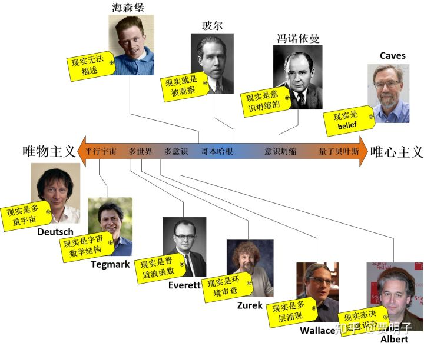
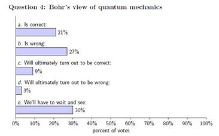
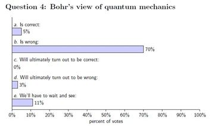
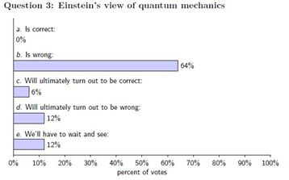
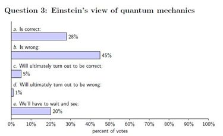
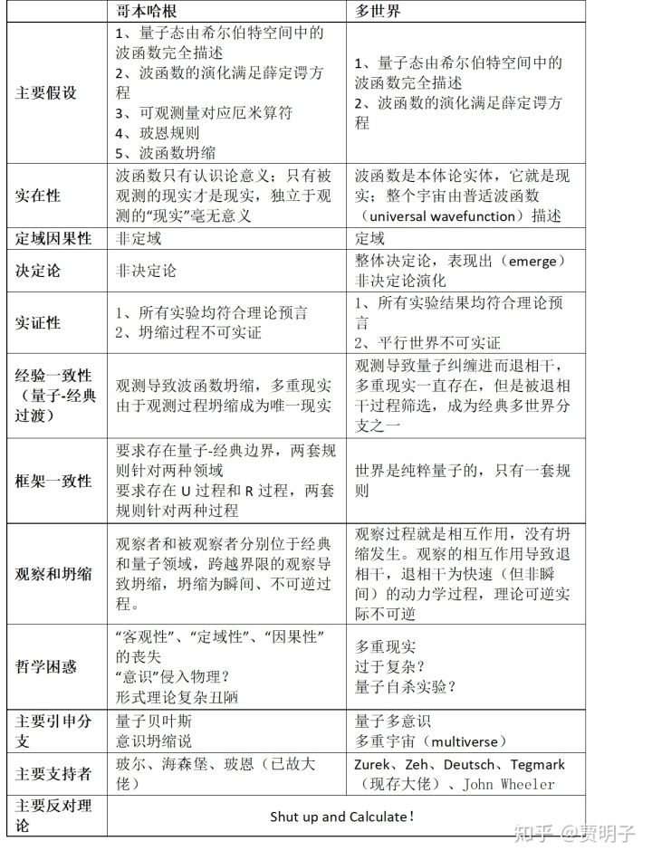

[多世界和唯一世界，以及奥卡姆剃刀的正确使用方法](https://zhuanlan.zhihu.com/p/36560668)

> **"With four parameters I can fit an elephant, and with five I can make him wiggle his trunk"** **“用四个参数，我可以模拟一头大象，如果是五个，我还可以让他摇晃自己的鼻子”** **—冯诺依曼** 

我们来整理一下前面谈论的关于量子力学的一切，我们主要介绍了那些日常生活中绝对不会出现的、难以想象的奇怪的量子现象，以及对此进行诠释的两个主流理论：哥本哈根诠释和多世界理论。关于量子力学的诠释，是一个非常大的问题，绝不仅仅是这两个理论。事实上，各种诠释加起来已经不下20多种了。

在量子力学的早期，由于玻尔、海森堡等几位大神的支持，哥本哈根学派早早地确立了相对强势的地位，被一些人奉为“正统”（orthodox）。进位正统的哥本哈根学派战绩辉煌，它成功地解释了各种量子现象，并且在那场史诗般的论战中“战胜”了伟大的爱因斯坦。以至于哥本哈根之后，几乎再无一举成名的诠释量子力学的理论。

前面我们提到，多世界最早提出于1951年，这时候哥本哈根学派的地位早已难以撼动，它的坚决反对者，爱因斯坦也已经逝去。多世界理论自诞生起就命运多舛，在经历了玻尔的无情嘲讽、无人问津的十几年年以后，终于被大家重新发现，然后又经历了半死不活的几十年，最后配合退相干理论，直至最近一二十年，它才开始初露峥嵘，颇有挑战权威的面相。现在已经是量子力学诠释中最能够与哥本哈根学派分庭抗礼的学说了。

但是我这里必须要澄清一点：关于量子力学的诠释，现在远远还不到盖棺定论的时候。人们众说纷纭，各抒己见。哥本哈根学派和多世界理论的坚定信徒加起来也不会超过50%。虽然大家会时不时地谈起“正统”诠释，但是事实上，直到现在，**根本就不存在一个真正意义上的“正统”诠释。**如果你强迫大家都必须“选择”一个诠释，历史上人们可能选最多的就是哥本哈根诠释。但是这不意味着大家对它满意。事实上大多数人选择宁愿谁都不信，只不过哥本哈根诠释占据了确立时间比较早的优势，人们已经比较习惯了它的思维方式，所以在还没有更好的选择的时候，姑且认为它正确。可是，大家一直以来都非常清楚它的致命伤：关于量子 -  经典过渡问题的难以自洽以及关于观察和坍缩问题的含糊不清。尤其是前者，不但理论上让人难以满意，现代的科学实验已经一步步地在越来越大的系统中观察到量子力学的特性，一遍遍地否认了所谓的“海森堡边界” （Heisenberg Cut）[[1\]](https://zhuanlan.zhihu.com/write#_ftn1)的存在[[2\]](https://zhuanlan.zhihu.com/write#_ftn2)，让人们越来越对其失去耐心。

爱因斯坦和玻尔的大论战在公众眼里以玻尔胜利告终，但实际上，爱因斯坦固然没有成功推翻哥本哈根诠释，但是玻尔也并没有赢。

> ***“While most accounts say that Bohr won the debate, my view is that Einstein,  as usual, was seeking an explanation of reality, while his rivals were  advocating nonsense. Everett’s interpretation doesn’t make Einstein a  demigod. But it does make him  right.”（“虽然大多数人认为在那场论战中玻尔获得了胜利，但是，我的观点是，爱因斯坦一直致力于寻求关于现实的解释，而他的对手们则是一直在宣扬一堆废话。Everett的理论虽不能让爱因斯坦封神，但是它的确让爱因斯坦正确。”）–Deutsch\***

> ***“Bohr’s version of quantum mechanics was deeply flawed, but not for the reason  Einstein thought. The Copenhagen interpretation describes what happens  when an observer makes a measurement, but the observer and the act of  measurement are themselves treated classically. This is surely wrong:  Physicists and their apparatus must be governed by the same quantum  mechanical rules that govern everything else in the  universe.”（玻尔关于量子力学的看法有着致命的缺陷，但是这个缺陷却并非如爱因斯坦所言。哥本哈根诠释把观察行为和观察者看做经典，这当然是错误的：物理学家和他们的仪器都必需被同样的量子力学规则所支配，就像它支配了宇宙间万物一样。）- 温伯格\***

爱因斯坦死后60多年了，人们仍然在争论。在2013年的一次量子力学会议上，组织者专门做了一个调查。结果显示，21%的人认为玻尔是正确的，但是27%的人认为它是错误的。而在同年另一次会议的一个“民调”中，高达70%的人认为玻尔是错误的！

相对而言，关于爱因斯坦的观点，其实也好看不到哪里。两次民调的结果分别如下：

这其实说明了大家对量子力学诠释的纠结：去你妈的爱因斯坦和玻尔，在我看来都在胡说八道！从这里看，**不论是爱因斯坦还是玻尔，都远远算不上“主流”**。

我这里说这些的目的，不过是想让你明白，**目前物理学界对诠释问题并无定论。**前面的探讨很容易让你产生一种错误印象：量子力学诠释的主流是哥本哈根与多世界之间的战斗。其实不是的，这两种诠释可能算是没有主流中的最“主流”。而你，也不应该被这两种思想完全框住。这个问题到现在为止，仍然是完全开放的，并且有可能永远不会关闭。

应该说，关于诠释问题的争论已经持续了一百多年了，历史上可能没有其它任何问题能够这样难缠。这种争论的一个后遗症就是，人们已经厌烦了：所有这些争论，基本上都是人们对形式理论的理解，但是却不会影响任何有实际意义的结果。所有的诠释，最终都会做出几乎完全相同的理论预言；而大家的分歧，却绝大部分处于那些无法实证的领域。在这种情况下，争论还有意义吗？这就是“闭嘴计算”（shut up and calculate）的态度。它认为，我的理论**能够做出正确预言就足矣**，何必纠结于“它到底意味着什么”这种无意义的问题？测量到底是否占据着特殊地位？它是否会导致“真的”波函数坍缩？存在我们无法干涉的“多重现实”吗？它并不关心。就好像我们前面谈到的关于“概率”的诠释问题一样，人们不明白真正的概率是什么，但是完全不妨碍大家在社会学、经济学、统计力学领域应用它并且得到极为丰硕的结果。应该说，绝大多数人至今仍然持有这种态度，原因其实未必是他们真的满足于对物理的一种（不加诠释的）纯数学描述，而是因为现有的诠释难以服众，人们暂时采取这样一种逃避的态度。

但是这种态度也产生了一种恶果，那就是关于量子力学基础的问题的讨论现在成为一种小众话题，被冷落、被无视。Tegmark曾经抱怨说，他曾经一篇文章比较深入地探讨基础问题，被审稿的人退稿了，并且劝诫他说，他的理论功底不应该被浪费在这种“民科”  （crackpot）的领域。他说他于是乎用了一种特洛伊木马的策略，想方设法把他的思想“包装”在一个实际问题当中。在发表文章的时候，总是在表面上讨论一个非常具体的实际问题，但是却把自己的哲学思想偷偷地植入到其中。这样一来，他的思想得以发表，但是人们往往只看到他的实际结果，但是真正想发表的思想却被人忽视！

这种实用主义和工具主义倾向的思维模式，其实是可以理解的，因为诠释问题实在是太玄、太难、以至于看起来太空洞了，以至于难以展开有效（明确、可实证）的探讨。但是，我并不希望你陷入这种思潮之中。我想起一个故事：当法拉第第一次发现电磁感应的时候，一位贵妇问他这个发现有什么用，他反问道：“一个初生的婴儿有什么用？”我们当然不能脱离实践，但是，在考虑实际结果的同时，我们并不应该放弃我们的好奇心，这种好奇心驱使我们去钻研那些**个看起来无用、无实际结果、但是非常有趣的问题**。而这种探索终将体现出它的价值。即使是它最终毫无价值，至少它是有趣的，我认为，**仅仅是“有趣”就足够成为我们沿着这条路走下去的理由了**。这种“有趣”才是驱使人类不断做出突破的终极驱动力。我很欣赏王小波的一段对科学的评价：

> ***“在器物（具体应用[[3\]](https://zhuanlan.zhihu.com/write#_ftn3)）的背后是人的方法和技能，在方法与技能的背后是人对自然的了解，在人对自然的了解背后，是人类了解现在、过去和未来的万丈雄心。”\***

这就是为何，我还要继续带领你深究这些诠释背后的含义的原因。下面的表格总结了我们前面所探讨的，哥本哈根和多世界对一些主要问题的分歧。

首先，我先表明我的个人观点：在哥本哈根和多世界理论之间，我毫不犹豫地更喜欢多世界理论。不幸的是，在吃瓜群众、乃至于很多专业人士当中，**存在着大量的对多世界理论的误解。**例如Tegmark曾说道：

> "Everett's PHD thesis... everyone in physics has an opinion about and almost  nobody has read"（Everett的博士论文，物理界的每个人都能对它指手画脚一番，但是几乎没有人真正读过他）

这些误解导致了很多对多世界理论不公平的抵触和批判，具体包括：

1、多世界理论太“玄”（absurd）啦！

2、多世界理论只是个诠释，不能提出独立于“正统”理论的可实证理论预言。

3、多世界理论过于复杂，提出了“多个互不相干的世界”，这些世界无法实证。为了避免“坍缩”而创造了近乎无穷多个宇宙，理论代价太大。

我现在对上面的批评来一一作出澄清。首先，我们先来看，多世界理论真的“太玄”了吗？

从上面的表格我们其实很容易看出，**多世界理论和哥本哈根诠释的主要分歧之一，就是对“客观现实”的看法**。哥本哈根的一个很主流的观点认为，现实只有被观察才能被称之为现实，在这个过程中，“观察”被赋予了一个极为特殊的使命：它造就了我们称之为“现实”的东西。现实从来就不是独立于观察者存在的“客观”的东西。这一点，和经典哲学流派中贝克莱大主教所说的**“存在就是被感知”**不谋而合。在哥本哈根诠释中，我们决定如何观察这个世界（位置还是动量？X方向的角动量还是Y方向的角动量？等等），就选择了波函数坍缩的基底 – 也就是说，选择了现实可能是什么而不可能是什么。这其实就把贝克莱的说法更加具体化了。

更进一步说，**就如前面我说多世界必然导致多意识一样，坍缩必然导致意识坍缩。**这一点哥本哈根学派小心翼翼地避免谈及，因而就把坍缩过程变得模糊不清，无比神秘。而冯诺依曼对细节的穷究却打开了这个潘多拉盒子：如果坍缩存在，那么它必然发生于意识介入的那一刻，否则别无解释。这就彻底地把“客观实在”给抛弃了。难道你觉得意识造就现实的说法不玄吗？更加“玄”的是，如果真的是意识造就现实，那么什么是意识？猫狗的意识算不算？乌龟甲鱼呢？草履虫呢？还有，在这个宇宙还没有意识生物存在之前，宇宙是否存在？第一个意识生物看了一眼这个世界，难道就导致了之前150亿年的宇宙成为现实？

如果我们再向前一步，对此的进一步细究就必然导致它最终会彻底否定波函数的现实意义：所谓的叠加态本身毫无意义，只是我们对世界运算的工具而已，是我们对世界的信念的叠加。这必然把它引向**唯心主义的极致**。

相比之下，多世界理论只不过是对“客观实在”做出了一个明确的肯定而已：实在是独立于观察存在的、它就是那个普适波函数。**如果我们承认独立于观察的客观实在、搭配上薛定谔方程的幺正演化，那么我们就必然要承认多世界这样的结论：**因为幺正演化保证了叠加态永远存在。而独立于观察的客观实在则要求波函数不会受到观察的影响，因而也就不会有观察导致的坍缩，所以叠加的现实永远不会消失。

在这里，观察不再是一个神秘的过程，它仅仅就是观察者与被观察系统之间的相互作用而已。观察者本身由量子构成，因而也是这个客观世界的一部分，观察结果并不单单由系统本身状态决定，而是观察这与被观察系统之间的相互作用决定：两者不可避免地进入纠缠状态，观察者的多重现实与被观察系统的多重现实相互关联，因而观察者永远不能跳出系统以独立的“鸟瞰”视角观察到所有的分支，而只能以“井娃”视角观察到诸多分支之一。这种以鸟瞰视角才能观察到的复杂的多分支现实，正是多世界理论的本体论：**多世界理论其实就是唯物主义的极致**。不但不玄，而且极其符合我们的哲学直觉。

唯物还是唯心，本身超出了自然科学讨论的范围。我们姑且认为它们在自然科学中的地位是同等的。即使是这样，为何我们会认为多世界理论比哥本哈根更玄呢？这本身毫无理由。也就是说，多世界理论至少不比哥本哈根理论更玄。

下图我列举了若干大佬的主要观点，上面的是哥本哈根阵营的，下面是多世界理论阵营的。

抛开本体论含义不谈，其实最让人不喜的是，在哥本哈根诠释的逻辑里面存在着非常别扭的地方：它对“波函数”是个什么看法？

1、 **如果说它认为波函数是现实的**，那么，哥本哈根诠释本身就无法避免多世界。因为还没有被观察的量子态没有发生坍缩，那么多重现实就一直存在：波函数实实在在地处于多重现实的叠加当中，和多世界理论别无二致。既然多重现实无法避免，那么何必强加一个坍缩假设呢？

2、 **如果它认为波函数不是现实的**，比如说，仅仅是人们虚构出来的计算工具，那么，我们等于在说，“看！这就是波函数，它不是现实存在的，但是它却能精确地告诉观察者实际的观测结果”那我们不禁要问，这么绕来绕去有意思吗？为什么我们就不能直接说，“波函数就是现实存在的”呢？既然波函数是理论中的核心概念，我们为何不能大大方方地承认它，反而非得要认为它不是现实 – 而它却能能代表现实？

**所以说，多世界理论不玄，至少与哥本哈根诠释相比一点都不玄**。

那么，我们再来看看第二个批评：多世界理论只是个诠释，而没有独立预言。事实上这并不正确。多世界理论与“正统”量子力学并不等价，它不仅仅是一个诠释，而是有着不同形式理论的物理理论。它没有坍缩假设，也没有玻恩规则的假设 – 这两者都是多世界理论的结论而不是前提。我们可以单独从多世界的形式理论出发而抛弃一切诠释，就可以重现“裸量子力学” （bare  quantum mechanics）的一切预言。它的预言精度和范围一点都不比哥本哈根诠释来的少。**如果我们要以“没有独立预言”来攻击多世界理论，同样的逻辑我们也可以用来攻击哥本哈根理论，**因为它与多世界理论相比，也同样“没有独立预言”。

事实上，多世界理论的支持者们一直在致力于寻求独属于它自己的独立预言。其中Deutsch曾经提出过一个复杂的、具有自主意识的、可逆的人工智能代替人类观察者来做观察实验，然后再逆向消除“坍缩”的实验，来区别多世界理论。但是这在我个人看来并不是很有道理。因为哥本哈根诠释非常狡猾地逃避了对“观察”的准确定义 – 冯诺依曼的意识坍缩除外 –  那么，即使是这个人工智能观察了系统，又可逆地消除了“坍缩”，同样不能证伪哥本哈根，因为它可以不承认这是个有效的观察行为。并且，一切实验结果最终都必需要由“我”来诠释，但是在我个人看来，所有涉及自我意识的过程都必需涉及退相干 –  退相干是自我意识产生的前提。原因很简单，没有退相干就意味着整个宇宙不存在子系统的划分，也就不存在“物我”的分别。没有物我之分，何来“自我意识”？而如果退相干不可避免，那么理论上就无法区分多世界和坍缩。

事实上，如果不是因为哥本哈根诠释对“观察”定义的模糊性，它可能早就已经被实验证伪了：延时选择的量子擦除实验就是一个实锤的证伪。光子先被反光镜“观察”，然后又被分光镜把观察结果“擦除”掉，最终得到了干涉结果 –  坍缩被逆转了。当然，哥本哈根的支持者是不承认这个结果的，因为他们可以否认反光镜是个观察仪器。或者说，按照海森堡的说法，观察是“实验结果不可逆地记录下来”。那么什么叫“不可逆记录”？记录在反光镜可以被棱镜擦除，记录在硬盘上同样也可以被擦除，记录在纸面上也可以被撕毁。说到底，只有被“我”观察后，记录在我的记忆中，才是不可逆的记录 – 那么我们就回到了冯诺依曼的意识坍缩了。这就是为何我说，**坍缩必然导致意识坍缩。**而相对温和的哥本哈根诠释又不愿意陷入讨论意识坍缩的泥潭中去，那么**这种对“观察”定义的模糊性，就成了一种非常耍流氓的手法：它的诠释具有任意性**，人们可以根据结果任意地进行有利于自己的解释 – 它根本就是不可证伪的。或者说，这根本就是一种**循环论证**：首先定义观察为不可逆的，然后论证坍缩是不可逆的。

当然，有另外一种方法 – 真实但是毫无可操作性 – 可以实证多世界和坍缩，那就是**量子自杀**。

量子自杀是一个类似于薛定谔猫的思想实验。假设我们把薛定谔猫从盒子里拿出来，然后很残忍地把一个人，小明，放进去，然后来观察小明的生死。为了减轻小明可能的痛苦，我们把毒气瓶换成一把手枪，对着他的脑袋。开启这把手枪的是一个50%/50%的量子事件，比如说，一个粒子的自旋态。如果这个粒子自旋向上，则手枪发射，小明悲惨地被爆头；如果粒子自旋向下，则只放空枪，没有子弹，小明只是被吓个半死。那么实验结果是什么呢？

按照哥本哈根诠释，量子事件发生，然后触发手枪，此时手枪处在“有子弹”和“没有子弹”的叠加态。小明的观察立即导致这种叠加态的坍缩，使得其中一种状态保留，另一种状态消失。他有50%的概率爆头，50%的概率只是被吓尿。如果我们一次次地重复这个实验，那么小明的观察必然会一次次地坍缩掉手枪的状态，然后最终几乎必死无疑。

而按照多世界理论，同样的事情发生时，手枪的叠加态并没有坍缩，在一个世界里，小明必然被爆头，而在另一个世界里，小明必然活下来。我们作为外部的观察者，与整个手枪+小明的世界纠缠在一起，一个我们的版本进入活小明的世界，另一个版本进入死小明的世界。从主观上我们认为，小明有50%的概率爆头，50%的概率只是被吓尿。这和哥本哈根诠释是一致的。但是，从小明的视角来看，他自己的一个版本死掉，而另一个版本活着：一个版本意识消散，而另一个版本继承了他的全部记忆幸存下来。对他而言，死掉的那个版本毫无意义。而总是有一个版本可以继承他的全部思想活下来。从主观概率上讲，他会发现自己活下来的概率为100%。不论实验重复多少次，他总是会发现那把枪是在放空枪。那么，不用多少次，如果他连续10次幸存，他基本上就可以认定，多世界理论是正确的。

这个实验就明确地区分出了多世界理论和哥本哈根诠释的不同。但是我们却没有任何办法来操作这个实验。首先我们需要一个大无畏的实验志愿者，冒着必死的危险来做这个实验；其次，即使是他幸存了100轮实验后，也只有他自己知道多世界是正确的，我们作为外部的观察者，则几乎必然发现他早已经死掉了。可怜的小明没有任何办法，穿越到那2^100个平行世界中去告诉那里面悲伤的我们，他其实还活着！

这个实验思路清奇，角度刁钻，但是毫无用处，除非你自己亲自下场去做这个实验 -- 但是为了无数个世界中你无数的父母家人，我劝你还是放弃为好。

那么到此为止，我们姑且认为多世界和哥本哈根所能做出的理论预言完全一致而毫无分别。但是谁知道随着科学和技术的发展，后面有没有可能打破这个僵局呢？

这里我想说的是，即使是多世界理论和哥本哈根理论没有任何可实证的判决来加以区分（我们姑且放过哥本哈根诠释中观察过程的不可证伪性），仍然是多世界理论要远远优越于哥本哈根理论。这就是我对第三个批判的态度。

这种批评是这样的：为了消除一个“坍缩”过程，多世界理论引入了近乎无穷多个平行的世界，而这些世界之间有毫无关联，完全无法相互感知，因而它就是完全**无法证伪**的。那么根据奥卡姆剃刀原理，这种不可证伪的概念就必须被剃刀剔除：它是完全冗余的东西。

我说，这是对奥卡姆剃刀原理的误用。**真正的奥卡姆剃刀不是这样来用的，**这样它只能割伤自己。而事实上，如果我们正确使用这个剃刀，我们会发现，应该被剔除的，恰恰是哥本哈根诠释。

奥卡姆剃刀原理是这样说的：如果两个理论做出完全相同的预言，那么，那个**引入假设更简**的理论更加优越。而不是说那个**预言更简**的理论更加优越。

奥卡姆剃刀原理非常符合人们对于自然科学的美学信念。狄拉克就非常简单粗暴地认为，越简单的理论就越美妙，而越美的理论就越符合现实。这真的就是一种信仰。

> "A theory with mathematical beauty is more likely to be correct than an  ugly one that fits same experimental  data"(如果符合同样的实验数据，那么一个具有数学美感的理论，相比于一个丑陋的理论，更可能是正确的。）- 狄拉克 

还记得我们前面在[2、精致冰冷的还原论](http://zhuanlan.zhihu.com/p/28526739) 中举的两个例子：围棋和美式足球吗？简单即为美，这几乎是所有科学家的共识。

抛开它信仰的部分，人们实际上可以通过贝叶斯概率理论来证明奥卡姆剃刀原理。我这里无意重复这个证明过程，只是说一下它的结论：如果有两个理论T1和T2，其中T1所包含的假设少于T2，那么如果两个理论在满足相同的试验结论数据集C的前提下：

![[公式]](https://www.zhihu.com/equation?tex=%5Cfrac%7BP%5Cleft%28+T_1%7CC+%5Cright%29%7D%7BP%5Cleft%28+T_2%7CC+%5Cright%29%7D%3E1) 

也就是说，**引入假设更少的理论（T1）其为真的概率大于引入假设更多的理论。**

这一点我们可以通过更加直观的说法来说明。由于T1所包含的假设少于T2，而两者预言完全相同，那么我们完全可以在T1上面附加一些假设，使其假设数与T2相等，从而取得比T2更加具体的预言。而更加具体的预言当然可信度要高于模糊的预言。

那么，你一定很敏锐地铺捉到这里的关键点了：**更简单的理论是那些假设更简的理论，而不是预言更简的理论。**请注意，多世界理论中，“存在多重现实”这个论断是个结论，而不是假设。事实上多世界理论的假设极少，我们可以从上面的表格中就可以看到。它与哥本哈根诠释相比，至少消除了坍缩假设和玻恩规则假设（后者尚有争议）。多世界理论中只有一个唯一的规则就是薛定谔方程，基于此多世界理论预言了不可证伪的平行世界。so  what，它是理论的自然结论，虽然无法实证，但是人们完全可以通过对理论假设的判断来判断这些结论的真实性。但是哥本哈根诠释中，不同的领域（经典、量子）遵循两套不同的规则，不同的过程（U过程、R过程）遵循两套不同的规则，而且坍缩和玻恩规则都是基本假设，除去直接实锤之外是不可置疑的。因而它显然是一个更加复杂的理论。

**那么，谁该被剃刀砍掉，还不是一目了然了吗？**

但是这里我还要再给哥本哈根诠释补一刀：即使我们只看结论，仍然是多世界理论的预言更加简洁。

什么？！你可能跳起来说，预言了无数个世界，怎么可能比预言单个世界更简呢？

先别急。听我细细道来。我先举一个例子，描述所有的自然数更简，还是描述单个自然数更简？

这个似乎是一个傻瓜问题，你一定会怀疑，里面莫非隐藏了什么套路？没错，你的怀疑是正确的。我这里给出的答案违反你的常识：描述所有的自然数更简。为什么呢？记得我吗前面讲到的自然数的定义吗（[题外话、自然数的正确打开方式](http://zhuanlan.zhihu.com/p/28595534)）？那么所有的自然数，我们可以用冯诺依曼的集合来描述如下：

0={}；

1={{}}={0}

i={0,1，……，i-1}

我们只需要定义一个起点，0，然后再定义一个递归规则，就把所有的自然数集给描述出来了。然而如果我们直接用阿拉伯数字来描述任意一个自然数，绝大多数情况会比上述描述更加复杂：它会耗掉更多的字节。更不用说，在我们定义自然数集之前，是无法用阿拉伯数字来描述单个自然数的。

你是不是有一点明白了？多世界所预言的多个世界，其实并不需要我们对其一一描述，而只是描述一个普适波函数就可以了：每一个世界，都是普适波函数在某个“方向上”看到的投影。我们前面一再强调的说，**从鸟瞰的角度上看，世界从来就没有分裂，它一直就是一个统一的整体，**就是这个道理。而具体每个世界，其实是退相干选择出来的偏好基上的投影，而整个退相干过程，是通过普适波函数的运算和相互作用的性质直接得到的。

而对于哥本哈根诠释呢？它所预言的，包括了几个部分：1、整个波函数；2、所有的本征态；3、在每个本征态上坍缩的概率。

那么，这个预言谁更简呢？

从根本上说，多世界理论的预言，是整个高维希尔伯特空间的结构，而哥本哈根诠释预言的，是这种结构中的某一个分支。

至此，我想我已经从多个角度阐述了为何多世界理论相比哥本哈根理论更加优美、简洁、明确、自洽了。有人说，**多世界理论才是“标准的”量子力学，而哥本哈根理论则是附加了“唯一世界诠释”的量子力学，**深得我心。但是这里我想说的是，这并不是我更加喜欢这个理论的最主要原因。这个最主要的原因就是：**多世界理论打开了一个大门**，使我们有了更加广阔的可能性。

哥本哈根诠释是从经验出发，把自己局限于经验的范围以内，对经验以外的，全部斥之为无意义而拒绝讨论。而多世界理论则从原理出发，以理论简洁和逻辑自洽为更高的追求，而对它所预言的我们经验之外的东西持开放态度，得到的看似荒谬，却逻辑严谨的结论。没错，未来我们也会有可能会发现这些结论根本就是错误的，但是至少，它并不局限于我们的现有经验，有着更大的格局。

试想，以经验出发的理论，诸如地心说、唯能论、绝对时空，如果它们当初压制了那些看似荒谬、但是从原理出发水到渠成的理论诸如日心说、分子理论、相对论等等，我们的世界现在会是如何呢？**实证是自然科学的第一原则，但是如果我们遵循强实证主义而拒绝讨论现有实证范围以外的可能性，则终将扼杀人类探索自然的终极动力。**

我读到一篇文章中有一段文字打动了我，虽然以我的孤陋寡闻，我以前并没有听说过这个作者，在这个大佬云集的时代他可能确实也是一个名不见经传的人物，但是我愿意在最后，以如下的引文结束本章：

> “Our work might be brushed aside with comments like: “Quantum mechanics  works. So there must be some fault in your argument. Why waste time to  sort it out when there are so many fascinating things to be done?”  However, Einstein would definitely disagree with such comments. Pursuing the truth is not a waste of time in any sense. The Copenhagen  interpretation actually closed the door of exploring the reality behind  quantum mechanics, though Einstein had tried to keep the door open.”
> “我们的工作可能被冠以这样的评论而被扔进垃圾桶，‘量子力学是有效的，你的论点肯定有某些错误，有这么多有意义的事情可做，为何要浪费时间来给量子力学挑刺呢？’但是，爱因斯坦肯定不会同意这种论调。在任何情况下，寻求真理都绝非浪费时间。**哥本哈根诠释实际上把我们探寻量子力学背后的真实世界的大门给关上了，但是爱因斯坦却终其一生努力使这扇大门敞开。**”
> \- Guang-Liang Li

------

[[1\]](https://zhuanlan.zhihu.com/write#_ftnref1) “海森堡边界”（Heisenberg  Cut）认为，在观察者/观察仪器与被观察系统之间，存在着一种界限，在界限的上面，观察者一边，我们需要应用经典处理方法；而在下面，量子系统的一边，我们需要应用量子力学。海森堡说：“In this situation it follows automatically that, in a mathematical  treatment of the process, a dividing line must be drawn between, on the  one hand, the apparatus …, and on the other hand, the physical systems  we wish to  investigate.”(“在这种情况下我们自然而然地得到，对这种过程的数学处理中，必须要划一道分界线。一边是观测仪器……，另一边是我们想要观测的物理系统。”)

[[2\]](https://zhuanlan.zhihu.com/write#_ftnref2)例如就在今年，人们已经可以在宏观的铝箔（肉眼可见的15微米）上实现了量子纠缠。

[[3\]](https://zhuanlan.zhihu.com/write#_ftnref3) 括弧内是我自己添加的说明

