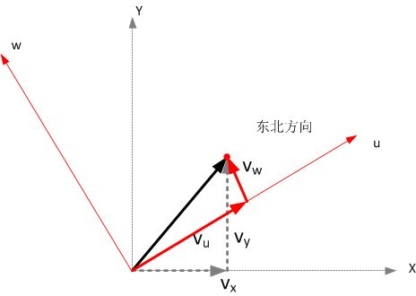
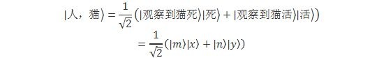

[量子现象的消亡史](https://zhuanlan.zhihu.com/p/34358814)

**“The opposite of a correct statement is a false statement. But the opposite  of a profound truth may well be another profound truth”**

**“一个正确命题的反面是错误的命题，但是一个深刻的真理的反面，完全可能是另一个深刻的真理。”**

**–玻尔**

我们继续来看看多世界理论中的难题。

我们在前面说过，**量子态是希尔伯特空间中的一个单位矢量**。量子态的演化其实就是这个态矢量的旋转过程 –  只不过因为希尔伯特空间的维度巨大，因而这个旋转就变得复杂无比。而对于一个矢量而言，我们可以通过选择一个坐标系来描述它。例如二维空间中的一个速度矢量，它指向东北方向，那么我们完全可以选择一个坐标系，X轴指向正东，Y轴指向正北，那么这个速度就是正东方向和正北方向的叠加，事实上，它之所以被称作“东北方向”，正是由于人们习惯于用东西南北作为参照。

东西南北方向只是我们日常的习惯而已，没有任何理由说旋转一个角度就不能成为坐标系了。那么，我们可以旋转任何一个方向，构成一个新的坐标系，用它来描述这个矢量。此时，它仍然是它，绝不会因为用了不同的坐标系它就变成了另外一个矢量：

我们选择的任意一套坐标系，在它之中的每一个叠加分量，都是同等“真实”的。我们绝不能说正东是真实的，而“东偏北15°”就不真实。也就是说，它可以由无穷多种选择的叠加方式。

同理，量子态这个矢量和速度矢量表现完全一致。例如猫态的“死”和“活”是一组坐标轴，我们完全可以用“死+活”和“死-活”作为坐标轴。任意的一个量子态，可以用前者表示，也可以用后者表示。

就像是上一章节中一样，现在我们用“死”和“活”作为猫的基底（“坐标轴”），用“看到猫死”和“看到猫活”作为观察者的基底。有这样一个量子态，在这组基底中可以表示如下：

现在，我们把我们的基底做一个“旋转”，用如下的猫态x和y、观察者态m和n作为基底：

 此时，我们用猫的两个叠加态和人的两个叠加态来作为坐标轴，现在这个量子态将如何表示呢？这是一个简单的初等代数问题，我们可以非常简单地做一下数学变化，就可以得到这个量子态就变化为：

请注意，这个变换仅仅是我们变化了一下我们的坐标系，也就是说，仅仅是采取了稍微不同角度来观察。而这个量子态还是原来那个量子态，完全没有任何变化。（就好像我们变换一个角度来描述一个速度，不会使速度的方向发生变化一样）。

此时，同样的一个量子态，表现为不同的形式，它仍然是一个纠缠态（贝尔态），但是，它现在是这样两个分量的叠加：

1、猫处于“死+活”、观察者处于“看到死+看到活”

2、猫处于“死-活”、观察者处于“看到死-看到活”

既然同一个量子态的两种表示方式完全等价，并没有哪一个比另一个更加“真实”，那么，按照多世界的思想，猫的“死+活”态和人的“看到死+看到活”态是一对相对态，猫的“死-活”态和人的“看到死-看到活”态是一对相对态，如此类推。那么，按照我们一般习惯，这个宇宙“分裂”成（A）“死、看到死”和（B）“活、看到活”这两个我们很容易理解的经典“世界”；但是如果我们稍微换个角度看问题，那么宇宙就“分裂”成（C）“死+活、看到死+看到活”和（D）“死-活、看到死-看到活”这两个世界。按照前者的分列方式，我们不论身处A和B的哪一个“世界”，都不会感到奇怪，因为它们都非常正常。但是按照后者的分裂方式，无论我们身处C和D的哪一个“世界”，都是十分怪异的，要么，这个世界存在一只死+活的猫，而我们同时看到猫死+看到猫活，要么，这个世界存在一只死-活的猫，而我们同时看到猫死-看到猫活！

为了更加形象地说明这一点，我们来举一个简单的经典运动学的例子：一个平抛运动。当然，这是一个纯经典的过程，运动规律和量子世界完全不同，但是却能给我们一些符合常识的类比。

如图，我们水平向外抛出一个垒球。如果我们完全忽略掉空气阻力，那么这个球行走的轨迹就是一个严格的平抛抛物线。当你将来上到高中，你会学习具体的运动方程，但是现在你可以想象，如果我们选择水平方向为X轴，竖直方向为Y轴，那么，很显然，这个运动在水平方向是是一个匀速直线运动，而在竖直方向上是一个自由落体运动。我们说，**垒球的运动是由一个匀速直线运动和一个自由落体运动叠加而成的**。

作为量子力学的一个延伸，我们可以假想[[1\]](https://zhuanlan.zhihu.com/write#_ftn1)，当我们观察这个小球时，我们自身的两个叠加态分别于水平方向和竖直方向形成纠缠，于是一个状态只能观察到匀速直线运动，而另一个状态只能观察到自由落体运动。由于“水平”和“竖直”相互正交，所以，水平方向上的“我”无法获取任何竖直方向上的运动信息。就比如我们放置一个摄像机正对竖直方向，是无法拍摄出垒球的高度变化的。这就是一个经典版本的“多世界”。

但是，我们对坐标系的选取是完全主观的、任意的。上面这种选取方式无疑是计算上最简的一种，但是并不是唯一“真实”的一种。我们完全可以把这个坐标系任意旋转某个角度。如下图：

那么在这种坐标系的选择下，它就不再是一个匀速直线运动和自由落体运动的叠加了。因为速度和受力也可以按照任意坐标轴分解，那么他们分别在这个坐标系下的叠加方式就有所不同，如图所示。这也是一个高中物理的基本知识，在这个坐标系中，**它是一个匀加速运动（X方向）和匀减速运动（Y方向）的叠加**。

这两种叠加方式哪一种更加“真实”？很明显，它们都是**完全等价**的，所不同的只是我们的观察角度不一样。如果这时候我说，不对，垒球的运动只能看做匀速运动和自由落体运动的叠加，其他的叠加方式都是不对的，你一定会觉得我脑袋进水了。

我们回到薛定谔猫的讨论。这里完全可以一一类比：比如说水平方向对应“死”，竖直方向对应“活”。那么“死”和“活”并非猫态的唯一的叠加方式。

既然猫态的各种叠加方式同等“真实”，那么，前面的两种“猫世界”的“分裂”方式也就同等真实，完全取决于我们观察的角度。也就是说，我们总可以找到某种观察方式，使得宇宙“分裂”成为前面提到的C和D两个“世界”。那么，我们回到最初的问题：为何我们从来没有经历过第二种分裂方式，也就是说，为何我们永远看不到一只既死又活的猫？

我们可以进一步引申这个问题。严格说，所谓的这样一种说法：我们在经典世界中只能看到**确定的**“死”或“活”的状态，而不能看到**叠加态**，它其实是不正确的。“确定的”经典状态之所以确定，只是我们习以为常罢了。事实上，**我们看到的任何状态，都是叠加态，**包括那些“确定的”经典状态，它们也是叠加态：例如，“死”这个状态，就是“死+活”和“死-活”两个状态的叠加。假如说，我们日常所经验的的，是既死又活的状态，那么我们会理所当然地把这种状态当做“确定的”状态，而把“死”和“活”看做是一种奇怪的叠加态。所以，薛定谔猫的问题，更加进一步的描述是：**我们为何只能看到某些特定的叠加方式，而而不能看到任意的叠加方式？**

换句话说，**为何自然界只用一组经典状态（死、活、在这儿、在那儿、正电荷、负电荷等等）作为基底、而不用其他任何一组非经典状态（既死又活、既在这儿又在那儿、既正又负的电荷等等）作为基底来表示这个世界的叠加呢？**自然界为何“偏好”这样一组坐标轴（基底）呢？要知道，所有的这些基底在数学上都是完全等价的，完全不可分辨的。如果自然界真的有“偏好基”，那么在形式理论中，必须应该有相应体现。而反观不论是作为希尔伯特空间中的态矢量，还是幺正演化，都不存在这种“偏好”—它们在数学上式对称的。这就是所谓的“**偏好基问题**”。

这在哥本哈根诠释中，并不是问题 –  当然，这也是个问题，但是哥本哈根诠释把这个问题包装在“坍缩”中了。它事实上强行假设了这组偏好基的存在（通过本征态-本征值链接的方式），并且强行要求世界在其中选取其一。这是一个很不自然的假设，但是很实用。而多世界理论的目的就是砍掉这种令人不舒服的假设，只用薛定谔方程来描述所有的量子过程，但是**同时又必须完成哥本哈根诠释所能做到的一切预言，**那么它就必然面对这个问题。

我们当然可以偷个懒，简单粗暴地采取一种解决方案：我们**假定**自然界预设性地存在偏好基，而不去考虑为什么 – 因为这是我们的经验告诉我们的，所以它**必须**这样。但是这种方案对多世界理论而言是一个灾难：它的动机 – 实现一个**简洁的[[2\]](https://zhuanlan.zhihu.com/write#_ftn2)、纯幺正的、没有任何隐变量的形式理论** -- 就完全破灭了[[3\]](https://zhuanlan.zhihu.com/write#_ftn3)。这样一来它和哥本哈根学派的区别就仅仅在于，它承认偏好基下所有分支的现实性，而根本哈根否认这种现实性，认为他们是完全随机的概率。

那么，我们现在面临的问题就是，如何在不引入额外假设（或者至少是，引入一个比坍缩要更加显而易见的假设）的情况下，解决掉这个偏好基问题。具体讲，就是要在不引入坍缩的前提下，回答这样一个问题：**我们为何只能看到某些确定的经典状态，而不能看到这些经典状态的任意叠加？**

这个问题困扰多世界理论的支持者多年，以至于它从诞生起的20年间，一直为主流科学界所忽视乃至嘲讽。例如：

> ***“The ‘many worlds interpretation’ seems to me an extravagant, and above all  an extravagantly vague, hypothesis. I could almost dismiss it as silly.  （在我看来‘多世界诠释’是一个夸张的、尤其是一个模糊到夸张的、假说。我几乎可以直斥其为愚蠢。）”– 约翰.贝尔\***

> ***“It is grounded in a half-baked philosophical argument about a preference  to simplify the axioms. ……the MWI is ‘one of the most implausible and  unrealistic ideas in the history of science’.  （它建立在追求公理体系的最简化这样一个半吊子哲学立场之上。……多世界诠释是‘整个科学史上最不可理喻和不切实际的想法’”） -- Philip  Ball\***

然而，在上世纪70年代开始，直至90年代，随着**退相干理论**的逐渐建立，这个问题终于有了一线曙光。

什么是退相干呢？它的名字，其实起源于这样一种动机：自然界的各种状态之间的相干性，在经典界限上，会自发地消失 – “退相干”了，而这一切，都发生在量子力学的幺正演化框架之内，它是一种尺度变化时**“涌现”（emerge）的现象。**

在谈到这个现象之前，我们必须要明确一点：**子系统的划分，永远都是有缺陷的。**

我们仍然以对猫态的描述来说明这个问题。从1935年薛定谔提出这个有趣的问题以来，大家一直以来习惯于把猫态描述成：

但是，我们必须注意到，严格讲，这个描述是错误的。

一只猫，是由大量的微观粒子构成的复杂系统，它的每一个粒子，都可以由一些状态的叠加来描述。但是，请注意一点的是，猫的所有这些构成粒子，它们之间是无时不刻处于相互作用、因而也就是处于相互纠缠的状态，因此，作为一只猫的整体状态，是所有这些粒子共有的一个状态。构成猫的每一个粒子，我们可以把它们称作C1、C2、……、Cn。这里，n的数目是庞大的，大约为10^26。而每个粒子都会有若干不同的可能状态[[4\]](https://zhuanlan.zhihu.com/write#_ftn4)，那么，这么多数量的粒子个各种状态的不同组合，也就是说，所有这些粒子状态的张量积，就构成了它的希尔伯特空间的维度：

那么，一只与外界完全孤立的猫，它的量子态就可以表示为：

其中a1、a2……分别表示第1个粒子、第二个粒子……的不同状态的量子数。这是一个有着近乎无穷多项的线性叠加。正如前面我们曾经提到，**希尔伯特空间是巨大的，**巨大到我们无法想象。正是由于这种巨大的维度，才导致了很多看似奇特的现象。这个维度到底有多大呢？如果展开这个公式，恐怕写到整个宇宙的边缘都无法写完其中的九牛一毛。现在，为了简化起见，我们就用两个粒子来表示这个猫态（2个粒子和10^26个粒子之间，并没有原则上不可外推的限制），每个粒子假设有两个状态。那么：

请注意，这里我们讨论的是一只“孤立的”猫。因为按照我们前面的描述，只有**当这只猫是完全孤立的时候，它独立的量子态才有意义**，这是一个所谓的**“纯态”**。但是，一只“孤立的”猫是不可能存在的，因为作为一只猫，它必须要依赖于和外界的物质交换和相互作用才能存在下去，如果把它放到与外界完全隔绝的真空中，且不说它窒息而死，单单是体内的压力，就足以让它瞬间血管爆裂。因而，它至少要与外界的大气有所交流。大气中的粒子数当然更加远远多于猫的粒子数，但是我们这里仍然考虑简化：我们假设只有一个大气的粒子，A。那么猫和大气的整体状态就是：

这就是我们前面所说的，猫和大气的纠缠态。更加严格地讲，是*构成猫的所有粒子与大气的所有粒子之间的纠缠态*。这仅仅是一个极端简化的表示，你可以想象一下，如果我们考虑了10^26个粒子，这个公式将会有多巨大。因此在这种纠缠态中，不但是构成猫的所有那些粒子之间互相无法分割，猫和“非猫”的外界环境也不可分割 – 它们是互为一体的，我们无法谈论单独的“猫态”。

而我们对猫的描述，不可能包含它所处的整个环境，而只能是简单粗暴地“剔除”切掉大气粒子的部分，因而必然是不完整的。在这个“猫+大气”的整体系统中，我们所能做到最好的，是把所有大气粒子不同状态下对应的构成猫的粒子状态（“相对态”）进行一个综合平均 – 也就是说，我们忽略了这个量子态中大气粒子的那一部分，而把它们仅仅当做一个模糊的平均权数[[5\]](https://zhuanlan.zhihu.com/write#_ftn5)。因此，经过这样一个“过滤”过程，我们把这个整体中大气粒子过滤掉，同时我们必然会过滤掉大量的猫和大气共有的状态。这样做的后果就是，我们得到的猫态，就不是一个真正的、完整的量子态[[6\]](https://zhuanlan.zhihu.com/write#_ftn6)。事实上，按照退相干的结论，我们对大气粒子的“过滤”过程所损失的信息，就完全破坏掉了量子相干性[[7\]](https://zhuanlan.zhihu.com/write#_ftn7)，不同量子态之间的叠加信息也就损失掉了 – 因为他们通过与环境的纠缠变成了整体系统的一部分，在我们粗暴地划分子系统的同时，被丢弃了。因此所有构成猫的粒子的组合而产生的**“死”和“活”也就不是真正的量子态**，而是一种“约化”的量子态，它从表现上和经典的“非死即活”就完全一致，看上去，可以完全被当做是经典态了。

关于这一点，我们从前面若干章就开始铺垫，现在终于可以做一个总结了。当一个系统与外界形成纠缠的时候，处于纠缠的状态之间的干涉仍然在整体重存在[[8\]](https://zhuanlan.zhihu.com/write#_ftn8)，但是从任何一个子系统看，都再也不会看到了[[9\]](https://zhuanlan.zhihu.com/write#_ftn9)：它们**看起来**，和一个经典态没有任何区别了。系统之间因为纠缠所形成的关联是携带额外信息（**纠缠熵**）的，而这种信息，只有当我们同时把形成纠缠的所有子系统同时进行观察的时候，才能揭示出来。而当我们只能观察其中的一部分的时候，我们必然就会把这部分信息丢失掉。所以，一个系统一般而言不能被分成若干子系统独立对待，因为不论你研究哪一个子系统，你总是会把它们之间的纠缠信息丢弃掉，导致了最终结果就是，你研究完了所有的子系统之后，把它们组合起来，得到的结果并非系统整体的结果：**整体≠各部分的加和**。

关于纠缠信息的丢失，我们仍然用一个游戏来类比这个现象。比如说，孪生双胞胎之间存在某种神秘的“心灵感应”，使得他们（或她们）之间能够在某些特定的事情上穿越时空做出某些相一致的行为。那么，我们现在来做这样一种游戏，我们找来100对双胞胎，然后把所有的哥哥（姐姐）集中在一组（1组），而把弟弟（妹妹）集中在另一组（2组）。我们让1组进入一个一班教室，让2组进入二班教室。两个教室都完全隔离，互相之间没有任何通讯。然后，我们让1组每人随机的从0到9之间选取一个数字，而让2组从0和1之间选取一个数字。这时候，赵老师在一班，对大家选取的数字进行统计，然后发现，大家的选取是完全随机的，不论做多少次实验，大家选取的结果都几乎每个数字均匀分布。同时，钱老师在二班做出同样的统计，也是如此，然后，这两个老师就分别得到结论：这个选取的过程毫无规律，每个人选偶数还是奇数的可能性是完全不可辨的。两个老师凑在一起，综合各种得出的结论，最终仍然认为：大家选取数字是毫无规律的。

但是，这时候，第三个老师，孙老师站出来说，错！我在监控室，密切地关注每个孩子每一次的选择，同时对比他们选择的结果，我发现：二班选0的人，他在一班的兄弟（姐妹）总是会选偶数；而选1的人，他的另一半则总会选奇数。也就是说，存在某种有规律的“图样”，这种图样仅仅在我们同时观察两个班时才能揭示出来，而单独观察任何一个班都不可能做到。这种图样的规则就是：选0的人的另一半肯定会选偶数，而选1的人的另一半肯定会选奇数 – 这就是双胞胎之间存在的“感应”。

这就是一个简单的例子，来类比说明我们对纠缠系统的观察先天的不完整性。对量子系统而言，这种信息的丢失，恰恰就使得我们不再能看到系统中两个基底之间的相干性（叠加性），从而它们变成看**看似**两个独立的确定事件。

我们还可以用这种方式来解读一下在双缝干涉中所谓的“互补原理”。我们知道，光子的路径是从两个缝隙穿过的路径的叠加：

而正是由于这种叠加，导致了它们之间干涉的形成。而互补原理告诉我们，双缝干涉过程中，如果光子的路径信息被泄露出去，必然会导致相干性的破坏，光子从双缝路径的叠加态变成某一条单缝路径的确定态。这里何为“**路径信息泄露**”？很简单，路径信息的泄露，就是由于两个路径所代表的状态分别与外界某个自由度形成了纠缠，例如，路径1与外界一个状态  形成关联，路径2与外界的一个状态  形成关联：

而 ![[公式]](https://www.zhihu.com/equation?tex=%5Cmathinner%7B%7C%5Cpsi_1%5Crangle%7D)和 ![[公式]](https://www.zhihu.com/equation?tex=%5Cmathinner%7B%7C%5Cpsi_2%5Crangle%7D)之间没有重叠性（相互正交）。这时，我们通过对 ![[公式]](https://www.zhihu.com/equation?tex=%5Cmathinner%7B%7C%5Cpsi_1%5Crangle%7D)和 ![[公式]](https://www.zhihu.com/equation?tex=%5Cmathinner%7B%7C%5Cpsi_2%5Crangle%7D) 的观察就可以知道路径1或路径2的信息 – 这就是所谓的“路径信息的泄露”。  虽然从包括了光子和外界的广域角度看，这种叠加性仍然存在，当我们仅观察双缝系统时，由于纠缠信息被抛弃掉了，结果就使得我们看不到光子两个路径之间的相干性了。它们变成了互相独立 – 它们之间的叠加性消失了。

那么我们可以问：既然一个整体划分为若干个子系统总是不可避免地丢失掉信息，导致相干性无法被观察到，那么，如果我们保持一个系统孤立呢？它不就可以用一个完整的波函数来描述独立的量子态了（纯态）吗？是的，理论上**一个不包含任何子系统的孤立系统中，是不存在所谓的“坍缩”问题、也就不存在偏好基的问题的**。然而，这种系统毫无意义，我们所面对的有意义的系统，必然是包含至少三个子系统：被观察系统、观察者、以及环境。

首先，我们作为一个观察者，本身遵从量子力学规则，当我们观察一个系统的时候，我们必然与这个系统发生相互作用，这也必然导致观察者与系统之间的纠缠。一个完全孤立的系统，是没有办法被观察到的，也没有任何办法会影响到我们，我们甚至没有任何办法知道它是否存在。因而这个**“完全孤立的”系统对我们也就毫无意义**。

其次，我们所能观察的，必然是一个有限的系统，我们不能，也没有可能对整个宇宙同时做出观察。因而，我们所研究的，就只能是宇宙的一小部分。我们在第一部分“未来”中的***章节，曾经提到过经典物理中的“孤立系统”的概念，这个概念可以说是物理学发展史上最重要、做出贡献做大的概念之一：它使得我们的研究变成可能。在经典孤立系统中，我们总是可以通过适当地划分边界，合理地减少环境的干扰，让这个系统近似地处于不受外界任何干扰的孤立状态，然后我们就可以研究系统中的规律。但是这个概念，在量子力学中却崩塌了。因为纠缠所引起的粒子间的关联，一旦形成就会永远保持下去，并且这种关联不但不受时间和空间的限制，而且不受能量传递和信号传递的限制，因而它是普遍的，并且是遍布整个环境的。无论我们怎么试图减少系统边界的扰动（能量传递），我们都不可能哪怕是些微消除这种广域的关联。所以说，系统与环境总是无时无刻处于纠缠之中，并且相互之间互相无法分割。我们强行在系统与环境之间做出划分，必然导致纠缠信息的损失，从而导致系统相干性的破坏 – **量子系统永远都是开放系统。**

由于纠缠的原因，系统的信息总是不可避免地泄露到环境中去，并且遍布整个环境。并且值得一提的是，量子系统的幺正演化，有一个特性，就是信息守恒。系统的量子信息永远不会消失，也不会增加[[10\]](https://zhuanlan.zhihu.com/write#_ftn10)。所以，当我们试图观察系统状态的时候，我们其实是在于环境“争夺”关于系统状态的信息。我们必须要知道，**环境是巨大的，而我们是渺小的**。环境巨量的自由度与系统之间的纠缠是压倒性的，因而系统的大量量子信息扩散到环境中而无法被我们捕捉到。我们只能获得关于系统状态的极少量信息：那些没有被环境“劫持走”的信息。具体讲，就是那些**不与环境形成纠缠的状态**（或者至少是不易形成纠缠）。

比如说，我们有这样一个系统，它会与环境发生特定的相互作用，而这种相互作用的结果，会使得它的某两个态矢量， ![[公式]](https://www.zhihu.com/equation?tex=%5Cmathinner%7B%7C%5Cpsi_1%5Crangle%7D) 和 ![[公式]](https://www.zhihu.com/equation?tex=%5Cmathinner%7B%7C%5Cpsi_2%5Crangle%7D) ，分别于环境一起，发生如下演化：：

 这里， ![[公式]](https://www.zhihu.com/equation?tex=%5Cmathinner%7B%7CE_1%5Crangle%7D) 和 ![[公式]](https://www.zhihu.com/equation?tex=%5Cmathinner%7B%7CE_2%5Crangle%7D)  之间相互正交。它们与环境发生相互作用后，演化过程中仍然可以保持在张量积的形式，也就是说，在演化过程中，这两个状态不会与环境的自由度形成纠缠。因而，它们的信息就分别保持在独立的系统之内，而不会被环境“劫持”走。我们就总是可以通过观察获得这两个状态的完整信息。

而对于这两个状态的某一个任意叠加态，![[公式]](https://www.zhihu.com/equation?tex=%5Cmathinner%7B%7C%5Cpsi%5Crangle%7D) ，当它与外界环境发生相互作用时，经过简单的初等运算，我们就可以知道，系统的演化如下：

我们发现，此时，这个叠加的状态就已经和环境形成了最大纠缠态。因此，这个叠加态的信息就被环境劫持，扩散到环境当中去了。那么，在我们对系统进行观察时，这个状态我们就观察不到 – 它损失掉了。

因此，我们看到，对这个系统，它的两个状态 ![[公式]](https://www.zhihu.com/equation?tex=%5Cmathinner%7B%7C%5Cpsi_1%5Crangle%7D) 和 ![[公式]](https://www.zhihu.com/equation?tex=%5Cmathinner%7B%7C%5Cpsi_2%5Crangle%7D) 的完整信息就被环境保留下来，而其余的任意形式 – 它们其它所有的叠加态 – 就被环境破坏掉了。也就是说，整个外界环境形成了一个“筛子”，把 ![[公式]](https://www.zhihu.com/equation?tex=%5Cmathinner%7B%7C%5Cpsi_1%5Crangle%7D) 和 ![[公式]](https://www.zhihu.com/equation?tex=%5Cmathinner%7B%7C%5Cpsi_2%5Crangle%7D) 之间的所有叠加态全部筛掉，只剩下这两个状态可以被我们观察到：**系统与环境的相互作用替我们“选择”了一套我们能够观察到的“偏好基”，**而屏蔽掉了它们的叠加态，使它们观察不到。这个，就叫做**“环境选择”（Environment induced superselection，或者简写为Einselection ）**[[11\]](https://zhuanlan.zhihu.com/write#_ftn11)

那么，现在问题来了：我们知道了系统与环境的相互作用，会筛掉大部分的量子态，只选择一小部分让我们观察到，那么那些被选择的“偏好基”到底是什么呢？

这个问题就需要对薛定谔方程的详细求解，过程中涉及到大量的数学，并且不同的情况这个过程会很不同，我这里无意进行详细推导。但是我可以告诉你结果，**那些被环境选择的，恰恰就是我们日常看到的经典状态：确定的位置、确定的能量、确定的电荷等等[[12\]](https://zhuanlan.zhihu.com/write#_ftn12)。这就是“量子状态”的消亡史。**

因此，无处不在的环境影响，使得系统的状态信息不能完整地到达我们，从而被我们的意识所接收。那些能够“适应”环境的，得以生存下来，而那些“不适应”环境的，统统被环境淘汰。这种量子信息在环境中的“适者生存”，与生物学中的进化论何其相似！因此，这个理论又被称为**“量子达尔文主义”[[13\]](https://zhuanlan.zhihu.com/write#_ftn13)。**

在这整个过程中，其实我们完全没有用到“坍缩”的假设，一直都是线性演化的结果。偏好基的问题得到了一个很好的诠释 – 我这里并没有说它**解决了**偏好基问题，是因为它背后仍有漏洞，因为说到底，幺正演化中的对称性并非如此简单就被解决。后面如果我仍有能力，我会进一步说明。而在此时，我们暂且打住，姑且认为多世界理论的最大障碍，已经被退相干理论干掉了 – 这成为多世界理论的一个巨大胜利，也是为何现代物理学家越来越多地从其他诠释中投靠它的门下的原因。

那么，我们还剩下最后一个问题：既然多世界理论宣称，所有的可能性都存在，并且同等真实，那么，概率又是怎么一回事？也就是说，如果我们决意抛弃坍缩假设，那么怎样从一个完全决定论的理论中寻找到“概率”的生存位置？具体讲，如果我们不做出额外的明确假设，我们如何从纯正的幺正演化获得**玻恩规则**？这就是“outcome problem”，我们下面再继续。

------

[[1\]](https://zhuanlan.zhihu.com/write#_ftnref1) 请注意这只是个类比！因为这是一个纯经典问题，因此事实上不会形成观察者与垒球的纠缠。

[[2\]](https://zhuanlan.zhihu.com/write#_ftnref2) 我们在前面曾经提到，科学理论追求以最简的前提，涵盖最普遍的现象。

[[3\]](https://zhuanlan.zhihu.com/write#_ftnref3) 假定一组外在的“偏好基”，等同于假定存在着某种隐变量，也在某种程度上假定了与“坍缩”相同的框架。与哥本哈根诠释相比，也就没有任何优势可言。

[[4\]](https://zhuanlan.zhihu.com/write#_ftnref4) 等你学习了高中化学后，就会知道它们可以用所谓的量子数来标记。

[[5\]](https://zhuanlan.zhihu.com/write#_ftnref5) 这个过程，叫做“密度矩阵的部分求迹”（partial trace of density matrix）

[[6\]](https://zhuanlan.zhihu.com/write#_ftnref6) 它可以用“约化密度矩阵”（reduced density matrix）表示

[[7\]](https://zhuanlan.zhihu.com/write#_ftnref7) 这个过程中的具体数学推导，我就打住不说了

[[8\]](https://zhuanlan.zhihu.com/write#_ftnref8) 因为整个过程中一直是薛定谔方程描述下的幺正演化。

[[9\]](https://zhuanlan.zhihu.com/write#_ftnref9)这中间涉及到很多线性代数的数学推导，我就不做详细讨论，而只是很粗略地说一下它的原因。

[[10\]](https://zhuanlan.zhihu.com/write#_ftnref10) 我们在第一部分“未来”中关于刘维尔定理中曾经提到这一点。事实上，量子力学中也有刘维尔定理的版本。

[[11\]](https://zhuanlan.zhihu.com/write#_ftnref11) 这个术语非常有意思。它最早是由Zurek提出的，这个缩写的前半部分和爱因斯坦名字的前半部分完全一样：**Eins**election Vs **Eins**tein。我不知道当初Zurek创造这个术语的时候是否有向爱因斯坦致敬的意思，但是不管怎样，我倒是想向爱因斯坦致敬，把它称作：爱因斯“选”。呵呵。

[[12\]](https://zhuanlan.zhihu.com/write#_ftnref12) 或者这句话应该反过来说，正是由于它们被环境选择成为偏好基，才能被我们日常观察到，成为我们的经验，也就是所谓的“经典状态”

[[13\]](https://zhuanlan.zhihu.com/write#_ftnref13)  这里我偷了一个懒，量子达尔文主义不仅仅包含了这种“适者生存”的思想，它涉及到量子信息通过环境通道到达我们感官的过程，还包括了某些信息的冗余性以及在环境中的“繁衍”和“遗传”过程，和生物进化中的繁衍和遗传也十分相似。这个过程过于复杂，留作你以后的进一步探索方向吧。另外，量子达尔文主义其实只是退相干理论的一种延伸诠释，两者并非等同。

发布于 2018-03-08

