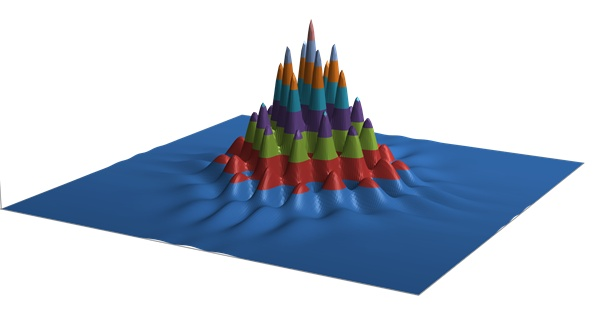

[量子纠缠和超光速通讯？！]()

第二次更新：后半部分关于干涉消失的论述，发现计算有一点错误。现在换一种计算方式更正，并以动图的形式放上来。

更新：有人提量子卫星和我国的量子通信研究。请不要把它们和超光速通讯混为一谈。它们的目的是加密而不是什么超光速。有此误解者请自行寻找科普。

=============

**原文如下：**

**“The interference still exists, it's just not THERE”**

**“干涉条纹仍然存在，只是它不在那儿”**

**– Zurek**

在前面，我们讲到了薛定谔大神所提到的，“量子力学的终极特性”- 量子纠缠。量子纠缠所表现出来的，是一种颠覆了人们物理常识的一种性质：非定域性。也就是说，相互纠缠的两个粒子，无论相隔多远 --  哪怕是在宇宙的两端 – 当一个粒子发生变化时，会瞬间跨过千山万水，立即对另外一个粒子产生影响[[1\]](https://zhuanlan.zhihu.com/write#_ftn1)。由于双方发生的变化是“绝对”同时的，你甚至不能说是哪一个先发生了变化而引起了另一个的变化 - 因为在相对论看来，不同的人会对它们“先后”顺序有着不同的看法。因而可以说，量子纠缠的非定域性，其实不是一个粒子对另一个粒子的瞬时影响（因为我们根本就无法**定义**到底是谁对谁产生了影响！），而是指两个粒子的**共有状态**在空间中不断扩展，直至分布到无限远，因而这个共有状态的变化，也会同时涉及到空间中无限远的范围。

爱因斯坦对量子纠缠感到了极大的不安，因为这意味着人们在某个地方的一举一动，都可以瞬间影响到整个宇宙。而相对论断言，任何物质、能量、因果关系、或信息的传递是不可能超过光速的。这就是为何他坚定地认为量子力学是**不完备**的。然而贝尔定理的确立，却结结实实地怼了他一脸：定域性的隐变量理论是不存在的。遗憾的是，贝尔不等式的提出以及后来的验证，都是在爱因斯坦死后发生的，我们无法想象如果他活着，对此会有何感想 – 谁知道他会不会找到一些蛛丝马迹的破绽，从而开辟人们更加深刻的视野呢？有人说：

> “我不知道爱因斯坦会对贝尔定理发表些什么看法，但是我知道，他一定会说一些非常聪明的言论。”

前面我们看到，粒子间的“同步”变化，在量子力学框架中，是**完全随机**的，因而，通过两个远距离相互纠缠的粒子之间的同步变化，所能传递的，仅仅是一些随机的信号，一些“噪音”。我们无法从中获得任何有用的信息。因此，虽然说我们可以做到两个粒子的远距离同步，但是却无法打破光速来传递信息。从这一点看来，量子纠缠其实并不违背相对论。

但是，这只是我们第一眼看到的直观的判断。既然粒子可以超远距离同步，那么可不可能经过某些“精巧”的设计，让我们真的实现超光速通讯呢？有不少人做过很多非常聪明的设计，看上去似乎毫无破绽。但是，如果我们真的去做一下实验，却发现无一不是失败的[[2\]](https://zhuanlan.zhihu.com/write#_ftn2)。后来，人们从量子力学的基本原理经过严格推导，证明了一个所谓的“无通讯定理”（no communication theorem），正式宣判了试图利用量子非定域性进行瞬时通讯的死刑：

> “The no-communication theorem thus says shared entanglement alone cannot be used to transmit any information. ”
> “无通讯定理于是宣布，仅通过量子纠缠无法传递任何信息”

这里我来举一个例子，看看试图利用量子纠缠来进行超光速的信息传递是如何被禁止的。

我们要利用双缝干涉来进行这种通讯的努力。你已经知道，双缝干涉是一个什么样的实验，如下图所示：  

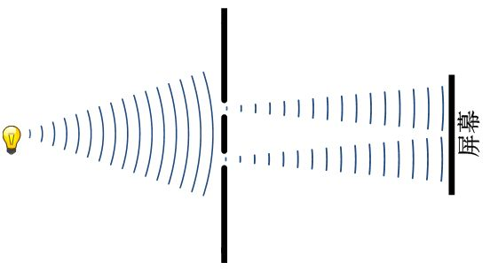

一个光源照射到一个双缝装置上，当缝的宽度足够小的时候，透过双缝的两道光会在背后的屏幕上产生明暗相间的条纹。这就是光的双缝干涉现象。关于干涉，我们前面已经比较详细地提到过，这里不再细细重复。但是有一个与经典现象非常不同的是，光的“哪一条缝”信息（**which-path information**）和干涉条纹之间存在一种“互不相容”的现象。当我们试图观察光子是从哪一条缝中通过的时候，干涉条纹就消失了。例如说，我们在其中的一条缝背后放上一个光子探测器，用来探测光子是否从该条缝中通过的时候，不论光子是否经过这条缝，背后的干涉条纹都会神奇地消失掉！而当我们不去试图搞清楚光子从哪条缝中通过的时候，干涉条纹又会神奇地出现了！这就是着玻尔所称之为“**互补原理**”的、光的“粒子性”和“波动性”之间的不相容性。

现在我们在双缝干涉实验上做一个简单的改动。我们在每一条缝的背后都放置一个能够产生一对纠缠光子的装置 –  姑且叫做“纠缠光子对发生器”。实际上，它可以通过一种神奇的晶体来实现。这种晶体叫做SPDC，当光子撞击到它时，会被它吸收掉，同时又产生两个互相纠缠的光子，每个光子的能量都是被毁掉的光子的一半。现在，我们把这一对光子的其中一个（图中用蓝色表示）让它仍然射向原来的屏幕（屏幕1），然后我们布置另外一个屏幕（屏幕2），让另一个光子（图中用橙色表示）射向这个屏幕。这样一来，我们有两个屏幕，每个屏幕都从双缝的光源中接受到照射。

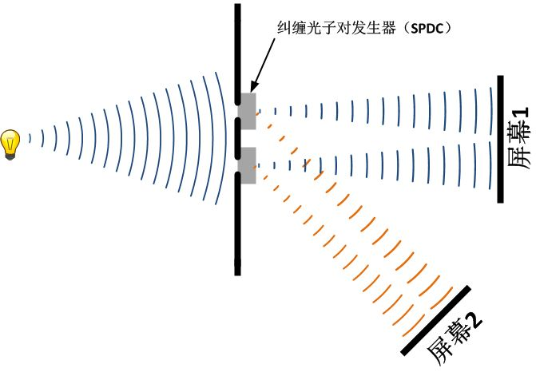

如果我们可以把两个缝中的橙色光子分别引入不同的探测器，来观察它的来源。比如说，如果我们发现一个橙色光子来源于上缝，那我们必然知道，相对应的那个蓝色光子也是来源于上缝。用这种方式，我们就可以知道射向屏幕1的每个光子都来自哪一条缝隙。这样一来，我们知道了“which path  information”，必然会毁掉屏幕1上的干涉条纹。但是，现在我们并不打算这么做。我们来干这样一件事：我们把橙色光子打到屏幕2上，因而我们根本无法判断一个过来的一个光子到底是来自上缝还是下缝。因而，理论上，我们并没有获得任何的关于路径的信息，因而也就不会破坏干涉。

既然干涉没有被破坏，那么，我们自然而然会这样想：屏幕1和屏幕2上面会各自出现干涉条纹。而同时，由于到达两个屏幕上的每一对光子都是互相纠缠的，因而他们互相关联，那么形成的干涉条纹也会互相关联。如果一个屏幕上的条纹发生变化，那么在同时，另一个屏幕上的条纹也会发生变化。

理论上，我们可以把这两个屏幕的距离移动至任意远。比如说，Bob和Alice想要观测木星上的某个现象，那么Bob就携带其中的一块屏幕到木星上，而Alice则和另一块留在地球上。他们事先约定好，如果这个现象发生了，Bob就会在木星上对他那边的光子来自哪一条缝隙进行观测，从而把他那面屏幕上的干涉条纹破坏掉。由于两边一直保持纠缠，在Bob做这件事的同时，地球上的条纹也消失了。于是，Alice根据她这边条纹的变化，就立刻知道，火星上的现象发生了。

而木星到地球的距离，大约是地球到太阳距离的5倍。也就是说，光从木星到地球需要大约半个小时的时间。而通过这种干涉装置，我们就把这半个小时给跨过去了！

**我们实现了超光速通讯？！**

你当然猜到事情不会那么简单，是吗？但是，究竟是哪儿出了问题呢？听我细细道来。

首先，是的，这种办法确实无法实现超光速通讯。原因很简单，无论你如何调整实验的设置，想尽一切办法不去“泄露”光子的路径信息，在两个屏幕上，你绝对看不到任何的干涉条纹！它们永远都是两个“正常”的光斑。这样一来，我们下一步所计划的，通过破坏一个屏幕上的干涉条纹来破坏另一个屏幕上的干涉条纹、进而实现信息传递的做法，也就没有意义了。

这样就显得颇为诡异了。当然，在量子力学中，比这个诡异的事情多得是，你应该已经习惯了不去大惊小怪了。但是，你可能还会问，为何我们看不到干涉条纹？整个过程中，我们没有任何办法知道光子的路径信息啊？为何干涉就消失了呢？

对此，一个比较常见的解释是：由于处于纠缠的两个光子可以瞬间发生相互影响，因而，打到任何一个屏幕上的光子，就有一部分“主动”到达这个屏幕上的，它们会形成干涉，还有一部分，是由于它的另外一个伙伴先“主动”到达了对面的屏幕，因而影响了它，从而使得它“被动”地坍缩到了屏幕的某个位置。“主动”和“被动”的光子互相之间重叠，因而干涉消失了。

但是，这个答案是有问题的。因为我们前面提到过，量子纠缠并不是一个粒子瞬间对另一个发生影响，而是它们的共有状态跨越了一个广域的距离，从而同步变化。真正的答案，必须求诸量子力学的基本原理 - 薛定谔方程。经过一个计算，我们会发现：**干涉仍然存在，只不过你无法看到而已**。

下面我来具体分析一下，**干涉到底藏在哪儿？**

要知道，我们现在面临的，是一个由两个子系统构成的**复合系统**。我们已经提到过，对于一个复合系统（也就是说，包括了多个子系统的系统），我们用于描述它的希尔伯特空间是各个子空间的张量积：

![[公式]](https://www.zhihu.com/equation?tex=%5Cmathscr%7BH%7D%3D%5Cmathscr%7BH%7D_1+%5Cotimes+%5Cmathscr%7BH%7D_2+%5Cotimes+...+%5Cotimes+%5Cmathscr%7BH%7D_n) 

这个公式写在这里，你可能还根本就看不懂，没有关系，你可以忽略它。我会用简单的语言来解释它的。我把这个你看不懂的公式写在这里，是因为它包含了量子纠缠、乃至后面要讲到的、退相干理论的最重要的基础。

我们知道，量子态所描述的，是当我们观察一个粒子的时候，得到的各种结果的概率。比如说，一个粒子的某种性质（假如说，位置），在观察时可能出现2种结果，x1和x2。这个粒子的量子态，就要包含这两种结果的概率的信息，p1和p2。这是一个两维的系统。那么，如果我们同时考虑两个粒子呢？比如第二个粒子，它的两种结果为y1和y2。那么对于这两个粒子的复合系统，它的量子态就包含了两个粒子所有可能的组合，包括：

![[公式]](https://www.zhihu.com/equation?tex=%5Cleft%5C%7B+x_1+y_1+%2Cx_1+y_2+%2C+x_2+y_1+%2Cx_2+y_2%5Cright%5C%7D) 

一共有四种可能性，这是一个四维系统。那么如果再加上一个粒子，它的两种结果可能是z1和z2，这个三粒子的组合系统就包含了8种可能性的组合：

![[公式]](https://www.zhihu.com/equation?tex=%5Cleft%5C%7B+x_1+y_1+z_1+%2Cx_1+y_2+z_1+%2C+x_2+y_1+z_1+%2Cx_2+y_2+z_2+%2C+x_1+y_1+z_2+%2Cx_1+y_2+z_2+%2C+x_2+y_1+z_2+%2Cx_2+y_2+z_2+%5Cright%5C%7D) 

以此类推，如果有n个粒子，每个粒子的自由度为m，那么这个n粒子系统的量子态所在的希尔伯特空间的维度就是：

![[公式]](https://www.zhihu.com/equation?tex=dim%5Cleft%28+%5Cmathscr%7BH%7D+%5Cright%29+%3D+n%5Em) 

你可以看到，随着系统的增大，它的维度会以指数的速度迅速扩张，趋向于无穷大。这是**希尔伯特空间臭名昭著的一个特性**。

现在我们回到我们的问题。我们有两块屏幕，对每一块屏幕，我们为了记录条纹的位置，都在上面添加刻度。我们分别以屏幕的中心为0，向右为正方向，向左为负方向。我们把第一块屏幕的位置记做x，第二块屏幕的位置记做y。这时，我们可以用这样一种方式来描述一个粒子对。它其中之一打在屏幕1上面的位置x，而另一个打在屏幕2上面的位置y，这样的事件发生的概率为：

![[公式]](https://www.zhihu.com/equation?tex=P%5Cleft%28+x%2Cy+%5Cright%29) 

比如说，P（0,0）的意思是指，一对纠缠光子对，同时击中两个屏幕正中心的概率。而P（0,1）的意思是，“一个粒子击中第一块屏幕中心，而同时另一个粒子击中第二块屏幕位置坐标为1”这样的概率。也就是说，一个事件发生的概率是x和y的二元函数。我们可以把x和y当做两根坐标轴，这两个坐标轴就可以确立一个平面空间，这个平面空间就是我们前面提到的经典意义上的“**相空间**”。相空间中的任意一点，都对应着（x,y）坐标对，也就是代表了“光子对中的一个击中第一个屏幕x位置，同时另一个击中第二个屏幕y位置”这样的事件。这个平面空间的所有点，就囊括了所有可能的事件。

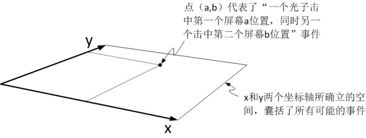

那么，对应着每一个事件，都有一个发生的概率。我们在第三维度上把这个概率值[[3\]](https://zhuanlan.zhihu.com/write#_ftn3)表示出来。这个概率可以根据量子力学原理计算出来。我们把计算结果[[4\]](https://zhuanlan.zhihu.com/write#_ftn4)画出来，它看起来是这样的（图中的不同颜色是为了标注等高线）：

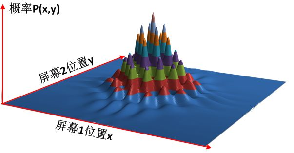

我们可以看到，这张图好像是一丛漂亮的山峰。那么，我们如何来看这些山峰呢？首先，我们知道，“地面”的每一个位置都代表了一个事件，那么，这个位置上所坐落的“山峰”，就是这个事件所发生的概率。而所有这些“山峰”的高度就代表了所有可能发生的事件的概率大小。例如，最高的一座山峰位于正中心，也就是x=0，y=0的位置。意思是说，光子有最高的几率同时击中两个屏幕的中心位置。而相应地，每个“山谷”就代表了一个低概率的事件。而在x和y都偏离中心的位置，就是一片平地，高度约等于零。也就是说，光子同时击中两个屏幕偏离中心的概率几乎为零。

我们从正上方来俯视这个由x和y构成的相空间，它看起来就是这样的： 

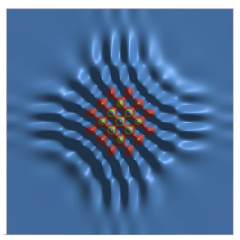

非常漂亮的干涉花纹！干涉确实是存在的，它存在于相空间中，完美奥耶！

但是你知道，相空间是一个抽象空间，而不是我们实际看到的空间。一个“存在于相空间”的干涉条纹，在实际空间中 – 即在Bob和Alice的两块屏幕上 – 又意味着什么呢？

比如说，现在Alice只想关心那些击中她的屏幕正中间（y=0）的那些光子。对这些光子而言，它的另一个伙伴会击中Bob屏幕上的哪一个位置呢？很简单，根据上面的计算结果，我们只要令y=0，那么P(x,0)表示的就是另一个光子在Bob屏幕上x位置出现的概率。我们可以把这个概率和它对应的位置关系的曲线画出来。我们知道，曲线上的波峰和波谷意味着概率的大小不同也就是它们对应着这一个位置光斑的亮度。

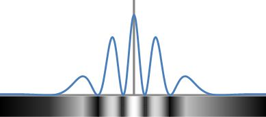

以此类推，如果Alice关心的不是她屏幕正中间，而是任意另外一个位置y1、y2、……，那么集中该处的光子相对应的另一个光子出现在Bob屏幕上x位置的概率就是P(x,y1)、P(x,y2)、……。如下图所示：

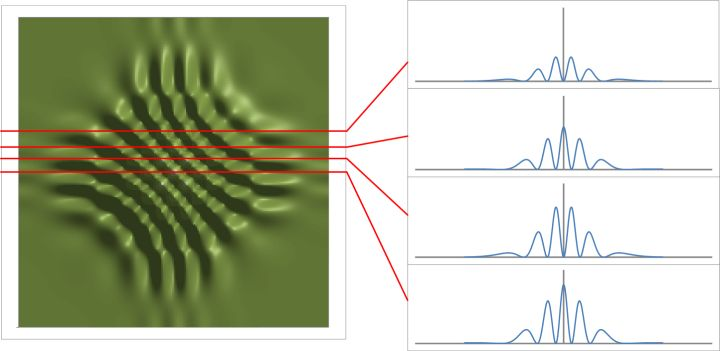

对Alice屏幕上的每一个位置，击中该位置的光子的另一个同伴，击中Bob屏幕上位置x的概率，都可以用这种曲线表示出来。那么所有这些曲线就是这样的：

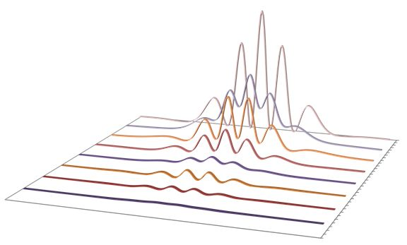

这些相应的曲线，它们波峰和波谷的位置都互相不同。我们知道，波峰和波谷意味着概率的大小不同。而在Bob屏幕上显示的亮斑的形状，是所有光子的总和，而不会仅仅是对应于Alice屏幕上某个特定位置的光子的总和。因此，Bob看到的亮斑，将会是所有对应于Alice屏幕不同位置的亮斑的叠加：

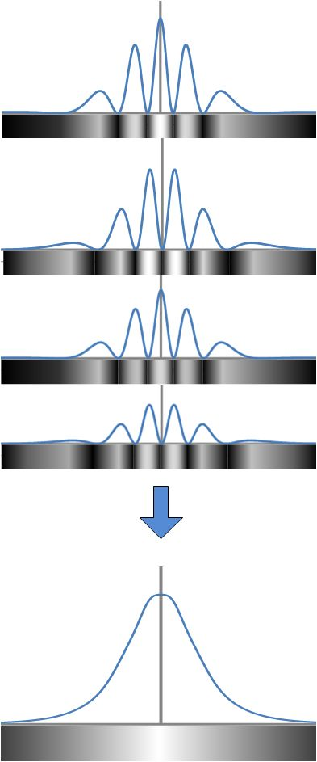

由于所有这些对应于Alice不同位置的不同的条纹，它们的波峰和波谷（也就是亮纹和暗纹）的位置各不相同。因而，所有这些条纹叠加起来，最终就形成了一个完全没有干涉条纹的亮斑 – 它看起来跟经典粒子的分布一模一样。

我们可以更加形象地来理解这个事情：我们知道，在（x,y）所组成的相空间中，存在着干涉条纹。但是这个相空间是两块屏幕位置的组合（张量积）所定义的。而我们实际观察的时候，却只能看到独立的屏幕1和独立的屏幕2，而不会看到“编织在一起”的两块屏幕。也就是说，当我们在观察一块屏幕的时候，那么所有的概率分布就必须全部“投影到”我们所观察的那块屏幕上，叠加在一起，使得干涉条纹完全消失不见了。

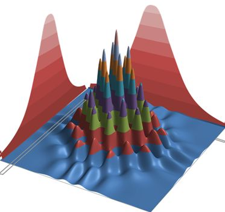

事实上，当我们观察一块屏幕时，我们忽略了关于另一块屏幕的全部信息，因为我们完全没有办法不忽略。量子力学中的信息，两个光子总是**纠缠在一起，无法分割的**，而我们的观察，却总是把两个光子当初各自独立的粒子来看待。只有当Alice和Bob真正地坐在一起，两个人把打在各自屏幕上的光子一一对比：“当这个光子出现在这儿的时候，另一个光子出现在哪儿？”，他们才有可能一起把干涉条纹还原出来。而像我们常规的想法：“我只关心我屏幕上的光子”，那只能丢失掉所有的干涉信息 – 因为你**把另一个纠缠的信息抛弃掉了**！

而实际情况是，Alice和Bob两人一个在地球，另一个在木星，两个人必须借助经典的通讯工具才能讨论他们各自的光子之间的关系。这个在实际过程中，可以用一种叫做“coincidence  counting”（可以译作“一致性计数”？）的办法。也就是说，我们用一个电路把两块屏连起来。我们知道光速，所以就知道两个光子分别到达它们的屏幕的时间之间差多少。在我们这里，我们假设地球和木星之间差刚好半个小时。那么，这个电路记录下两个屏幕上每个光子到达的时间。当一个光子到达屏幕1的时间和另一个到达屏幕2的时间刚刚好差半小时的时候，我们知道，这两个光子是一对儿。

通过coincidence counting的办法，我们可以判断出所有的光子对以及它们实际击中屏幕的位置，这样我们才可以把实际的干涉条纹画出来。但是这样一来，我们不可避免地**至少**需要半个小时的时间（也就是两地光子到达的时间差）才能完成。也就是说，**我们判断干涉条纹所需要的时间，最快是光速传递所需要的时间**！

所以说，**任何试图利用量子纠缠传递有用的信息的努力，理论上最快也只能达到光速**。因为我们必须在知道了构成纠缠的一对粒子各自状态之后，才有可能形成有用的信息传递。

我下面进一步给你展现一些处于纠缠的两个光子之间的一些神奇的事情。

现在，我们把屏幕2不断地向着双缝的位置靠近。我们知道，当我们考得越近，射向它的两列橙色的波之间的重叠就会越小。最极端的情况，当我们把屏幕2紧挨着双缝时，橙色的光子刚刚发出就立刻被屏幕“侦测”到，而不会有任何干涉的余地 --  也就是说，双缝中出来的橙色波完全分离了。我们会在屏幕2上面看到两条互不交汇的光斑。那么，通过观察橙色的光子击中哪一条光斑，我们就可以判断它来自哪一条缝隙，进而知道，击中屏幕1的它的那个同伴来源于哪一条缝隙：我们获得了“which path information”，因而把干涉破坏掉。

下面这个动画就展示了这个过程，当我们的屏幕2距离双缝大约和双缝之间的间距离相等时，我们开始观察到两个光斑的分离。随着它们的分离，我们可以看到，相空间中的干涉条纹逐渐变弱，直至消失：

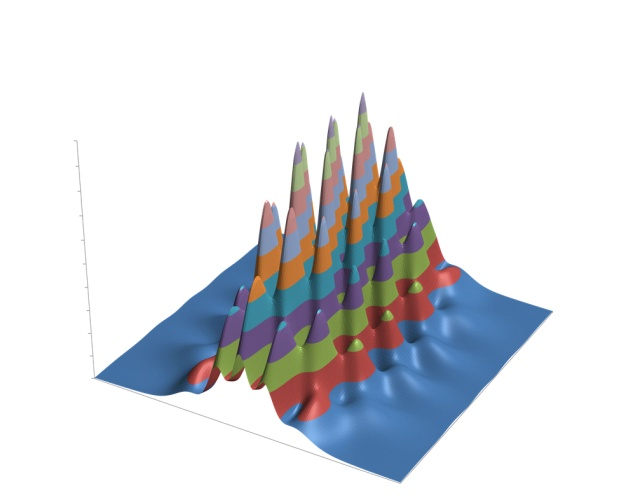

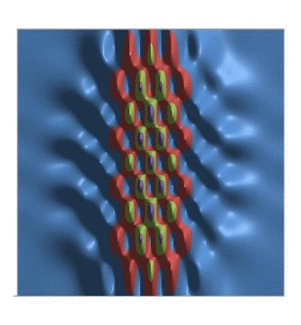

到最后，当屏幕2非常靠近双缝的时候（距离为双缝之间的距离的10%左右，计算中双缝的间距为1mm，也就是说，当屏幕2距离双缝只有0.1mm的时候），我们可以看到，这时候，橙色的光波已经几乎没有重叠了，因而也就没有干涉了（用希尔伯特空间中的术语来说，就是两个缝隙所代表的状态相互之间正交了）。这时，在整个相空间，我们发现屏幕1和屏幕2之间共有的干涉条纹也随之消失了！

但是，我们必须注意一点，在相空间的干涉条纹发生如此巨大的变化的整个过程，如果我们只看屏幕1，它的光斑没有发生任何变化，就好像干涉从来就没有存在过一样。同理如果我们只观察屏幕2，我们也只会看到，屏幕上的光斑随着靠近缝隙，渐渐地分开，成了两个分离的光斑，一条条纹也不会出现，就也好像干涉从来就没发生过一样。也就是说，**不管相空间中的干涉存在还是消失，在单块屏幕上都不会留下任何干涉的痕迹。**

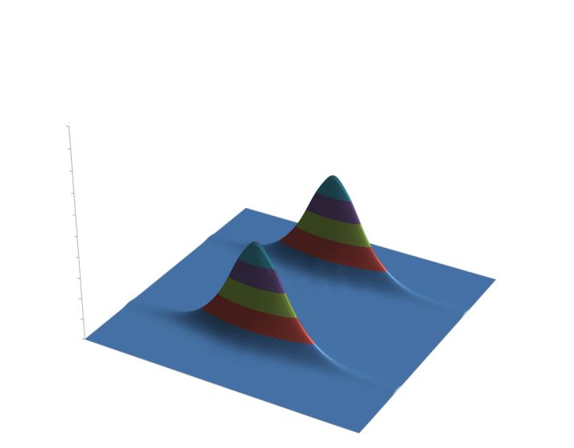

干涉的消失意味着什么？根据我们前面关于双缝干涉的讨论，我们立刻就知道，这意味着“**波函数坍缩**”！但是请注意，在我们前面整个讨论过程中，我们从来就没有在任何地方使用过“波函数坍缩”的假设。也就是说，波函数坍缩自然而然地从量子力学的规则中“**涌现”（emerge）**出来了。量子力学中神秘的“波函数坍缩”难道可以徇着这个思路，得以解决了吗？

终于，在爱因斯坦去世将近半个世界之后，“退相干”登上了历史舞台。

------

[[1\]](https://zhuanlan.zhihu.com/write#_ftnref1)  其实“非定域性”有着更加令人困惑的地方，那就是粒子性质失去了独立性。一个粒子必须放到一个系统的整体中才可以描述，而单个粒子的量子态失去了意义。这使得量子纠缠完全找不到经典世界的对应，哪怕是一个类比都不可能 –  在经典世界中，任何一个粒子，无论与外界相互影响有多么剧烈，我们总是可以谈论它“自己”的状态的，而量子世界里却不能。这一点，使得量子力学彻底地与经典力学割裂开来。在薛大神首先意识到这种非独立性之后，整整40多年，它又一次被重新审视，并且直接导致了退相干理论的诞生。这是后话，本章先略过不提。

[[2\]](https://zhuanlan.zhihu.com/write#_ftnref2) 这一点，在物理学中有着非常类似的故事：永动机。在工业革命的初期，人们试图建造一台不耗费任何能源就可以源源不断地对外做功的机器，却从未成功。后来人们提出了**能量守恒定律**，人们认识到不可能存在一个不耗能又不断输出能量的机器。于是人们有转而试图从环境中不断抽取能量，以环境温度降低为代价对外做功，但是也从未成功，后来人们提出了**热力学第二定律，**人们又认识到，不可能从环境中无代价地抽取能量。翻开历史文献，我们会发现，有非常多的极尽精巧的机械设计，试图把永动机变成现实。其中有一些，哪怕是物理学大师都很难看出破绽。但是，当你真的把它造出来，它却永远做不到“永动”。因为总有某一个细节中，隐藏了一个很深的、但是致命的破绽。直至今日，仍有一些人在**徒劳地**努力着。但是能量守恒和热力学第二定律像两座大山，横亘在面前，无情地粉碎了人们不劳而获的贪念。

如今，“**光速不变原理**”也横亘在我们面前，不断粉碎着人们瞬时通讯的梦想。

[[3\]](https://zhuanlan.zhihu.com/write#_ftnref3) 事实上，是“概率密度”的值，这里不做区分。

[[4\]](https://zhuanlan.zhihu.com/write#_ftnref4) 这是我自己做的一个小计算，经过了若干假设，例如，远场条件假设，单色光假设，不考虑SPDC产生的相位变化，等等。简化虽多，但是原则上是一样的。