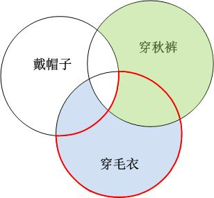

[未竟稿之三：实在性、定域性、以及自由意志](https://zhuanlan.zhihu.com/p/30050315)

***“Anybody who’s not bothered by Bell’s theorem has to have rocks in his head.”\***

***“谁要是不为贝尔定理感到困扰，他脑子里一定是进水了。”\***

***–Pais\***

前面我们看了EPR佯谬以及粒子间“幽灵般的远距离作用”，并且提到，事实上我们有办法对两种说法进行实验判定。现在我们来看看到底是怎么判定的、结果如何。在我继续往下讲之前，我想先请你思考一个问题：

天气转凉，你们学校的同学们纷纷选择穿起毛衣、秋裤、或戴起帽子。当然，有的人只选择了其一，有的人选择两种（比如同时穿起毛衣和秋裤），而有的人三者都选。这时，你对你们的同学进行了一个人数统计，你发现，穿毛衣但是没穿秋裤的人数有m人，穿秋裤但是没戴帽子的有n人，穿毛衣但是没戴帽子的有k人。那么，m、m、k之间有什么关系？或者再具体一点，m+n和k哪一个数字更大？想明白这一个问题，后面的问题就会变得非常简单。

好了，我们继续。现在我们有两种说法：

\1. “经典观”：爱因斯坦说，两个盒子里的手套分别有明确状态，不是左手就是右手，只不过我们不知道，直到观察才能知道。当我们知道了一只手套的状态时，我们立刻就知道了另外一只手套的状态。

\2. “量子观”：两个盒子里的手套没有确定状态，都是左手和右手的叠加态，直到观察其中一只，它才能获得一个状态。在它获得一个确定的状态后，另一只手套同时获得了另外一个状态，然后我们同时知道两只手套的状态。

我们现在需要设计一个实验，让事实说话，来看看哪一种说法才是正确的。但这是如何可能的？乍看上去，这两种说法的区别仅仅在于说法而已，它们的核心区别，指向的是“尚未观察时”的状态，以及观察时发生了什么。然而，在尚未获得观察结果的时候，粒子发生了了什么，在实证中是不可能加以判定的。只有在我们观察它之后，我们才知道它是否正确。但是一旦我们观察了，我们得到的结果就必然是一样的：它们必然是相反的。

我们需要这样一种实验，让这两种说法的区别能够体现在它们所导致的不同的**观测结果**上。那么，我们就需要问，“这如何可能？”

要知道，我们所纠结的，在于两个事件之间的相关性，以及发生这种相关性的机理。当我们谈到相关性的时候，我们必须要明白，有两种不同的情况。

1. 两个事件之间存在着相互影响，因而导致一个事件的发生取决于另外一个事件。
2. 两个事件之间不存在互相影响，但是它们的发生都同时决定于同样的一个第三者事件，因而两个事件如何发生都是由这个第三者事件决定的。这样这两个事件之间也会表现出相互关联。

比如说，你和我各自都在自己的房间里待着，这时，妈妈在厨房里喊了一声“开饭了”，于是我们两个同时从自己的房间走出，然后一起到达餐厅。这就属于第二类的相关性。而如果妈妈只是告诉我开饭了，然后我敲你的门，喊你一起吃饭，我们一起到达餐厅，这就是第一类的相关性。

我们说，“经典观”的说法，两个粒子属于第二类相关性，而“量子观”则是这两种相关性的混合。

按照“经典观”，两个粒子在诞生之后，就各有相互**独立**的状态[[1\]](https://zhuanlan.zhihu.com/write#_ftn1)。当两个粒子远远地分开后，A的任何事件，都不会立刻影响到B[[2\]](https://zhuanlan.zhihu.com/write#_ftn2)。A和B两者在被观察时的行为必然都是相互独立的，两个粒子之间的相关性由它们诞生的事件决定的，而与后续一切事件无关。因而无论我们对A做了什么，B的行为都不会受到影响。

而按照“量子观”，两个粒子在诞生后就共同处在一种纠缠的叠加态，相互不独立。其中任何不管哪一个发生了任何一个事件，必然会同时影响到两个。所以对两者的**观察行为**本身就不再是独立的事件，而是**互相影响**的。在这里，如果我们先观察了A，由于不同的观察行为会产生不同的影响，因而B的观察结果会根据先前A采取了什么样观察行为而相应地表现出不同的结果。

这就好像说，在我们前面开饭的例子里，当妈妈喊我们吃饭，我们一起走到餐厅，这两个相关事件就像是经典观中发生的情况：相关但没有相互影响。如果我们在走出房间时，我在中途发现你还没洗手，然后让你先去卫生间洗手，那么，我们之间的相关性就同时包括了第一类和第二类两种情况。由于我们之间存在的相互影响，我们行为的相关性也就发生了变化，我们不再同时到达餐厅了：这样一来，我们就发生了**观测可辨**的不同结果[[3\]](https://zhuanlan.zhihu.com/write#_ftn3)。

按照这种逻辑，我们就可以设计我们的实验，来判断经典观和量子观之间的区别。现在我们对两个粒子做**不同**的观察，那么按照经典观，两种观察行为都是独立的，因而不论A经历了何种观察，都不会干扰B的观察结果，A和B的相关性都是严格地由诞生事件来决定；而按照量子观，AB之间一直存在着相互影响，所以A所经历的不同观察行为，会以不同的方式干扰B的观察结果，因而B的观察结果会因为A采取了不同的观察行为而有所不同[[4\]](https://zhuanlan.zhihu.com/write#_ftn4)，从而AB的观察结果的相关性就不仅仅取决于它们的诞生事件，而且还取决于我们采取了什么样不同的观测组合。

比如说，对于一对纠缠粒子A和B，我们准备了3种不同的观测实验手段（分别记做实验a、实验b、实验c），每个实验都会产生两种结果，“通过”和“不通过”。然后我们用一个发射器，发射一对互相纠缠的粒子。我们的发射器可以设计成这样：它所发射的一对纠缠粒子，用同一种测试手段，必然会产生相同的实验结果（互相**正关联**）。比如说，两边分别用实验a（同理实验b和c）对A和B进行测试，它们要么同时通过，要么同时不通过，而不会发生一个通过而另一个不通过的情况。现在我们不停地产生很多对相互纠缠的粒子，一一发给Alice和Bob，然后他们每次都各自做随机地从这三种实验手段中取其一来对收到的粒子进行测试。那么我们看看，他们的实验结果会是如何。

按照经典观，每一对粒子都各自有着“隐变量”，当它们在诞生的时候，它们的状态就已经被这些隐变量唯一确定了。而不论这些隐变量遵从何种规则、它们又是如何确定一个粒子的状态的，粒子的状态都是不依赖于观察者而唯一确定的。而对于一个有着某种确定状态的粒子，进行3种测试的任何一种，必然会产生某一种确定的结果。比如说，对于一对确定的A和B，它们可能会同时通过实验a，而不通过b和c；而对于另一对确定的A和B，它们可能会同时通过实验b，而不通过a和c。那么，对于任意一对未知状态的粒子，一旦发射出来，由于它们互相独立，那么对任意一种测试，它们都会产生某一个确定的结果，只不过我们在测试之前不知道是哪一种而已。这3个测试结果一共有几种不同的可能性呢？要知道，每一种实验都有通过和不通过两种可能，那么三种实验，一共就会有2×2×2=8种可能，我们很容易列表把所有的可能都列出来：

不论是这两个粒子有什么样的状态，它们的测试结果必然是以上的8种之一，而不可能超出这个范围。

那么，我们开始不停地给Alice和Bob发射一对对的纠缠粒子，然后他们各自随机地从3种实验手段中任选其一来对收到的粒子进行测试。有时候他们碰巧选择了相同的测试手段，那么他们必然获得相同的测试结果：要么都通过，要么都不通过。当他们碰巧选择了不同的测试手段呢？就会有各种不同的测试组合和相应的测试结果。比如说，我们观察这三种情况

1、一边a的实验通过，而另一边b的实验不通过，我们记做 ![[公式]](https://www.zhihu.com/equation?tex=a%5Cbar%7Bb%7D) 

2、一边b的实验通过，而另一边c的实验不通过，我们记做 ![[公式]](https://www.zhihu.com/equation?tex=b%5Cbar%7Bc%7D) 

3、一边a的实验通过，而另一边c的实验不通过，我们记做 ![[公式]](https://www.zhihu.com/equation?tex=a%5Cbar%7Bc%7D) 

我们把这几种情况全部列表出来：

根据上表，我们可以看到，在3、4两种可能性的情况下，会出现a过b不过的结果，在2、6两种可能性下，会出现b过c不过的结果，而在2、4两种可能性下，会出现a过c不过的结果。我们很容易发现，不论我们的纠缠粒子对是以何种状态发射出来，如果得到了 ![[公式]](https://www.zhihu.com/equation?tex=a%5Cbar%7Bc%7D) 的结果，那么这对粒子对其他的测试组合，必然会得到要么 ![[公式]](https://www.zhihu.com/equation?tex=a%5Cbar%7Bb%7D) 、要么 ![[公式]](https://www.zhihu.com/equation?tex=b%5Cbar%7Bc%7D) 。而反之则不成立。也就是说不论粒子按照哪一种状态发射，大量实验结果下来，我们得到a过b不过的频率P（ ![[公式]](https://www.zhihu.com/equation?tex=a%5Cbar%7Bb%7D) ）、b过c不过的频率P（ ![[公式]](https://www.zhihu.com/equation?tex=b%5Cbar%7Bc%7D) ）、a过c不过的频率P（ ![[公式]](https://www.zhihu.com/equation?tex=a%5Cbar%7Bc%7D) ）之间，必然有如下关系：

![[公式]](https://www.zhihu.com/equation?tex=P%5Cleft%28+a%5Cbar%7Bb%7D+%5Cright%29%2BP%5Cleft%28+b%5Cbar%7Bc%7D+%5Cright%29%5Cgeq+P%5Cleft%28+a%5Cbar%7Bc%7D+%5Cright%29) 

这里，如果我们发射的粒子只有2、4两种情况，上面的不等式就变为等式，否则，它就是不等式。

我们回到本章开头的那个毛衣、秋裤和帽子的问题，现在我来揭晓答案：

![[公式]](https://www.zhihu.com/equation?tex=%5Cleft%5C%7B+%E7%A9%BF%E6%AF%9B%E8%A1%A3%E4%B8%8D%E7%A9%BF%E7%A7%8B%E8%A3%A4%E7%9A%84%E4%BA%BA+%5Cright%5C%7D%3D%5Cleft%5C%7B+%E7%A9%BF%E6%AF%9B%E8%A1%A3%E4%B8%8D%E7%A9%BF%E7%A7%8B%E8%A3%A4%E5%8F%88%E4%B8%8D%E6%88%B4%E5%B8%BD%E5%AD%90%E7%9A%84%E4%BA%BA+%5Cright%5C%7D%2B%5Cleft%5C%7B+%E7%A9%BF%E6%AF%9B%E8%A1%A3%E4%B8%8D%E7%A9%BF%E7%A7%8B%E8%A3%A4%E5%8F%88%E6%88%B4%E5%B8%BD%E5%AD%90%E7%9A%84%E4%BA%BA+%5Cright%5C%7D%3Dm) 

![[公式]](https://www.zhihu.com/equation?tex=%5Cleft%5C%7B+%E7%A9%BF%E7%A7%8B%E8%A3%A4%E4%B8%8D%E6%88%B4%E5%B8%BD%E5%AD%90%E7%9A%84%E4%BA%BA+%5Cright%5C%7D%3D%5Cleft%5C%7B+%E7%A9%BF%E7%A7%8B%E8%A3%A4%E4%B8%8D%E6%88%B4%E5%B8%BD%E5%AD%90%E5%8F%88%E4%B8%8D%E7%A9%BF%E6%AF%9B%E8%A1%A3%E7%9A%84%E4%BA%BA+%5Cright%5C%7D%2B%5Cleft%5C%7B+%E7%A9%BF%E7%A7%8B%E8%A3%A4%E4%B8%8D%E6%88%B4%E5%B8%BD%E5%AD%90%E5%8F%88%E7%A9%BF%E6%AF%9B%E8%A1%A3%E7%9A%84%E4%BA%BA+%5Cright%5C%7D%3Dn) 

那么，

![[公式]](https://www.zhihu.com/equation?tex=m%2Bn%3D%5Cleft%5C%7B+%E7%A9%BF%E6%AF%9B%E8%A1%A3%E4%B8%8D%E7%A9%BF%E7%A7%8B%E8%A3%A4%E5%8F%88%E4%B8%8D%E6%88%B4%E5%B8%BD%E5%AD%90%E7%9A%84%E4%BA%BA+%5Cright%5C%7D%2B%5Cleft%5C%7B+%E7%A9%BF%E6%AF%9B%E8%A1%A3%E4%B8%8D%E7%A9%BF%E7%A7%8B%E8%A3%A4%E5%8F%88%E6%88%B4%E5%B8%BD%E5%AD%90%E7%9A%84%E4%BA%BA+%5Cright%5C%7D%5C%5C+%2B%5Cleft%5C%7B+%E7%A9%BF%E7%A7%8B%E8%A3%A4%E4%B8%8D%E6%88%B4%E5%B8%BD%E5%AD%90%E5%8F%88%E4%B8%8D%E7%A9%BF%E6%AF%9B%E8%A1%A3%E7%9A%84%E4%BA%BA+%5Cright%5C%7D%2B%5Cleft%5C%7B+%E7%A9%BF%E7%A7%8B%E8%A3%A4%E4%B8%8D%E6%88%B4%E5%B8%BD%E5%AD%90%E5%8F%88%E7%A9%BF%E6%AF%9B%E8%A1%A3%E7%9A%84%E4%BA%BA+%5Cright%5C%7D) 

而我们知道，

![[公式]](https://www.zhihu.com/equation?tex=%5Cleft%5C%7B+%E7%A9%BF%E6%AF%9B%E8%A1%A3%E4%B8%8D%E7%A9%BF%E7%A7%8B%E8%A3%A4%E5%8F%88%E4%B8%8D%E6%88%B4%E5%B8%BD%E5%AD%90%E7%9A%84%E4%BA%BA+%5Cright%5C%7D%7B%7D%2B%5Cleft%5C%7B+%E7%A9%BF%E7%A7%8B%E8%A3%A4%E4%B8%8D%E6%88%B4%E5%B8%BD%E5%AD%90%E5%8F%88%E7%A9%BF%E6%AF%9B%E8%A1%A3%E6%89%80%E7%9A%84%E4%BA%BA+%5Cright%5C%7D%3D%5Cleft%5C%7B%E7%A9%BF%E6%AF%9B%E8%A1%A3%E4%B8%8D%E6%88%B4%E5%B8%BD%E5%AD%90%E7%9A%84%E4%BA%BA%5Cright%5C%7D%3Dk+) 

所以

![[公式]](https://www.zhihu.com/equation?tex=m%2Bn%3Dk%2B%5Cleft%5C%7B%E7%A9%BF%E6%AF%9B%E8%A1%A3%E4%B8%8D%E7%A9%BF%E7%A7%8B%E8%A3%A4%E5%8F%88%E6%88%B4%E5%B8%BD%E5%AD%90%E7%9A%84%E4%BA%BA%5Cright%5C%7D%2B%5Cleft%5C%7B%E7%A9%BF%E7%A7%8B%E8%A3%A4%E4%B8%8D%E6%88%B4%E5%B8%BD%E5%AD%90%E5%8F%88%E4%B8%8D%E7%A9%BF%E6%AF%9B%E8%A1%A3%E7%9A%84%E4%BA%BA%5Cright%5C%7D) 

所以，m、n、k之间的关系是：

![[公式]](https://www.zhihu.com/equation?tex=m%2Bn%5Cgeq+k+) 

如果我们用图形表示这个关系，就是这样的：

我们用三个圆圈分别表示穿毛衣、穿秋裤、戴帽子的人群，圆圈的重叠之处就是两者（或三者）都选择的人。上图中绿色的部分表示的就是穿秋裤不戴帽子的，蓝色的部分就是穿毛衣不穿秋裤的，而用红线框出来的部分则是穿毛衣不戴帽子的。我们就很明显地看到这个关系了。

这，就是**贝尔不等式**的一个变种。

贝尔不等式，顾名思义，它是由一个叫做贝尔的人最早提出的。他的全名叫做约翰.贝尔。他本人一直是隐变量理论的支持者，因此，他相信，我们做实验得到的结果，必然会满足这个不等式。

贝尔不等式的逻辑非常简单，我们不需要任何高等的数学知识就可以大概理解。但是它所揭示的思想，却不可谓不深刻。要知道，我们事先并没有限制某一种**特定的**隐变量理论，这里只有一个预设前提：定域性，即相隔足够远两个事件之间不存在瞬时的相互影响，因而两个事件是独立的。也就是说：

**任何一种可能的**定域隐变量理论都满足贝尔不等式。

这句话说的直观一点，可以这样解释：任何一种描述粒子运动的理论，不论这种理论具体是什么样子，只要它有这样两个特征：

1. 这个理论认为，不论我们观察不观察粒子、如何观察粒子，它都有一个确定的状态；（**实在性**）
2. 这个理论认为，两个粒子之间的相互影响不是瞬时的，而是以一定速度传递的。（**定域性**）

那么，它必然满足贝尔不等式。

而反观量子力学，则会有不同，因为它没有上述的两个前提。第一、在你没有测试的时候，它们都处于“通过”和“不通过”的叠加态（而不存在确定的状态）；第二、a、b、c三种测试互相间是瞬时影响的，但是当你测试一个粒子的a的时候，会立刻改变另一个粒子的b和c的测试结果，就好像你在观察一个同学“有没有戴帽子”的时候，这种观察却改变了他“有没有穿秋裤”的状态！所以量子力学会出现不同的实验结果。

贝尔不等式的影响也是极其深远的。它提出了一个**实证**的方法，从而彻底终结了人们关于量子力学“本质”的争论，使得人们终于可以通过事实来判断：我们世界的存在，到底是不是像人们传统认知那样，是一种“**客观**的”、“**独立**的”，还是像量子力学中那种颠覆性的认知，是**依赖**于我们的观察、**瞬间**影响整个宇宙的？

现在我们来看看，具体地，某一个定域隐变量理论和量子力学会有何种不同的结论。我们仍然用上一章中的两个纠缠粒子的自旋状态作为例子。

这里，和前面的例子不同之处在于，Alice和Bob不再选择**同一个方向**上对自旋进行测量，而是各自有三个不同的方向，他们可以**自由地**从中择其一，在这个方向上来进行测量。我们把这三个方向组成一个测量的坐标系如下：

我们把这三个方向分别叫做X、Y、Z。这三个方向之间相互夹角都是120º。同时，Bob和Alice的坐标系正好翻转180度，因而Bob的X方向与Alice的X方向正好相反，YZ两个方向亦然（选择相反的坐标系，只是为了表述更方便一点。因而粒子的自旋是反相关的，我们用相反的坐标系，就可以用正相关来描述）。这样一来，当他们同时选择在X方向上进行自旋测量时，它们得到的结果就是完全相同的（同时向上或同时向下），YZ亦然。现在，我们不停地把纠缠粒子对发给Bob和Alice，他们分别随机选择某一个方向来观察自旋，分别得到的结果必然是“向上”或“向下”两者之一。我们来看看两个人得到结果有多少是相同的，又有多少是相反的。

按照经典观，一对粒子在发射出去后，分别具有确定的状态，具体是什么状态我们暂时不知道，我们所能知道的，是它们在相同的方向上测量的结果必然是相同的。而在不同的方向上测量，则可能会不同。总而言之，这一对粒子在两端分别测试的时候，不外乎会得到8种不同的可能结果（每一类确定的状态对应一种结果）。列表如下：

而Alice和Bob每次都会从三个方向中各自选取一个进行测量，这种测量组合就会有3×3=9种可能，具体说，如果Alice测量了X方向，而Bob测量了Y方向，我们记做XY。那么这9种组合分别是：XX、XY、XZ、YX、YY、YZ、ZX、ZY、ZZ。因而对应着上面8种粒子的可能状态，我们可以预见到，每一种状态在这9种测量组合中结果是相同还是相反：

我们可以看到，第1种和第8种两种情况，它们得到的结果总是相同的。而其余的各种情况，在我们随机变换观测组合的时候，它们总是有4/9的可能性得到相反的结果，而5/9的可能性得到相同的结果（你可以在上表中数一数）。这一点非常容易理解：不论哪一种可能的情况，它们必须要保证在同一个方向测量时得到相同的结果，而在不同方向测量时就是随机的结果，因此，得到相同结果的概率肯定会高一些。

比如说，处于某种未知原因（可能是发射器本身的机理造成的，或者是其他什么原因），发出的粒子对只有2~7的几种可能，那么，Alice和Bob得到相同结果的概率就是5/9。但是如果发射器发射出的粒子还包括1或8两种可能，那么他们得到相同结果的概率就一定会大于5/9。因而我们可以下结论：无论是我们的纠缠粒子对是如何发给Alice和Bob的，它们测量得到相同结果的可能性总是会大于或等于5/9，而不会小于5/9。

那么，我们再来看看量子力学是怎么预言这些观测结果的。这时，一开始两个粒子不会是这8中状态的任何一种，而是它们的**叠加态**。这时，比如说，Alice测量了X方向。这个测量会导致A的量子态坍缩到一个确定的状态，上旋或上旋。假设说Alice得到了一个上旋的结果，那么A粒子就会坍缩到X方向的上旋状态，而此时B粒子就立刻坍缩到相反的自旋方向，在Bob的坐标系中，也是一个上旋状态。

但是，这时Bob选择不测量X方向上的自旋，而是测量Y方向上的自旋，那它会得到什么结果呢？

现在Bob手中的粒子B，我们已经知道，它有一个X方向上的上旋的量子态，而X方向上的自旋，同时也是Y方向上的上旋和下旋两种状态的叠加。如果此时在Y方向上进行测量，我们就会使B的自旋量子态坍缩到Y的上旋或下旋：

那么，它在Y方向上会坍缩到上旋呢？还是下旋？我们从图上直观看，它此时的状态更加“偏向”Y的负方向（与正方向夹角120°，与负方向夹角60°），即下旋方向，因此它坍缩到Y的下旋概率更高，而坍缩到上旋的概率会低一些。量子力学的计算可以告诉我们[[5\]](https://zhuanlan.zhihu.com/write#_ftn5)，我们得到下旋的概率是3/4，而得到上旋的概率是1/4[[6\]](https://zhuanlan.zhihu.com/write#_ftn6)。

也就是说，当我们对这对纠缠粒子用XY这种测量组合进行测量时，得到相同结果的概率是1/4，得到相反结果的概率是3/4。同理，我们可以得知，任何一种测量，只要是不在同一个方向上进行的，都是这种结果：两边相同的概率是1/4，相反的概率是3/4。

而我们可以看到，上面9种不同的测量组合中，有3种是在同一方向上（XX、YY、ZZ）的，而6种是在不同方向上的（XY、XZ、YX、YZ、ZX、ZY）。因为同一方向上测量总是得到相同的结果（结果相同的概率为1），而不同方向上测量得到相同结果的概率为1/4，因此，当我们随机进行测量时，总的说得到相同结果的概率是

![[公式]](https://www.zhihu.com/equation?tex=%5Cfrac%7B3%7D%7B9%7D%5Ctimes+1%2B%5Cfrac%7B6%7D%7B9%7D%5Ctimes%5Cfrac%7B1%7D%7B4%7D%3D%5Cfrac%7B1%7D%7B2%7D) 

也就是说，量子力学预言，我们最终得到相同结果的概率是1/2。而前面所说，按照隐变量理论，无论是哪一种情况，我们得到相同结果的概率应该都不会小于5/9！

我们看到，量子力学的预言和隐变量的预言是不同的，我们可以通过实验测试来判定，到底是哪一个才对。

实验物理学家们先后做过几次实验[[7\]](https://zhuanlan.zhihu.com/write#_ftn7)，这些实验的过程我就略过不提了。结论非常明确：实验结果**不满足**贝尔不等式，与量子力学的预测完全一致，而与隐变量理论预测不相符。这就宣告了定域隐变量理论的破产，也就是说，定域隐变量理论中的两个前提：

1、粒子具有确定的状态（实在性）

2、粒子的相互作用是需要时间传递的（定域性）

这两者不可能同时正确。否则的话贝尔不等式应该是成立的。根据贝尔不等式以及它的实验验证结果，人们总结道：

***定域性隐变量理论是不存在的。\***

这就是**贝尔定理**。

这个结论无疑是令人震惊的：要么，这个世界不是“实在”的，我们必须放弃**实在论**；要么，它不是定域的，我们必须放弃**因果论[[8\]](https://zhuanlan.zhihu.com/write#_ftn8)**！它对我们的整个世界观产出了最为颠覆性的冲击，而它的逻辑却又极其简洁明确。因此，很多人对贝尔不等式发出了极尽夸张的感叹：

> ***“Some physicists are convinced that [Bell’s theorem] is the most important  single work, perhaps, in the history of  physics.”（一些科学家已经信服，可能在整个科学史上，贝尔定理都是最重要的成果） - Zukav\***

> ***“Bell’s theorem is the most profound discovery of science.”（贝尔定理是最具深远意义的科学发现） - Stapp\***

> ***“Anybody who’s not bothered by Bell’s theorem has to have rocks in his head.” （谁要是不为贝尔定理感到困扰，他脑子里一定是进水了） - Pais\***

实在论和定域性，这两者都是我们思维中极其根深蒂固的概念，无论我们放弃哪一个都将是一个十分不爽的选择。但是，与**实证**的原则相比，无论是实在论还是定域性都要让路。一个无论是多么美妙、多么逻辑合理的理论，只要是不符合事实，就必须被放弃掉。贝尔本人是一个隐变量理论的支持者。因此他宁愿舍弃定域性，而支持实在论，他的选择是玻姆力学 – 一种非定域的隐变量理论。但是现在绝大多数科学家们都已经完全放弃掉所有的隐变量理论了。

但是，我们再回来仔细观察贝尔不等式的前提：实在性和定域性。但是事实上它有一个更加隐含的前提。当我们谈及**定域性**的时候，我们实际上指的是两边的观察行为的**独立性**。因而，贝尔不等式的打破，实质上否定的不是定域性和实在性，而是独立性和实在性。

我们回到本章一开始提到的两类相关性的讨论。相互关联有两种情况，要么它们相互影响，要么它们有同一个起因。对独立性的否认，说明要么它们存在瞬时的相互影响，要么它们有着共同的起因。

我来举一个例子。比如说，雷电。当一个雷电发生时，我们会看到闪电，同时听到雷声。那么雷声和闪电之间相互影响吗？显然不是的。那它们是相互独立的事件吗？当然也不是。它们是相关的，因为它们起源于同一个原因：云层放电。我们说，闪电和雷声是相互关联的，但是相互不影响的事件。

贝尔定理告诉我们，Alice和Bob的观测行为（包括何时观测、何种方式观测等）之间不是独立事件。那么它们是否可能本身并没有违背定域性，而存在其他可能的关联性？其实是有的。我们回到我们第一部分拉普拉斯之妖讨论的话题：**决定论**。如果说两个人的一切行为都是由一个决定论的宇宙定律决定的呢？那么他们对粒子的观测行为分别都是事先注定的，而不是由他们自己“**自由**”决定的。这个宇宙本来就已经决定了，他们分别在这个特定的时刻，要对这个特定的粒子，做出一个特定方向上的观测！这是两个相关的但是互不影响的两个观测行为。粒子B也不必在瞬间“知道”粒子A做出了何种观察，并且瞬间“感受到”这种观测的影响，事实上，对于这种超级决定论而言，早在A的观测行为发生之前，B就已经“知道”要知道A将要发生何种观测行为了。因而这里根本就没有瞬时影响，只有同步行动，如此而已。

因而，如果Alice和Bob存在这种相关性，那么我们不必要求他们之间有瞬时影响，他们的观测结果也会是相关的。也就是说，这样们就可以同时保留实在性和定域性。

可是，为了同时保留实在性和定域性，我们所要付出的代价似乎也不轻。因为我们必须要舍弃**自由意志**。Alice和Bob两个可怜的家伙只是宇宙的两个提线木偶，而丝毫没有任何自主的能力来做出一个何时观测、如何观察的决定。这意味着**超级决定论**：不仅仅宇宙中的各个粒子都是事先注定的，而且每个人的思想和主观决定也是事先注定的！我们在研究量子纠缠的过程中所表现出的兴趣和好奇，都是假的。事实上，就在几年前，两位物理学家John Conway和Simon Kochen发表了一个非常有趣的“自由意志定理”，里面证明了，在满足两个似乎显而易见的条件下，**如果实验者是自由的，那么粒子对实验的响应也是“自由”的**。从某种意义上将，粒子和作为实验者的我们具有同等的“自由意志”！

因此，一个不那么为人所知、为人所接受的扩展版本的贝尔定理可以这样说：

***定域性、实在性、自由意志三者不可得兼。\***

对此，贝尔本人说道：

> *“There is a way to escape the inference of superluminal speeds and spooky  action at a distance. But it involves absolute determinism in the  universe, the complete absence of free will. Suppose the world is  super-deterministic…… our behavior, including our belief that we are  free to choose to do one experiment rather than another, absolutely  predetermined, including the 'decision' by the experimenter to carry out one set of measurements rather than another, the difficulty disappears. There is no need for a faster-than-light signal to tell particle A what measurement has been carried out on particle B, because the universe,  including particle A, already 'knows' what that measurement, and its  outcome, will be.”*
> *“有一种方式可以避免超光速影响和远距离的幽灵作用。但是这种方式假定了**绝对的**决定论，以及自由意志的**完全**丧失。如果假设这个世界是超级决定论的……我们所坚信的，我们可以自由选择来做这个实验而不是另一个实验，这些都是绝对事先注定的。包括实验者从若干测试方法中选择其一的‘自主决定’也是如此。这样一来，我们面临的困难就消失了，**根本就不需要超光速的影响，来‘通知’粒子A到底粒子B发生了什么，因为整个宇宙，包括粒子A，事先就已经‘知道’B将要发生了什么了。**”*

好了，不知道你发现没，我们绕了一大圈，现在回到了第一部分“[拉普拉斯之妖](https://zhuanlan.zhihu.com/p/28522532?group_id=901611664988860416)“的起点。在量子力学已经展现出如此明显的非决定论行为的情况下，我们仍然无法摆脱决定论的阴影。那么到现在为止，在第一部分中关于决定论的整个讨论已经基本上可以有一个结论了（我们还有最后几步，在后面讨论完退相干和多世界之后，你会发现，决定论是一件多么令人迷惑的事情啊！）：

***决定论是一个无法实证的哲学问题，取决于你是否相信。\***

和自由意志相比，你觉得实在性和定域性更值得保留吗？

------

*[[1\]](https://zhuanlan.zhihu.com/write#_ftnref1)  这里的“独立”，和两个粒子状态的相关性是不同的意思。显然，这两个粒子的状态是相关的（互相相反），它们的相关性是在产生它们的事件中决定的。但是我们说它们是独立的，意思是指两个粒子一旦产生，就各自不受对方影响，它们后面的状态变化是独立的，不会再对另外一个粒子产生影响。*

*[[2\]](https://zhuanlan.zhihu.com/write#_ftnref2) 严格说，A和B之间可以存在各种相互影响，但是这种影响的传播速度是有限的，当它们距离足够远，那么我们在测量的时候，它们的的作用就需要很长的时间才能被对方“感受”到，因而实际上不存在影响。*

*[[3\]](https://zhuanlan.zhihu.com/write#_ftnref3)前面我们问，“这如何可能？”我们遇到了“可分辨性”的困难。当我们对A和B采取相同的观察行为时（比如说上一章中，对两个粒子在同一个方向上观察自旋，就是相同的观察行为），两次观察导致的是相同的本征态，它们会获得共同的确定状态：当A被观察后，B就获得了完全确定的状态。这样一来，观察行为产生的一对确定状态（第二类相关性），恰恰和它们诞生事件（第一类相关性）的效应完全一致，因而无法分辨。*

*[[4\]](https://zhuanlan.zhihu.com/write#_ftnref4)  这里的不同，会在AB两者本别观察一对不对易量的时候表现出来：比如说观察A的某个力学量a，然后观察B的某个与a不对易的力学量b。如果我们先观察A的力学量a，A的观察导致双方同时坍缩至a的一个本征态，而a的本征态却意味着完全不确定的b。此时我们再观察B的b时，其相关性就完全变了。*

*[[5\]](https://zhuanlan.zhihu.com/write#_ftnref5) 这个计算会牵扯到量子力学中关于自旋的具体规则，你可以暂时不用细究。*

*[[6\]](https://zhuanlan.zhihu.com/write#_ftnref6) 这里其实是量子观和经典观在实证层面的最显著差别：如果Alice没有事先观测过A的X方向自旋，那么Bob观测B的Y方向自旋就会是不同的结果：上旋和下旋概率各为1/2。但是由于Alice的观测，瞬时影响了B的量子态，因而Bob的观测结果就受到影响。*

*[[7\]](https://zhuanlan.zhihu.com/write#_ftnref7) 应该指出的是，做这样的实验并不简单。如何制造一对纠缠粒子并且保持它们的纠缠状态不被破坏直至观测，这是一件要求很高的事情。同时如何保证实验过程中不存在任何的漏洞也并不简单，这就是为何经历了好几次实验，人们才逐渐相信实验结论的有效性。*

*[[8\]](https://zhuanlan.zhihu.com/write#_ftnref8)我们知道，量子力学中的非定域影响并不能传递任何信息，因而它并不违背相对论，也不违背因果律。但是非定域的实在论却可以实实在在产生了瞬时的信息传递，因为一个有效的隐变量理论是应该能够描述粒子的确定状态的，由于两个粒子间的瞬时影响，可以通过粒子的状态变化，进行信息传递。这种信息的瞬时传递在相对论中就可以导致结果先于原因发生、穿越到过去阻止自己出生的荒谬情况。*

发布于 2017-10-12

