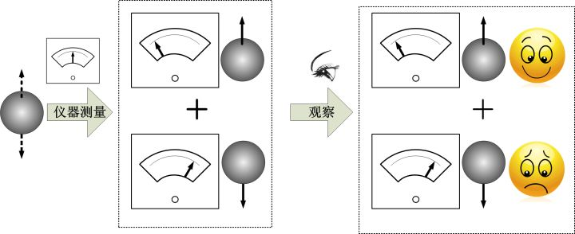
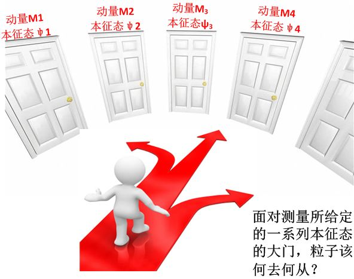
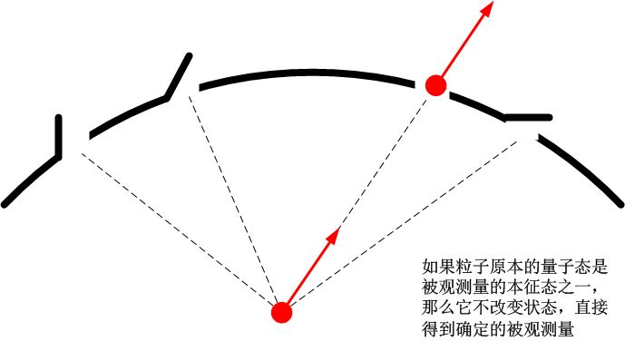
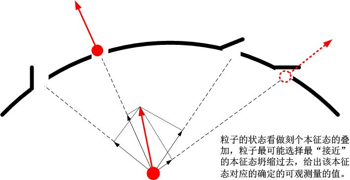
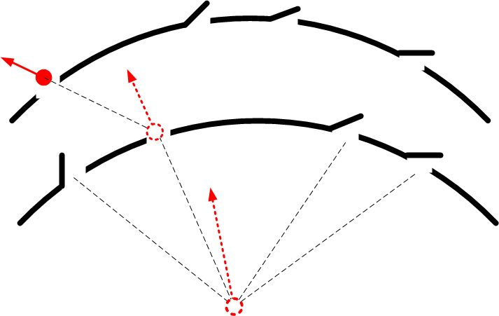
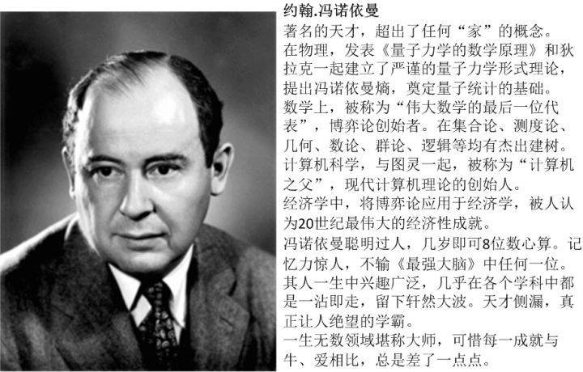
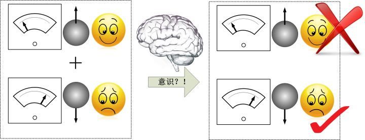

[还是未竟稿：冯诺依曼的观察链条](https://zhuanlan.zhihu.com/p/30717501)

“I would like to make a confession which may seem immoral: I do not believe in Hilbert space anymore”

**“我要坦白一个很不道德的想法：我不再信任希尔伯特空间了”**

**–** **冯诺依曼**

现在，我们可以来初步看看，传说中神秘的量子“**测量问题**”，到底意味着什么。

我们回顾前面第一部分，[18、量子：确定性和不确定性](https://zhuanlan.zhihu.com/p/28589770)，中提到，量子力学中的绝大多数违反常识的来源，基本上都来自于冯诺依曼所定义的与测量直接相关的第一类演化。

所谓测量，顾名思义就是我们用某一种技术手段[[1\]](https://zhuanlan.zhihu.com/p/30717501/edit#_ftn1)来获取关于一个系统状态的信息的过程。而量子力学中，关于“状态”的定义却非常违反直观。我们不妨来回顾一下，量子力学中与状态有关的神秘事件。

1、 在量子力学中，一个粒子的状态是由它的量子态唯一确定的。量子态包含了关于这个粒子运动状态的**一切**信息。量子态的一种具体表现形式就是波函数。

2、 我们无法直接观察量子态，而只能观察“可观测量”。量子态代表着粒子的运动状态，而“可观测量”则是当我们观察这个粒子的时候，我们能够**实际**得到什么结果，比如说粒子的位置具体在哪儿，它的动量具体是多少等。量子态代表着关于可观测量的这样一种概率：当我们观察一个粒子的时候，我们得到它的某一个可观测量（位置、动量等）的**确定数值**是多少，出现这个数值的**概率**是多少。比如说，当我们观察一个粒子的自旋状态时，我们可能得到两种结果，上旋和下旋，它的量子态会告诉我们，出现这两种结果的概率各是多少。

3、 量子态有一种非常怪异的行为，就是它可以**叠加**。**任何**一个量子态，都可以看做是其他若干量子态相互叠加的结果。比如说，粒子的自旋，当我们不观察它的时候，它处于一种“上旋”和“下旋”的叠加状态，这是一种**已知状态**，而不是处于“非此即彼”的未知状态；再比如说，双缝干涉中，光子经过的路径，其量子态就是“经过左边缝”和“经过右边缝”的叠加态。而可观测量，则总是确定的。我们永远不会真的看到一个“既在这儿又在那儿”的粒子，也不会看到一个“同时经过两条缝隙”的光子，更不会看到一只“既死又活”的猫。

4、 量子态不但可以叠加，而且会出现干涉的现象。

5、 对于任何一种可观测量，都存在这样一组对应的量子态：这组量子态中的任意其一，当我们观察其所表示的粒子时，我们永远都会得到100%确定的结果。这一组量子态叫做这个可观测量的“**本征态**”。而非本征态一般不会给出确定的结果，而是给出概率性的结果。

6、 任何一个可观测量都是一个**算符**。算符的含义就是，当我们观察这个粒子的某一个可观测量时，我们就是在用这个算符作用于这个粒子。因而不可避免地导致粒子的量子态发生变化。它变成什么呢？变成了某一个本征态。

而当我们观察一个粒子的时候，非常奇怪的事情发生了。首先，根据我们想要观察的可观测量不同，我们事实上选择了一组“本征态”，然后把一个量子态看做是这些本征态的叠加。在我们观察的瞬间，我们迫使这个粒子从构成它的诸多叠加态中随机地选择其中一个本征态，而扔掉其余所有的状态，变成了一种确定的状态，这就是所谓的“坍缩”。这个过程是在所谓“玻恩规则”支配下的完全随机的过程。当我们完成观察以后，粒子就会呆在它所坍缩到的状态上。

而它原本的“叠加态”本来是可以按照任意的方式来叠加的，比如说我们可以用一组位置本征态、也可以用一组动量本征态，甚至可以用一组随便的，不是任何本征态的量子态来叠加构成。那么在观察过程中，它会从那一组叠加态中选取它要坍缩过去的状态呢？事实上，粒子有着不完全“自由”的选择。首先，它不能随便选择某一个状态，而只能从我们想要观察的**可观测量的一组本征态**中选择。比如说，我们观察动量的时候，实际上就限制了这个粒子，让它只能在一组动量本征态中选择它的归宿；其次，当我这组限定好的本征态确定以后，它就可以按照玻恩规则从中自由选取了。也就是说，我们的观察使得量子态发生了一个随机的突变，让它从一个叠加态变成了某一组确定的本征态的其中之一。

我这里将用一个非常直观的类比，来向你说明量子测量究竟发生了什么事情，让它如此神秘？

我们现在假想Alice就是这样一个被测量的微观粒子。她本来具有一个确定的量子态Ψ。这个量子态可以看做是其他不同的量子态的叠加：

![[公式]](https://www.zhihu.com/equation?tex=%5Cmathinner%7B%7C%5CPsi%5Crangle%7D%3D%5Cmathinner%7B%7C%5Cphi_1%5Crangle%7D%2B%5Cmathinner%7B%7C%5Cphi_2%5Crangle%7D%2B%5Cmathinner%7B%7C%5Cphi_3%5Crangle%7D%2B...%3D%5Cmathinner%7B%7C%5Cvarphi_1%5Crangle%7D%2B%5Cmathinner%7B%7C%5Cvarphi_2%5Crangle%7D%2B%5Cmathinner%7B%7C%5Cvarphi_3%5Crangle%7D%2B...) 

也就是说，此时，她自由地遨游在不同的位置、不同的能量、不同的动量等的叠加的海洋中,无拘无束。这时候，我们对她进行一次观察。在我们观察的瞬间，Alice的面前突然神奇地出现了一堵墙，墙上有很多扇门。这些门的位置是我们根据我们要观察的可观测量来确定的。比如说，我们想要观察她的动量是多少。这时候，Alice看到的这些门，每扇门上面都写着“动量M1，本征态ψ1”、“动量M2，本征态ψ2”……，它们只允许标示上的量子态穿过，而不允许其他任何量子态通行。这些门可以是有限个，也有可能是无限个，取决于我们的系统究竟是怎么样的。

如果她此时的量子态和其中一扇门所代表的量子态恰恰完全一样，那么一切都不是问题，她会毫无滞涩地直接通过这扇门，不会发生任何其他影响[[2\]](https://zhuanlan.zhihu.com/p/30717501/edit#_ftn2)。但是，如果她发现所有的这些门允许穿过的量子态都和自己不同呢？

面对这一系列的门，Alice将何去何从？

要知道，Alice的量子态包含了各种不同动量本征态的叠加，也就是说，她可以把自己“分解成”一系列不同的量子态，每个量子态都可以穿过其中一扇门。按照“常识”，既然构成她的每一个叠加量，都可以通过相应的门，她可以“同时”穿过所有的这些门。

但是，Alice似乎知道我们正在观察她，如果她“同时”通过这些门，作为观察者的我们就会看到，Alice同时有很多个动量。Alice不打算让我们陷入这种神经错乱，她决定把自己的量子态变成其中一扇门所要求的那样，然后通过这扇门。Alice必须选择她将进入哪一扇门，她进入某一扇门就意味着她的量子态将会变成门上标示的本征态，而选择了这个本征态，就意味着她不再是各种动量的叠加，而是有了确定的一个动量。例如，如果她选择第二扇门，那么她将会把自己的量子态变为ψ2，同时具备了一个确定的动量M2。那么这时，我们的观察结果也就是Alice的动量为M2。

虽然为了我们能够获得一个确定的观察结果，Alice已经决定作出一些牺牲，改变自己，但是作为一个微观粒子，她总是希望自己的量子态不会被这个选择改变太多。所以，在绝大多数情况下，Alice更愿意选择那一扇和自己现在的状态更加接近的一扇门。怎么算和自己状态接近呢？她这时需要把自己的量子态看做是各扇门代表的量子态的叠加，叠加的权重越高，就越接近。或者说，她的量子态与门上代表的量子态之间的“夹角”越小，就越接近。但是，Alice的情绪经常性地处于起伏不定的状态，她有时候也会毫无征兆地选择那些和自己状态偏差很远的门。

因此，在作为观察者的我们看来，Alice的行为就很随机，但是完全可以用概率来预测。

当我们完成了一次观察，Alice此时就有了一个全新的量子态：它动量的一个本征态，记做ψ。如果此时我们再进行一次同样的观察（观察动量），她将面临这又一次同样的选择。但是这次她已经处于动量的一个本征态了，因而她就没有任何选择的苦恼：她直接进入那个本征态的大门就可以了。但是，如果我们第二次观察时不在乎她的动量，我们想观察其他的她的位置，由于位置的本征态和动量的本征态完全不同，那么此时她它将面临着一系列完全不同的大门，这些大门是位置的一系列本征态，记做φ：

![[公式]](https://www.zhihu.com/equation?tex=%5Cmathinner%7B%7C%5CPsi%5Crangle%7D%3D%5Cmathinner%7B%7C%5Cvarphi_1%5Crangle%7D%2B%5Cmathinner%7B%7C%5Cvarphi_2%5Crangle%7D%2B%5Cmathinner%7B%7C%5Cvarphi_3%5Crangle%7D%2B...) 

那么她将重新进行选择，选择一扇大门进入。此时她的量子态将变为一个位置的本征态。这两次选择之间就有了不确定性：这就是不确定原理的起源。

我们由此可以看到，量子测量和我们日常所熟知的经典测量非常不一样。经典测量中，粒子的状态是确定的，我们测量过程只是真实地记录了它的状态，而不是拿着一套本征态让它去选择。也就是说，经典测量就是一道问答题，物体只需要对测量做出它的真实回答就可以了。而在量子测量做的是一道选择题。测量过程给它了一系列选项，它从中选取一个，并且必须要选取一个。我们给粒子的选项，取决于我们想要知道哪一个可观测量。

这就是我们前面讲到的，两类量子演化中的R过程：

***过程I（R过程）：是由观察行为所引发的，在观察的瞬间发生的随机的，不连续的突变，即“波函数坍缩”；***

现在，这个奇异的R过程，就成为令科学家们头痛不已的一件事情。因为在这里，量子态似乎是有我们的观察所造就的。粒子似乎有着一种全知的本事，它可以预知我们要在何时进行观察。因此它就跟我们玩起了躲猫猫的游戏：当我们不观察的时候，它自由地遨游在一大片叠加态当中，而在我们观察的瞬间，它会迅速地选取某一个确定的状态展示给我们看，而把它叠加态的“本来面目”掩盖起来。并且，它还可以预知我们想要观察的是什么，当我们观察动量时，它只会选取动量本征态，当我们观察位置时，它只会选取位置本征态，如此这般。

这与爱因斯坦所坚信的，**独立**于人们的观察之外的客观实在，严重地冲突了。而这就是我们前面提到的，

***“当你不看月亮的时候，它还在吗？”\***

这句话的由来。

以玻尔为代表的“哥本哈根”学派，对此有着著名的诠释 –  哥本哈根诠释。其实，所谓的哥本哈根诠释这个说法，本身是很模糊的。因为，它不是一个诠释，而是包含了一系列不同的诠释。这些诠释主要来自玻尔、海森堡、以及玻恩。而他们各自的论点有互相有所不同，但是主旨相似。虽然后来它成为量子力学的“主流”诠释，其实人们很难清楚地说明白哥本哈根诠释具体是如何。

但是，总而言之，哥本哈根对测量问题的一般观点（主要源自玻尔），是与爱因斯坦完全相反的，

首先，它拒绝一切隐变量，它认为波函数对粒子的描述就是完备的，一个粒子本身的全部信息都包含在波函数中了，波函数之外不存在我们未知的其他性质，因而，在没有观察一个粒子时，讨论它“确定的状态”毫无意义。而在观察时粒子所表现出来的随机行为，是因为自然界本身就是随机的。

其次，它提出所谓的“互补原理”。粒子的行为表现为粒子性和波动性的互补性，它在需要表现为波动的时候（态叠加、干涉）表现为波，需要表现为粒子的时候（离散性）表现为粒子，但是不会同时既表现为波又表现为粒子。和“互补原理”相对应的，它还提出“对应原理”，意思是，当微观尺度逐渐放大，渐渐变为宏观的时候，量子力学也就渐渐接近于经典力学。

然后，它还认为，**测量行为本身必然是一个经典行为[[3\]](https://zhuanlan.zhihu.com/p/30717501/edit#_ftn3)**。测量就是用经典的仪器去观察微观的粒子，得到的结果必然要用经典语言来描述。而经典世界中，我们只能看到确定的状态。因而，位于叠加态的粒子必须要“通过”那些确定状态的大门。于是一切从量子到经典的变化就发生在波函数坍缩的那一刻。

另外，我们似乎不能把哥本哈根诠释和我们常说的“正统（orthodox）”量子力学完全混为一谈。所谓的“正统”量子力学其实不是一个**诠释**，而是一个严谨的**物理理论**。它最终浓缩于狄拉克所提出的六大公设当中。对于测量过程，它仅仅从实证的角度出发，说当我们观察粒子的时候，我们会在多大概率得到什么结果。它并不试图去解释测量过程背后意味着什么，也不会直接提出波函数坍缩的概念。这个类似于我们前面提到的“闭嘴计算”的态度。

哥本哈根诠释在玻尔的领导下，挺住了爱因斯坦的重重攻击，最终成为量子力学“主流”的诠释[[4\]](https://zhuanlan.zhihu.com/p/30717501/edit#_ftn4)。但是，它在看似成功的背后，有着非常严重的缺陷。

首先，它并没有清楚地定义什么是“观察”[[5\]](https://zhuanlan.zhihu.com/p/30717501/edit#_ftn5)。作为量子演化中如此重要的一个概念，采取这样模糊的看法是说不过去的。

其次，它并没有说明“坍缩”的机制。因为观察必须是一个连续的事件，它需要一段时间才能完成，那么坍缩是什么时候发生的？它是瞬间发生，还是渐进发生的？如果是前者，在一个连续的观察行为中，哪一个时刻如此重要触发了波函数的坍缩？如果是后者，那么坍缩的过程又是怎样的？

最重要的，它假定观察是经典的，而被观察的系统是量子的。那么量子和经典之间的边界是什么？如果说经典世界限定了我们只能看到确定的状态，那么经典世界为何有这种限定？微观世界的种种奇特现象，例如叠加态、干涉等，为何从来就不会在宏观世界被观察到？我们为何总是看到一个有确定位置的物体、一个死的或者活的猫，而不会看到一个既在这儿又在那儿的物体，一个既死又活的猫？从宏观到微观，难道必须要服从两套截然不同的定律吗？如果一定要服从不同的定律，那么它们各自的范围又是什么？

说到底，这不仅仅是“测量问题”字面上看起来那么简单。它涉及的更深层问题，是“**量子到经典过渡**”的问题。也就是说，量子和经典两个领域之间的冲突，如何解决？

后来，一位叫Zurek的科学家对此总结了三个问题：

1、“优选态问题”：既然在量子力学中，每一个量子态都可以看做是其他若干量子态的叠加，那么，为何我们在宏观世界看不到“叠加态”，而总是看到确定的位置、确定的动量？比如说，一个位置叠加态可以看做若干其它位置的叠加，一个确定的位置也可以看做若干其它位置叠加态的叠加。为何诸如“确定的位置”之类的经典态如此特殊，被观察“优选”出来？用我们前面的类比来说，到底是什么，使得Alice面对的门，必须是这样一些门，而不是另外的一些门？我们不观察的时候，叠加态的Alice“本来”可以“同时”穿过所有的门的，为何她坚持只让我们看到其中的一扇？

2、“干涉问题”：干涉现象在微观是普遍存在的，为何宏观中看不到任何干涉现象？状态之间的相干性是如何消失的？

3、“确定结果问题”：为何我们的观察能得到某一个结果？粒子被观察时，有那么多的本征态可以选择，是什么，使得粒子在被观察的时候，“选择了”某一个特定的本征态而不是其它？（到底是什么让Alice选择了其中的某一扇特定的门？）说到底，“玻恩规则”是怎么回事？

如果无法回答这些问题，科学家是不会感到满意的。最早对这个问题进行详细分析、并且得出了一个更加让人不的安结论的，是冯诺依曼。

冯诺依曼对测量的过程进行了更加详尽的分析，而整个分析的起点，就是假设量子力学不但对微观粒子有效，对宏观的测量仪器乃至于观察者同样有效。也就是说，不存在所谓的经典世界和量子世界的边界，它们都是由量子力学描述的。那么，我们考虑这样一次测量：我们要测量一个粒子的自旋状态。首先，我们有一个自旋1/2的粒子，我们知道，每次测量它都会有两种可能的结果，上旋或下旋。为了测量这个粒子，我们还需要一个测量仪器。我们假设，这个仪器用一个指针来显示测量的结果，如果粒子是上旋，那么它的指针偏向左侧，如果是下旋，那么它的指针偏向右侧。最后，还有一个观察者，我们。我们通过指针的左偏或右偏就可以知道粒子是上旋还是下旋。比如说我们特别喜欢上旋的粒子，看到指针左偏就很高兴；相反我们特别讨厌下旋的粒子，看到指针右偏我们就会特别沮丧。无论是粒子、仪器、还是我们，都由量子力学来描述。那么，粒子、仪器、和我们都可以用量子态来描述。分别为P、A、和O （**P**article、**A**pparatus、**O**bserver）。最一般的量子态就可以表述如下：

![[公式]](https://www.zhihu.com/equation?tex=%5Cmathinner%7B%7CP%5Crangle%7D%3Da%5Cmathinner%7B%7C%5Cuparrow%5Crangle%7D%2Bb%5Cmathinner%7B%7C%5Cdownarrow%5Crangle%7D%5C%5C+%5Cmathinner%7B%7CA%5Crangle%7D%3Dm%5Cmathinner%7B%7C%E5%B7%A6%5Crangle%7D%2Bb%5Cmathinner%7B%7C%E5%8F%B3%5Crangle%7D%5C%5C+%5Cmathinner%7B%7CO%5Crangle%7D%3Dk%5Cmathinner%7B%7C%E9%AB%98%E5%85%B4%5Crangle%7D%2Bl%5Cmathinner%7B%7C%E6%B2%AE%E4%B8%A7%5Crangle%7D%5C%5C) 

冯诺依曼说，**测量，不外乎是被测量的粒子和测量仪器之间的相互作用**。

对于粒子和仪器组成的系统，它的量子态就包括了粒子的状态和仪器的状态。在量子力学中，这个组合的状态表示为一个叫做**张量积**的东西：

![[公式]](https://www.zhihu.com/equation?tex=%5Cmathinner%7B%7CPA%5Crangle%7D%3D%5Cmathinner%7B%7CP%5Crangle%7D%5Cotimes%5Cmathinner%7B%7CA%5Crangle%7D%5C%5C) 

这个张量积如何理解呢？我们可以这么来考虑。一个粒子是由两种可能的状态组成的，上旋和下旋，它是一个两维的系统。而一个仪器也是两种可能的状态组成，指针左偏和右偏。也是一个两维的系统。那么这个组合系统一共就有四种可能：

粒子上旋，指针左偏

粒子下旋，指针左偏

粒子上旋，指针右偏

粒子下旋，指针右偏

那么组合系统就是由四种可能组成的，它是一个四维系统。所以：

![[公式]](https://www.zhihu.com/equation?tex=%5Cmathinner%7B%7CPA%5Crangle%7D%3D%5Cmathinner%7B%7CP%5Crangle%7D%5Cotimes%5Cmathinner%7B%7CA%5Crangle%7D%5C%5C%3Dam%5Cmathinner%7B%7C%5Cuparrow%5Crangle%7D%5Cmathinner%7B%7C%E5%B7%A6%5Crangle%7D%2Ban%5Cmathinner%7B%7C%5Cuparrow%5Crangle%7D%5Cmathinner%7B%7C%E5%8F%B3%5Crangle%7D%2Bbm%5Cmathinner%7B%7C%5Cdownarrow%5Crangle%7D%5Cmathinner%7B%7C%E5%B7%A6%5Crangle%7D%2Bbn%5Cmathinner%7B%7C%5Cdownarrow%5Crangle%7D%5Cmathinner%7B%7C%E5%8F%B3%5Crangle%7D) 

如果我们考虑一个初始状态：粒子处于上旋状态，仪器此时没有读数，我们认为它是就绪状态。此时粒子通过仪器，粒子与仪器的相互作用必然会使得仪器指针会左偏。否则的话，这个仪器就是故障的。我们不考虑故障的情况。这个演化过程就可以表示为：

![[公式]](https://www.zhihu.com/equation?tex=%5Cmathinner%7B%7C%5Cuparrow%5Crangle%7D%5Cmathinner%7B%7C%E5%B0%B1%E7%BB%AA%5Crangle%7D%5CRightarrow+%5Cmathinner%7B%7C%5Cuparrow%5Crangle%7D%5Cmathinner%7B%7C%E5%B7%A6%5Crangle%7D) 

同理，如果粒子一开始是下旋状态，演化过程就是

![[公式]](https://www.zhihu.com/equation?tex=%5Cmathinner%7B%7C%5Cdownarrow%5Crangle%7D%5Cmathinner%7B%7C%E5%B0%B1%E7%BB%AA%5Crangle%7D%5CRightarrow+%5Cmathinner%7B%7C%5Cdownarrow%5Crangle%7D%5Cmathinner%7B%7C%E5%8F%B3%5Crangle%7D) 

那么对于一个一般情况，一开始粒子处于上旋和下旋的叠加态，我们知道，不可能会出现粒子上旋而指针左偏的情况，也不可能出现粒子下旋而指针右偏的情况。整个测量过程就表示为：

![[公式]](https://www.zhihu.com/equation?tex=%5Cleft%28+a%5Cmathinner%7B%7C%5Cuparrow%5Crangle%7D%2Bb%5Cmathinner%7B%7C%5Cdownarrow%5Crangle%7D+%5Cright%29%5Cmathinner%7B%7C%E5%B0%B1%E7%BB%AA%5Crangle%7D%5CRightarrow+a%5Cmathinner%7B%7C%5Cuparrow%5Crangle%7D%5Cmathinner%7B%7C%E5%B7%A6%5Crangle%7D%2Bb%5Cmathinner%7B%7C%5Cdownarrow%5Crangle%7D%5Cmathinner%7B%7C%E5%8F%B3%5Crangle%7D) 

那么，在我们不看这个仪表的时候，量子力学的演化规则必然导致（粒子+仪器）这个系统共同处于一个（粒子上旋，指针左偏）和（粒子下旋，指针右偏）的叠加态。

你是不是注意到，这个叠加态和前面我们讲的两个粒子的纠缠很像？如果一个粒子上旋，另一个粒子必然下旋，反之亦然。这里是：一个粒子上旋，指针必然左偏，反之亦然。事实上，这就是一个**纠缠态**。后面我们会讲到，纠缠态是量子力学中的一个非常独特的现象，在这里，粒子和指针都已经不再有自己的状态，而是共享一个状态了。当然这是后话，这里我先不说。

当仪表和粒子完成了相互作用以后（仪表完成了对粒子的测量），作为观察者的我们开始观察这个仪表。在观察之前，我们处于一种完全无知的状态：

![[公式]](https://www.zhihu.com/equation?tex=%5Cleft%28+a%5Cmathinner%7B%7C%5Cuparrow%5Crangle%7D%5Cmathinner%7B%7C%E5%B7%A6%5Crangle%7D%2Bb%5Cmathinner%7B%7C%5Cdownarrow%5Crangle%7D%5Cmathinner%7B%7C%E5%8F%B3%5Crangle%7D+%5Cright%29%5Cmathinner%7B%7C%E6%97%A0%E7%9F%A5%5Crangle%7D%5CRightarrow+a%5Cmathinner%7B%7C%5Cuparrow%5Crangle%7D%5Cmathinner%7B%7C%E5%B7%A6%5Crangle%7D%5Cmathinner%7B%7C%E9%AB%98%E5%85%B4%5Crangle%7D%2Bb%5Cmathinner%7B%7C%5Cdownarrow%5Crangle%7D%5Cmathinner%7B%7C%E5%8F%B3%5Crangle%7D%5Cmathinner%7B%7C%E6%B2%AE%E4%B8%A7%5Crangle%7D) 

也就是说，此时，粒子、仪表、我们所组成的组合系统，共同处于（粒子上旋、指针左偏、我们高兴）和（粒子下旋、指针右偏、我们沮丧）的叠加态。

这个过程可以表示如下：

整个过程按照量子力学的规则必须如此演化。但是，这个演化的结果却是荒谬的：现实世界中，我们只能得到一种结果，要么是是粒子上旋、指针左偏、我们高兴，要么就是反之。如论如何我们也无法想象两种情况的叠加态是怎么回事。那么，冯诺依曼分析道，必定是这个链条中的某一个环节出现了打破量子力学演化规则的事情，使得叠加态“坍缩”成为一个确定的状态。到底是哪里出问题了呢？

冯诺依曼进一步分析，测量仪器归根结底都是由微观的分子原子电子构成的，这些微观粒子都是符合量子力学的，因此，没有理由认为它们组合成一个测量仪器之后就不符合量子力学了。而人类的构成也是如此。但是，人类有一种特殊的特性，至今物理学还不敢说对它有一丁点的了解，那就是，人类是具有意识的！

因此，冯诺依曼断言，一定是意识在作怪。意识是这整个链条中唯一的一个**可能**不遵守物理规律的因素。所以说，必定是意识导致了波函数的坍缩！

物理学自从诞生以来，一直致力于描述那个不以人的意志为转移的客观世界为己任，可是发展到现在，这片神圣的阵地开始被“主观意识”这个妖怪入侵了！

***注：接下来就是退相干的相关内容了。给我女儿讲，不能有太多数学，所以实在纠结，不用太多数学怎么才能讲明白退相干的核心思想。毕竟她还不知道虚数是什么东西。\***

***退相干的主旨不难明白，密度矩阵也不难讲明白，但是约化密度矩阵就必须需要一些数学了。此外，最核心的概念，纠缠态，以及纠缠态无法分解为子系统各自的状态，这一点几乎没有经典对应，实在是难以启齿。\***

***因此可能会停止写作一段时间。\***

***如果大家有什么建议，请留言，感激不尽。\***

[[1\]](https://zhuanlan.zhihu.com/p/30717501/edit#_ftnref1) 当我们观察一个事物的时候，观察手段可能不是那么“技术”，比如说用肉眼看。但是对微观世界，不用某些特殊的技术，我们是不可能“看”到它们的

[[2\]](https://zhuanlan.zhihu.com/p/30717501/edit#_ftnref2) 如果一个粒子已经处于被观测的可观测量的本征态，那么它已经具备了确定的可观测量，观察不会改变它的状态。

[[3\]](https://zhuanlan.zhihu.com/p/30717501/edit#_ftnref3) 很多人似乎没有意识到，这其实是哥本哈根诠释的一个核心理念：观察是经典的。因而微观的特性必须以经典的语言展示给我们。这个从微观到经典的过程，就必然牵扯到波函数的坍缩。

[[4\]](https://zhuanlan.zhihu.com/p/30717501/edit#_ftnref4) 请注意，这个“主流”是加了引号的。说它主流，也只是相对而言的。我们后面会看到，现在量子力学中，没有“主流”诠释。

[[5\]](https://zhuanlan.zhihu.com/p/30717501/edit#_ftnref5) 后面我们会看到，在现代量子力学中，人们对观察有了更加明确的看法。

