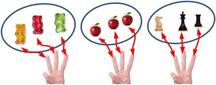
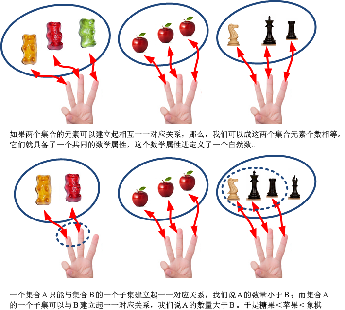

[题外话、自然数的正确打开方式](https://zhuanlan.zhihu.com/p/28595534)

我们看到，集合论在整个数学中所占有的基础性地位。事实上，集合论并不是那些搞所谓“元数学”和数论的少数爱钻牛角尖的怪咖数学家搞出来的、把简单的东西复杂化的理论，它本身所涉及到的基础理论，遍布数学的各个角落。比如说，作为一切算数的基础，自然数的定义。

你有没有仔细想过，什么是“自然数”？

对这个问题，你可能觉得它简单得很，你们的数学课早就学过，它包括一切非负整数。但是这个“定义”本身并不能称为一个定义，因为它用到了还未定义的“整数”，那么自然而然我们会问，什么是整数？事实上，自然数的含义比整数更加简单，更加接近直觉，从逻辑上讲，自然数才是一切数字的基础，由自然数定义整数是更加自然的选择。

那么，自然数究竟是什么呢？从直觉上讲，自然数表示的是物体的个数。但是越是接近直觉的东西，给出一个逻辑上严谨的定义就越是困难。我们必须从逻辑上弄明白，什么是“物体的个数”？

“个数”这个东东很看起来简单，你只要数一数就可以了。比如说五个苹果，7个人，等等，这难道不是很清楚的事情吗？事实上，不是这么简单。因为我们现在还没有定义“自然数”这个概念呢，你当然不能用自然数来表示物体的个数。这样的话，就成了逻辑循环：

*“什么是自然数？”*

*“它就是物体的个数”*

*“怎么表示物体的个数？”*

*“数一数就好了”。*

这没有什么意义。

我们回想一下我们还不识数的童年时代，那种懵懂无知却最接近直觉的状态其实是我们最好的老师。那个时候我们还不知道数是什么，但是我们已经有了“数量”的基本概念了。我们那时候是怎么来判断数量呢？比如说，绝大多数孩子都用过的，“掰手指头”。一个不识数的孩子，懂得用手指头来计算数量，这个背后，其实隐藏着一个对“数量”的最朴素的定义：**一一对应**！

当我们掰着手指头来计算一些事物 -- 比如说一盒糖果 --  数量多少的时候，其实就是用每一个手指来对应盒子中的每一颗糖果。我们数完所有的糖果后，就建立起了糖果与手指的一一对应。当我们面对两盒糖果，我们如何判断哪一盒多一些，哪一盒少一些呢？我们看着手指头，就可以知道了：比如说第一盒用光了我们左手的所有手指头，而第二盒除了左手，还用了右手的拇指，那么我们知道第二盒的糖果要多。如果两盒都用了同样的手指头，那么就说明两盒一样多。这个道理简单朴素，用集合论的语言表达，是这样的：

两盒糖果就是两个集合，第一盒的集合是X，第二盒的集合是Y，这两个集合合都包含一定的元素：糖果。而我们的手指头也是一个集合，我们称之为H。我们在对糖果进行计数的时候，把X或Y中的每个元素（一块糖）都与H中的一个元素（一根手指）按照某种规则对应起来，我们先后用如下的顺序从H中取出元素来与X或Y中的元素建立对应：

左手拇指→左手食指→左手中指→左手无名指→左手小拇指→右手拇指→右手食指→右手中指→右手无名指→右手小拇指

所有那些已经与X中的元素建立对应的H中的元素（手指），就成为一个H集合的子集，我们称之为CX。同样，与Y中的元素建立起一一对应的手指，就成为H的另一个子集，我们称之为CY。如果CX与CY相同，那么就表示第二盒糖果与第一盒一样多。比如：

CX=CY={左手拇指，左手食指，左手中指，左手无名指，左手小拇指}

另一种情形，如果CX的所有元素也同时属于CY，但是CY中有一些元素不属于CX，也就是说，CX完全包含于CY，比如：

CX={左手拇指，左手食指，左手中指}

CY={{左手拇指，左手食指，左手中指}，左手无名指，左手小拇指}

这就说明第一盒糖果数量小于第二盒。

在这个过程中，通过手指头的集合H按照一定的顺序建立一一对应的过程，我们可以对任意小于10个元素的集合进行计数。不论这些集合包含了什么，糖果也好，包子也好，石头也好，它们之间就有了一个共同的对比基础了。

所以，对于任意的集合，所有能够建立元素间一一对应的那些集合，我们说，它们的数量相等。比如说，所有与如下集合建立元素间一一对应的集合：

{左手拇指，左手食指，左手中指}

它们具有一个共同的数学性质：同样的数量。比如说，我们把这个数学性质起一个名字，叫做“3性”。当然，对应另外一组集合，它们与如下集合建立一一对应：

{左手拇指，左手食指，左手中指，左手无名指，左手小拇指}

它们也有一个共同的数学性质，我们也给它起一个名字叫做“5性”。以此类推，我们还可以有其他的诸如“8性”、“6性”等。自然数就是把这种“3性”、“5性”、“8性”……描述出来。我们定义所有与空集对应的集合称为0，与{左手拇指}这个集合一一对应的集合称为1，与{左手拇指，左手食指}这个集合一一对应的集合称为2，等等。

那么现在，我们定义一组专门用于计数的“标准”集合，比如

{ a }代表“1性”

{a, b }代表“2性”

{a,b,c }代表“3性”

{a,b,c,d }代表“4性”

……，

这一组“标准集合”有无穷多个。这一组集合的集合我们把它命名为N，它的元素是无穷多个集合，每个集合的元素都彼此不同。如果我们手里有一个陌生的集合X，我们需要判断它元素数目的多少，我们就从N中寻找它的一个元素n（这个元素本身是个集合），使得X的元素与n的元素能够建立起一一对应的关系，我们就可以用n来表示X中元素的个数了。对于任何一个集合，我们都可以在N中找到一个元素集合与之建立一一对应的关系，我们就有了一个统一的计数标准，这就是自然数。而这个N就是所有的这些用于计数的集合的集合，就是自然数集。这样一来，我们用这个自然数集来代替我们的手指，就免去了每次计数都要数手指头的尴尬了。这就是自然数定义的基本逻辑。

我们实质上是定义了一个集合，这个集合替代了我们的手指头来实现计数功能。实际上的操作，是通过了递归定义来实现的。这种定义首先定义出第一个自然数，比如说，0，然后根据0定义1，再根据1定义2，依此类推。这符合自然数作为“计数”的功能。

在用集合论定义自然数之前，有一种定义自然数的经典方法叫做皮亚诺算术，它对自然数的定义是基于5个公理之上的：

1、0是一个自然数。

2、每个自然数都有一个后继的自然数。

3、0不是任何自然数的后继数。

4、如果两个自然数的后继数相等，则这两个自然数相等。

5、如果一个论断对0成立，且它对一个自然数成立能够推出它对这个自然数的后继数同样成立，那么这个论断对一切自然数成立。

根据这5个公理，可以定义出全部的自然数。我们可以直观理解这一套公理：它对每一个自然数都定义一个后继数，就为所有的“个数”都定义一个数字来计量。然后，我们根据不同的“数制”对每一个自然数进行命名，比如说，在十进制下用这样的数字命名方式：

0

0的后继数：1

0的后继数的后继数：2

0的后继数的后继数的后继数：3

……

这就是我们所熟知的阿拉伯数字。

皮亚诺算术结构简明，操作性强，是一套非常经典的数字公理系统。但是，相比之下我还是更加喜欢用集合论来构建自然数的方法，它看起来更加符合数字背后的哲学。我这里来谈一下冯诺依曼的自然数构建方式。

与皮亚诺算术相似，冯诺依曼构建也是通过递归定义的方式，它所不同的是，它不是假定“0是自然数”，把它作为公理提出来，而是直接提出了一个“0”的构建方式，同时，他还提供了一个“后续数”的构建方式，而不是假定每个自然数都存在后续数。从某种程度上，通过这种后续数的构建方式，它在某种程度上定义了“1”。

在这种构建方式中，它每一个自然数都定义为一个集合。首先把0定义为一个不包含任何元素的集合，“空集”：

0={ }

这一点非常符合直觉：0本身表示的就是“空”。这种深层的含义是皮亚诺算术所不包含的。

那么，如何定义0的后续数（也就是1）呢？在集合论的自然数构建方式中，并非直接假定存在一个后续数，而是**构建**了这样一个后续数，并且这个后续数天然体现了“1性”。

什么是“1”呢？我们可以这么认为，“1”的含义就是，它 “**存在且唯一**”。请注意，这里的“唯一”与数字1无关，否则我们就是在用“1”循环定义“1”。“ 存在唯一”的含义是：  在一个集合中，首先，存在着某些元素，其次，对集合中的任意元素，找不出与之不同的其它元素。那么在集合论中，这个集合就存在着唯一的元素。那么这个集合的元素数量就具备了“1性”。

在集合论公理中，有一个东西天然地满足这种“存在唯一”的要求，就是空集本身。ZFC集合论中可以证明，空集是存在的，并且是唯一的。那么，顺理成章地，0的后续数，就可以定义为一个只包含了空集的集合（请注意，这个集合不是空集，空集没有任何元素，而这个集合包含了一个元素，这个元素是个集合 – 空集）。而根据0的定义，空集就是0，所以，0的后续数1就是一个只包含0元素的集合。

1={{}}={0}

既然“0”和“1”都定义清楚了，后学的数字就很自然而然了，只需要一个一个元素往上递加就好了：

2={0,1}

3={0,1,2}

……

i={0,1，……，i-1}

……

这里的递归规则就是，每一个自然数，都是在上一个自然数的集合中，把上一个自然数加进去（这个公式中的  表示的含义是两个集合的合并）：

这样一来，所有的自然数都被定义成为一个集合，这个集合的元素数目，就是这个自然数的真实含义。而这种递归定义，可以从“0”起始，不断前进，定义出全部的无穷多个自然数。

我们可以证明，自然数的集合论构建方法与皮亚诺算术大致上是等价的。

