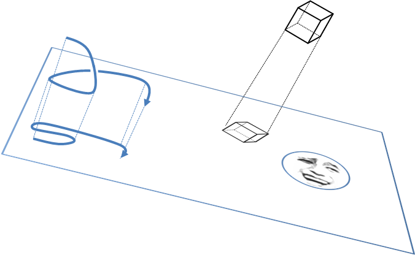
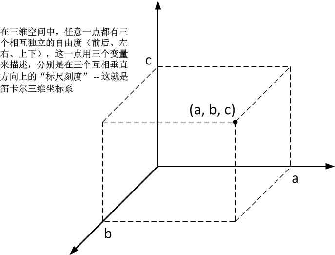
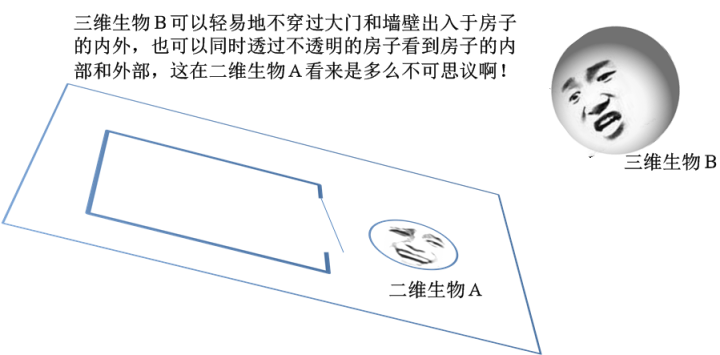
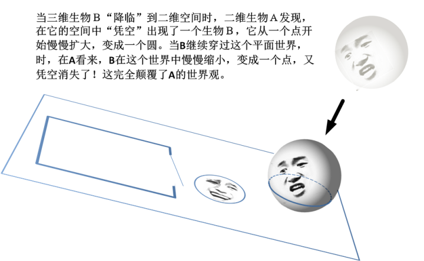
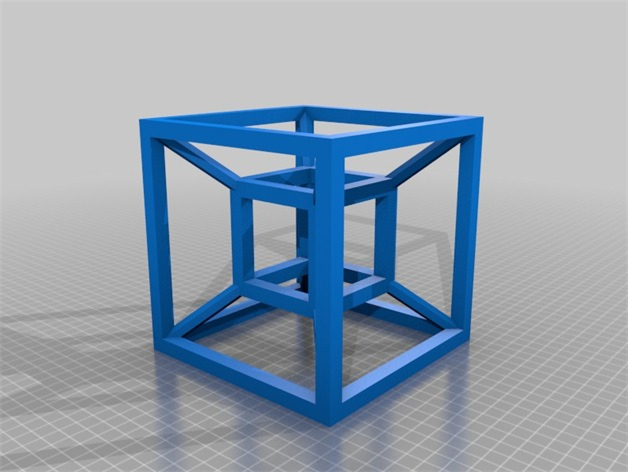
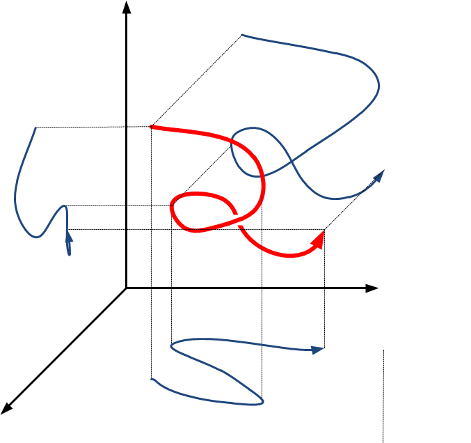
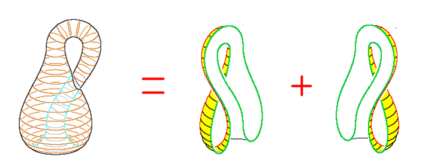

[题外话：如何想象一个高维空间？](https://zhuanlan.zhihu.com/p/28649321)

更新：

没想到在这个专栏里的这么多篇文章中，这一篇引起了最多的关注。说实在，在这一系列小文中，本文算是最不严肃的，可能也因此多了一些戏剧性，和很多讨论的热点和槽点。看了大家的评论，我想接着说明几点：

1、这篇东西，就像是题目所说，在个专栏里实际上是题外话。它与专栏的相关性仅仅在于涉及高维度的相空间而已。由于本专栏的一系列文章的最初对象是一个尚在初中的小姑娘，因此不可避免要加入一些有趣的、比较热点的话题来增加吸引力。而我们家姑娘由于看了小说《三体》，对里面的“降维打击”、“四维空间”很着迷，所以我跟着做了一些说明。目的之一是迎合她的兴趣，同时希望她不要被小说里凭空想象的东西误导。

2、本文中的所提到的高维空间，指的是动力学中的相空间，它**是一个抽象空间，而不是我们日常所理解的时空**。这个抽象空间的维度高得无法想象。所以请不要怀疑高维空间的存在与否。关于维度的绝大多数知识，都可以再《线性代数》或者是《线性算子》之类的教科书中找到。这里我不得不吐槽一下我们国内大学的线代教科书，一个字：烂到一塌糊涂！往往只注重实用性而完全忽略了逻辑性。一上来就讲行列式，什么鬼？！这里给大家推荐 Sheldonc Axler 写的《linear algebra done  right》（中文译作：线性代数应该这样学），非常棒的一本书。更进一步的，关于一般空间的曲面几何，可以参考微分几何之类的书籍。

3、**本文属于尽量通俗的科普，但是绝不是科幻读物。**本文提及一个假想的“二维生物”，其目的是想要用三维几何与二维几何之间的差别，来外推类比高维几何与三维几何的差别。毕竟那些东西超出了我们的直观想象力，对一个小姑娘来说，列举一大堆的抽象概念会立刻把她吓跑。所以，本文无意论证“二维生物”或“高维生物”是否存在，也无意讨论我们所处的时空的性质。所以大家看到其中的二维生物，不妨把它当做胡说八道的呓语。

4、想要真正学习知识的朋友们，不妨把本文当做一个**引发兴趣的起点**，而不是当做**学习知识的来源**。所谓“思而不学则殆”，真正的**知识可以起源于科普，但绝不是来自科普**。

5、如果你只是想脑洞大开，给自己增加乐趣，也不妨尽情展开想象力，如果能给你带来单纯的思维乐趣，也算是一件好事。高兴就好。

另外欢迎大家浏览讨论本专栏的其它文章。谢谢大家的兴趣，阅读愉快！

以上

=======================================================

在第5章，“用‘几何观’看世界”里面我们提到了高维空间。想象一个高维空间绝对是一件烧脑的事情，因为它远远超出了我们的日常经验。我不得不承认，我自己的空间想象能力弱爆了，所以我一直无法在自己的脑袋里形象化地想象出一个高维物体是个神马东东。但是，这里我还是试着带领你领略一下高维空间的奇妙之处，或许，在你的脑袋里面，能够想象出更加丰富多彩的东西。

我们经常会提到“**维度**”这个词，比如说，平面是一个2维空间，还有，我们可以去影院看3D电影（3D是 “3 dimensional”的缩写，意思就是三维），看到的就是立体的画面。那么什么是维度呢？

从几何的角度来说，维度可以形象化地想象成一个空间有几个相互垂直的“方向”。例如说，一条线，它只有“前后”1个方向，因而，我们把线叫做1维空间；平面中除了“前后”，还有“左右”的方向，因而，我们把平面叫做2维空间；而我们所生活的空间是一个立体的，除了“前后”、“左右”、还有“上下”的方向，所以我们把立体空间就叫做3维空间。而一个点，它是没有方向的，因此它就是一个零维空间。所以，我们可以把空间的一个维度看做空间中某个点的一个自由独立移动的方向，因此一个维度又叫做一个**自由度**。请注意，这里我强调，一个维度必须是一个“独立”的方向，这里“独立”两个字是什么意思呢？一言蔽之，是说这几个自由度的方向必须是互相垂直的（比如说，前后、左右、上下是互相垂直的）。因为只有互相垂直的方向，才能保证点在一个方向上移动时，不会影响它在另一个方向上的相对位置。也就是说，互相垂直的方向上的运动是相互“独立”的。假如说，我们说一个点向“左前”方移动，它同时变了前后的位置和左右的位置，那么这个方向就和“前后”或者“左右”不是独立的。我们的立体空间是三维的，其根本原因是，欧几里得几何里很容易证明，过一个点最多只能有三条直线互相两两垂直。

从数学抽象上来讲，我们把一个点在一个方向上的自由移动看做是这个点沿着这个方向上的一个“标尺”刻度的变化，这样，我们就可以用一个变量（标尺刻度）来描述这个点在这个方向上的移动，如果一个点只能在一个方向上变化（例如，前后），那么只需要一个变量就可以把这个点确定地描述下来。如果有两个方向上都可以自由变化呢，我们就需要两个变量来描述；相应地，3个方向上都可以自由移动的情况，我们就用三个变量来描述。

因而，我们可以说：***一个空间的维度，指的是空间中可以出现的两两垂直的方向最大数目，即某点任意独立移动的自由度的数目，也就是描述这个点位置所需要的自由变量的个数。\***

“点”、“线”、“面”、“体”这些几何概念在我们的大脑里，都非常符合我们的经验和直觉，我们想象这些东西都毫无困难。那么，高于3维的维度呢？它们又是什么？

推而广之，四维空间，就是具有四个自由度的空间，也就是说，空间中的每一个点都可以用四个独立变量来表示，或者说，是一个这样的空间：在这个空间中，过一个点，会存在四个方向互相两两垂直。

“这不可能，因为我们不能找到四个两两垂直的方向！”你可能会这么想，但是，这种想法只是基于我们日常所处的三维空间形成的经验来说的。**我们日常的经历中感觉不到高于3维的东西，这不是否定高维空间的理由。**为什么这样说呢？

假如说，有一种两维生物，它们至生活在一个两维的平面空间中。它们只知道前后和左右，它们没有任何“厚度”和上下的概念。在它们看来，一个平面就是世界的全部。对于这个平面“之外”的东西，它们完全无法理解，对它们而言，都是“虚空”。那么，它们也会有根深蒂固的想法：“过一点只能有两条相互垂直的直线，不可能再多了！”但是在我们这种三维世界中的人看来，这是多么可笑的想法啊。

我们进一步来展开想象力：我们看到一个“圆形”的二维生物，假设它的名字叫做A，A有一栋房子，当然，在二维的世界里，这个房子是没有高度的，它只是一个平面的矩形而已。然而就是这个矩形，把A所在的二维空间分割成了两个部分：内部和外部。在房子外面的A，是绝对不可能看到房子的内部的，并且，如果不开门，它也绝不可能不穿过房子的“墙壁”就进入到房子的内部。这在我们看来难免可笑，但是在A看来，这却是再天经地义不过了，就好像我们三维生物面对一个封闭的三维房子里一样：你也很难想象从房子外面“穿越”到房子里面而不经过大门或墙壁！

这时候，在这个二维世界的三维“外面”，有一个三维的“球形”生物，我们把它叫做B。在B看来，A的这些框框完全多余，它可以毫无障碍地从这个矩形的房子上面绕进房子里，而不必穿过任何大门或墙壁。并且，它也可以轻松地看穿觉不透明的墙壁，而同时看到房子的“内部”和“外部”。对可怜的A来说，这简直就是神一样的能力！

这时候，B突然童心大发，决定要对A说些什么，于是，它就开始对A谈话。然而A，作为一个对它所处的二维空间之外的维度完全无知的存在，就必然懵圈了，因为它丝毫感觉不到B的存在，但是，B对它的谈话，就这么毫无来由地从不知道什么地方冒出来了！它于是开始怀疑自己是否精神分裂或者得了什么妄想症了。

为了能够正常的沟通，这时候B决定“降临”到A所在的二维空间，与它直接对话。由于A只能感知到它所在的平面中的事物，当B开始下降并进入到A所在的平面时，A只能看到B与这个平面的交叉部分，也就是B的一个切面 –  一个圆。于是，A惊恐地发现，在它的空间中，“凭空”出现了一个生物，它从一个点开始慢慢扩大，变成一个圆。在A的平面思维中，它只能理解B是从“虚空”中无中生有地出现了，并且不断变大，而完全不了解B本来就存在于一个高维度的世界里。当B继续下降，穿过这个平面世界，到了它的“下方”时，在A看来，B在这个世界中的存在 – 一个圆，又慢慢缩小，变成一个点，又凭空消失了！这完全颠覆了A的世界观。

这就是一个只有二维想象力的生物，在遇到高维度几何时，所面临的困难。因为它完全没有三维空间的经验，因而，对于三维空间中所发生的事情，它完全没有办法进行直观的理解。我们在感叹这个二维生物的可怜时，不免想到，我们自身，不过只高了一个维度而已。我们对三维之外的维度，一样是无法直观理解的。因为我们的大脑只具备三维模型能力。

那么，一个二维生物有怎么来理解三维世界中发生的事情呢？既然它没有办法运用直觉的能力，就只能借助抽象了。事实上，对于我们三维生物，从数学上我们可以任意定义N维空间，N甚至可以是无穷大。这个定义过程我这里不多说，将来你学习《线性代数》的时候，就会知道它的具体过程。这里我仍然以二维生物为例，来说一下它如何尽量地通过直觉来理解三维世界。

其实很简单，它可以通过**“投影**”的方式。也就是说，把一个高维度的几何通过投影的方式，映射到二维的平面上，它就可以根据不同方向上投影的形状，来想象这个三维的形状。例如，在高维空间中的一条线，投影到二维平面上，它仍然是一条线，只不过形状有所变化而已。一个立方体，投影到平面上，就是一个由若干平行四边形组成的平面图形，在二维生物看来，立方体的一个顶点出发的三条棱，在平面投影中是不可能互相垂直的 – 因为平面中不可能存在三条相互垂直的直线。但是，它可以从这个投影中来想象三维空间中的三条相互垂直的直线。

三维几何体在二维平面中的投影就变成了一些平面的几何体，那么，我们在三维空间中看到的立体结构，也可以看做是高维几何体在我们三维世界的投影。同样地，我们无法直观想象一个高维几何体的性质（例如，你同时可以看到一个人的外表和他的肠子内脏，你同时看到一个几何体的正面和反面，外面和里面，你不必穿过一个封闭的面就可以跑到它的“反面”）。就像是一个二维生物很难理解某些嵌入三维空间中的二维平面一样（例如莫比乌斯带），有些“嵌入到”高维空间的三维形状对我们来说也是难以想象的[[1\]](https://zhuanlan.zhihu.com/write#_ftn1)。但是，我们可以想象那些高维几何体在我们三维世界的投影。这个非常有趣，例如，一个“四维超立方体”（Tesseract）在我们三维世界的投影就是下图这样的：它每个顶点有四条棱，这四条棱在四维空间中两两垂直，但是在我们的三维空间中，显然有一条棱是不与其他棱垂直的，这是因为投影到三维空间必然发生的变形所致。

任何一个高维形状，在低维空间中的投影的维度，都不可能增加，比如说，三维空间中的一条线（一条线是一维的几何体），在平面上的投影，它的维度只能是一维或零维，而不可能成为2维或以上。也就是说，线的投影永远都是线或者是一个点。当然，高维中一条不交叉的线，在低维看来，可能是交叉的（因为它的投影重叠了）。如下图所示：

我们前面说到，系统的演化是高维空间中的轨迹线，既然线的投影只能是线，那么，我们就可以用三维空间或两维空间中的线，来代替高维空间中的轨迹线来想象系统的演化。这就是后面一切形象化思维的基础。因此，在相空间中所涉及到的高维几何，其实我们完全可以忽略，当做普通的三维几何甚至平面几何来想象。这会省掉我们无数的脑细胞。

但是，高维几何在近代物理中，有着非常独特的地位。例如，相对论就是建立在四维几何基础上的。在相对论中，时间和空间是互相不可分的，因而我们这个世界的时空，就被看做是三维的空间加上一维的时间共同组成的一个四维几何。（你可以想象一下，前面的三维生物B在进入二维世界时，A所看到的，是一个B在这个世界中随着时间的变化。而反过来，如果A能够理解第三个维度的话，它就可以把B随时间变化的过程“还原”成为B在高维空间中的几何形状。因而就可以进一步舍弃常规的“时间”概念，而把时间当做一个更高的维度。）因而产生了非常多的有意思的结论。例如，**我们所在的世界，其实是一个嵌入在四维空间中的一个“弯曲”的空间，**它是有限的，但是却没有边界。这有点超出我们范围太多，我就不多说了。 

相关文章：[5、用“几何观”看世界](https://zhuanlan.zhihu.com/p/28557211)；[6、用“几何观”看不确定性](https://zhuanlan.zhihu.com/p/28559144)

本专栏：[魔鬼眼中的自然界](https://zhuanlan.zhihu.com/c_116602381)

*[[1\]](https://zhuanlan.zhihu.com/write#_ftnref1)  例如克莱因瓶，就是一种奇怪的嵌入四维空间中的三维几何体，你不必穿过瓶子的壁就可以进入到瓶子里面。就好像二维世界的人很难理解莫比乌斯带一样。事实上，克莱因瓶就是一个四面完全封闭的莫比乌斯带，正因为它是封闭的，它只能嵌入在四维空间中。下图是一个这个瓶子在三维空间中的投影。我们看到，把这个瓶子剖开，它就是两个莫比乌斯带拼起来的。*

*这个克莱因瓶与莫比乌斯带相比，是有一个关键的不同，就是它的面与自己交叉了。但事实上不是这样的，因为克莱因瓶是一个只能嵌入在四维空间中的几何体，我们所能够视觉上表示出来的，只能是这个几何体在三维空间的一个投影。原本在高维空间中不交叉的面，它们的投影就交叉起来了。我们只能这样来想象：这个瓶子的“脖子”并不是从自己的“体表”穿进自己的“肚子”里面的，而是从更高维的“虚空”中穿进去的！*

